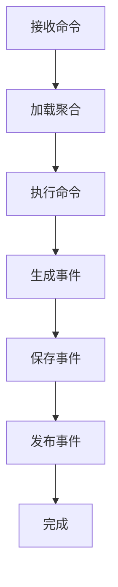

事件源模式（Event Sourcing）作为一种创新的架构模式，正在改变我们存储和管理应用程序状态的方式。与传统的状态存储方式不同，事件源模式将系统的状态变化存储为一系列不可变的事件，而不是存储当前状态。这种方法不仅提供了完整的审计轨迹，还支持状态重建、时态查询等强大功能。本文将深入探讨事件源模式的核心概念、实现机制、事件存储的设计，以及在实际应用中的最佳实践。

## 事件源模式概述

### 什么是事件源模式

事件源模式是一种架构模式，其中系统的状态变化被存储为一系列不可变的事件，而不是存储当前状态。通过重放这些事件，可以重建系统的任何历史状态。每个事件都代表了一个已经发生的事实，是不可变的、自包含的，并且按时间顺序存储。

### 核心理念

事件源模式的核心理念是"状态是事件的投影"。系统的当前状态不是直接存储的，而是通过应用一系列事件来计算得出的。这种设计带来了以下重要价值：

1. **完整审计轨迹**：记录了系统状态变化的完整历史
2. **状态重建**：可以通过重放事件重建任何历史状态
3. **时态查询**：可以查询系统在任意时间点的状态
4. **业务洞察**：通过分析事件序列获得业务洞察

## 核心概念

### 事件（Event）

事件是事件源模式的基本单位，表示系统中发生的事实。

#### 特性
- **不可变性**：一旦创建就不能修改
- **自包含性**：包含处理所需的所有信息
- **时间戳**：记录事件发生的时间
- **唯一标识**：每个事件都有唯一标识符

#### 示例
```java
public final class AccountCreatedEvent {
    private final String accountId;
    private final String owner;
    private final BigDecimal initialBalance;
    private final long timestamp;
    private final String eventId;
    
    // 构造函数和getter方法
}
```

### 聚合根（Aggregate Root）

聚合根是事件源模式中的核心概念，代表业务领域中的实体，负责维护事件的一致性。

#### 职责
- **状态管理**：维护聚合的当前状态
- **业务规则**：执行业务规则验证
- **事件生成**：根据命令生成相应的事件
- **一致性保证**：确保聚合内部的一致性

#### 示例
```java
public class BankAccount {
    private String accountId;
    private String owner;
    private BigDecimal balance;
    private List<Event> uncommittedEvents = new ArrayList<>();
    
    // 应用事件更新状态
    public void apply(Event event) {
        if (event instanceof AccountCreatedEvent) {
            apply((AccountCreatedEvent) event);
        } else if (event instanceof MoneyDepositedEvent) {
            apply((MoneyDepositedEvent) event);
        } else if (event instanceof MoneyWithdrawnEvent) {
            apply((MoneyWithdrawnEvent) event);
        }
    }
    
    private void apply(AccountCreatedEvent event) {
        this.accountId = event.getAccountId();
        this.owner = event.getOwner();
        this.balance = event.getInitialBalance();
    }
    
    private void apply(MoneyDepositedEvent event) {
        this.balance = this.balance.add(event.getAmount());
    }
    
    private void apply(MoneyWithdrawnEvent event) {
        this.balance = this.balance.subtract(event.getAmount());
    }
    
    // 业务方法
    public void deposit(BigDecimal amount) {
        // 业务规则验证
        if (amount.compareTo(BigDecimal.ZERO) <= 0) {
            throw new IllegalArgumentException("Amount must be positive");
        }
        
        // 生成事件
        MoneyDepositedEvent event = new MoneyDepositedEvent(
            accountId,
            amount,
            System.currentTimeMillis()
        );
        
        // 应用事件
        apply(event);
        
        // 记录未提交事件
        uncommittedEvents.add(event);
    }
}
```

### 事件存储（Event Store）

事件存储是专门用于存储事件的持久化存储系统，通常是一个只追加的存储。

#### 核心特性
- **只追加**：事件一旦写入就不能修改或删除
- **持久化**：确保事件不会因系统故障而丢失
- **可查询**：支持按聚合ID、事件类型、时间等条件查询事件
- **可回放**：支持重放事件序列重建聚合状态

#### 实现方式
```java
public interface EventStore {
    // 保存事件
    void saveEvents(String aggregateId, List<Event> events, int expectedVersion);
    
    // 获取事件
    List<Event> getEventsForAggregate(String aggregateId);
    
    // 获取事件流
    EventStream getEventStream(String aggregateId, int startVersion, int endVersion);
}
```

### 快照（Snapshot）

为了提高性能，定期对聚合根的状态进行快照，避免重放过多事件。

#### 作用
- **性能优化**：减少事件重放的数量
- **启动加速**：加快聚合根的初始化速度
- **存储优化**：减少事件存储的压力

#### 实现示例
```java
public class Snapshot {
    private String aggregateId;
    private int version;
    private Object state;
    private long timestamp;
    
    // 构造函数和getter方法
}

public interface SnapshotStore {
    void saveSnapshot(Snapshot snapshot);
    Snapshot getLatestSnapshot(String aggregateId);
}
```

## 工作原理

### 命令处理流程

1. **接收命令**：系统接收来自外部的命令
2. **加载聚合**：从事件存储中加载聚合的事件并重建状态
3. **执行命令**：在聚合上执行命令
4. **生成事件**：命令执行成功后生成相应的事件
5. **保存事件**：将新生成的事件保存到事件存储中
6. **发布事件**：将事件发布给订阅者



### 状态重建流程

1. **获取快照**：从快照存储中获取最新的快照
2. **加载事件**：从事件存储中加载快照之后的事件
3. **应用事件**：按顺序应用事件更新聚合状态
4. **返回聚合**：返回重建后的聚合

```java
public BankAccount loadAccount(String accountId) {
    // 1. 获取最新快照
    Snapshot snapshot = snapshotStore.getLatestSnapshot(accountId);
    BankAccount account;
    
    if (snapshot != null) {
        // 2. 从快照恢复状态
        account = (BankAccount) snapshot.getState();
        // 3. 加载快照之后的事件
        List<Event> events = eventStore.getEventsForAggregate(
            accountId, snapshot.getVersion() + 1);
        // 4. 应用事件
        events.forEach(account::apply);
    } else {
        // 从头开始重建
        account = new BankAccount();
        List<Event> events = eventStore.getEventsForAggregate(accountId);
        events.forEach(account::apply);
    }
    
    return account;
}
```

## 事件存储设计

### 存储结构

#### 事件表结构
```sql
CREATE TABLE events (
    event_id UUID PRIMARY KEY,
    aggregate_id VARCHAR(255) NOT NULL,
    aggregate_type VARCHAR(255) NOT NULL,
    event_type VARCHAR(255) NOT NULL,
    event_version INT NOT NULL,
    event_data JSONB NOT NULL,
    occurred_at TIMESTAMP NOT NULL,
    created_at TIMESTAMP NOT NULL DEFAULT CURRENT_TIMESTAMP
);

CREATE INDEX idx_events_aggregate_id ON events(aggregate_id);
CREATE INDEX idx_events_event_type ON events(event_type);
CREATE INDEX idx_events_occurred_at ON events(occurred_at);
```

#### 快照表结构
```sql
CREATE TABLE snapshots (
    aggregate_id VARCHAR(255) PRIMARY KEY,
    aggregate_type VARCHAR(255) NOT NULL,
    snapshot_data JSONB NOT NULL,
    version INT NOT NULL,
    created_at TIMESTAMP NOT NULL DEFAULT CURRENT_TIMESTAMP
);
```

### 存储策略

#### 分区策略
- **按聚合类型分区**：不同类型的聚合存储在不同的表中
- **按时间分区**：按时间范围对事件进行分区
- **按聚合ID分区**：将相关聚合的事件存储在一起

#### 索引策略
- **聚合ID索引**：加速按聚合ID查询事件
- **事件类型索引**：加速按事件类型查询
- **时间戳索引**：支持时间范围查询

## 优势与挑战

### 优势

#### 完整审计轨迹
事件源模式记录了系统状态变化的完整历史，为审计和合规提供了强有力的支持。

#### 状态重建能力
可以通过重放事件重建系统的任何历史状态，支持时态查询和数据分析。

#### 业务洞察
通过分析事件序列可以获得深入的业务洞察，发现业务模式和趋势。

#### 并发控制
通过版本控制机制实现乐观并发控制，避免并发冲突。

### 挑战

#### 复杂性
事件源模式增加了系统的复杂性，需要处理事件版本、快照等概念。

#### 查询性能
对于复杂的查询，可能需要重放大量事件，影响查询性能。

#### 存储成本
需要存储所有的事件，存储成本相对较高。

#### 学习曲线
团队需要学习新的概念和模式，有一定的学习成本。

## 最佳实践

### 事件设计
- **幂等性**：确保事件处理的幂等性
- **版本控制**：为事件格式设计版本控制机制
- **数据完整性**：确保事件包含处理所需的完整信息

### 性能优化
- **快照机制**：定期创建快照减少事件重放
- **批量处理**：支持批量事件处理
- **缓存机制**：合理使用缓存减少重复计算

### 错误处理
- **事件验证**：在保存事件前进行验证
- **一致性保证**：确保事件保存的原子性
- **监控告警**：建立监控机制及时发现和处理异常

### 运维管理
- **备份策略**：制定完善的事件存储备份策略
- **监控指标**：监控事件存储的性能指标
- **容量规划**：根据业务增长规划存储容量

## 实际应用案例

### 银行业务系统
在银行业务系统中，事件源模式可以完美地记录账户的所有交易历史，支持审计和合规要求。

### 电商订单系统
在电商订单系统中，可以记录订单从创建到完成的完整生命周期，支持订单状态查询和分析。

### 内容管理系统
在内容管理系统中，可以记录文档的所有修改历史，支持版本控制和协作编辑。

## 总结

事件源模式通过将系统状态变化存储为一系列不可变的事件，为构建可审计、可追溯的分布式系统提供了强大的支持。它不仅提供了完整的审计轨迹，还支持状态重建、时态查询等强大功能。

然而，事件源模式也带来了复杂性增加、查询性能等挑战。在实际应用中，我们需要根据具体的业务需求和技术约束，合理设计和实现基于事件源的系统，同时建立完善的监控和治理机制。

在后续章节中，我们将深入探讨CQRS模式，了解如何将事件源模式与CQRS结合使用，构建更加完善的分布式系统。