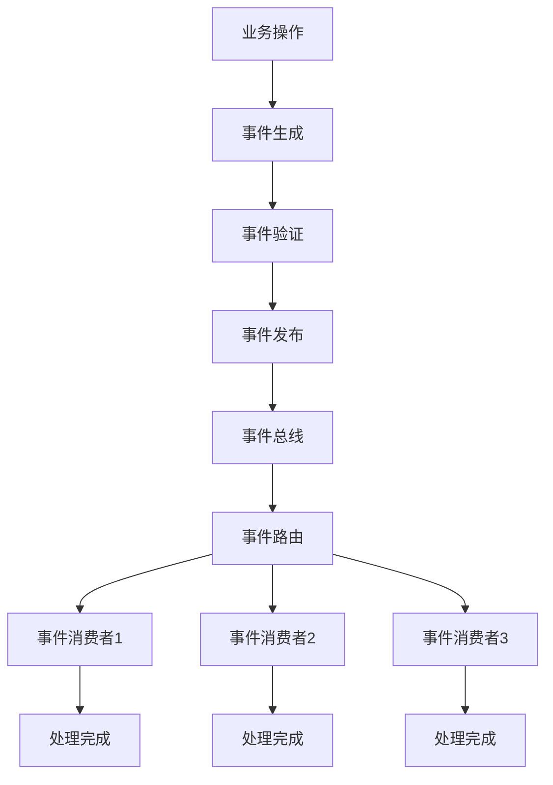

事件驱动架构（Event-Driven Architecture, EDA）作为一种重要的软件架构模式，正在现代分布式系统设计中发挥着越来越重要的作用。它通过事件的产生、发布和消费机制，实现了系统组件之间的松耦合，为构建高可扩展性、高可靠性的分布式系统提供了强大的支持。本文将深入探讨事件驱动架构的核心概念、工作原理、组件构成以及在实际应用中的最佳实践。

## 什么是事件驱动架构

事件驱动架构是一种软件架构模式，其中组件和服务通过事件进行通信和协作。在EDA中，当某个事件发生时，会产生一个事件消息，该消息会被发布到事件总线或消息队列，订阅该事件的服务会接收到通知并进行处理。

### 核心思想

事件驱动架构的核心思想是"发布-订阅"模式，它将系统的关注点从"请求-响应"转向"事件-处理"。这种转变带来了以下重要价值：

1. **松耦合**：生产者和消费者不需要直接通信，降低了系统组件之间的耦合度
2. **异步处理**：支持异步事件处理，提高系统响应性
3. **可扩展性**：支持水平扩展，提高系统处理能力
4. **容错性**：通过事件持久化和重试机制提高系统可靠性

## 核心组件

### 事件生产者（Event Producer）

事件生产者是事件驱动架构中的起点，负责在业务逻辑中检测到特定事件时创建并发布事件。

#### 职责
- **事件检测**：监控业务流程，识别需要发布的事件
- **事件创建**：创建包含必要信息的事件对象
- **事件发布**：将事件发送到事件总线或消息队列

#### 实现示例
```java
public class OrderService {
    private EventBus eventBus;
    
    public void createOrder(Order order) {
        // 业务逻辑：创建订单
        orderRepository.save(order);
        
        // 创建并发布事件
        OrderCreatedEvent event = new OrderCreatedEvent(
            order.getId(),
            order.getUserId(),
            order.getAmount(),
            System.currentTimeMillis()
        );
        
        eventBus.publish(event);
    }
}
```

### 事件消费者（Event Consumer）

事件消费者订阅感兴趣的事件，并在事件发生时执行相应的处理逻辑。

#### 职责
- **事件订阅**：订阅感兴趣的事件类型
- **事件处理**：接收到事件后执行相应的业务逻辑
- **错误处理**：处理事件处理过程中可能出现的异常

#### 实现示例
```java
public class InventoryService {
    @EventListener
    public void handleOrderCreated(OrderCreatedEvent event) {
        try {
            // 业务逻辑：扣减库存
            inventoryRepository.decreaseStock(event.getOrderId(), event.getAmount());
            
            // 发布库存扣减完成事件
            InventoryDecreasedEvent inventoryEvent = new InventoryDecreasedEvent(
                event.getOrderId(),
                event.getAmount()
            );
            eventBus.publish(inventoryEvent);
        } catch (Exception e) {
            // 处理异常，可能需要发布失败事件
            handleError(event, e);
        }
    }
}
```

### 事件总线/消息队列（Event Bus/Message Queue）

事件总线或消息队列是事件驱动架构的核心基础设施，负责事件的传递、路由和管理。

#### 核心功能
- **事件路由**：根据事件类型将事件路由到相应的消费者
- **事件存储**：临时或持久化存储事件
- **负载均衡**：在多个消费者实例间分配事件
- **可靠性保证**：确保事件不丢失

#### 常见实现
- **Apache Kafka**：高吞吐量的分布式流处理平台
- **RabbitMQ**：功能丰富的消息队列系统
- **Amazon SQS**：云原生的消息队列服务
- **Azure Event Grid**：云原生的事件路由服务

### 事件存储（Event Store）

事件存储用于持久化存储事件，支持事件回放、审计和系统状态重建。

#### 特性
- **只追加**：事件一旦写入就不能修改
- **持久化**：确保事件不会因系统故障而丢失
- **可查询**：支持按事件类型、时间等条件查询事件
- **可回放**：支持重放历史事件重建系统状态

## 工作原理

### 事件生命周期

1. **事件产生**：业务逻辑中发生特定事件，事件生产者创建事件对象
2. **事件验证**：验证事件的有效性和完整性
3. **事件发布**：事件生产者将事件发布到事件总线
4. **事件路由**：事件总线根据路由规则将事件分发给相应的消费者
5. **事件处理**：事件消费者接收到事件并执行相应的处理逻辑
6. **事件确认**：消费者处理完成后向事件总线发送确认
7. **事件归档**：处理完成的事件被归档或删除

### 事件处理流程



## 事件设计原则

### 事件命名规范
- **过去时态**：事件名称应使用过去时态，表示已经发生的事实
- **业务相关**：事件名称应反映业务含义
- **具体明确**：避免过于宽泛的事件名称

```java
// 好的事件命名
public class OrderCreatedEvent {}
public class PaymentProcessedEvent {}
public class UserRegisteredEvent {}

// 不好的事件命名
public class OrderEvent {}  // 过于宽泛
public class CreateOrderEvent {}  // 不是过去时态
```

### 事件数据结构
- **不可变性**：事件对象应该是不可变的
- **自包含**：事件应包含处理所需的所有信息
- **版本控制**：为事件设计版本控制机制

```java
public final class OrderCreatedEvent {
    private final String orderId;
    private final String userId;
    private final BigDecimal amount;
    private final long timestamp;
    
    // 构造函数和getter方法
    // 注意：没有setter方法，确保不可变性
}
```

### 事件粒度
- **适度粒度**：事件粒度既不能太粗也不能太细
- **业务原子性**：每个事件应代表一个业务原子操作
- **避免冗余**：避免发布可以通过其他事件推导出的信息

## 通信模式

### 点对点模式
一个事件只能被一个消费者处理，适用于任务分发场景。

### 发布/订阅模式
一个事件可以被多个消费者处理，适用于广播通知场景。

### 请求/响应模式
通过事件实现异步的请求/响应模式。

## 优势与挑战

### 优势
1. **松耦合**：生产者和消费者之间完全解耦
2. **可扩展性**：支持水平扩展
3. **可靠性**：通过持久化和重试机制确保可靠性
4. **灵活性**：支持复杂的业务流程编排

### 挑战
1. **复杂性**：系统复杂性增加
2. **调试困难**：异步处理使得调试更加困难
3. **最终一致性**：只能保证最终一致性
4. **事件管理**：需要完善的事件治理机制

## 最佳实践

### 事件设计
- **幂等性**：确保事件处理的幂等性
- **版本控制**：为事件格式设计版本控制机制
- **数据完整性**：确保事件包含处理所需的完整信息

### 错误处理
- **重试机制**：实现合理的重试机制
- **死信队列**：处理失败的事件放入死信队列
- **监控告警**：建立监控机制及时发现和处理异常

### 性能优化
- **批量处理**：支持批量事件处理
- **异步处理**：使用异步方式提高处理效率
- **缓存机制**：合理使用缓存减少重复计算

## 总结

事件驱动架构通过其松耦合、异步处理、可扩展等特性，为构建现代分布式系统提供了强大的支持。理解事件驱动架构的核心概念和工作原理，有助于我们在实际项目中更好地应用这一架构模式。

然而，事件驱动架构也带来了复杂性增加、调试困难等挑战。在实际应用中，我们需要根据具体的业务需求和技术约束，合理设计和实现基于事件的系统，同时建立完善的监控和治理机制。

在后续章节中，我们将深入探讨事件源模式和CQRS模式，了解如何将事件驱动架构与这些模式结合使用，构建更加完善的分布式系统。