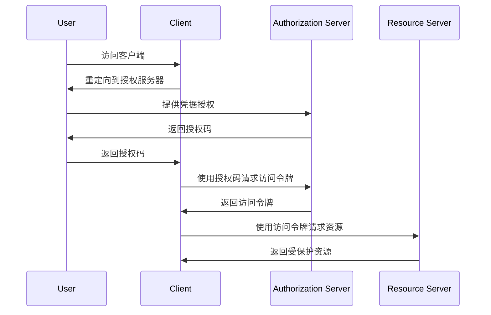
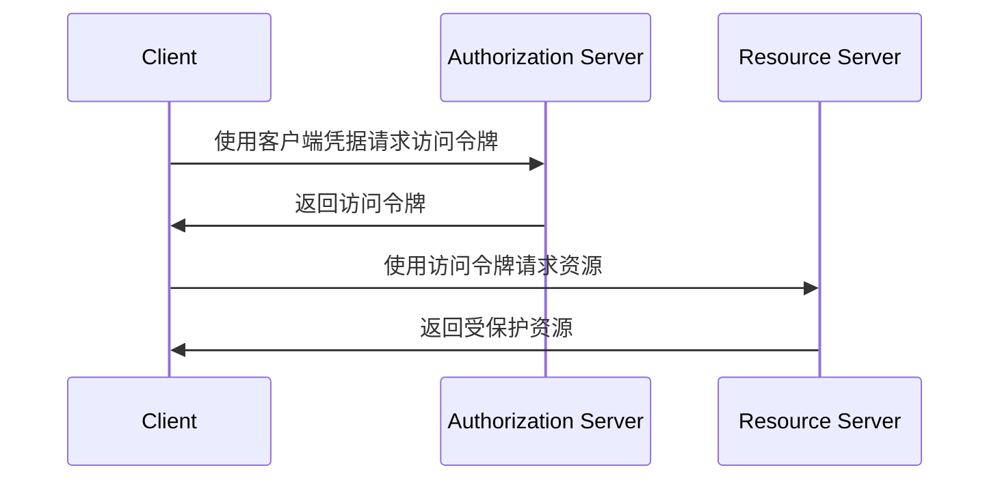

在微服务架构中，身份认证和授权是确保服务间通信安全的基础。随着系统复杂性的增加和服务交互的频繁化，传统的安全机制已经无法满足分布式系统的安全需求。OAuth2和JWT作为现代身份认证和授权的标准解决方案，在微服务架构中发挥着至关重要的作用。本文将深入探讨OAuth2协议和JWT令牌的核心概念、工作机制、在微服务中的应用场景以及最佳实践。

## 身份认证与授权基础

### 身份认证（Authentication）
身份认证是验证用户或服务身份的过程，确保"你是谁"。在微服务架构中，身份认证需要解决以下挑战：
- 如何在分布式环境中验证身份
- 如何避免重复认证
- 如何处理服务间通信的身份验证

### 授权（Authorization）
授权是确定经过身份验证的用户或服务可以访问哪些资源的过程，确保"你能做什么"。在微服务架构中，授权需要解决：
- 细粒度的权限控制
- 跨服务的权限传递
- 动态权限管理

## OAuth2协议详解

### OAuth2概述
OAuth2是一个开放标准的授权框架（RFC 6749），允许第三方应用在用户授权的情况下访问用户资源，而无需获取用户的密码。虽然OAuth2主要用于授权，但在微服务架构中，它也被广泛用于身份认证。

### 核心角色

#### 资源所有者（Resource Owner）
拥有资源的实体，通常是用户。

#### 客户端（Client）
请求访问资源的应用程序。

#### 资源服务器（Resource Server）
存储用户资源的服务器。

#### 授权服务器（Authorization Server）
验证用户身份并颁发令牌的服务器。

### 四种授权模式

#### 1. 授权码模式（Authorization Code）
这是最安全和最完整的OAuth2模式，适用于有后端的Web应用。

##### 工作流程


##### 适用场景
- 传统的Web应用程序
- 移动应用程序
- 任何有后端服务的应用

#### 2. 隐式模式（Implicit）
适用于纯前端应用，如单页应用（SPA）。

##### 工作流程
```
1. 用户访问客户端应用
2. 客户端将用户重定向到授权服务器
3. 用户在授权服务器上进行身份验证和授权
4. 授权服务器将访问令牌直接返回给客户端（通过URL片段）
```

##### 适用场景
- 单页应用程序（SPA）
- 移动应用程序的某些场景

#### 3. 密码模式（Resource Owner Password Credentials）
用户直接向客户端提供用户名和密码。

##### 工作流程
```
1. 用户向客户端提供用户名和密码
2. 客户端使用用户凭据向授权服务器请求访问令牌
3. 授权服务器验证凭据并返回访问令牌
```

##### 适用场景
- 高度信任的官方客户端应用
- 遗留系统迁移

#### 4. 客户端凭证模式（Client Credentials）
适用于服务间通信的身份认证。

##### 工作流程


##### 适用场景
- 服务间通信
- 访问应用自己的API
- 后台服务任务

## JWT（JSON Web Token）详解

### JWT概述
JWT是一种开放标准（RFC 7519），定义了一种紧凑且自包含的方式，用于在各方之间安全地传输信息。JWT由三部分组成，用点（.）分隔。

### JWT结构

#### 1. 头部（Header）
包含令牌类型和签名算法：
```json
{
  "alg": "HS256",
  "typ": "JWT"
}
```

#### 2. 载荷（Payload）
包含声明（claims）：
```json
{
  "sub": "1234567890",
  "name": "John Doe",
  "iat": 1516239022,
  "exp": 1516242622,
  "scope": "read:users write:users"
}
```

#### 3. 签名（Signature）
用于验证令牌的完整性：
```
HMACSHA256(
  base64UrlEncode(header) + "." +
  base64UrlEncode(payload),
  secret
)
```

### JWT类型

#### 1. 无签名JWT
不包含签名部分，仅用于传输信息。

#### 2. 签名JWT
包含签名，用于验证令牌的完整性和真实性。

#### 3. 加密JWT
不仅签名，还对载荷进行加密。

### JWT优势

#### 无状态性
服务器无需存储会话信息，令牌本身包含所有必要信息。

#### 跨域支持
可以在不同域之间传递，适用于分布式系统。

#### 自包含性
包含用户信息，减少数据库查询。

#### 可扩展性
可以轻松添加自定义声明。

## 在微服务中的应用

### 服务间通信认证

#### 使用OAuth2客户端凭证模式
```java
@Service
public class ServiceAuthenticationService {
    
    @Value("${auth.server.url}")
    private String authServerUrl;
    
    @Value("${client.id}")
    private String clientId;
    
    @Value("${client.secret}")
    private String clientSecret;
    
    public String getAccessToken() {
        WebClient webClient = WebClient.create(authServerUrl);
        
        String credentials = Base64.getEncoder().encodeToString(
            (clientId + ":" + clientSecret).getBytes());
            
        return webClient.post()
            .uri("/oauth/token")
            .header("Authorization", "Basic " + credentials)
            .bodyValue("grant_type=client_credentials")
            .retrieve()
            .bodyToMono(TokenResponse.class)
            .map(TokenResponse::getAccessToken)
            .block();
    }
}
```

#### 使用JWT进行服务间认证
```java
@Component
public class JwtService {
    
    @Value("${jwt.secret}")
    private String secret;
    
    public String generateServiceToken(String serviceName) {
        return Jwts.builder()
            .setSubject(serviceName)
            .claim("service", true)
            .claim("scope", "internal")
            .setIssuedAt(new Date())
            .setExpiration(new Date(System.currentTimeMillis() + 3600000))
            .signWith(SignatureAlgorithm.HS256, secret)
            .compact();
    }
    
    public Claims validateToken(String token) {
        try {
            return Jwts.parser()
                .setSigningKey(secret)
                .parseClaimsJws(token)
                .getBody();
        } catch (JwtException e) {
            throw new InvalidTokenException("Invalid token", e);
        }
    }
}
```

### API网关集成

#### 身份验证过滤器
```java
@Component
public class AuthenticationFilter implements GlobalFilter {
    
    @Autowired
    private JwtService jwtService;
    
    @Override
    public Mono<Void> filter(ServerWebExchange exchange, GatewayFilterChain chain) {
        String authHeader = exchange.getRequest()
            .getHeaders().getFirst("Authorization");
            
        if (authHeader != null && authHeader.startsWith("Bearer ")) {
            String token = authHeader.substring(7);
            try {
                Claims claims = jwtService.validateToken(token);
                // 将用户信息添加到请求上下文中
                exchange.getAttributes().put("user", claims.getSubject());
            } catch (InvalidTokenException e) {
                exchange.getResponse().setStatusCode(HttpStatus.UNAUTHORIZED);
                return exchange.getResponse().setComplete();
            }
        }
        
        return chain.filter(exchange);
    }
}
```

#### 权限验证过滤器
```java
@Component
public class AuthorizationFilter implements GlobalFilter {
    
    @Override
    public Mono<Void> filter(ServerWebExchange exchange, GatewayFilterChain chain) {
        String requiredScope = getRequiredScope(exchange.getRequest());
        Claims claims = exchange.getAttribute("user_claims");
        
        if (claims != null && hasRequiredScope(claims, requiredScope)) {
            return chain.filter(exchange);
        }
        
        exchange.getResponse().setStatusCode(HttpStatus.FORBIDDEN);
        return exchange.getResponse().setComplete();
    }
    
    private boolean hasRequiredScope(Claims claims, String requiredScope) {
        List<String> scopes = claims.get("scope", List.class);
        return scopes != null && scopes.contains(requiredScope);
    }
}
```

## 安全考虑

### JWT安全最佳实践

#### 选择合适的签名算法
```java
// 推荐使用RS256（非对称加密）
KeyPair keyPair = KeyPairGenerator.getInstance("RSA")
    .generateKeyPair();

String token = Jwts.builder()
    .setSubject("user123")
    .signWith(keyPair.getPrivate(), SignatureAlgorithm.RS256)
    .compact();
```

#### 设置合理的过期时间
```java
// 设置较短的过期时间（例如15分钟）
Date expiration = new Date(System.currentTimeMillis() + 900000);

String token = Jwts.builder()
    .setSubject("user123")
    .setExpiration(expiration)
    .signWith(secretKey)
    .compact();
```

#### 实现令牌刷新机制
```java
public class TokenRefreshService {
    
    public TokenPair refreshTokens(String refreshToken) {
        // 验证刷新令牌
        if (!isValidRefreshToken(refreshToken)) {
            throw new InvalidTokenException("Invalid refresh token");
        }
        
        // 生成新的访问令牌和刷新令牌
        String newAccessToken = generateAccessToken(getUserIdFromToken(refreshToken));
        String newRefreshToken = generateRefreshToken(getUserIdFromToken(refreshToken));
        
        return new TokenPair(newAccessToken, newRefreshToken);
    }
}
```

### OAuth2安全最佳实践

#### 使用PKCE（Proof Key for Code Exchange）
```java
// 生成代码挑战
String codeVerifier = generateCodeVerifier();
String codeChallenge = generateCodeChallenge(codeVerifier);

// 授权请求中包含代码挑战
String authorizationUrl = authServerUrl + 
    "?response_type=code" +
    "&client_id=" + clientId +
    "&redirect_uri=" + redirectUri +
    "&code_challenge=" + codeChallenge +
    "&code_challenge_method=S256";
```

#### 实施适当的令牌撤销机制
```java
@RestController
public class TokenRevocationController {
    
    @PostMapping("/revoke")
    public ResponseEntity<?> revokeToken(
            @RequestParam("token") String token,
            @RequestParam("token_type_hint") String tokenType) {
        
        tokenService.revokeToken(token, tokenType);
        return ResponseEntity.ok().build();
    }
}
```

## 监控与审计

### 令牌使用监控
```java
@Aspect
@Component
public class TokenUsageAspect {
    
    @Autowired
    private MetricsService metricsService;
    
    @Around("@annotation(RequireAuth)")
    public Object monitorTokenUsage(ProceedingJoinPoint joinPoint) throws Throwable {
        long startTime = System.currentTimeMillis();
        
        try {
            Object result = joinPoint.proceed();
            metricsService.recordSuccessfulTokenUsage();
            return result;
        } catch (Exception e) {
            metricsService.recordFailedTokenUsage();
            throw e;
        } finally {
            long duration = System.currentTimeMillis() - startTime;
            metricsService.recordTokenValidationTime(duration);
        }
    }
}
```

### 安全事件审计
```java
@Service
public class SecurityAuditService {
    
    public void logAuthenticationEvent(String userId, String clientId, boolean success) {
        SecurityEvent event = SecurityEvent.builder()
            .eventType("AUTHENTICATION")
            .userId(userId)
            .clientId(clientId)
            .success(success)
            .timestamp(Instant.now())
            .build();
            
        auditRepository.save(event);
    }
    
    public void logAuthorizationEvent(String userId, String resource, String action, boolean granted) {
        SecurityEvent event = SecurityEvent.builder()
            .eventType("AUTHORIZATION")
            .userId(userId)
            .resource(resource)
            .action(action)
            .granted(granted)
            .timestamp(Instant.now())
            .build();
            
        auditRepository.save(event);
    }
}
```

## 总结

OAuth2和JWT作为现代身份认证和授权的标准解决方案，在微服务架构中发挥着至关重要的作用。OAuth2提供了灵活的授权框架，适用于各种应用场景，而JWT则提供了紧凑、自包含的令牌格式，便于在分布式系统中传递身份信息。

在实际应用中，我们需要根据具体的业务需求和技术约束，合理选择和配置这些安全机制。同时，还需要关注安全最佳实践，如选择合适的加密算法、设置合理的过期时间、实施令牌刷新机制等，以确保系统的安全性。

通过合理应用OAuth2和JWT，我们可以构建安全、可靠的微服务架构，为用户提供更好的安全保障。在后续章节中，我们将深入探讨其他安全防护措施，如mTLS、防重放攻击等，进一步完善我们的微服务安全知识体系。