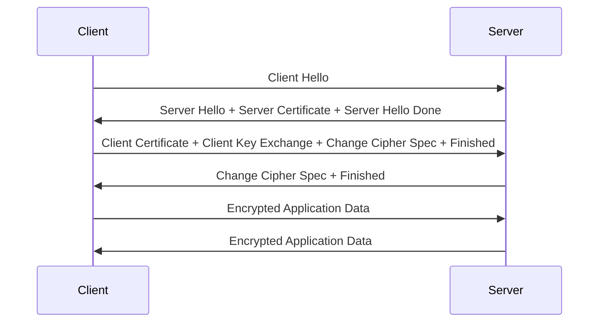

在微服务架构中，服务间的通信安全是构建可信分布式系统的关键要素。随着服务数量的增加和服务间交互的复杂化，传统的网络安全措施已经无法满足现代分布式系统的安全需求。双向TLS（mTLS）作为一种强大的安全机制，为服务间通信提供了端到端的加密、身份验证和完整性保护。本文将深入探讨mTLS的核心概念、工作机制、在微服务中的实现方式以及最佳实践。

## mTLS基础概念

### 什么是mTLS

双向TLS（Mutual TLS，简称mTLS）是TLS协议的一种扩展形式，它要求通信双方都提供证书进行身份验证。与单向TLS（仅服务器提供证书）不同，mTLS确保了客户端和服务器双方的身份都被验证，从而提供了更强的安全保障。

### mTLS vs TLS

| 特性 | 单向TLS | 双向TLS (mTLS) |
|------|---------|----------------|
| 服务器认证 | 是 | 是 |
| 客户端认证 | 否 | 是 |
| 身份验证 | 单向 | 双向 |
| 安全级别 | 中等 | 高 |
| 实现复杂度 | 简单 | 复杂 |

### 核心组件

#### 证书颁发机构（CA）
负责签发和管理数字证书的可信第三方机构。

#### 服务器证书
服务器向客户端证明其身份的数字证书。

#### 客户端证书
客户端向服务器证明其身份的数字证书。

#### 证书链
从根CA到终端实体证书的完整证书链。

## mTLS工作原理

### 握手过程

mTLS的握手过程比单向TLS更加复杂，需要双方都提供证书进行身份验证：



#### 详细步骤

1. **客户端Hello**：客户端向服务器发送支持的TLS版本、加密套件等信息
2. **服务器Hello**：服务器选择TLS版本和加密套件，并发送服务器证书
3. **证书请求**：服务器请求客户端证书
4. **客户端证书**：客户端发送客户端证书
5. **密钥交换**：双方交换密钥材料
6. **证书验证**：双方验证对方证书的有效性
7. **完成握手**：双方确认握手完成，开始加密通信

### 加密机制

#### 对称加密
用于加密应用数据，速度快但需要安全的密钥交换。

#### 非对称加密
用于密钥交换和数字签名，安全性高但速度较慢。

#### 哈希算法
用于确保数据完整性，防止数据被篡改。

## 在微服务中的实现

### 基于服务网格的实现

#### Istio实现mTLS
```yaml
# 启用网格范围的mTLS
apiVersion: security.istio.io/v1beta1
kind: PeerAuthentication
metadata:
  name: default
spec:
  mtls:
    mode: STRICT

---
# 为特定工作负载启用mTLS
apiVersion: security.istio.io/v1beta1
kind: PeerAuthentication
metadata:
  name: service-a-mtls
  namespace: production
spec:
  selector:
    matchLabels:
      app: service-a
  mtls:
    mode: STRICT

---
# 配置目的地规则
apiVersion: networking.istio.io/v1beta1
kind: DestinationRule
metadata:
  name: service-a-destination
spec:
  host: service-a.production.svc.cluster.local
  trafficPolicy:
    tls:
      mode: ISTIO_MUTUAL
```

#### Linkerd实现mTLS
```yaml
# Linkerd自动为所有服务启用mTLS
# 无需额外配置，Linkerd默认启用mTLS

# 查看mTLS状态
linkerd viz stat deploy

# 查看证书信息
linkerd identity certs
```

### 基于Spring Boot的实现

#### 服务端配置
```java
@Configuration
@EnableWebSecurity
public class MtlsServerConfig {
    
    @Bean
    public SecurityFilterChain filterChain(HttpSecurity http) throws Exception {
        http.authorizeHttpRequests(authz -> authz
            .anyRequest().authenticated()
        )
        .x509(x509 -> x509
            .subjectPrincipalRegex("CN=(.*?)(?:,|$)")
        );
        return http.build();
    }
    
    @Bean
    public TomcatServletWebServerFactory servletContainer() {
        TomcatServletWebServerFactory tomcat = new TomcatServletWebServerFactory();
        tomcat.addConnectorCustomizers(connector -> {
            connector.setSecure(true);
            connector.setScheme("https");
            connector.setProperty("SSLEnabled", "true");
            connector.setProperty("sslProtocol", "TLS");
            connector.setProperty("clientAuth", "true");
            connector.setProperty("keystoreFile", "path/to/server-keystore.jks");
            connector.setProperty("keystorePass", "password");
            connector.setProperty("truststoreFile", "path/to/server-truststore.jks");
            connector.setProperty("truststorePass", "password");
        });
        return tomcat;
    }
}
```

#### 客户端配置
```java
@Service
public class MtlsClientService {
    
    private final RestTemplate restTemplate;
    
    public MtlsClientService() {
        SSLContext sslContext = createSSLContext();
        SSLConnectionSocketFactory socketFactory = 
            new SSLConnectionSocketFactory(sslContext);
            
        HttpClient httpClient = HttpClients.custom()
            .setSSLSocketFactory(socketFactory)
            .build();
            
        restTemplate = new RestTemplate(
            new HttpComponentsClientHttpRequestFactory(httpClient));
    }
    
    private SSLContext createSSLContext() {
        try {
            KeyStore keyStore = KeyStore.getInstance("JKS");
            keyStore.load(new FileInputStream("path/to/client-keystore.jks"), 
                         "password".toCharArray());
                         
            KeyStore trustStore = KeyStore.getInstance("JKS");
            trustStore.load(new FileInputStream("path/to/client-truststore.jks"), 
                           "password".toCharArray());
                           
            SSLContext sslContext = SSLContextBuilder.create()
                .loadKeyMaterial(keyStore, "password".toCharArray())
                .loadTrustMaterial(trustStore, null)
                .build();
                
            return sslContext;
        } catch (Exception e) {
            throw new RuntimeException("Failed to create SSL context", e);
        }
    }
    
    public String callSecureService(String url) {
        return restTemplate.getForObject(url, String.class);
    }
}
```

### 基于Nginx的实现

#### 服务器配置
```nginx
server {
    listen 443 ssl http2;
    server_name service-a.example.com;
    
    # 服务器证书
    ssl_certificate /etc/ssl/certs/server.crt;
    ssl_certificate_key /etc/ssl/private/server.key;
    
    # 启用客户端证书验证
    ssl_client_certificate /etc/ssl/certs/ca.crt;
    ssl_verify_client on;
    ssl_verify_depth 2;
    
    # SSL配置
    ssl_protocols TLSv1.2 TLSv1.3;
    ssl_ciphers ECDHE-RSA-AES256-GCM-SHA512:DHE-RSA-AES256-GCM-SHA512;
    ssl_prefer_server_ciphers off;
    
    location / {
        proxy_pass http://backend;
        proxy_set_header X-Client-Subject $ssl_client_s_dn;
        proxy_set_header X-Client-Verify $ssl_client_verify;
    }
}
```

## 证书管理

### 证书生命周期管理

#### 证书生成
```bash
# 生成私钥
openssl genrsa -out server.key 2048

# 生成证书签名请求
openssl req -new -key server.key -out server.csr

# 使用CA签发证书
openssl x509 -req -in server.csr -CA ca.crt -CAkey ca.key -CAcreateserial -out server.crt -days 365
```

#### 证书分发
```yaml
# 使用Kubernetes Secret分发证书
apiVersion: v1
kind: Secret
metadata:
  name: service-a-certs
type: kubernetes.io/tls
data:
  tls.crt: <base64-encoded-cert>
  tls.key: <base64-encoded-key>
  ca.crt: <base64-encoded-ca-cert>
```

#### 证书轮换
```bash
# 自动化证书轮换脚本
#!/bin/bash
# 检查证书是否即将过期
openssl x509 -checkend 86400 -noout -in /etc/ssl/certs/server.crt
if [ $? -ne 0 ]; then
    # 生成新证书
    echo "Certificate expiring soon, generating new certificate..."
    # 执行证书生成和分发逻辑
fi
```

### 基于Vault的证书管理
```java
@Service
public class VaultCertificateService {
    
    @Autowired
    private VaultTemplate vaultTemplate;
    
    public CertificateBundle getCertificate(String serviceName) {
        VaultResponseSupport<CertificateBundle> response = 
            vaultTemplate.opsForPki("pki")
                .getCertificate(serviceName);
                
        return response.getData();
    }
    
    public CertificateBundle issueCertificate(String commonName) {
        return vaultTemplate.opsForPki("pki")
            .issueCertificate(commonName, 
                VaultCertificateRequest.create()
                    .ttl(Duration.ofHours(24)));
    }
}
```

## 安全最佳实践

### 证书安全

#### 使用强加密算法
```bash
# 生成强私钥
openssl genrsa -aes256 -out server.key 4096

# 使用安全的签名算法
openssl req -new -sha256 -key server.key -out server.csr
```

#### 限制证书权限
```bash
# 设置严格的文件权限
chmod 600 server.key
chmod 644 server.crt
chown service-user:service-group server.key server.crt
```

### 配置安全

#### 禁用不安全的协议和加密套件
```nginx
ssl_protocols TLSv1.2 TLSv1.3;
ssl_ciphers ECDHE+AESGCM:ECDHE+CHACHA20:!aNULL:!MD5:!DSS;
ssl_prefer_server_ciphers on;
```

#### 启用OCSP装订
```nginx
ssl_stapling on;
ssl_stapling_verify on;
ssl_trusted_certificate /etc/ssl/certs/ca-bundle.crt;
```

### 监控和告警

#### 证书过期监控
```java
@Component
public class CertificateExpirationMonitor {
    
    @Scheduled(cron = "0 0 9 * * *") // 每天9点检查
    public void checkCertificateExpirations() {
        List<CertificateInfo> certificates = certificateService.getAllCertificates();
        
        for (CertificateInfo cert : certificates) {
            Date expirationDate = cert.getExpirationDate();
            long daysUntilExpiration = 
                ChronoUnit.DAYS.between(LocalDate.now(), 
                                      expirationDate.toInstant().atZone(ZoneId.systemDefault()).toLocalDate());
            
            if (daysUntilExpiration <= 30) {
                alertService.sendCertificateExpirationAlert(cert, daysUntilExpiration);
            }
        }
    }
}
```

#### mTLS连接监控
```java
@Aspect
@Component
public class MtlsConnectionAspect {
    
    @Autowired
    private MetricsService metricsService;
    
    @Around("@annotation(RequireMtls)")
    public Object monitorMtlsConnection(ProceedingJoinPoint joinPoint) throws Throwable {
        long startTime = System.currentTimeMillis();
        
        try {
            Object result = joinPoint.proceed();
            metricsService.recordSuccessfulMtlsConnection();
            return result;
        } catch (Exception e) {
            metricsService.recordFailedMtlsConnection();
            throw e;
        } finally {
            long duration = System.currentTimeMillis() - startTime;
            metricsService.recordMtlsHandshakeTime(duration);
        }
    }
}
```

## 故障排除

### 常见问题

#### 证书验证失败
```bash
# 检查证书链
openssl verify -CAfile ca.crt server.crt

# 检查证书详细信息
openssl x509 -in server.crt -text -noout

# 检查证书有效期
openssl x509 -in server.crt -noout -dates
```

#### 握手失败
```bash
# 启用SSL调试日志
-Djavax.net.debug=ssl:handshake

# 使用openssl测试连接
openssl s_client -connect service-a:443 -cert client.crt -key client.key -CAfile ca.crt
```

### 性能优化

#### 连接池配置
```java
@Configuration
public class MtlsClientConfig {
    
    @Bean
    public CloseableHttpClient httpClient() {
        SSLContext sslContext = createSSLContext();
        
        return HttpClients.custom()
            .setSSLSocketFactory(new SSLConnectionSocketFactory(sslContext))
            .setMaxConnTotal(200)
            .setMaxConnPerRoute(20)
            .build();
    }
}
```

#### 会话复用
```nginx
ssl_session_cache shared:SSL:10m;
ssl_session_timeout 10m;
ssl_session_tickets off;
```

## 总结

mTLS作为一种强大的安全机制，为微服务架构中的服务间通信提供了端到端的加密、身份验证和完整性保护。通过要求通信双方都提供证书进行身份验证，mTLS确保了只有经过授权的服务才能相互通信，大大提高了系统的安全性。

在实际应用中，我们可以基于服务网格、应用框架或反向代理等多种方式实现mTLS。无论选择哪种实现方式，都需要关注证书管理、安全配置、监控告警等关键环节，以确保mTLS的有效性和可靠性。

然而，mTLS也带来了额外的复杂性和性能开销。在实施mTLS时，我们需要权衡安全需求和系统性能，选择合适的配置和优化策略。同时，建立完善的证书管理和监控机制，确保系统的稳定运行。

通过合理应用mTLS，我们可以构建更加安全、可信的微服务生态系统，为用户提供更好的安全保障。在后续章节中，我们将深入探讨其他安全防护措施，如防重放攻击、中间人攻击防护等，进一步完善我们的微服务安全知识体系。