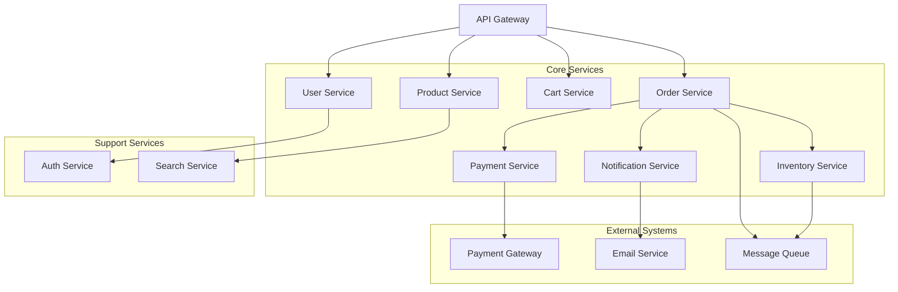

在微服务架构的实践中，设计一个完整的微服务系统是一项复杂的工程任务，需要综合考虑业务需求、技术选型、可扩展性、安全性等多个因素。本文将通过一个电商平台的实际案例，深入探讨如何从需求分析开始，逐步设计出一个高效、可靠、可扩展的微服务系统架构。

## 业务场景分析

### 核心业务流程

为了更好地理解微服务系统的设计过程，我们以一个电商平台为例进行详细分析。该平台需要支持以下核心业务流程：

#### 1. 用户管理
- 用户注册与登录
- 用户信息管理
- 用户权限管理
- 用户认证与授权

#### 2. 商品管理
- 商品信息维护
- 商品分类管理
- 商品搜索与筛选
- 商品评价管理

#### 3. 购物车管理
- 添加商品到购物车
- 修改购物车商品数量
- 删除购物车商品
- 购物车结算

#### 4. 订单处理
- 创建订单
- 订单支付
- 订单状态跟踪
- 订单取消与退款

#### 5. 库存管理
- 库存查询
- 库存扣减
- 库存补充
- 库存预警

#### 6. 支付处理
- 多种支付方式支持
- 支付状态管理
- 支付回调处理
- 退款处理

#### 7. 通知服务
- 订单状态变更通知
- 支付成功通知
- 系统公告通知
- 营销活动通知

### 非功能性需求

除了核心业务功能外，系统还需要满足以下非功能性需求：

#### 性能要求
- **响应时间**：关键业务操作响应时间不超过200ms
- **并发处理**：支持10,000并发用户同时在线
- **吞吐量**：订单处理能力达到1,000 TPS

#### 可用性要求
- **系统可用性**：99.9%的可用性保证
- **故障恢复**：故障恢复时间不超过5分钟
- **数据一致性**：保证数据的最终一致性

#### 可扩展性要求
- **水平扩展**：支持通过增加实例实现水平扩展
- **弹性伸缩**：根据负载自动调整资源
- **服务独立部署**：各服务可以独立部署和升级

#### 安全性要求
- **数据加密**：敏感数据传输和存储加密
- **身份认证**：支持OAuth2、JWT等认证机制
- **访问控制**：基于角色的访问控制（RBAC）
- **安全审计**：完整的安全日志记录

## 微服务架构设计

### 服务划分原则

在进行服务划分时，我们遵循以下原则：

#### 1. 业务领域驱动
根据业务领域的自然边界划分服务，确保每个服务职责单一。

#### 2. 高内聚低耦合
服务内部功能高度内聚，服务间依赖关系尽量简单。

#### 3. 数据所有权
每个服务拥有独立的数据存储，避免数据共享带来的复杂性。

#### 4. 团队组织匹配
服务划分与开发团队组织结构相匹配，支持康威定律。

### 核心服务设计

基于上述原则，我们将系统划分为以下核心服务：

#### 1. 用户服务（User Service）
```java
// 用户服务核心功能
public class UserService {
    // 用户注册
    public User registerUser(RegisterUserRequest request) { ... }
    
    // 用户登录
    public LoginResponse loginUser(LoginRequest request) { ... }
    
    // 获取用户信息
    public User getUserById(String userId) { ... }
    
    // 更新用户信息
    public User updateUser(String userId, UpdateUserRequest request) { ... }
    
    // 用户权限管理
    public Set<String> getUserPermissions(String userId) { ... }
}
```

#### 2. 商品服务（Product Service）
```java
// 商品服务核心功能
public class ProductService {
    // 创建商品
    public Product createProduct(CreateProductRequest request) { ... }
    
    // 获取商品详情
    public Product getProductById(String productId) { ... }
    
    // 商品搜索
    public List<Product> searchProducts(SearchCriteria criteria) { ... }
    
    // 更新商品信息
    public Product updateProduct(String productId, UpdateProductRequest request) { ... }
    
    // 商品分类管理
    public List<Category> getCategories() { ... }
}
```

#### 3. 购物车服务（Cart Service）
```java
// 购物车服务核心功能
public class CartService {
    // 添加商品到购物车
    public Cart addItemToCart(String userId, AddItemRequest request) { ... }
    
    // 更新购物车商品数量
    public Cart updateItemQuantity(String userId, UpdateItemRequest request) { ... }
    
    // 删除购物车商品
    public Cart removeItemFromCart(String userId, String productId) { ... }
    
    // 获取用户购物车
    public Cart getUserCart(String userId) { ... }
    
    // 清空购物车
    public void clearUserCart(String userId) { ... }
}
```

#### 4. 订单服务（Order Service）
```java
// 订单服务核心功能
public class OrderService {
    // 创建订单
    public Order createOrder(CreateOrderRequest request) { ... }
    
    // 获取订单详情
    public Order getOrderById(String orderId) { ... }
    
    // 更新订单状态
    public Order updateOrderStatus(String orderId, OrderStatus status) { ... }
    
    // 取消订单
    public Order cancelOrder(String orderId) { ... }
    
    // 查询用户订单
    public List<Order> getUserOrders(String userId, Pageable pageable) { ... }
}
```

#### 5. 库存服务（Inventory Service）
```java
// 库存服务核心功能
public class InventoryService {
    // 检查库存
    public InventoryCheckResult checkInventory(String productId, int quantity) { ... }
    
    // 扣减库存
    public boolean decreaseStock(String productId, int quantity) { ... }
    
    // 增加库存
    public boolean increaseStock(String productId, int quantity) { ... }
    
    // 获取库存信息
    public Inventory getInventory(String productId) { ... }
    
    // 库存预警
    public List<InventoryWarning> getLowStockWarnings() { ... }
}
```

#### 6. 支付服务（Payment Service）
```java
// 支付服务核心功能
public class PaymentService {
    // 处理支付
    public Payment processPayment(ProcessPaymentRequest request) { ... }
    
    // 查询支付状态
    public Payment getPaymentById(String paymentId) { ... }
    
    // 处理支付回调
    public void handlePaymentCallback(PaymentCallback callback) { ... }
    
    // 处理退款
    public Refund processRefund(ProcessRefundRequest request) { ... }
}
```

#### 7. 通知服务（Notification Service）
```java
// 通知服务核心功能
public class NotificationService {
    // 发送订单确认通知
    public void sendOrderConfirmation(String orderId) { ... }
    
    // 发送支付成功通知
    public void sendPaymentSuccess(String paymentId) { ... }
    
    // 发送系统公告
    public void sendSystemAnnouncement(Announcement announcement) { ... }
    
    // 发送营销通知
    public void sendMarketingNotification(MarketingNotification notification) { ... }
}
```

### 服务间通信设计

#### 同步通信
对于需要实时响应的操作，采用同步通信方式：

```java
// 订单服务调用库存服务检查库存
@Service
public class OrderProcessingService {
    
    @Autowired
    private InventoryServiceClient inventoryServiceClient;
    
    public boolean checkInventory(String productId, int quantity) {
        InventoryCheckRequest request = new InventoryCheckRequest(productId, quantity);
        InventoryCheckResponse response = inventoryServiceClient.checkInventory(request);
        return response.isAvailable();
    }
}
```

#### 异步通信
对于不需要实时响应的操作，采用异步通信方式：

```java
// 订单创建后异步发送通知
@Service
public class OrderNotificationService {
    
    @Autowired
    private NotificationServiceClient notificationServiceClient;
    
    @EventListener
    public void handleOrderCreated(OrderCreatedEvent event) {
        // 异步发送订单确认通知
        notificationServiceClient.sendOrderConfirmationAsync(event.getOrderId());
    }
}
```

### 数据存储设计

#### 服务数据隔离
每个服务拥有独立的数据存储，避免数据耦合：

```yaml
# Docker Compose配置示例
version: '3'
services:
  user-db:
    image: mysql:8.0
    environment:
      MYSQL_ROOT_PASSWORD: rootpass
      MYSQL_DATABASE: user_db
    volumes:
      - user-db-data:/var/lib/mysql
  
  product-db:
    image: mysql:8.0
    environment:
      MYSQL_ROOT_PASSWORD: rootpass
      MYSQL_DATABASE: product_db
    volumes:
      - product-db-data:/var/lib/mysql
  
  order-db:
    image: mysql:8.0
    environment:
      MYSQL_ROOT_PASSWORD: rootpass
      MYSQL_DATABASE: order_db
    volumes:
      - order-db-data:/var/lib/mysql

volumes:
  user-db-data:
  product-db-data:
  order-db-data:
```

#### 缓存策略
采用多级缓存策略提升性能：

```java
@Service
public class CachedProductService {
    
    @Autowired
    private RedisTemplate<String, Product> redisTemplate;
    
    @Autowired
    private ProductService productService;
    
    // 一级缓存：本地缓存
    private final Cache<String, Product> localCache = 
        Caffeine.newBuilder()
            .maximumSize(1000)
            .expireAfterWrite(Duration.ofMinutes(5))
            .build();
    
    public Product getProductById(String productId) {
        // 检查本地缓存
        Product product = localCache.getIfPresent(productId);
        if (product != null) {
            return product;
        }
        
        // 检查Redis缓存
        product = redisTemplate.opsForValue().get("product:" + productId);
        if (product != null) {
            localCache.put(productId, product);
            return product;
        }
        
        // 数据库查询
        product = productService.findById(productId);
        if (product != null) {
            // 更新缓存
            redisTemplate.opsForValue().set("product:" + productId, product, 
                                          Duration.ofHours(1));
            localCache.put(productId, product);
        }
        
        return product;
    }
}
```

### 安全架构设计

#### 认证授权体系
```java
@Configuration
@EnableWebSecurity
public class SecurityConfig {
    
    @Bean
    public SecurityFilterChain filterChain(HttpSecurity http) throws Exception {
        http.authorizeHttpRequests(authz -> authz
            .requestMatchers("/api/public/**").permitAll()
            .requestMatchers("/api/admin/**").hasRole("ADMIN")
            .anyRequest().authenticated()
        )
        .oauth2ResourceServer(OAuth2ResourceServerConfigurer::jwt)
        .sessionManagement(session -> session
            .sessionCreationPolicy(SessionCreationPolicy.STATELESS));
        
        return http.build();
    }
}
```

#### API网关安全
```java
@Component
public class SecurityGatewayFilter implements GlobalFilter {
    
    @Override
    public Mono<Void> filter(ServerWebExchange exchange, GatewayFilterChain chain) {
        ServerHttpRequest request = exchange.getRequest();
        
        // API密钥验证
        String apiKey = request.getHeaders().getFirst("X-API-Key");
        if (!isValidApiKey(apiKey)) {
            exchange.getResponse().setStatusCode(HttpStatus.UNAUTHORIZED);
            return exchange.getResponse().setComplete();
        }
        
        // JWT令牌验证
        String authHeader = request.getHeaders().getFirst("Authorization");
        if (!isValidJwtToken(authHeader)) {
            exchange.getResponse().setStatusCode(HttpStatus.FORBIDDEN);
            return exchange.getResponse().setComplete();
        }
        
        return chain.filter(exchange);
    }
    
    private boolean isValidApiKey(String apiKey) {
        // 实现API密钥验证逻辑
        return apiKeyService.isValidApiKey(apiKey);
    }
    
    private boolean isValidJwtToken(String authHeader) {
        // 实现JWT令牌验证逻辑
        return jwtService.isValidToken(authHeader);
    }
}
```

### 容错性设计

#### 断路器模式
```java
@Service
public class ResilientInventoryService {
    
    private final CircuitBreaker circuitBreaker;
    
    public ResilientInventoryService() {
        CircuitBreakerConfig config = CircuitBreakerConfig.custom()
            .failureRateThreshold(50)
            .waitDurationInOpenState(Duration.ofSeconds(10))
            .slidingWindowType(CircuitBreakerConfig.SlidingWindowType.TIME_BASED)
            .slidingWindowSize(100)
            .minimumNumberOfCalls(10)
            .build();
            
        this.circuitBreaker = CircuitBreaker.of("inventory-service", config);
    }
    
    public InventoryCheckResult checkInventory(String productId, int quantity) {
        Supplier<InventoryCheckResult> decoratedSupplier = 
            CircuitBreaker.decorateSupplier(circuitBreaker, 
                () -> inventoryServiceClient.checkInventory(productId, quantity));
                
        try {
            return decoratedSupplier.get();
        } catch (CallNotPermittedException e) {
            log.warn("Circuit breaker is open for inventory service");
            // 返回降级结果
            return new InventoryCheckResult(false, 0, "Service temporarily unavailable");
        }
    }
}
```

#### 重试机制
```java
@Service
public class RetryableUserService {
    
    private final Retry retry;
    
    public RetryableUserService() {
        RetryConfig config = RetryConfig.custom()
            .maxAttempts(3)
            .waitDuration(Duration.ofSeconds(1))
            .retryExceptions(TimeoutException.class, ConnectException.class)
            .build();
            
        this.retry = Retry.of("user-service", config);
    }
    
    public User getUserById(String userId) {
        Supplier<User> retryableSupplier = 
            Retry.decorateSupplier(retry, 
                () -> userServiceClient.getUserById(userId));
                
        return retryableSupplier.get();
    }
}
```

## 架构图示例



## 总结

通过这个实际案例，我们可以看到设计一个微服务系统需要考虑多个方面：

1. **深入理解业务需求**是设计良好架构的基础
2. **合理的服务划分**能够提高系统的可维护性和可扩展性
3. **选择合适的通信方式**对于系统性能至关重要
4. **完善的安全设计**是保障系统可靠运行的关键
5. **容错性机制**能够提高系统的稳定性和可用性

在实际项目中，我们需要根据具体的业务场景和技术约束，灵活应用这些设计原则和方法，持续优化和改进系统架构，构建出高质量的微服务系统。在后续的实现阶段，我们将深入探讨如何将这些设计转化为具体的代码实现和部署方案。