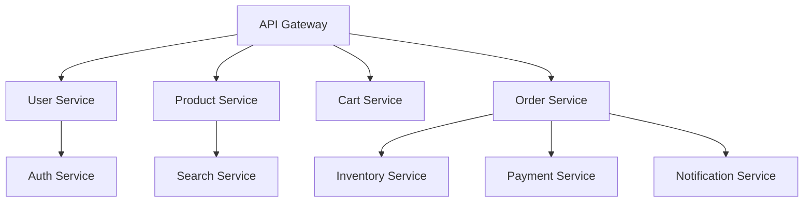

在微服务架构中，设计和实现一个高效、可靠的服务间通信系统是构建成功分布式应用的关键。随着业务复杂性的增加和技术栈的多样化，单一的通信方式已无法满足所有场景的需求。开发者需要综合考虑业务需求、性能要求、可扩展性、安全性等多个因素，设计出适合特定场景的通信系统。本文将通过一个实际案例，深入探讨如何设计和实现一个完整的服务间通信系统，包括架构设计、技术选型、安全性、容错性与性能优化等方面，为构建高质量的微服务系统提供实践指导。

## 实际案例：设计一个微服务系统

为了更好地理解服务间通信系统的设计与实现，我们以一个电商平台为例，探讨其微服务架构的设计和实现。

### 业务场景分析

#### 核心业务流程
1. **用户注册与登录**：用户注册账户并登录系统
2. **商品浏览**：用户浏览商品列表和详情
3. **购物车管理**：用户添加、修改、删除购物车中的商品
4. **订单处理**：用户下单、支付、订单状态更新
5. **库存管理**：商品库存的增减和管理
6. **通知服务**：订单状态变更通知用户

#### 非功能性需求
- **高可用性**：系统需要7x24小时可用
- **高性能**：响应时间不超过200ms
- **可扩展性**：支持水平扩展以应对流量增长
- **安全性**：保护用户数据和交易安全
- **监控与追踪**：提供完整的监控和分布式追踪能力

### 微服务架构设计

#### 服务划分
基于业务领域，我们将系统划分为以下核心服务：

1. **用户服务（User Service）**：负责用户管理、认证授权
2. **商品服务（Product Service）**：负责商品信息管理
3. **购物车服务（Cart Service）**：负责购物车管理
4. **订单服务（Order Service）**：负责订单处理和管理
5. **库存服务（Inventory Service）**：负责库存管理
6. **支付服务（Payment Service）**：负责支付处理
7. **通知服务（Notification Service）**：负责消息通知

#### 架构图


## 选择与实现合适的通信方式

在设计微服务通信系统时，需要根据不同的业务场景选择合适的通信方式。

### 同步通信方式

#### RESTful API
对于需要实时响应的操作，如用户登录、商品查询等，采用RESTful API进行同步通信。

```java
@RestController
@RequestMapping("/api/products")
public class ProductController {
    
    @Autowired
    private ProductService productService;
    
    @GetMapping("/{id}")
    public ResponseEntity<Product> getProduct(@PathVariable String id) {
        Product product = productService.findById(id);
        if (product != null) {
            return ResponseEntity.ok(product);
        }
        return ResponseEntity.notFound().build();
    }
    
    @PostMapping
    public ResponseEntity<Product> createProduct(@Valid @RequestBody CreateProductRequest request) {
        Product product = productService.create(request);
        return ResponseEntity.status(HttpStatus.CREATED).body(product);
    }
}
```

#### gRPC
对于高性能要求的内部服务间通信，如订单服务调用库存服务，采用gRPC进行通信。

```protobuf
syntax = "proto3";

package ecommerce;

service InventoryService {
    rpc CheckInventory (CheckInventoryRequest) returns (CheckInventoryResponse);
    rpc UpdateInventory (UpdateInventoryRequest) returns (UpdateInventoryResponse);
}

message CheckInventoryRequest {
    string product_id = 1;
    int32 quantity = 2;
}

message CheckInventoryResponse {
    bool available = 1;
    int32 available_quantity = 2;
}

message UpdateInventoryRequest {
    string product_id = 1;
    int32 quantity_change = 2;
}

message UpdateInventoryResponse {
    bool success = 1;
    string message = 2;
}
```

### 异步通信方式

#### 消息队列
对于不需要实时响应的操作，如订单创建后的通知发送、库存更新等，采用消息队列进行异步通信。

```java
@Service
public class OrderEventPublisher {
    
    @Autowired
    private RabbitTemplate rabbitTemplate;
    
    public void publishOrderCreated(Order order) {
        OrderCreatedEvent event = new OrderCreatedEvent(
            order.getId(),
            order.getUserId(),
            order.getAmount(),
            System.currentTimeMillis()
        );
        
        rabbitTemplate.convertAndSend("order.exchange", "order.created", event);
    }
}
```

#### 事件驱动架构
通过事件驱动架构实现服务间的松耦合通信。

```java
@Component
public class OrderEventHandler {
    
    @EventListener
    public void handleOrderCreated(OrderCreatedEvent event) {
        // 处理库存扣减
        inventoryService.decreaseStock(event.getOrderId(), event.getAmount());
        
        // 发送订单确认通知
        notificationService.sendOrderConfirmation(event.getOrderId());
    }
}
```

## 安全性、容错性与性能优化

### 安全性设计

#### 身份认证与授权
采用OAuth2和JWT实现统一的身份认证和授权机制。

```java
@Configuration
@EnableWebSecurity
public class SecurityConfig {
    
    @Bean
    public SecurityFilterChain filterChain(HttpSecurity http) throws Exception {
        http.authorizeHttpRequests(authz -> authz
            .requestMatchers("/api/public/**").permitAll()
            .anyRequest().authenticated()
        )
        .oauth2ResourceServer(OAuth2ResourceServerConfigurer::jwt);
        
        return http.build();
    }
}
```

#### 传输安全
使用HTTPS加密所有通信，确保数据传输安全。

```java
@Configuration
public class HttpsConfig {
    
    @Bean
    public TomcatServletWebServerFactory servletContainer() {
        TomcatServletWebServerFactory tomcat = new TomcatServletWebServerFactory() {
            @Override
            protected void postProcessContext(Context context) {
                SecurityConstraint securityConstraint = new SecurityConstraint();
                securityConstraint.setUserConstraint("CONFIDENTIAL");
                SecurityCollection collection = new SecurityCollection();
                collection.addPattern("/*");
                securityConstraint.addCollection(collection);
                context.addConstraint(securityConstraint);
            }
        };
        
        tomcat.addAdditionalTomcatConnectors(redirectConnector());
        return tomcat;
    }
    
    private Connector redirectConnector() {
        Connector connector = new Connector(TomcatServletWebServerFactory.DEFAULT_PROTOCOL);
        connector.setScheme("http");
        connector.setPort(8080);
        connector.setSecure(false);
        connector.setRedirectPort(8443);
        return connector;
    }
}
```

#### API网关安全
在API网关层实现统一的安全控制。

```java
@Component
public class SecurityGatewayFilter implements GlobalFilter {
    
    @Override
    public Mono<Void> filter(ServerWebExchange exchange, GatewayFilterChain chain) {
        ServerHttpRequest request = exchange.getRequest();
        
        // 验证API密钥
        String apiKey = request.getHeaders().getFirst("X-API-Key");
        if (!isValidApiKey(apiKey)) {
            exchange.getResponse().setStatusCode(HttpStatus.UNAUTHORIZED);
            return exchange.getResponse().setComplete();
        }
        
        // 验证JWT令牌
        String authHeader = request.getHeaders().getFirst("Authorization");
        if (!isValidJwtToken(authHeader)) {
            exchange.getResponse().setStatusCode(HttpStatus.FORBIDDEN);
            return exchange.getResponse().setComplete();
        }
        
        return chain.filter(exchange);
    }
}
```

### 容错性设计

#### 断路器模式
使用Resilience4j实现断路器模式，防止故障级联。

```java
@Service
public class ResilientOrderService {
    
    private final CircuitBreaker circuitBreaker;
    
    public ResilientOrderService() {
        CircuitBreakerConfig config = CircuitBreakerConfig.custom()
            .failureRateThreshold(50)
            .waitDurationInOpenState(Duration.ofSeconds(10))
            .slidingWindowType(CircuitBreakerConfig.SlidingWindowType.TIME_BASED)
            .slidingWindowSize(100)
            .minimumNumberOfCalls(10)
            .build();
            
        this.circuitBreaker = CircuitBreaker.of("order-service", config);
    }
    
    public Order createOrder(CreateOrderRequest request) {
        Supplier<Order> decoratedSupplier = 
            CircuitBreaker.decorateSupplier(circuitBreaker, 
                () -> orderService.createOrder(request));
                
        try {
            return decoratedSupplier.get();
        } catch (CallNotPermittedException e) {
            log.warn("Circuit breaker is open for order service");
            throw new ServiceUnavailableException("Order service temporarily unavailable");
        }
    }
}
```

#### 重试机制
实现智能重试机制，提高请求成功率。

```java
@Service
public class RetryableUserService {
    
    private final Retry retry;
    
    public RetryableUserService() {
        RetryConfig config = RetryConfig.custom()
            .maxAttempts(3)
            .waitDuration(Duration.ofSeconds(1))
            .retryExceptions(TimeoutException.class, ConnectException.class)
            .build();
            
        this.retry = Retry.of("user-service", config);
    }
    
    public User getUserById(String userId) {
        Supplier<User> retryableSupplier = 
            Retry.decorateSupplier(retry, 
                () -> userServiceClient.getUserById(userId));
                
        return retryableSupplier.get();
    }
}
```

### 性能优化

#### 连接池优化
配置合理的连接池参数，提高连接复用率。

```java
@Configuration
public class ConnectionPoolConfig {
    
    @Bean
    public CloseableHttpClient httpClient() {
        PoolingHttpClientConnectionManager connectionManager = 
            new PoolingHttpClientConnectionManager();
        connectionManager.setMaxTotal(200);
        connectionManager.setDefaultMaxPerRoute(20);
        
        RequestConfig requestConfig = RequestConfig.custom()
            .setConnectTimeout(5000)
            .setSocketTimeout(10000)
            .build();
        
        return HttpClients.custom()
            .setConnectionManager(connectionManager)
            .setDefaultRequestConfig(requestConfig)
            .build();
    }
}
```

#### 缓存策略
实现多级缓存策略，减少数据库访问。

```java
@Service
public class CachedProductService {
    
    @Autowired
    private RedisTemplate<String, Product> redisTemplate;
    
    @Autowired
    private ProductService productService;
    
    public Product getProductById(String productId) {
        // 一级缓存：本地缓存
        Product product = localCache.getIfPresent(productId);
        if (product != null) {
            return product;
        }
        
        // 二级缓存：Redis缓存
        product = redisTemplate.opsForValue().get("product:" + productId);
        if (product != null) {
            localCache.put(productId, product);
            return product;
        }
        
        // 数据库查询
        product = productService.findById(productId);
        if (product != null) {
            // 更新缓存
            redisTemplate.opsForValue().set("product:" + productId, product, 
                                          Duration.ofHours(1));
            localCache.put(productId, product);
        }
        
        return product;
    }
}
```

#### 异步处理
使用异步处理提高系统吞吐量。

```java
@Service
public class AsyncNotificationService {
    
    @Async
    public CompletableFuture<Void> sendOrderConfirmationAsync(String orderId) {
        return CompletableFuture.runAsync(() -> {
            notificationService.sendOrderConfirmation(orderId);
        });
    }
}
```

## 系统集成与测试

### 集成测试
```java
@SpringBootTest
@ActiveProfiles("test")
public class ServiceCommunicationIntegrationTest {
    
    @Autowired
    private OrderService orderService;
    
    @Autowired
    private InventoryService inventoryService;
    
    @Test
    public void testOrderCreationWithInventoryUpdate() {
        // 准备测试数据
        CreateOrderRequest request = createTestOrderRequest();
        
        // 创建订单
        Order order = orderService.createOrder(request);
        
        // 验证订单创建成功
        assertThat(order).isNotNull();
        assertThat(order.getStatus()).isEqualTo(OrderStatus.CREATED);
        
        // 验证库存已扣减
        Inventory inventory = inventoryService.getInventory(order.getProductId());
        assertThat(inventory.getAvailableQuantity()).isEqualTo(
            originalQuantity - order.getQuantity());
    }
}
```

### 性能测试
```java
@SpringBootTest
@ActiveProfiles("perf")
public class ServiceCommunicationPerformanceTest {
    
    @Autowired
    private OrderService orderService;
    
    @Test
    public void testOrderCreationPerformance() {
        int totalRequests = 10000;
        int concurrentUsers = 100;
        
        ExecutorService executor = Executors.newFixedThreadPool(concurrentUsers);
        CountDownLatch latch = new CountDownLatch(totalRequests);
        
        List<Long> latencies = Collections.synchronizedList(new ArrayList<>());
        
        long startTime = System.currentTimeMillis();
        
        for (int i = 0; i < totalRequests; i++) {
            executor.submit(() -> {
                try {
                    long requestStart = System.currentTimeMillis();
                    CreateOrderRequest request = createTestOrderRequest();
                    orderService.createOrder(request);
                    long requestEnd = System.currentTimeMillis();
                    latencies.add(requestEnd - requestStart);
                } finally {
                    latch.countDown();
                }
            });
        }
        
        try {
            latch.await(5, TimeUnit.MINUTES);
        } catch (InterruptedException e) {
            Thread.currentThread().interrupt();
        }
        
        long endTime = System.currentTimeMillis();
        
        // 计算性能指标
        double averageLatency = latencies.stream()
            .mapToLong(Long::longValue)
            .average()
            .orElse(0.0);
            
        double throughput = (double) totalRequests / ((endTime - startTime) / 1000.0);
        
        System.out.println("Performance Test Results:");
        System.out.println("Total Requests: " + totalRequests);
        System.out.println("Average Latency: " + averageLatency + "ms");
        System.out.println("Throughput: " + throughput + " RPS");
    }
}
```

## 总结

设计和实现一个服务间通信系统是一个复杂的工程任务，需要综合考虑业务需求、技术选型、安全性、容错性和性能优化等多个方面。通过本文的案例分析和实践指导，我们可以看到：

1. **合理的架构设计**是系统成功的基础，需要根据业务领域合理划分服务边界
2. **选择合适的通信方式**对于系统性能和可维护性至关重要
3. **安全性设计**是保障系统可靠运行的关键要素
4. **容错性机制**能够提高系统的稳定性和可用性
5. **性能优化**是提升用户体验的重要手段
6. **完善的测试体系**是保证系统质量的必要条件

在实际项目中，我们需要根据具体的业务场景和技术约束，灵活应用这些设计原则和实现方法，持续优化和改进系统，构建出高质量的微服务通信系统。

在后续章节中，我们将深入探讨微服务系统的监控与故障排查技术，进一步完善我们的微服务架构知识体系。