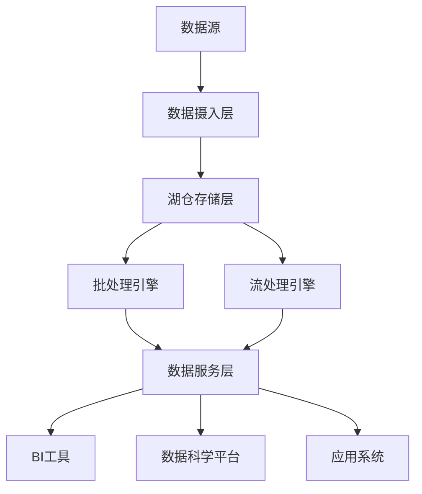

在大数据时代，企业面临着前所未有的数据挑战：数据量急剧增长、数据类型日益多样化、业务需求不断变化。为了有效管理和利用这些数据，数据湖和数据仓库作为两种重要的数据存储架构应运而生。虽然它们都用于存储和分析大量数据，但在设计理念、技术实现和应用场景上存在显著差异。本文将深入探讨数据湖和数据仓库的概念、架构、技术特点以及在现代数据架构中的应用，帮助读者理解如何根据业务需求选择合适的数据存储解决方案。

## 数据湖与数据仓库概述

### 数据湖的概念

数据湖是一个集中式存储库，允许以任意规模存储所有结构化和非结构化数据。数据湖的核心理念是"先存储，后处理"，即在数据存储时不强制进行结构化处理，而是在需要时再进行转换和分析。

#### 核心特征
- **原始数据存储**：存储数据的原始格式，不进行预处理
- **多种数据类型支持**：支持结构化、半结构化和非结构化数据
- **高扩展性**：能够存储PB级甚至EB级数据
- **低成本存储**：通常基于分布式文件系统，成本相对较低

#### 典型应用场景
- 数据科学和机器学习
- 大数据分析
- 数据探索和发现
- 历史数据归档

### 数据仓库的概念

数据仓库是一个面向主题的、集成的、时变的、非易失的数据集合，用于支持管理决策。数据仓库采用"先处理，后存储"的理念，数据在存储前需要经过清洗、转换和整合。

#### 核心特征
- **结构化存储**：数据以预定义的模式存储
- **高性能查询**：针对分析查询进行了优化
- **历史数据管理**：支持时间维度的数据分析
- **数据一致性**：保证数据的准确性和一致性

#### 典型应用场景
- 商业智能（BI）报告
- 业务分析和决策支持
- 财务报表和合规报告
- 客户行为分析

## 数据湖架构设计

### 分层架构模型

数据湖通常采用分层架构设计，每一层都有特定的功能和用途：

#### 数据摄入层（Ingestion Layer）
负责从各种数据源收集和传输数据到数据湖中。

```python
# 数据摄入示例
import boto3
from datetime import datetime

class DataIngestionPipeline:
    def __init__(self):
        self.s3_client = boto3.client('s3')
        self.kafka_consumer = KafkaConsumer('data-topic')
    
    def ingest_from_kafka(self, bucket_name, prefix):
        """从Kafka摄入数据到S3"""
        for message in self.kafka_consumer:
            timestamp = datetime.now().strftime('%Y/%m/%d/%H/%M')
            key = f"{prefix}/{timestamp}/data.json"
            
            self.s3_client.put_object(
                Bucket=bucket_name,
                Key=key,
                Body=message.value
            )
    
    def ingest_from_database(self, bucket_name, prefix, query):
        """从数据库摄入数据到S3"""
        # 数据库查询逻辑
        data = self.execute_query(query)
        
        timestamp = datetime.now().strftime('%Y/%m/%d')
        key = f"{prefix}/{timestamp}/batch_data.json"
        
        self.s3_client.put_object(
            Bucket=bucket_name,
            Key=key,
            Body=json.dumps(data)
        )
```

#### 存储层（Storage Layer）
提供大规模、低成本的数据存储能力。

##### HDFS存储架构
```xml
<!-- HDFS配置示例 -->
<configuration>
    <property>
        <name>dfs.namenode.name.dir</name>
        <value>/data/hadoop/namenode</value>
    </property>
    
    <property>
        <name>dfs.datanode.data.dir</name>
        <value>/data/hadoop/datanode1,/data/hadoop/datanode2</value>
    </property>
    
    <property>
        <name>dfs.replication</name>
        <value>3</value>
    </property>
    
    <property>
        <name>dfs.blocksize</name>
        <value>268435456</value> <!-- 256MB -->
    </property>
</configuration>
```

##### 云存储架构
```python
# AWS S3存储示例
import boto3

class S3DataLake:
    def __init__(self, bucket_name):
        self.s3_client = boto3.client('s3')
        self.bucket_name = bucket_name
    
    def store_raw_data(self, data, source, data_type):
        """存储原始数据"""
        timestamp = datetime.now().strftime('%Y/%m/%d/%H/%M/%S')
        key = f"raw/{source}/{data_type}/{timestamp}/data.json"
        
        self.s3_client.put_object(
            Bucket=self.bucket_name,
            Key=key,
            Body=json.dumps(data),
            Metadata={
                'source': source,
                'data_type': data_type,
                'ingestion_time': timestamp
            }
        )
    
    def store_processed_data(self, data, domain, dataset):
        """存储处理后的数据"""
        timestamp = datetime.now().strftime('%Y/%m/%d')
        key = f"processed/{domain}/{dataset}/{timestamp}/data.parquet"
        
        # 转换为Parquet格式存储
        df = pd.DataFrame(data)
        parquet_buffer = BytesIO()
        df.to_parquet(parquet_buffer, engine='pyarrow')
        
        self.s3_client.put_object(
            Bucket=self.bucket_name,
            Key=key,
            Body=parquet_buffer.getvalue()
        )
```

#### 处理层（Processing Layer）
提供数据处理和转换能力。

##### 批处理示例
```scala
// Spark批处理示例
import org.apache.spark.sql.SparkSession
import org.apache.spark.sql.functions._

val spark = SparkSession.builder()
  .appName("DataLakeProcessing")
  .getOrCreate()

// 读取原始数据
val rawDF = spark.read
  .option("multiline", "true")
  .json("s3a://data-lake/raw/web-logs/2025/08/31/")

// 数据清洗和转换
val cleanedDF = rawDF
  .filter(col("timestamp").isNotNull)
  .filter(col("user_id").isNotNull)
  .withColumn("ingestion_time", current_timestamp())
  .withColumn("processed_date", current_date())

// 保存处理后的数据
cleanedDF.write
  .mode("overwrite")
  .partitionBy("processed_date")
  .parquet("s3a://data-lake/processed/web-analytics/")
```

##### 流处理示例
```java
// Flink流处理示例
public class StreamProcessingJob {
    public static void main(String[] args) throws Exception {
        StreamExecutionEnvironment env = StreamExecutionEnvironment.getExecutionEnvironment();
        
        // 从Kafka读取数据流
        Properties properties = new Properties();
        properties.setProperty("bootstrap.servers", "localhost:9092");
        properties.setProperty("group.id", "data-lake-processor");
        
        FlinkKafkaConsumer<String> kafkaConsumer = new FlinkKafkaConsumer<>(
            "web-logs",
            new SimpleStringSchema(),
            properties
        );
        
        DataStream<String> stream = env.addSource(kafkaConsumer);
        
        // 数据处理
        DataStream<ProcessedLog> processedStream = stream
            .map(new LogParser())
            .filter(log -> log.isValid())
            .keyBy(log -> log.getUserId())
            .window(TumblingProcessingTimeWindows.of(Time.minutes(5)))
            .aggregate(new SessionAggregator());
        
        // 写入数据湖
        processedStream.addSink(new S3SinkFunction("data-lake", "processed/web-analytics/"));
        
        env.execute("Data Lake Stream Processing Job");
    }
}
```

#### 服务层（Service Layer）
提供数据访问和查询服务。

##### 元数据管理
```python
# 元数据管理示例
class MetadataManager:
    def __init__(self, metastore_url):
        self.metastore = HiveMetastoreClient(metastore_url)
    
    def register_dataset(self, dataset_info):
        """注册数据集元数据"""
        table_schema = TableSchema(
            name=dataset_info['name'],
            location=dataset_info['location'],
            format=dataset_info['format'],
            columns=dataset_info['schema'],
            partition_keys=dataset_info.get('partition_keys', []),
            properties={
                'created_time': datetime.now().isoformat(),
                'owner': dataset_info.get('owner', 'unknown'),
                'description': dataset_info.get('description', '')
            }
        )
        
        self.metastore.create_table(table_schema)
    
    def get_dataset_schema(self, dataset_name):
        """获取数据集模式"""
        return self.metastore.get_table_schema(dataset_name)
    
    def update_dataset_stats(self, dataset_name, stats):
        """更新数据集统计信息"""
        self.metastore.update_table_stats(dataset_name, stats)
```

## 数据仓库架构设计

### 传统数据仓库架构

传统数据仓库通常采用ETL（Extract, Transform, Load）架构：

#### ETL流程
```sql
-- ETL示例：从源系统抽取数据
-- 1. 抽取阶段
CREATE TABLE staging_customers AS
SELECT customer_id, customer_name, email, phone, address, created_date
FROM source_system.customers
WHERE last_updated >= '${LAST_RUN_DATE}';

-- 2. 转换阶段
CREATE TABLE dw_customers AS
SELECT 
    customer_id,
    UPPER(TRIM(customer_name)) AS customer_name,
    LOWER(TRIM(email)) AS email,
    REGEXP_REPLACE(phone, '[^0-9]', '') AS phone_clean,
    address,
    created_date,
    CURRENT_TIMESTAMP AS dw_insert_date,
    'I' AS record_status
FROM staging_customers;

-- 3. 加载阶段
INSERT INTO data_warehouse.dim_customers
SELECT * FROM dw_customers;
```

#### 星型模式设计
```sql
-- 星型模式示例
-- 事实表
CREATE TABLE fact_sales (
    sale_id BIGINT,
    customer_key INT,
    product_key INT,
    date_key INT,
    quantity INT,
    unit_price DECIMAL(10,2),
    total_amount DECIMAL(12,2)
);

-- 维度表
CREATE TABLE dim_customer (
    customer_key INT,
    customer_id VARCHAR(50),
    customer_name VARCHAR(100),
    customer_type VARCHAR(20),
    region VARCHAR(50),
    effective_date DATE,
    expiry_date DATE,
    is_current BOOLEAN
);

CREATE TABLE dim_product (
    product_key INT,
    product_id VARCHAR(50),
    product_name VARCHAR(100),
    category VARCHAR(50),
    brand VARCHAR(50),
    price DECIMAL(10,2)
);

CREATE TABLE dim_date (
    date_key INT,
    date_value DATE,
    year INT,
    quarter INT,
    month INT,
    day INT,
    day_of_week VARCHAR(10),
    is_weekend BOOLEAN
);
```

### 现代数据仓库架构

现代数据仓库越来越多地采用云原生架构和实时处理能力：

#### Lambda架构
```python
# Lambda架构示例
class LambdaArchitecture:
    def __init__(self):
        self.batch_layer = BatchProcessingLayer()
        self.speed_layer = StreamProcessingLayer()
        self.serving_layer = ServingLayer()
    
    def process_batch_data(self, batch_data):
        """批处理层：处理历史数据"""
        processed_data = self.batch_layer.process(batch_data)
        self.serving_layer.update_view(processed_data, "batch")
        return processed_data
    
    def process_stream_data(self, stream_data):
        """速度层：处理实时数据"""
        processed_data = self.speed_layer.process(stream_data)
        self.serving_layer.update_view(processed_data, "realtime")
        return processed_data
    
    def get_combined_view(self):
        """服务层：合并批处理和实时处理结果"""
        return self.serving_layer.get_combined_view()
```

#### 数据虚拟化
```sql
-- 数据虚拟化示例
CREATE FOREIGN TABLE external_sales_data (
    transaction_id VARCHAR(50),
    customer_id VARCHAR(50),
    product_id VARCHAR(50),
    quantity INT,
    price DECIMAL(10,2),
    transaction_date TIMESTAMP
)
SERVER external_data_source
OPTIONS (
    table_name 'sales_transactions',
    schema_name 'public'
);

-- 统一查询
SELECT 
    s.customer_id,
    c.customer_name,
    SUM(s.quantity * s.price) as total_sales
FROM external_sales_data s
JOIN data_warehouse.dim_customers c ON s.customer_id = c.customer_id
WHERE s.transaction_date >= '2025-08-01'
GROUP BY s.customer_id, c.customer_name
ORDER BY total_sales DESC;
```

## 数据湖与数据仓库的对比分析

### 存储方式对比

| 特性 | 数据湖 | 数据仓库 |
|------|--------|----------|
| 数据格式 | 原始格式（结构化、半结构化、非结构化） | 结构化格式 |
| 数据处理 | 先存储，后处理 | 先处理，后存储 |
| 模式 | 写入时无模式（Schema-on-Read） | 写入时有模式（Schema-on-Write） |
| 存储成本 | 低成本 | 相对较高 |

### 使用场景对比

#### 数据湖适用场景
- 数据科学和机器学习项目
- 探索性数据分析
- 历史数据归档
- 多种数据源整合

#### 数据仓库适用场景
- 商业智能和报表
- 财务和合规报告
- 业务绩效分析
- 客户行为分析

### 技术栈对比

#### 数据湖技术栈
```yaml
# 数据湖技术栈示例
storage:
  - HDFS
  - Amazon S3
  - Azure Data Lake Storage
  - Google Cloud Storage

processing:
  - Apache Spark
  - Apache Flink
  - Apache Beam
  - AWS Glue
  - Azure Data Factory

format:
  - Parquet
  - ORC
  - Avro
  - JSON
  - CSV

query:
  - Presto
  - Apache Drill
  - AWS Athena
  - Azure Synapse
```

#### 数据仓库技术栈
```yaml
# 数据仓库技术栈示例
traditional:
  - Oracle Exadata
  - IBM Db2 Warehouse
  - Microsoft SQL Server Analysis Services
  - Teradata

cloud:
  - Amazon Redshift
  - Google BigQuery
  - Snowflake
  - Azure Synapse Analytics

etl:
  - Informatica
  - Talend
  - Apache NiFi
  - AWS Glue
```

## 湖仓一体架构

### 概念与优势

湖仓一体（Data Lakehouse）是近年来兴起的新架构，旨在结合数据湖和数据仓库的优点：

#### 核心特性
- **统一存储**：在同一存储系统中支持数据湖和数据仓库功能
- **事务支持**：提供ACID事务保证
- **模式管理**：支持模式演化和版本控制
- **治理能力**：提供数据治理和合规性支持

#### 实现技术
```python
# Delta Lake示例
from delta.tables import DeltaTable
from pyspark.sql import SparkSession

spark = SparkSession.builder \
    .appName("DeltaLakeExample") \
    .config("spark.sql.extensions", "io.delta.sql.DeltaSparkSessionExtension") \
    .config("spark.sql.catalog.spark_catalog", "org.apache.spark.sql.delta.catalog.DeltaCatalog") \
    .getOrCreate()

# 创建Delta表
data = spark.range(0, 5)
data.write.format("delta").save("/tmp/delta-table")

# 读取Delta表
df = spark.read.format("delta").load("/tmp/delta-table")
df.show()

# 更新操作（支持ACID事务）
deltaTable = DeltaTable.forPath(spark, "/tmp/delta-table")
deltaTable.update(
    condition = "id % 2 == 0",
    set = { "id": "id + 100" }
)
```

### 架构设计

#### 分层架构


#### 元数据管理
```sql
-- Unity Catalog示例（Databricks）
CREATE CATALOG IF NOT EXISTS company_catalog;

CREATE DATABASE IF NOT EXISTS company_catalog.sales_db;

CREATE TABLE company_catalog.sales_db.customer_transactions (
    customer_id STRING,
    transaction_id STRING,
    amount DECIMAL(10,2),
    transaction_date TIMESTAMP
)
USING DELTA
LOCATION 's3://company-data-lake/sales/customer_transactions'
TBLPROPERTIES (
    'delta.feature.allowColumnDefaults' = 'supported',
    'delta.autoOptimize.optimizeWrite' = 'true'
);
```

## 实施最佳实践

### 数据治理

#### 数据质量保障
```python
# 数据质量检查示例
class DataQualityChecker:
    def __init__(self, spark_session):
        self.spark = spark_session
    
    def check_completeness(self, df, required_columns):
        """检查数据完整性"""
        total_count = df.count()
        completeness_report = []
        
        for column in required_columns:
            null_count = df.filter(col(column).isNull()).count()
            completeness = (total_count - null_count) / total_count * 100
            completeness_report.append({
                'column': column,
                'completeness': completeness,
                'null_count': null_count
            })
        
        return completeness_report
    
    def check_consistency(self, df, business_rules):
        """检查业务规则一致性"""
        violations = []
        for rule in business_rules:
            violation_count = df.filter(~rule['condition']).count()
            if violation_count > 0:
                violations.append({
                    'rule_name': rule['name'],
                    'violation_count': violation_count
                })
        return violations
    
    def generate_quality_report(self, df, table_name):
        """生成数据质量报告"""
        report = {
            'table_name': table_name,
            'record_count': df.count(),
            'completeness': self.check_completeness(df, df.columns),
            'consistency': self.check_consistency(df, self.get_business_rules(table_name))
        }
        return report
```

#### 数据安全
```python
# 数据安全策略示例
class DataSecurityManager:
    def __init__(self, spark_session):
        self.spark = spark_session
    
    def apply_row_level_security(self, df, user_role):
        """应用行级安全策略"""
        if user_role == 'admin':
            return df
        elif user_role == 'analyst':
            return df.filter(col("region") == "APAC")
        elif user_role == 'manager':
            return df.filter(col("department").isin(["Sales", "Marketing"]))
        else:
            return df.limit(0)  # 无访问权限
    
    def apply_column_masking(self, df, sensitive_columns, user_role):
        """应用列掩码"""
        masked_df = df
        if user_role != 'admin':
            for column in sensitive_columns:
                masked_df = masked_df.withColumn(
                    column, 
                    regexp_replace(col(column), r".*", "***")
                )
        return masked_df
    
    def audit_data_access(self, table_name, user_id, operation):
        """审计数据访问"""
        audit_log = {
            'timestamp': datetime.now().isoformat(),
            'user_id': user_id,
            'table_name': table_name,
            'operation': operation
        }
        # 写入审计日志
        self.write_audit_log(audit_log)
```

### 性能优化

#### 分区策略
```sql
-- Hive分区策略示例
CREATE TABLE web_logs (
    user_id STRING,
    session_id STRING,
    page_url STRING,
    event_type STRING,
    timestamp TIMESTAMP
)
PARTITIONED BY (
    year INT,
    month INT,
    day INT,
    hour INT
)
STORED AS PARQUET
TBLPROPERTIES (
    'parquet.compression' = 'SNAPPY'
);

-- 查询优化
SELECT user_id, COUNT(*) as session_count
FROM web_logs
WHERE year = 2025 
  AND month = 8 
  AND day = 31
  AND event_type = 'page_view'
GROUP BY user_id
ORDER BY session_count DESC
LIMIT 100;
```

#### 索引优化
```sql
-- 数据仓库索引示例
-- 创建位图索引（适用于低基数列）
CREATE BITMAP INDEX idx_customer_region ON dim_customer(region);

-- 创建聚簇索引（适用于事实表）
CREATE CLUSTERED INDEX idx_sales_date ON fact_sales(date_key);

-- 创建覆盖索引（包含常用查询字段）
CREATE INDEX idx_sales_customer_amount ON fact_sales(customer_key, total_amount)
INCLUDE (quantity, unit_price);
```

数据湖和数据仓库作为现代数据架构的核心组件，各自具有独特的优势和适用场景。数据湖以其灵活性和低成本存储能力，成为数据科学和探索性分析的理想选择；而数据仓库则以其高性能查询和强一致性保障，在商业智能和决策支持领域发挥着重要作用。

随着技术的发展，湖仓一体架构正在成为新的趋势，它结合了数据湖的灵活性和数据仓库的性能优势，为企业提供了更加统一和高效的数据管理解决方案。在实际应用中，企业应根据自身的业务需求、技术能力和数据特征，选择合适的架构模式，并建立完善的数据治理和安全机制，以充分发挥数据的价值。

掌握数据湖和数据仓库的核心概念、技术实现和最佳实践，将有助于数据架构师和工程师设计出更加高效、可靠和可扩展的数据系统，为企业的数字化转型提供坚实的数据基础。