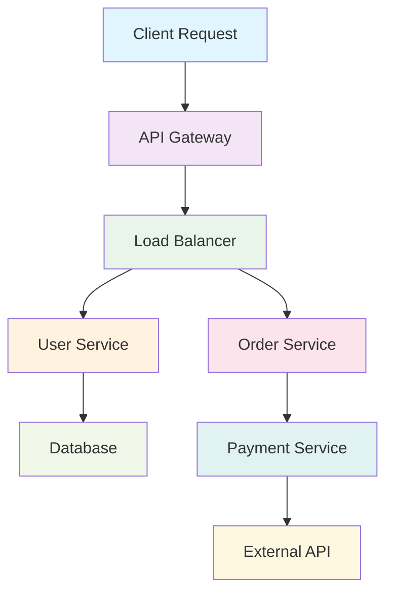

在现代分布式系统和微服务架构中，单个用户请求可能涉及多个服务的协同工作。这种复杂性使得传统的调试和监控方法难以有效定位问题。日志和Tracing作为可观测性的核心组件，为理解和优化分布式系统行为提供了强有力的工具。本文将深入探讨日志和Tracing在服务发现与负载均衡场景中的应用，以及如何构建全链路的可观测性体系。

## 可观测性三支柱

可观测性主要由三个核心组件构成：日志（Logs）、指标（Metrics）和追踪（Tracing）。在服务发现与负载均衡的场景中，这三个组件协同工作，提供全面的系统洞察。

### 1. 日志（Logs）
日志提供了系统行为的详细记录，是问题排查的重要依据。

### 2. 指标（Metrics）
指标提供了系统性能的量化数据，用于监控和告警。

### 3. 追踪（Tracing）
追踪提供了请求在系统中的完整流转路径，用于性能分析和瓶颈定位。

## 日志系统设计与实现

### 结结构化日志

#### 1. 日志格式设计
```json
{
  "timestamp": "2025-08-31T10:30:45.123Z",
  "level": "INFO",
  "service": "load-balancer",
  "trace_id": "abc123def456",
  "span_id": "789ghi012",
  "parent_span_id": "345jkl678",
  "operation": "route_request",
  "request_id": "req_987654321",
  "client_ip": "192.168.1.100",
  "target_service": "user-service",
  "target_instance": "user-service-7d5b8c9c4-xl2v9",
  "duration_ms": 45,
  "status_code": 200,
  "message": "Request routed successfully",
  "tags": {
    "protocol": "HTTP/1.1",
    "method": "GET",
    "path": "/api/users/123",
    "user_agent": "Mozilla/5.0..."
  },
  "metadata": {
    "region": "us-west-2",
    "cluster": "production",
    "version": "v1.2.3"
  }
}
```

#### 2. 日志收集系统
```go
// 结构化日志收集器
type StructuredLogger struct {
    logger      *log.Logger
    exporter    LogExporter
    buffer      *LogBuffer
    sampler     LogSampler
}

type LogEntry struct {
    Timestamp   time.Time          `json:"timestamp"`
    Level       LogLevel           `json:"level"`
    Service     string            `json:"service"`
    TraceID     string            `json:"trace_id,omitempty"`
    SpanID      string            `json:"span_id,omitempty"`
    Operation   string            `json:"operation"`
    RequestID   string            `json:"request_id,omitempty"`
    Duration    time.Duration     `json:"duration_ms,omitempty"`
    StatusCode  int               `json:"status_code,omitempty"`
    Message     string            `json:"message"`
    Tags        map[string]string `json:"tags,omitempty"`
    Metadata    map[string]string `json:"metadata,omitempty"`
}

func (sl *StructuredLogger) Log(entry LogEntry) error {
    // 采样过滤
    if !sl.sampler.ShouldLog(entry) {
        return nil
    }
    
    // 添加时间戳
    entry.Timestamp = time.Now().UTC()
    
    // 序列化日志条目
    jsonData, err := json.Marshal(entry)
    if err != nil {
        return fmt.Errorf("failed to marshal log entry: %v", err)
    }
    
    // 写入缓冲区
    sl.buffer.Add(jsonData)
    
    // 批量导出
    if sl.buffer.ShouldFlush() {
        return sl.flushLogs()
    }
    
    return nil
}

func (sl *StructuredLogger) flushLogs() error {
    logs := sl.buffer.Flush()
    if len(logs) == 0 {
        return nil
    }
    
    return sl.exporter.Export(logs)
}
```

### 日志采样策略

#### 1. 智能采样
```python
# 智能日志采样器
import random
from enum import Enum
from typing import Dict, Any

class LogLevel(Enum):
    DEBUG = 1
    INFO = 2
    WARN = 3
    ERROR = 4
    CRITICAL = 5

class IntelligentLogSampler:
    def __init__(self):
        self.base_rates = {
            LogLevel.DEBUG: 0.1,      # 10% DEBUG日志
            LogLevel.INFO: 0.5,       # 50% INFO日志
            LogLevel.WARN: 1.0,       # 100% WARN日志
            LogLevel.ERROR: 1.0,      # 100% ERROR日志
            LogLevel.CRITICAL: 1.0    # 100% CRITICAL日志
        }
        
        self.adaptive_rates = {}
        self.error_window = []
        self.window_size = 1000
    
    def should_log(self, entry: Dict[str, Any]) -> bool:
        """判断是否应该记录日志"""
        level = LogLevel[entry.get('level', 'INFO')]
        base_rate = self.base_rates.get(level, 0.5)
        
        # 获取自适应采样率
        adaptive_rate = self.adaptive_rates.get(level, 1.0)
        
        # 综合采样率
        final_rate = base_rate * adaptive_rate
        
        # 对于错误日志，根据错误率调整采样
        if level in [LogLevel.ERROR, LogLevel.CRITICAL]:
            error_rate = self.calculate_error_rate()
            if error_rate > 0.1:  # 错误率超过10%
                final_rate = min(1.0, final_rate * (1 + error_rate * 10))
        
        return random.random() < final_rate
    
    def calculate_error_rate(self) -> float:
        """计算错误率"""
        if not self.error_window:
            return 0.0
        
        error_count = sum(1 for entry in self.error_window 
                         if entry.get('level') in ['ERROR', 'CRITICAL'])
        return error_count / len(self.error_window)
    
    def update_adaptive_rates(self, metrics: Dict[str, float]):
        """更新自适应采样率"""
        # 根据系统负载调整采样率
        cpu_usage = metrics.get('cpu_usage', 0)
        memory_usage = metrics.get('memory_usage', 0)
        
        # 高负载时降低采样率
        if cpu_usage > 0.8 or memory_usage > 0.8:
            self.adaptive_rates[LogLevel.DEBUG] = 0.05
            self.adaptive_rates[LogLevel.INFO] = 0.2
        else:
            self.adaptive_rates[LogLevel.DEBUG] = 1.0
            self.adaptive_rates[LogLevel.INFO] = 1.0
```

## 分布式追踪系统

### Trace和Span模型

#### 1. 核心概念实现
```java
// 分布式追踪核心模型
public class Trace {
    private String traceId;
    private List<Span> spans;
    private long startTime;
    private long endTime;
    private Map<String, Object> tags;
    
    public Trace(String traceId) {
        this.traceId = traceId;
        this.spans = new ArrayList<>();
        this.tags = new HashMap<>();
        this.startTime = System.currentTimeMillis();
    }
    
    public void addSpan(Span span) {
        spans.add(span);
        if (span.getEndTime() > endTime) {
            endTime = span.getEndTime();
        }
    }
    
    public long getDuration() {
        return endTime - startTime;
    }
}

public class Span {
    private String spanId;
    private String traceId;
    private String parentSpanId;
    private String operationName;
    private long startTime;
    private long endTime;
    private Map<String, String> tags;
    private List<LogEntry> logs;
    private SpanStatus status;
    
    public Span(String traceId, String spanId, String parentSpanId, String operationName) {
        this.traceId = traceId;
        this.spanId = spanId;
        this.parentSpanId = parentSpanId;
        this.operationName = operationName;
        this.startTime = System.currentTimeMillis();
        this.tags = new HashMap<>();
        this.logs = new ArrayList<>();
        this.status = SpanStatus.OK;
    }
    
    public void finish() {
        this.endTime = System.currentTimeMillis();
    }
    
    public void log(String message) {
        logs.add(new LogEntry(System.currentTimeMillis(), message));
    }
    
    public void tag(String key, String value) {
        tags.put(key, value);
    }
    
    public long getDuration() {
        return endTime - startTime;
    }
}
```

#### 2. 追踪上下文传播
```go
// 追踪上下文传播
type TraceContext struct {
    TraceID      string
    SpanID       string
    ParentSpanID string
    Sampled      bool
    Baggage      map[string]string
}

// HTTP头部传播
const (
    TraceIDHeader     = "X-Trace-Id"
    SpanIDHeader      = "X-Span-Id"
    ParentSpanIDHeader = "X-Parent-Span-Id"
    SampledHeader     = "X-Sampled"
    BaggageHeader     = "X-Baggage-"
)

func InjectTraceContext(ctx context.Context, headers http.Header) {
    traceContext := GetTraceContext(ctx)
    if traceContext == nil {
        return
    }
    
    headers.Set(TraceIDHeader, traceContext.TraceID)
    headers.Set(SpanIDHeader, traceContext.SpanID)
    headers.Set(ParentSpanIDHeader, traceContext.ParentSpanID)
    headers.Set(SampledHeader, strconv.FormatBool(traceContext.Sampled))
    
    // 注入Baggage
    for key, value := range traceContext.Baggage {
        headers.Set(BaggageHeader+key, value)
    }
}

func ExtractTraceContext(headers http.Header) *TraceContext {
    traceID := headers.Get(TraceIDHeader)
    if traceID == "" {
        return nil
    }
    
    return &TraceContext{
        TraceID:      traceID,
        SpanID:       headers.Get(SpanIDHeader),
        ParentSpanID: headers.Get(ParentSpanIDHeader),
        Sampled:      headers.Get(SampledHeader) == "true",
        Baggage:      extractBaggage(headers),
    }
}
```

### 负载均衡场景的追踪实现

#### 1. 负载均衡器追踪
```python
# 负载均衡器追踪实现
import time
from typing import Optional
from dataclasses import dataclass

@dataclass
class LoadBalancerSpan:
    trace_id: str
    span_id: str
    parent_span_id: Optional[str]
    operation: str
    start_time: float
    end_time: Optional[float] = None
    tags: dict = None
    logs: list = None
    
    def __post_init__(self):
        if self.tags is None:
            self.tags = {}
        if self.logs is None:
            self.logs = []
    
    def finish(self):
        self.end_time = time.time()
    
    def add_tag(self, key: str, value: str):
        self.tags[key] = value
    
    def add_log(self, message: str):
        self.logs.append({
            'timestamp': time.time(),
            'message': message
        })

class LoadBalancerTracer:
    def __init__(self, exporter):
        self.exporter = exporter
        self.active_spans = {}
    
    def start_span(self, trace_id: str, parent_span_id: Optional[str], 
                   operation: str) -> LoadBalancerSpan:
        span_id = self.generate_span_id()
        span = LoadBalancerSpan(
            trace_id=trace_id,
            span_id=span_id,
            parent_span_id=parent_span_id,
            operation=operation,
            start_time=time.time()
        )
        
        self.active_spans[span_id] = span
        return span
    
    def end_span(self, span: LoadBalancerSpan):
        span.finish()
        self.export_span(span)
        del self.active_spans[span.span_id]
    
    def export_span(self, span: LoadBalancerSpan):
        # 异步导出Span数据
        self.exporter.export_span(span)
    
    def generate_span_id(self) -> str:
        # 生成唯一的Span ID
        return f"span_{int(time.time() * 1000000) % 1000000}"
```

#### 2. 服务调用追踪
```go
// 服务调用追踪实现
type ServiceCallTracer struct {
    tracer *LoadBalancerTracer
    collector *TraceCollector
}

func (sct *ServiceCallTracer) TraceServiceCall(ctx context.Context, 
                                              request *ServiceRequest,
                                              targetInstance *ServiceInstance) *ServiceCallSpan {
    // 从上下文提取追踪信息
    traceContext := ExtractTraceContextFromContext(ctx)
    
    // 创建新的Span
    span := sct.tracer.StartSpan(traceContext.TraceID, traceContext.SpanID, "service_call")
    span.AddTag("service_name", request.ServiceName)
    span.AddTag("target_instance", targetInstance.Address)
    span.AddTag("request_method", request.Method)
    span.AddTag("request_path", request.Path)
    
    // 记录开始日志
    span.AddLog(fmt.Sprintf("Starting service call to %s", targetInstance.Address))
    
    return &ServiceCallSpan{
        Span: span,
        StartTime: time.Now(),
    }
}

func (sct *ServiceCallTracer) FinishServiceCall(span *ServiceCallSpan, response *ServiceResponse, err error) {
    duration := time.Since(span.StartTime)
    
    // 记录结果
    if err != nil {
        span.AddTag("error", "true")
        span.AddTag("error_message", err.Error())
        span.AddLog(fmt.Sprintf("Service call failed after %v: %v", duration, err))
    } else {
        span.AddTag("status_code", strconv.Itoa(response.StatusCode))
        span.AddTag("response_size", strconv.Itoa(len(response.Body)))
        span.AddLog(fmt.Sprintf("Service call completed successfully in %v", duration))
    }
    
    span.AddTag("duration_ms", fmt.Sprintf("%.2f", duration.Seconds()*1000))
    
    // 结束Span
    sct.tracer.EndSpan(span.Span)
}
```

## 全链路追踪实现

### 1. 请求链路追踪


#### 链路追踪实现
```java
// 全链路追踪实现
public class FullStackTracer {
    private Tracer tracer;
    private TraceExporter exporter;
    
    public Span startLoadBalancerSpan(String traceId, String parentSpanId, 
                                    LoadBalancerRequest request) {
        Span span = tracer.buildSpan("load_balancer_route")
                .withTag("service_name", request.getServiceName())
                .withTag("client_ip", request.getClientIP())
                .withTag("protocol", request.getProtocol())
                .start();
        
        // 记录路由决策
        span.log("Selecting target instance based on load balancing algorithm");
        
        return span;
    }
    
    public void recordRoutingDecision(Span span, ServiceInstance selectedInstance, 
                                    LoadBalancingAlgorithm algorithm) {
        span.setTag("selected_instance", selectedInstance.getAddress())
            .setTag("algorithm", algorithm.getName())
            .setTag("instance_health", selectedInstance.getHealthStatus().toString())
            .log("Routing decision made: " + selectedInstance.getAddress());
    }
    
    public void recordServiceCall(Span span, ServiceCall call) {
        span.log(Map.of(
            "event", "service_call",
            "target_service", call.getTargetService(),
            "target_instance", call.getTargetInstance(),
            "start_time", call.getStartTime().toString()
        ));
    }
    
    public void finishLoadBalancerSpan(Span span, LoadBalancerResponse response) {
        span.setTag("response_status", String.valueOf(response.getStatusCode()))
            .setTag("response_time_ms", response.getResponseTime())
            .log("Load balancer processing completed")
            .finish();
    }
}
```

### 2. 性能瓶颈分析
```python
# 性能瓶颈分析工具
class PerformanceAnalyzer:
    def __init__(self, trace_store):
        self.trace_store = trace_store
        self.bottleneck_detectors = [
            self.detect_high_latency_spans,
            self.detect_error_patterns,
            self.detect_resource_contention
        ]
    
    def analyze_trace(self, trace_id: str) -> dict:
        """分析完整链路追踪"""
        trace = self.trace_store.get_trace(trace_id)
        if not trace:
            return {"error": "Trace not found"}
        
        analysis = {
            "trace_id": trace_id,
            "total_duration": trace.get_duration(),
            "span_count": len(trace.spans),
            "bottlenecks": [],
            "errors": [],
            "recommendations": []
        }
        
        # 运行所有瓶颈检测器
        for detector in self.bottleneck_detectors:
            results = detector(trace)
            analysis["bottlenecks"].extend(results.get("bottlenecks", []))
            analysis["errors"].extend(results.get("errors", []))
            analysis["recommendations"].extend(results.get("recommendations", []))
        
        return analysis
    
    def detect_high_latency_spans(self, trace) -> dict:
        """检测高延迟Span"""
        bottlenecks = []
        recommendations = []
        
        avg_duration = sum(span.get_duration() for span in trace.spans) / len(trace.spans)
        threshold = avg_duration * 3  # 超过平均值3倍的Span
        
        for span in trace.spans:
            if span.get_duration() > threshold:
                bottlenecks.append({
                    "span_id": span.span_id,
                    "operation": span.operation_name,
                    "duration": span.get_duration(),
                    "threshold": threshold
                })
                
                # 生成推荐
                if "database" in span.operation_name.lower():
                    recommendations.append("Consider optimizing database queries or adding indexes")
                elif "external" in span.operation_name.lower():
                    recommendations.append("Check external service performance or implement caching")
        
        return {
            "bottlenecks": bottlenecks,
            "recommendations": recommendations
        }
```

## 日志与追踪的集成

### 1. 统一上下文管理
```go
// 统一上下文管理
type ObservabilityContext struct {
    TraceID    string
    SpanID     string
    RequestID  string
    UserID     string
    SessionID  string
    Tags       map[string]string
}

func (oc *ObservabilityContext) ToLogFields() map[string]interface{} {
    fields := map[string]interface{}{
        "trace_id":   oc.TraceID,
        "span_id":    oc.SpanID,
        "request_id": oc.RequestID,
    }
    
    // 添加用户标识
    if oc.UserID != "" {
        fields["user_id"] = oc.UserID
    }
    
    // 添加会话标识
    if oc.SessionID != "" {
        fields["session_id"] = oc.SessionID
    }
    
    // 添加自定义标签
    for key, value := range oc.Tags {
        fields[key] = value
    }
    
    return fields
}

func (oc *ObservabilityContext) ToTraceTags() map[string]string {
    tags := make(map[string]string)
    
    if oc.RequestID != "" {
        tags["request_id"] = oc.RequestID
    }
    
    if oc.UserID != "" {
        tags["user_id"] = oc.UserID
    }
    
    if oc.SessionID != "" {
        tags["session_id"] = oc.SessionID
    }
    
    // 添加自定义标签
    for key, value := range oc.Tags {
        tags[key] = value
    }
    
    return tags
}
```

### 2. 跨组件日志关联
```java
// 跨组件日志关联实现
public class CorrelatedLogger {
    private static final Logger logger = LoggerFactory.getLogger(CorrelatedLogger.class);
    private ObservabilityContext context;
    
    public CorrelatedLogger(ObservabilityContext context) {
        this.context = context;
    }
    
    public void info(String message, Object... args) {
        MDC.put("trace_id", context.getTraceID());
        MDC.put("span_id", context.getSpanID());
        MDC.put("request_id", context.getRequestID());
        
        if (context.getUserID() != null) {
            MDC.put("user_id", context.getUserID());
        }
        
        logger.info(message, args);
        
        // 清理MDC
        MDC.clear();
    }
    
    public void error(String message, Throwable throwable) {
        MDC.put("trace_id", context.getTraceID());
        MDC.put("span_id", context.getSpanID());
        MDC.put("request_id", context.getRequestID());
        
        logger.error(message, throwable);
        
        // 清理MDC
        MDC.clear();
    }
    
    // 在Span中记录日志
    public void logInSpan(Span span, String message) {
        span.log(Map.of(
            "event", "log",
            "message", message,
            "timestamp", System.currentTimeMillis()
        ));
        
        // 同时记录到结构化日志
        info("Span log: {}", message);
    }
}
```

## 监控与告警集成

### 1. 基于追踪的告警
```yaml
# 基于追踪的告警规则
tracing_alerts:
  - name: "HighLatencyTrace"
    description: "请求链路延迟过高"
    metric: "trace_duration"
    threshold: 5000  # 5秒
    comparison: "greater_than"
    duration: "5m"
    severity: "warning"
    actions:
      - "send_alert"
      - "analyze_trace"
  
  - name: "TraceErrorRate"
    description: "链路错误率过高"
    metric: "trace_error_rate"
    threshold: 0.05  # 5%
    comparison: "greater_than"
    duration: "10m"
    severity: "critical"
    actions:
      - "send_critical_alert"
      - "trigger_investigation"
  
  - name: "ServiceDegradation"
    description: "服务性能下降"
    metric: "service_response_time"
    threshold: 2000  # 2秒
    comparison: "greater_than"
    duration: "15m"
    severity: "warning"
    actions:
      - "send_alert"
      - "recommend_scaling"
```

### 2. 自动化分析与建议
```python
# 自动化分析与建议系统
class AutomatedAnalysisSystem:
    def __init__(self, trace_analyzer, metric_collector, recommendation_engine):
        self.trace_analyzer = trace_analyzer
        self.metric_collector = metric_collector
        self.recommendation_engine = recommendation_engine
    
    def analyze_and_recommend(self, alert) -> dict:
        """分析告警并生成建议"""
        recommendations = []
        
        # 基于追踪数据分析
        if "trace" in alert.metric:
            trace_analysis = self.trace_analyzer.analyze_alert_traces(alert)
            recommendations.extend(trace_analysis.get("recommendations", []))
        
        # 基于指标数据分析
        if "metric" in alert.metric:
            metric_analysis = self.metric_collector.analyze_trends(alert.metric)
            recommendations.extend(metric_analysis.get("recommendations", []))
        
        # 生成具体建议
        specific_recommendations = self.recommendation_engine.generate_recommendations(
            alert, 
            trace_analysis if "trace" in alert.metric else None,
            metric_analysis if "metric" in alert.metric else None
        )
        
        return {
            "alert": alert,
            "analysis": {
                "trace_analysis": trace_analysis if "trace" in alert.metric else None,
                "metric_analysis": metric_analysis if "metric" in alert.metric else None
            },
            "recommendations": specific_recommendations
        }
```

## 最佳实践

### 1. 采样策略配置
```yaml
# 采样策略最佳实践
sampling_strategies:
  # 基础采样率
  base_rates:
    debug: 0.1    # 10% DEBUG日志
    info: 0.5     # 50% INFO日志
    warn: 1.0     # 100% WARN日志
    error: 1.0    # 100% ERROR日志
  
  # 自适应采样
  adaptive_sampling:
    high_load_threshold: 0.8
    low_load_sampling_rate: 1.0
    high_load_sampling_rate: 0.1
  
  # 错误采样增强
  error_enhancement:
    error_rate_threshold: 0.1
    enhancement_factor: 10
  
  # 追踪采样
  tracing_sampling:
    default_rate: 0.1  # 10%的请求进行追踪
    critical_service_rate: 1.0  # 关键服务100%追踪
    error_trace_rate: 1.0  # 错误请求100%追踪
```

### 2. 日志格式标准化
```json
{
  "version": "1.0",
  "timestamp": "2025-08-31T10:30:45.123Z",
  "level": "INFO",
  "service": "load-balancer",
  "component": "routing",
  "trace_id": "abc123def456",
  "span_id": "789ghi012",
  "parent_span_id": "345jkl678",
  "operation": "route_request",
  "request_id": "req_987654321",
  "client": {
    "ip": "192.168.1.100",
    "user_agent": "Mozilla/5.0..."
  },
  "target": {
    "service": "user-service",
    "instance": "user-service-7d5b8c9c4-xl2v9",
    "endpoint": "/api/users/123"
  },
  "performance": {
    "duration_ms": 45,
    "response_size_bytes": 1024
  },
  "result": {
    "status_code": 200,
    "success": true
  },
  "message": "Request routed successfully",
  "tags": {
    "protocol": "HTTP/1.1",
    "method": "GET",
    "region": "us-west-2",
    "cluster": "production"
  },
  "metadata": {
    "version": "v1.2.3",
    "build": "20250831-1030"
  }
}
```

## 总结

日志和Tracing作为可观测性的核心组件，在服务发现与负载均衡场景中发挥着至关重要的作用。通过构建结构化的日志系统、实现全链路追踪以及将两者有效集成，可以为分布式系统提供全面的可观测性能力。

关键要点包括：
1. **结构化日志设计**：采用统一的JSON格式，包含丰富的上下文信息
2. **智能采样策略**：根据日志级别和系统状态动态调整采样率
3. **全链路追踪实现**：通过Trace和Span模型实现请求的完整追踪
4. **跨组件上下文关联**：确保日志和追踪信息的一致性和关联性
5. **自动化分析与建议**：基于观测数据提供智能化的问题分析和解决建议

随着系统复杂性的增加和业务需求的变化，可观测性体系也需要持续演进。企业应该建立完善的日志和追踪基础设施，通过数据驱动的方式不断优化系统性能，提升用户体验，确保业务的稳定运行。通过合理的可观测性设计和有效的监控告警机制，可以及时发现并解决潜在问题，为构建高可用、高性能的分布式系统提供有力保障。

在实施过程中，需要注意平衡观测数据的完整性和系统性能的影响，通过合理的采样策略和数据存储优化，确保可观测性体系既能提供足够的洞察力，又不会对系统性能造成过大负担。