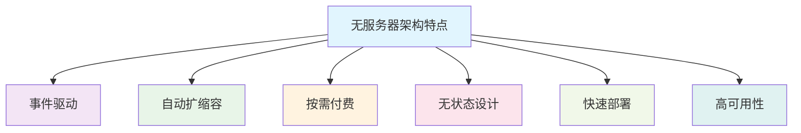

随着云计算技术的快速发展，无服务器（Serverless）架构已成为构建现代应用的重要范式。在无服务器环境中，传统的服务发现和负载均衡机制面临着新的挑战和机遇。本文将深入探讨无服务器架构中的服务发现与负载均衡技术，分析其特点、实现方式以及最佳实践，帮助开发者构建更加弹性、高效的云原生应用。

## 无服务器架构概述

### 什么是无服务器架构

无服务器架构（Serverless Architecture）是一种云计算执行模型，其中云提供商动态管理机器资源的分配和供应。从开发者的角度来看，服务器仍然存在，但它们对开发者是完全抽象的。无服务器架构主要包括两种类型：

1. **Function as a Service (FaaS)**：如AWS Lambda、Azure Functions、Google Cloud Functions
2. **Backend as a Service (BaaS)**：如Firebase、AWS Amplify、Azure Mobile Apps

### 无服务器架构的特点



## 无服务器环境中的服务发现挑战

### 1. 动态性挑战
在无服务器环境中，函数实例的生命周期非常短暂，可能在毫秒级时间内创建和销毁，这给传统的服务发现机制带来了巨大挑战。

### 2. 无状态性挑战
无服务器函数通常是无状态的，无法像传统服务那样维护长时间的连接和会话状态。

### 3. 弹性挑战
函数实例的数量可能在短时间内发生剧烈变化，需要服务发现机制能够快速适应这种变化。

### 4. 延迟挑战
冷启动问题可能导致函数调用的延迟，影响用户体验。

## 无服务器服务发现解决方案

### 1. 平台内置服务发现

#### AWS Lambda与API Gateway集成
```yaml
# AWS SAM模板示例
AWSTemplateFormatVersion: '2010-09-09'
Transform: AWS::Serverless-2016-10-31

Resources:
  UserServiceFunction:
    Type: AWS::Serverless::Function
    Properties:
      CodeUri: src/user-service/
      Handler: index.handler
      Runtime: nodejs18.x
      Events:
        GetUser:
          Type: Api
          Properties:
            Path: /users/{id}
            Method: get
        CreateUser:
          Type: Api
          Properties:
            Path: /users
            Method: post
      Environment:
        Variables:
          USER_TABLE_NAME: !Ref UserTable
          SERVICE_DISCOVERY_NAMESPACE: ecommerce-services

  ProductServiceFunction:
    Type: AWS::Serverless::Function
    Properties:
      CodeUri: src/product-service/
      Handler: index.handler
      Runtime: nodejs18.x
      Events:
        GetProduct:
          Type: Api
          Properties:
            Path: /products/{id}
            Method: get
      Environment:
        Variables:
          PRODUCT_TABLE_NAME: !Ref ProductTable
          USER_SERVICE_ENDPOINT: !Sub "https://${ServerlessRestApi}.execute-api.${AWS::Region}.amazonaws.com/Prod"
```

#### Google Cloud Functions与Cloud Run集成
```yaml
# Google Cloud Run服务配置
apiVersion: serving.knative.dev/v1
kind: Service
metadata:
  name: user-service
spec:
  template:
    spec:
      containers:
      - image: gcr.io/project-id/user-service:latest
        env:
        - name: PORT
          value: "8080"
        - name: SERVICE_REGISTRY
          value: "projects/project-id/locations/us-central1/namespaces/default"
        ports:
        - containerPort: 8080
      serviceAccountName: service-account@project-id.iam.gserviceaccount.com
```

### 2. 外部服务发现集成

#### Consul集成示例
```go
// 无服务器函数中的Consul集成
package main

import (
    "context"
    "encoding/json"
    "log"
    "os"
    
    "github.com/aws/aws-lambda-go/events"
    "github.com/aws/aws-lambda-go/lambda"
    "github.com/hashicorp/consul/api"
)

type Handler struct {
    consulClient *api.Client
}

func (h *Handler) HandleRequest(ctx context.Context, request events.APIGatewayProxyRequest) (events.APIGatewayProxyResponse, error) {
    // 从Consul获取服务信息
    services, _, err := h.consulClient.Health().Service("payment-service", "", true, nil)
    if err != nil || len(services) == 0 {
        return events.APIGatewayProxyResponse{
            StatusCode: 500,
            Body:       `{"error": "Service discovery failed"}`,
        }, nil
    }
    
    // 选择健康的服务实例
    serviceInstance := services[0]
    serviceURL := "http://" + serviceInstance.Service.Address + ":" + fmt.Sprintf("%d", serviceInstance.Service.Port)
    
    // 调用服务
    response, err := callPaymentService(serviceURL, request.Body)
    if err != nil {
        return events.APIGatewayProxyResponse{
            StatusCode: 500,
            Body:       `{"error": "Service call failed"}`,
        }, nil
    }
    
    return events.APIGatewayProxyResponse{
        StatusCode: 200,
        Body:       response,
        Headers: map[string]string{
            "Content-Type": "application/json",
        },
    }, nil
}

func main() {
    // 初始化Consul客户端
    consulConfig := api.DefaultConfig()
    consulConfig.Address = os.Getenv("CONSUL_HTTP_ADDR")
    
    consulClient, err := api.NewClient(consulConfig)
    if err != nil {
        log.Fatal("Failed to create Consul client:", err)
    }
    
    handler := &Handler{
        consulClient: consulClient,
    }
    
    lambda.Start(handler.HandleRequest)
}
```

## 无服务器负载均衡策略

### 1. 平台级负载均衡

#### AWS Lambda并发控制
```yaml
# AWS Lambda并发控制配置
Resources:
  UserServiceFunction:
    Type: AWS::Lambda::Function
    Properties:
      FunctionName: user-service
      Code:
        S3Bucket: my-deployment-bucket
        S3Key: user-service.zip
      Handler: index.handler
      Runtime: nodejs18.x
      ReservedConcurrentExecutions: 100  # 预留并发数
      Environment:
        Variables:
          MAX_CONCURRENT_REQUESTS: "50"
```

```javascript
// Lambda函数中的并发控制
const MAX_CONCURRENT_REQUESTS = parseInt(process.env.MAX_CONCURRENT_REQUESTS) || 10;
let currentRequests = 0;

exports.handler = async (event, context) => {
    // 检查并发限制
    if (currentRequests >= MAX_CONCURRENT_REQUESTS) {
        return {
            statusCode: 429,
            body: JSON.stringify({ error: 'Too many concurrent requests' })
        };
    }
    
    currentRequests++;
    
    try {
        // 处理业务逻辑
        const result = await processRequest(event);
        return {
            statusCode: 200,
            body: JSON.stringify(result)
        };
    } finally {
        currentRequests--;
    }
};
```

### 2. 应用级负载均衡

#### 函数级负载均衡实现
```python
# AWS Lambda中的负载均衡实现
import boto3
import json
import random
from typing import List, Dict

class ServerlessLoadBalancer:
    def __init__(self):
        self.lambda_client = boto3.client('lambda')
        self.service_endpoints = {}
        self.health_status = {}
    
    def discover_services(self, service_name: str) -> List[str]:
        """发现服务实例"""
        if service_name in self.service_endpoints:
            return self.service_endpoints[service_name]
        
        # 从服务注册表获取服务列表
        endpoints = self._get_service_endpoints(service_name)
        self.service_endpoints[service_name] = endpoints
        return endpoints
    
    def select_endpoint(self, service_name: str) -> str:
        """选择服务端点"""
        endpoints = self.discover_services(service_name)
        healthy_endpoints = [ep for ep in endpoints if self._is_healthy(ep)]
        
        if not healthy_endpoints:
            raise Exception(f"No healthy endpoints for service {service_name}")
        
        # 使用加权轮询算法选择端点
        return self._weighted_round_robin(healthy_endpoints)
    
    def _weighted_round_robin(self, endpoints: List[str]) -> str:
        """加权轮询算法"""
        # 简化实现，实际应用中可以使用更复杂的权重算法
        return random.choice(endpoints)
    
    def _is_healthy(self, endpoint: str) -> bool:
        """检查端点健康状态"""
        # 实现健康检查逻辑
        return self.health_status.get(endpoint, True)
    
    def call_service(self, service_name: str, payload: Dict) -> Dict:
        """调用服务"""
        endpoint = self.select_endpoint(service_name)
        
        try:
            response = self.lambda_client.invoke(
                FunctionName=endpoint,
                InvocationType='RequestResponse',
                Payload=json.dumps(payload)
            )
            
            result = json.loads(response['Payload'].read())
            return result
        except Exception as e:
            # 标记端点为不健康
            self.health_status[endpoint] = False
            raise e

# 使用示例
load_balancer = ServerlessLoadBalancer()

def lambda_handler(event, context):
    try:
        # 调用用户服务
        user_result = load_balancer.call_service('user-service', {
            'operation': 'get_user',
            'user_id': event['user_id']
        })
        
        # 调用订单服务
        order_result = load_balancer.call_service('order-service', {
            'operation': 'get_orders',
            'user_id': event['user_id']
        })
        
        return {
            'statusCode': 200,
            'body': json.dumps({
                'user': user_result,
                'orders': order_result
            })
        }
    except Exception as e:
        return {
            'statusCode': 500,
            'body': json.dumps({
                'error': str(e)
            })
        }
```

## 服务网格在无服务器中的应用

### 1. Istio与Knative集成
```yaml
# Knative服务配置
apiVersion: serving.knative.dev/v1
kind: Service
metadata:
  name: serverless-service
spec:
  template:
    metadata:
      annotations:
        # 启用Istio sidecar注入
        sidecar.istio.io/inject: "true"
        # 配置Istio流量策略
        traffic.sidecar.istio.io/includeInboundPorts: "*"
    spec:
      containers:
      - image: gcr.io/project/serverless-service:latest
        env:
        - name: SERVICE_NAME
          value: "serverless-service"
        ports:
        - containerPort: 8080
        resources:
          requests:
            cpu: 100m
            memory: 128Mi
          limits:
            cpu: 1000m
            memory: 512Mi
```

### 2. Linkerd集成
```yaml
# Linkerd服务配置
apiVersion: apps/v1
kind: Deployment
metadata:
  name: serverless-deployment
  labels:
    app: serverless-app
spec:
  replicas: 3
  selector:
    matchLabels:
      app: serverless-app
  template:
    metadata:
      annotations:
        linkerd.io/inject: enabled
      labels:
        app: serverless-app
    spec:
      containers:
      - name: serverless-container
        image: serverless-app:latest
        ports:
        - containerPort: 8080
        env:
        - name: LINKERD_SVC_NAME
          valueFrom:
            fieldRef:
              fieldPath: metadata.name
```

## 无服务器服务发现最佳实践

### 1. 配置管理
```yaml
# AWS Systems Manager Parameter Store配置
Parameters:
  /ecommerce/services/user-service/endpoint:
    Type: String
    Value: !Sub "https://user-service-${Stage}.example.com"
  
  /ecommerce/services/product-service/endpoint:
    Type: String
    Value: !Sub "https://product-service-${Stage}.example.com"
  
  /ecommerce/services/order-service/endpoint:
    Type: String
    Value: !Sub "https://order-service-${Stage}.example.com"
```

```python
# 使用Parameter Store的服务发现
import boto3
import os

class ParameterStoreDiscovery:
    def __init__(self):
        self.ssm_client = boto3.client('ssm')
        self.stage = os.environ.get('STAGE', 'dev')
        self.cache = {}
    
    def get_service_endpoint(self, service_name: str) -> str:
        """获取服务端点"""
        cache_key = f"{service_name}-{self.stage}"
        
        if cache_key in self.cache:
            return self.cache[cache_key]
        
        parameter_name = f"/ecommerce/services/{service_name}/endpoint"
        try:
            response = self.ssm_client.get_parameter(
                Name=parameter_name,
                WithDecryption=True
            )
            
            endpoint = response['Parameter']['Value']
            self.cache[cache_key] = endpoint
            return endpoint
        except Exception as e:
            raise Exception(f"Failed to get service endpoint for {service_name}: {str(e)}")
```

### 2. 健康检查机制
```go
// 无服务器健康检查实现
package main

import (
    "context"
    "net/http"
    "time"
)

type HealthChecker struct {
    httpClient *http.Client
    timeout    time.Duration
}

func NewHealthChecker(timeout time.Duration) *HealthChecker {
    return &HealthChecker{
        httpClient: &http.Client{
            Timeout: timeout,
        },
        timeout: timeout,
    }
}

func (hc *HealthChecker) CheckEndpoint(ctx context.Context, endpoint string) bool {
    req, err := http.NewRequestWithContext(ctx, "GET", endpoint+"/health", nil)
    if err != nil {
        return false
    }
    
    resp, err := hc.httpClient.Do(req)
    if err != nil {
        return false
    }
    defer resp.Body.Close()
    
    return resp.StatusCode == http.StatusOK
}

func (hc *HealthChecker) CheckService(ctx context.Context, serviceName string) bool {
    // 获取服务端点
    endpoints := discoverServiceEndpoints(serviceName)
    
    // 检查所有端点的健康状态
    for _, endpoint := range endpoints {
        if hc.CheckEndpoint(ctx, endpoint) {
            return true // 至少有一个健康端点
        }
    }
    
    return false
}
```

## 无服务器负载均衡最佳实践

### 1. 冷启动优化
```javascript
// AWS Lambda冷启动优化
const AWS = require('aws-sdk');
const s3 = new AWS.S3();

// 全局变量缓存
let modelCache = null;
let configCache = null;

// 初始化函数
async function initialize() {
    if (!modelCache) {
        // 预加载模型
        const modelData = await s3.getObject({
            Bucket: 'ml-models-bucket',
            Key: 'recommendation-model.pkl'
        }).promise();
        modelCache = modelData.Body;
    }
    
    if (!configCache) {
        // 预加载配置
        const configData = await s3.getObject({
            Bucket: 'config-bucket',
            Key: 'service-config.json'
        }).promise();
        configCache = JSON.parse(configData.Body.toString());
    }
}

exports.handler = async (event, context) => {
    // 确保初始化完成
    await initialize();
    
    // 处理业务逻辑
    return processRequest(event, modelCache, configCache);
};
```

### 2. 并发控制
```python
# 并发控制实现
import asyncio
import aioboto3
from concurrent.futures import ThreadPoolExecutor

class ConcurrencyController:
    def __init__(self, max_concurrent: int = 10):
        self.max_concurrent = max_concurrent
        self.semaphore = asyncio.Semaphore(max_concurrent)
        self.executor = ThreadPoolExecutor(max_workers=max_concurrent)
    
    async def execute_with_limit(self, func, *args, **kwargs):
        """限制并发执行"""
        async with self.semaphore:
            loop = asyncio.get_event_loop()
            return await loop.run_in_executor(
                self.executor, 
                lambda: func(*args, **kwargs)
            )

# 使用示例
controller = ConcurrencyController(max_concurrent=5)

async def process_batch(events):
    tasks = []
    for event in events:
        task = controller.execute_with_limit(process_event, event)
        tasks.append(task)
    
    results = await asyncio.gather(*tasks, return_exceptions=True)
    return results
```

## 监控与可观测性

### 1. 分布式追踪
```python
# OpenTelemetry集成
from opentelemetry import trace
from opentelemetry.exporter.otlp.proto.grpc.trace_exporter import OTLPSpanExporter
from opentelemetry.sdk.resources import Resource
from opentelemetry.sdk.trace import TracerProvider
from opentelemetry.sdk.trace.export import BatchSpanProcessor

# 初始化追踪器
def init_tracer():
    resource = Resource(attributes={
        "service.name": "serverless-service"
    })
    
    tracer_provider = TracerProvider(resource=resource)
    otlp_exporter = OTLPSpanExporter(endpoint="http://otel-collector:4317")
    tracer_provider.add_span_processor(BatchSpanProcessor(otlp_exporter))
    
    trace.set_tracer_provider(tracer_provider)

def lambda_handler(event, context):
    tracer = trace.get_tracer(__name__)
    
    with tracer.start_as_current_span("process_request") as span:
        span.set_attribute("request.id", event.get("requestId"))
        
        try:
            result = process_business_logic(event)
            span.set_status(StatusCode.OK)
            return result
        except Exception as e:
            span.set_status(StatusCode.ERROR)
            span.record_exception(e)
            raise e
```

### 2. 指标收集
```go
// Prometheus指标收集
package main

import (
    "github.com/prometheus/client_golang/prometheus"
    "github.com/prometheus/client_golang/prometheus/promauto"
)

var (
    requestCount = promauto.NewCounterVec(
        prometheus.CounterOpts{
            Name: "serverless_requests_total",
            Help: "Total number of requests",
        },
        []string{"function_name", "status"},
    )
    
    requestDuration = promauto.NewHistogramVec(
        prometheus.HistogramOpts{
            Name:    "serverless_request_duration_seconds",
            Help:    "Request duration in seconds",
            Buckets: prometheus.DefBuckets,
        },
        []string{"function_name"},
    )
)

func recordMetrics(functionName string, status string, duration float64) {
    requestCount.WithLabelValues(functionName, status).Inc()
    requestDuration.WithLabelValues(functionName).Observe(duration)
}
```

## 故障处理与恢复

### 1. 熔断器模式
```java
// 熔断器实现
public class ServerlessCircuitBreaker {
    private final int failureThreshold;
    private final long timeout;
    private final int timeoutRequests;
    
    private int failureCount = 0;
    private int timeoutCount = 0;
    private long lastFailureTime = 0;
    private CircuitState state = CircuitState.CLOSED;
    
    public enum CircuitState {
        CLOSED, OPEN, HALF_OPEN
    }
    
    public <T> CompletableFuture<T> executeAsync(Supplier<CompletableFuture<T>> operation) {
        if (state == CircuitState.OPEN) {
            if (System.currentTimeMillis() - lastFailureTime > timeout) {
                state = CircuitState.HALF_OPEN;
            } else {
                return CompletableFuture.failedFuture(
                    new CircuitBreakerOpenException("Circuit breaker is open")
                );
            }
        }
        
        return operation.get()
            .whenComplete((result, throwable) -> {
                if (throwable != null) {
                    onFailure(throwable);
                } else {
                    onSuccess();
                }
            });
    }
    
    private void onSuccess() {
        failureCount = 0;
        timeoutCount = 0;
        state = CircuitState.CLOSED;
    }
    
    private void onFailure(Throwable throwable) {
        failureCount++;
        lastFailureTime = System.currentTimeMillis();
        
        if (throwable instanceof TimeoutException) {
            timeoutCount++;
        }
        
        if (failureCount >= failureThreshold || timeoutCount >= timeoutRequests) {
            state = CircuitState.OPEN;
        }
    }
}
```

### 2. 重试机制
```python
# 指数退避重试
import asyncio
import random
from typing import Callable, Any

class ExponentialBackoffRetry:
    def __init__(self, max_retries: int = 3, base_delay: float = 1.0, max_delay: float = 60.0):
        self.max_retries = max_retries
        self.base_delay = base_delay
        self.max_delay = max_delay
    
    async def execute(self, func: Callable, *args, **kwargs) -> Any:
        for attempt in range(self.max_retries + 1):
            try:
                return await func(*args, **kwargs)
            except Exception as e:
                if attempt == self.max_retries:
                    raise e
                
                # 计算延迟时间
                delay = min(
                    self.base_delay * (2 ** attempt) + random.uniform(0, 1),
                    self.max_delay
                )
                
                # 等待后重试
                await asyncio.sleep(delay)

# 使用示例
retry_handler = ExponentialBackoffRetry(max_retries=3, base_delay=1.0)

async def call_service():
    # 调用外部服务
    pass

async def lambda_handler(event, context):
    try:
        result = await retry_handler.execute(call_service)
        return {"statusCode": 200, "body": result}
    except Exception as e:
        return {"statusCode": 500, "body": str(e)}
```

## 总结

无服务器架构中的服务发现与负载均衡面临着独特的挑战，但也提供了新的解决方案和优化机会。通过合理利用平台提供的服务发现机制、集成外部服务注册中心、实施有效的负载均衡策略，可以构建出高可用、高性能的无服务器应用。

关键要点包括：

1. **理解无服务器特点**：掌握无服务器架构的动态性、无状态性和弹性特点
2. **选择合适的服务发现方案**：根据平台特性和业务需求选择内置或外部服务发现机制
3. **实施有效的负载均衡策略**：结合平台级和应用级负载均衡实现最优性能
4. **集成服务网格技术**：利用Istio、Linkerd等服务网格提升服务治理能力
5. **优化冷启动性能**：通过预加载和缓存机制减少冷启动延迟
6. **建立完善的监控体系**：实施分布式追踪和指标收集确保系统可观测性
7. **实现容错机制**：通过熔断器和重试机制提高系统稳定性

随着无服务器技术的不断发展和成熟，服务发现与负载均衡机制也将持续演进。开发者应该密切关注技术发展趋势，结合具体业务场景，选择和实施最适合的服务发现与负载均衡方案，为构建现代化的云原生应用奠定坚实基础。