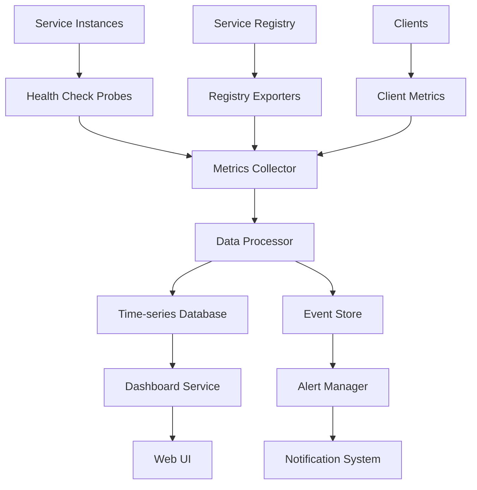

在微服务架构中，服务发现机制是连接服务的关键基础设施。它负责维护服务实例的注册信息、健康状态和路由信息。然而，服务发现组件本身的稳定性和可靠性同样重要，一旦出现问题可能导致整个系统的服务调用失败。因此，建立完善的服务发现监控与健康状态追踪体系至关重要。本文将深入探讨服务发现监控的核心要素、实现方法以及最佳实践。

## 服务发现监控的重要性

服务发现作为微服务架构的核心组件，承担着服务注册、发现和健康检查等关键职责。其稳定性直接影响到整个系统的可用性。通过有效的监控，可以：

1. **及时发现组件故障**：在服务发现组件出现问题时快速响应
2. **保障服务可用性**：确保服务注册和发现功能正常运行
3. **优化系统性能**：通过监控数据优化服务发现性能
4. **支持故障排查**：为问题诊断提供数据支持

## 核心监控指标

### 1. 注册中心健康状态

#### 注册中心监控实现

```go
// 注册中心健康监控
type RegistryHealthMonitor struct {
    registryClient RegistryClient
    healthChecker  HealthChecker
    metrics        *RegistryMetrics
    alertManager   *AlertManager
}

type RegistryMetrics struct {
    RegisteredServices *Gauge
    HealthyInstances   *Gauge
    UnhealthyInstances *Gauge
    RegistrationRate   *Counter
    DiscoveryRate      *Counter
    HeartbeatFailures  *Counter
}

func (rhm *RegistryHealthMonitor) MonitorRegistry() {
    // 检查注册中心连接状态
    if !rhm.registryClient.IsConnected() {
        rhm.alertManager.SendAlert("RegistryConnectionLost", "无法连接到注册中心")
        return
    }
    
    // 获取注册服务统计信息
    stats, err := rhm.registryClient.GetServiceStats()
    if err != nil {
        rhm.alertManager.SendAlert("RegistryStatsError", fmt.Sprintf("获取注册统计信息失败: %v", err))
        return
    }
    
    // 更新指标
    rhm.metrics.RegisteredServices.Set(float64(stats.TotalServices))
    rhm.metrics.HealthyInstances.Set(float64(stats.HealthyInstances))
    rhm.metrics.UnhealthyInstances.Set(float64(stats.UnhealthyInstances))
    
    // 检查健康实例比例
    if stats.TotalInstances > 0 {
        healthyRatio := float64(stats.HealthyInstances) / float64(stats.TotalInstances)
        if healthyRatio < 0.8 { // 健康实例少于80%
            rhm.alertManager.SendAlert("LowHealthyInstances", 
                fmt.Sprintf("健康实例比例过低: %.2f%%", healthyRatio*100))
        }
    }
}

// 健康检查实现
type HealthChecker struct {
    httpClient *http.Client
    timeout    time.Duration
}

func (hc *HealthChecker) CheckInstanceHealth(instance *ServiceInstance) HealthStatus {
    ctx, cancel := context.WithTimeout(context.Background(), hc.timeout)
    defer cancel()
    
    req, err := http.NewRequestWithContext(ctx, "GET", instance.HealthCheckURL, nil)
    if err != nil {
        return HealthStatus{Status: Unhealthy, Message: err.Error()}
    }
    
    resp, err := hc.httpClient.Do(req)
    if err != nil {
        return HealthStatus{Status: Unhealthy, Message: err.Error()}
    }
    defer resp.Body.Close()
    
    if resp.StatusCode >= 200 && resp.StatusCode < 300 {
        return HealthStatus{Status: Healthy, Message: "Health check passed"}
    }
    
    return HealthStatus{Status: Unhealthy, Message: fmt.Sprintf("Health check failed with status %d", resp.StatusCode)}
}
```

#### 注册中心告警策略

```yaml
# 注册中心告警配置
registry_alerts:
  - name: "RegistryConnectionLost"
    description: "注册中心连接丢失"
    metric: "registry_connection_status"
    threshold: 0
    comparison: "equal"
    duration: "30s"
    severity: "critical"
    actions:
      - "send_critical_alert"
      - "failover_to_backup"
  
  - name: "LowHealthyInstances"
    description: "健康实例比例过低"
    metric: "healthy_instance_ratio"
    threshold: 0.8
    comparison: "less_than"
    duration: "2m"
    severity: "warning"
    actions:
      - "send_warning_alert"
      - "trigger_auto_healing"
  
  - name: "HighRegistrationRate"
    description: "服务注册率异常"
    metric: "registration_rate"
    threshold: 1000
    comparison: "greater_than"
    duration: "1m"
    severity: "warning"
    actions:
      - "send_alert"
      - "check_for_ddos"
```

### 2. 服务实例健康状态

#### 健康状态追踪实现

```python
# 服务实例健康状态追踪
import time
from enum import Enum
from typing import Dict, List, Optional
from dataclasses import dataclass

class HealthStatus(Enum):
    HEALTHY = "healthy"
    UNHEALTHY = "unhealthy"
    UNKNOWN = "unknown"
    STARTING = "starting"
    STOPPING = "stopping"

@dataclass
class ServiceInstance:
    instance_id: str
    service_name: str
    host: str
    port: int
    status: HealthStatus
    last_heartbeat: float
    health_check_url: str
    metadata: Dict[str, str]

class HealthStateTracker:
    def __init__(self):
        self.instances: Dict[str, ServiceInstance] = {}
        self.health_history: Dict[str, List[HealthRecord]] = {}
        self.alert_thresholds = {
            'consecutive_failures': 3,
            'failure_window': 300,  # 5分钟
            'recovery_window': 60    # 1分钟
        }
    
    def update_instance_health(self, instance_id: str, status: HealthStatus, message: str = ""):
        """更新实例健康状态"""
        if instance_id not in self.instances:
            return
        
        instance = self.instances[instance_id]
        old_status = instance.status
        instance.status = status
        instance.last_heartbeat = time.time()
        
        # 记录健康状态变更
        self.record_health_change(instance_id, old_status, status, message)
        
        # 检查是否需要发送告警
        if self.should_alert(instance_id, old_status, status):
            self.send_health_alert(instance_id, old_status, status, message)
    
    def record_health_change(self, instance_id: str, old_status: HealthStatus, 
                           new_status: HealthStatus, message: str):
        """记录健康状态变更"""
        record = HealthRecord(
            timestamp=time.time(),
            old_status=old_status,
            new_status=new_status,
            message=message
        )
        
        if instance_id not in self.health_history:
            self.health_history[instance_id] = []
        
        self.health_history[instance_id].append(record)
        
        # 保持历史记录在合理范围内
        if len(self.health_history[instance_id]) > 100:
            self.health_history[instance_id] = self.health_history[instance_id][-50:]
    
    def should_alert(self, instance_id: str, old_status: HealthStatus, new_status: HealthStatus) -> bool:
        """判断是否需要发送告警"""
        # 状态变更且为关键状态变更时发送告警
        if old_status == new_status:
            return False
        
        # 从健康变为不健康
        if old_status == HealthStatus.HEALTHY and new_status == HealthStatus.UNHEALTHY:
            return True
        
        # 从不健康变为健康且持续时间超过恢复窗口
        if old_status == HealthStatus.UNHEALTHY and new_status == HealthStatus.HEALTHY:
            return self.is_stable_recovery(instance_id)
        
        return False
    
    def is_stable_recovery(self, instance_id: str) -> bool:
        """检查是否为稳定的恢复"""
        history = self.health_history.get(instance_id, [])
        if len(history) < 2:
            return False
        
        # 检查最近的恢复是否持续了足够时间
        latest_record = history[-1]
        if latest_record.new_status != HealthStatus.HEALTHY:
            return False
        
        # 检查恢复持续时间
        recovery_duration = time.time() - latest_record.timestamp
        return recovery_duration >= self.alert_thresholds['recovery_window']
```

#### 健康检查策略

```java
// 健康检查策略管理
public class HealthCheckStrategyManager {
    private Map<String, HealthCheckStrategy> strategies;
    private LoadBalancer loadBalancer;
    private NotificationService notificationService;
    
    public HealthCheckStrategyManager() {
        this.strategies = new HashMap<>();
        this.initializeStrategies();
    }
    
    private void initializeStrategies() {
        // 默认健康检查策略
        strategies.put("default", new DefaultHealthCheckStrategy());
        
        // HTTP健康检查策略
        strategies.put("http", new HttpHealthCheckStrategy());
        
        // TCP健康检查策略
        strategies.put("tcp", new TcpHealthCheckStrategy());
        
        // 自定义健康检查策略
        strategies.put("custom", new CustomHealthCheckStrategy());
    }
    
    public HealthStatus checkInstanceHealth(ServiceInstance instance) {
        String strategyName = instance.getHealthCheckStrategy();
        HealthCheckStrategy strategy = strategies.getOrDefault(strategyName, strategies.get("default"));
        
        try {
            HealthStatus status = strategy.checkHealth(instance);
            
            // 记录检查结果
            logHealthCheckResult(instance, status);
            
            // 如果实例变为不健康，触发相应的处理逻辑
            if (status.getStatus() == HealthStatus.UNHEALTHY) {
                handleUnhealthyInstance(instance, status);
            }
            
            return status;
        } catch (Exception e) {
            // 健康检查失败也视为不健康
            HealthStatus errorStatus = new HealthStatus(HealthStatus.UNHEALTHY, 
                                                       "Health check failed: " + e.getMessage());
            handleUnhealthyInstance(instance, errorStatus);
            return errorStatus;
        }
    }
    
    private void handleUnhealthyInstance(ServiceInstance instance, HealthStatus status) {
        // 从负载均衡器中移除实例
        loadBalancer.removeInstance(instance);
        
        // 发送告警通知
        notificationService.sendAlert("InstanceUnhealthy", 
                                    String.format("Instance %s is unhealthy: %s", 
                                                instance.getId(), status.getMessage()));
        
        // 触发自动恢复机制
        triggerAutoRecovery(instance);
    }
}

// HTTP健康检查策略
class HttpHealthCheckStrategy implements HealthCheckStrategy {
    private HttpClient httpClient;
    private int timeoutMs;
    
    @Override
    public HealthStatus checkHealth(ServiceInstance instance) {
        String healthCheckUrl = instance.getHealthCheckUrl();
        if (healthCheckUrl == null || healthCheckUrl.isEmpty()) {
            return new HealthStatus(HealthStatus.UNKNOWN, "No health check URL configured");
        }
        
        try {
            HttpRequest request = HttpRequest.newBuilder()
                    .uri(URI.create(healthCheckUrl))
                    .timeout(Duration.ofMillis(timeoutMs))
                    .GET()
                    .build();
            
            HttpResponse<String> response = httpClient.send(request, HttpResponse.BodyHandlers.ofString());
            
            if (response.statusCode() >= 200 && response.statusCode() < 300) {
                return new HealthStatus(HealthStatus.HEALTHY, "HTTP health check passed");
            } else {
                return new HealthStatus(HealthStatus.UNHEALTHY, 
                                      String.format("HTTP health check failed with status %d", 
                                                   response.statusCode()));
            }
        } catch (Exception e) {
            return new HealthStatus(HealthStatus.UNHEALTHY, 
                                  "HTTP health check failed: " + e.getMessage());
        }
    }
}
```

### 3. 服务发现性能指标

#### 性能监控实现

```go
// 服务发现性能监控
type DiscoveryPerformanceMonitor struct {
    metrics *DiscoveryMetrics
    sampler *PerformanceSampler
}

type DiscoveryMetrics struct {
    DiscoveryLatency     *Histogram
    RegistrationLatency  *Histogram
    HeartbeatLatency     *Histogram
    CacheHitRate         *Gauge
    CacheMissRate        *Gauge
    DiscoveryErrors      *Counter
    RegistrationErrors   *Counter
}

type PerformanceSampler struct {
    sampleRate float64
    bufferSize int
    samples    []PerformanceSample
}

type PerformanceSample struct {
    Operation     string
    Duration      time.Duration
    Success       bool
    Timestamp     time.Time
    InstanceCount int
}

func (dpm *DiscoveryPerformanceMonitor) RecordDiscovery(duration time.Duration, 
                                                       success bool, 
                                                       instanceCount int) {
    // 采样记录性能数据
    if dpm.sampler.ShouldSample() {
        sample := PerformanceSample{
            Operation:     "discovery",
            Duration:      duration,
            Success:       success,
            Timestamp:     time.Now(),
            InstanceCount: instanceCount,
        }
        dpm.sampler.AddSample(sample)
    }
    
    // 更新指标
    dpm.metrics.DiscoveryLatency.Observe(duration.Seconds())
    if !success {
        dpm.metrics.DiscoveryErrors.Inc()
    }
}

func (dpm *DiscoveryPerformanceMonitor) GetPerformanceReport() *PerformanceReport {
    samples := dpm.sampler.GetRecentSamples(1000)
    
    var totalDuration time.Duration
    var successCount int
    var totalInstances int
    
    for _, sample := range samples {
        totalDuration += sample.Duration
        if sample.Success {
            successCount++
        }
        totalInstances += sample.InstanceCount
    }
    
    avgLatency := time.Duration(0)
    successRate := 0.0
    avgInstances := 0.0
    
    if len(samples) > 0 {
        avgLatency = totalDuration / time.Duration(len(samples))
        successRate = float64(successCount) / float64(len(samples))
        avgInstances = float64(totalInstances) / float64(len(samples))
    }
    
    return &PerformanceReport{
        AverageLatency:     avgLatency,
        SuccessRate:        successRate,
        AverageInstanceCount: avgInstances,
        TotalSamples:       len(samples),
        ErrorCount:         len(samples) - successCount,
    }
}
```

## 监控系统架构

### 1. 分布式监控架构

```yaml
# 分布式服务发现监控架构
monitoring_architecture:
  layers:
    - name: "Data Collection Layer"
      components:
        - "Service Registry Exporters"
        - "Health Check Probes"
        - "Client-side Metrics"
      responsibilities:
        - "Collect registry metrics"
        - "Perform health checks"
        - "Gather client-side data"
    
    - name: "Data Processing Layer"
      components:
        - "Metrics Aggregator"
        - "Event Processor"
        - "Anomaly Detector"
      responsibilities:
        - "Aggregate metrics data"
        - "Process health events"
        - "Detect anomalies"
    
    - name: "Storage Layer"
      components:
        - "Time-series Database"
        - "Event Store"
        - "Alert Database"
      responsibilities:
        - "Store metrics data"
        - "Persist events"
        - "Manage alerts"
    
    - name: "Visualization Layer"
      components:
        - "Dashboard Service"
        - "Alert Manager"
        - "Reporting Engine"
      responsibilities:
        - "Display metrics"
        - "Manage alerts"
        - "Generate reports"
```

### 2. 监控数据流



## 告警与响应机制

### 1. 智能告警系统

```python
# 智能告警系统
import asyncio
from typing import Dict, List, Callable
from dataclasses import dataclass
from enum import Enum

class AlertSeverity(Enum):
    INFO = "info"
    WARNING = "warning"
    CRITICAL = "critical"
    EMERGENCY = "emergency"

@dataclass
class AlertRule:
    name: str
    description: str
    metric: str
    threshold: float
    comparison: str
    duration: str
    severity: AlertSeverity
    enabled: bool = True
    cooldown: int = 300  # 5分钟冷却时间

@dataclass
class Alert:
    rule: AlertRule
    value: float
    timestamp: float
    resolved: bool = False
    acknowledged: bool = False

class IntelligentAlertingSystem:
    def __init__(self):
        self.alert_rules: List[AlertRule] = []
        self.active_alerts: Dict[str, Alert] = {}
        self.alert_handlers: Dict[AlertSeverity, List[Callable]] = {
            AlertSeverity.INFO: [],
            AlertSeverity.WARNING: [],
            AlertSeverity.CRITICAL: [],
            AlertSeverity.EMERGENCY: []
        }
        self.cooldown_tracker: Dict[str, float] = {}
    
    async def evaluate_alerts(self, metrics: Dict[str, float]):
        """评估告警规则"""
        current_time = time.time()
        
        for rule in self.alert_rules:
            if not rule.enabled:
                continue
            
            # 检查冷却时间
            if self.is_in_cooldown(rule.name, current_time):
                continue
            
            metric_value = metrics.get(rule.metric, 0)
            if self.check_condition(metric_value, rule.threshold, rule.comparison):
                # 检查持续时间
                if await self.check_duration(rule, metric_value):
                    await self.trigger_alert(rule, metric_value, current_time)
    
    async def check_duration(self, rule: AlertRule, value: float) -> bool:
        """检查条件是否持续满足"""
        # 简化的持续时间检查逻辑
        # 实际实现需要更复杂的持续时间跟踪
        return True
    
    async def trigger_alert(self, rule: AlertRule, value: float, timestamp: float):
        """触发告警"""
        alert = Alert(rule=rule, value=value, timestamp=timestamp)
        self.active_alerts[rule.name] = alert
        
        # 记录冷却时间
        self.cooldown_tracker[rule.name] = timestamp + rule.cooldown
        
        # 执行告警处理
        await self.handle_alert(alert)
        
        # 发送通知
        await self.send_notification(alert)
    
    async def handle_alert(self, alert: Alert):
        """处理告警"""
        handlers = self.alert_handlers.get(alert.rule.severity, [])
        for handler in handlers:
            try:
                await handler(alert)
            except Exception as e:
                print(f"Error executing alert handler: {e}")
    
    def is_in_cooldown(self, rule_name: str, current_time: float) -> bool:
        """检查是否在冷却时间内"""
        cooldown_end = self.cooldown_tracker.get(rule_name, 0)
        return current_time < cooldown_end
```

### 2. 自动恢复机制

```go
// 自动恢复机制
type AutoRecoveryManager struct {
    recoveryStrategies map[string]RecoveryStrategy
    healthTracker     *HealthStateTracker
    notification      *NotificationService
    maxRecoveryAttempts int
    recoveryHistory   map[string][]RecoveryAttempt
}

type RecoveryStrategy interface {
    Name() string
    CanRecover(instance *ServiceInstance) bool
    Recover(instance *ServiceInstance) error
}

type RecoveryAttempt struct {
    Timestamp   time.Time
    Strategy    string
    Success     bool
    Error       string
    Duration    time.Duration
}

func (arm *AutoRecoveryManager) HandleUnhealthyInstance(instance *ServiceInstance) {
    // 检查恢复尝试次数
    attempts := arm.getRecoveryAttempts(instance.InstanceID)
    if len(attempts) >= arm.maxRecoveryAttempts {
        arm.notification.SendAlert("MaxRecoveryAttemptsReached",
            fmt.Sprintf("Instance %s reached max recovery attempts", instance.InstanceID))
        return
    }
    
    // 选择合适的恢复策略
    strategy := arm.selectRecoveryStrategy(instance)
    if strategy == nil {
        arm.notification.SendAlert("NoRecoveryStrategy",
            fmt.Sprintf("No recovery strategy available for instance %s", instance.InstanceID))
        return
    }
    
    // 执行恢复
    start := time.Now()
    err := strategy.Recover(instance)
    duration := time.Since(start)
    
    attempt := RecoveryAttempt{
        Timestamp: start,
        Strategy:  strategy.Name(),
        Success:   err == nil,
        Error:     "",
        Duration:  duration,
    }
    
    if err != nil {
        attempt.Error = err.Error()
    }
    
    // 记录恢复尝试
    arm.recordRecoveryAttempt(instance.InstanceID, attempt)
    
    // 发送恢复结果通知
    if err != nil {
        arm.notification.SendAlert("RecoveryFailed",
            fmt.Sprintf("Recovery failed for instance %s: %v", instance.InstanceID, err))
    } else {
        arm.notification.SendNotification("RecoverySucceeded",
            fmt.Sprintf("Instance %s recovered successfully", instance.InstanceID))
    }
}

func (arm *AutoRecoveryManager) selectRecoveryStrategy(instance *ServiceInstance) RecoveryStrategy {
    // 根据实例类型和健康状态选择恢复策略
    for _, strategy := range arm.recoveryStrategies {
        if strategy.CanRecover(instance) {
            return strategy
        }
    }
    return nil
}
```

## 最佳实践

### 1. 监控配置管理

```yaml
# 服务发现监控配置最佳实践
monitoring_best_practices:
  health_check:
    interval: "30s"
    timeout: "5s"
    retries: 3
    failure_threshold: 3
    success_threshold: 2
  
  metrics_collection:
    scrape_interval: "15s"
    scrape_timeout: "10s"
    retention_period:
      high_precision: "7d"
      low_precision: "90d"
  
  alerting:
    evaluation_interval: "30s"
    group_wait: "30s"
    group_interval: "5m"
    repeat_interval: "3h"
  
  sampling:
    normal_rate: 1.0
    high_traffic_rate: 0.1
    error_rate: 1.0
```

### 2. 监控仪表板设计

```json
{
  "dashboard": {
    "title": "服务发现监控仪表板",
    "panels": [
      {
        "id": "registry_health",
        "title": "注册中心健康状态",
        "type": "status_panel",
        "metrics": ["registry_up"],
        "thresholds": [
          {"value": 1, "color": "green", "label": "正常"},
          {"value": 0, "color": "red", "label": "异常"}
        ]
      },
      {
        "id": "service_count",
        "title": "服务实例统计",
        "type": "graph",
        "metrics": ["registered_services", "healthy_instances", "unhealthy_instances"],
        "time_range": "1h"
      },
      {
        "id": "discovery_latency",
        "title": "服务发现延迟",
        "type": "heatmap",
        "metrics": ["discovery_latency_seconds"],
        "unit": "seconds"
      },
      {
        "id": "health_trends",
        "title": "健康状态趋势",
        "type": "timeseries",
        "metrics": ["instance_health_status"],
        "group_by": "service_name"
      }
    ]
  }
}
```

## 总结

服务发现监控与健康状态追踪是构建可靠微服务基础设施的关键环节。通过建立完善的监控指标体系、实施智能告警策略和自动化恢复机制，可以有效保障服务发现组件的稳定运行。

关键要点包括：
1. **全面的监控覆盖**：从注册中心健康状态到服务实例健康状态的全方位监控
2. **智能告警机制**：基于业务影响的多级告警和冷却机制
3. **自动化恢复能力**：通过预定义的恢复策略实现故障自愈
4. **性能优化监控**：持续监控服务发现性能并进行优化
5. **可视化展示**：通过直观的仪表板展示监控数据

随着微服务架构的不断发展，服务发现监控也需要持续演进。企业应该根据自身业务特点和技术架构，制定合适的监控策略，并建立相应的运维和响应机制，确保服务发现系统的高可用性和可靠性。通过数据驱动的方式持续优化监控体系，可以为构建稳定、高效的微服务生态系统提供有力保障。