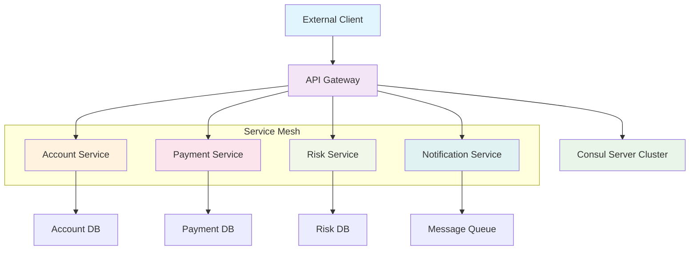

在云原生和微服务架构快速发展的今天，服务网格作为一种新兴的技术架构模式，为解决服务间通信的复杂性提供了全新的解决方案。Consul作为HashiCorp生态系统中的服务发现和配置管理工具，与Envoy代理的深度集成，为构建现代化的服务网格架构提供了强大的支持。本文将通过一个完整的实战案例，深入探讨如何使用Consul和Envoy构建高可用、安全、可观测的服务网格架构。

## 案例背景与架构设计

### 业务场景
我们以一个金融支付系统为例，该系统需要处理高并发的支付请求，同时保证数据的安全性和系统的可靠性。系统包含以下核心服务：
- 账户服务（Account Service）：负责账户管理
- 支付服务（Payment Service）：负责支付处理
- 风控服务（Risk Service）：负责风险控制
- 通知服务（Notification Service）：负责消息通知
- 网关服务（API Gateway）：负责外部请求接入

### 架构设计


## Consul服务网格配置

### 1. Consul Server集群部署
```hcl
# consul-server.hcl
server = true
datacenter = "dc1"
data_dir = "/opt/consul/data"
ui = true
log_level = "INFO"
bind_addr = "0.0.0.0"
client_addr = "0.0.0.0"
advertise_addr = "192.168.1.10"
bootstrap_expect = 3

# 服务网格配置
connect {
  enabled = true
}

# 网络配置
ports {
  grpc = 8502
}

# ACL配置
acl {
  enabled = true
  default_policy = "deny"
  down_policy = "extend-cache"
}
```

```bash
# 启动Consul Server集群
consul agent -config-file=consul-server.hcl -pid-file=consul.pid
```

### 2. Consul Client配置
```hcl
# consul-client.hcl
server = false
datacenter = "dc1"
data_dir = "/opt/consul/data"
log_level = "INFO"
bind_addr = "0.0.0.0"
client_addr = "0.0.0.0"
advertise_addr = "192.168.1.11"

# 连接到Server集群
retry_join = ["192.168.1.10", "192.168.1.11", "192.168.1.12"]

# 启用Connect
connect {
  enabled = true
}

# Envoy代理配置
ports {
  grpc = 8502
}
```

## Envoy代理配置

### 1. Envoy基础配置
```yaml
# envoy.yaml
admin:
  access_log_path: /tmp/admin_access.log
  address:
    socket_address:
      protocol: TCP
      address: 0.0.0.0
      port_value: 9901

static_resources:
  listeners:
  - name: listener_0
    address:
      socket_address:
        protocol: TCP
        address: 0.0.0.0
        port_value: 10000
    filter_chains:
    - filters:
      - name: envoy.filters.network.http_connection_manager
        typed_config:
          "@type": type.googleapis.com/envoy.extensions.filters.network.http_connection_manager.v3.HttpConnectionManager
          stat_prefix: ingress_http
          route_config:
            name: local_route
            virtual_hosts:
            - name: local_service
              domains: ["*"]
              routes:
              - match:
                  prefix: "/"
                route:
                  cluster: local_service
          http_filters:
          - name: envoy.filters.http.router
            typed_config:
              "@type": type.googleapis.com/envoy.extensions.filters.http.router.v3.Router

  clusters:
  - name: local_service
    connect_timeout: 0.25s
    type: STRICT_DNS
    lb_policy: ROUND_ROBIN
    load_assignment:
      cluster_name: local_service
      endpoints:
      - lb_endpoints:
        - endpoint:
            address:
              socket_address:
                address: 127.0.0.1
                port_value: 8080
```

### 2. Consul Connect集成配置
```yaml
# consul-connect-envoy.yaml
admin:
  access_log_path: /dev/null
  address:
    socket_address:
      address: 127.0.0.1
      port_value: 19000

dynamic_resources:
  cds_config:
    path: /etc/consul/connect-cds.yaml
  lds_config:
    path: /etc/consul/connect-lds.yaml

static_resources:
  clusters:
  - name: consul-server
    connect_timeout: 1s
    type: STRICT_DNS
    lb_policy: ROUND_ROBIN
    http2_protocol_options: {}
    load_assignment:
      cluster_name: consul-server
      endpoints:
      - lb_endpoints:
        - endpoint:
            address:
              socket_address:
                address: 127.0.0.1
                port_value: 8502
```

## 服务注册与发现

### 1. 服务定义文件
```hcl
# account-service.hcl
service {
  name = "account-service"
  id = "account-service-1"
  address = "192.168.1.20"
  port = 8080
  
  # 健康检查
  check {
    id = "api"
    name = "HTTP API on port 8080"
    http = "http://192.168.1.20:8080/health"
    method = "GET"
    interval = "10s"
    timeout = "1s"
  }
  
  # Connect配置
  connect {
    native = true
  }
  
  # 标签
  tags = ["primary", "v1.2.0"]
}
```

```bash
# 注册服务
consul services register account-service.hcl
```

### 2. 服务网格配置
```hcl
# service-intentions.hcl
Kind = "service-intentions"
Name = "account-service"

Sources = [
  {
    Name   = "payment-service"
    Action = "allow"
  },
  {
    Name   = "api-gateway"
    Action = "allow"
  },
  {
    Name   = "*"
    Action = "deny"
  }
]
```

```bash
# 应用服务意图
consul config write service-intentions.hcl
```

## 微服务实现

### 1. 账户服务实现
```go
// account-service.go
package main

import (
    "context"
    "encoding/json"
    "log"
    "net/http"
    "time"
    
    "github.com/hashicorp/consul/api"
)

type AccountService struct {
    consulClient *api.Client
    db           *Database
}

type Account struct {
    ID       string  `json:"id"`
    UserID   string  `json:"user_id"`
    Balance  float64 `json:"balance"`
    Currency string  `json:"currency"`
}

func (s *AccountService) GetAccount(w http.ResponseWriter, r *http.Request) {
    accountID := r.URL.Query().Get("id")
    if accountID == "" {
        http.Error(w, "Account ID is required", http.StatusBadRequest)
        return
    }
    
    // 从数据库获取账户信息
    account, err := s.db.GetAccount(accountID)
    if err != nil {
        http.Error(w, "Account not found", http.StatusNotFound)
        return
    }
    
    // 记录访问日志
    log.Printf("Account accessed: %s", accountID)
    
    w.Header().Set("Content-Type", "application/json")
    json.NewEncoder(w).Encode(account)
}

func (s *AccountService) HealthCheck(w http.ResponseWriter, r *http.Request) {
    w.WriteHeader(http.StatusOK)
    w.Write([]byte("OK"))
}

func main() {
    // 初始化Consul客户端
    consulConfig := api.DefaultConfig()
    consulClient, err := api.NewClient(consulConfig)
    if err != nil {
        log.Fatal("Failed to create Consul client:", err)
    }
    
    // 初始化数据库
    db := NewDatabase()
    
    service := &AccountService{
        consulClient: consulClient,
        db:           db,
    }
    
    // 注册HTTP处理器
    http.HandleFunc("/accounts", service.GetAccount)
    http.HandleFunc("/health", service.HealthCheck)
    
    // 启动HTTP服务器
    log.Println("Account service starting on :8080")
    log.Fatal(http.ListenAndServe(":8080", nil))
}
```

### 2. 支付服务实现
```go
// payment-service.go
package main

import (
    "bytes"
    "context"
    "encoding/json"
    "log"
    "net/http"
    "time"
    
    "github.com/hashicorp/consul/api"
)

type PaymentService struct {
    consulClient *api.Client
    httpClient   *http.Client
}

type PaymentRequest struct {
    FromAccount string  `json:"from_account"`
    ToAccount   string  `json:"to_account"`
    Amount      float64 `json:"amount"`
    Currency    string  `json:"currency"`
}

type PaymentResponse struct {
    TransactionID string  `json:"transaction_id"`
    Status        string  `json:"status"`
    Amount        float64 `json:"amount"`
    Timestamp     string  `json:"timestamp"`
}

func (s *PaymentService) ProcessPayment(w http.ResponseWriter, r *http.Request) {
    var req PaymentRequest
    if err := json.NewDecoder(r.Body).Decode(&req); err != nil {
        http.Error(w, "Invalid request body", http.StatusBadRequest)
        return
    }
    
    // 验证账户余额
    if !s.validateAccountBalance(req.FromAccount, req.Amount) {
        http.Error(w, "Insufficient balance", http.StatusBadRequest)
        return
    }
    
    // 执行转账
    transactionID, err := s.transferFunds(req.FromAccount, req.ToAccount, req.Amount)
    if err != nil {
        http.Error(w, "Payment failed", http.StatusInternalServerError)
        return
    }
    
    response := PaymentResponse{
        TransactionID: transactionID,
        Status:        "completed",
        Amount:        req.Amount,
        Timestamp:     time.Now().Format(time.RFC3339),
    }
    
    w.Header().Set("Content-Type", "application/json")
    json.NewEncoder(w).Encode(response)
}

func (s *PaymentService) validateAccountBalance(accountID string, amount float64) bool {
    // 通过Consul发现账户服务
    accountServiceAddr := s.discoverService("account-service")
    if accountServiceAddr == "" {
        log.Println("Failed to discover account service")
        return false
    }
    
    // 调用账户服务检查余额
    url := "http://" + accountServiceAddr + "/accounts?id=" + accountID
    resp, err := s.httpClient.Get(url)
    if err != nil {
        log.Printf("Failed to call account service: %v", err)
        return false
    }
    defer resp.Body.Close()
    
    if resp.StatusCode != http.StatusOK {
        return false
    }
    
    var account Account
    if err := json.NewDecoder(resp.Body).Decode(&account); err != nil {
        return false
    }
    
    return account.Balance >= amount
}

func (s *PaymentService) discoverService(serviceName string) string {
    services, _, err := s.consulClient.Health().Service(serviceName, "", true, nil)
    if err != nil || len(services) == 0 {
        return ""
    }
    
    // 简单的负载均衡（实际应用中应使用更复杂的策略）
    service := services[0]
    return service.Service.Address + ":" + fmt.Sprintf("%d", service.Service.Port)
}

func main() {
    // 初始化Consul客户端
    consulConfig := api.DefaultConfig()
    consulClient, err := api.NewClient(consulConfig)
    if err != nil {
        log.Fatal("Failed to create Consul client:", err)
    }
    
    service := &PaymentService{
        consulClient: consulClient,
        httpClient:   &http.Client{Timeout: 10 * time.Second},
    }
    
    http.HandleFunc("/payments", service.ProcessPayment)
    http.HandleFunc("/health", func(w http.ResponseWriter, r *http.Request) {
        w.WriteHeader(http.StatusOK)
        w.Write([]byte("OK"))
    })
    
    log.Println("Payment service starting on :8081")
    log.Fatal(http.ListenAndServe(":8081", nil))
}
```

## 安全配置

### 1. mTLS配置
```hcl
# envoy-mtls.yaml
static_resources:
  listeners:
  - name: service_listener
    address:
      socket_address:
        address: 0.0.0.0
        port_value: 20000
    filter_chains:
    - filters:
      - name: envoy.filters.network.http_connection_manager
        typed_config:
          "@type": type.googleapis.com/envoy.extensions.filters.network.http_connection_manager.v3.HttpConnectionManager
          codec_type: AUTO
          stat_prefix: ingress_http
          route_config:
            name: local_route
            virtual_hosts:
            - name: local_service
              domains: ["*"]
              routes:
              - match:
                  prefix: "/"
                route:
                  cluster: local_service
          http_filters:
          - name: envoy.filters.http.router
      transport_socket:
        name: envoy.transport_sockets.tls
        typed_config:
          "@type": type.googleapis.com/envoy.extensions.transport_sockets.tls.v3.DownstreamTlsContext
          common_tls_context:
            tls_certificates:
            - certificate_chain:
                filename: "/etc/consul/certs/service.crt"
              private_key:
                filename: "/etc/consul/certs/service.key"
            validation_context:
              trusted_ca:
                filename: "/etc/consul/certs/ca.crt"
```

### 2. ACL策略配置
```hcl
# acl-policy.hcl
Name = "service-policy"
Rules = <<EOF
service "account-service" {
  policy = "write"
}

service "payment-service" {
  policy = "write"
}

service "risk-service" {
  policy = "write"
}

service "notification-service" {
  policy = "write"
}

service "" {
  policy = "read"
}

agent "" {
  policy = "read"
}

node "" {
  policy = "read"
}
EOF
```

```bash
# 创建ACL策略和令牌
consul acl policy create -name=service-policy -rules=@acl-policy.hcl
consul acl token create -description="Service token" -policy-name=service-policy
```

## 可观测性配置

### 1. Prometheus监控配置
```yaml
# prometheus.yml
global:
  scrape_interval: 15s

scrape_configs:
  - job_name: 'consul-services'
    consul_sd_configs:
      - server: 'localhost:8500'
        services: []
    relabel_configs:
      - source_labels: [__meta_consul_service]
        target_label: job
      - source_labels: [__meta_consul_service_address, __meta_consul_service_port]
        separator: ':'
        target_label: instance

  - job_name: 'envoy-stats'
    static_configs:
      - targets: ['localhost:9901']
```

### 2. Jaeger追踪配置
```yaml
# jaeger-config.yaml
service_name: payment-service
disabled: false
reporter:
  log_spans: true
  local_agent:
    reporting_host: jaeger-agent
    reporting_port: 6831
sampler:
  type: const
  param: 1
```

```go
// 追踪集成
import (
    "github.com/opentracing/opentracing-go"
    "github.com/uber/jaeger-client-go"
    jaegercfg "github.com/uber/jaeger-client-go/config"
)

func initTracer() (opentracing.Tracer, io.Closer) {
    cfg := jaegercfg.Configuration{
        ServiceName: "payment-service",
        Sampler: &jaegercfg.SamplerConfig{
            Type:  "const",
            Param: 1,
        },
        Reporter: &jaegercfg.ReporterConfig{
            LogSpans: true,
        },
    }
    
    tracer, closer, err := cfg.NewTracer()
    if err != nil {
        panic(fmt.Sprintf("ERROR: cannot init Jaeger: %v\n", err))
    }
    
    return tracer, closer
}
```

## 容器化部署

### 1. Dockerfile配置
```dockerfile
# account-service/Dockerfile
FROM golang:1.19-alpine AS builder

WORKDIR /app
COPY . .
RUN go build -o account-service .

FROM alpine:latest
RUN apk --no-cache add ca-certificates
WORKDIR /root/
COPY --from=builder /app/account-service .
COPY --from=builder /app/config.yaml .

EXPOSE 8080
CMD ["./account-service"]
```

### 2. Docker Compose编排
```yaml
# docker-compose.yml
version: '3.8'

services:
  consul-server-1:
    image: consul:1.15
    container_name: consul-server-1
    command: agent -server -bootstrap-expect=3 -node=consul-server-1 -config-file=/consul/config/server.hcl
    volumes:
      - ./consul/server1.hcl:/consul/config/server.hcl
      - consul-data-1:/consul/data
    ports:
      - "8500:8500"
      - "8502:8502"
      - "8600:8600/tcp"
      - "8600:8600/udp"

  consul-server-2:
    image: consul:1.15
    container_name: consul-server-2
    command: agent -server -retry-join=consul-server-1 -node=consul-server-2 -config-file=/consul/config/server.hcl
    volumes:
      - ./consul/server2.hcl:/consul/config/server.hcl
      - consul-data-2:/consul/data

  consul-server-3:
    image: consul:1.15
    container_name: consul-server-3
    command: agent -server -retry-join=consul-server-1 -node=consul-server-3 -config-file=/consul/config/server.hcl
    volumes:
      - ./consul/server3.hcl:/consul/config/server.hcl
      - consul-data-3:/consul/data

  account-service:
    build: ./account-service
    ports:
      - "8080:8080"
    environment:
      - CONSUL_HTTP_ADDR=consul-server-1:8500
    depends_on:
      - consul-server-1
      - consul-server-2
      - consul-server-3

  payment-service:
    build: ./payment-service
    ports:
      - "8081:8081"
    environment:
      - CONSUL_HTTP_ADDR=consul-server-1:8500
    depends_on:
      - consul-server-1
      - account-service

  envoy-proxy:
    image: envoyproxy/envoy:v1.24-latest
    ports:
      - "10000:10000"
      - "9901:9901"
    volumes:
      - ./envoy/envoy.yaml:/etc/envoy/envoy.yaml
    depends_on:
      - account-service

volumes:
  consul-data-1:
  consul-data-2:
  consul-data-3:
```

## 性能优化

### 1. Envoy配置优化
```yaml
# envoy-optimized.yaml
static_resources:
  listeners:
  - name: service_listener
    address:
      socket_address:
        address: 0.0.0.0
        port_value: 10000
    per_connection_buffer_limit_bytes: 32768
    listener_filters:
    - name: envoy.filters.listener.http_inspector
    filter_chains:
    - filters:
      - name: envoy.filters.network.http_connection_manager
        typed_config:
          "@type": type.googleapis.com/envoy.extensions.filters.network.http_connection_manager.v3.HttpConnectionManager
          stat_prefix: ingress_http
          use_remote_address: true
          xff_num_trusted_hops: 1
          skip_xff_append: true
          codec_type: AUTO
          route_config:
            name: local_route
            virtual_hosts:
            - name: local_service
              domains: ["*"]
              routes:
              - match:
                  prefix: "/"
                route:
                  cluster: local_service
                  timeout: 60s
          http_filters:
          - name: envoy.filters.http.router
            typed_config:
              "@type": type.googleapis.com/envoy.extensions.filters.http.router.v3.Router
          stream_idle_timeout: 300s
          common_http_protocol_options:
            idle_timeout: 3600s
          http_protocol_options:
            accept_http_10: false
```

### 2. Consul性能调优
```hcl
# consul-performance.hcl
server = true
datacenter = "dc1"
data_dir = "/opt/consul/data"
ui = true

# 性能调优参数
performance {
  raft_multiplier = 1
}

# 网络调优
limits {
  http_max_conns_per_client = 200
}

# 存储调优
telemetry {
  disable_hostname = true
  prometheus_retention_time = "60s"
}

# 连接池配置
connect {
  enabled = true
  proxy {
    allow_managed_root = true
    allow_managed_api_registration = true
  }
}
```

## 故障排查与监控

### 1. 健康检查配置
```hcl
# health-checks.hcl
service {
  name = "account-service"
  id = "account-service-1"
  address = "192.168.1.20"
  port = 8080
  
  check {
    id = "api-health"
    name = "HTTP API Health Check"
    http = "http://192.168.1.20:8080/health"
    method = "GET"
    interval = "10s"
    timeout = "5s"
    deregister_critical_service_after = "1m"
  }
  
  check {
    id = "tcp-health"
    name = "TCP Health Check"
    tcp = "192.168.1.20:8080"
    interval = "30s"
    timeout = "5s"
  }
}
```

### 2. 监控告警配置
```yaml
# alert-rules.yaml
groups:
- name: consul-alerts
  rules:
  - alert: ConsulServiceDown
    expr: consul_catalog_service_count == 0
    for: 2m
    labels:
      severity: critical
    annotations:
      summary: "Consul service down"
      description: "No instances found for service {{ $labels.service }}"

  - alert: HighRequestLatency
    expr: histogram_quantile(0.95, rate(envoy_cluster_upstream_rq_time_bucket[5m])) > 1000
    for: 5m
    labels:
      severity: warning
    annotations:
      summary: "High request latency"
      description: "Request latency is above 1000ms for service {{ $labels.service }}"
```

## 最佳实践总结

### 1. 安全最佳实践
```hcl
# security-best-practices.hcl
# 启用ACL
acl {
  enabled = true
  default_policy = "deny"
  down_policy = "extend-cache"
}

# 启用TLS
tls {
  defaults {
    ca_file = "/etc/consul/ca.crt"
    cert_file = "/etc/consul/server.crt"
    key_file = "/etc/consul/server.key"
    verify_incoming = true
    verify_outgoing = true
  }
}

# 启用mTLS
connect {
  enabled = true
  ca_provider = "consul"
  ca_config {
    leaf_cert_ttl = "72h"
  }
}
```

### 2. 高可用配置
```hcl
# high-availability.hcl
server = true
bootstrap_expect = 3
datacenter = "dc1"

# 多区域配置
addresses {
  http = "0.0.0.0"
  https = "0.0.0.0"
  grpc = "0.0.0.0"
}

# 性能优化
performance {
  raft_multiplier = 1
}

# 备份配置
autopilot {
  cleanup_dead_servers = true
  last_contact_threshold = "200ms"
  max_trailing_logs = 250
}
```

### 3. 监控最佳实践
```yaml
# monitoring-best-practices.yaml
# 服务网格监控
telemetry {
  prometheus_retention_time = "1m"
  disable_hostname = true
}

# 分布式追踪
tracing {
  zipkin = {
    url = "http://zipkin:9411/api/v2/spans"
  }
}

# 日志配置
log_level = "INFO"
log_json = true
```

## 总结

通过这个完整的实战案例，我们深入了解了如何使用Consul和Envoy构建现代化的服务网格架构。关键要点包括：

1. **服务发现与注册**：通过Consul实现服务的自动注册和发现
2. **服务网格通信**：利用Envoy代理实现安全、高效的服务间通信
3. **安全控制**：通过mTLS和ACL实现服务间的安全访问控制
4. **可观测性**：集成Prometheus和Jaeger实现全面的监控和追踪
5. **容器化部署**：通过Docker和Docker Compose实现快速部署和扩展

Consul + Envoy的服务网格架构为现代微服务系统提供了强大的基础设施支持，通过合理的配置和优化，可以构建出高可用、安全、可扩展的分布式系统。随着云原生技术的不断发展，服务网格将成为构建现代化应用架构的重要组成部分，企业应该积极拥抱这一技术趋势，为数字化转型提供坚实的技术基础。

在实际应用中，还需要根据具体的业务需求和技术环境进行相应的调整和优化，持续关注技术发展，及时进行技术升级和架构演进。