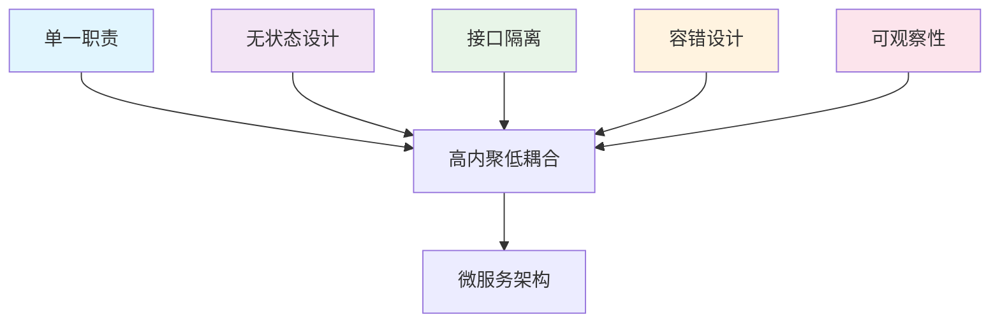

在云原生时代，构建高可用、可扩展的现代应用架构已成为企业数字化转型的关键。随着容器化、微服务、Service Mesh等技术的广泛应用，开发者面临着前所未有的机遇和挑战。本文将深入探讨云原生环境下的最佳实践，从架构设计、开发运维、安全控制到性能优化等多个维度，为构建现代化应用提供全面的指导。

## 云原生架构核心原则

### 1. 十二要素应用原则
云原生应用应遵循Heroku提出的十二要素应用原则，确保应用在云环境中具有良好适应性：

```yaml
# 十二要素应用配置示例
twelve-factor-app:
  codebase: "一个代码库，多个部署"
  dependencies: "显式声明依赖关系"
  config: "在环境中存储配置"
  backing_services: "把后端服务当作附加资源"
  build_release_run: "严格分离构建和运行"
  processes: "以一个或多个无状态进程运行应用"
  port_binding: "通过端口绑定提供服务"
  concurrency: "通过进程模型进行扩展"
  disposability: "快速启动和优雅终止"
  dev_prod_parity: "尽可能保持开发、预发布、线上环境相同"
  logs: "把日志当作事件流"
  admin_processes: "后台管理任务当作一次性进程运行"
```

### 2. 微服务设计原则


## 容器化最佳实践

### 1. Dockerfile优化
```dockerfile
# 多阶段构建优化
FROM golang:1.19-alpine AS builder

# 安装构建依赖
RUN apk add --no-cache git ca-certificates

# 设置工作目录
WORKDIR /app

# 复制go mod和sum文件
COPY go.mod go.sum ./

# 下载依赖（利用Docker缓存）
RUN go mod download

# 复制源代码
COPY . .

# 构建应用
RUN CGO_ENABLED=0 GOOS=linux go build -a -installsuffix cgo -o main .

# 最终镜像
FROM alpine:latest

# 安装ca证书
RUN apk --no-cache add ca-certificates

# 创建非root用户
RUN adduser -D -s /bin/sh -u 1000 appuser

# 设置工作目录
WORKDIR /app

# 复制二进制文件和配置
COPY --from=builder /app/main .
COPY --from=builder /app/config.yaml .

# 更改文件所有者
RUN chown -R appuser:appuser /app

# 切换到非root用户
USER appuser

# 健康检查
HEALTHCHECK --interval=30s --timeout=3s --start-period=5s --retries=3 \
  CMD curl -f http://localhost:8080/health || exit 1

# 暴露端口
EXPOSE 8080

# 启动命令
ENTRYPOINT ["./main"]
```

### 2. 容器资源配置
```yaml
# Kubernetes资源限制最佳实践
apiVersion: apps/v1
kind: Deployment
metadata:
  name: optimized-app
spec:
  replicas: 3
  template:
    spec:
      containers:
      - name: app
        image: optimized-app:latest
        resources:
          requests:
            cpu: 50m
            memory: 128Mi
          limits:
            cpu: 500m
            memory: 512Mi
        # 启动探针
        startupProbe:
          httpGet:
            path: /health
            port: 8080
          initialDelaySeconds: 10
          periodSeconds: 5
          failureThreshold: 30
        # 就绪探针
        readinessProbe:
          httpGet:
            path: /ready
            port: 8080
          initialDelaySeconds: 5
          periodSeconds: 5
          timeoutSeconds: 3
        # 存活探针
        livenessProbe:
          httpGet:
            path: /health
            port: 8080
          initialDelaySeconds: 30
          periodSeconds: 10
          timeoutSeconds: 5
          failureThreshold: 3
```

## 服务网格配置优化

### 1. Istio资源调优
```yaml
# Istio性能调优配置
apiVersion: install.istio.io/v1alpha1
kind: IstioOperator
metadata:
  name: optimized-istio
spec:
  values:
    global:
      proxy:
        resources:
          requests:
            cpu: 10m
            memory: 32Mi
          limits:
            cpu: 500m
            memory: 256Mi
        logLevel: warning
    
    pilot:
      autoscaleEnabled: true
      autoscaleMin: 2
      autoscaleMax: 10
      resources:
        requests:
          cpu: 100m
          memory: 256Mi
        limits:
          cpu: 2000m
          memory: 1Gi
      env:
        PILOT_PUSH_THROTTLE: "100"
        PILOT_TRACE_SAMPLING: "1"  # 生产环境采样率
    
    gateways:
      istio-ingressgateway:
        autoscaleEnabled: true
        autoscaleMin: 2
        autoscaleMax: 10
        resources:
          requests:
            cpu: 100m
            memory: 128Mi
          limits:
            cpu: 2000m
            memory: 1Gi
```

### 2. 流量管理最佳实践
```yaml
# 高级流量管理配置
apiVersion: networking.istio.io/v1alpha3
kind: VirtualService
metadata:
  name: advanced-routing
spec:
  hosts:
  - api.example.com
  gateways:
  - istio-ingressgateway
  http:
  # 金丝雀发布
  - match:
    - headers:
        x-canary:
          exact: "true"
    route:
    - destination:
        host: service-v2
        port:
          number: 80
  # 基于用户ID的路由
  - match:
    - headers:
        x-user-id:
          regex: "^[0-9]{1,3}$"
    route:
    - destination:
        host: service-a
        port:
          number: 80
  # 默认路由
  - route:
    - destination:
        host: service-v1
        port:
          number: 80
    timeout: 5s
    retries:
      attempts: 3
      perTryTimeout: 2s
      retryOn: connect-failure,refused-stream
    fault:
      delay:
        percentage:
          value: 0.1
        fixedDelay: 5s
```

## 监控与可观测性

### 1. Prometheus监控配置
```yaml
# Prometheus监控最佳实践
apiVersion: monitoring.coreos.com/v1
kind: ServiceMonitor
metadata:
  name: app-monitor
spec:
  selector:
    matchLabels:
      app: monitored-app
  endpoints:
  - port: metrics
    interval: 30s
    path: /metrics
    relabelings:
    - sourceLabels: [__meta_kubernetes_pod_name]
      targetLabel: pod
    - sourceLabels: [__meta_kubernetes_namespace]
      targetLabel: namespace
    metricRelabelings:
    - sourceLabels: [__name__]
      regex: 'istio_(.*)'
      targetLabel: metric_type
      replacement: 'istio'
```

### 2. 分布式追踪配置
```go
// OpenTelemetry追踪集成
package main

import (
    "context"
    "go.opentelemetry.io/otel"
    "go.opentelemetry.io/otel/exporters/jaeger"
    "go.opentelemetry.io/otel/sdk/resource"
    "go.opentelemetry.io/otel/sdk/trace"
    semconv "go.opentelemetry.io/otel/semconv/v1.4.0"
)

func initTracer() (*trace.TracerProvider, error) {
    // 创建Jaeger导出器
    exp, err := jaeger.New(jaeger.WithCollectorEndpoint(jaeger.WithEndpoint("http://jaeger-collector:14268/api/traces")))
    if err != nil {
        return nil, err
    }

    // 创建追踪器提供者
    tp := trace.NewTracerProvider(
        trace.WithBatcher(exp),
        trace.WithResource(resource.NewWithAttributes(
            semconv.SchemaURL,
            semconv.ServiceNameKey.String("my-service"),
            semconv.DeploymentEnvironmentKey.String("production"),
        )),
    )

    otel.SetTracerProvider(tp)
    return tp, nil
}

func tracedHandler(ctx context.Context, request *Request) (*Response, error) {
    // 创建span
    ctx, span := otel.Tracer("my-service").Start(ctx, "tracedHandler")
    defer span.End()

    // 添加属性
    span.SetAttributes(
        semconv.HTTPMethodKey.String(request.Method),
        semconv.HTTPURLKey.String(request.URL),
    )

    // 处理业务逻辑
    response, err := processRequest(ctx, request)
    if err != nil {
        span.RecordError(err)
        span.SetStatus(codes.Error, err.Error())
        return nil, err
    }

    // 记录响应状态
    span.SetAttributes(semconv.HTTPStatusCodeKey.Int(response.StatusCode))

    return response, nil
}
```

## 安全最佳实践

### 1. 网络策略配置
```yaml
# Kubernetes网络策略
apiVersion: networking.k8s.io/v1
kind: NetworkPolicy
metadata:
  name: secure-policy
spec:
  podSelector:
    matchLabels:
      app: secure-app
  policyTypes:
  - Ingress
  - Egress
  ingress:
  - from:
    - namespaceSelector:
        matchLabels:
          name: istio-system
    - podSelector:
        matchLabels:
          istio: ingressgateway
    ports:
    - protocol: TCP
      port: 8080
  egress:
  - to:
    - namespaceSelector:
        matchLabels:
          name: database
    ports:
    - protocol: TCP
      port: 5432
  - to:
    - namespaceSelector:
        matchLabels:
          name: redis
    ports:
    - protocol: TCP
      port: 6379
```

### 2. RBAC权限配置
```yaml
# Kubernetes RBAC配置
apiVersion: rbac.authorization.k8s.io/v1
kind: Role
metadata:
  namespace: ecommerce
  name: service-reader
rules:
- apiGroups: [""]
  resources: ["pods", "services"]
  verbs: ["get", "list"]

---
apiVersion: rbac.authorization.k8s.io/v1
kind: RoleBinding
metadata:
  name: read-pods
  namespace: ecommerce
subjects:
- kind: User
  name: developer
  apiGroup: rbac.authorization.k8s.io
roleRef:
  kind: Role
  name: service-reader
  apiGroup: rbac.authorization.k8s.io
```

## CI/CD流水线最佳实践

### 1. GitOps配置
```yaml
# ArgoCD应用配置
apiVersion: argoproj.io/v1alpha1
kind: Application
metadata:
  name: ecommerce-app
  namespace: argocd
spec:
  project: default
  source:
    repoURL: https://github.com/company/ecommerce.git
    targetRevision: HEAD
    path: kubernetes/overlays/production
  destination:
    server: https://kubernetes.default.svc
    namespace: ecommerce
  syncPolicy:
    automated:
      prune: true
      selfHeal: true
    syncOptions:
    - CreateNamespace=true
    - ApplyOutOfSyncOnly=true
  ignoreDifferences:
  - group: apps
    kind: Deployment
    jsonPointers:
    - /spec/replicas
```

### 2. 流水线配置
```yaml
# GitHub Actions CI/CD流水线
name: CI/CD Pipeline

on:
  push:
    branches: [ main ]
  pull_request:
    branches: [ main ]

jobs:
  build:
    runs-on: ubuntu-latest
    steps:
    - uses: actions/checkout@v3
    
    - name: Set up Docker Buildx
      uses: docker/setup-buildx-action@v2
    
    - name: Login to Container Registry
      uses: docker/login-action@v2
      with:
        registry: ghcr.io
        username: ${{ github.actor }}
        password: ${{ secrets.GITHUB_TOKEN }}
    
    - name: Build and push
      uses: docker/build-push-action@v3
      with:
        context: .
        push: true
        tags: ghcr.io/${{ github.repository }}:latest
        cache-from: type=gha
        cache-to: type=gha,mode=max
    
    - name: Run tests
      run: |
        make test
        make integration-test
    
    - name: Security scan
      uses: aquasecurity/trivy-action@master
      with:
        image-ref: ghcr.io/${{ github.repository }}:latest
        format: 'sarif'
        output: 'trivy-results.sarif'
    
    - name: Upload Trivy scan results
      uses: github/codeql-action/upload-sarif@v2
      if: always()
      with:
        sarif_file: 'trivy-results.sarif'
```

## 性能优化策略

### 1. 缓存策略
```go
// 多级缓存实现
type CacheManager struct {
    localCache  *LocalCache
    redisCache  *RedisCache
    metrics     *CacheMetrics
}

type CacheItem struct {
    Data      interface{}
    Expiry    time.Time
    CacheType CacheType
}

func (cm *CacheManager) Get(key string) (*CacheItem, error) {
    // 1. 检查本地缓存
    if item, found := cm.localCache.Get(key); found && !item.Expired() {
        cm.metrics.IncrementHit("local")
        return item, nil
    }
    
    // 2. 检查Redis缓存
    if item, err := cm.redisCache.Get(key); err == nil && !item.Expired() {
        cm.metrics.IncrementHit("redis")
        // 异步更新本地缓存
        go cm.localCache.Set(key, item, time.Minute*5)
        return item, nil
    }
    
    cm.metrics.IncrementMiss()
    return nil, errors.New("cache miss")
}

func (cm *CacheManager) Set(key string, data interface{}, ttl time.Duration) error {
    item := &CacheItem{
        Data:   data,
        Expiry: time.Now().Add(ttl),
    }
    
    // 同时写入两级缓存
    cm.localCache.Set(key, item, ttl)
    return cm.redisCache.Set(key, item, ttl)
}
```

### 2. 数据库优化
```yaml
# 数据库连接池配置
database:
  postgres:
    host: postgres-cluster
    port: 5432
    database: ecommerce
    username: app_user
    password: ${DB_PASSWORD}
    pool:
      max_open_conns: 25
      max_idle_conns: 5
      conn_max_lifetime: 5m
      conn_max_idle_time: 10m
    options:
      sslmode: require
      connect_timeout: 10
```

## 故障处理与恢复

### 1. 熔断器模式
```java
// 熔断器实现
public class CircuitBreaker {
    private final int failureThreshold;
    private final long timeout;
    private int failureCount;
    private long lastFailureTime;
    private CircuitState state;
    
    public enum CircuitState {
        CLOSED, OPEN, HALF_OPEN
    }
    
    public <T> T execute(Supplier<T> operation) throws Exception {
        if (state == CircuitState.OPEN) {
            if (System.currentTimeMillis() - lastFailureTime > timeout) {
                state = CircuitState.HALF_OPEN;
            } else {
                throw new CircuitBreakerOpenException("Circuit breaker is open");
            }
        }
        
        try {
            T result = operation.get();
            onSuccess();
            return result;
        } catch (Exception e) {
            onFailure();
            throw e;
        }
    }
    
    private void onSuccess() {
        failureCount = 0;
        state = CircuitState.CLOSED;
    }
    
    private void onFailure() {
        failureCount++;
        lastFailureTime = System.currentTimeMillis();
        
        if (failureCount >= failureThreshold) {
            state = CircuitState.OPEN;
        }
    }
}
```

### 2. 优雅关闭
```go
// 优雅关闭实现
type Server struct {
    httpServer *http.Server
    grpcServer *grpc.Server
    db         *sql.DB
    cache      *redis.Client
    done       chan bool
}

func (s *Server) Start() error {
    // 创建信号通道
    sigChan := make(chan os.Signal, 1)
    signal.Notify(sigChan, syscall.SIGINT, syscall.SIGTERM)
    
    // 启动HTTP服务器
    go func() {
        if err := s.httpServer.ListenAndServe(); err != nil && err != http.ErrServerClosed {
            log.Fatalf("HTTP server failed: %v", err)
        }
    }()
    
    // 启动gRPC服务器
    go func() {
        if err := s.grpcServer.Serve(listener); err != nil {
            log.Fatalf("gRPC server failed: %v", err)
        }
    }()
    
    // 等待信号
    <-sigChan
    log.Println("Shutdown signal received")
    
    return s.Shutdown()
}

func (s *Server) Shutdown() error {
    ctx, cancel := context.WithTimeout(context.Background(), 30*time.Second)
    defer cancel()
    
    // 关闭HTTP服务器
    if err := s.httpServer.Shutdown(ctx); err != nil {
        log.Printf("HTTP server shutdown error: %v", err)
    }
    
    // 关闭gRPC服务器
    s.grpcServer.GracefulStop()
    
    // 关闭数据库连接
    if s.db != nil {
        s.db.Close()
    }
    
    // 关闭缓存连接
    if s.cache != nil {
        s.cache.Close()
    }
    
    close(s.done)
    log.Println("Server shutdown completed")
    return nil
}
```

## 成本优化策略

### 1. 资源优化
```yaml
# Kubernetes HPA配置
apiVersion: autoscaling/v2
kind: HorizontalPodAutoscaler
metadata:
  name: cost-optimized-hpa
spec:
  scaleTargetRef:
    apiVersion: apps/v1
    kind: Deployment
    name: app-deployment
  minReplicas: 2
  maxReplicas: 20
  metrics:
  - type: Resource
    resource:
      name: cpu
      target:
        type: Utilization
        averageUtilization: 70
  - type: Resource
    resource:
      name: memory
      target:
        type: Utilization
        averageUtilization: 80
  behavior:
    scaleDown:
      stabilizationWindowSeconds: 300
      policies:
      - type: Percent
        value: 10
        periodSeconds: 60
    scaleUp:
      stabilizationWindowSeconds: 60
      policies:
      - type: Percent
        value: 50
        periodSeconds: 60
```

### 2. Spot实例使用
```yaml
# Spot实例配置
apiVersion: apps/v1
kind: Deployment
metadata:
  name: spot-instance-app
spec:
  template:
    spec:
      containers:
      - name: app
        image: spot-app:latest
      # 节点选择器
      nodeSelector:
        kubernetes.io/arch: amd64
        node.kubernetes.io/instance-type: spot
      # 容忍度配置
      tolerations:
      - key: spot-instance
        operator: Equal
        value: "true"
        effect: NoSchedule
```

## 总结

云原生环境下的最佳实践涵盖了从架构设计到运维管理的各个方面。通过遵循这些实践，可以构建出高可用、可扩展、安全且成本优化的现代应用架构。

关键要点包括：

1. **架构设计原则**：遵循十二要素应用原则和微服务设计原则
2. **容器化优化**：通过多阶段构建和资源限制优化容器镜像
3. **服务网格配置**：合理配置Istio等服务网格组件
4. **监控与可观测性**：建立完善的监控、追踪和日志体系
5. **安全控制**：实施网络策略、RBAC和安全扫描
6. **CI/CD流水线**：采用GitOps和自动化测试
7. **性能优化**：实现多级缓存和数据库优化
8. **故障处理**：实施熔断器和优雅关闭机制
9. **成本优化**：通过HPA和Spot实例降低成本

随着云原生技术的不断发展，这些最佳实践也需要持续演进和优化。企业应该建立学习和改进机制，跟上技术发展趋势，不断优化和完善自身的云原生架构和运维体系。

通过系统性地应用这些最佳实践，可以显著提升应用的可靠性、性能和可维护性，为企业的数字化转型提供强有力的技术支撑。