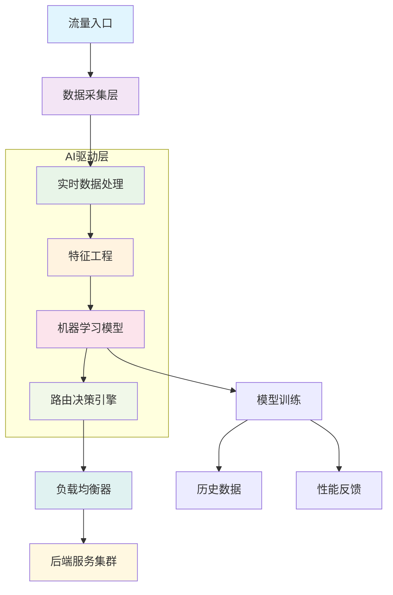

在数字化转型的浪潮中，传统的基于规则的负载均衡策略已难以应对现代分布式系统中复杂多变的流量模式和性能需求。人工智能技术的快速发展为负载均衡领域带来了革命性的变革，AI驱动的智能路由与流量调度系统能够实时分析海量数据，预测流量趋势，自动优化路由决策，实现真正意义上的自适应负载均衡。本文将深入探讨AI在智能路由与流量调度中的应用，分析其核心技术、实现方式以及最佳实践。

## AI驱动负载均衡的核心价值

### 1. 智能决策能力
传统负载均衡器主要基于预设的算法（如轮询、最少连接等）进行流量分发，而AI驱动的系统能够基于实时数据和历史模式做出更智能的决策。

### 2. 预测性调度
通过机器学习模型分析历史流量数据，AI系统能够预测未来的流量模式，提前进行资源调配和路由优化。

### 3. 自适应优化
AI系统能够根据系统性能反馈持续优化路由策略，实现自我学习和改进。

### 4. 异常检测与响应
AI能够快速识别异常流量模式，自动触发相应的防护和调度机制。

## AI驱动智能路由架构



## 核心技术实现

### 1. 机器学习模型架构

#### 强化学习路由策略
```python
# 基于强化学习的智能路由系统
import numpy as np
import tensorflow as tf
from tensorflow.keras import layers
import gym
from collections import deque
import random

class RoutingEnvironment(gym.Env):
    """路由环境定义"""
    def __init__(self, num_servers, state_dim):
        super(RoutingEnvironment, self).__init__()
        self.num_servers = num_servers
        self.state_dim = state_dim
        self.action_space = gym.spaces.Discrete(num_servers)
        self.observation_space = gym.spaces.Box(
            low=-np.inf, high=np.inf, shape=(state_dim,), dtype=np.float32
        )
        
    def reset(self):
        """重置环境状态"""
        self.state = self._get_initial_state()
        return self.state
    
    def step(self, action):
        """执行动作并返回结果"""
        # 执行路由决策
        reward = self._calculate_reward(action)
        next_state = self._get_next_state(action)
        done = self._is_done()
        
        return next_state, reward, done, {}
    
    def _get_initial_state(self):
        """获取初始状态"""
        return np.random.randn(self.state_dim)
    
    def _calculate_reward(self, action):
        """计算奖励"""
        # 基于响应时间、错误率、资源利用率等计算奖励
        response_time = self._get_response_time(action)
        error_rate = self._get_error_rate(action)
        resource_usage = self._get_resource_usage(action)
        
        # 综合奖励函数
        reward = -(response_time * 0.5 + error_rate * 0.3 + resource_usage * 0.2)
        return reward
    
    def _get_next_state(self, action):
        """获取下一个状态"""
        # 基于当前动作和环境变化计算新状态
        return np.random.randn(self.state_dim)
    
    def _is_done(self):
        """判断是否结束"""
        return False

class DQNRoutingAgent:
    """深度Q网络路由代理"""
    def __init__(self, state_size, action_size, learning_rate=0.001):
        self.state_size = state_size
        self.action_size = action_size
        self.learning_rate = learning_rate
        self.memory = deque(maxlen=2000)
        self.epsilon = 1.0  # 探索率
        self.epsilon_decay = 0.995
        self.epsilon_min = 0.01
        self.model = self._build_model()
        
    def _build_model(self):
        """构建神经网络模型"""
        model = tf.keras.Sequential([
            layers.Dense(128, input_dim=self.state_size, activation='relu'),
            layers.Dense(64, activation='relu'),
            layers.Dense(32, activation='relu'),
            layers.Dense(self.action_size, activation='linear')
        ])
        model.compile(
            optimizer=tf.keras.optimizers.Adam(learning_rate=self.learning_rate),
            loss='mse'
        )
        return model
    
    def remember(self, state, action, reward, next_state, done):
        """记住经验"""
        self.memory.append((state, action, reward, next_state, done))
    
    def act(self, state):
        """选择动作"""
        if np.random.rand() <= self.epsilon:
            return random.randrange(self.action_size)
        
        act_values = self.model.predict(state.reshape(1, -1))
        return np.argmax(act_values[0])
    
    def replay(self, batch_size=32):
        """经验回放"""
        if len(self.memory) < batch_size:
            return
        
        batch = random.sample(self.memory, batch_size)
        for state, action, reward, next_state, done in batch:
            target = reward
            if not done:
                target = (reward + 0.95 * 
                         np.amax(self.model.predict(next_state.reshape(1, -1))[0]))
            
            target_f = self.model.predict(state.reshape(1, -1))
            target_f[0][action] = target
            self.model.fit(state.reshape(1, -1), target_f, epochs=1, verbose=0)
        
        if self.epsilon > self.epsilon_min:
            self.epsilon *= self.epsilon_decay

# 使用示例
def train_routing_agent():
    env = RoutingEnvironment(num_servers=5, state_dim=10)
    agent = DQNRoutingAgent(state_size=10, action_size=5)
    
    episodes = 1000
    for e in range(episodes):
        state = env.reset()
        total_reward = 0
        
        for time in range(500):
            action = agent.act(state)
            next_state, reward, done, _ = env.step(action)
            agent.remember(state, action, reward, next_state, done)
            state = next_state
            total_reward += reward
            
            if done:
                break
        
        agent.replay()
        print(f"Episode {e}, Total Reward: {total_reward}")
```

#### 预测性负载调度
```go
// 预测性负载调度器
package main

import (
    "context"
    "time"
    "math"
    
    "github.com/gonum/matrix/mat64"
    "gonum.org/v1/gonum/stat"
)

type PredictiveLoadBalancer struct {
    predictor      *LoadPredictor
    scheduler      *ResourceScheduler
    metricsStore   *MetricsStore
    decisionEngine *DecisionEngine
}

type LoadPredictor struct {
    model          *ARIMAModel
    historicalData *TimeSeriesData
    confidence     float64
}

type ARIMAModel struct {
    p, d, q int  // ARIMA参数
    coefficients []float64
}

func (lp *LoadPredictor) PredictLoad(serviceName string, horizon time.Duration) *LoadPrediction {
    // 获取历史负载数据
    historicalData := lp.metricsStore.GetHistoricalLoad(serviceName)
    
    // 使用ARIMA模型进行预测
    forecast, confidence := lp.model.Forecast(historicalData, horizon)
    
    return &LoadPrediction{
        ServiceName: serviceName,
        PredictedLoad: forecast,
        Confidence: confidence,
        Timestamp: time.Now().Add(horizon),
        Factors: lp.analyzeInfluencingFactors(historicalData),
    }
}

func (lp *LoadPredictor) analyzeInfluencingFactors(data *TimeSeriesData) []InfluencingFactor {
    factors := make([]InfluencingFactor, 0)
    
    // 分析时间相关性
    if lp.hasTimePattern(data) {
        factors = append(factors, InfluencingFactor{
            Name: "time_pattern",
            Weight: 0.3,
            Description: "基于时间的负载模式",
        })
    }
    
    // 分析季节性
    if lp.hasSeasonality(data) {
        factors = append(factors, InfluencingFactor{
            Name: "seasonality",
            Weight: 0.25,
            Description: "季节性负载变化",
        })
    }
    
    // 分析趋势
    if lp.hasTrend(data) {
        factors = append(factors, InfluencingFactor{
            Name: "trend",
            Weight: 0.2,
            Description: "负载增长趋势",
        })
    }
    
    return factors
}

type ResourceScheduler struct {
    optimizer *MultiObjectiveOptimizer
    allocator *ResourceAllocator
}

func (rs *ResourceScheduler) ScheduleResources(prediction *LoadPrediction) *ResourceSchedule {
    // 定义优化目标
    objectives := []OptimizationObjective{
        {Name: "response_time", Weight: 0.4, Target: "minimize"},
        {Name: "cost", Weight: 0.3, Target: "minimize"},
        {Name: "availability", Weight: 0.2, Target: "maximize"},
        {Name: "resource_utilization", Weight: 0.1, Target: "optimize"},
    }
    
    // 使用多目标优化算法
    optimalSchedule := rs.optimizer.Optimize(prediction, objectives)
    
    return optimalSchedule
}

type DecisionEngine struct {
    rulesEngine *RulesEngine
    mlModel     *DecisionModel
    feedbackLoop *FeedbackLoop
}

func (de *DecisionEngine) MakeRoutingDecision(
    context *RoutingContext, 
    prediction *LoadPrediction, 
    schedule *ResourceSchedule) *RoutingDecision {
    
    // 基于规则的决策
    ruleBasedDecision := de.rulesEngine.Evaluate(context)
    if ruleBasedDecision != nil && ruleBasedDecision.Priority == "high" {
        return ruleBasedDecision
    }
    
    // 基于机器学习的决策
    mlDecision := de.mlModel.Predict(context, prediction, schedule)
    
    // 结合反馈进行调整
    finalDecision := de.feedbackLoop.AdjustDecision(mlDecision)
    
    return finalDecision
}
```

### 2. 实时数据处理

#### 流式数据处理管道
```java
// Apache Flink流处理实现
import org.apache.flink.streaming.api.datastream.DataStream;
import org.apache.flink.streaming.api.environment.StreamExecutionEnvironment;
import org.apache.flink.streaming.api.windowing.time.Time;

public class RealtimeTrafficProcessor {
    public static void main(String[] args) throws Exception {
        // 创建执行环境
        StreamExecutionEnvironment env = StreamExecutionEnvironment.getExecutionEnvironment();
        
        // 读取流量数据流
        DataStream<TrafficEvent> trafficStream = env
            .addSource(new TrafficEventSource())
            .filter(event -> event.isValid());
        
        // 实时特征提取
        DataStream<TrafficFeatures> featureStream = trafficStream
            .map(event -> extractFeatures(event))
            .keyBy(features -> features.getServiceName())
            .window(TumblingProcessingTimeWindows.of(Time.minutes(1)))
            .aggregate(new FeatureAggregator());
        
        // 异常检测
        DataStream<AnomalyAlert> anomalyStream = featureStream
            .process(new AnomalyDetectionProcessFunction())
            .filter(alert -> alert.getSeverity() > 0.8);
        
        // 路由决策
        DataStream<RoutingDecision> decisionStream = featureStream
            .connect(anomalyStream)
            .process(new RoutingDecisionProcessFunction());
        
        // 输出决策结果
        decisionStream.addSink(new RoutingDecisionSink());
        
        env.execute("Real-time Traffic Processor");
    }
    
    private static TrafficFeatures extractFeatures(TrafficEvent event) {
        return TrafficFeatures.builder()
            .serviceName(event.getServiceName())
            .requestRate(event.getRequestCount())
            .averageLatency(event.getLatency())
            .errorRate(event.getErrorCount() / (double) event.getRequestCount())
            .clientRegion(event.getClientRegion())
            .userAgent(event.getUserAgent())
            .timestamp(event.getTimestamp())
            .build();
    }
}
```

### 3. 特征工程

#### 多维度特征提取
```python
# 特征工程实现
import pandas as pd
import numpy as np
from sklearn.preprocessing import StandardScaler, LabelEncoder
from sklearn.feature_extraction.text import TfidfVectorizer

class FeatureEngineer:
    def __init__(self):
        self.scaler = StandardScaler()
        self.label_encoders = {}
        self.tfidf_vectorizer = TfidfVectorizer(max_features=100)
        
    def extract_traffic_features(self, raw_data):
        """提取流量特征"""
        features = pd.DataFrame()
        
        # 基础统计特征
        features['request_rate'] = raw_data['requests'].rolling(window=60).mean()
        features['latency_mean'] = raw_data['latency'].rolling(window=60).mean()
        features['latency_std'] = raw_data['latency'].rolling(window=60).std()
        features['error_rate'] = (raw_data['errors'] / raw_data['requests']).fillna(0)
        
        # 时间特征
        features['hour'] = raw_data['timestamp'].dt.hour
        features['day_of_week'] = raw_data['timestamp'].dt.dayofweek
        features['is_weekend'] = (raw_data['timestamp'].dt.dayofweek >= 5).astype(int)
        
        # 客户端特征
        features['client_region_encoded'] = self._encode_categorical(
            raw_data['client_region'], 'client_region'
        )
        features['user_agent_encoded'] = self._encode_categorical(
            raw_data['user_agent'], 'user_agent'
        )
        
        # 趋势特征
        features['latency_trend'] = self._calculate_trend(raw_data['latency'])
        features['request_trend'] = self._calculate_trend(raw_data['requests'])
        
        # 周期性特征
        features['hour_sin'] = np.sin(2 * np.pi * features['hour'] / 24)
        features['hour_cos'] = np.cos(2 * np.pi * features['hour'] / 24)
        features['day_sin'] = np.sin(2 * np.pi * features['day_of_week'] / 7)
        features['day_cos'] = np.cos(2 * np.pi * features['day_of_week'] / 7)
        
        return features
    
    def _encode_categorical(self, series, column_name):
        """编码分类特征"""
        if column_name not in self.label_encoders:
            self.label_encoders[column_name] = LabelEncoder()
            encoded = self.label_encoders[column_name].fit_transform(series)
        else:
            encoded = self.label_encoders[column_name].transform(series)
        return encoded
    
    def _calculate_trend(self, series, window=30):
        """计算趋势特征"""
        trend = series.rolling(window=window).apply(
            lambda x: np.polyfit(range(len(x)), x, 1)[0] if len(x) > 1 else 0
        )
        return trend.fillna(0)
    
    def normalize_features(self, features):
        """标准化特征"""
        return self.scaler.fit_transform(features)
```

## 智能路由算法

### 1. 多目标优化路由

#### NSGA-II算法实现
```go
// NSGA-II多目标优化算法
type NSGA2Router struct {
    populationSize int
    generations    int
    mutationRate   float64
    crossoverRate  float64
}

type Individual struct {
    Genes      []float64
    Objectives []float64
    Rank       int
    Distance   float64
}

func (n *NSGA2Router) OptimizeRouting(services []Service, constraints RoutingConstraints) []RoutingDecision {
    // 初始化种群
    population := n.initializePopulation(services)
    
    for generation := 0; generation < n.generations; generation++ {
        // 快速非支配排序
        fronts := n.nonDominatedSort(population)
        
        // 拥挤度计算
        for _, front := range fronts {
            n.calculateCrowdingDistance(front)
        }
        
        // 环境选择
        population = n.environmentalSelection(fronts)
        
        // 交叉和变异
        offspring := n.crossoverAndMutation(population)
        
        // 合并种群
        combined := append(population, offspring...)
        population = combined
    }
    
    // 返回帕累托最优解
    paretoFront := n.extractParetoFront(population)
    return n.convertToRoutingDecisions(paretoFront, services)
}

func (n *NSGA2Router) nonDominatedSort(population []Individual) [][]Individual {
    fronts := make([][]Individual, 0)
    fronts = append(fronts, make([]Individual, 0))
    
    for i, p := range population {
        p.DominatedSolutions = make([]int, 0)
        p.DominationCount = 0
        
        for j, q := range population {
            if n.dominates(p, q) {
                p.DominatedSolutions = append(p.DominatedSolutions, j)
            } else if n.dominates(q, p) {
                p.DominationCount++
            }
        }
        
        if p.DominationCount == 0 {
            p.Rank = 0
            fronts[0] = append(fronts[0], p)
        }
    }
    
    i := 0
    for len(fronts[i]) > 0 {
        nextFront := make([]Individual, 0)
        for _, p := range fronts[i] {
            for _, qIndex := range p.DominatedSolutions {
                q := population[qIndex]
                q.DominationCount--
                if q.DominationCount == 0 {
                    q.Rank = i + 1
                    nextFront = append(nextFront, q)
                }
            }
        }
        i++
        fronts = append(fronts, nextFront)
    }
    
    return fronts[:len(fronts)-1]
}
```

### 2. 基于强化学习的动态路由

#### Q-Learning路由实现
```python
# Q-Learning动态路由
import numpy as np
import random
from collections import defaultdict

class QLearningRouter:
    def __init__(self, num_servers, learning_rate=0.1, discount_factor=0.9, epsilon=0.1):
        self.num_servers = num_servers
        self.learning_rate = learning_rate
        self.discount_factor = discount_factor
        self.epsilon = epsilon
        self.q_table = defaultdict(lambda: np.zeros(num_servers))
        
    def get_state(self, context):
        """获取当前状态"""
        # 将上下文信息编码为状态
        state_features = [
            context.request_rate,
            context.average_latency,
            context.error_rate,
            context.time_of_day,
            context.client_region
        ]
        return tuple(state_features)
    
    def choose_action(self, state):
        """选择动作（服务器）"""
        if random.random() < self.epsilon:
            # 探索：随机选择服务器
            return random.randint(0, self.num_servers - 1)
        else:
            # 利用：选择Q值最高的服务器
            return np.argmax(self.q_table[state])
    
    def update_q_value(self, state, action, reward, next_state):
        """更新Q值"""
        current_q = self.q_table[state][action]
        next_max_q = np.max(self.q_table[next_state])
        
        # Q-Learning更新公式
        new_q = current_q + self.learning_rate * (
            reward + self.discount_factor * next_max_q - current_q
        )
        
        self.q_table[state][action] = new_q
    
    def calculate_reward(self, response):
        """计算奖励"""
        # 基于响应时间、错误率等计算奖励
        latency_reward = -response.latency / 1000.0  # 毫秒转秒
        error_reward = -100 if response.error else 0
        throughput_reward = response.throughput / 1000.0
        
        return latency_reward + error_reward + throughput_reward

# 使用示例
router = QLearningRouter(num_servers=5)

def handle_request(request, context):
    state = router.get_state(context)
    server_id = router.choose_action(state)
    
    # 路由请求到选定的服务器
    response = route_to_server(request, server_id)
    
    # 计算奖励并更新Q值
    reward = router.calculate_reward(response)
    next_state = router.get_state(update_context(context, response))
    router.update_q_value(state, server_id, reward, next_state)
    
    return response
```

## 系统集成与部署

### 1. 微服务架构集成
```yaml
# Kubernetes部署配置
apiVersion: apps/v1
kind: Deployment
metadata:
  name: ai-routing-controller
spec:
  replicas: 3
  selector:
    matchLabels:
      app: ai-routing-controller
  template:
    metadata:
      labels:
        app: ai-routing-controller
    spec:
      containers:
      - name: controller
        image: ai-routing-controller:latest
        ports:
        - containerPort: 8080
        env:
        - name: MODEL_PATH
          value: "/models/routing_model.pkl"
        - name: REDIS_URL
          value: "redis://redis-service:6379"
        resources:
          requests:
            cpu: 500m
            memory: 1Gi
          limits:
            cpu: 2000m
            memory: 4Gi
        volumeMounts:
        - name: model-storage
          mountPath: /models
      volumes:
      - name: model-storage
        persistentVolumeClaim:
          claimName: model-pvc
---
apiVersion: v1
kind: Service
metadata:
  name: ai-routing-service
spec:
  selector:
    app: ai-routing-controller
  ports:
  - port: 80
    targetPort: 8080
  type: ClusterIP
```

### 2. 模型更新机制
```python
# 模型更新与版本管理
import mlflow
import joblib
from datetime import datetime

class ModelManager:
    def __init__(self, model_registry_uri):
        self.model_registry_uri = model_registry_uri
        mlflow.set_tracking_uri(model_registry_uri)
        
    def get_latest_model(self, model_name):
        """获取最新版本的模型"""
        try:
            model_uri = f"models:/{model_name}/latest"
            model = mlflow.pyfunc.load_model(model_uri)
            return model
        except Exception as e:
            print(f"Failed to load model: {e}")
            return None
    
    def deploy_new_model(self, model, model_name, metrics):
        """部署新模型"""
        with mlflow.start_run():
            # 记录模型参数和指标
            mlflow.log_params(model.get_params())
            mlflow.log_metrics(metrics)
            
            # 注册模型
            model_info = mlflow.sklearn.log_model(
                sk_model=model,
                artifact_path="model",
                conda_env="environment.yml"
            )
            
            # 注册到模型注册表
            model_version = mlflow.register_model(
                model_uri=model_info.model_uri,
                name=model_name
            )
            
            return model_version
    
    def rollback_model(self, model_name, version):
        """回滚到指定版本"""
        client = mlflow.tracking.MlflowClient()
        client.transition_model_version_stage(
            name=model_name,
            version=version,
            stage="Production"
        )
```

## 监控与评估

### 1. 性能指标监控
```go
// 性能指标监控
type PerformanceMonitor struct {
    metricsCollector *MetricsCollector
    alertManager    *AlertManager
    dashboard       *Dashboard
}

type RoutingMetrics struct {
    RequestRate        float64
    AverageLatency     float64
    ErrorRate          float64
    SuccessRate        float64
    ModelAccuracy      float64
    DecisionLatency    float64
    ResourceUtilization map[string]float64
}

func (pm *PerformanceMonitor) CollectMetrics() *RoutingMetrics {
    metrics := &RoutingMetrics{}
    
    // 收集请求率
    metrics.RequestRate = pm.metricsCollector.GetRequestRate()
    
    // 收集延迟指标
    latencyData := pm.metricsCollector.GetLatencyData()
    metrics.AverageLatency = stat.Mean(latencyData, nil)
    
    // 收集错误率
    metrics.ErrorRate = pm.metricsCollector.GetErrorRate()
    metrics.SuccessRate = 1 - metrics.ErrorRate
    
    // 收集模型准确性
    metrics.ModelAccuracy = pm.metricsCollector.GetModelAccuracy()
    
    // 收集决策延迟
    metrics.DecisionLatency = pm.metricsCollector.GetDecisionLatency()
    
    // 收集资源利用率
    metrics.ResourceUtilization = pm.metricsCollector.GetResourceUtilization()
    
    return metrics
}

func (pm *PerformanceMonitor) EvaluatePerformance(metrics *RoutingMetrics) {
    // 评估性能并触发告警
    if metrics.ErrorRate > 0.05 {
        pm.alertManager.SendAlert("HighErrorRate", "路由错误率过高")
    }
    
    if metrics.AverageLatency > 1000 {
        pm.alertManager.SendAlert("HighLatency", "平均延迟过高")
    }
    
    if metrics.ModelAccuracy < 0.8 {
        pm.alertManager.SendAlert("LowModelAccuracy", "模型准确性下降")
    }
    
    // 更新仪表板
    pm.dashboard.UpdateMetrics(metrics)
}
```

### 2. A/B测试框架
```python
# A/B测试框架
import pandas as pd
from scipy import stats

class RoutingABTest:
    def __init__(self, test_name, control_strategy, test_strategy):
        self.test_name = test_name
        self.control_strategy = control_strategy
        self.test_strategy = test_strategy
        self.test_data = []
        
    def record_test_result(self, strategy, request_id, metrics):
        """记录测试结果"""
        self.test_data.append({
            'strategy': strategy,
            'request_id': request_id,
            'timestamp': pd.Timestamp.now(),
            'latency': metrics.latency,
            'error': metrics.error,
            'throughput': metrics.throughput
        })
    
    def analyze_results(self):
        """分析测试结果"""
        df = pd.DataFrame(self.test_data)
        
        # 分离控制组和测试组数据
        control_data = df[df['strategy'] == self.control_strategy]
        test_data = df[df['strategy'] == self.test_strategy]
        
        # 统计分析
        results = {
            'control_latency_mean': control_data['latency'].mean(),
            'test_latency_mean': test_data['latency'].mean(),
            'control_error_rate': control_data['error'].mean(),
            'test_error_rate': test_data['error'].mean(),
            'control_throughput_mean': control_data['throughput'].mean(),
            'test_throughput_mean': test_data['throughput'].mean()
        }
        
        # 显著性检验
        latency_ttest = stats.ttest_ind(
            control_data['latency'], 
            test_data['latency']
        )
        results['latency_p_value'] = latency_ttest.pvalue
        
        error_ztest = self.ztest_proportions(
            control_data['error'].sum(), len(control_data),
            test_data['error'].sum(), len(test_data)
        )
        results['error_p_value'] = error_ztest
        
        return results
    
    def ztest_proportions(self, x1, n1, x2, n2):
        """比例的Z检验"""
        p1 = x1 / n1
        p2 = x2 / n2
        p_pool = (x1 + x2) / (n1 + n2)
        
        se = np.sqrt(p_pool * (1 - p_pool) * (1/n1 + 1/n2))
        z = (p1 - p2) / se
        
        return 2 * (1 - stats.norm.cdf(abs(z)))
```

## 最佳实践与优化

### 1. 模型训练最佳实践
```yaml
# 机器学习流水线配置
training_pipeline:
  data_preprocessing:
    - data_cleaning
    - feature_engineering
    - data_splitting
    
  model_training:
    algorithms:
      - random_forest
      - gradient_boosting
      - neural_networks
    hyperparameter_tuning:
      method: bayesian_optimization
      iterations: 100
      
  model_evaluation:
    metrics:
      - accuracy
      - precision
      - recall
      - f1_score
      - auc_roc
      
  model_deployment:
    strategy: blue_green
    rollback_criteria:
      - accuracy_drop > 0.05
      - latency_increase > 0.2
```

### 2. 系统优化策略
```python
# 系统性能优化
class PerformanceOptimizer:
    def __init__(self):
        self.cache_manager = CacheManager()
        self.batch_processor = BatchProcessor()
        self.async_handler = AsyncHandler()
        
    def optimize_decision_making(self, decisions):
        """优化决策制定过程"""
        # 批量处理相似决策
        batched_decisions = self.batch_processor.group_similar(decisions)
        
        # 异步执行非关键决策
        async_results = []
        sync_decisions = []
        
        for decision in batched_decisions:
            if decision.priority == "low":
                async_results.append(
                    self.async_handler.submit(self.make_decision, decision)
                )
            else:
                sync_decisions.append(decision)
        
        # 同步处理高优先级决策
        sync_results = [self.make_decision(d) for d in sync_decisions]
        
        # 等待异步结果
        async_results = [r.result() for r in async_results]
        
        return sync_results + async_results
    
    def cache_frequently_used_decisions(self, decisions):
        """缓存频繁使用的决策"""
        for decision in decisions:
            if decision.frequency > 0.1:  # 高频决策
                cache_key = self.generate_cache_key(decision.context)
                self.cache_manager.set(cache_key, decision, ttl=300)  # 5分钟缓存
```

## 总结

AI驱动的智能路由与流量调度代表了负载均衡技术的未来发展方向。通过结合机器学习、深度学习、强化学习等AI技术，可以构建出自适应、自优化的智能负载均衡系统，显著提升系统的性能、可靠性和用户体验。

关键要点包括：

1. **核心技术架构**：构建包含数据采集、特征工程、机器学习模型和决策引擎的完整AI驱动架构
2. **算法实现**：实现强化学习、预测性调度、多目标优化等核心算法
3. **实时处理**：建立高效的流式数据处理管道，支持实时决策
4. **系统集成**：与现有微服务架构和云原生环境无缝集成
5. **监控评估**：建立完善的性能监控和A/B测试机制
6. **持续优化**：通过模型更新和系统优化不断提升性能

随着AI技术的不断发展和成熟，智能路由与流量调度系统将变得更加智能化和自动化。企业应该积极拥抱这一技术趋势，通过AI驱动的负载均衡技术提升系统的智能化水平，为构建现代化的分布式系统奠定坚实基础。

在实际应用中，需要根据具体的业务场景和技术环境选择合适的AI算法和实现方案，并建立完善的运维和监控体系，确保系统的稳定运行和持续优化。通过数据驱动的方式不断改进和优化AI模型，可以实现负载均衡系统的自我学习和持续进化，为用户提供更加优质的服务体验。