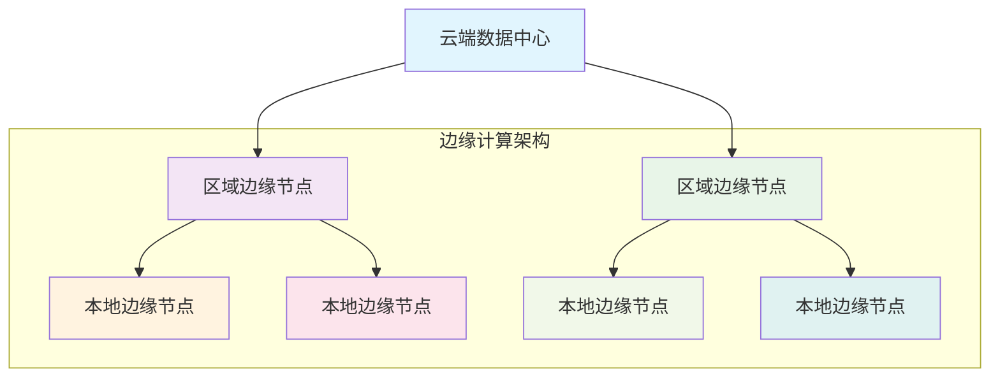
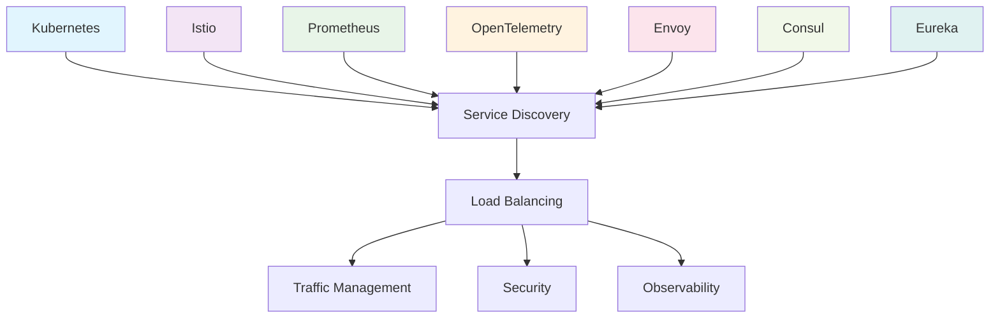

随着云计算、边缘计算、人工智能等技术的快速发展，服务发现与负载均衡领域正面临着前所未有的变革机遇。传统的架构模式正在被新兴技术所重塑，新的挑战和需求不断涌现。本文将深入探讨服务发现与负载均衡领域的未来发展趋势，分析即将面临的技术挑战，并展望下一代分布式系统架构的发展方向。

## 技术发展趋势

### 1. 边缘计算与分布式服务发现

随着5G网络的普及和物联网设备的爆炸式增长，边缘计算正成为分布式系统的重要组成部分。服务发现机制需要适应这种分布式环境的特殊需求。



#### 边缘服务发现架构
```go
// 边缘计算环境下的服务发现
type EdgeServiceDiscovery struct {
    localRegistry    *LocalServiceRegistry
    regionalRegistry *RegionalServiceRegistry
    cloudRegistry    *CloudServiceRegistry
    edgeCache        *EdgeCache
}

type ServiceQuery struct {
    ServiceName     string
    Location        GeoLocation
    LatencyRequirement time.Duration
    ResourceConstraints map[string]interface{}
}

func (esd *EdgeServiceDiscovery) DiscoverService(query *ServiceQuery) ([]ServiceInstance, error) {
    // 1. 首先查询本地边缘节点
    localInstances, err := esd.localRegistry.FindServices(query.ServiceName)
    if err == nil && len(localInstances) > 0 {
        // 根据延迟要求过滤本地实例
        filteredInstances := esd.filterByLatency(localInstances, query.LatencyRequirement)
        if len(filteredInstances) > 0 {
            return filteredInstances, nil
        }
    }
    
    // 2. 查询区域边缘节点
    regionalInstances, err := esd.regionalRegistry.FindServices(query.ServiceName, query.Location)
    if err == nil && len(regionalInstances) > 0 {
        return regionalInstances, nil
    }
    
    // 3. 最后查询云端数据中心
    cloudInstances, err := esd.cloudRegistry.FindServices(query.ServiceName)
    if err != nil {
        return nil, err
    }
    
    // 4. 根据资源约束过滤
    return esd.filterByResources(cloudInstances, query.ResourceConstraints), nil
}

func (esd *EdgeServiceDiscovery) filterByLatency(instances []ServiceInstance, maxLatency time.Duration) []ServiceInstance {
    filtered := make([]ServiceInstance, 0)
    for _, instance := range instances {
        if instance.EstimatedLatency <= maxLatency {
            filtered = append(filtered, instance)
        }
    }
    return filtered
}
```

### 2. 人工智能与机器学习深度集成

AI技术在服务发现与负载均衡领域的应用将更加深入，从简单的规则匹配发展到复杂的智能决策。

#### 自适应服务发现
```python
# 基于机器学习的自适应服务发现
import numpy as np
from sklearn.ensemble import RandomForestRegressor
from sklearn.cluster import KMeans
import tensorflow as tf

class AdaptiveServiceDiscovery:
    def __init__(self):
        self.performance_predictor = RandomForestRegressor(n_estimators=100)
        self.clustering_model = KMeans(n_clusters=5)
        self.anomaly_detector = tf.keras.Sequential([
            tf.keras.layers.Dense(64, activation='relu'),
            tf.keras.layers.Dense(32, activation='relu'),
            tf.keras.layers.Dense(1, activation='sigmoid')
        ])
        self.performance_history = []
        self.service_patterns = {}
    
    def predict_service_performance(self, service_instance, context):
        """预测服务实例性能"""
        features = self.extract_features(service_instance, context)
        return self.performance_predictor.predict([features])[0]
    
    def discover_optimal_services(self, service_name, context):
        """发现最优服务实例"""
        # 获取所有可用服务实例
        all_instances = self.get_available_instances(service_name)
        
        # 预测每个实例的性能
        predictions = []
        for instance in all_instances:
            performance = self.predict_service_performance(instance, context)
            predictions.append((instance, performance))
        
        # 根据预测性能排序
        predictions.sort(key=lambda x: x[1], reverse=True)
        
        # 选择前N个最优实例
        return [instance for instance, _ in predictions[:10]]
    
    def detect_anomalies(self, service_metrics):
        """检测服务异常"""
        # 使用深度学习模型检测异常模式
        anomaly_score = self.anomaly_detector.predict([service_metrics])[0]
        return anomaly_score > 0.8  # 异常阈值
    
    def adapt_to_pattern_changes(self):
        """适应模式变化"""
        # 分析历史性能数据
        if len(self.performance_history) > 1000:
            # 使用聚类分析识别性能模式
            patterns = self.clustering_model.fit_predict(self.performance_history)
            
            # 更新服务模式字典
            self.service_patterns = self.analyze_patterns(patterns)
            
            # 重新训练预测模型
            self.retrain_models()
```

### 3. 无服务器架构的普及

无服务器架构的快速发展对服务发现和负载均衡提出了新的要求和挑战。

#### Serverless服务发现
```yaml
# Serverless服务发现架构
serverless_discovery:
  event_driven_discovery:
    triggers:
      - http_request
      - message_queue
      - database_change
      - timer
    discovery_mechanism: "按需发现"
    
  ephemeral_service_registration:
    registration_ttl: "函数执行期间"
    health_check: "执行时检查"
    metadata: "动态生成"
    
  intelligent_routing:
    context_aware: true
    performance_prediction: true
    cost_optimization: true
    
  auto_scaling_integration:
    trigger_based_scaling: true
    predictive_scaling: true
    resource_optimization: true
```

## 新兴技术挑战

### 1. 安全性挑战

随着分布式系统的复杂性增加，安全威胁也变得更加复杂和多样化。

#### 零信任服务发现
```go
// 零信任架构下的服务发现
type ZeroTrustServiceDiscovery struct {
    identityProvider   IdentityProvider
    policyEngine       PolicyEngine
    trustAssessor      TrustAssessor
    secureCommunicator SecureCommunicator
}

type ServiceRequest struct {
    ServiceName    string
    ClientIdentity Identity
    SecurityContext SecurityContext
    RequestMetadata RequestMetadata
}

func (ztsd *ZeroTrustServiceDiscovery) DiscoverService(request *ServiceRequest) ([]ServiceInstance, error) {
    // 1. 验证客户端身份
    if !ztsd.identityProvider.ValidateIdentity(request.ClientIdentity) {
        return nil, errors.New("invalid client identity")
    }
    
    // 2. 评估信任等级
    trustLevel, err := ztsd.trustAssessor.AssessTrust(request.ClientIdentity, request.SecurityContext)
    if err != nil {
        return nil, err
    }
    
    // 3. 检查访问策略
    if !ztsd.policyEngine.EvaluatePolicy(request.ServiceName, request.ClientIdentity, trustLevel) {
        return nil, errors.New("access denied by policy")
    }
    
    // 4. 发现服务实例
    instances, err := ztsd.discoverInstances(request.ServiceName)
    if err != nil {
        return nil, err
    }
    
    // 5. 建立安全通信通道
    securedInstances := make([]ServiceInstance, len(instances))
    for i, instance := range instances {
        securedInstance, err := ztsd.secureCommunicator.EstablishSecureConnection(instance, request.ClientIdentity)
        if err != nil {
            return nil, err
        }
        securedInstances[i] = securedInstance
    }
    
    return securedInstances, nil
}
```

### 2. 可扩展性挑战

随着系统规模的不断扩大，服务发现和负载均衡系统需要处理海量的服务实例和请求。

#### 分布式哈希表服务发现
```java
// 基于DHT的服务发现系统
public class DHTServiceDiscovery {
    private DHTNetwork dhtNetwork;
    private ConsistentHashRing hashRing;
    private Cache<String, ServiceInfo> localCache;
    
    public List<ServiceInstance> discoverService(String serviceName) {
        // 1. 首先检查本地缓存
        ServiceInfo cachedInfo = localCache.get(serviceName);
        if (cachedInfo != null && !cachedInfo.isExpired()) {
            return cachedInfo.getInstances();
        }
        
        // 2. 使用一致性哈希查找负责节点
        String responsibleNode = hashRing.getNode(serviceName);
        
        // 3. 从DHT网络获取服务信息
        ServiceInfo serviceInfo = dhtNetwork.get(responsibleNode, serviceName);
        if (serviceInfo == null) {
            // 如果负责节点没有该服务信息，查询其他副本节点
            serviceInfo = queryReplicaNodes(serviceName);
        }
        
        // 4. 更新本地缓存
        if (serviceInfo != null) {
            localCache.put(serviceName, serviceInfo);
        }
        
        return serviceInfo != null ? serviceInfo.getInstances() : Collections.emptyList();
    }
    
    public void registerService(String serviceName, ServiceInstance instance) {
        // 1. 注册到本地节点
        localRegistry.register(serviceName, instance);
        
        // 2. 同步到DHT网络
        String responsibleNode = hashRing.getNode(serviceName);
        dhtNetwork.put(responsibleNode, serviceName, 
            new ServiceInfo(serviceName, Arrays.asList(instance)));
        
        // 3. 更新副本节点
        updateReplicaNodes(serviceName, instance);
    }
}
```

### 3. 性能优化挑战

在高并发场景下，服务发现和负载均衡系统需要提供毫秒级的响应能力。

#### 高性能服务发现缓存
```rust
// 高性能服务发现缓存系统
use std::collections::HashMap;
use std::sync::Arc;
use tokio::sync::RwLock;
use lru::LruCache;

pub struct HighPerformanceDiscoveryCache {
    cache: Arc<RwLock<LruCache<String, ServiceEntry>>>,
    refresh_queue: Arc<RwLock<Vec<RefreshTask>>>,
    stats: Arc<RwLock<CacheStats>>,
}

#[derive(Clone)]
pub struct ServiceEntry {
    instances: Vec<ServiceInstance>,
    expiration: std::time::Instant,
    metadata: ServiceMetadata,
}

impl HighPerformanceDiscoveryCache {
    pub async fn get_service(&self, service_name: &str) -> Option<Vec<ServiceInstance>> {
        let cache = self.cache.read().await;
        
        if let Some(entry) = cache.get(service_name) {
            if entry.expiration > std::time::Instant::now() {
                // 更新命中统计
                self.update_hit_stats().await;
                return Some(entry.instances.clone());
            }
        }
        
        // 缓存未命中
        self.update_miss_stats().await;
        None
    }
    
    pub async fn put_service(&self, service_name: String, instances: Vec<ServiceInstance>) {
        let mut cache = self.cache.write().await;
        let entry = ServiceEntry {
            instances,
            expiration: std::time::Instant::now() + std::time::Duration::from_secs(300), // 5分钟过期
            metadata: ServiceMetadata::default(),
        };
        cache.put(service_name, entry);
    }
    
    pub async fn background_refresh(&self) {
        loop {
            tokio::time::sleep(tokio::time::Duration::from_secs(60)).await;
            
            let tasks = {
                let queue = self.refresh_queue.read().await;
                queue.clone()
            };
            
            for task in tasks {
                self.refresh_service(task.service_name).await;
            }
        }
    }
}
```

## 下一代架构展望

### 1. 自主计算系统

未来的服务发现与负载均衡系统将具备自我管理、自我优化和自我修复的能力。

#### 自主服务发现系统
```python
# 自主计算服务发现系统
class AutonomousServiceDiscovery:
    def __init__(self):
        self.self_awareness = SelfAwarenessModule()
        self.self_optimization = SelfOptimizationModule()
        self.self_healing = SelfHealingModule()
        self.predictive_analytics = PredictiveAnalyticsModule()
        
    def autonomous_operation(self):
        """自主运行"""
        while True:
            # 1. 自我感知
            system_state = self.self_awareness.assess_state()
            
            # 2. 预测分析
            predictions = self.predictive_analytics.predict_future_state(system_state)
            
            # 3. 自我优化
            optimization_actions = self.self_optimization.generate_optimization_plan(
                system_state, predictions
            )
            self.execute_optimization_actions(optimization_actions)
            
            # 4. 自我修复
            issues = self.self_awareness.detect_issues(system_state)
            if issues:
                repair_actions = self.self_healing.generate_repair_plan(issues)
                self.execute_repair_actions(repair_actions)
            
            # 5. 休眠并等待下次循环
            time.sleep(self.self_awareness.get_optimal_check_interval())
    
    def execute_optimization_actions(self, actions):
        """执行优化动作"""
        for action in actions:
            if action.type == "scale_resources":
                self.scale_resources(action.parameters)
            elif action.type == "reconfigure_network":
                self.reconfigure_network(action.parameters)
            elif action.type == "update_algorithms":
                self.update_algorithms(action.parameters)
```

### 2. 量子计算集成

随着量子计算技术的发展，未来可能出现基于量子算法的服务发现和负载均衡系统。

#### 量子优化负载均衡
```python
# 量子计算负载均衡概念（概念性实现）
class QuantumLoadBalancer:
    def __init__(self):
        self.quantum_processor = QuantumProcessor()
        self.classical_optimizer = ClassicalOptimizer()
        
    def quantum_optimized_routing(self, requests, servers):
        """量子优化路由"""
        # 1. 构建量子优化问题
        qubo_matrix = self.build_qubo_matrix(requests, servers)
        
        # 2. 使用量子退火求解
        quantum_solution = self.quantum_processor.solve_qubo(qubo_matrix)
        
        # 3. 经典后处理优化
        classical_solution = self.classical_optimizer.refine_solution(
            quantum_solution, requests, servers
        )
        
        return classical_solution
    
    def build_qubo_matrix(self, requests, servers):
        """构建QUBO矩阵"""
        n = len(requests) * len(servers)
        qubo = np.zeros((n, n))
        
        # 添加约束和目标函数
        for i, request in enumerate(requests):
            for j, server in enumerate(servers):
                # 负载均衡约束
                qubo[i*len(servers)+j][i*len(servers)+j] = -server.capacity_weight
                
                # 延迟优化项
                qubo[i*len(servers)+j][i*len(servers)+j] -= request.priority * server.performance_score
                
        return qubo
```

## 行业应用前景

### 1. 自动驾驶系统

在自动驾驶领域，服务发现和负载均衡技术将用于车辆间通信和云端协同。

#### 自动驾驶服务发现
```go
// 自动驾驶车辆服务发现
type AutonomousVehicleDiscovery struct {
    vehicleRegistry *VehicleRegistry
    trafficManager  *TrafficManager
    cloudServices   *CloudServiceManager
    edgeServices    *EdgeServiceManager
}

type VehicleServiceRequest struct {
    VehicleID       string
    Location        GPSLocation
    ServiceType     string
    UrgencyLevel    int
    SafetyCritical  bool
}

func (avd *AutonomousVehicleDiscovery) DiscoverCriticalServices(request *VehicleServiceRequest) ([]ServiceInstance, error) {
    // 1. 安全关键服务优先从本地边缘节点获取
    if request.SafetyCritical {
        localServices, err := avd.edgeServices.GetCriticalServices(
            request.ServiceType, 
            request.Location, 
            100, // 100米范围内
        )
        if err == nil && len(localServices) > 0 {
            return localServices, nil
        }
    }
    
    // 2. 查询邻近车辆提供的服务
    nearbyVehicles := avd.vehicleRegistry.GetNearbyVehicles(
        request.VehicleID, 
        request.Location, 
        500, // 500米范围内
    )
    
    vehicleServices := avd.discoverFromVehicles(nearbyVehicles, request.ServiceType)
    if len(vehicleServices) > 0 {
        return vehicleServices, nil
    }
    
    // 3. 最后查询云端服务
    return avd.cloudServices.DiscoverServices(request.ServiceType)
}
```

### 2. 工业物联网

在工业4.0时代，服务发现技术将用于连接各种工业设备和系统。

#### 工业IoT服务发现
```java
// 工业物联网服务发现
public class IndustrialIoTDiscovery {
    private DeviceRegistry deviceRegistry;
    private ProtocolTranslator protocolTranslator;
    private QualityOfServiceManager qosManager;
    
    public List<IndustrialService> discoverServices(DiscoveryRequest request) {
        // 1. 根据工业协议发现设备
        List<IndustrialDevice> devices = deviceRegistry.discoverDevices(
            request.getProtocol(), 
            request.getNetworkSegment()
        );
        
        // 2. 协议转换和标准化
        List<IndustrialService> services = new ArrayList<>();
        for (IndustrialDevice device : devices) {
            IndustrialService service = protocolTranslator.translateToDeviceService(device);
            
            // 3. 根据QoS要求过滤服务
            if (qosManager.meetsRequirements(service, request.getQosRequirements())) {
                services.add(service);
            }
        }
        
        // 4. 按优先级排序
        services.sort((s1, s2) -> {
            int priorityCompare = Integer.compare(s2.getPriority(), s1.getPriority());
            if (priorityCompare != 0) {
                return priorityCompare;
            }
            return Double.compare(s1.getLatency(), s2.getLatency());
        });
        
        return services;
    }
}
```

## 技术标准化与生态发展

### 1. 开放标准推进

未来将出现更多开放的服务发现和负载均衡标准，促进不同厂商和平台间的互操作性。

#### 标准化服务发现API
```yaml
# 开放服务发现API标准
open_service_discovery_api:
  version: "1.0"
  endpoints:
    - name: "discover"
      method: "POST"
      path: "/v1/discovery/services"
      request_schema:
        service_name: string
        constraints:
          location: GeoLocation
          latency: Duration
          resources: ResourceRequirements
      response_schema:
        instances: 
          - id: string
            address: string
            port: integer
            metadata: object
            health_status: string
            performance_metrics: object
    
    - name: "register"
      method: "POST"
      path: "/v1/discovery/registration"
      request_schema:
        service_info:
          name: string
          address: string
          port: integer
          metadata: object
          health_check: HealthCheckConfig
          
    - name: "health_check"
      method: "GET"
      path: "/v1/discovery/health"
      response_schema:
        status: string
        timestamp: string
        metrics: object
```

### 2. 生态系统整合

服务发现和负载均衡技术将与更多云原生技术栈深度整合。

#### 云原生生态集成


## 总结与展望

服务发现与负载均衡技术正处在一个快速发展的关键时期。随着新兴技术的不断涌现和应用场景的持续扩展，这一领域将面临更多机遇和挑战。

### 关键发展趋势

1. **边缘计算集成**：服务发现将扩展到边缘计算环境，支持分布式和低延迟场景
2. **AI深度集成**：机器学习和人工智能将驱动更智能的服务发现和负载均衡决策
3. **安全性增强**：零信任架构和量子安全技术将重塑服务发现的安全模型
4. **自主化发展**：系统将具备自我管理、优化和修复的能力
5. **标准化推进**：开放标准将促进生态系统的互操作性和创新

### 主要技术挑战

1. **复杂性管理**：随着系统规模和复杂性的增加，如何有效管理服务发现的复杂性
2. **性能优化**：在高并发和大规模场景下保持毫秒级响应能力
3. **安全防护**：应对日益复杂的网络安全威胁和攻击模式
4. **跨平台兼容**：实现不同云平台和基础设施间的无缝集成
5. **成本控制**：在提供高性能服务的同时控制运营成本

### 未来发展方向

1. **智能化演进**：从基于规则的系统向基于AI的自适应系统转变
2. **生态化发展**：构建开放的服务发现和负载均衡生态系统
3. **标准化统一**：推动行业标准的制定和实施
4. **场景化定制**：针对不同行业和应用场景提供定制化解决方案
5. **可持续发展**：关注绿色计算和能源效率优化

服务发现与负载均衡作为分布式系统的核心基础设施，将在数字化转型和智能化升级中发挥越来越重要的作用。技术从业者需要持续关注行业发展趋势，积极拥抱新技术，不断提升系统架构设计和工程实现能力，为构建更加智能、高效、安全的分布式系统贡献力量。

随着技术的不断进步和创新，我们有理由相信，未来的服务发现与负载均衡系统将更加智能化、自动化和人性化，为人类社会的数字化发展提供强有力的支撑。