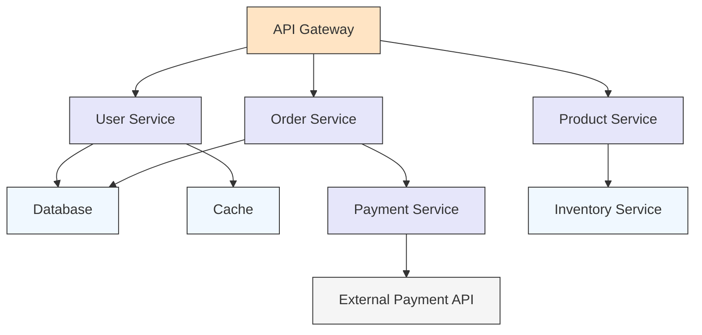

在复杂的微服务架构中，一个简单的用户请求可能会穿越数十个服务，形成复杂的调用链路。理解这些调用链路的结构、性能特征和依赖关系，对于系统优化、故障排查和架构设计具有重要意义。本文将深入探讨如何通过分布式追踪数据进行微服务调用链分析，揭示系统内部的运行机制。

## 调用链路结构分析

### 调用链路类型

#### 1. 线性调用链

线性调用链是最简单的调用模式，请求按顺序穿越多个服务：

```
Client → API Gateway → User Service → Database
```

```json
{
  "traceId": "trace-001",
  "spans": [
    {
      "spanId": "span-001",
      "operationName": "GET /api/users/123",
      "startTime": 1000,
      "duration": 500,
      "tags": {"service": "api-gateway"}
    },
    {
      "spanId": "span-002",
      "parentSpanId": "span-001",
      "operationName": "getUser",
      "startTime": 1050,
      "duration": 300,
      "tags": {"service": "user-service"}
    },
    {
      "spanId": "span-003",
      "parentSpanId": "span-002",
      "operationName": "SELECT * FROM users",
      "startTime": 1100,
      "duration": 150,
      "tags": {"service": "database"}
    }
  ]
}
```

#### 2. 并行调用链

并行调用链中，一个服务同时调用多个下游服务：

```
                    ┌→ Order Service → Database
Client → API Gateway ┤
                    └→ User Service → Cache
```

```json
{
  "traceId": "trace-002",
  "spans": [
    {
      "spanId": "span-001",
      "operationName": "GET /api/dashboard",
      "startTime": 1000,
      "duration": 800,
      "tags": {"service": "api-gateway"}
    },
    {
      "spanId": "span-002",
      "parentSpanId": "span-001",
      "operationName": "getOrderSummary",
      "startTime": 1050,
      "duration": 600,
      "tags": {"service": "order-service"}
    },
    {
      "spanId": "span-003",
      "parentSpanId": "span-001",
      "operationName": "getUserProfile",
      "startTime": 1050,
      "duration": 400,
      "tags": {"service": "user-service"}
    },
    {
      "spanId": "span-004",
      "parentSpanId": "span-002",
      "operationName": "database.query",
      "startTime": 1100,
      "duration": 300,
      "tags": {"service": "database"}
    },
    {
      "spanId": "span-005",
      "parentSpanId": "span-003",
      "operationName": "cache.get",
      "startTime": 1100,
      "duration": 200,
      "tags": {"service": "redis"}
    }
  ]
}
```

#### 3. 循环调用链

循环调用链中存在服务间的循环依赖：

```
Service A → Service B → Service C
  ↑                       ↓
  └───────────────────────┘
```

```json
{
  "traceId": "trace-003",
  "spans": [
    {
      "spanId": "span-001",
      "operationName": "processOrder",
      "startTime": 1000,
      "duration": 1500,
      "tags": {"service": "order-service"}
    },
    {
      "spanId": "span-002",
      "parentSpanId": "span-001",
      "operationName": "validateUser",
      "startTime": 1050,
      "duration": 800,
      "tags": {"service": "user-service"}
    },
    {
      "spanId": "span-003",
      "parentSpanId": "span-002",
      "operationName": "checkPermissions",
      "startTime": 1100,
      "duration": 500,
      "tags": {"service": "auth-service"}
    },
    {
      "spanId": "span-004",
      "parentSpanId": "span-003",
      "operationName": "getUserInfo",
      "startTime": 1150,
      "duration": 200,
      "tags": {"service": "user-service"}
    }
  ]
}
```

## 依赖关系分析

### 服务依赖图构建

通过分析大量追踪数据，可以构建服务间的依赖关系图：

```python
# 服务依赖图构建示例
import networkx as nx
from collections import defaultdict

class ServiceDependencyAnalyzer:
    def __init__(self):
        self.dependency_graph = nx.DiGraph()
        self.call_counts = defaultdict(int)
        self.avg_durations = defaultdict(float)
    
    def analyze_trace(self, trace):
        """分析单个追踪数据"""
        spans = trace.get('spans', [])
        
        # 构建Span ID到服务的映射
        span_to_service = {}
        for span in spans:
            service = span.get('tags', {}).get('service', 'unknown')
            span_to_service[span['spanId']] = service
        
        # 分析调用关系
        for span in spans:
            if 'parentSpanId' in span:
                parent_service = span_to_service.get(span['parentSpanId'], 'unknown')
                child_service = span_to_service.get(span['spanId'], 'unknown')
                
                if parent_service != child_service:
                    edge = (parent_service, child_service)
                    self.call_counts[edge] += 1
                    self.avg_durations[edge] = (
                        self.avg_durations[edge] * (self.call_counts[edge] - 1) + 
                        span['duration']
                    ) / self.call_counts[edge]
    
    def build_dependency_graph(self):
        """构建依赖关系图"""
        for edge, count in self.call_counts.items():
            self.dependency_graph.add_edge(edge[0], edge[1], 
                                         weight=count, 
                                         avg_duration=self.avg_durations[edge])
        return self.dependency_graph
    
    def get_critical_paths(self):
        """识别关键路径"""
        critical_paths = []
        for source in self.dependency_graph.nodes():
            for target in self.dependency_graph.nodes():
                if source != target and nx.has_path(self.dependency_graph, source, target):
                    try:
                        paths = nx.all_simple_paths(self.dependency_graph, source, target, cutoff=10)
                        for path in paths:
                            total_weight = sum(
                                self.dependency_graph[u][v]['weight'] 
                                for u, v in zip(path[:-1], path[1:])
                            )
                            critical_paths.append({
                                'path': path,
                                'weight': total_weight,
                                'services': len(path)
                            })
                    except nx.NetworkXNoPath:
                        continue
        
        # 按权重排序
        return sorted(critical_paths, key=lambda x: x['weight'], reverse=True)[:10]
```

### 依赖关系可视化



## 性能瓶颈识别

### 关键路径分析

```python
# 关键路径分析示例
class CriticalPathAnalyzer:
    def __init__(self, traces):
        self.traces = traces
    
    def find_critical_paths(self):
        """查找关键路径"""
        path_durations = defaultdict(list)
        
        for trace in self.traces:
            # 提取调用链路
            call_path = self.extract_call_path(trace)
            if call_path:
                total_duration = trace['spans'][0]['duration']
                path_durations[call_path].append(total_duration)
        
        # 计算平均持续时间
        critical_paths = []
        for path, durations in path_durations.items():
            avg_duration = sum(durations) / len(durations)
            critical_paths.append({
                'path': path,
                'avg_duration': avg_duration,
                'count': len(durations),
                'p95_duration': self.percentile(durations, 95),
                'p99_duration': self.percentile(durations, 99)
            })
        
        # 按平均持续时间排序
        return sorted(critical_paths, key=lambda x: x['avg_duration'], reverse=True)
    
    def extract_call_path(self, trace):
        """提取调用路径"""
        spans = trace.get('spans', [])
        if not spans:
            return None
        
        # 按开始时间排序
        spans.sort(key=lambda x: x['startTime'])
        
        # 提取服务调用序列
        services = []
        for span in spans:
            service = span.get('tags', {}).get('service')
            if service and service not in services:
                services.append(service)
        
        return ' → '.join(services)
    
    def percentile(self, data, percentile):
        """计算百分位数"""
        if not data:
            return 0
        sorted_data = sorted(data)
        index = int(len(sorted_data) * percentile / 100)
        return sorted_data[min(index, len(sorted_data) - 1)]
```

### 瓶颈服务识别

```python
# 瓶颈服务识别示例
class BottleneckDetector:
    def __init__(self, traces):
        self.traces = traces
    
    def detect_bottlenecks(self):
        """检测瓶颈服务"""
        service_metrics = defaultdict(list)
        
        for trace in self.traces:
            spans = trace.get('spans', [])
            for span in spans:
                service = span.get('tags', {}).get('service', 'unknown')
                duration = span.get('duration', 0)
                service_metrics[service].append({
                    'duration': duration,
                    'timestamp': span.get('startTime', 0)
                })
        
        bottlenecks = []
        for service, metrics in service_metrics.items():
            if len(metrics) < 10:  # 至少需要10个样本
                continue
            
            durations = [m['duration'] for m in metrics]
            avg_duration = sum(durations) / len(durations)
            p95_duration = self.percentile(durations, 95)
            p99_duration = self.percentile(durations, 99)
            
            # 计算相对于整体请求的占比
            total_trace_duration = max(m['timestamp'] + m['duration'] for m in metrics) - \
                                 min(m['timestamp'] for m in metrics)
            duration_ratio = avg_duration / total_trace_duration if total_trace_duration > 0 else 0
            
            bottlenecks.append({
                'service': service,
                'avg_duration': avg_duration,
                'p95_duration': p95_duration,
                'p99_duration': p99_duration,
                'call_count': len(metrics),
                'duration_ratio': duration_ratio,
                'is_bottleneck': duration_ratio > 0.3 or p95_duration > 1000000  # 1秒
            })
        
        return sorted(bottlenecks, key=lambda x: x['avg_duration'], reverse=True)
    
    def percentile(self, data, percentile):
        """计算百分位数"""
        if not data:
            return 0
        sorted_data = sorted(data)
        index = int(len(sorted_data) * percentile / 100)
        return sorted_data[min(index, len(sorted_data) - 1)]
```

## 调用模式分析

### 调用频率分析

```python
# 调用频率分析示例
class CallFrequencyAnalyzer:
    def __init__(self, traces):
        self.traces = traces
        self.call_patterns = defaultdict(lambda: defaultdict(int))
    
    def analyze_patterns(self):
        """分析调用模式"""
        for trace in self.traces:
            self.analyze_trace_pattern(trace)
        
        return self.identify_patterns()
    
    def analyze_trace_pattern(self, trace):
        """分析单个追踪的调用模式"""
        spans = trace.get('spans', [])
        
        # 按服务分组
        service_spans = defaultdict(list)
        for span in spans:
            service = span.get('tags', {}).get('service', 'unknown')
            service_spans[service].append(span)
        
        # 分析服务间的调用关系
        for i, (service1, spans1) in enumerate(service_spans.items()):
            for j, (service2, spans2) in enumerate(service_spans.items()):
                if i < j:  # 避免重复计算
                    # 检查是否存在调用关系
                    if self.has_call_relationship(spans1, spans2):
                        self.call_patterns[service1][service2] += 1
                        self.call_patterns[service2][service1] += 1
    
    def has_call_relationship(self, spans1, spans2):
        """检查两个服务间是否存在调用关系"""
        for span1 in spans1:
            for span2 in spans2:
                if span1.get('spanId') == span2.get('parentSpanId') or \
                   span2.get('spanId') == span1.get('parentSpanId'):
                    return True
        return False
    
    def identify_patterns(self):
        """识别常见模式"""
        patterns = {
            'high_coupling': [],  # 高耦合
            'fan_out': [],        # 扇出模式
            'fan_in': [],         # 扇入模式
            'sequential': []      # 顺序调用
        }
        
        for service, dependencies in self.call_patterns.items():
            # 高耦合：与其他服务有大量调用关系
            if len(dependencies) > 5:
                patterns['high_coupling'].append({
                    'service': service,
                    'dependency_count': len(dependencies),
                    'total_calls': sum(dependencies.values())
                })
            
            # 扇出模式：调用大量下游服务
            outbound_calls = sum(1 for count in dependencies.values() if count > 100)
            if outbound_calls > 3:
                patterns['fan_out'].append({
                    'service': service,
                    'outbound_services': outbound_calls
                })
        
        return patterns
```

### 异常调用检测

```python
# 异常调用检测示例
class AnomalyDetector:
    def __init__(self, traces):
        self.traces = traces
        self.baseline_metrics = {}
    
    def build_baseline(self):
        """构建基线指标"""
        service_metrics = defaultdict(list)
        
        # 收集历史数据构建基线
        for trace in self.traces[:len(self.traces)//2]:  # 使用前50%的数据
            spans = trace.get('spans', [])
            for span in spans:
                service = span.get('tags', {}).get('service', 'unknown')
                duration = span.get('duration', 0)
                service_metrics[service].append(duration)
        
        # 计算基线统计信息
        for service, durations in service_metrics.items():
            if durations:
                self.baseline_metrics[service] = {
                    'mean': sum(durations) / len(durations),
                    'std': self.std_deviation(durations),
                    'p95': self.percentile(durations, 95),
                    'p99': self.percentile(durations, 99)
                }
    
    def detect_anomalies(self):
        """检测异常调用"""
        anomalies = []
        
        # 使用后50%的数据进行检测
        for trace in self.traces[len(self.traces)//2:]:
            anomalies.extend(self.analyze_trace_for_anomalies(trace))
        
        return anomalies
    
    def analyze_trace_for_anomalies(self, trace):
        """分析追踪数据中的异常"""
        anomalies = []
        spans = trace.get('spans', [])
        
        for span in spans:
            service = span.get('tags', {}).get('service', 'unknown')
            duration = span.get('duration', 0)
            
            # 检查是否超出基线
            baseline = self.baseline_metrics.get(service)
            if baseline:
                # 3σ原则检测
                if duration > baseline['mean'] + 3 * baseline['std']:
                    anomalies.append({
                        'traceId': trace.get('traceId'),
                        'spanId': span.get('spanId'),
                        'service': service,
                        'duration': duration,
                        'baseline_mean': baseline['mean'],
                        'baseline_std': baseline['std'],
                        'deviation': (duration - baseline['mean']) / baseline['std']
                    })
                
                # 99%分位数检测
                if duration > baseline['p99']:
                    anomalies.append({
                        'traceId': trace.get('traceId'),
                        'spanId': span.get('spanId'),
                        'service': service,
                        'duration': duration,
                        'baseline_p99': baseline['p99'],
                        'exceeds_p99': duration - baseline['p99']
                    })
        
        return anomalies
    
    def std_deviation(self, data):
        """计算标准差"""
        if len(data) < 2:
            return 0
        mean = sum(data) / len(data)
        variance = sum((x - mean) ** 2 for x in data) / (len(data) - 1)
        return variance ** 0.5
    
    def percentile(self, data, percentile):
        """计算百分位数"""
        if not data:
            return 0
        sorted_data = sorted(data)
        index = int(len(sorted_data) * percentile / 100)
        return sorted_data[min(index, len(sorted_data) - 1)]
```

## 优化建议生成

### 性能优化建议

```python
# 性能优化建议生成器
class OptimizationAdvisor:
    def __init__(self, analysis_results):
        self.results = analysis_results
    
    def generate_recommendations(self):
        """生成优化建议"""
        recommendations = []
        
        # 基于瓶颈分析的建议
        bottlenecks = self.results.get('bottlenecks', [])
        for bottleneck in bottlenecks:
            if bottleneck.get('is_bottleneck'):
                recommendations.extend(self.bottleneck_recommendations(bottleneck))
        
        # 基于调用模式的建议
        patterns = self.results.get('patterns', {})
        recommendations.extend(self.pattern_recommendations(patterns))
        
        # 基于异常检测的建议
        anomalies = self.results.get('anomalies', [])
        recommendations.extend(self.anomaly_recommendations(anomalies))
        
        return recommendations
    
    def bottleneck_recommendations(self, bottleneck):
        """瓶颈优化建议"""
        service = bottleneck['service']
        avg_duration = bottleneck['avg_duration']
        duration_ratio = bottleneck['duration_ratio']
        
        recommendations = []
        
        if duration_ratio > 0.5:
            recommendations.append({
                'type': 'critical_bottleneck',
                'service': service,
                'priority': 'high',
                'description': f'服务 {service} 占用请求总时间的 {duration_ratio:.1%}，是关键瓶颈',
                'suggestions': [
                    '考虑对该服务进行性能优化',
                    '分析该服务的数据库查询性能',
                    '检查是否存在同步阻塞操作',
                    '考虑异步处理或缓存策略'
                ]
            })
        
        if avg_duration > 1000000:  # 1秒
            recommendations.append({
                'type': 'slow_service',
                'service': service,
                'priority': 'medium',
                'description': f'服务 {service} 平均响应时间 {avg_duration/1000:.0f}ms，响应较慢',
                'suggestions': [
                    '优化该服务的算法复杂度',
                    '检查外部API调用性能',
                    '考虑增加缓存层',
                    '分析GC日志优化内存使用'
                ]
            })
        
        return recommendations
    
    def pattern_recommendations(self, patterns):
        """模式优化建议"""
        recommendations = []
        
        # 高耦合建议
        high_coupling = patterns.get('high_coupling', [])
        for item in high_coupling:
            recommendations.append({
                'type': 'high_coupling',
                'service': item['service'],
                'priority': 'medium',
                'description': f'服务 {item["service"]} 与 {item["dependency_count"]} 个其他服务耦合度过高',
                'suggestions': [
                    '考虑服务拆分或合并',
                    '引入消息队列解耦服务间依赖',
                    '使用API网关统一入口管理'
                ]
            })
        
        return recommendations
    
    def anomaly_recommendations(self, anomalies):
        """异常优化建议"""
        if not anomalies:
            return []
        
        # 按服务分组异常
        service_anomalies = defaultdict(list)
        for anomaly in anomalies:
            service_anomalies[anomaly['service']].append(anomaly)
        
        recommendations = []
        for service, anomalies in service_anomalies.items():
            if len(anomalies) > 10:  # 异常次数较多
                max_deviation = max(a.get('deviation', 0) for a in anomalies)
                recommendations.append({
                    'type': 'performance_variance',
                    'service': service,
                    'priority': 'high',
                    'description': f'服务 {service} 性能波动较大，最大偏差 {max_deviation:.1f}σ',
                    'suggestions': [
                        '检查服务资源配置是否稳定',
                        '分析负载均衡策略',
                        '监控依赖服务的稳定性',
                        '实施更细粒度的监控'
                    ]
                })
        
        return recommendations
```

## 实际案例分析

### 电商系统调用链分析

假设我们有一个电商系统，包含以下服务：
- API Gateway
- User Service
- Product Service
- Order Service
- Payment Service
- Inventory Service
- Notification Service

通过分析该系统的追踪数据，我们发现了以下问题：

#### 1. 关键路径分析结果

```json
{
  "critical_paths": [
    {
      "path": "API Gateway → User Service → Database",
      "avg_duration": 850000,
      "percentage": 45.2,
      "bottleneck": "User Service database queries"
    },
    {
      "path": "API Gateway → Order Service → Payment Service → External API",
      "avg_duration": 1200000,
      "percentage": 63.5,
      "bottleneck": "External payment API"
    }
  ]
}
```

#### 2. 瓶颈服务识别结果

```json
{
  "bottlenecks": [
    {
      "service": "User Service",
      "avg_duration": 650000,
      "duration_ratio": 0.42,
      "issue": "Database connection pool exhaustion"
    },
    {
      "service": "Payment Service",
      "avg_duration": 980000,
      "duration_ratio": 0.61,
      "issue": "External API timeout"
    }
  ]
}
```

#### 3. 优化建议

基于分析结果，我们提出以下优化建议：

1. **User Service优化**：
   - 增加数据库连接池大小
   - 实施用户数据缓存策略
   - 优化慢查询SQL

2. **Payment Service优化**：
   - 实施异步支付处理
   - 增加外部API调用超时重试机制
   - 添加支付结果缓存

3. **整体架构优化**：
   - 引入消息队列解耦订单创建和支付处理
   - 实施读写分离减轻数据库压力
   - 增加服务降级和熔断机制

## 监控与告警

### 调用链监控指标

```promql
# 关键服务响应时间
histogram_quantile(0.95, sum(rate(span_duration_seconds_bucket{service=~"user-service|order-service"}[5m])) by (service, le))

# 服务间调用延迟
histogram_quantile(0.95, sum(rate(span_duration_seconds_bucket{parent_service="api-gateway"}[5m])) by (service, le))

# 调用链深度分布
sum(rate(span_count_total[5m])) by (trace_depth)

# 异常调用比例
rate(span_exception_total[5m]) / rate(span_total[5m])
```

### 告警规则配置

```yaml
# Prometheus告警规则
groups:
- name: call-chain-alerts
  rules:
  - alert: HighServiceLatency
    expr: histogram_quantile(0.95, sum(rate(span_duration_seconds_bucket[5m])) by (service, le)) > 1
    for: 5m
    labels:
      severity: warning
    annotations:
      summary: "Service {{ $labels.service }} has high latency"
      description: "95th percentile latency for {{ $labels.service }} is above 1 second"

  - alert: HighCallChainDepth
    expr: sum(rate(trace_depth_count[5m])) by (depth) > 10
    for: 5m
    labels:
      severity: warning
    annotations:
      summary: "Deep call chains detected"
      description: "Call chains with depth {{ $labels.depth }} are occurring frequently"

  - alert: HighExceptionRate
    expr: rate(span_exception_total[5m]) / rate(span_total[5m]) > 0.05
    for: 5m
    labels:
      severity: critical
    annotations:
      summary: "High exception rate in service calls"
      description: "Exception rate is above 5% across services"
```

## 最佳实践总结

### 1. 分析方法论

- **自顶向下**：从整体请求响应时间开始，逐步深入到具体服务
- **数据驱动**：基于实际追踪数据进行分析，避免主观臆断
- **持续监控**：建立持续的调用链分析机制，及时发现新问题

### 2. 工具选择

- **可视化工具**：使用Jaeger、Zipkin等工具的依赖图功能
- **分析工具**：结合Python、R等数据分析工具进行深度分析
- **监控工具**：集成Prometheus、Grafana等监控系统

### 3. 优化策略

- **短期优化**：针对已识别的瓶颈进行快速优化
- **长期规划**：基于调用模式分析进行架构重构
- **预防措施**：建立完善的监控告警体系，预防问题发生

## 总结

微服务调用链分析是理解和优化复杂分布式系统的关键手段。通过深入分析调用链路结构、依赖关系、性能瓶颈和调用模式，我们可以：

1. **识别系统瓶颈**：快速定位影响系统性能的关键服务
2. **优化系统架构**：基于数据分析结果进行合理的架构调整
3. **预防潜在问题**：通过持续监控及时发现和解决潜在问题
4. **提升用户体验**：通过性能优化提升整体用户体验

在实际应用中，需要结合具体的业务场景和技术栈，选择合适的分析工具和方法，并建立持续的分析和优化机制。只有这样，才能充分发挥分布式追踪数据的价值，为微服务架构的持续优化提供有力支撑。

在下一节中，我们将探讨性能瓶颈识别与优化技术，学习如何通过追踪数据深入分析和解决系统性能问题。