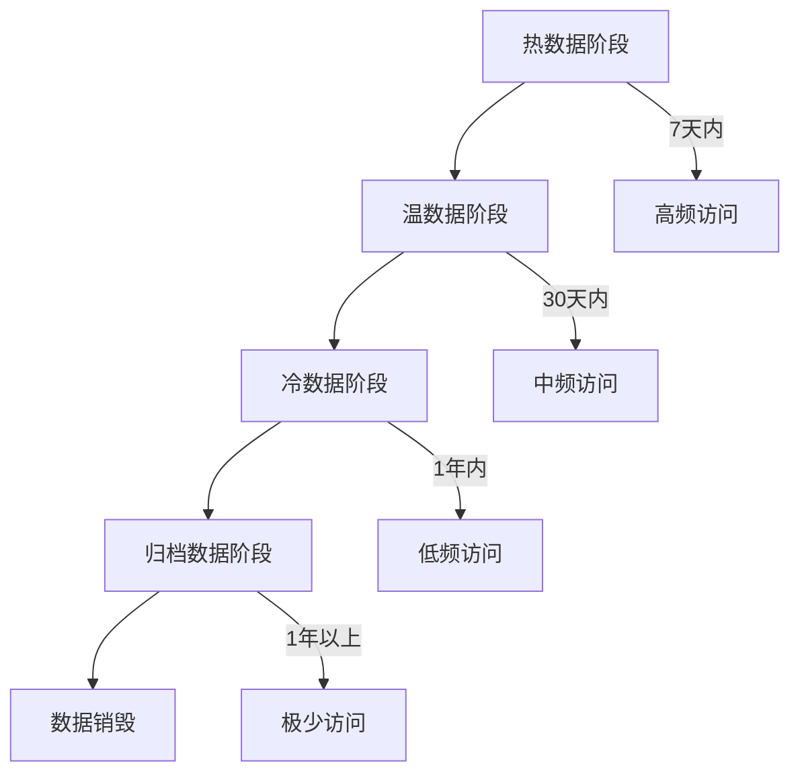

在微服务架构中，日志与监控系统会产生大量的数据，随着时间的推移，这些数据会占用越来越多的存储空间并增加查询成本。制定合理的数据保留与清理策略，不仅能够控制存储成本，还能确保系统的性能和合规性。本章将深入探讨日志与监控数据的生命周期管理、保留策略设计以及清理机制实现。

## 数据生命周期管理

### 生命周期阶段划分

日志与监控数据的生命周期可以划分为以下几个阶段：



### 各阶段特征

| 阶段 | 存储介质 | 访问频率 | 性能要求 | 成本 |
|------|---------|---------|---------|------|
| 热数据 | SSD/内存 | 高频 | 毫秒级 | 高 |
| 温数据 | HDD | 中频 | 秒级 | 中 |
| 冷数据 | 对象存储 | 低频 | 分钟级 | 低 |
| 归档数据 | 磁带/冷存储 | 极低 | 小时级 | 极低 |

## 数据保留策略设计

### 业务需求分析

```yaml
# 数据保留需求分析
retention_requirements:
  operational_logs:
    description: "日常运维日志"
    retention_period: "30天"
    access_pattern: "高频访问"
    storage_tier: "热数据"
  
  audit_logs:
    description: "审计日志"
    retention_period: "7年"
    access_pattern: "低频访问"
    storage_tier: "冷数据"
  
  security_logs:
    description: "安全日志"
    retention_period: "1年"
    access_pattern: "中频访问"
    storage_tier: "温数据"
  
  business_metrics:
    description: "业务指标"
    retention_period: "2年"
    access_pattern: "中频访问"
    storage_tier: "温数据"
  
  debug_logs:
    description: "调试日志"
    retention_period: "7天"
    access_pattern: "高频访问"
    storage_tier: "热数据"
```

### 合规性要求

```markdown
## 主要合规性要求

### GDPR (通用数据保护条例)
- 个人数据存储期限不应超过处理目的所需的时间
- 数据主体有权要求删除其个人数据

### HIPAA (健康保险便携性和责任法案)
- 医疗信息必须保存至少6年
- 需要实施适当的安全措施保护数据

### SOX (萨班斯-奥克斯利法案)
- 财务相关记录必须保存7年
- 需要确保数据的完整性和不可篡改性

### PCI DSS (支付卡行业数据安全标准)
- 持卡人数据的存储需要特殊保护
- 审计日志必须保存至少1年
```

## Elasticsearch数据保留策略

### 索引生命周期管理(ILM)

```json
// Elasticsearch ILM策略配置
PUT _ilm/policy/microservices_logs_policy
{
  "policy": {
    "phases": {
      "hot": {
        "min_age": "0ms",
        "actions": {
          "rollover": {
            "max_age": "1d",
            "max_size": "50gb",
            "max_docs": 10000000
          },
          "set_priority": {
            "priority": 100
          }
        }
      },
      "warm": {
        "min_age": "7d",
        "actions": {
          "forcemerge": {
            "max_num_segments": 1
          },
          "shrink": {
            "number_of_shards": 1
          },
          "allocate": {
            "require": {
              "data": "warm"
            }
          },
          "set_priority": {
            "priority": 50
          }
        }
      },
      "cold": {
        "min_age": "30d",
        "actions": {
          "freeze": {},
          "allocate": {
            "require": {
              "data": "cold"
            }
          },
          "set_priority": {
            "priority": 0
          }
        }
      },
      "delete": {
        "min_age": "365d",
        "actions": {
          "delete": {
            "delete_searchable_snapshot": true
          }
        }
      }
    }
  }
}
```

### 索引模板配置

```json
// 索引模板配置
PUT _template/microservices_logs_template
{
  "index_patterns": ["microservices-logs-*"],
  "settings": {
    "number_of_shards": 3,
    "number_of_replicas": 1,
    "refresh_interval": "30s",
    "lifecycle.name": "microservices_logs_policy",
    "lifecycle.rollover_alias": "microservices-logs"
  },
  "mappings": {
    "properties": {
      "timestamp": {
        "type": "date",
        "format": "yyyy-MM-dd'T'HH:mm:ss.SSS'Z'"
      },
      "level": {
        "type": "keyword"
      },
      "service": {
        "type": "keyword"
      },
      "trace_id": {
        "type": "keyword"
      },
      "message": {
        "type": "text"
      }
    }
  }
}
```

## Prometheus数据保留策略

### 存储配置

```yaml
# Prometheus存储配置
global:
  scrape_interval: 15s
  evaluation_interval: 15s

rule_files:
  - "rules/*.yml"

scrape_configs:
  - job_name: 'prometheus'
    static_configs:
      - targets: ['localhost:9090']

# 存储配置
storage:
  tsdb:
    # 数据保留时间
    retention.time: 15d
    # 最大存储大小
    retention.size: 50GB
    # WAL压缩
    wal-compression: true

# 远程写配置（用于长期存储）
remote_write:
  - url: "http://remote-storage:9090/api/v1/write"
    write_relabel_configs:
      - source_labels: [__name__]
        regex: 'up|prometheus_.*'
        action: keep
```

### Thanos长期存储

```yaml
# Thanos Sidecar配置
apiVersion: apps/v1
kind: Deployment
metadata:
  name: prometheus-thanos
spec:
  replicas: 1
  selector:
    matchLabels:
      app: prometheus-thanos
  template:
    metadata:
      labels:
        app: prometheus-thanos
    spec:
      containers:
      - name: prometheus
        image: prom/prometheus:v2.30.0
        args:
          - --config.file=/etc/prometheus/prometheus.yml
          - --storage.tsdb.path=/prometheus
          - --storage.tsdb.retention.time=2h
          - --web.enable-lifecycle
          - --web.enable-admin-api
        ports:
        - containerPort: 9090
        volumeMounts:
        - name: prometheus-config
          mountPath: /etc/prometheus
        - name: prometheus-storage
          mountPath: /prometheus

      - name: thanos-sidecar
        image: quay.io/thanos/thanos:v0.23.0
        args:
          - sidecar
          - --http-address=0.0.0.0:10902
          - --grpc-address=0.0.0.0:10901
          - --prometheus.url=http://localhost:9090
          - --tsdb.path=/prometheus
          - --objstore.config-file=/etc/thanos/objstore.yml
        ports:
        - containerPort: 10901
        - containerPort: 10902
        volumeMounts:
        - name: prometheus-storage
          mountPath: /prometheus
        - name: thanos-config
          mountPath: /etc/thanos
```

## 数据清理机制实现

### 定时清理脚本

```python
#!/usr/bin/env python3
# 数据清理脚本
import os
import shutil
import time
from datetime import datetime, timedelta
import logging

class DataCleaner:
    def __init__(self, config):
        self.config = config
        self.logger = logging.getLogger(__name__)
        
    def clean_logs_by_age(self, directory, max_age_days):
        """根据年龄清理日志文件"""
        cutoff_time = time.time() - (max_age_days * 24 * 60 * 60)
        
        for root, dirs, files in os.walk(directory):
            for file in files:
                file_path = os.path.join(root, file)
                if os.path.getmtime(file_path) < cutoff_time:
                    try:
                        os.remove(file_path)
                        self.logger.info(f"已删除过期日志文件: {file_path}")
                    except Exception as e:
                        self.logger.error(f"删除文件失败 {file_path}: {e}")
    
    def clean_logs_by_size(self, directory, max_size_gb):
        """根据大小清理日志文件"""
        total_size = 0
        files_with_time = []
        
        # 计算总大小并收集文件信息
        for root, dirs, files in os.walk(directory):
            for file in files:
                file_path = os.path.join(root, file)
                file_size = os.path.getsize(file_path)
                file_time = os.path.getmtime(file_path)
                total_size += file_size
                files_with_time.append((file_path, file_size, file_time))
        
        # 如果超过限制，按时间排序删除最旧的文件
        if total_size > max_size_gb * 1024 * 1024 * 1024:
            files_with_time.sort(key=lambda x: x[2])  # 按时间排序
            
            for file_path, file_size, file_time in files_with_time:
                if total_size <= max_size_gb * 1024 * 1024 * 1024:
                    break
                    
                try:
                    os.remove(file_path)
                    total_size -= file_size
                    self.logger.info(f"已删除超量日志文件: {file_path}")
                except Exception as e:
                    self.logger.error(f"删除文件失败 {file_path}: {e}")
    
    def clean_prometheus_data(self, prometheus_data_dir, retention_days):
        """清理Prometheus数据"""
        cutoff_time = time.time() - (retention_days * 24 * 60 * 60)
        
        for root, dirs, files in os.walk(prometheus_data_dir):
            for dir_name in dirs:
                if dir_name.startswith('chunks_') or dir_name.startswith('index_'):
                    dir_path = os.path.join(root, dir_name)
                    if os.path.getmtime(dir_path) < cutoff_time:
                        try:
                            shutil.rmtree(dir_path)
                            self.logger.info(f"已删除过期Prometheus数据: {dir_path}")
                        except Exception as e:
                            self.logger.error(f"删除目录失败 {dir_path}: {e}")

# 使用示例
if __name__ == "__main__":
    logging.basicConfig(level=logging.INFO)
    
    config = {
        'log_directories': ['/var/log/microservices', '/var/log/nginx'],
        'max_log_age_days': 30,
        'max_log_size_gb': 10,
        'prometheus_data_dir': '/var/lib/prometheus',
        'prometheus_retention_days': 15
    }
    
    cleaner = DataCleaner(config)
    
    # 清理日志文件
    for log_dir in config['log_directories']:
        if os.path.exists(log_dir):
            cleaner.clean_logs_by_age(log_dir, config['max_log_age_days'])
            cleaner.clean_logs_by_size(log_dir, config['max_log_size_gb'])
    
    # 清理Prometheus数据
    if os.path.exists(config['prometheus_data_dir']):
        cleaner.clean_prometheus_data(
            config['prometheus_data_dir'], 
            config['prometheus_retention_days']
        )
```

### Kubernetes CronJob清理任务

```yaml
# Kubernetes CronJob清理任务
apiVersion: batch/v1
kind: CronJob
metadata:
  name: log-cleanup
  namespace: monitoring
spec:
  schedule: "0 2 * * *"  # 每天凌晨2点执行
  jobTemplate:
    spec:
      template:
        spec:
          containers:
          - name: log-cleanup
            image: python:3.9-alpine
            command:
            - /bin/sh
            - -c
            - |
              pip install boto3
              python /scripts/cleanup.py
            volumeMounts:
            - name: scripts
              mountPath: /scripts
            - name: log-storage
              mountPath: /var/log
            env:
            - name: AWS_ACCESS_KEY_ID
              valueFrom:
                secretKeyRef:
                  name: aws-credentials
                  key: access-key
            - name: AWS_SECRET_ACCESS_KEY
              valueFrom:
                secretKeyRef:
                  name: aws-credentials
                  key: secret-key
          volumes:
          - name: scripts
            configMap:
              name: cleanup-scripts
          - name: log-storage
            persistentVolumeClaim:
              claimName: log-storage-pvc
          restartPolicy: OnFailure
```

## 成本优化策略

### 存储成本分析

```python
# 存储成本分析工具
class StorageCostAnalyzer:
    def __init__(self):
        # 不同存储类型的单位成本（美元/GB/月）
        self.storage_costs = {
            'hot': 0.10,      # 热存储（SSD）
            'warm': 0.05,     # 温存储（HDD）
            'cold': 0.01,     # 冷存储（对象存储）
            'archive': 0.001  # 归档存储（磁带）
        }
    
    def calculate_storage_cost(self, storage_usage):
        """计算存储成本"""
        total_cost = 0
        cost_breakdown = {}
        
        for storage_type, usage_gb in storage_usage.items():
            if storage_type in self.storage_costs:
                cost = usage_gb * self.storage_costs[storage_type]
                cost_breakdown[storage_type] = cost
                total_cost += cost
        
        return {
            'total_cost': total_cost,
            'breakdown': cost_breakdown
        }
    
    def recommend_optimizations(self, current_usage):
        """推荐优化策略"""
        recommendations = []
        
        # 检查是否可以将更多数据移至冷存储
        if current_usage.get('hot', 0) > current_usage.get('warm', 0) * 2:
            recommendations.append({
                'action': '数据迁移',
                'description': '建议将30天以上的热数据迁移至温存储',
                'estimated_savings': current_usage['hot'] * 0.05
            })
        
        # 检查是否可以将更多数据移至归档存储
        if current_usage.get('warm', 0) > current_usage.get('cold', 0) * 3:
            recommendations.append({
                'action': '数据归档',
                'description': '建议将1年以上的温数据迁移至冷存储',
                'estimated_savings': current_usage['warm'] * 0.04
            })
        
        return recommendations

# 使用示例
analyzer = StorageCostAnalyzer()
current_usage = {
    'hot': 1000,    # 1000GB热存储
    'warm': 5000,   # 5000GB温存储
    'cold': 20000,  # 20000GB冷存储
    'archive': 50000 # 50000GB归档存储
}

cost_analysis = analyzer.calculate_storage_cost(current_usage)
optimizations = analyzer.recommend_optimizations(current_usage)

print(f"总存储成本: ${cost_analysis['total_cost']:.2f}")
print("成本明细:")
for storage_type, cost in cost_analysis['breakdown'].items():
    print(f"  {storage_type}: ${cost:.2f}")

print("\n优化建议:")
for recommendation in optimizations:
    print(f"  {recommendation['action']}: {recommendation['description']}")
    print(f"    预计节省: ${recommendation['estimated_savings']:.2f}")
```

### 数据压缩策略

```yaml
# 数据压缩配置
compression_strategies:
  elasticsearch:
    enabled: true
    algorithm: "best_compression"
    level: 9
    settings:
      index.codec: best_compression
  
  prometheus:
    enabled: true
    wal_compression: true
    chunk_encoding: "double_delta"
  
  log_files:
    enabled: true
    algorithm: "gzip"
    level: 6
    rotation_compression: true
```

## 监控与告警

### 数据保留监控

```promql
# 数据保留监控指标
# Elasticsearch索引大小
sum(elasticsearch_indices_store_size_bytes) by (index)

# Prometheus数据目录大小
node_filesystem_size_bytes{mountpoint="/prometheus"} - node_filesystem_free_bytes{mountpoint="/prometheus"}

# 日志文件大小
sum(node_filesystem_size_bytes{mountpoint="/var/log"}) - sum(node_filesystem_free_bytes{mountpoint="/var/log"})
```

### 告警规则

```yaml
# 数据保留告警规则
groups:
- name: data-retention-alerts
  rules:
  - alert: StorageUsageHigh
    expr: (node_filesystem_size_bytes{mountpoint="/prometheus"} - node_filesystem_free_bytes{mountpoint="/prometheus"}) / node_filesystem_size_bytes{mountpoint="/prometheus"} * 100 > 85
    for: 5m
    labels:
      severity: warning
    annotations:
      summary: "存储使用率过高"
      description: "Prometheus存储使用率超过85%，当前使用率: {{ $value }}%"

  - alert: LogStorageFull
    expr: (sum(node_filesystem_size_bytes{mountpoint="/var/log"}) - sum(node_filesystem_free_bytes{mountpoint="/var/log"})) / sum(node_filesystem_size_bytes{mountpoint="/var/log"}) * 100 > 90
    for: 5m
    labels:
      severity: critical
    annotations:
      summary: "日志存储空间不足"
      description: "日志存储使用率超过90%，当前使用率: {{ $value }}%"

  - alert: DataRetentionNotWorking
    expr: count(elasticsearch_indices{index=~"microservices-logs-.*"}) > 100
    for: 10m
    labels:
      severity: warning
    annotations:
      summary: "数据保留策略未生效"
      description: "Elasticsearch中存在超过100个日志索引，可能数据保留策略未正确执行"
```

## 最佳实践总结

### 1. 策略制定

- **业务导向**：根据业务需求和合规要求制定保留策略
- **分层存储**：实施热温冷数据分层存储策略
- **定期评估**：定期评估和调整保留策略

### 2. 技术实现

- **自动化清理**：实现自动化的数据清理机制
- **监控告警**：建立存储使用监控和告警机制
- **成本优化**：持续优化存储成本

### 3. 合规管理

- **法规遵循**：确保符合相关法规要求
- **审计跟踪**：保持完整的数据操作审计记录
- **数据安全**：确保数据清理过程的安全性

## 总结

合理的数据保留与清理策略是构建可持续可观测性体系的重要组成部分。通过实施分层存储、自动化清理和成本优化策略，可以在满足业务需求和合规要求的同时，有效控制存储成本并确保系统性能。

在实际应用中，需要根据具体的业务场景和技术栈选择合适的实现方案，并建立完善的监控和告警机制，确保数据保留策略的有效执行。通过持续优化和改进，可以构建高效、经济、合规的日志与监控数据管理体系。

在下一章中，我们将探讨服务网格中的日志与监控实践。