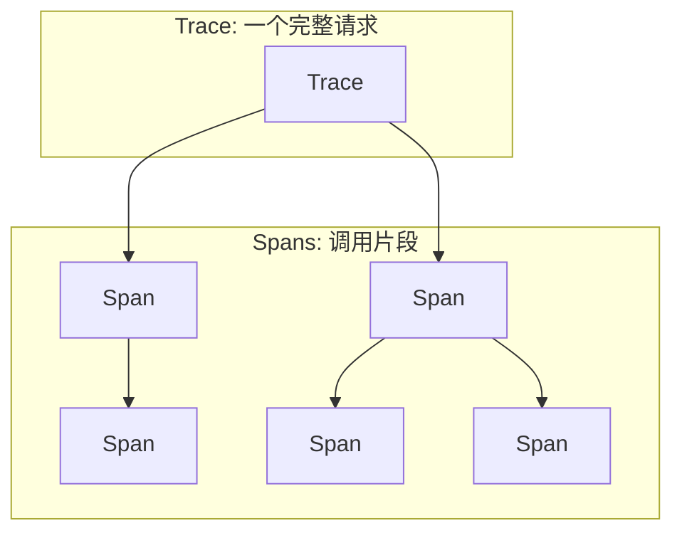

在复杂的微服务架构中，服务间的调用关系错综复杂，传统的监控手段难以提供端到端的请求视图。服务网格通过内置的分布式追踪能力，能够自动捕获服务间通信的详细信息，构建完整的调用链路图。同时，结合流量分析技术，可以深入了解服务间的交互模式和性能瓶颈。本章将深入探讨服务网格中的追踪与流量分析技术。

## 分布式追踪基础

### 追踪核心概念

分布式追踪涉及几个核心概念：



```yaml
# 追踪核心概念
tracing_concepts:
  trace:
    description: "追踪"
    definition: "一个分布式请求从开始到结束的完整调用链路"
    
  span:
    description: "跨度"
    definition: "一个工作单元，代表一个操作的执行过程"
    attributes:
      - trace_id: 追踪标识符
      - span_id: 跨度标识符
      - parent_span_id: 父跨度标识符
      - operation_name: 操作名称
      - start_time: 开始时间
      - end_time: 结束时间
      - tags: 标签信息
      - logs: 日志事件
      
  context_propagation:
    description: "上下文传播"
    definition: "在服务间传递追踪上下文信息的机制"
    mechanisms:
      - HTTP头传播
      - gRPC元数据传播
      - 消息队列上下文传播
```

### 追踪数据结构

一个典型的Span数据结构：

```json
{
  "traceId": "abc123def456ghi789jkl012",
  "spanId": "mno345pqr678",
  "parentSpanId": "stu901vwx234",
  "name": "POST /api/orders",
  "kind": "SERVER",
  "timestamp": 1630482600123456,
  "duration": 25000,
  "localEndpoint": {
    "serviceName": "order-service",
    "ipv4": "10.1.1.45"
  },
  "remoteEndpoint": {
    "serviceName": "user-service",
    "ipv4": "10.1.1.23"
  },
  "tags": {
    "http.method": "POST",
    "http.path": "/api/orders",
    "http.status_code": "201",
    "peer.service": "user-service",
    "istio.mesh_id": "mesh1",
    "istio.canonical_service": "order-service"
  },
  "annotations": [
    {
      "timestamp": 1630482600123456,
      "value": "sr"  // Server Receive
    },
    {
      "timestamp": 1630482600148456,
      "value": "ss"  // Server Send
    }
  ]
}
```

## Istio追踪配置

### 追踪后端集成

```yaml
# Istio追踪配置
apiVersion: install.istio.io/v1alpha1
kind: IstioOperator
spec:
  meshConfig:
    enableTracing: true
    defaultConfig:
      tracing:
        sampling: 100.0
        custom_tags:
          service:
            environment:
              name: SERVICE_NAME
          version:
            environment:
              name: SERVICE_VERSION
          cluster:
            environment:
              name: CLUSTER_NAME
        zipkin:
          address: zipkin.istio-system:9411
```

### 多追踪后端支持

```yaml
# 多追踪后端配置
apiVersion: install.istio.io/v1alpha1
kind: IstioOperator
spec:
  meshConfig:
    enableTracing: true
    defaultConfig:
      tracing:
        sampling: 50.0
        zipkin:
          address: zipkin.istio-system:9411
        stackdriver:
          debug: false
          max_number_of_attributes: 200
          max_number_of_annotations: 200
          max_number_of_message_events: 200
        datadog:
          address: datadog-agent.datadog:8126
```

### 自定义追踪标签

```yaml
# 自定义追踪标签
apiVersion: telemetry.istio.io/v1alpha1
kind: Telemetry
metadata:
  name: custom-tracing
  namespace: istio-system
spec:
  tracing:
  - providers:
    - name: "zipkin"
    randomSamplingPercentage: 100.0
    customTags:
      # 从环境变量获取
      service_version:
        environment:
          name: SERVICE_VERSION
          defaultValue: "unknown"
      
      # 从HTTP头获取
      user_id:
        header:
          name: "x-user-id"
      
      # 固定值
      mesh_id:
        literal:
          value: "production-mesh"
      
      # 从下游元数据获取
      client_ip:
        metadata:
          kind: CLIENT
          tag: "remote_address"
```

## 追踪数据丰富化

### 服务网格元数据注入

```yaml
# 服务网格元数据注入
apiVersion: telemetry.istio.io/v1alpha1
kind: Telemetry
metadata:
  name: enriched-tracing
  namespace: istio-system
spec:
  tracing:
  - providers:
    - name: "zipkin"
    randomSamplingPercentage: 100.0
    customTags:
      # Istio标准标签
      istio_canonical_service:
        environment:
          name: ISTIO_META_WORKLOAD_NAME
      istio_canonical_revision:
        environment:
          name: ISTIO_META_VERSION
      istio_mesh_id:
        environment:
          name: ISTIO_META_MESH_ID
          defaultValue: "default"
      
      # Kubernetes元数据
      k8s_namespace:
        environment:
          name: POD_NAMESPACE
      k8s_pod:
        environment:
          name: POD_NAME
      k8s_node:
        environment:
          name: NODE_NAME
```

### 业务上下文传播

```yaml
# 业务上下文传播配置
apiVersion: networking.istio.io/v1alpha3
kind: EnvoyFilter
metadata:
  name: baggage-propagation
  namespace: istio-system
spec:
  configPatches:
  - applyTo: HTTP_FILTER
    match:
      context: SIDECAR_OUTBOUND
      listener:
        filterChain:
          filter:
            name: "envoy.filters.network.http_connection_manager"
    patch:
      operation: INSERT_BEFORE
      value:
        name: envoy.filters.http.baggage
        typed_config:
          "@type": type.googleapis.com/envoy.extensions.filters.http.baggage.v3.Baggage
          baggage:
            - key: "user_id"
              value: "%REQ(x-user-id)%"
            - key: "session_id"
              value: "%REQ(x-session-id)%"
            - key: "business_unit"
              value: "%REQ(x-business-unit)%"
```

## 流量分析技术

### 流量模式识别

```yaml
# 流量模式分析配置
apiVersion: telemetry.istio.io/v1alpha1
kind: Telemetry
metadata:
  name: traffic-analysis
  namespace: istio-system
spec:
  metrics:
  - providers:
    - name: prometheus
    overrides:
    - match:
        metric: REQUEST_COUNT
      tagOverrides:
        traffic_pattern:
          operation: UPSERT
          value: |
            '%REQ(:method)% %REQ(:path)% from %REQ(user-agent)%'
```

### 异常流量检测

```promql
# 异常流量检测查询
# 突然增加的请求量
rate(istio_requests_total[5m]) > 2 * rate(istio_requests_total[1h])

# 异常错误率
rate(istio_requests_total{response_code=~"5.*"}[5m]) / rate(istio_requests_total[5m]) > 0.1

# 异常延迟
histogram_quantile(0.95, sum(rate(istio_request_duration_milliseconds_bucket[5m])) by (le)) > 1000
```

### 流量依赖分析

```promql
# 服务依赖关系分析
# 服务间调用关系
sum(rate(istio_requests_total{reporter="source"}[5m])) by (source_workload, destination_workload)

# 服务依赖深度
count(count by (source_workload, destination_workload) (istio_requests_total)) by (source_workload)

# 循环依赖检测
# 需要通过图算法实现
```

## 追踪可视化与分析

### Jaeger集成配置

```yaml
# Jaeger部署配置
apiVersion: apps/v1
kind: Deployment
metadata:
  name: jaeger
  namespace: istio-system
spec:
  selector:
    matchLabels:
      app: jaeger
  template:
    metadata:
      labels:
        app: jaeger
      annotations:
        prometheus.io/scrape: "true"
        prometheus.io/port: "16686"
    spec:
      containers:
      - name: jaeger
        image: jaegertracing/all-in-one:1.41
        ports:
        - containerPort: 16686
          name: query-http
        - containerPort: 14268
          name: collector-http
        - containerPort: 14250
          name: grpc
        env:
        - name: SPAN_STORAGE_TYPE
          value: badger
        - name: BADGER_EPHEMERAL
          value: "false"
        - name: BADGER_DIRECTORY_VALUE
          value: "/badger/data"
        - name: BADGER_DIRECTORY_KEY
          value: "/badger/key"
        - name: COLLECTOR_ZIPKIN_HOST_PORT
          value: ":9411"
        volumeMounts:
        - name: data
          mountPath: /badger
        livenessProbe:
          httpGet:
            path: "/"
            port: 14269
        readinessProbe:
          httpGet:
            path: "/"
            port: 14269
      volumes:
      - name: data
        emptyDir: {}
```

```yaml
# Jaeger服务配置
apiVersion: v1
kind: Service
metadata:
  name: jaeger
  namespace: istio-system
  labels:
    app: jaeger
spec:
  ports:
  - name: query-http
    port: 16686
    targetPort: 16686
  - name: collector-http
    port: 14268
    targetPort: 14268
  - name: grpc
    port: 14250
    targetPort: 14250
  - name: zipkin
    port: 9411
    targetPort: 9411
  selector:
    app: jaeger
```

### 追踪查询优化

```yaml
# 追踪查询优化配置
apiVersion: v1
kind: ConfigMap
metadata:
  name: jaeger-config
  namespace: istio-system
data:
  query.yaml: |
    query:
      max-clock-skew-adjustment: 30s
      max-span-count: 10000
      max-doc-count: 10000
    storage:
      badger:
        ephemeral: false
        directory-key: "/badger/key"
        directory-value: "/badger/data"
        span-store-write-cache-ttl: "30m"
        block-cache-size: "64MiB"
        mem-table-size: "32MiB"
        value-log-file-size: "128MiB"
```

## 性能瓶颈分析

### 延迟分析

```promql
# 延迟分析查询
# 服务延迟分布
histogram_quantile(0.5, sum(rate(istio_request_duration_milliseconds_bucket{reporter="destination"}[5m])) by (le, destination_workload))
histogram_quantile(0.95, sum(rate(istio_request_duration_milliseconds_bucket{reporter="destination"}[5m])) by (le, destination_workload))
histogram_quantile(0.99, sum(rate(istio_request_duration_milliseconds_bucket{reporter="destination"}[5m])) by (le, destination_workload))

# 跨服务延迟分析
sum(rate(istio_request_duration_milliseconds_sum{reporter="destination"}[5m])) by (source_workload, destination_workload) / 
sum(rate(istio_request_duration_milliseconds_count{reporter="destination"}[5m])) by (source_workload, destination_workload)
```

### 错误分析

```promql
# 错误分析查询
# 错误率分析
rate(istio_requests_total{response_code=~"5.*", reporter="destination"}[5m]) / 
rate(istio_requests_total{reporter="destination"}[5m])

# 错误类型分析
sum(rate(istio_requests_total{response_code=~"5.*", reporter="destination"}[5m])) by (response_code, destination_workload)

# 错误趋势分析
increase(istio_requests_total{response_code=~"5.*", reporter="destination"}[1h])
```

### 流量热点分析

```promql
# 流量热点分析
# 高流量服务识别
topk(10, sum(rate(istio_requests_total{reporter="destination"}[5m])) by (destination_workload))

# 流量异常检测
rate(istio_requests_total{reporter="destination"}[5m]) > 
2 * avg_over_time(rate(istio_requests_total{reporter="destination"}[5m])[1h:5m])

# 流量分布分析
sum(rate(istio_requests_total{reporter="destination"}[5m])) by (destination_workload) / 
sum(rate(istio_requests_total{reporter="destination"}[5m]))
```

## 故障根因分析

### 追踪根因定位

```yaml
# 追踪根因分析策略
root_cause_analysis:
  error_propagation:
    description: "错误传播分析"
    steps:
      - 从错误Span开始向上游追溯
      - 分析错误传播路径
      - 识别根本错误源
      
  performance_bottlenecks:
    description: "性能瓶颈识别"
    steps:
      - 识别高延迟Span
      - 分析并行调用优化空间
      - 识别资源竞争点
      
  dependency_analysis:
    description: "依赖关系分析"
    steps:
      - 构建服务依赖图
      - 识别关键路径
      - 分析单点故障风险
```

### 自动化分析工具

```python
# 自动化根因分析脚本
import requests
import json
from datetime import datetime, timedelta

class TraceAnalyzer:
    def __init__(self, jaeger_url):
        self.jaeger_url = jaeger_url
    
    def find_error_traces(self, service_name, lookback_hours=1):
        """查找包含错误的追踪"""
        end_time = datetime.now()
        start_time = end_time - timedelta(hours=lookback_hours)
        
        query_params = {
            "service": service_name,
            "start": int(start_time.timestamp() * 1000000),
            "end": int(end_time.timestamp() * 1000000),
            "tags": '{"error":"true"}'
        }
        
        response = requests.get(f"{self.jaeger_url}/api/traces", params=query_params)
        return response.json()
    
    def analyze_trace_latency(self, trace):
        """分析追踪延迟"""
        spans = trace.get('spans', [])
        total_duration = 0
        max_span_duration = 0
        bottleneck_span = None
        
        for span in spans:
            duration = span.get('duration', 0)
            total_duration += duration
            if duration > max_span_duration:
                max_span_duration = duration
                bottleneck_span = span
        
        return {
            'total_duration': total_duration,
            'max_span_duration': max_span_duration,
            'bottleneck_span': bottleneck_span,
            'bottleneck_percentage': (max_span_duration / total_duration) * 100 if total_duration > 0 else 0
        }
    
    def identify_root_cause(self, traces):
        """识别根本原因"""
        error_patterns = {}
        
        for trace in traces.get('data', []):
            # 分析每个追踪的错误模式
            for span in trace.get('spans', []):
                if span.get('tags'):
                    for tag in span['tags']:
                        if tag.get('key') == 'error' and tag.get('value') == 'true':
                            operation = span.get('operationName', 'unknown')
                            service = span.get('process', {}).get('serviceName', 'unknown')
                            error_key = f"{service}:{operation}"
                            
                            if error_key not in error_patterns:
                                error_patterns[error_key] = 0
                            error_patterns[error_key] += 1
        
        # 找出最常见的错误模式
        sorted_patterns = sorted(error_patterns.items(), key=lambda x: x[1], reverse=True)
        return sorted_patterns[:5]  # 返回前5个最常见的错误模式

# 使用示例
analyzer = TraceAnalyzer("http://jaeger-query:16686")
error_traces = analyzer.find_error_traces("order-service")
root_causes = analyzer.identify_root_cause(error_traces)
print("最常见的错误模式:", root_causes)
```

## 最佳实践总结

### 追踪配置最佳实践

```yaml
# 追踪配置最佳实践
tracing_best_practices:
  sampling_strategy:
    guidelines:
      - 根据业务重要性设置不同采样率
      - 关键服务使用100%采样
      - 普通服务使用10-50%采样
      - 根据存储容量调整采样率
      
  data_enrichment:
    guidelines:
      - 添加业务上下文信息
      - 注入服务网格元数据
      - 避免敏感信息泄露
      - 保持标签一致性
      
  performance_optimization:
    guidelines:
      - 优化追踪后端性能
      - 实施合理的数据保留策略
      - 使用高效的存储方案
      - 定期清理过期数据
```

### 流量分析最佳实践

```yaml
# 流量分析最佳实践
traffic_analysis_best_practices:
  monitoring_setup:
    guidelines:
      - 建立关键指标监控
      - 设置合理的告警阈值
      - 实施趋势分析
      - 建立基线对比
      
  anomaly_detection:
    guidelines:
      - 使用统计学方法检测异常
      - 结合机器学习算法
      - 实施实时检测机制
      - 建立误报过滤机制
      
  capacity_planning:
    guidelines:
      - 分析流量增长趋势
      - 预测资源需求
      - 识别性能瓶颈
      - 制定扩容策略
```

### 故障排查最佳实践

```yaml
# 故障排查最佳实践
troubleshooting_best_practices:
  investigation_process:
    guidelines:
      - 从用户影响开始调查
      - 使用追踪数据定位问题
      - 分析相关指标变化
      - 验证修复效果
      
  collaboration:
    guidelines:
      - 建立跨团队协作机制
      - 共享追踪和监控数据
      - 建立故障复盘流程
      - 持续改进系统可靠性
      
  tooling:
    guidelines:
      - 使用专业追踪工具
      - 集成监控告警系统
      - 建立自动化分析能力
      - 提供可视化分析界面
```

## 总结

服务网格中的追踪与流量分析为微服务架构提供了强大的可观测性能力。通过自动化的分布式追踪，可以构建完整的调用链路视图，快速定位性能瓶颈和故障根因。结合流量分析技术，可以深入了解服务间的交互模式，预测系统行为并优化性能。

关键要点包括：
1. **合理的追踪配置**：根据业务需求设置采样率和标签策略
2. **数据丰富化**：注入业务上下文和服务网格元数据
3. **流量模式分析**：识别异常流量和性能热点
4. **根因定位**：使用追踪数据快速定位问题根源
5. **性能优化**：实施追踪后端性能优化和数据管理策略

通过遵循最佳实践，合理配置追踪系统，建立完善的分析和告警机制，可以确保服务网格追踪系统的有效运行，为微服务架构提供可靠的可观察性保障。

在下一章中，我们将探讨微服务日志与监控的自动化管理实践。