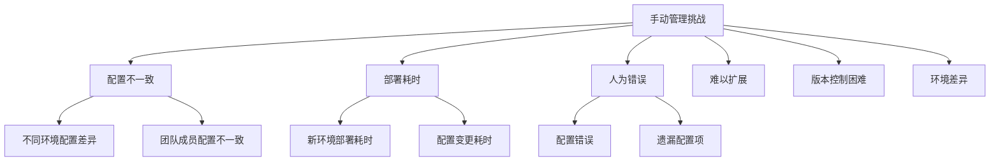
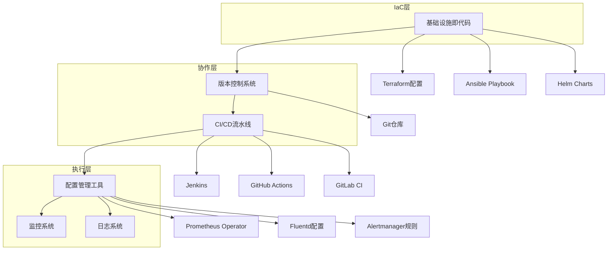

随着微服务架构的复杂性不断增加，手动配置和管理日志与监控系统变得越来越困难且容易出错。自动化日志与监控管理通过基础设施即代码（IaC）、配置管理工具和自动化流程，能够确保监控系统的可重复性、一致性和可扩展性。本章将深入探讨如何实现日志与监控的自动化管理，构建智能化的运维体系。

## 自动化管理的必要性

### 手动管理的挑战

传统的手动日志与监控管理面临诸多挑战：



### 自动化管理的价值

```yaml
# 自动化管理核心价值
automation_values:
  consistency:
    description: "一致性保障"
    benefits:
      - 统一的配置标准
      - 跨环境配置一致性
      - 减少人为配置错误
    
  efficiency:
    description: "效率提升"
    benefits:
      - 快速环境部署
      - 自动化配置变更
      - 减少重复性工作
    
  scalability:
    description: "可扩展性"
    benefits:
      - 支持大规模部署
      - 动态资源配置
      - 弹性扩缩容支持
    
  reliability:
    description: "可靠性增强"
    benefits:
      - 配置版本控制
      - 变更回滚能力
      - 灾难恢复支持
```

## 自动化架构设计

### 基于IaC的架构



### 配置管理策略

```yaml
# 配置管理策略
configuration_strategy:
  infrastructure_as_code:
    description: "基础设施即代码"
    tools:
      - Terraform: 基础设施配置
      - Helm: Kubernetes应用配置
      - Ansible: 服务器配置管理
    principles:
      - 声明式配置
      - 版本控制
      - 可重复部署
      
  configuration_as_code:
    description: "配置即代码"
    tools:
      - Git: 配置版本管理
      - Jsonnet: 配置模板
      - Kustomize: 配置定制
    principles:
      - 参数化配置
      - 环境差异化
      - 安全敏感信息管理
      
  continuous_delivery:
    description: "持续交付"
    tools:
      - Jenkins: CI/CD流水线
      - ArgoCD: GitOps部署
      - Spinnaker: 多云部署
    principles:
      - 自动化测试
      - 蓝绿部署
      - 金丝雀发布
```

## 核心组件自动化

### 监控系统自动化

```hcl
# Terraform监控系统配置示例
resource "kubernetes_namespace" "monitoring" {
  metadata {
    name = "monitoring"
  }
}

resource "helm_release" "prometheus_operator" {
  name       = "prometheus-operator"
  repository = "https://prometheus-community.github.io/helm-charts"
  chart      = "kube-prometheus-stack"
  version    = "45.1.1"
  namespace  = kubernetes_namespace.monitoring.metadata[0].name

  values = [
    templatefile("${path.module}/values/prometheus-values.yaml", {
      retention_time = var.prometheus_retention_time
      storage_size   = var.prometheus_storage_size
    })
  ]

  set {
    name  = "prometheus.prometheusSpec.serviceMonitorSelectorNilUsesHelmValues"
    value = "false"
  }

  set {
    name  = "prometheus.prometheusSpec.ruleSelectorNilUsesHelmValues"
    value = "false"
  }
}

resource "helm_release" "grafana" {
  name       = "grafana"
  repository = "https://grafana.github.io/helm-charts"
  chart      = "grafana"
  version    = "6.50.7"
  namespace  = kubernetes_namespace.monitoring.metadata[0].name

  values = [
    templatefile("${path.module}/values/grafana-values.yaml", {
      admin_password = var.grafana_admin_password
      datasources    = var.grafana_datasources
    })
  ]
}
```

### 日志系统自动化

```hcl
# Terraform日志系统配置示例
resource "helm_release" "elasticsearch" {
  name       = "elasticsearch"
  repository = "https://helm.elastic.co"
  chart      = "elasticsearch"
  version    = "7.17.3"
  namespace  = kubernetes_namespace.monitoring.metadata[0].name

  values = [
    templatefile("${path.module}/values/elasticsearch-values.yaml", {
      replica_count = var.elasticsearch_replica_count
      heap_size     = var.elasticsearch_heap_size
    })
  ]
}

resource "helm_release" "fluentd" {
  name       = "fluentd"
  repository = "https://fluent.github.io/helm-charts"
  chart      = "fluentd"
  version    = "0.3.2"
  namespace  = kubernetes_namespace.monitoring.metadata[0].name

  values = [
    templatefile("${path.module}/values/fluentd-values.yaml", {
      elasticsearch_host = helm_release.elasticsearch.name
      log_level          = var.fluentd_log_level
    })
  ]
}

resource "helm_release" "kibana" {
  name       = "kibana"
  repository = "https://helm.elastic.co"
  chart      = "kibana"
  version    = "7.17.3"
  namespace  = kubernetes_namespace.monitoring.metadata[0].name

  values = [
    templatefile("${path.module}/values/kibana-values.yaml", {
      elasticsearch_host = helm_release.elasticsearch.name
    })
  ]
}
```

## 自动化部署流程

### CI/CD流水线设计

```yaml
# GitHub Actions流水线示例
name: Deploy Monitoring Stack
on:
  push:
    branches:
      - main
    paths:
      - 'monitoring/**'
      - '.github/workflows/monitoring-deploy.yml'

jobs:
  validate:
    runs-on: ubuntu-latest
    steps:
    - name: Checkout code
      uses: actions/checkout@v3

    - name: Setup Terraform
      uses: hashicorp/setup-terraform@v2

    - name: Terraform Format
      run: terraform fmt -check

    - name: Terraform Init
      run: terraform init

    - name: Terraform Validate
      run: terraform validate

  plan:
    needs: validate
    runs-on: ubuntu-latest
    steps:
    - name: Checkout code
      uses: actions/checkout@v3

    - name: Setup Terraform
      uses: hashicorp/setup-terraform@v2

    - name: Terraform Init
      run: terraform init

    - name: Terraform Plan
      run: terraform plan -var-file=vars/${{ github.ref_name }}.tfvars

  deploy:
    needs: plan
    if: github.ref == 'refs/heads/main'
    runs-on: ubuntu-latest
    steps:
    - name: Checkout code
      uses: actions/checkout@v3

    - name: Setup Terraform
      uses: hashicorp/setup-terraform@v2

    - name: Terraform Init
      run: terraform init

    - name: Terraform Apply
      run: terraform apply -auto-approve -var-file=vars/prod.tfvars
      env:
        ARM_CLIENT_ID: ${{ secrets.ARM_CLIENT_ID }}
        ARM_CLIENT_SECRET: ${{ secrets.ARM_CLIENT_SECRET }}
        ARM_SUBSCRIPTION_ID: ${{ secrets.ARM_SUBSCRIPTION_ID }}
        ARM_TENANT_ID: ${{ secrets.ARM_TENANT_ID }}
```

### 配置验证机制

```python
# 配置验证脚本
import yaml
import json
import subprocess
import sys

class ConfigValidator:
    def __init__(self, config_path):
        self.config_path = config_path
        self.errors = []
    
    def validate_yaml_syntax(self):
        """验证YAML语法"""
        try:
            with open(self.config_path, 'r') as file:
                yaml.safe_load(file)
            return True
        except yaml.YAMLError as e:
            self.errors.append(f"YAML语法错误: {str(e)}")
            return False
    
    def validate_required_fields(self):
        """验证必需字段"""
        required_fields = ['apiVersion', 'kind', 'metadata', 'spec']
        
        try:
            with open(self.config_path, 'r') as file:
                config = yaml.safe_load(file)
            
            missing_fields = [field for field in required_fields if field not in config]
            if missing_fields:
                self.errors.append(f"缺少必需字段: {missing_fields}")
                return False
            
            return True
        except Exception as e:
            self.errors.append(f"验证必需字段时出错: {str(e)}")
            return False
    
    def validate_kubernetes_resources(self):
        """验证Kubernetes资源配置"""
        try:
            result = subprocess.run(
                ['kubectl', 'apply', '--dry-run=client', '-f', self.config_path],
                capture_output=True,
                text=True
            )
            
            if result.returncode != 0:
                self.errors.append(f"Kubernetes资源配置验证失败: {result.stderr}")
                return False
            
            return True
        except Exception as e:
            self.errors.append(f"执行kubectl验证时出错: {str(e)}")
            return False
    
    def run_validation(self):
        """运行所有验证"""
        validations = [
            self.validate_yaml_syntax,
            self.validate_required_fields,
            self.validate_kubernetes_resources
        ]
        
        results = []
        for validation in validations:
            results.append(validation())
        
        return all(results), self.errors

# 使用示例
if __name__ == "__main__":
    if len(sys.argv) != 2:
        print("使用方法: python validate_config.py <config_file>")
        sys.exit(1)
    
    validator = ConfigValidator(sys.argv[1])
    is_valid, errors = validator.run_validation()
    
    if is_valid:
        print("配置验证通过")
        sys.exit(0)
    else:
        print("配置验证失败:")
        for error in errors:
            print(f"  - {error}")
        sys.exit(1)
```

## 环境管理策略

### 多环境配置管理

```hcl
# Terraform环境变量文件
# dev.tfvars
environment = "dev"
prometheus_retention_time = "2d"
prometheus_storage_size = "50Gi"
elasticsearch_replica_count = 1
elasticsearch_heap_size = "1g"

# staging.tfvars
environment = "staging"
prometheus_retention_time = "7d"
prometheus_storage_size = "200Gi"
elasticsearch_replica_count = 3
elasticsearch_heap_size = "2g"

# prod.tfvars
environment = "prod"
prometheus_retention_time = "30d"
prometheus_storage_size = "1000Gi"
elasticsearch_replica_count = 5
elasticsearch_heap_size = "4g"
```

### 环境差异化配置

```yaml
# Helm values模板示例
# prometheus-values.yaml
prometheus:
  prometheusSpec:
    retention: {{ .retention_time }}
    storageSpec:
      volumeClaimTemplate:
        spec:
          resources:
            requests:
              storage: {{ .storage_size }}
    
    # 环境特定配置
    {{- if eq .environment "dev" }}
    resources:
      requests:
        memory: 512Mi
        cpu: 200m
      limits:
        memory: 1Gi
        cpu: 500m
    {{- else if eq .environment "staging" }}
    resources:
      requests:
        memory: 1Gi
        cpu: 500m
      limits:
        memory: 2Gi
        cpu: 1000m
    {{- else }}
    resources:
      requests:
        memory: 2Gi
        cpu: 1000m
      limits:
        memory: 4Gi
        cpu: 2000m
    {{- end }}
```

## 本章内容概览

在本章中，我们将通过以下小节深入探讨自动化日志与监控管理：

1. **日志与监控的自动化配置与管理**：详细介绍如何实现日志与监控系统的自动化配置管理
2. **使用Terraform部署日志与监控系统**：深入探讨使用Terraform进行基础设施即代码的实践方法
3. **自动化的监控报警与事件响应**：探讨如何实现监控告警和事件响应的自动化流程
4. **日志与监控的基础设施即代码（IaC）**：深入分析基础设施即代码在日志与监控领域的应用
5. **微服务监控的生命周期管理**：探讨微服务监控系统的全生命周期管理策略

## 总结

自动化日志与监控管理是现代微服务架构运维的重要组成部分。通过基础设施即代码、配置管理工具和自动化流程，可以显著提升运维效率、保障配置一致性、增强系统可靠性。

关键要点包括：
1. **合理的架构设计**：建立清晰的自动化管理架构
2. **工具选择**：选择合适的IaC和配置管理工具
3. **流程优化**：建立完善的CI/CD流水线
4. **环境管理**：实施多环境配置管理策略
5. **验证机制**：建立配置验证和测试机制

通过遵循最佳实践，合理选择工具和技术，建立完善的自动化管理流程，可以确保日志与监控系统的高效、可靠运行，为微服务架构提供强有力的运维保障。

在下一节中，我们将详细探讨日志与监控的自动化配置与管理实践。