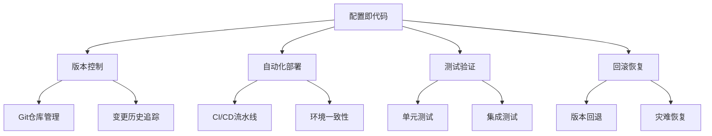

在现代微服务架构中，日志与监控系统的配置管理变得日益复杂。随着服务数量的增加和环境的多样化，手动配置不仅效率低下，而且容易出错。通过实施自动化配置与管理策略，采用配置即代码（Configuration as Code）的理念，可以显著提升配置的一致性、可维护性和可追溯性。本章将深入探讨如何实现日志与监控系统的自动化配置与管理。

## 配置管理核心理念

### 配置即代码（Configuration as Code）

配置即代码是一种将系统配置视为代码的管理理念：



### 配置管理原则

```yaml
# 配置管理核心原则
configuration_principles:
  declarative_approach:
    description: "声明式配置"
    guidelines:
      - 描述期望的状态而非操作步骤
      - 使用标准化的配置格式
      - 实现配置的幂等性
      
  version_control:
    description: "版本控制"
    guidelines:
      - 所有配置纳入版本控制
      - 建立清晰的提交信息规范
      - 实施分支管理策略
      
  parameterization:
    description: "参数化配置"
    guidelines:
      - 分离配置与环境变量
      - 使用模板引擎生成配置
      - 实现配置的可重用性
      
  security:
    description: "安全保护"
    guidelines:
      - 敏感信息加密存储
      - 实施访问控制策略
      - 定期轮换凭证信息
```

## 日志系统自动化配置

### 结构化日志配置

```yaml
# Fluentd配置即代码示例
apiVersion: v1
kind: ConfigMap
metadata:
  name: fluentd-config
  namespace: logging
data:
  fluent.conf: |
    # 系统日志输入
    <source>
      @type systemd
      tag systemd
      path /var/log/journal
      matches [{ "_SYSTEMD_UNIT": "docker.service" }]
      read_from_head true
      <storage>
        @type local
        persistent true
      </storage>
      <parse>
        @type json
        time_format %Y-%m-%dT%H:%M:%S.%NZ
      </parse>
    </source>
    
    # 应用日志输入
    <source>
      @type tail
      path /var/log/containers/*.log
      pos_file /var/log/fluentd-containers.log.pos
      tag kubernetes.*
      read_from_head true
      <parse>
        @type json
        time_format %Y-%m-%dT%H:%M:%S.%NZ
      </parse>
    </source>
    
    # 过滤器：添加Kubernetes元数据
    <filter kubernetes.**>
      @type kubernetes_metadata
      @id filter_kube_metadata
      kubernetes_url "#{ENV['KUBERNETES_URL']}"
      bearer_token_file "#{ENV['KUBERNETES_BEARER_TOKEN_FILE']}"
      ca_file "#{ENV['KUBERNETES_CA_FILE']}"
      watch false
    </filter>
    
    # 输出到Elasticsearch
    <match **>
      @type elasticsearch
      @id out_es
      host "#{ENV['ELASTICSEARCH_HOST']}"
      port "#{ENV['ELASTICSEARCH_PORT']}"
      logstash_format true
      logstash_prefix "#{ENV['LOGSTASH_PREFIX'] || 'logstash'}"
      include_tag_key true
      tag_key @log_name
      flush_interval 10s
      <buffer>
        @type file
        path /var/log/fluentd-buffers/kubernetes.system.buffer
        flush_mode interval
        retry_type exponential_backoff
        flush_thread_count 2
        flush_interval 5s
        retry_forever
        retry_max_interval 30
        chunk_limit_size 2M
        queue_limit_length 8
        overflow_action block
      </buffer>
    </match>
```

### 日志格式标准化

```yaml
# 结构化日志格式配置
apiVersion: v1
kind: ConfigMap
metadata:
  name: log-format-config
  namespace: logging
data:
  log-format.json: |
    {
      "timestamp": "%{TIMESTAMP_ISO8601:timestamp}",
      "level": "%{LOGLEVEL:level}",
      "service": "%{DATA:service}",
      "trace_id": "%{DATA:trace_id}",
      "span_id": "%{DATA:span_id}",
      "message": "%{GREEDYDATA:message}",
      "fields": {
        "user_id": "%{DATA:user_id}",
        "request_id": "%{DATA:request_id}",
        "duration_ms": "%{NUMBER:duration_ms:int}"
      }
    }
```

## 监控系统自动化配置

### Prometheus配置管理

```yaml
# Prometheus配置即代码示例
apiVersion: v1
kind: ConfigMap
metadata:
  name: prometheus-config
  namespace: monitoring
data:
  prometheus.yml: |
    global:
      scrape_interval: 15s
      evaluation_interval: 15s
      external_labels:
        cluster: "#{ENV['CLUSTER_NAME']}"
        environment: "#{ENV['ENVIRONMENT']}"
    
    rule_files:
      - "/etc/prometheus/rules/*.rules"
    
    scrape_configs:
    # Kubernetes服务发现
    - job_name: 'kubernetes-apiservers'
      kubernetes_sd_configs:
      - role: endpoints
      scheme: https
      tls_config:
        ca_file: /var/run/secrets/kubernetes.io/serviceaccount/ca.crt
      bearer_token_file: /var/run/secrets/kubernetes.io/serviceaccount/token
      relabel_configs:
      - source_labels: [__meta_kubernetes_namespace, __meta_kubernetes_service_name, __meta_kubernetes_endpoint_port_name]
        action: keep
        regex: default;kubernetes;https
    
    # 应用指标抓取
    - job_name: 'kubernetes-pods'
      kubernetes_sd_configs:
      - role: pod
      relabel_configs:
      - source_labels: [__meta_kubernetes_pod_annotation_prometheus_io_scrape]
        action: keep
        regex: true
      - source_labels: [__meta_kubernetes_pod_annotation_prometheus_io_path]
        action: replace
        target_label: __metrics_path__
        regex: (.+)
      - source_labels: [__address__, __meta_kubernetes_pod_annotation_prometheus_io_port]
        action: replace
        regex: ([^:]+)(?::\d+)?;(\d+)
        replacement: $1:$2
        target_label: __address__
      - action: labelmap
        regex: __meta_kubernetes_pod_label_(.+)
      - source_labels: [__meta_kubernetes_namespace]
        action: replace
        target_label: kubernetes_namespace
      - source_labels: [__meta_kubernetes_pod_name]
        action: replace
        target_label: kubernetes_pod_name

  # 告警规则配置
  alert-rules.yml: |
    groups:
    - name: kubernetes-alerts
      rules:
      - alert: KubernetesNodeNotReady
        expr: kube_node_status_condition{condition="Ready",status="true"} == 0
        for: 10m
        labels:
          severity: critical
        annotations:
          summary: "Kubernetes节点未就绪 (instance {{ $labels.instance }})"
          description: "节点 {{ $labels.node }} 已经超过10分钟未就绪"
      
      - alert: KubernetesPodCrashLooping
        expr: rate(kube_pod_container_status_restarts_total[5m]) * 60 * 5 > 0
        for: 5m
        labels:
          severity: warning
        annotations:
          summary: "Kubernetes Pod崩溃循环 (pod {{ $labels.pod }})"
          description: "Pod {{ $labels.pod }} 在5分钟内重启次数过多"
```

### Grafana仪表板配置

```json
{
  "dashboard": {
    "id": null,
    "title": "自动化监控仪表板",
    "tags": ["auto-generated", "monitoring"],
    "timezone": "browser",
    "schemaVersion": 16,
    "version": 0,
    "refresh": "30s",
    "templating": {
      "list": [
        {
          "name": "datasource",
          "type": "datasource",
          "pluginId": "prometheus"
        },
        {
          "name": "namespace",
          "type": "query",
          "datasource": "${datasource}",
          "refresh": 1,
          "query": "label_values(kube_pod_info, namespace)"
        }
      ]
    },
    "panels": [
      {
        "id": 1,
        "title": "Pod状态概览",
        "type": "stat",
        "gridPos": {
          "x": 0,
          "y": 0,
          "w": 6,
          "h": 6
        },
        "targets": [
          {
            "expr": "sum(kube_pod_status_ready{condition=\"true\", namespace=\"$namespace\"})",
            "legendFormat": "就绪Pod数"
          }
        ]
      },
      {
        "id": 2,
        "title": "CPU使用率",
        "type": "graph",
        "gridPos": {
          "x": 6,
          "y": 0,
          "w": 18,
          "h": 6
        },
        "targets": [
          {
            "expr": "sum(rate(container_cpu_usage_seconds_total{namespace=\"$namespace\"}[5m])) by (pod)",
            "legendFormat": "{{pod}}"
          }
        ]
      }
    ]
  }
}
```

## 配置版本控制

### GitOps工作流

```yaml
# ArgoCD应用配置示例
apiVersion: argoproj.io/v1alpha1
kind: Application
metadata:
  name: logging-stack
  namespace: argocd
spec:
  project: default
  source:
    repoURL: 'https://github.com/company/monitoring-config.git'
    targetRevision: HEAD
    path: logging/fluentd
    helm:
      valueFiles:
        - values-#{ENV['ENVIRONMENT']}.yaml
  destination:
    server: 'https://kubernetes.default.svc'
    namespace: logging
  syncPolicy:
    automated:
      prune: true
      selfHeal: true
    syncOptions:
      - CreateNamespace=true
```

### 配置变更管理

```bash
#!/bin/bash
# 配置变更管理脚本

# 验证配置变更
validate_config() {
    local config_file=$1
    echo "验证配置文件: $config_file"
    
    # 语法验证
    if ! kubectl apply --dry-run=client -f "$config_file"; then
        echo "配置语法验证失败"
        return 1
    fi
    
    # 业务逻辑验证
    # 这里可以添加特定的业务验证逻辑
    echo "配置验证通过"
    return 0
}

# 应用配置变更
apply_config() {
    local config_file=$1
    local environment=$2
    
    echo "应用配置到环境: $environment"
    
    # 应用配置
    if kubectl apply -f "$config_file"; then
        echo "配置应用成功"
        return 0
    else
        echo "配置应用失败"
        return 1
    fi
}

# 回滚配置
rollback_config() {
    local config_file=$1
    local revision=$2
    
    echo "回滚配置到版本: $revision"
    
    # 实施回滚逻辑
    git checkout "$revision" -- "$config_file"
    kubectl apply -f "$config_file"
    
    echo "配置回滚完成"
}

# 主函数
main() {
    local action=$1
    local config_file=$2
    local environment=$3
    local revision=$4
    
    case $action in
        "validate")
            validate_config "$config_file"
            ;;
        "apply")
            validate_config "$config_file" && apply_config "$config_file" "$environment"
            ;;
        "rollback")
            rollback_config "$config_file" "$revision"
            ;;
        *)
            echo "用法: $0 {validate|apply|rollback} <config_file> [environment] [revision]"
            return 1
            ;;
    esac
}

# 执行主函数
main "$@"
```

## 环境差异化管理

### 多环境配置模板

```yaml
# Jsonnet配置模板示例
local environment = std.extVar("environment");
local cluster_name = std.extVar("cluster_name");

{
  prometheus: {
    global: {
      scrape_interval: "15s",
      evaluation_interval: "15s",
      external_labels: {
        cluster: cluster_name,
        environment: environment,
      },
    },
    
    // 根据环境调整配置
    scrape_configs: [
      {
        job_name: "kubernetes-apiservers",
        kubernetes_sd_configs: [
          {
            role: "endpoints",
          },
        ],
        scheme: "https",
        tls_config: {
          ca_file: "/var/run/secrets/kubernetes.io/serviceaccount/ca.crt",
        },
        bearer_token_file: "/var/run/secrets/kubernetes.io/serviceaccount/token",
      },
    ],
    
    // 环境特定配置
    retention_time: if environment == "dev" then "2d"
                  else if environment == "staging" then "7d"
                  else "30d",
    
    storage_size: if environment == "dev" then "50Gi"
                 else if environment == "staging" then "200Gi"
                 else "1000Gi",
  },
}
```

### Helm模板配置

```yaml
# Helm values模板
# values.yaml
prometheus:
  retention: 15d
  storage: 100Gi
  resources:
    requests:
      memory: 1Gi
      cpu: 500m
    limits:
      memory: 2Gi
      cpu: 1000m

# values-prod.yaml
prometheus:
  retention: 30d
  storage: 1000Gi
  resources:
    requests:
      memory: 4Gi
      cpu: 2000m
    limits:
      memory: 8Gi
      cpu: 4000m

# templates/prometheus-config.yaml
apiVersion: v1
kind: ConfigMap
metadata:
  name: prometheus-config
data:
  prometheus.yml: |
    global:
      scrape_interval: 15s
      evaluation_interval: 15s
      retention: {{ .Values.prometheus.retention }}
```

## 安全配置管理

### 敏感信息保护

```yaml
# Kubernetes Secret管理
apiVersion: v1
kind: Secret
metadata:
  name: monitoring-secrets
  namespace: monitoring
type: Opaque
data:
  # 敏感信息使用base64编码
  elasticsearch-password: {{ .Values.elasticsearch.password | b64enc }}
  prometheus-api-key: {{ .Values.prometheus.apiKey | b64enc }}
  slack-webhook-url: {{ .Values.alerting.slackWebhook | b64enc }}

---
# 使用外部密钥管理
apiVersion: external-secrets.io/v1beta1
kind: ExternalSecret
metadata:
  name: monitoring-external-secrets
spec:
  secretStoreRef:
    name: aws-secrets-manager
    kind: SecretStore
  target:
    name: monitoring-secrets
  data:
  - secretKey: elasticsearch-password
    remoteRef:
      key: monitoring/elasticsearch-password
  - secretKey: prometheus-api-key
    remoteRef:
      key: monitoring/prometheus-api-key
```

### 访问控制配置

```yaml
# RBAC配置
apiVersion: rbac.authorization.k8s.io/v1
kind: Role
metadata:
  namespace: monitoring
  name: monitoring-config-editor
rules:
- apiGroups: [""]
  resources: ["configmaps", "secrets"]
  verbs: ["get", "list", "watch", "create", "update", "patch", "delete"]
- apiGroups: ["apps"]
  resources: ["deployments", "statefulsets"]
  verbs: ["get", "list", "watch", "create", "update", "patch", "delete"]

---
apiVersion: rbac.authorization.k8s.io/v1
kind: RoleBinding
metadata:
  name: monitoring-config-editors
  namespace: monitoring
subjects:
- kind: User
  name: monitoring-team
  apiGroup: rbac.authorization.k8s.io
roleRef:
  kind: Role
  name: monitoring-config-editor
  apiGroup: rbac.authorization.k8s.io
```

## 配置测试与验证

### 单元测试

```python
# 配置单元测试示例
import unittest
import yaml
from kubernetes import client, config
from kubernetes.client.rest import ApiException

class TestMonitoringConfig(unittest.TestCase):
    def setUp(self):
        config.load_kube_config()
        self.api = client.CoreV1Api()
    
    def test_prometheus_config_exists(self):
        """测试Prometheus配置是否存在"""
        try:
            config_map = self.api.read_namespaced_config_map(
                name="prometheus-config",
                namespace="monitoring"
            )
            self.assertIsNotNone(config_map)
            self.assertIn("prometheus.yml", config_map.data)
        except ApiException as e:
            self.fail(f"无法读取Prometheus配置: {e}")
    
    def test_fluentd_config_valid(self):
        """测试Fluentd配置语法"""
        try:
            config_map = self.api.read_namespaced_config_map(
                name="fluentd-config",
                namespace="logging"
            )
            
            # 验证配置内容
            fluent_conf = config_map.data.get("fluent.conf", "")
            self.assertIn("<source>", fluent_conf)
            self.assertIn("<match>", fluent_conf)
            
        except ApiException as e:
            self.fail(f"无法读取Fluentd配置: {e}")
    
    def test_alert_rules_valid(self):
        """测试告警规则有效性"""
        try:
            config_map = self.api.read_namespaced_config_map(
                name="prometheus-config",
                namespace="monitoring"
            )
            
            alert_rules = config_map.data.get("alert-rules.yml", "")
            rules_data = yaml.safe_load(alert_rules)
            
            # 验证规则结构
            self.assertIn("groups", rules_data)
            self.assertGreater(len(rules_data["groups"]), 0)
            
        except (ApiException, yaml.YAMLError) as e:
            self.fail(f"告警规则验证失败: {e}")

if __name__ == '__main__':
    unittest.main()
```

### 集成测试

```bash
#!/bin/bash
# 集成测试脚本

# 测试Prometheus指标抓取
test_prometheus_scraping() {
    echo "测试Prometheus指标抓取..."
    
    # 检查Prometheus是否运行
    if ! kubectl get pods -n monitoring -l app=prometheus | grep Running; then
        echo "Prometheus Pod未运行"
        return 1
    fi
    
    # 检查指标抓取状态
    prometheus_pod=$(kubectl get pods -n monitoring -l app=prometheus -o jsonpath='{.items[0].metadata.name}')
    targets_status=$(kubectl exec -n monitoring "$prometheus_pod" -- wget -qO- http://localhost:9090/api/v1/targets | jq '.status')
    
    if [ "$targets_status" != "\"success\"" ]; then
        echo "Prometheus目标抓取失败"
        return 1
    fi
    
    echo "Prometheus指标抓取测试通过"
    return 0
}

# 测试日志收集
test_log_collection() {
    echo "测试日志收集..."
    
    # 检查Fluentd是否运行
    if ! kubectl get pods -n logging -l app=fluentd | grep Running; then
        echo "Fluentd Pod未运行"
        return 1
    fi
    
    # 检查日志是否被正确收集
    fluentd_pod=$(kubectl get pods -n logging -l app=fluentd -o jsonpath='{.items[0].metadata.name}')
    log_lines=$(kubectl exec -n logging "$fluentd_pod" -- tail -n 10 /var/log/containers/*.log | wc -l)
    
    if [ "$log_lines" -eq 0 ]; then
        echo "日志收集测试失败"
        return 1
    fi
    
    echo "日志收集测试通过"
    return 0
}

# 主测试函数
main() {
    echo "开始集成测试..."
    
    test_prometheus_scraping
    prometheus_result=$?
    
    test_log_collection
    log_result=$?
    
    if [ $prometheus_result -eq 0 ] && [ $log_result -eq 0 ]; then
        echo "所有集成测试通过"
        return 0
    else
        echo "集成测试失败"
        return 1
    fi
}

# 执行测试
main
```

## 最佳实践总结

### 配置管理最佳实践

```yaml
# 配置管理最佳实践
best_practices:
  configuration_management:
    guidelines:
      - "所有配置纳入版本控制"
      - "使用声明式配置方法"
      - "实施参数化配置模板"
      - "建立配置验证机制"
      
  security_management:
    guidelines:
      - "敏感信息加密存储"
      - "实施最小权限原则"
      - "定期轮换凭证信息"
      - "审计配置变更历史"
      
  change_management:
    guidelines:
      - "建立变更审批流程"
      - "实施蓝绿部署策略"
      - "提供回滚恢复机制"
      - "监控配置变更影响"
```

### 工具选择建议

```yaml
# 工具选择建议
tool_recommendations:
  configuration_management:
    tools:
      - "Git: 版本控制"
      - "Jsonnet: 配置模板"
      - "Helm: Kubernetes包管理"
      - "Kustomize: 配置定制"
      
  deployment_automation:
    tools:
      - "ArgoCD: GitOps部署"
      - "Flux: 持续交付"
      - "Spinnaker: 多云部署"
      - "Jenkins: CI/CD流水线"
      
  testing_validation:
    tools:
      - "Terratest: 基础设施测试"
      - "Kubeval: Kubernetes配置验证"
      - "Conftest: 策略测试"
      - "Promtool: Prometheus配置验证"
```

## 总结

通过实施自动化配置与管理策略，可以显著提升日志与监控系统的可维护性、一致性和可靠性。关键要点包括：

1. **采用配置即代码理念**：将配置视为代码进行管理
2. **实施版本控制**：所有配置纳入Git等版本控制系统
3. **参数化配置**：使用模板引擎实现环境差异化
4. **安全保护**：加密存储敏感信息，实施访问控制
5. **测试验证**：建立完善的配置测试和验证机制

通过遵循最佳实践，合理选择工具和技术，建立完善的自动化配置管理流程，可以确保日志与监控系统的高效、安全运行，为微服务架构提供强有力的运维保障。

在下一节中，我们将探讨如何使用Terraform部署日志与监控系统。