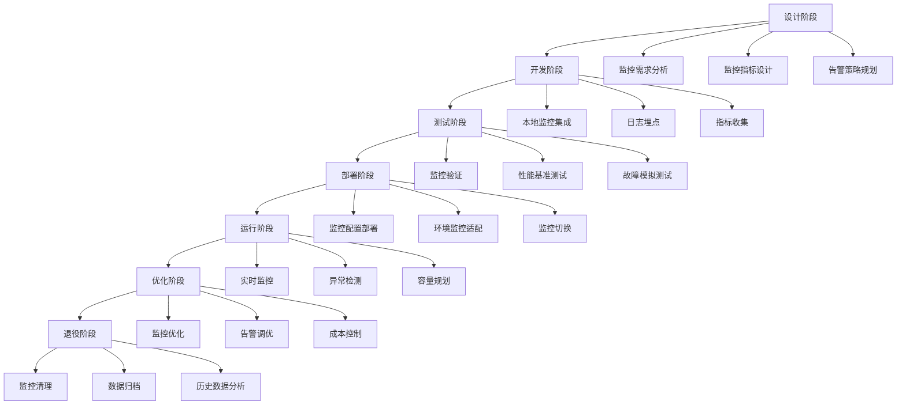

在微服务架构中，监控系统需要随着服务的整个生命周期进行管理，从服务的设计、开发、部署、运行到最终的退役。有效的监控生命周期管理能够确保在每个阶段都有适当的监控覆盖，及时发现和解决问题，保障系统的稳定性和可靠性。本章将深入探讨微服务监控的生命周期管理策略和实践方法。

## 监控生命周期概述

### 监控生命周期阶段

微服务监控的生命周期涵盖了服务从创建到退役的全过程，每个阶段都有不同的监控需求和重点：



### 生命周期管理价值

```yaml
# 生命周期管理价值
lifecycle_management_value:
  comprehensive_coverage:
    description: "全面覆盖"
    benefits:
      - 全周期监控无盲点
      - 风险提前识别
      - 问题快速定位
      - 质量持续改进
      
  proactive_monitoring:
    description: "主动监控"
    benefits:
      - 预防性维护
      - 性能优化指导
      - 容量规划支持
      - 成本控制优化
      
  continuous_improvement:
    description: "持续改进"
    benefits:
      - 监控体系演进
      - 告警策略优化
      - 运维效率提升
      - 服务质量保障
```

## 设计阶段的监控规划

### 监控需求分析

在服务设计阶段，需要明确监控需求，包括业务指标、技术指标和用户体验指标：

```yaml
# 监控需求分析框架
monitoring_requirements:
  business_metrics:
    description: "业务指标"
    metrics:
      - 订单处理量
      - 用户注册数
      - 支付成功率
      - 转化率
      - 收入指标
      
  technical_metrics:
    description: "技术指标"
    metrics:
      - 响应时间
      - 吞吐量
      - 错误率
      - CPU使用率
      - 内存使用率
      - 磁盘IO
      - 网络延迟
      
  user_experience:
    description: "用户体验指标"
    metrics:
      - 页面加载时间
      - 交互响应时间
      - 用户满意度
      - 功能可用性
      - 错误页面率
```

### 监控指标设计

```java
// 微服务监控指标设计示例
@RestController
public class OrderController {
    
    private final MeterRegistry meterRegistry;
    
    // 业务指标
    private final Counter orderCreatedCounter;
    private final Counter orderFailedCounter;
    private final Timer orderProcessingTimer;
    private final Gauge pendingOrdersGauge;
    
    // 技术指标
    private final Counter httpRequestCounter;
    private final Timer httpRequestTimer;
    private final DistributionSummary requestSizeSummary;
    
    public OrderController(MeterRegistry meterRegistry) {
        this.meterRegistry = meterRegistry;
        
        // 业务指标初始化
        this.orderCreatedCounter = Counter.builder("order.created")
                .description("订单创建数量")
                .tag("service", "order-service")
                .tag("version", "1.0")
                .register(meterRegistry);
                
        this.orderFailedCounter = Counter.builder("order.failed")
                .description("订单创建失败数量")
                .tag("service", "order-service")
                .tag("version", "1.0")
                .register(meterRegistry);
                
        this.orderProcessingTimer = Timer.builder("order.processing.time")
                .description("订单处理耗时")
                .tag("service", "order-service")
                .tag("version", "1.0")
                .register(meterRegistry);
                
        this.pendingOrdersGauge = Gauge.builder("order.pending")
                .description("待处理订单数量")
                .tag("service", "order-service")
                .tag("version", "1.0")
                .register(meterRegistry, this, OrderController::getPendingOrderCount);
                
        // 技术指标初始化
        this.httpRequestCounter = Counter.builder("http.requests")
                .description("HTTP请求数量")
                .tag("service", "order-service")
                .tag("version", "1.0")
                .register(meterRegistry);
                
        this.httpRequestTimer = Timer.builder("http.request.duration")
                .description("HTTP请求处理时间")
                .tag("service", "order-service")
                .tag("version", "1.0")
                .register(meterRegistry);
                
        this.requestSizeSummary = DistributionSummary.builder("http.request.size")
                .description("HTTP请求大小分布")
                .tag("service", "order-service")
                .tag("version", "1.0")
                .register(meterRegistry);
    }
    
    @PostMapping("/orders")
    public ResponseEntity<String> createOrder(@RequestBody OrderRequest request) {
        // 记录HTTP请求
        httpRequestCounter.increment();
        
        return Timer.Sample.start(meterRegistry)
                .stop(httpRequestTimer, () -> {
                    try {
                        // 记录请求大小
                        requestSizeSummary.record(request.toString().getBytes().length);
                        
                        // 业务处理逻辑
                        String orderId = processOrder(request);
                        
                        // 记录成功订单
                        orderCreatedCounter.increment();
                        
                        return ResponseEntity.ok("订单创建成功: " + orderId);
                    } catch (Exception e) {
                        // 记录失败订单
                        orderFailedCounter.increment();
                        return ResponseEntity.status(500).body("订单创建失败: " + e.getMessage());
                    }
                });
    }
    
    private String processOrder(OrderRequest request) {
        return Timer.Sample.start(meterRegistry)
                .stop(orderProcessingTimer, () -> {
                    // 模拟订单处理逻辑
                    try {
                        Thread.sleep(100); // 模拟处理时间
                        return "ORDER-" + System.currentTimeMillis();
                    } catch (InterruptedException e) {
                        throw new RuntimeException(e);
                    }
                });
    }
    
    private int getPendingOrderCount() {
        // 获取待处理订单数量的逻辑
        return 5; // 示例值
    }
}
```

### 告警策略规划

```yaml
# 告警策略规划模板
alerting_strategy:
  service_level_objectives:
    description: "服务等级目标(SLO)"
    slos:
      - metric: "订单处理成功率"
        target: "99.9%"
        threshold: "99.5%"
        window: "30d"
        
      - metric: "订单处理延迟"
        target: "95%请求<200ms"
        threshold: "90%请求<200ms"
        window: "7d"
        
      - metric: "API可用性"
        target: "99.95%"
        threshold: "99.9%"
        window: "30d"
  
  alerting_rules:
    description: "告警规则"
    rules:
      - name: "订单处理失败率过高"
        expression: "rate(order_failed_total[5m]) / rate(order_created_total[5m]) > 0.01"
        duration: "5m"
        severity: "P2"
        summary: "订单处理失败率超过1%"
        
      - name: "订单处理延迟过高"
        expression: "histogram_quantile(0.95, sum(rate(order_processing_time_seconds_bucket[5m])) by (le)) > 0.5"
        duration: "10m"
        severity: "P2"
        summary: "95%订单处理时间超过500ms"
        
      - name: "API错误率过高"
        expression: "rate(http_requests_total{status=~\"5..\"}[5m]) / rate(http_requests_total[5m]) > 0.05"
        duration: "5m"
        severity: "P1"
        summary: "API错误率超过5%"
```

## 开发与测试阶段的监控集成

### 本地开发监控

```yaml
# 本地开发环境监控配置
local_development_monitoring:
  docker_compose:
    description: "Docker Compose配置"
    config: |
      version: '3.8'
      services:
        order-service:
          build: .
          ports:
            - "8080:8080"
          environment:
            - LOG_LEVEL=DEBUG
            - METRICS_PORT=8081
            - JAEGER_AGENT_HOST=jaeger
          depends_on:
            - prometheus
            - jaeger
            
        prometheus:
          image: prom/prometheus:v2.37.0
          ports:
            - "9090:9090"
          volumes:
            - ./prometheus.yml:/etc/prometheus/prometheus.yml
          command:
            - '--config.file=/etc/prometheus/prometheus.yml'
            - '--storage.tsdb.path=/prometheus'
            
        jaeger:
          image: jaegertracing/all-in-one:1.35
          ports:
            - "16686:16686"
            - "14268:14268"
            
        grafana:
          image: grafana/grafana:9.1.0
          ports:
            - "3000:3000"
          environment:
            - GF_SECURITY_ADMIN_PASSWORD=admin
          depends_on:
            - prometheus
```

### 测试环境监控验证

```python
# 监控验证测试脚本
import requests
import time
import unittest

class MonitoringValidationTest(unittest.TestCase):
    def setUp(self):
        self.service_url = "http://localhost:8080"
        self.metrics_url = "http://localhost:8081/metrics"
        self.prometheus_url = "http://localhost:9090"
        
    def test_metrics_availability(self):
        """测试指标端点可用性"""
        response = requests.get(self.metrics_url)
        self.assertEqual(response.status_code, 200)
        self.assertIn("text/plain", response.headers.get("content-type", ""))
        
        # 验证关键指标存在
        metrics_content = response.text
        self.assertIn("order_created_total", metrics_content)
        self.assertIn("http_requests_total", metrics_content)
        self.assertIn("jvm_memory_used_bytes", metrics_content)
        
    def test_business_metrics_recording(self):
        """测试业务指标记录"""
        # 发送订单创建请求
        order_data = {
            "userId": "user123",
            "items": [{"productId": "prod1", "quantity": 2}]
        }
        
        # 获取初始指标值
        initial_metrics = self.get_metric_value("order_created_total")
        
        # 创建订单
        response = requests.post(f"{self.service_url}/orders", json=order_data)
        self.assertEqual(response.status_code, 200)
        
        # 等待指标更新
        time.sleep(2)
        
        # 验证指标增加
        final_metrics = self.get_metric_value("order_created_total")
        self.assertGreater(final_metrics, initial_metrics)
        
    def test_error_metrics_recording(self):
        """测试错误指标记录"""
        # 获取初始错误指标值
        initial_errors = self.get_metric_value("order_failed_total")
        
        # 发送错误请求
        response = requests.post(f"{self.service_url}/orders", json={})
        # 期望返回错误状态
        self.assertEqual(response.status_code, 400)
        
        # 等待指标更新
        time.sleep(2)
        
        # 验证错误指标增加
        final_errors = self.get_metric_value("order_failed_total")
        self.assertGreater(final_errors, initial_errors)
        
    def test_prometheus_scraping(self):
        """测试Prometheus抓取"""
        query = "order_created_total"
        response = requests.get(
            f"{self.prometheus_url}/api/v1/query",
            params={"query": query}
        )
        
        self.assertEqual(response.status_code, 200)
        data = response.json()
        self.assertEqual(data["status"], "success")
        
    def get_metric_value(self, metric_name):
        """获取指标值"""
        response = requests.get(self.metrics_url)
        if response.status_code == 200:
            for line in response.text.split('\n'):
                if line.startswith(metric_name):
                    # 解析指标值
                    parts = line.split()
                    if len(parts) >= 2:
                        return float(parts[1])
        return 0.0

if __name__ == '__main__':
    unittest.main()
```

## 部署与运行阶段的监控管理

### 环境适配配置

```yaml
# 多环境监控配置
multi_environment_config:
  kubernetes_configmap:
    description: "Kubernetes ConfigMap配置"
    config: |
      apiVersion: v1
      kind: ConfigMap
      metadata:
        name: monitoring-config
        namespace: {{ .Values.namespace }}
      data:
        application.yml: |
          management:
            endpoints:
              web:
                exposure:
                  include: health,info,metrics,prometheus
            endpoint:
              health:
                show-details: always
            metrics:
              export:
                prometheus:
                  enabled: true
              tags:
                application: ${spring.application.name}
                version: ${app.version:unknown}
                environment: ${spring.profiles.active:default}
                
          logging:
            level:
              root: {{ .Values.logLevel }}
              com.company: {{ .Values.appLogLevel }}
              
          app:
            monitoring:
              alerting:
                enabled: {{ .Values.alerting.enabled }}
                webhook-url: {{ .Values.alerting.webhookUrl }}
```

### 运行时监控策略

```yaml
# 运行时监控策略
runtime_monitoring_strategy:
  health_checks:
    description: "健康检查策略"
    strategies:
      - type: "liveness"
        endpoint: "/actuator/health/liveness"
        interval: "30s"
        timeout: "5s"
        failureThreshold: 3
        
      - type: "readiness"
        endpoint: "/actuator/health/readiness"
        interval: "10s"
        timeout: "3s"
        failureThreshold: 3
        
      - type: "startup"
        endpoint: "/actuator/health/startup"
        interval: "5s"
        timeout: "2s"
        failureThreshold: 10
  
  auto_scaling:
    description: "自动扩缩容策略"
    strategies:
      - metric: "cpu_utilization"
        threshold: 70
        scale_up_factor: 1.5
        scale_down_factor: 0.8
        cooldown: "300s"
        
      - metric: "memory_utilization"
        threshold: 80
        scale_up_factor: 2
        scale_down_factor: 0.5
        cooldown: "300s"
        
      - metric: "request_rate"
        threshold: 1000
        scale_up_factor: 1.2
        scale_down_factor: 0.9
        cooldown: "180s"
```

### 监控仪表板设计

```json
{
  "dashboard": {
    "title": "微服务监控仪表板",
    "panels": [
      {
        "title": "服务健康状态",
        "type": "stat",
        "targets": [
          {
            "expr": "up{job=~\".*-service\"}",
            "legendFormat": "{{job}}"
          }
        ],
        "thresholds": [
          { "value": 1, "color": "green" },
          { "value": 0.5, "color": "yellow" },
          { "value": 0, "color": "red" }
        ]
      },
      {
        "title": "请求速率",
        "type": "graph",
        "targets": [
          {
            "expr": "sum(rate(http_requests_total[5m])) by (job)",
            "legendFormat": "{{job}}"
          }
        ]
      },
      {
        "title": "错误率",
        "type": "graph",
        "targets": [
          {
            "expr": "rate(http_requests_total{status=~\"5..\"}[5m]) / rate(http_requests_total[5m])",
            "legendFormat": "{{job}}"
          }
        ]
      },
      {
        "title": "响应时间",
        "type": "graph",
        "targets": [
          {
            "expr": "histogram_quantile(0.95, sum(rate(http_request_duration_seconds_bucket[5m])) by (le, job))",
            "legendFormat": "{{job}} 95th percentile"
          }
        ]
      },
      {
        "title": "系统资源使用",
        "type": "graph",
        "targets": [
          {
            "expr": "rate(process_cpu_seconds_total[5m])",
            "legendFormat": "{{job}} CPU"
          },
          {
            "expr": "jvm_memory_used_bytes{area=\"heap\"} / jvm_memory_max_bytes{area=\"heap\"}",
            "legendFormat": "{{job}} Heap Memory"
          }
        ]
      }
    ]
  }
}
```

## 优化与退役阶段的监控处理

### 监控优化策略

```python
# 监控优化分析器
import pandas as pd
from datetime import datetime, timedelta
import numpy as np

class MonitoringOptimizer:
    def __init__(self, prometheus_client):
        self.prometheus_client = prometheus_client
    
    def analyze_alert_noise(self, days=30):
        """分析告警噪音"""
        # 查询告警触发和解决的时间序列
        query = 'alerts_fired_total'
        alert_data = self.prometheus_client.query_range(
            query, 
            start=datetime.now() - timedelta(days=days),
            end=datetime.now(),
            step='1h'
        )
        
        # 转换为DataFrame进行分析
        df = pd.DataFrame(alert_data)
        df['timestamp'] = pd.to_datetime(df['timestamp'])
        
        # 分析告警频率和持续时间
        alert_stats = df.groupby('alertname').agg({
            'value': ['count', 'mean', 'std']
        }).reset_index()
        
        # 识别高频但持续时间短的告警（可能是噪音）
        noisy_alerts = alert_stats[
            (alert_stats[('value', 'count')] > 100) & 
            (alert_stats[('value', 'mean')] < 60)
        ]
        
        return noisy_alerts
    
    def optimize_retention_policies(self):
        """优化数据保留策略"""
        # 分析不同指标的查询频率
        query_usage = self.analyze_query_usage()
        
        # 根据使用频率调整保留时间
        retention_policies = {}
        for metric, usage in query_usage.items():
            if usage > 1000:  # 高频查询
                retention_policies[metric] = "90d"  # 保留90天
            elif usage > 100:  # 中频查询
                retention_policies[metric] = "30d"  # 保留30天
            else:  # 低频查询
                retention_policies[metric] = "7d"   # 保留7天
        
        return retention_policies
    
    def analyze_query_usage(self):
        """分析查询使用情况"""
        # 这里应该查询Prometheus的查询日志或使用其他方式
        # 获取指标查询频率数据
        pass
    
    def recommend_downsampling(self):
        """推荐降采样策略"""
        # 分析高基数指标
        high_cardinality_metrics = self.identify_high_cardinality_metrics()
        
        # 为高基数指标推荐降采样策略
        downsampling_recommendations = {}
        for metric in high_cardinality_metrics:
            downsampling_recommendations[metric] = {
                "aggregation": "avg",
                "interval": "5m",
                "retention": "365d"
            }
        
        return downsampling_recommendations
    
    def identify_high_cardinality_metrics(self):
        """识别高基数指标"""
        # 查询指标标签的唯一值数量
        pass

# 使用示例
optimizer = MonitoringOptimizer(prometheus_client)
noisy_alerts = optimizer.analyze_alert_noise()
retention_policies = optimizer.optimize_retention_policies()
```

### 服务退役监控处理

```yaml
# 服务退役监控处理流程
service_retirement_monitoring:
  pre_retirement:
    description: "退役前处理"
    steps:
      - 流量切换监控
      - 依赖服务通知
      - 数据备份验证
      - 监控告警暂停
      
  retirement_process:
    description: "退役过程"
    steps:
      - 逐步减少流量
      - 监控关键指标
      - 验证依赖服务
      - 执行退役操作
      
  post_retirement:
    description: "退役后处理"
    steps:
      - 监控配置清理
      - 告警规则移除
      - 仪表板更新
      - 文档归档
```

## 监控生命周期管理工具

### 自动化管理脚本

```python
# 监控生命周期管理工具
import yaml
import json
import requests
from kubernetes import client, config

class MonitoringLifecycleManager:
    def __init__(self, kube_config=None):
        if kube_config:
            config.load_kube_config(kube_config)
        else:
            config.load_incluster_config()
            
        self.k8s_client = client.CoreV1Api()
        self.apps_client = client.AppsV1Api()
        self.custom_client = client.CustomObjectsApi()
        
    def setup_monitoring_for_service(self, service_name, namespace, config):
        """为服务设置监控"""
        try:
            # 创建ServiceMonitor
            service_monitor = {
                "apiVersion": "monitoring.coreos.com/v1",
                "kind": "ServiceMonitor",
                "metadata": {
                    "name": f"{service_name}-monitor",
                    "namespace": namespace
                },
                "spec": {
                    "selector": {
                        "matchLabels": {
                            "app": service_name
                        }
                    },
                    "endpoints": [
                        {
                            "port": "metrics",
                            "path": "/actuator/prometheus",
                            "interval": "30s"
                        }
                    ]
                }
            }
            
            # 应用ServiceMonitor配置
            self.custom_client.create_namespaced_custom_object(
                group="monitoring.coreos.com",
                version="v1",
                namespace=namespace,
                plural="servicemonitors",
                body=service_monitor
            )
            
            # 创建告警规则
            self.create_alert_rules(service_name, namespace, config.get('alerts', {}))
            
            # 创建仪表板配置
            self.create_dashboard_config(service_name, namespace, config.get('dashboard', {}))
            
            return {"status": "success", "message": f"监控为服务 {service_name} 设置完成"}
        except Exception as e:
            return {"status": "error", "message": f"设置监控失败: {str(e)}"}
    
    def create_alert_rules(self, service_name, namespace, alert_config):
        """创建告警规则"""
        alert_rules = {
            "apiVersion": "monitoring.coreos.com/v1",
            "kind": "PrometheusRule",
            "metadata": {
                "name": f"{service_name}-alerts",
                "namespace": namespace
            },
            "spec": {
                "groups": [
                    {
                        "name": f"{service_name}-rules",
                        "rules": alert_config.get('rules', [])
                    }
                ]
            }
        }
        
        self.custom_client.create_namespaced_custom_object(
            group="monitoring.coreos.com",
            version="v1",
            namespace=namespace,
            plural="prometheusrules",
            body=alert_rules
        )
    
    def create_dashboard_config(self, service_name, namespace, dashboard_config):
        """创建仪表板配置"""
        config_map = client.V1ConfigMap(
            metadata=client.V1ObjectMeta(
                name=f"{service_name}-dashboard",
                namespace=namespace
            ),
            data={
                "dashboard.json": json.dumps(dashboard_config)
            }
        )
        
        self.k8s_client.create_namespaced_config_map(
            namespace=namespace,
            body=config_map
        )
    
    def retire_service_monitoring(self, service_name, namespace):
        """退役服务监控"""
        try:
            # 删除ServiceMonitor
            self.custom_client.delete_namespaced_custom_object(
                group="monitoring.coreos.com",
                version="v1",
                namespace=namespace,
                plural="servicemonitors",
                name=f"{service_name}-monitor"
            )
            
            # 删除告警规则
            self.custom_client.delete_namespaced_custom_object(
                group="monitoring.coreos.com",
                version="v1",
                namespace=namespace,
                plural="prometheusrules",
                name=f"{service_name}-alerts"
            )
            
            # 删除仪表板配置
            self.k8s_client.delete_namespaced_config_map(
                name=f"{service_name}-dashboard",
                namespace=namespace
            )
            
            return {"status": "success", "message": f"服务 {service_name} 的监控已退役"}
        except Exception as e:
            return {"status": "error", "message": f"退役监控失败: {str(e)}"}
    
    def backup_monitoring_data(self, service_name, backup_config):
        """备份监控数据"""
        # 实现监控数据备份逻辑
        pass

# 使用示例
manager = MonitoringLifecycleManager()
config = {
    "alerts": {
        "rules": [
            {
                "alert": "ServiceDown",
                "expr": "up{job=\"user-service\"} == 0",
                "for": "2m",
                "labels": {
                    "severity": "P1"
                },
                "annotations": {
                    "summary": "用户服务不可用"
                }
            }
        ]
    },
    "dashboard": {
        "title": "用户服务监控",
        "panels": []
    }
}

result = manager.setup_monitoring_for_service("user-service", "production", config)
print(result)
```

## 最佳实践总结

### 1. 全周期覆盖

```yaml
# 全周期覆盖最佳实践
full_lifecycle_coverage:
  design_phase:
    practices:
      - "明确监控需求和指标"
      - "设计告警策略"
      - "规划监控架构"
      
  development_phase:
    practices:
      - "集成监控SDK"
      - "实现指标埋点"
      - "本地监控验证"
      
  deployment_phase:
    practices:
      - "环境适配配置"
      - "监控配置部署"
      - "上线前验证"
      
  operation_phase:
    practices:
      - "实时监控告警"
      - "性能分析优化"
      - "容量规划管理"
      
  retirement_phase:
    practices:
      - "监控配置清理"
      - "数据归档备份"
      - "经验总结沉淀"
```

### 2. 自动化管理

```yaml
# 自动化管理最佳实践
automation_best_practices:
  ci_cd_integration:
    practices:
      - "监控配置与应用代码同步"
      - "自动化测试验证"
      - "灰度发布监控"
      
  self_healing:
    practices:
      - "自动故障检测"
      - "自动恢复机制"
      - "智能告警抑制"
      
  continuous_optimization:
    practices:
      - "定期评估监控效果"
      - "动态调整告警阈值"
      - "优化资源配置"
```

## 总结

微服务监控的生命周期管理是一个全面、持续的过程，需要在服务的每个阶段都实施适当的监控策略。通过设计阶段的需求分析、开发阶段的集成验证、部署阶段的环境适配、运行阶段的实时监控以及退役阶段的清理归档，可以构建完整的监控体系。

关键要点包括：
1. **全周期覆盖**：确保监控在服务生命周期的每个阶段都有适当的覆盖
2. **自动化管理**：通过工具和脚本实现监控配置的自动化管理
3. **持续优化**：定期评估和优化监控策略，提升监控效果
4. **经验沉淀**：总结各阶段的经验教训，持续改进监控体系

通过有效的监控生命周期管理，可以显著提升微服务系统的可观测性，及时发现和解决问题，保障系统的稳定性和可靠性。

至此，我们完成了第15章关于自动化日志与监控管理的所有内容。在下一章中，我们将探讨基于云的日志与监控解决方案。