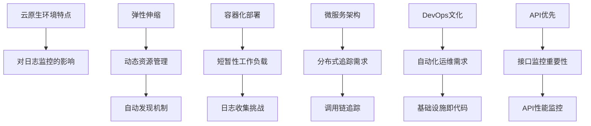
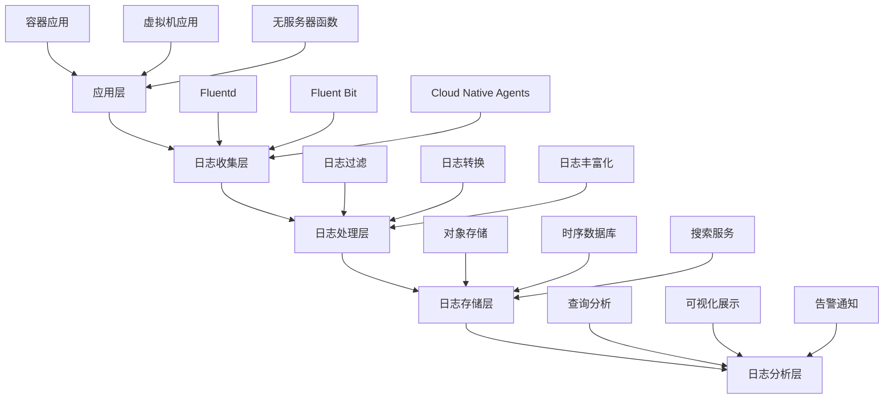

随着云计算技术的快速发展，越来越多的企业将应用迁移到云平台，享受云基础设施带来的弹性、可扩展性和成本效益。在云原生环境中，日志与监控面临着新的挑战和机遇。云平台提供了丰富的原生日志与监控服务，可以帮助我们更高效地构建可观察性体系。本章将深入探讨基于云的日志与监控解决方案，介绍主流云平台的服务特性与最佳实践。

## 云原生日志与监控概述

### 云原生环境的特点

云原生环境具有以下显著特点，这些特点对日志与监控提出了新的要求：



### 云日志监控的优势

```yaml
# 云日志监控优势
cloud_logging_monitoring_advantages:
  scalability:
    description: "可扩展性"
    benefits:
      - 自动扩容缩容
      - 无限存储容量
      - 全球部署支持
      - 按需付费模式
      
  integration:
    description: "集成性"
    benefits:
      - 与云服务深度集成
      - 统一管理界面
      - 自动化配置
      - 一站式解决方案
      
  reliability:
    description: "可靠性"
    benefits:
      - 高可用架构
      - 数据冗余备份
      - SLA保障
      - 灾难恢复能力
      
  advanced_features:
    description: "高级功能"
    benefits:
      - AI/ML分析能力
      - 实时处理
      - 多维度分析
      - 智能告警
```

## 主流云平台日志监控服务

### AWS日志监控服务

Amazon Web Services提供了完整的日志与监控服务生态系统：

```yaml
# AWS日志监控服务
aws_services:
  cloudwatch:
    description: "CloudWatch - 监控和可观察性服务"
    features:
      - 指标收集与可视化
      - 日志收集与分析
      - 告警与自动化
      - 应用程序洞察
      - Synthetics监控
      
  cloudwatch_logs:
    description: "CloudWatch Logs - 日志管理服务"
    features:
      - 日志收集与存储
      - 实时日志分析
      - 日志过滤与查询
      - 日志导出与归档
      - 与Lambda集成
      
  xray:
    description: "X-Ray - 分布式追踪服务"
    features:
      - 请求追踪
      - 性能分析
      - 错误分析
      - 服务地图
      - 与AWS服务集成
      
  appinsights:
    description: "Application Insights - 应用程序监控"
    features:
      - 自动发现问题
      - 智能告警
      - 根因分析
      - 与CloudWatch集成
```

### Azure日志监控服务

Microsoft Azure提供了Azure Monitor作为核心监控平台：

```yaml
# Azure日志监控服务
azure_services:
  azure_monitor:
    description: "Azure Monitor - 统一监控平台"
    components:
      - Metrics: 指标监控
      - Logs: 日志分析
      - Alerts: 告警管理
      - Application Insights: 应用程序监控
      - Container Insights: 容器监控
      
  log_analytics:
    description: "Log Analytics - 日志分析服务"
    features:
      - 日志收集与查询
      - 自定义仪表板
      - 高级分析
      - 数据导出
      - 与Security Center集成
      
  application_insights:
    description: "Application Insights - 应用程序洞察"
    features:
      - 请求监控
      - 依赖跟踪
      - 异常检测
      - 性能计数器
      - 实时遥测
```

### Google Cloud日志监控服务

Google Cloud Platform提供了Cloud Monitoring和Cloud Logging服务：

```yaml
# Google Cloud日志监控服务
gcp_services:
  cloud_monitoring:
    description: "Cloud Monitoring - 监控服务"
    features:
      - 指标收集与可视化
      - 告警策略
      - 仪表板
      - SLO管理
      - 与第三方集成
      
  cloud_logging:
    description: "Cloud Logging - 日志管理服务"
    features:
      - 日志收集与存储
      - 实时日志查询
      - 日志导出
      - 日志路由器
      - 与Security Command Center集成
      
  cloud_trace:
    description: "Cloud Trace - 分布式追踪服务"
    features:
      - 请求延迟分析
      - 性能瓶颈识别
      - 服务调用链
      - 与应用集成
      - 实时监控
```

## 云原生日志架构设计

### 日志收集架构

在云原生环境中，日志收集架构需要考虑容器化、微服务和动态伸缩等特点：



### 云原生监控架构

```yaml
# 云原生监控架构
cloud_native_monitoring_architecture:
  data_sources:
    description: "数据源"
    sources:
      - Infrastructure Metrics: 基础设施指标
      - Application Metrics: 应用指标
      - Business Metrics: 业务指标
      - Logs: 日志数据
      - Traces: 追踪数据
      
  collection_layer:
    description: "收集层"
    components:
      - Agents: 轻量级收集代理
      - Exporters: 数据导出器
      - Scrapers: 指标抓取器
      - Integrations: 服务集成
      
  processing_layer:
    description: "处理层"
    components:
      - Aggregation: 数据聚合
      - Transformation: 数据转换
      - Enrichment: 数据丰富化
      - Filtering: 数据过滤
      
  storage_layer:
    description: "存储层"
    components:
      - Time Series Database: 时序数据库
      - Log Storage: 日志存储
      - Trace Storage: 追踪存储
      - Object Storage: 对象存储
      
  analysis_layer:
    description: "分析层"
    components:
      - Query Engine: 查询引擎
      - Analytics: 分析引擎
      - ML Engine: 机器学习引擎
      - Visualization: 可视化引擎
```

## 云平台集成实践

### AWS集成示例

```python
# AWS CloudWatch集成示例
import boto3
import json
from datetime import datetime

class AWSCloudWatchIntegration:
    def __init__(self, region_name='us-west-2'):
        self.cloudwatch = boto3.client('cloudwatch', region_name=region_name)
        self.logs = boto3.client('logs', region_name=region_name)
        self.xray = boto3.client('xray', region_name=region_name)
        
    def create_metric_alarm(self, alarm_name, metric_name, namespace, 
                          threshold, comparison_operator='GreaterThanThreshold'):
        """创建CloudWatch告警"""
        try:
            response = self.cloudwatch.put_metric_alarm(
                AlarmName=alarm_name,
                AlarmDescription=f'Alarm for {metric_name}',
                MetricName=metric_name,
                Namespace=namespace,
                Statistic='Average',
                Period=300,
                EvaluationPeriods=2,
                Threshold=threshold,
                ComparisonOperator=comparison_operator,
                AlarmActions=[
                    f'arn:aws:sns:{self.cloudwatch.meta.region_name}:'
                    f'{boto3.client("sts").get_caller_identity()["Account"]}:'
                    f'alert-topic'
                ]
            )
            return {"status": "success", "alarm_arn": response.get('AlarmArn')}
        except Exception as e:
            return {"status": "error", "message": str(e)}
    
    def put_log_event(self, log_group, log_stream, message):
        """发送日志事件到CloudWatch Logs"""
        try:
            # 确保日志组和日志流存在
            self._ensure_log_group_and_stream(log_group, log_stream)
            
            response = self.logs.put_log_events(
                logGroupName=log_group,
                logStreamName=log_stream,
                logEvents=[
                    {
                        'timestamp': int(datetime.now().timestamp() * 1000),
                        'message': json.dumps(message) if isinstance(message, dict) else message
                    }
                ]
            )
            return {"status": "success", "next_sequence_token": response.get('nextSequenceToken')}
        except Exception as e:
            return {"status": "error", "message": str(e)}
    
    def record_trace_segment(self, trace_id, name, start_time, end_time, 
                           subsegments=None):
        """记录X-Ray追踪段"""
        try:
            segment = {
                'trace_id': trace_id,
                'id': self._generate_segment_id(),
                'name': name,
                'start_time': start_time,
                'end_time': end_time,
                'subsegments': subsegments or []
            }
            
            # 发送到X-Ray
            self.xray.put_trace_segments(
                TraceSegmentDocuments=[json.dumps(segment)]
            )
            return {"status": "success"}
        except Exception as e:
            return {"status": "error", "message": str(e)}
    
    def _ensure_log_group_and_stream(self, log_group, log_stream):
        """确保日志组和日志流存在"""
        try:
            # 创建日志组
            self.logs.create_log_group(logGroupName=log_group)
        except self.logs.exceptions.ResourceAlreadyExistsException:
            pass
        
        try:
            # 创建日志流
            self.logs.create_log_stream(
                logGroupName=log_group,
                logStreamName=log_stream
            )
        except self.logs.exceptions.ResourceAlreadyExistsException:
            pass
    
    def _generate_segment_id(self):
        """生成追踪段ID"""
        import uuid
        return uuid.uuid4().hex[:16]

# 使用示例
aws_monitoring = AWSCloudWatchIntegration()
alarm_result = aws_monitoring.create_metric_alarm(
    alarm_name='HighCPUUtilization',
    metric_name='CPUUtilization',
    namespace='AWS/EC2',
    threshold=80
)
print(alarm_result)
```

### Azure集成示例

```python
# Azure Monitor集成示例
from azure.monitor.query import MetricsQueryClient, LogsQueryClient
from azure.identity import DefaultAzureCredential
from azure.core.exceptions import HttpResponseError
import datetime

class AzureMonitorIntegration:
    def __init__(self, subscription_id):
        self.subscription_id = subscription_id
        self.credential = DefaultAzureCredential()
        self.metrics_client = MetricsQueryClient(self.credential)
        self.logs_client = LogsQueryClient(self.credential)
        
    def query_metrics(self, resource_uri, metric_names, timespan=None):
        """查询指标数据"""
        try:
            if not timespan:
                timespan = datetime.timedelta(hours=1)
                
            response = self.metrics_client.query_metrics(
                resource_uri=resource_uri,
                metric_names=metric_names,
                timespan=timespan,
                aggregation='Average'
            )
            
            metrics_data = []
            for metric in response.metrics:
                for time_series in metric.timeseries:
                    for data_point in time_series.data:
                        metrics_data.append({
                            'metric_name': metric.name,
                            'timestamp': data_point.time_stamp,
                            'value': data_point.average
                        })
            
            return {"status": "success", "data": metrics_data}
        except HttpResponseError as e:
            return {"status": "error", "message": str(e)}
    
    def query_logs(self, workspace_id, query, timespan=None):
        """查询日志数据"""
        try:
            if not timespan:
                timespan = datetime.timedelta(hours=1)
                
            response = self.logs_client.query_workspace(
                workspace_id=workspace_id,
                query=query,
                timespan=timespan
            )
            
            logs_data = []
            if response.tables:
                for table in response.tables:
                    for row in table.rows:
                        log_entry = {}
                        for i, column in enumerate(table.columns):
                            log_entry[column.name] = row[i]
                        logs_data.append(log_entry)
            
            return {"status": "success", "data": logs_data}
        except HttpResponseError as e:
            return {"status": "error", "message": str(e)}
    
    def create_alert_rule(self, resource_group, rule_name, 
                         scopes, conditions, actions):
        """创建告警规则"""
        from azure.mgmt.monitor import MonitorManagementClient
        
        monitor_client = MonitorManagementClient(
            self.credential, 
            self.subscription_id
        )
        
        try:
            alert_rule = monitor_client.metric_alerts.create_or_update(
                resource_group_name=resource_group,
                rule_name=rule_name,
                parameters={
                    'location': 'global',
                    'description': f'Alert rule for {rule_name}',
                    'scopes': scopes,
                    'enabled': True,
                    'condition': {
                        'all_of': conditions
                    },
                    'actions': actions,
                    'severity': 3,
                    'frequency': 'PT1M',
                    'window_size': 'PT5M'
                }
            )
            
            return {"status": "success", "rule_id": alert_rule.id}
        except Exception as e:
            return {"status": "error", "message": str(e)}

# 使用示例
# azure_monitoring = AzureMonitorIntegration('your-subscription-id')
# metrics_result = azure_monitoring.query_metrics(
#     resource_uri='/subscriptions/your-subscription-id/resourceGroups/your-rg/providers/Microsoft.Compute/virtualMachines/your-vm',
#     metric_names=['Percentage CPU']
# )
```

### GCP集成示例

```python
# Google Cloud Monitoring集成示例
from google.cloud import monitoring_v3
from google.cloud.monitoring_v3 import query
import time

class GCPMonitoringIntegration:
    def __init__(self, project_id):
        self.project_id = project_id
        self.client = monitoring_v3.MetricServiceClient()
        self.project_name = f"projects/{project_id}"
        
    def create_metric_descriptor(self, metric_type, display_name, 
                               description, unit, value_type, metric_kind):
        """创建指标描述符"""
        try:
            descriptor = monitoring_v3.MetricDescriptor(
                type=metric_type,
                display_name=display_name,
                description=description,
                unit=unit,
                value_type=value_type,
                metric_kind=metric_kind,
            )
            
            descriptor = self.client.create_metric_descriptor(
                name=self.project_name,
                metric_descriptor=descriptor
            )
            
            return {"status": "success", "metric_type": descriptor.type}
        except Exception as e:
            return {"status": "error", "message": str(e)}
    
    def write_time_series(self, metric_type, resource_type, 
                         resource_labels, metric_labels, points):
        """写入时间序列数据"""
        try:
            series = monitoring_v3.TimeSeries()
            series.metric.type = metric_type
            series.metric.labels.update(metric_labels)
            series.resource.type = resource_type
            series.resource.labels.update(resource_labels)
            
            for point in points:
                point_data = monitoring_v3.Point()
                point_data.interval.end_time.seconds = int(point['timestamp'])
                point_data.value.double_value = point['value']
                series.points.append(point_data)
            
            self.client.create_time_series(
                name=self.project_name,
                time_series=[series]
            )
            
            return {"status": "success"}
        except Exception as e:
            return {"status": "error", "message": str(e)}
    
    def query_metrics(self, metric_type, filter_string=None, 
                     interval_minutes=60):
        """查询指标数据"""
        try:
            # 设置时间间隔
            end_time = time.time()
            start_time = end_time - (interval_minutes * 60)
            
            interval = monitoring_v3.TimeInterval(
                end_time={"seconds": int(end_time)},
                start_time={"seconds": int(start_time)}
            )
            
            # 构建查询
            results = self.client.list_time_series(
                request={
                    "name": self.project_name,
                    "filter": f'metric.type="{metric_type}"',
                    "interval": interval,
                    "view": monitoring_v3.ListTimeSeriesRequest.TimeSeriesView.FULL
                }
            )
            
            metrics_data = []
            for page in results:
                for series in page.time_series:
                    for point in series.points:
                        metrics_data.append({
                            'metric_labels': dict(series.metric.labels),
                            'resource_labels': dict(series.resource.labels),
                            'timestamp': point.interval.end_time.seconds,
                            'value': point.value.double_value
                        })
            
            return {"status": "success", "data": metrics_data}
        except Exception as e:
            return {"status": "error", "message": str(e)}
    
    def create_alert_policy(self, display_name, conditions, 
                           combiner='OR', enabled=True):
        """创建告警策略"""
        try:
            alert_policy = monitoring_v3.AlertPolicy(
                display_name=display_name,
                combiner=combiner,
                conditions=conditions,
                enabled=enabled
            )
            
            alert_policy = self.client.create_alert_policy(
                name=self.project_name,
                alert_policy=alert_policy
            )
            
            return {"status": "success", "policy_name": alert_policy.name}
        except Exception as e:
            return {"status": "error", "message": str(e)}

# 使用示例
# gcp_monitoring = GCPMonitoringIntegration('your-project-id')
# metric_result = gcp_monitoring.create_metric_descriptor(
#     metric_type='custom.googleapis.com/my_metric',
#     display_name='My Custom Metric',
#     description='A custom metric for demonstration',
#     unit='1',
#     value_type=monitoring_v3.MetricDescriptor.ValueType.DOUBLE,
#     metric_kind=monitoring_v3.MetricDescriptor.MetricKind.GAUGE
# )
```

## 成本优化与管理

### 云监控成本控制

```yaml
# 云监控成本控制策略
cost_optimization_strategies:
  data_retention:
    description: "数据保留策略"
    strategies:
      - "分层存储：热数据、温数据、冷数据"
      - "按业务重要性设置不同保留期"
      - "定期清理过期数据"
      - "归档重要历史数据"
      
  sampling_optimization:
    description: "采样优化"
    strategies:
      - "高频指标降采样"
      - "低价值数据采样收集"
      - "智能采样策略"
      - "按需调整采样率"
      
  query_optimization:
    description: "查询优化"
    strategies:
      - "优化查询语句"
      - "使用索引和分区"
      - "缓存常用查询结果"
      - "限制查询时间和范围"
      
  resource_sizing:
    description: "资源配置优化"
    strategies:
      - "按实际需求调整资源配置"
      - "使用预留实例降低成本"
      - "自动扩缩容配置"
      - "定期评估资源使用率"
```

## 最佳实践总结

### 1. 云原生设计原则

```yaml
# 云原生设计原则
cloud_native_principles:
  observability_first:
    description: "可观察性优先"
    practices:
      - "在设计阶段考虑监控需求"
      - "使用标准化指标和日志格式"
      - "实施分布式追踪"
      - "建立告警和响应机制"
      
  automation:
    description: "自动化"
    practices:
      - "基础设施即代码"
      - "自动扩缩容"
      - "自动故障恢复"
      - "持续监控和优化"
      
  integration:
    description: "集成"
    practices:
      - "与云平台服务深度集成"
      - "统一监控视图"
      - "一站式管理界面"
      - "API驱动的操作"
```

### 2. 安全与合规

```yaml
# 安全与合规最佳实践
security_compliance_best_practices:
  data_protection:
    practices:
      - "数据加密传输和存储"
      - "访问控制和身份验证"
      - "审计日志记录"
      - "敏感信息脱敏"
      
  compliance:
    practices:
      - "满足行业合规要求"
      - "数据保留和删除策略"
      - "定期安全评估"
      - "合规性报告生成"
```

## 总结

基于云的日志与监控解决方案为现代微服务架构提供了强大的可观察性能力。通过充分利用云平台提供的原生服务，我们可以构建高效、可靠、可扩展的监控体系。

关键要点包括：
1. **云原生特性**：充分利用云平台的弹性、可扩展性和集成能力
2. **服务选择**：根据业务需求选择合适的云平台日志监控服务
3. **架构设计**：设计适应云原生环境的日志与监控架构
4. **成本控制**：实施有效的成本优化策略

通过合理的架构设计和最佳实践，基于云的日志与监控解决方案可以为微服务系统提供全面的可观察性支持，保障系统的稳定运行和持续优化。

在下一节中，我们将深入探讨AWS CloudWatch在微服务监控中的具体应用。