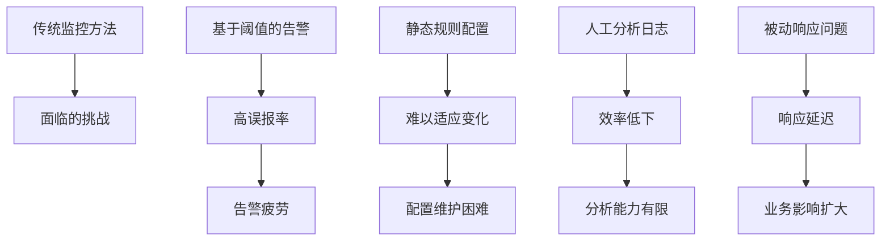
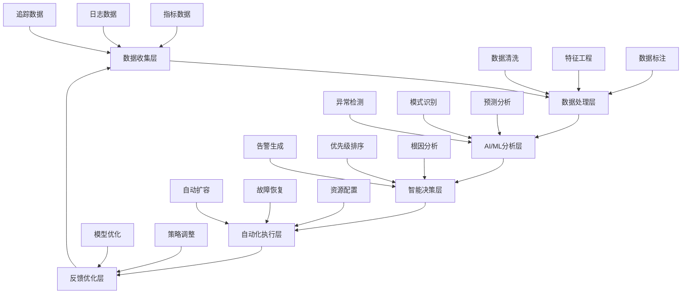

随着人工智能和机器学习技术的快速发展，日志与监控领域正在经历一场深刻的智能化变革。传统的基于规则和阈值的监控方式正在被基于AI/ML的智能分析所补充和替代，这使得我们能够更准确地检测异常、预测问题、自动响应事件，并从海量的监控数据中提取有价值的洞察。本章将深入探讨日志与监控的智能化发展趋势，介绍AI/ML在可观察性领域的应用和最佳实践。

## 智能化监控的发展背景

### 传统监控的局限性

传统的监控方法主要依赖于预定义的规则和静态阈值，这种方法在现代复杂的微服务架构中暴露出越来越多的局限性：



### 智能化监控的优势

```yaml
# 智能化监控优势
intelligent_monitoring_advantages:
  adaptive_thresholds:
    description: "自适应阈值"
    benefits:
      - 根据历史数据动态调整阈值
      - 适应业务模式变化
      - 减少误报和漏报
      - 提高告警准确性
      
  anomaly_detection:
    description: "异常检测"
    benefits:
      - 自动识别异常模式
      - 无需预定义规则
      - 实时检测未知问题
      - 提前预警潜在风险
      
  predictive_analytics:
    description: "预测分析"
    benefits:
      - 预测系统性能趋势
      - 提前识别容量问题
      - 主动优化资源配置
      - 预防性维护
      
  automated_response:
    description: "自动化响应"
    benefits:
      - 自动处理常见问题
      - 减少人工干预
      - 提高响应速度
      - 降低运维成本
```

## AI/ML在日志与监控中的应用

### 机器学习算法类型

在日志与监控领域，不同类型的机器学习算法有着各自的应用场景：

```yaml
# 机器学习算法在监控中的应用
ml_algorithms_in_monitoring:
  supervised_learning:
    description: "监督学习"
    algorithms:
      - 分类算法: 告警分类、问题根因识别
      - 回归算法: 性能预测、容量规划
      - 集成学习: 告警优先级排序、风险评估
    applications:
      - 基于历史数据训练模型
      - 预测已知类型的问题
      - 分类和优先级排序
      
  unsupervised_learning:
    description: "无监督学习"
    algorithms:
      - 聚类算法: 日志模式分组、异常检测
      - 异常检测: 统计异常、基于密度的异常
      - 降维算法: 特征选择、数据可视化
    applications:
      - 发现未知的异常模式
      - 日志数据聚类分析
      - 系统行为模式识别
      
  deep_learning:
    description: "深度学习"
    algorithms:
      - 神经网络: 复杂模式识别、序列预测
      - LSTM: 时间序列预测、日志序列分析
      - 自编码器: 异常检测、数据压缩
    applications:
      - 复杂日志模式识别
      - 时间序列预测
      - 多维度异常检测
      
  reinforcement_learning:
    description: "强化学习"
    algorithms:
      - Q-Learning: 自动化决策、资源调度
      - 策略梯度: 动态配置优化、自适应监控
    applications:
      - 自动化运维决策
      - 动态资源分配
      - 自适应监控策略
```

### 智能化监控架构



## 智能异常检测

### 基于统计的异常检测

```python
# 基于统计的异常检测实现
import numpy as np
import pandas as pd
from scipy import stats
from sklearn.preprocessing import StandardScaler

class StatisticalAnomalyDetector:
    def __init__(self, confidence_level=0.95):
        self.confidence_level = confidence_level
        self.scaler = StandardScaler()
        self.threshold = None
        
    def fit(self, data):
        """训练模型"""
        # 标准化数据
        scaled_data = self.scaler.fit_transform(data.reshape(-1, 1))
        
        # 计算阈值（基于正态分布假设）
        self.threshold = stats.norm.ppf(self.confidence_level, 
                                      np.mean(scaled_data), 
                                      np.std(scaled_data))
        return self
    
    def predict(self, data):
        """检测异常"""
        # 标准化新数据
        scaled_data = self.scaler.transform(data.reshape(-1, 1))
        
        # 检测异常点
        anomalies = np.abs(scaled_data.flatten()) > self.threshold
        return anomalies
    
    def get_anomaly_scores(self, data):
        """获取异常分数"""
        scaled_data = self.scaler.transform(data.reshape(-1, 1))
        scores = np.abs(scaled_data.flatten())
        return scores

# 使用示例
detector = StatisticalAnomalyDetector(confidence_level=0.99)

# 模拟正常数据
normal_data = np.random.normal(100, 10, 1000)
detector.fit(normal_data)

# 检测异常
test_data = np.array([95, 102, 150, 98, 200, 101])
anomalies = detector.predict(test_data)
scores = detector.get_anomaly_scores(test_data)

print("Anomalies:", anomalies)
print("Scores:", scores)
```

### 基于机器学习的异常检测

```python
# 基于孤立森林的异常检测
from sklearn.ensemble import IsolationForest
from sklearn.preprocessing import StandardScaler
import numpy as np

class MLAnomalyDetector:
    def __init__(self, contamination=0.1, random_state=42):
        self.contamination = contamination
        self.random_state = random_state
        self.scaler = StandardScaler()
        self.model = IsolationForest(
            contamination=contamination,
            random_state=random_state
        )
        
    def fit(self, data):
        """训练模型"""
        # 标准化数据
        scaled_data = self.scaler.fit_transform(data)
        
        # 训练孤立森林模型
        self.model.fit(scaled_data)
        return self
    
    def predict(self, data):
        """检测异常"""
        # 标准化新数据
        scaled_data = self.scaler.transform(data)
        
        # 预测异常（-1表示异常，1表示正常）
        predictions = self.model.predict(scaled_data)
        anomalies = predictions == -1
        return anomalies
    
    def get_anomaly_scores(self, data):
        """获取异常分数"""
        scaled_data = self.scaler.transform(data)
        scores = self.model.decision_function(scaled_data)
        return scores

# 使用示例
ml_detector = MLAnomalyDetector(contamination=0.1)

# 模拟多维监控数据
np.random.seed(42)
normal_data = np.random.multivariate_normal(
    mean=[100, 50, 25],
    cov=[[10, 2, 1], [2, 5, 0.5], [1, 0.5, 2]],
    size=1000
)
ml_detector.fit(normal_data)

# 检测异常
test_data = np.array([
    [95, 48, 24],
    [102, 52, 26],
    [150, 80, 40],  # 异常点
    [98, 49, 25],
    [200, 100, 60]  # 明显异常点
])
anomalies = ml_detector.predict(test_data)
scores = ml_detector.get_anomaly_scores(test_data)

print("Anomalies:", anomalies)
print("Scores:", scores)
```

## 智能日志分析

### 日志模式识别

```python
# 基于聚类的日志模式识别
from sklearn.feature_extraction.text import TfidfVectorizer
from sklearn.cluster import KMeans
from sklearn.decomposition import PCA
import numpy as np
import re

class LogPatternAnalyzer:
    def __init__(self, n_clusters=10, max_features=1000):
        self.n_clusters = n_clusters
        self.max_features = max_features
        self.vectorizer = TfidfVectorizer(
            max_features=max_features,
            stop_words='english',
            lowercase=True
        )
        self.cluster_model = KMeans(n_clusters=n_clusters, random_state=42)
        self.pca = PCA(n_components=2)
        
    def preprocess_logs(self, logs):
        """预处理日志数据"""
        processed_logs = []
        for log in logs:
            # 移除时间戳、IP地址等变量信息
            cleaned_log = re.sub(r'\d{4}-\d{2}-\d{2}T\d{2}:\d{2}:\d{2}', '', log)
            cleaned_log = re.sub(r'\d{1,3}\.\d{1,3}\.\d{1,3}\.\d{1,3}', '', cleaned_log)
            cleaned_log = re.sub(r'\d+', 'NUM', cleaned_log)
            processed_logs.append(cleaned_log.strip())
        return processed_logs
    
    def fit(self, logs):
        """训练模型"""
        # 预处理日志
        processed_logs = self.preprocess_logs(logs)
        
        # 向量化日志
        tfidf_matrix = self.vectorizer.fit_transform(processed_logs)
        
        # 聚类分析
        self.cluster_model.fit(tfidf_matrix)
        
        # PCA降维用于可视化
        self.pca.fit(tfidf_matrix.toarray())
        
        return self
    
    def predict_clusters(self, logs):
        """预测日志簇"""
        processed_logs = self.preprocess_logs(logs)
        tfidf_matrix = self.vectorizer.transform(processed_logs)
        clusters = self.cluster_model.predict(tfidf_matrix)
        return clusters
    
    def get_cluster_centers(self):
        """获取簇中心"""
        return self.cluster_model.cluster_centers_
    
    def identify_anomalous_patterns(self, logs, threshold=0.1):
        """识别异常日志模式"""
        clusters = self.predict_clusters(logs)
        cluster_counts = np.bincount(clusters)
        total_logs = len(logs)
        
        # 识别罕见模式（占比低于阈值的簇）
        rare_clusters = []
        for i, count in enumerate(cluster_counts):
            if count / total_logs < threshold:
                rare_clusters.append(i)
        
        return rare_clusters, clusters

# 使用示例
analyzer = LogPatternAnalyzer(n_clusters=5)

# 模拟日志数据
sample_logs = [
    "2025-08-31T10:30:00 INFO User login successful for user123",
    "2025-08-31T10:31:00 INFO User login successful for user456",
    "2025-08-31T10:32:00 ERROR Database connection failed",
    "2025-08-31T10:33:00 INFO User logout successful for user123",
    "2025-08-31T10:34:00 INFO User login successful for user789",
    "2025-08-31T10:35:00 ERROR Database connection failed",
    "2025-08-31T10:36:00 CRITICAL System crash detected",
    "2025-08-31T10:37:00 INFO User login successful for user101",
    "2025-08-31T10:38:00 ERROR Database connection failed",
    "2025-08-31T10:39:00 CRITICAL System crash detected"
]

analyzer.fit(sample_logs)

# 分析新日志
new_logs = [
    "2025-08-31T11:00:00 INFO User login successful for user202",
    "2025-08-31T11:01:00 ERROR Database connection failed",
    "2025-08-31T11:02:00 CRITICAL Unknown error occurred"
]

clusters = analyzer.predict_clusters(new_logs)
rare_clusters, all_clusters = analyzer.identify_anomalous_patterns(new_logs)

print("Log clusters:", clusters)
print("Rare clusters:", rare_clusters)
```

## 预测性分析

### 时间序列预测

```python
# 基于LSTM的时间序列预测
import numpy as np
from sklearn.preprocessing import MinMaxScaler
from tensorflow.keras.models import Sequential
from tensorflow.keras.layers import LSTM, Dense, Dropout

class TimeSeriesPredictor:
    def __init__(self, look_back=10, epochs=50, batch_size=32):
        self.look_back = look_back
        self.epochs = epochs
        self.batch_size = batch_size
        self.scaler = MinMaxScaler(feature_range=(0, 1))
        self.model = None
        
    def create_dataset(self, data, look_back=1):
        """创建数据集"""
        X, Y = [], []
        for i in range(len(data) - look_back - 1):
            X.append(data[i:(i + look_back), 0])
            Y.append(data[i + look_back, 0])
        return np.array(X), np.array(Y)
    
    def build_model(self):
        """构建LSTM模型"""
        model = Sequential()
        model.add(LSTM(50, return_sequences=True, input_shape=(self.look_back, 1)))
        model.add(Dropout(0.2))
        model.add(LSTM(50, return_sequences=False))
        model.add(Dropout(0.2))
        model.add(Dense(25))
        model.add(Dense(1))
        
        model.compile(optimizer='adam', loss='mean_squared_error')
        return model
    
    def fit(self, data):
        """训练模型"""
        # 数据标准化
        scaled_data = self.scaler.fit_transform(data.reshape(-1, 1))
        
        # 创建训练数据集
        X, Y = self.create_dataset(scaled_data, self.look_back)
        
        # 重塑输入数据
        X = np.reshape(X, (X.shape[0], X.shape[1], 1))
        
        # 构建和训练模型
        self.model = self.build_model()
        self.model.fit(X, Y, batch_size=self.batch_size, epochs=self.epochs, verbose=0)
        
        return self
    
    def predict(self, data, steps=1):
        """预测未来值"""
        # 数据标准化
        scaled_data = self.scaler.transform(data.reshape(-1, 1))
        
        # 准备预测数据
        last_sequence = scaled_data[-self.look_back:].reshape(1, self.look_back, 1)
        
        predictions = []
        current_sequence = last_sequence.copy()
        
        for _ in range(steps):
            # 预测下一个值
            next_pred = self.model.predict(current_sequence, verbose=0)
            predictions.append(next_pred[0, 0])
            
            # 更新序列（滑动窗口）
            current_sequence = np.roll(current_sequence, -1, axis=1)
            current_sequence[0, -1, 0] = next_pred[0, 0]
        
        # 反标准化预测结果
        predictions = np.array(predictions).reshape(-1, 1)
        predictions = self.scaler.inverse_transform(predictions)
        
        return predictions.flatten()

# 使用示例
predictor = TimeSeriesPredictor(look_back=10, epochs=100)

# 模拟CPU使用率数据
np.random.seed(42)
time_points = np.linspace(0, 100, 1000)
trend = 50 + 10 * np.sin(2 * np.pi * time_points / 50)
noise = np.random.normal(0, 2, 1000)
cpu_usage = trend + noise

# 训练模型
predictor.fit(cpu_usage[:800])

# 预测未来值
recent_data = cpu_usage[800:900]
predictions = predictor.predict(recent_data, steps=10)

print("Predictions:", predictions)
```

## 智能告警与自动化

### 动态阈值调整

```python
# 基于机器学习的动态阈值调整
import numpy as np
from sklearn.ensemble import RandomForestRegressor
from sklearn.preprocessing import StandardScaler

class DynamicThresholdAdjuster:
    def __init__(self, window_size=100, confidence_level=0.95):
        self.window_size = window_size
        self.confidence_level = confidence_level
        self.scaler = StandardScaler()
        self.model = RandomForestRegressor(n_estimators=100, random_state=42)
        self.threshold_history = []
        
    def extract_features(self, data_window):
        """从数据窗口中提取特征"""
        features = {
            'mean': np.mean(data_window),
            'std': np.std(data_window),
            'min': np.min(data_window),
            'max': np.max(data_window),
            'median': np.median(data_window),
            'q25': np.percentile(data_window, 25),
            'q75': np.percentile(data_window, 75),
            'skewness': self._calculate_skewness(data_window),
            'kurtosis': self._calculate_kurtosis(data_window),
            'trend': self._calculate_trend(data_window)
        }
        return list(features.values())
    
    def _calculate_skewness(self, data):
        """计算偏度"""
        return np.mean(((data - np.mean(data)) / np.std(data)) ** 3)
    
    def _calculate_kurtosis(self, data):
        """计算峰度"""
        return np.mean(((data - np.mean(data)) / np.std(data)) ** 4) - 3
    
    def _calculate_trend(self, data):
        """计算趋势"""
        x = np.arange(len(data))
        slope = np.polyfit(x, data, 1)[0]
        return slope
    
    def fit(self, historical_data, historical_thresholds):
        """训练模型"""
        features = []
        targets = []
        
        # 为历史数据创建特征和目标
        for i in range(self.window_size, len(historical_data)):
            window = historical_data[i-self.window_size:i]
            feature = self.extract_features(window)
            features.append(feature)
            targets.append(historical_thresholds[i])
        
        # 标准化特征
        scaled_features = self.scaler.fit_transform(features)
        
        # 训练模型
        self.model.fit(scaled_features, targets)
        
        return self
    
    def predict_threshold(self, current_data):
        """预测动态阈值"""
        if len(current_data) < self.window_size:
            # 数据不足时使用静态方法
            return np.mean(current_data) + 2 * np.std(current_data)
        
        # 提取特征
        window = current_data[-self.window_size:]
        features = self.extract_features(window)
        
        # 标准化特征
        scaled_features = self.scaler.transform([features])
        
        # 预测阈值
        predicted_threshold = self.model.predict(scaled_features)[0]
        
        return predicted_threshold
    
    def adjust_threshold_based_on_confidence(self, threshold, data_window):
        """基于置信度调整阈值"""
        # 计算数据的置信区间
        mean = np.mean(data_window)
        std = np.std(data_window)
        confidence_interval = std * np.sqrt(2 * np.log(1 / (1 - self.confidence_level)))
        
        # 调整阈值
        adjusted_threshold = threshold + confidence_interval
        return adjusted_threshold

# 使用示例
adjuster = DynamicThresholdAdjuster(window_size=50, confidence_level=0.95)

# 模拟历史数据和阈值
np.random.seed(42)
historical_data = np.random.normal(100, 10, 1000)
historical_thresholds = historical_data + 2 * np.std(historical_data)

# 训练模型
adjuster.fit(historical_data, historical_thresholds)

# 预测动态阈值
current_data = np.random.normal(105, 12, 100)
predicted_threshold = adjuster.predict_threshold(current_data)
adjusted_threshold = adjuster.adjust_threshold_based_on_confidence(
    predicted_threshold, current_data[-50:]
)

print("Predicted threshold:", predicted_threshold)
print("Adjusted threshold:", adjusted_threshold)
```

## 智能化监控平台架构

### AI驱动的监控平台

```yaml
# AI驱动的监控平台架构
ai_driven_monitoring_platform:
  data_layer:
    description: "数据层"
    components:
      - Data Collection: 多源数据收集
      - Data Storage: 分布式存储
      - Data Streaming: 实时数据流
      - Feature Store: 特征存储
      
  processing_layer:
    description: "处理层"
    components:
      - Data Preprocessing: 数据预处理
      - Feature Engineering: 特征工程
      - Data Labeling: 数据标注
      - Data Quality: 数据质量监控
      
  ai_ml_layer:
    description: "AI/ML层"
    components:
      - Model Training: 模型训练
      - Model Serving: 模型服务
      - Model Monitoring: 模型监控
      - AutoML: 自动化机器学习
      
  analysis_layer:
    description: "分析层"
    components:
      - Anomaly Detection: 异常检测
      - Pattern Recognition: 模式识别
      - Predictive Analytics: 预测分析
      - Root Cause Analysis: 根因分析
      
  decision_layer:
    description: "决策层"
    components:
      - Alert Generation: 告警生成
      - Priority Scoring: 优先级评分
      - Recommendation Engine: 推荐引擎
      - Decision Support: 决策支持
      
  automation_layer:
    description: "自动化层"
    components:
      - Automated Response: 自动化响应
      - Self-healing: 自愈系统
      - Resource Optimization: 资源优化
      - Workflow Automation: 工作流自动化
      
  interface_layer:
    description: "接口层"
    components:
      - Dashboard: 可视化仪表板
      - API Gateway: API网关
      - Notification System: 通知系统
      - Collaboration Tools: 协作工具
```

## 最佳实践总结

### 1. 模型选择与评估

```yaml
# 模型选择与评估最佳实践
model_selection_best_practices:
  algorithm_selection:
    guidelines:
      - "根据数据特点选择合适的算法"
      - "考虑计算资源和实时性要求"
      - "平衡准确性和复杂性"
      - "支持模型的可解释性"
      
  model_evaluation:
    guidelines:
      - "使用多种评估指标"
      - "实施交叉验证"
      - "监控模型性能漂移"
      - "定期重新训练模型"
      
  deployment_strategy:
    guidelines:
      - "渐进式部署"
      - "A/B测试验证"
      - "回滚机制"
      - "性能监控"
```

### 2. 数据质量管理

```yaml
# 数据质量管理最佳实践
data_quality_best_practices:
  data_collection:
    guidelines:
      - "确保数据完整性和准确性"
      - "实施数据验证机制"
      - "处理缺失值和异常值"
      - "维护数据一致性"
      
  feature_engineering:
    guidelines:
      - "选择有意义的特征"
      - "处理特征相关性"
      - "特征缩放和标准化"
      - "特征重要性评估"
      
  data_governance:
    guidelines:
      - "建立数据治理框架"
      - "实施数据安全措施"
      - "确保合规性要求"
      - "数据生命周期管理"
```

## 总结

日志与监控的智能化发展代表了可观察性领域的重大进步。通过应用AI/ML技术，我们可以构建更加智能、自适应和预测性的监控体系，显著提升系统的可靠性和运维效率。

关键要点包括：
1. **技术融合**：将AI/ML技术与传统监控方法有效结合
2. **智能分析**：实现异常检测、模式识别和预测分析
3. **自动化决策**：构建智能告警和自动化响应机制
4. **持续优化**：通过反馈机制不断优化模型和策略

通过遵循最佳实践，合理选择和应用AI/ML技术，可以为微服务系统构建先进的智能化监控体系，实现从被动响应到主动预防的转变。

在下一节中，我们将深入探讨基于机器学习的日志分析与异常检测技术。