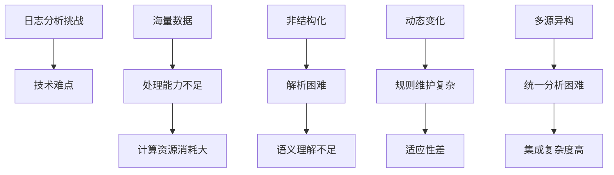

在现代微服务架构中，日志数据量呈指数级增长，传统的基于规则和关键字匹配的日志分析方法已无法满足高效、准确的异常检测需求。基于机器学习的日志分析与异常检测技术为解决这一挑战提供了全新的思路，通过自动学习日志模式、识别异常行为，能够显著提升日志分析的效率和准确性。本章将深入探讨如何应用机器学习技术进行日志分析与异常检测。

## 机器学习日志分析概述

### 日志分析的挑战

现代微服务系统产生的日志数据具有以下特点，给传统分析方法带来挑战：



### 机器学习解决方案

```yaml
# 机器学习日志分析解决方案
ml_log_analysis_solutions:
  automated_parsing:
    description: "自动化日志解析"
    benefits:
      - 自动生成日志模板
      - 识别日志模式
      - 提取结构化信息
      - 减少人工配置
      
  intelligent_clustering:
    description: "智能日志聚类"
    benefits:
      - 自动分组相似日志
      - 发现未知模式
      - 简化日志管理
      - 提高分析效率
      
  anomaly_detection:
    description: "异常检测"
    benefits:
      - 自动识别异常日志
      - 减少误报和漏报
      - 实时监控告警
      - 提前预警问题
      
  predictive_analytics:
    description: "预测分析"
    benefits:
      - 预测系统行为
      - 识别潜在风险
      - 优化资源配置
      - 主动维护系统
```

## 日志预处理与特征工程

### 日志解析与模板生成

```python
# 基于Drain算法的日志解析
import re
import numpy as np
from collections import defaultdict

class LogParser:
    def __init__(self, depth=4, max_child=100, sim_threshold=0.4):
        self.depth = depth
        self.max_child = max_child
        self.sim_threshold = sim_threshold
        self.root_node = Node()
        
    def parse(self, log_line):
        """解析单条日志"""
        # 预处理：移除变量信息
        processed_log = self._preprocess_log(log_line)
        
        # 在树中查找或创建模板
        template, template_id = self._get_template(processed_log)
        
        # 提取参数
        parameters = self._extract_parameters(log_line, template)
        
        return {
            'template': template,
            'template_id': template_id,
            'parameters': parameters
        }
    
    def _preprocess_log(self, log_line):
        """预处理日志"""
        # 移除时间戳
        log_line = re.sub(r'\d{4}-\d{2}-\d{2}T\d{2}:\d{2}:\d{2}(\.\d{3})?Z?', '', log_line)
        log_line = re.sub(r'\d{2}/\d{2}/\d{4} \d{2}:\d{2}:\d{2}', '', log_line)
        
        # 移除IP地址
        log_line = re.sub(r'\d{1,3}\.\d{1,3}\.\d{1,3}\.\d{1,3}', '', log_line)
        
        # 移除数字（保留有意义的数字）
        log_line = re.sub(r'\b\d+\b', '<*>', log_line)
        
        return log_line.strip()
    
    def _get_template(self, log_line):
        """获取或创建日志模板"""
        tokens = log_line.split()
        node = self.root_node
        
        # 遍历树结构
        for i, token in enumerate(tokens):
            if i >= self.depth:
                break
                
            # 查找相似子节点
            matched_child = None
            max_sim = -1
            
            for child in node.children:
                sim = self._similarity(token, child.token)
                if sim >= self.sim_threshold and sim > max_sim:
                    max_sim = sim
                    matched_child = child
            
            # 如果没有匹配的子节点，创建新节点
            if matched_child is None:
                if len(node.children) < self.max_child:
                    new_node = Node(token)
                    node.children.append(new_node)
                    node = new_node
                else:
                    # 如果子节点已满，选择最相似的节点
                    node = max(node.children, key=lambda x: self._similarity(token, x.token))
            else:
                node = matched_child
        
        # 生成模板
        template = self._generate_template(node)
        template_id = hash(template)
        
        return template, template_id
    
    def _similarity(self, token1, token2):
        """计算两个token的相似度"""
        if token1 == token2:
            return 1.0
        elif token1 == '<*>' or token2 == '<*>':
            return 0.5
        else:
            # 简单的字符相似度计算
            common_chars = len(set(token1) & set(token2))
            total_chars = len(set(token1) | set(token2))
            return common_chars / total_chars if total_chars > 0 else 0
    
    def _generate_template(self, node):
        """生成模板字符串"""
        tokens = []
        current = node
        while current and current.token:
            tokens.append(current.token)
            current = current.parent
        return ' '.join(reversed(tokens))
    
    def _extract_parameters(self, original_log, template):
        """从原始日志中提取参数"""
        # 简化的参数提取逻辑
        template_tokens = template.split()
        log_tokens = original_log.split()
        
        parameters = []
        for i, (template_token, log_token) in enumerate(zip(template_tokens, log_tokens)):
            if template_token == '<*>':
                parameters.append(log_token)
        
        return parameters

class Node:
    def __init__(self, token=None, parent=None):
        self.token = token
        self.parent = parent
        self.children = []

# 使用示例
parser = LogParser()

# 测试日志数据
test_logs = [
    "2025-08-31T10:30:00 INFO User login successful for user123 from 192.168.1.1",
    "2025-08-31T10:31:00 INFO User login successful for user456 from 192.168.1.2",
    "2025-08-31T10:32:00 ERROR Database connection failed for user789",
    "2025-08-31T10:33:00 INFO User logout successful for user123",
    "2025-08-31T10:34:00 ERROR Database connection failed for user101"
]

# 解析日志
for log in test_logs:
    result = parser.parse(log)
    print(f"Log: {log}")
    print(f"Template: {result['template']}")
    print(f"Template ID: {result['template_id']}")
    print(f"Parameters: {result['parameters']}")
    print("-" * 50)
```

### 特征提取与向量化

```python
# 日志特征提取与向量化
from sklearn.feature_extraction.text import TfidfVectorizer
from sklearn.preprocessing import StandardScaler
import numpy as np

class LogFeatureExtractor:
    def __init__(self, max_features=1000):
        self.max_features = max_features
        self.tfidf_vectorizer = TfidfVectorizer(
            max_features=max_features,
            stop_words='english',
            lowercase=True,
            ngram_range=(1, 2)
        )
        self.scaler = StandardScaler()
        
    def extract_statistical_features(self, log_sequences):
        """提取统计特征"""
        features = []
        for sequence in log_sequences:
            # 基本统计特征
            feature_dict = {
                'length': len(sequence),
                'unique_templates': len(set(sequence)),
                'template_diversity': len(set(sequence)) / len(sequence) if sequence else 0,
                'avg_template_frequency': np.mean(list(np.bincount(sequence))) if sequence else 0
            }
            
            # 模板频率特征
            template_counts = np.bincount(sequence)
            feature_dict['max_template_frequency'] = np.max(template_counts) if len(template_counts) > 0 else 0
            feature_dict['min_template_frequency'] = np.min(template_counts) if len(template_counts) > 0 else 0
            feature_dict['std_template_frequency'] = np.std(template_counts) if len(template_counts) > 0 else 0
            
            features.append(feature_dict)
        
        return features
    
    def extract_temporal_features(self, log_timestamps):
        """提取时间特征"""
        features = []
        for timestamps in log_timestamps:
            if len(timestamps) < 2:
                features.append({
                    'avg_interval': 0,
                    'std_interval': 0,
                    'burstiness': 0
                })
                continue
                
            # 计算时间间隔
            intervals = np.diff(timestamps)
            avg_interval = np.mean(intervals)
            std_interval = np.std(intervals)
            
            # 计算突发性（burstiness）
            burstiness = (np.std(intervals) - np.mean(intervals)) / (np.std(intervals) + np.mean(intervals)) if (np.std(intervals) + np.mean(intervals)) > 0 else 0
            
            features.append({
                'avg_interval': avg_interval,
                'std_interval': std_interval,
                'burstiness': burstiness
            })
        
        return features
    
    def vectorize_log_templates(self, log_templates):
        """向量化日志模板"""
        # 将模板转换为文本
        template_texts = [' '.join(map(str, template)) for template in log_templates]
        
        # TF-IDF向量化
        tfidf_matrix = self.tfidf_vectorizer.fit_transform(template_texts)
        
        return tfidf_matrix.toarray()
    
    def combine_features(self, statistical_features, temporal_features, tfidf_features):
        """组合所有特征"""
        combined_features = []
        
        for i in range(len(statistical_features)):
            # 统计特征
            stat_features = list(statistical_features[i].values())
            
            # 时间特征
            temp_features = list(temporal_features[i].values())
            
            # TF-IDF特征
            tfidf_feat = tfidf_features[i].tolist() if i < len(tfidf_features) else []
            
            # 组合所有特征
            combined = stat_features + temp_features + tfidf_feat
            combined_features.append(combined)
        
        # 标准化特征
        scaled_features = self.scaler.fit_transform(combined_features)
        
        return scaled_features

# 使用示例
extractor = LogFeatureExtractor(max_features=100)

# 模拟日志序列数据
log_sequences = [
    [1, 2, 1, 3, 2, 1],  # 正常模式
    [1, 1, 1, 1, 2, 2],  # 重复模式
    [4, 5, 6, 7, 8, 9],  # 异常模式
    [1, 2, 3, 1, 2, 3],  # 循环模式
]

# 提取统计特征
stat_features = extractor.extract_statistical_features(log_sequences)
print("Statistical Features:", stat_features)

# 模拟时间戳数据
import time
timestamps = [
    [time.time() + i*10 for i in range(6)],
    [time.time() + i*5 for i in range(6)],
    [time.time() + i*100 for i in range(6)],
    [time.time() + i*15 for i in range(6)],
]

# 提取时间特征
temp_features = extractor.extract_temporal_features(timestamps)
print("Temporal Features:", temp_features)
```

## 异常检测算法实现

### 基于孤立森林的异常检测

```python
# 基于孤立森林的异常检测
from sklearn.ensemble import IsolationForest
from sklearn.metrics import classification_report, confusion_matrix
import numpy as np

class LogAnomalyDetector:
    def __init__(self, contamination=0.1, random_state=42):
        self.contamination = contamination
        self.random_state = random_state
        self.model = IsolationForest(
            contamination=contamination,
            random_state=random_state,
            n_estimators=100
        )
        
    def fit(self, features):
        """训练异常检测模型"""
        self.model.fit(features)
        return self
    
    def predict(self, features):
        """预测异常"""
        # 预测结果：1表示正常，-1表示异常
        predictions = self.model.predict(features)
        # 转换为0-1格式：0表示正常，1表示异常
        anomalies = (predictions == -1).astype(int)
        return anomalies
    
    def get_anomaly_scores(self, features):
        """获取异常分数"""
        # 异常分数：越接近-1越异常
        scores = self.model.decision_function(features)
        return scores
    
    def evaluate(self, features, true_labels):
        """评估模型性能"""
        predictions = self.predict(features)
        scores = self.get_anomaly_scores(features)
        
        # 计算评估指标
        report = classification_report(true_labels, predictions, output_dict=True)
        confusion = confusion_matrix(true_labels, predictions)
        
        return {
            'classification_report': report,
            'confusion_matrix': confusion,
            'anomaly_scores': scores
        }

# 使用示例
detector = LogAnomalyDetector(contamination=0.1)

# 模拟特征数据（正常和异常混合）
np.random.seed(42)
normal_data = np.random.multivariate_normal(
    mean=[0, 0, 0, 0],
    cov=[[1, 0.5, 0.2, 0], [0.5, 1, 0.3, 0], [0.2, 0.3, 1, 0], [0, 0, 0, 1]],
    size=1000
)

# 添加一些异常数据
anomaly_data = np.random.multivariate_normal(
    mean=[3, 3, 3, 3],
    cov=[[1, 0, 0, 0], [0, 1, 0, 0], [0, 0, 1, 0], [0, 0, 0, 1]],
    size=100
)

# 合并数据
all_features = np.vstack([normal_data, anomaly_data])
true_labels = np.hstack([np.zeros(1000), np.ones(100)])

# 训练模型
detector.fit(all_features)

# 评估模型
evaluation = detector.evaluate(all_features, true_labels)
print("Classification Report:")
for key, value in evaluation['classification_report'].items():
    if isinstance(value, dict):
        print(f"{key}: {value}")
    else:
        print(f"{key}: {value:.4f}")
```

### 基于LSTM的序列异常检测

```python
# 基于LSTM的序列异常检测
import tensorflow as tf
from tensorflow.keras.models import Sequential
from tensorflow.keras.layers import LSTM, Dense, Dropout
from tensorflow.keras.optimizers import Adam
import numpy as np

class SequenceAnomalyDetector:
    def __init__(self, sequence_length=10, lstm_units=50, dropout_rate=0.2):
        self.sequence_length = sequence_length
        self.lstm_units = lstm_units
        self.dropout_rate = dropout_rate
        self.model = None
        self.threshold = None
        
    def create_sequences(self, data):
        """创建序列数据"""
        sequences = []
        for i in range(len(data) - self.sequence_length):
            sequences.append(data[i:(i + self.sequence_length)])
        return np.array(sequences)
    
    def build_model(self, input_shape):
        """构建LSTM模型"""
        model = Sequential([
            LSTM(self.lstm_units, return_sequences=True, input_shape=input_shape),
            Dropout(self.dropout_rate),
            LSTM(self.lstm_units, return_sequences=False),
            Dropout(self.dropout_rate),
            Dense(self.lstm_units, activation='relu'),
            Dense(input_shape[-1], activation='linear')
        ])
        
        model.compile(
            optimizer=Adam(learning_rate=0.001),
            loss='mse',
            metrics=['mae']
        )
        
        return model
    
    def fit(self, normal_sequences, epochs=50, batch_size=32, validation_split=0.1):
        """训练模型"""
        # 构建模型
        input_shape = (self.sequence_length, normal_sequences.shape[-1])
        self.model = self.build_model(input_shape)
        
        # 训练模型
        history = self.model.fit(
            normal_sequences, normal_sequences,
            epochs=epochs,
            batch_size=batch_size,
            validation_split=validation_split,
            verbose=1
        )
        
        # 计算正常数据的重建误差阈值
        reconstructed = self.model.predict(normal_sequences)
        mse = np.mean(np.power(normal_sequences - reconstructed, 2), axis=(1, 2))
        self.threshold = np.percentile(mse, 95)  # 95%分位数作为阈值
        
        return self, history
    
    def predict_anomalies(self, sequences):
        """检测序列异常"""
        if self.model is None:
            raise ValueError("Model not trained yet")
        
        # 重建序列
        reconstructed = self.model.predict(sequences)
        
        # 计算重建误差
        mse = np.mean(np.power(sequences - reconstructed, 2), axis=(1, 2))
        
        # 根据阈值判断异常
        anomalies = mse > self.threshold
        
        return anomalies, mse
    
    def get_reconstruction_error(self, sequences):
        """获取重建误差"""
        if self.model is None:
            raise ValueError("Model not trained yet")
        
        reconstructed = self.model.predict(sequences)
        mse = np.mean(np.power(sequences - reconstructed, 2), axis=(1, 2))
        
        return mse

# 使用示例
seq_detector = SequenceAnomalyDetector(sequence_length=10, lstm_units=32)

# 生成正常序列数据
np.random.seed(42)
t = np.linspace(0, 100, 1000)
normal_pattern = np.sin(2 * np.pi * t / 10) + 0.1 * np.random.randn(1000)
normal_sequences = seq_detector.create_sequences(normal_pattern.reshape(-1, 1))

# 训练模型
trained_model, history = seq_detector.fit(normal_sequences, epochs=20)

# 生成测试数据（包含异常）
test_pattern = np.sin(2 * np.pi * t[:200] / 10) + 0.1 * np.random.randn(200)
# 添加异常点
test_pattern[50:60] = 5  # 异常峰值
test_sequences = seq_detector.create_sequences(test_pattern.reshape(-1, 1))

# 检测异常
anomalies, errors = seq_detector.predict_anomalies(test_sequences)

print(f"Threshold: {seq_detector.threshold:.4f}")
print(f"Anomalies detected: {np.sum(anomalies)}")
print(f"Anomaly rate: {np.mean(anomalies):.2%}")
```

## 深度学习日志分析

### 基于Transformer的日志分析

```python
# 基于Transformer的日志分析
import torch
import torch.nn as nn
import torch.optim as optim
from torch.utils.data import Dataset, DataLoader
import numpy as np

class LogDataset(Dataset):
    def __init__(self, sequences, labels=None):
        self.sequences = sequences
        self.labels = labels
        
    def __len__(self):
        return len(self.sequences)
    
    def __getitem__(self, idx):
        sequence = torch.tensor(self.sequences[idx], dtype=torch.long)
        if self.labels is not None:
            label = torch.tensor(self.labels[idx], dtype=torch.float)
            return sequence, label
        return sequence

class LogTransformer(nn.Module):
    def __init__(self, vocab_size, d_model=128, nhead=8, num_layers=4, dropout=0.1):
        super(LogTransformer, self).__init__()
        self.d_model = d_model
        self.embedding = nn.Embedding(vocab_size, d_model)
        self.pos_encoding = nn.Parameter(torch.randn(1000, d_model))
        
        encoder_layer = nn.TransformerEncoderLayer(
            d_model=d_model,
            nhead=nhead,
            dropout=dropout,
            batch_first=True
        )
        self.transformer = nn.TransformerEncoder(encoder_layer, num_layers)
        self.classifier = nn.Linear(d_model, 1)
        self.sigmoid = nn.Sigmoid()
        
    def forward(self, x):
        # 嵌入和位置编码
        x = self.embedding(x) * np.sqrt(self.d_model)
        seq_len = x.size(1)
        x = x + self.pos_encoding[:seq_len, :].unsqueeze(0)
        
        # Transformer编码
        x = self.transformer(x)
        
        # 全局平均池化
        x = torch.mean(x, dim=1)
        
        # 分类
        x = self.classifier(x)
        x = self.sigmoid(x)
        
        return x.squeeze()

class DeepLogAnalyzer:
    def __init__(self, vocab_size, device='cpu'):
        self.device = device
        self.model = LogTransformer(vocab_size).to(device)
        self.criterion = nn.BCELoss()
        self.optimizer = optim.Adam(self.model.parameters(), lr=0.001)
        
    def train(self, train_loader, epochs=10):
        """训练模型"""
        self.model.train()
        for epoch in range(epochs):
            total_loss = 0
            for sequences, labels in train_loader:
                sequences, labels = sequences.to(self.device), labels.to(self.device)
                
                self.optimizer.zero_grad()
                outputs = self.model(sequences)
                loss = self.criterion(outputs, labels)
                loss.backward()
                self.optimizer.step()
                
                total_loss += loss.item()
            
            avg_loss = total_loss / len(train_loader)
            print(f'Epoch [{epoch+1}/{epochs}], Loss: {avg_loss:.4f}')
    
    def predict(self, test_loader):
        """预测"""
        self.model.eval()
        predictions = []
        with torch.no_grad():
            for sequences in test_loader:
                sequences = sequences.to(self.device)
                outputs = self.model(sequences)
                predictions.extend(outputs.cpu().numpy())
        return np.array(predictions)

# 使用示例
# 模拟日志数据
vocab_size = 1000
sequence_length = 50
num_samples = 1000

# 生成正常日志序列
np.random.seed(42)
normal_sequences = np.random.randint(0, vocab_size//2, (num_samples, sequence_length))
normal_labels = np.zeros(num_samples)

# 生成异常日志序列
anomaly_sequences = np.random.randint(vocab_size//2, vocab_size, (num_samples//10, sequence_length))
anomaly_labels = np.ones(num_samples//10)

# 合并数据
all_sequences = np.vstack([normal_sequences, anomaly_sequences])
all_labels = np.hstack([normal_labels, anomaly_labels])

# 创建数据集和数据加载器
dataset = LogDataset(all_sequences, all_labels)
dataloader = DataLoader(dataset, batch_size=32, shuffle=True)

# 训练模型
analyzer = DeepLogAnalyzer(vocab_size, device='cpu')
analyzer.train(dataloader, epochs=5)
```

## 实时日志分析系统

### 流式日志处理架构

```yaml
# 流式日志处理架构
streaming_log_processing_architecture:
  data_ingestion:
    description: "数据摄入层"
    components:
      - Log Collectors: 日志收集器
      - Message Queue: 消息队列
      - Stream Processor: 流处理器
      - Buffer Management: 缓冲管理
      
  real_time_processing:
    description: "实时处理层"
    components:
      - Feature Extraction: 特征提取
      - Model Inference: 模型推理
      - Anomaly Detection: 异常检测
      - Alert Generation: 告警生成
      
  storage_layer:
    description: "存储层"
    components:
      - Real-time Storage: 实时存储
      - Historical Storage: 历史存储
      - Model Registry: 模型注册
      - Metadata Store: 元数据存储
      
  analysis_layer:
    description: "分析层"
    components:
      - Dashboard: 实时仪表板
      - Analytics Engine: 分析引擎
      - Reporting: 报告生成
      - Visualization: 可视化
      
  integration_layer:
    description: "集成层"
    components:
      - API Gateway: API网关
      - Notification Service: 通知服务
      - Workflow Engine: 工作流引擎
      - External Systems: 外部系统集成
```

### 实时异常检测实现

```python
# 实时异常检测系统
import asyncio
import json
from collections import deque
import numpy as np
from datetime import datetime

class RealTimeLogAnalyzer:
    def __init__(self, window_size=100, anomaly_threshold=0.95):
        self.window_size = window_size
        self.anomaly_threshold = anomaly_threshold
        self.log_window = deque(maxlen=window_size)
        self.feature_window = deque(maxlen=window_size)
        self.model = None
        self.is_running = False
        
    def set_model(self, model):
        """设置检测模型"""
        self.model = model
        
    def add_log(self, log_entry):
        """添加日志条目"""
        timestamp = datetime.now()
        log_data = {
            'timestamp': timestamp,
            'log': log_entry,
            'features': self._extract_features(log_entry)
        }
        
        self.log_window.append(log_data)
        self.feature_window.append(log_data['features'])
        
        return log_data
    
    def _extract_features(self, log_entry):
        """提取日志特征"""
        # 简化的特征提取
        features = {
            'length': len(log_entry),
            'word_count': len(log_entry.split()),
            'digit_count': sum(c.isdigit() for c in log_entry),
            'special_char_count': sum(not c.isalnum() for c in log_entry),
            'uppercase_ratio': sum(c.isupper() for c in log_entry) / len(log_entry) if log_entry else 0
        }
        return list(features.values())
    
    async def detect_anomalies(self):
        """实时检测异常"""
        if len(self.feature_window) < self.window_size:
            return None
            
        if self.model is None:
            return None
            
        # 准备特征数据
        features = np.array(list(self.feature_window))
        
        # 检测异常
        try:
            anomalies = self.model.predict(features)
            scores = self.model.get_anomaly_scores(features)
            
            # 获取最新的检测结果
            latest_anomaly = anomalies[-1] if len(anomalies) > 0 else 0
            latest_score = scores[-1] if len(scores) > 0 else 0
            
            if latest_anomaly == 1 or latest_score > self.anomaly_threshold:
                latest_log = self.log_window[-1] if self.log_window else None
                return {
                    'is_anomaly': True,
                    'score': latest_score,
                    'log_entry': latest_log,
                    'timestamp': datetime.now()
                }
        except Exception as e:
            print(f"Error in anomaly detection: {e}")
            
        return None
    
    async def start_monitoring(self, log_source):
        """开始监控"""
        self.is_running = True
        print("Starting real-time log monitoring...")
        
        while self.is_running:
            # 模拟从日志源获取日志
            log_entry = await log_source.get_next_log()
            if log_entry:
                self.add_log(log_entry)
                
                # 检测异常
                anomaly_result = await self.detect_anomalies()
                if anomaly_result and anomaly_result['is_anomaly']:
                    await self._handle_anomaly(anomaly_result)
            
            # 控制处理频率
            await asyncio.sleep(0.1)
    
    async def _handle_anomaly(self, anomaly_result):
        """处理异常"""
        print(f"Anomaly detected!")
        print(f"Score: {anomaly_result['score']:.4f}")
        print(f"Log: {anomaly_result['log_entry']['log']}")
        print(f"Time: {anomaly_result['timestamp']}")
        
        # 这里可以实现告警通知、自动响应等逻辑
        await self._send_alert(anomaly_result)
    
    async def _send_alert(self, anomaly_result):
        """发送告警"""
        # 模拟发送告警
        alert_data = {
            'type': 'log_anomaly',
            'score': float(anomaly_result['score']),
            'log_entry': anomaly_result['log_entry']['log'],
            'timestamp': anomaly_result['timestamp'].isoformat()
        }
        print(f"Alert sent: {json.dumps(alert_data, indent=2)}")

# 模拟日志源
class MockLogSource:
    def __init__(self):
        self.logs = [
            "INFO User login successful",
            "INFO User logout successful",
            "ERROR Database connection failed",
            "INFO User login successful",
            "WARNING High memory usage detected",
            "CRITICAL System crash occurred",  # 异常日志
            "INFO User login successful",
            "ERROR Invalid user credentials",
            "INFO User logout successful"
        ]
        self.index = 0
        
    async def get_next_log(self):
        """获取下一条日志"""
        if self.index < len(self.logs):
            log = self.logs[self.index]
            self.index += 1
            # 模拟随机延迟
            await asyncio.sleep(0.5)
            return log
        return None

# 使用示例
async def main():
    # 创建模拟的异常检测模型
    class MockAnomalyModel:
        def predict(self, features):
            # 模拟异常检测结果
            # 最后一条数据标记为异常
            anomalies = np.zeros(len(features))
            if len(features) > 0:
                anomalies[-1] = 1  # 标记最后一条为异常
            return anomalies
            
        def get_anomaly_scores(self, features):
            scores = np.random.random(len(features))
            if len(features) > 0:
                scores[-1] = 0.98  # 最后一条分数很高
            return scores
    
    # 初始化系统
    analyzer = RealTimeLogAnalyzer(window_size=5)
    analyzer.set_model(MockAnomalyModel())
    
    # 创建日志源
    log_source = MockLogSource()
    
    # 开始监控（运行10秒）
    monitoring_task = asyncio.create_task(analyzer.start_monitoring(log_source))
    await asyncio.sleep(10)
    analyzer.is_running = False
    await monitoring_task

# 运行示例
# asyncio.run(main())
```

## 模型评估与优化

### 性能评估指标

```python
# 模型性能评估
from sklearn.metrics import precision_recall_fscore_support, roc_auc_score, confusion_matrix
import matplotlib.pyplot as plt
import seaborn as sns

class ModelEvaluator:
    def __init__(self):
        self.metrics = {}
        
    def evaluate_classification(self, y_true, y_pred, y_scores=None):
        """评估分类性能"""
        # 基本指标
        precision, recall, f1, _ = precision_recall_fscore_support(y_true, y_pred, average='binary')
        
        # 混淆矩阵
        cm = confusion_matrix(y_true, y_pred)
        
        # AUC-ROC（如果有分数）
        auc_roc = roc_auc_score(y_true, y_scores) if y_scores is not None else None
        
        self.metrics = {
            'precision': precision,
            'recall': recall,
            'f1_score': f1,
            'auc_roc': auc_roc,
            'confusion_matrix': cm
        }
        
        return self.metrics
    
    def plot_confusion_matrix(self, cm, class_names=['Normal', 'Anomaly']):
        """绘制混淆矩阵"""
        plt.figure(figsize=(8, 6))
        sns.heatmap(cm, annot=True, fmt='d', cmap='Blues', 
                   xticklabels=class_names, yticklabels=class_names)
        plt.title('Confusion Matrix')
        plt.ylabel('True Label')
        plt.xlabel('Predicted Label')
        plt.show()
    
    def plot_precision_recall_curve(self, y_true, y_scores):
        """绘制精确率-召回率曲线"""
        from sklearn.metrics import precision_recall_curve
        precision, recall, thresholds = precision_recall_curve(y_true, y_scores)
        
        plt.figure(figsize=(8, 6))
        plt.plot(recall, precision, marker='.')
        plt.xlabel('Recall')
        plt.ylabel('Precision')
        plt.title('Precision-Recall Curve')
        plt.grid(True)
        plt.show()
    
    def calculate_detection_delay(self, timestamps, true_anomalies, detected_anomalies):
        """计算检测延迟"""
        delays = []
        for i, (true_anom, detected_anom) in enumerate(zip(true_anomalies, detected_anomalies)):
            if true_anom == 1 and detected_anom == 1:
                delays.append(0)  # 立即检测到
            elif true_anom == 1 and detected_anom == 0:
                delays.append(float('inf'))  # 未检测到
            # 其他情况不计算延迟
        
        avg_delay = np.mean([d for d in delays if d != float('inf')]) if delays else 0
        detection_rate = len([d for d in delays if d == 0]) / len([d for d in delays if d != float('inf')]) if delays else 0
        
        return {
            'average_delay': avg_delay,
            'detection_rate': detection_rate,
            'missed_detections': delays.count(float('inf'))
        }

# 使用示例
evaluator = ModelEvaluator()

# 模拟预测结果
np.random.seed(42)
y_true = np.random.choice([0, 1], size=1000, p=[0.9, 0.1])
y_pred = np.random.choice([0, 1], size=1000, p=[0.85, 0.15])
y_scores = np.random.random(1000)

# 评估模型
metrics = evaluator.evaluate_classification(y_true, y_pred, y_scores)
print("Model Performance Metrics:")
for key, value in metrics.items():
    if key != 'confusion_matrix':
        print(f"{key}: {value:.4f}")
    else:
        print(f"{key}: \n{value}")
```

## 最佳实践总结

### 1. 数据预处理最佳实践

```yaml
# 数据预处理最佳实践
data_preprocessing_best_practices:
  log_parsing:
    guidelines:
      - "使用自动化日志解析算法"
      - "维护日志模板库"
      - "定期更新解析规则"
      - "处理多语言日志"
      
  feature_engineering:
    guidelines:
      - "选择有意义的特征"
      - "处理特征相关性"
      - "特征缩放和标准化"
      - "特征重要性评估"
      
  data_quality:
    guidelines:
      - "实施数据验证机制"
      - "处理缺失值和异常值"
      - "维护数据一致性"
      - "监控数据质量指标"
```

### 2. 模型选择与调优

```yaml
# 模型选择与调优最佳实践
model_optimization_best_practices:
  algorithm_selection:
    guidelines:
      - "根据数据特点选择合适的算法"
      - "考虑计算资源和实时性要求"
      - "平衡准确性和复杂性"
      - "支持模型的可解释性"
      
  hyperparameter_tuning:
    guidelines:
      - "使用网格搜索或贝叶斯优化"
      - "实施交叉验证"
      - "监控过拟合和欠拟合"
      - "定期重新调优参数"
      
  model_evaluation:
    guidelines:
      - "使用多种评估指标"
      - "实施交叉验证"
      - "监控模型性能漂移"
      - "定期重新训练模型"
```

## 总结

基于机器学习的日志分析与异常检测技术为现代微服务系统的日志处理提供了强大的智能化能力。通过自动化日志解析、智能特征提取、多种异常检测算法的应用，我们可以构建高效、准确的日志分析体系。

关键要点包括：
1. **自动化处理**：实现日志的自动解析和特征提取
2. **多样化算法**：应用孤立森林、LSTM、Transformer等不同算法
3. **实时检测**：构建实时日志分析和异常检测系统
4. **持续优化**：通过评估和调优不断提升模型性能

通过遵循最佳实践，合理选择和应用机器学习技术，可以为微服务系统构建先进的智能日志分析体系，显著提升系统的可观察性和运维效率。

在下一节中，我们将探讨AI在日志与监控中的预测性分析应用。