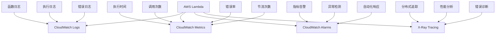
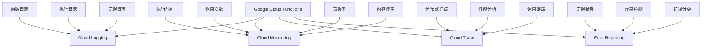

AWS Lambda和Google Cloud Functions是两大主流的无服务器计算服务，它们都提供了丰富的日志与监控功能。然而，由于平台架构和工具链的差异，实现有效的可观测性需要针对每个平台采用不同的策略和工具。本章将深入探讨AWS Lambda和Google Cloud Functions的日志与监控最佳实践。

## AWS Lambda日志与监控

### CloudWatch集成

AWS Lambda与CloudWatch深度集成，提供了全面的日志和监控能力：



### CloudWatch Logs配置

```json
{
  "log_configuration": {
    "log_group_name": "/aws/lambda/my-function",
    "retention_in_days": 14,
    "log_stream_name": "{instance_id}",
    "timestamp_format": "%Y-%m-%dT%H:%M:%S.%f%z",
    "encoding": "utf-8",
    "multiline_start_pattern": "^{",
    "auto_removal": false
  },
  "subscription_filters": [
    {
      "filter_name": "ErrorFilter",
      "filter_pattern": "?ERROR ?Exception ?Failed",
      "destination_arn": "arn:aws:firehose:us-west-2:123456789012:deliverystream/error-logs-stream"
    },
    {
      "filter_name": "BusinessEventFilter",
      "filter_pattern": "?BUSINESS_EVENT",
      "destination_arn": "arn:aws:firehose:us-west-2:123456789012:deliverystream/business-events-stream"
    }
  ]
}
```

### CloudWatch指标监控

```python
# AWS Lambda CloudWatch指标监控
import boto3
import json
from datetime import datetime, timedelta

class LambdaMonitor:
    def __init__(self, region_name='us-west-2'):
        self.cloudwatch = boto3.client('cloudwatch', region_name=region_name)
        self.logs = boto3.client('logs', region_name=region_name)
        
    def get_function_metrics(self, function_name, hours=24):
        """获取函数指标"""
        end_time = datetime.utcnow()
        start_time = end_time - timedelta(hours=hours)
        
        # 定义要查询的指标
        metrics = [
            {
                'metric_name': 'Invocations',
                'statistics': ['Sum']
            },
            {
                'metric_name': 'Errors',
                'statistics': ['Sum']
            },
            {
                'metric_name': 'Duration',
                'statistics': ['Average', 'Maximum', 'Minimum']
            },
            {
                'metric_name': 'Throttles',
                'statistics': ['Sum']
            }
        ]
        
        results = {}
        
        for metric in metrics:
            response = self.cloudwatch.get_metric_statistics(
                Namespace='AWS/Lambda',
                MetricName=metric['metric_name'],
                Dimensions=[
                    {
                        'Name': 'FunctionName',
                        'Value': function_name
                    }
                ],
                StartTime=start_time,
                EndTime=end_time,
                Period=3600,  # 1小时聚合
                Statistics=metric['statistics']
            )
            
            results[metric['metric_name']] = response['Datapoints']
            
        return results
        
    def create_alarms(self, function_name):
        """为函数创建告警"""
        alarms = [
            {
                'alarm_name': f'{function_name}-HighErrorRate',
                'metric_name': 'Errors',
                'threshold': 5,
                'comparison_operator': 'GreaterThanThreshold',
                'evaluation_periods': 2,
                'alarm_description': f'High error rate for function {function_name}'
            },
            {
                'alarm_name': f'{function_name}-HighDuration',
                'metric_name': 'Duration',
                'threshold': 10000,  # 10秒
                'comparison_operator': 'GreaterThanThreshold',
                'evaluation_periods': 2,
                'alarm_description': f'High duration for function {function_name}',
                'statistic': 'Average'
            },
            {
                'alarm_name': f'{function_name}-HighThrottles',
                'metric_name': 'Throttles',
                'threshold': 10,
                'comparison_operator': 'GreaterThanThreshold',
                'evaluation_periods': 2,
                'alarm_description': f'High throttles for function {function_name}'
            }
        ]
        
        for alarm in alarms:
            self._create_alarm(function_name, alarm)
            
    def _create_alarm(self, function_name, alarm_config):
        """创建单个告警"""
        try:
            self.cloudwatch.put_metric_alarm(
                AlarmName=alarm_config['alarm_name'],
                AlarmDescription=alarm_config['alarm_description'],
                MetricName=alarm_config['metric_name'],
                Namespace='AWS/Lambda',
                Statistic=alarm_config.get('statistic', 'Sum'),
                Period=300,  # 5分钟
                EvaluationPeriods=alarm_config['evaluation_periods'],
                Threshold=alarm_config['threshold'],
                ComparisonOperator=alarm_config['comparison_operator'],
                AlarmActions=[
                    # 添加SNS主题ARN以接收告警通知
                    # 'arn:aws:sns:us-west-2:123456789012:lambda-alerts'
                ],
                OKActions=[
                    # 添加恢复正常通知
                ],
                Dimensions=[
                    {
                        'Name': 'FunctionName',
                        'Value': function_name
                    }
                ]
            )
            
            print(f"Created alarm: {alarm_config['alarm_name']}")
            
        except Exception as e:
            print(f"Error creating alarm {alarm_config['alarm_name']}: {e}")
            
    def analyze_error_logs(self, function_name, hours=24):
        """分析错误日志"""
        log_group_name = f'/aws/lambda/{function_name}'
        end_time = datetime.utcnow()
        start_time = end_time - timedelta(hours=hours)
        
        # 使用Logs Insights查询错误日志
        query = """
        fields @timestamp, @message, @logStream
        | filter @message like /ERROR/ or @message like /Exception/
        | sort @timestamp desc
        | limit 100
        """
        
        try:
            response = self.logs.start_query(
                logGroupName=log_group_name,
                startTime=int(start_time.timestamp() * 1000),
                endTime=int(end_time.timestamp() * 1000),
                queryString=query
            )
            
            query_id = response['queryId']
            
            # 获取查询结果
            results = self._get_query_results(query_id)
            return self._analyze_error_patterns(results)
            
        except Exception as e:
            print(f"Error analyzing logs: {e}")
            return None
            
    def _get_query_results(self, query_id):
        """获取查询结果"""
        while True:
            response = self.logs.get_query_results(queryId=query_id)
            if response['status'] == 'Complete':
                return response['results']
            elif response['status'] in ['Failed', 'Cancelled']:
                raise Exception(f"Query failed: {response['status']}")
                
    def _analyze_error_patterns(self, log_results):
        """分析错误模式"""
        error_patterns = {}
        
        for result in log_results:
            # 解析日志内容
            message_field = next((field for field in result if field['field'] == '@message'), None)
            if message_field:
                message = message_field['value']
                # 提取错误类型和相关信息
                error_key = self._extract_error_key(message)
                if error_key in error_patterns:
                    error_patterns[error_key]['count'] += 1
                else:
                    error_patterns[error_key] = {
                        'count': 1,
                        'sample_message': message,
                        'first_occurrence': None,
                        'last_occurrence': None
                    }
                    
        return error_patterns
        
    def _extract_error_key(self, message):
        """从错误消息中提取关键信息"""
        # 实现错误消息解析逻辑
        if 'DatabaseError' in message:
            return 'DatabaseError'
        elif 'NetworkError' in message:
            return 'NetworkError'
        elif 'ValidationError' in message:
            return 'ValidationError'
        elif 'TimeoutError' in message:
            return 'TimeoutError'
        else:
            return 'UnknownError'

# 使用示例
def lambda_handler(event, context):
    # 函数逻辑
    return {
        'statusCode': 200,
        'body': json.dumps('Hello from Lambda!')
    }

# 监控示例
monitor = LambdaMonitor()
function_name = 'my-test-function'

# 获取指标
metrics = monitor.get_function_metrics(function_name)
print("Function Metrics:", metrics)

# 创建告警
monitor.create_alarms(function_name)

# 分析错误日志
error_patterns = monitor.analyze_error_logs(function_name)
print("Error Patterns:", error_patterns)
```

### 高级监控配置

```python
# AWS Lambda高级监控配置
import boto3
from datetime import datetime, timedelta

class AdvancedLambdaMonitor:
    def __init__(self, region_name='us-west-2'):
        self.cloudwatch = boto3.client('cloudwatch', region_name=region_name)
        self.logs = boto3.client('logs', region_name=region_name)
        self.xray = boto3.client('xray', region_name=region_name)
        
    def setup_custom_metrics(self, function_name):
        """设置自定义业务指标"""
        # 创建自定义指标命名空间
        namespace = f'Custom/Lambda/{function_name}'
        
        # 示例：报告业务价值指标
        def report_business_value(value, currency='USD'):
            self.cloudwatch.put_metric_data(
                Namespace=namespace,
                MetricData=[
                    {
                        'MetricName': 'BusinessValue',
                        'Value': value,
                        'Unit': 'Count',
                        'Dimensions': [
                            {
                                'Name': 'Currency',
                                'Value': currency
                            }
                        ]
                    }
                ]
            )
            
        # 示例：报告用户活动指标
        def report_user_activity(user_id, action):
            self.cloudwatch.put_metric_data(
                Namespace=namespace,
                MetricData=[
                    {
                        'MetricName': 'UserActivity',
                        'Value': 1,
                        'Unit': 'Count',
                        'Dimensions': [
                            {
                                'Name': 'UserId',
                                'Value': user_id
                            },
                            {
                                'Name': 'Action',
                                'Value': action
                            }
                        ]
                    }
                ]
            )
            
        return {
            'report_business_value': report_business_value,
            'report_user_activity': report_user_activity
        }
        
    def create_anomaly_detector(self, function_name, metric_name='Duration'):
        """创建异常检测器"""
        try:
            response = self.cloudwatch.put_anomaly_detector(
                MetricName=metric_name,
                Namespace='AWS/Lambda',
                Dimensions=[
                    {
                        'Name': 'FunctionName',
                        'Value': function_name
                    }
                ],
                Stat='Average',
                Configuration={
                    'ExcludedTimeRanges': [
                        {
                            'StartTime': '2025-08-31T00:00:00Z',
                            'EndTime': '2025-08-31T06:00:00Z'
                        }
                    ],
                    'MetricTimezone': '+0000'
                }
            )
            
            print(f"Created anomaly detector for {function_name} - {metric_name}")
            return response
            
        except Exception as e:
            print(f"Error creating anomaly detector: {e}")
            
    def get_xray_traces(self, function_name, hours=24):
        """获取X-Ray追踪数据"""
        end_time = datetime.utcnow()
        start_time = end_time - timedelta(hours=hours)
        
        try:
            response = self.xray.get_trace_summaries(
                StartTime=start_time,
                EndTime=end_time,
                FilterExpression=f'service(id(name: "{function_name}")'
            )
            
            return response.get('TraceSummaries', [])
            
        except Exception as e:
            print(f"Error getting X-Ray traces: {e}")
            return []
            
    def setup_log_retention(self, function_name, retention_days=30):
        """设置日志保留策略"""
        log_group_name = f'/aws/lambda/{function_name}'
        
        try:
            self.logs.put_retention_policy(
                logGroupName=log_group_name,
                retentionInDays=retention_days
            )
            
            print(f"Set log retention to {retention_days} days for {log_group_name}")
            
        except Exception as e:
            print(f"Error setting log retention: {e}")
            
    def create_dashboard(self, function_name):
        """创建CloudWatch仪表板"""
        dashboard_name = f'Lambda-{function_name}-Dashboard'
        dashboard_body = {
            "widgets": [
                {
                    "type": "metric",
                    "x": 0,
                    "y": 0,
                    "width": 12,
                    "height": 6,
                    "properties": {
                        "metrics": [
                            ["AWS/Lambda", "Invocations", "FunctionName", function_name],
                            ["AWS/Lambda", "Errors", "FunctionName", function_name]
                        ],
                        "view": "timeSeries",
                        "stacked": False,
                        "region": "us-west-2",
                        "title": "Invocations and Errors",
                        "period": 300
                    }
                },
                {
                    "type": "metric",
                    "x": 12,
                    "y": 0,
                    "width": 12,
                    "height": 6,
                    "properties": {
                        "metrics": [
                            ["AWS/Lambda", "Duration", "FunctionName", function_name, {"stat": "Average"}],
                            ["AWS/Lambda", "Duration", "FunctionName", function_name, {"stat": "Maximum"}]
                        ],
                        "view": "timeSeries",
                        "stacked": False,
                        "region": "us-west-2",
                        "title": "Duration",
                        "period": 300
                    }
                }
            ]
        }
        
        try:
            self.cloudwatch.put_dashboard(
                DashboardName=dashboard_name,
                DashboardBody=json.dumps(dashboard_body)
            )
            
            print(f"Created dashboard: {dashboard_name}")
            
        except Exception as e:
            print(f"Error creating dashboard: {e}")

# 使用示例
advanced_monitor = AdvancedLambdaMonitor()
function_name = 'my-advanced-function'

# 设置自定义指标
custom_metrics = advanced_monitor.setup_custom_metrics(function_name)

# 报告业务指标
custom_metrics['report_business_value'](1000.0, 'USD')
custom_metrics['report_user_activity']('user123', 'login')

# 创建异常检测器
advanced_monitor.create_anomaly_detector(function_name, 'Duration')

# 设置日志保留策略
advanced_monitor.setup_log_retention(function_name, 90)

# 创建仪表板
advanced_monitor.create_dashboard(function_name)
```

## Google Cloud Functions日志与监控

### Cloud Logging集成

Google Cloud Functions与Cloud Logging（原Stackdriver Logging）深度集成：



### Cloud Logging配置

```python
# Google Cloud Functions日志记录
import json
import logging
from datetime import datetime
from google.cloud import logging as cloud_logging
from google.cloud.logging_v2.resource import Resource

class GCFLogger:
    def __init__(self, function_name):
        self.function_name = function_name
        self.logger = logging.getLogger(f'gcf.{function_name}')
        self.logger.setLevel(logging.INFO)
        
        # 配置Google Cloud Logging
        self.client = cloud_logging.Client()
        self.client.setup_logging()
        
    def log_request_start(self, execution_id, request_data=None):
        """记录请求开始"""
        log_entry = {
            'severity': 'INFO',
            'message': 'REQUEST_START',
            'execution_id': execution_id,
            'function_name': self.function_name,
            'timestamp': datetime.utcnow().isoformat(),
            'request_data': request_data
        }
        
        self.logger.info(json.dumps(log_entry))
        
    def log_business_event(self, event_type, data, execution_id):
        """记录业务事件"""
        log_entry = {
            'severity': 'INFO',
            'message': 'BUSINESS_EVENT',
            'event_type': event_type,
            'execution_id': execution_id,
            'function_name': self.function_name,
            'timestamp': datetime.utcnow().isoformat(),
            'data': data
        }
        
        self.logger.info(json.dumps(log_entry))
        
    def log_performance_metric(self, metric_name, value, execution_id, unit='ms'):
        """记录性能指标"""
        log_entry = {
            'severity': 'INFO',
            'message': 'PERFORMANCE_METRIC',
            'metric_name': metric_name,
            'value': value,
            'unit': unit,
            'execution_id': execution_id,
            'function_name': self.function_name,
            'timestamp': datetime.utcnow().isoformat()
        }
        
        self.logger.info(json.dumps(log_entry))
        
    def log_error(self, error_type, message, execution_id, traceback=None):
        """记录错误"""
        log_entry = {
            'severity': 'ERROR',
            'message': 'ERROR',
            'error_type': error_type,
            'error_message': message,
            'execution_id': execution_id,
            'function_name': self.function_name,
            'timestamp': datetime.utcnow().isoformat()
        }
        
        if traceback:
            log_entry['traceback'] = traceback
            
        self.logger.error(json.dumps(log_entry))
        
    def log_request_end(self, execution_id, duration):
        """记录请求结束"""
        log_entry = {
            'severity': 'INFO',
            'message': 'REQUEST_END',
            'execution_id': execution_id,
            'function_name': self.function_name,
            'duration': duration,
            'timestamp': datetime.utcnow().isoformat()
        }
        
        self.logger.info(json.dumps(log_entry))

# 使用示例
def cloud_function(request):
    import functions_framework
    
    # 获取执行ID
    execution_id = request.headers.get('Function-Execution-Id', 'unknown')
    
    # 初始化日志记录器
    logger = GCFLogger('my-cloud-function')
    
    try:
        logger.log_request_start(execution_id, {
            'method': request.method,
            'url': request.url
        })
        
        # 记录业务事件
        logger.log_business_event('HttpRequest', {
            'method': request.method,
            'path': request.path
        }, execution_id)
        
        # 模拟业务处理
        start_time = datetime.utcnow()
        # ... 业务逻辑 ...
        end_time = datetime.utcnow()
        duration = (end_time - start_time).total_seconds() * 1000
        
        # 记录性能指标
        logger.log_performance_metric('ProcessingTime', duration, execution_id)
        
        # 记录请求结束
        logger.log_request_end(execution_id, duration)
        
        return 'Success', 200
        
    except Exception as e:
        logger.log_error('ProcessingError', str(e), execution_id)
        return 'Error', 500
```

### Cloud Monitoring集成

```python
# Google Cloud Functions监控
from google.cloud import monitoring_v3
from google.api import metric_pb2 as ga_metric
from google.api import label_pb2 as ga_label
from google.cloud.monitoring_v3 import types
import time

class GCFMonitor:
    def __init__(self, project_id):
        self.project_id = project_id
        self.client = monitoring_v3.MetricServiceClient()
        self.project_name = f"projects/{project_id}"
        
    def create_custom_metric(self, metric_type, metric_name, description):
        """创建自定义指标"""
        descriptor = ga_metric.MetricDescriptor()
        descriptor.type = f"custom.googleapis.com/{metric_type}"
        descriptor.metric_kind = ga_metric.MetricDescriptor.MetricKind.GAUGE
        descriptor.value_type = ga_metric.MetricDescriptor.ValueType.DOUBLE
        descriptor.description = description
        descriptor.unit = "1"
        descriptor.display_name = metric_name
        
        # 添加标签
        label = ga_label.LabelDescriptor()
        label.key = "function_name"
        label.value_type = ga_label.LabelDescriptor.ValueType.STRING
        label.description = "The name of the Cloud Function"
        descriptor.labels.append(label)
        
        request = {
            "name": self.project_name,
            "metric_descriptor": descriptor,
        }
        
        try:
            self.client.create_metric_descriptor(request=request)
            print(f"Created custom metric: {descriptor.type}")
        except Exception as e:
            print(f"Error creating custom metric: {e}")
            
    def report_metric(self, metric_type, value, labels=None):
        """报告指标值"""
        series = monitoring_v3.TimeSeries()
        series.metric.type = f"custom.googleapis.com/{metric_type}"
        
        if labels:
            series.metric.labels.update(labels)
            
        series.resource.type = "global"
        
        point = monitoring_v3.Point()
        point.value.double_value = value
        
        now = time.time()
        point.interval = monitoring_v3.TimeInterval(
            {"end_time": {"seconds": int(now), "nanos": int((now - int(now)) * 10**9)}}
        )
        
        series.points = [point]
        
        request = {
            "name": self.project_name,
            "time_series": [series],
        }
        
        try:
            self.client.create_time_series(request=request)
        except Exception as e:
            print(f"Error reporting metric: {e}")
            
    def get_function_metrics(self, function_name, metric_type, hours=24):
        """获取函数指标"""
        # 计算时间范围
        end_time = time.time()
        start_time = end_time - (hours * 3600)
        
        # 构建查询
        interval = monitoring_v3.TimeInterval(
            {
                "end_time": {"seconds": int(end_time)},
                "start_time": {"seconds": int(start_time)},
            }
        )
        
        # 查询指标
        aggregation = monitoring_v3.Aggregation(
            {
                "alignment_period": {"seconds": 3600},  # 1小时
                "per_series_aligner": monitoring_v3.Aggregation.Aligner.ALIGN_MEAN,
                "cross_series_reducer": monitoring_v3.Aggregation.Reducer.REDUCE_NONE,
            }
        )
        
        try:
            results = self.client.list_time_series(
                request={
                    "name": self.project_name,
                    "filter": f'metric.type = "{metric_type}" AND metric.labels.function_name = "{function_name}"',
                    "interval": interval,
                    "view": monitoring_v3.ListTimeSeriesRequest.TimeSeriesView.FULL,
                    "aggregation": aggregation,
                }
            )
            
            return list(results)
            
        except Exception as e:
            print(f"Error getting metrics: {e}")
            return []

# 使用示例
monitor = GCFMonitor('my-gcp-project')

# 创建自定义指标
monitor.create_custom_metric(
    'function/business_value',
    'Business Value',
    'Business value generated by the function'
)

# 报告指标
monitor.report_metric(
    'function/business_value',
    1000.0,
    {'function_name': 'my-cloud-function'}
)

# 获取指标
metrics = monitor.get_function_metrics(
    'my-cloud-function',
    'cloudfunctions.googleapis.com/function/execution_times'
)
print("Function metrics:", metrics)
```

### Cloud Trace集成

```python
# Google Cloud Functions追踪
from opentelemetry import trace
from opentelemetry.sdk.trace import TracerProvider
from opentelemetry.sdk.trace.export import BatchSpanProcessor
from opentelemetry.exporter.cloud_trace import CloudTraceSpanExporter
from opentelemetry.trace import SpanKind, Status, StatusCode
import functions_framework

# 初始化OpenTelemetry
provider = TracerProvider()
cloud_trace_exporter = CloudTraceSpanExporter()
provider.add_span_processor(BatchSpanProcessor(cloud_trace_exporter))
trace.set_tracer_provider(provider)

tracer = trace.get_tracer(__name__)

class GCFTracer:
    def __init__(self, function_name):
        self.function_name = function_name
        self.tracer = tracer
        
    def trace_function_execution(self, func):
        """装饰器：追踪函数执行"""
        def wrapper(*args, **kwargs):
            with self.tracer.start_as_current_span(f"Function-{self.function_name}") as span:
                span.set_attribute('function.name', self.function_name)
                span.set_attribute('gcp.project_id', 'my-gcp-project')
                
                # 如果是HTTP函数，添加请求信息
                if args and hasattr(args[0], 'method'):
                    span.set_attribute('http.method', args[0].method)
                    span.set_attribute('http.url', str(args[0].url))
                
                try:
                    result = func(*args, **kwargs)
                    span.set_status(Status(StatusCode.OK))
                    return result
                except Exception as e:
                    span.set_status(Status(StatusCode.ERROR, str(e)))
                    span.record_exception(e)
                    raise
                    
        return wrapper
        
    def trace_database_operation(self, operation_name, query):
        """追踪数据库操作"""
        def decorator(func):
            def wrapper(*args, **kwargs):
                with self.tracer.start_as_current_span(f"DB-{operation_name}", kind=SpanKind.CLIENT) as span:
                    span.set_attribute('db.system', 'postgresql')  # 或其他数据库
                    span.set_attribute('db.operation', operation_name)
                    span.set_attribute('db.statement', query[:1000])  # 限制长度
                    
                    start_time = time.time()
                    try:
                        result = func(*args, **kwargs)
                        duration = (time.time() - start_time) * 1000  # 转换为毫秒
                        
                        span.set_attribute('db.duration', duration)
                        
                        if isinstance(result, list):
                            span.set_attribute('db.result_count', len(result))
                            
                        span.set_status(Status(StatusCode.OK))
                        return result
                    except Exception as e:
                        span.set_status(Status(StatusCode.ERROR, str(e)))
                        span.record_exception(e)
                        raise
                        
            return wrapper
        return decorator

# 使用示例
gcf_tracer = GCFTracer('my-cloud-function')

@gcf_tracer.trace_function_execution
@functions_framework.http
def http_function(request):
    try:
        # 追踪数据库操作
        user_data = get_user_data(request.args.get('user_id', '123'))
        
        return {'user': user_data}, 200
    except Exception as e:
        return {'error': str(e)}, 500

@gcf_tracer.trace_database_operation('get_user_data', 'SELECT * FROM users WHERE id = %s')
def get_user_data(user_id):
    # 模拟数据库查询
    time.sleep(0.1)  # 模拟查询延迟
    return {'id': user_id, 'name': 'John Doe'}
```

## 跨平台监控策略

### 统一监控架构

```yaml
# 跨平台统一监控架构
cross_platform_monitoring:
  data_collection:
    description: "数据收集层"
    components:
      - PlatformNativeIntegration: 平台原生集成
      - OpenTelemetryInstrumentation: OpenTelemetry仪器化
      - CustomMetricCollection: 自定义指标收集
      - LogAggregation: 日志聚合
      
  data_processing:
    description: "数据处理层"
    components:
      - MetricNormalization: 指标标准化
      - LogParsing: 日志解析
      - TraceCorrelation: 追踪关联
      - AnomalyDetection: 异常检测
      
  data_storage:
    description: "数据存储层"
    components:
      - TimeSeriesDatabase: 时序数据库
      - LogStorage: 日志存储
      - TraceStorage: 追踪存储
      - MetadataStorage: 元数据存储
      
  visualization:
    description: "可视化层"
    components:
      - UnifiedDashboard: 统一仪表板
      - AlertingSystem: 告警系统
      - ReportingEngine: 报告引擎
      - AnalyticsPlatform: 分析平台
```

### 统一日志格式

```python
# 统一日志格式实现
import json
import logging
from datetime import datetime
from abc import ABC, abstractmethod

class UnifiedLogger(ABC):
    """统一日志记录器抽象基类"""
    
    def __init__(self, service_name, version='1.0.0'):
        self.service_name = service_name
        self.version = version
        
    @abstractmethod
    def log_request_start(self, context, request_data=None):
        pass
        
    @abstractmethod
    def log_business_event(self, event_type, data, context):
        pass
        
    @abstractmethod
    def log_performance_metric(self, metric_name, value, context, unit='ms'):
        pass
        
    @abstractmethod
    def log_error(self, error_type, message, context, traceback=None):
        pass
        
    @abstractmethod
    def log_request_end(self, context, duration):
        pass

class AWSLambdaUnifiedLogger(UnifiedLogger):
    """AWS Lambda统一日志记录器"""
    
    def __init__(self, service_name, version='1.0.0'):
        super().__init__(service_name, version)
        self.logger = logging.getLogger(f'aws.lambda.{service_name}')
        self.logger.setLevel(logging.INFO)
        
    def log_request_start(self, context, request_data=None):
        log_entry = {
            'timestamp': datetime.utcnow().isoformat(),
            'service': self.service_name,
            'version': self.version,
            'event_type': 'REQUEST_START',
            'request_id': context.aws_request_id,
            'function_name': context.function_name,
            'request_data': request_data
        }
        self.logger.info(json.dumps(log_entry))
        
    def log_business_event(self, event_type, data, context):
        log_entry = {
            'timestamp': datetime.utcnow().isoformat(),
            'service': self.service_name,
            'version': self.version,
            'event_type': 'BUSINESS_EVENT',
            'business_event_type': event_type,
            'request_id': context.aws_request_id,
            'data': data
        }
        self.logger.info(json.dumps(log_entry))
        
    def log_performance_metric(self, metric_name, value, context, unit='ms'):
        log_entry = {
            'timestamp': datetime.utcnow().isoformat(),
            'service': self.service_name,
            'version': self.version,
            'event_type': 'PERFORMANCE_METRIC',
            'metric_name': metric_name,
            'value': value,
            'unit': unit,
            'request_id': context.aws_request_id
        }
        self.logger.info(json.dumps(log_entry))
        
    def log_error(self, error_type, message, context, traceback=None):
        log_entry = {
            'timestamp': datetime.utcnow().isoformat(),
            'service': self.service_name,
            'version': self.version,
            'event_type': 'ERROR',
            'error_type': error_type,
            'message': message,
            'request_id': context.aws_request_id
        }
        if traceback:
            log_entry['traceback'] = traceback
        self.logger.error(json.dumps(log_entry))
        
    def log_request_end(self, context, duration):
        log_entry = {
            'timestamp': datetime.utcnow().isoformat(),
            'service': self.service_name,
            'version': self.version,
            'event_type': 'REQUEST_END',
            'request_id': context.aws_request_id,
            'duration': duration
        }
        self.logger.info(json.dumps(log_entry))

class GCPFunctionUnifiedLogger(UnifiedLogger):
    """GCP Cloud Function统一日志记录器"""
    
    def __init__(self, service_name, version='1.0.0'):
        super().__init__(service_name, version)
        self.logger = logging.getLogger(f'gcp.function.{service_name}')
        self.logger.setLevel(logging.INFO)
        
    def log_request_start(self, context, request_data=None):
        execution_id = getattr(context, 'execution_id', 'unknown')
        log_entry = {
            'timestamp': datetime.utcnow().isoformat(),
            'service': self.service_name,
            'version': self.version,
            'event_type': 'REQUEST_START',
            'execution_id': execution_id,
            'request_data': request_data
        }
        self.logger.info(json.dumps(log_entry))
        
    def log_business_event(self, event_type, data, context):
        execution_id = getattr(context, 'execution_id', 'unknown')
        log_entry = {
            'timestamp': datetime.utcnow().isoformat(),
            'service': self.service_name,
            'version': self.version,
            'event_type': 'BUSINESS_EVENT',
            'business_event_type': event_type,
            'execution_id': execution_id,
            'data': data
        }
        self.logger.info(json.dumps(log_entry))
        
    def log_performance_metric(self, metric_name, value, context, unit='ms'):
        execution_id = getattr(context, 'execution_id', 'unknown')
        log_entry = {
            'timestamp': datetime.utcnow().isoformat(),
            'service': self.service_name,
            'version': self.version,
            'event_type': 'PERFORMANCE_METRIC',
            'metric_name': metric_name,
            'value': value,
            'unit': unit,
            'execution_id': execution_id
        }
        self.logger.info(json.dumps(log_entry))
        
    def log_error(self, error_type, message, context, traceback=None):
        execution_id = getattr(context, 'execution_id', 'unknown')
        log_entry = {
            'timestamp': datetime.utcnow().isoformat(),
            'service': self.service_name,
            'version': self.version,
            'event_type': 'ERROR',
            'error_type': error_type,
            'message': message,
            'execution_id': execution_id
        }
        if traceback:
            log_entry['traceback'] = traceback
        self.logger.error(json.dumps(log_entry))
        
    def log_request_end(self, context, duration):
        execution_id = getattr(context, 'execution_id', 'unknown')
        log_entry = {
            'timestamp': datetime.utcnow().isoformat(),
            'service': self.service_name,
            'version': self.version,
            'event_type': 'REQUEST_END',
            'execution_id': execution_id,
            'duration': duration
        }
        self.logger.info(json.dumps(log_entry))

# 使用示例
def lambda_handler(event, context):
    logger = AWSLambdaUnifiedLogger('UserService', '1.2.0')
    
    try:
        logger.log_request_start(context, event)
        logger.log_business_event('UserLogin', {'userId': 'user123'}, context)
        
        start_time = datetime.utcnow()
        # ... 业务逻辑 ...
        end_time = datetime.utcnow()
        duration = (end_time - start_time).total_seconds() * 1000
        
        logger.log_performance_metric('ProcessingTime', duration, context)
        logger.log_request_end(context, duration)
        
        return {'statusCode': 200, 'body': 'Success'}
    except Exception as e:
        logger.log_error('ProcessingError', str(e), context)
        raise

def gcp_function(request):
    class MockContext:
        def __init__(self, execution_id):
            self.execution_id = execution_id
    
    context = MockContext(request.headers.get('Function-Execution-Id', 'unknown'))
    logger = GCPFunctionUnifiedLogger('UserService', '1.2.0')
    
    try:
        logger.log_request_start(context, {
            'method': request.method,
            'url': request.url
        })
        logger.log_business_event('UserLogin', {'userId': 'user123'}, context)
        
        start_time = datetime.utcnow()
        # ... 业务逻辑 ...
        end_time = datetime.utcnow()
        duration = (end_time - start_time).total_seconds() * 1000
        
        logger.log_performance_metric('ProcessingTime', duration, context)
        logger.log_request_end(context, duration)
        
        return 'Success', 200
    except Exception as e:
        logger.log_error('ProcessingError', str(e), context)
        return 'Error', 500
```

## 最佳实践总结

### 1. 日志管理最佳实践

```yaml
# 日志管理最佳实践
logging_best_practices:
  structured_logging:
    guidelines:
      - "使用JSON格式记录结构化日志"
      - "包含请求ID和执行ID"
      - "添加时间戳和严重级别"
      - "包含业务上下文信息"
      
  log_retention:
    guidelines:
      - "设置合理的日志保留期限"
      - "定期清理过期日志"
      - "归档重要日志数据"
      - "控制日志存储成本"
      
  sensitive_data:
    guidelines:
      - "避免记录密码和密钥"
      - "实施数据脱敏策略"
      - "使用日志过滤器"
      - "加密敏感日志数据"
```

### 2. 监控配置最佳实践

```yaml
# 监控配置最佳实践
monitoring_best_practices:
  metric_selection:
    guidelines:
      - "选择关键业务指标"
      - "平衡监控成本和价值"
      - "实施分层监控策略"
      - "定期审查指标有效性"
      
  alerting:
    guidelines:
      - "设置合理的告警阈值"
      - "避免告警疲劳"
      - "实施告警分层"
      - "提供清晰的告警信息"
      
  dashboard:
    guidelines:
      - "设计直观的仪表板"
      - "包含关键性能指标"
      - "提供历史趋势分析"
      - "支持自定义视图"
```

## 总结

AWS Lambda和Google Cloud Functions都提供了强大的日志与监控功能，但各有特色。AWS Lambda与CloudWatch深度集成，提供了丰富的指标和告警功能；Google Cloud Functions则与Cloud Logging、Cloud Monitoring等服务紧密集成，提供了统一的监控体验。

关键要点包括：
1. **平台集成**：充分利用云服务商提供的原生日志和监控工具
2. **自定义指标**：根据业务需求创建自定义监控指标
3. **统一策略**：在多云环境中实施统一的监控策略
4. **最佳实践**：遵循日志记录和监控的最佳实践

通过合理配置和使用这些工具，我们可以构建强大的无服务器函数可观测性体系，确保应用的可靠性和性能。

在下一章中，我们将探讨未来微服务架构中的可观察性发展趋势。