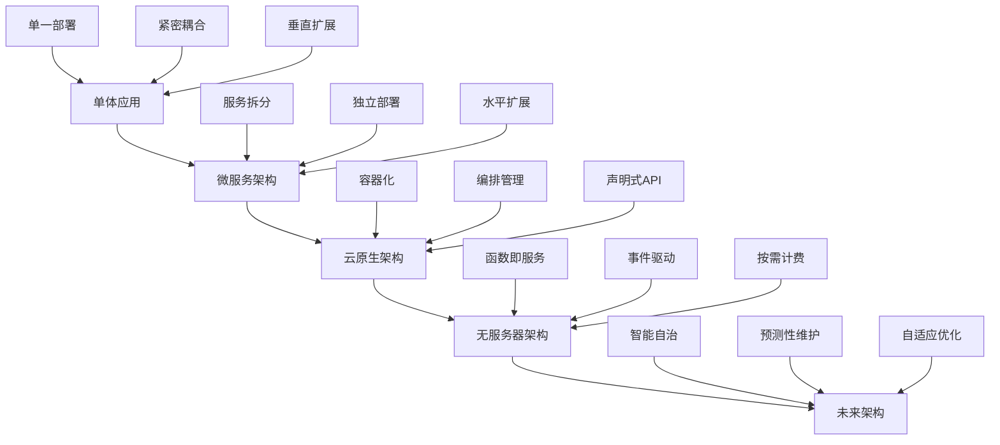
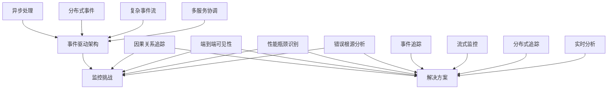

随着技术的不断发展，微服务架构正在经历深刻的变革。从传统的单体应用到分布式微服务，再到无服务器架构，应用架构的演进对可观察性提出了越来越高的要求。本章将探讨未来微服务架构中的可观察性发展趋势，包括事件驱动架构、零信任安全模型、人工智能驱动的智能监控，以及量子计算对日志监控的潜在影响。

## 微服务架构的演进趋势

### 从微服务到云原生

微服务架构正在向更加云原生的方向发展：



### 未来架构特征

```yaml
# 未来微服务架构特征
future_architecture_characteristics:
  autonomous_systems:
    description: "自治系统"
    features:
      - 自我修复能力
      - 自动扩展收缩
      - 智能资源调度
      - 预测性维护
      
  event_driven:
    description: "事件驱动"
    features:
      - 异步通信模式
      - 实时数据处理
      - 事件溯源架构
      - 流式处理能力
      
  zero_trust:
    description: "零信任安全"
    features:
      - 持续身份验证
      - 动态访问控制
      - 微隔离网络
      - 端到端加密
      
  ai_native:
    description: "AI原生"
    features:
      - 内置AI能力
      - 智能决策系统
      - 自适应优化
      - 预测性分析
```

## 事件驱动架构的可观察性

### 事件驱动架构特点

事件驱动架构（Event-Driven Architecture, EDA）正在成为微服务架构的重要发展方向：

```yaml
# 事件驱动架构特点
event_driven_architecture_features:
  asynchronous_communication:
    description: "异步通信"
    advantages:
      - 松耦合设计
      - 提高系统弹性
      - 支持水平扩展
      - 改善响应时间
      
  event_sourcing:
    description: "事件溯源"
    advantages:
      - 完整状态历史
      - 审计能力增强
      - 数据一致性保证
      - 支持时间旅行
      
  stream_processing:
    description: "流式处理"
    advantages:
      - 实时数据处理
      - 低延迟响应
      - 持续数据集成
      - 复杂事件处理
      
  scalability:
    description: "可扩展性"
    advantages:
      - 独立服务扩展
      - 负载均衡优化
      - 资源利用率提升
      - 成本效益改善
```

### 事件驱动架构的监控挑战



### 事件追踪实现

```python
# 事件驱动架构事件追踪实现
import uuid
import json
from datetime import datetime
from typing import Dict, Any, List
import asyncio

class EventTracker:
    def __init__(self, service_name: str):
        self.service_name = service_name
        self.event_store = {}  # 简化的事件存储
        
    def create_event_trace(self, event_type: str, payload: Dict[str, Any]) -> str:
        """创建事件追踪"""
        trace_id = str(uuid.uuid4())
        
        event_trace = {
            'trace_id': trace_id,
            'event_type': event_type,
            'service_name': self.service_name,
            'timestamp': datetime.utcnow().isoformat(),
            'payload': payload,
            'status': 'created',
            'children': []
        }
        
        self.event_store[trace_id] = event_trace
        self._log_event(event_trace, 'EVENT_CREATED')
        
        return trace_id
        
    def track_event_processing(self, trace_id: str, processing_info: Dict[str, Any]):
        """追踪事件处理"""
        if trace_id not in self.event_store:
            raise ValueError(f"Trace ID {trace_id} not found")
            
        event_trace = self.event_store[trace_id]
        event_trace['processing_info'] = processing_info
        event_trace['status'] = 'processing'
        
        self._log_event(event_trace, 'EVENT_PROCESSING')
        
    def track_event_completion(self, trace_id: str, result: Dict[str, Any]):
        """追踪事件完成"""
        if trace_id not in self.event_store:
            raise ValueError(f"Trace ID {trace_id} not found")
            
        event_trace = self.event_store[trace_id]
        event_trace['result'] = result
        event_trace['status'] = 'completed'
        event_trace['completed_at'] = datetime.utcnow().isoformat()
        
        self._log_event(event_trace, 'EVENT_COMPLETED')
        
    def track_event_error(self, trace_id: str, error: Exception):
        """追踪事件错误"""
        if trace_id not in self.event_store:
            raise ValueError(f"Trace ID {trace_id} not found")
            
        event_trace = self.event_store[trace_id]
        event_trace['status'] = 'error'
        event_trace['error'] = {
            'type': type(error).__name__,
            'message': str(error),
            'timestamp': datetime.utcnow().isoformat()
        }
        
        self._log_event(event_trace, 'EVENT_ERROR')
        
    def track_child_event(self, parent_trace_id: str, child_event_type: str, 
                         child_payload: Dict[str, Any]) -> str:
        """追踪子事件"""
        if parent_trace_id not in self.event_store:
            raise ValueError(f"Parent trace ID {parent_trace_id} not found")
            
        child_trace_id = self.create_event_trace(child_event_type, child_payload)
        
        # 建立父子关系
        parent_trace = self.event_store[parent_trace_id]
        parent_trace['children'].append(child_trace_id)
        
        # 在子事件中记录父事件信息
        child_trace = self.event_store[child_trace_id]
        child_trace['parent_trace_id'] = parent_trace_id
        
        self._log_event({
            'parent_trace_id': parent_trace_id,
            'child_trace_id': child_trace_id,
            'relationship': 'parent-child'
        }, 'EVENT_RELATIONSHIP')
        
        return child_trace_id
        
    def get_event_trace(self, trace_id: str) -> Dict[str, Any]:
        """获取事件追踪信息"""
        return self.event_store.get(trace_id, {})
        
    def get_trace_tree(self, trace_id: str) -> Dict[str, Any]:
        """获取完整的追踪树"""
        def build_trace_tree(trace_id: str) -> Dict[str, Any]:
            trace = self.get_event_trace(trace_id)
            if not trace:
                return {}
                
            trace_tree = trace.copy()
            trace_tree['children'] = [
                build_trace_tree(child_id) 
                for child_id in trace.get('children', [])
            ]
            
            return trace_tree
            
        return build_trace_tree(trace_id)
        
    def _log_event(self, event_data: Dict[str, Any], log_type: str):
        """记录事件日志"""
        log_entry = {
            'timestamp': datetime.utcnow().isoformat(),
            'service': self.service_name,
            'log_type': log_type,
            'event_data': event_data
        }
        
        print(json.dumps(log_entry))  # 简化的日志输出

# 异步事件处理器示例
class AsyncEventHandler:
    def __init__(self, service_name: str):
        self.service_name = service_name
        self.event_tracker = EventTracker(service_name)
        
    async def handle_user_registration(self, user_data: Dict[str, Any]) -> Dict[str, Any]:
        """处理用户注册事件"""
        # 创建事件追踪
        trace_id = self.event_tracker.create_event_trace('user_registration', user_data)
        
        try:
            # 追踪事件处理
            self.event_tracker.track_event_processing(trace_id, {
                'step': 'validation',
                'timestamp': datetime.utcnow().isoformat()
            })
            
            # 验证用户数据
            await self._validate_user_data(user_data)
            
            # 创建子事件：发送欢迎邮件
            email_trace_id = self.event_tracker.track_child_event(
                trace_id, 
                'send_welcome_email', 
                {'email': user_data.get('email')}
            )
            
            self.event_tracker.track_event_processing(email_trace_id, {
                'step': 'email_sending',
                'timestamp': datetime.utcnow().isoformat()
            })
            
            await self._send_welcome_email(user_data)
            self.event_tracker.track_event_completion(email_trace_id, {
                'status': 'sent',
                'provider': 'smtp'
            })
            
            # 创建子事件：创建用户配置
            config_trace_id = self.event_tracker.track_child_event(
                trace_id,
                'create_user_config',
                {'user_id': user_data.get('user_id')}
            )
            
            await self._create_user_config(user_data)
            self.event_tracker.track_event_completion(config_trace_id, {
                'status': 'created',
                'config_type': 'default'
            })
            
            # 完成主事件
            result = {
                'user_id': user_data.get('user_id'),
                'status': 'registered',
                'timestamp': datetime.utcnow().isoformat()
            }
            
            self.event_tracker.track_event_completion(trace_id, result)
            return result
            
        except Exception as e:
            self.event_tracker.track_event_error(trace_id, e)
            raise
            
    async def _validate_user_data(self, user_data: Dict[str, Any]):
        """验证用户数据"""
        await asyncio.sleep(0.1)  # 模拟验证延迟
        if not user_data.get('email'):
            raise ValueError("Email is required")
            
    async def _send_welcome_email(self, user_data: Dict[str, Any]):
        """发送欢迎邮件"""
        await asyncio.sleep(0.2)  # 模拟邮件发送延迟
        
    async def _create_user_config(self, user_data: Dict[str, Any]):
        """创建用户配置"""
        await asyncio.sleep(0.15)  # 模拟配置创建延迟

# 使用示例
async def main():
    handler = AsyncEventHandler('UserService')
    
    user_data = {
        'user_id': 'user123',
        'email': 'user@example.com',
        'name': 'John Doe'
    }
    
    try:
        result = await handler.handle_user_registration(user_data)
        print("Registration completed:", result)
        
        # 获取完整的追踪树
        trace_tree = handler.event_tracker.get_trace_tree(result.get('trace_id', ''))
        print("Trace tree:", json.dumps(trace_tree, indent=2))
        
    except Exception as e:
        print(f"Registration failed: {e}")

# 运行示例
# asyncio.run(main())
```

## 零信任架构与日志安全

### 零信任安全模型

零信任（Zero Trust）安全模型正在改变微服务架构的安全方法：

```yaml
# 零信任安全模型原则
zero_trust_principles:
  never_trust_always_verify:
    description: "永不信任，始终验证"
    practices:
      - 持续身份验证
      - 动态授权
      - 微隔离
      - 最小权限原则
      
  assume_breach:
    description: "假设已遭入侵"
    practices:
      - 网络分段
      - 行为监控
      - 异常检测
      - 快速响应
      
  least_privilege:
    description: "最小权限"
    practices:
      - 角色基础访问控制
      - 动态权限调整
      - 访问审计
      - 权限回收
      
  continuous_monitoring:
    description: "持续监控"
    practices:
      - 实时威胁检测
      - 行为分析
      - 安全事件响应
      - 合规性监控
```

### 零信任环境中的日志安全

```python
# 零信任环境中的日志安全实现
import hashlib
import hmac
import json
from datetime import datetime, timedelta
from typing import Dict, Any, List
import base64

class ZeroTrustLogger:
    def __init__(self, service_name: str, secret_key: str):
        self.service_name = service_name
        self.secret_key = secret_key.encode('utf-8')
        self.access_log = []
        self.security_log = []
        
    def log_access_event(self, user_id: str, resource: str, action: str, 
                        additional_data: Dict[str, Any] = None):
        """记录访问事件"""
        timestamp = datetime.utcnow()
        
        access_event = {
            'event_id': self._generate_event_id(),
            'timestamp': timestamp.isoformat(),
            'service': self.service_name,
            'user_id': user_id,
            'resource': resource,
            'action': action,
            'additional_data': additional_data or {},
            'event_hash': None,  # 将在签名后填充
            'signature': None    # 将在签名后填充
        }
        
        # 生成事件哈希
        event_hash = self._generate_event_hash(access_event)
        access_event['event_hash'] = event_hash
        
        # 生成数字签名
        signature = self._generate_signature(event_hash)
        access_event['signature'] = signature
        
        self.access_log.append(access_event)
        self._output_log(access_event, 'ACCESS')
        
        # 检查异常行为
        self._check_anomalous_behavior(access_event)
        
    def log_security_event(self, event_type: str, severity: str, 
                          details: Dict[str, Any], affected_resources: List[str] = None):
        """记录安全事件"""
        timestamp = datetime.utcnow()
        
        security_event = {
            'event_id': self._generate_event_id(),
            'timestamp': timestamp.isoformat(),
            'service': self.service_name,
            'event_type': event_type,
            'severity': severity,
            'details': details,
            'affected_resources': affected_resources or [],
            'event_hash': None,
            'signature': None
        }
        
        # 生成事件哈希
        event_hash = self._generate_event_hash(security_event)
        security_event['event_hash'] = event_hash
        
        # 生成数字签名
        signature = self._generate_signature(event_hash)
        security_event['signature'] = signature
        
        self.security_log.append(security_event)
        self._output_log(security_event, 'SECURITY')
        
    def verify_log_integrity(self, log_entry: Dict[str, Any]) -> bool:
        """验证日志完整性"""
        # 保存原始签名和哈希
        original_signature = log_entry.get('signature')
        original_hash = log_entry.get('event_hash')
        
        # 重新生成哈希和签名
        log_copy = log_entry.copy()
        log_copy['signature'] = None
        log_copy['event_hash'] = None
        
        recalculated_hash = self._generate_event_hash(log_copy)
        recalculated_signature = self._generate_signature(recalculated_hash)
        
        # 验证哈希和签名
        return (recalculated_hash == original_hash and 
                recalculated_signature == original_signature)
        
    def get_access_history(self, user_id: str, hours: int = 24) -> List[Dict[str, Any]]:
        """获取用户访问历史"""
        cutoff_time = datetime.utcnow() - timedelta(hours=hours)
        
        user_access_logs = [
            log for log in self.access_log
            if (log['user_id'] == user_id and 
                datetime.fromisoformat(log['timestamp']) > cutoff_time)
        ]
        
        return user_access_logs
        
    def detect_suspicious_activity(self, user_id: str) -> List[Dict[str, Any]]:
        """检测可疑活动"""
        user_history = self.get_access_history(user_id, 24)
        
        suspicious_activities = []
        
        # 检查异常时间访问
        for log in user_history:
            log_time = datetime.fromisoformat(log['timestamp'])
            # 检查是否在非工作时间访问
            if log_time.hour < 6 or log_time.hour > 22:
                suspicious_activities.append({
                    'type': 'off_hours_access',
                    'log': log,
                    'risk_level': 'medium'
                })
                
        # 检查访问频率异常
        resource_access_count = {}
        for log in user_history:
            resource = log['resource']
            resource_access_count[resource] = resource_access_count.get(resource, 0) + 1
            
        for resource, count in resource_access_count.items():
            if count > 10:  # 阈值可配置
                suspicious_activities.append({
                    'type': 'high_frequency_access',
                    'resource': resource,
                    'count': count,
                    'risk_level': 'high'
                })
                
        return suspicious_activities
        
    def _generate_event_id(self) -> str:
        """生成事件ID"""
        return hashlib.sha256(
            f"{self.service_name}:{datetime.utcnow().isoformat()}:{hashlib.md5(str(hashlib.sha256()).encode()).hexdigest()}".encode()
        ).hexdigest()[:32]
        
    def _generate_event_hash(self, event_data: Dict[str, Any]) -> str:
        """生成事件哈希"""
        # 创建事件数据的副本并移除签名相关字段
        data_copy = {k: v for k, v in event_data.items() 
                    if k not in ['event_hash', 'signature']}
        
        # 序列化并生成哈希
        serialized_data = json.dumps(data_copy, sort_keys=True, separators=(',', ':'))
        return hashlib.sha256(serialized_data.encode('utf-8')).hexdigest()
        
    def _generate_signature(self, data_hash: str) -> str:
        """生成数字签名"""
        signature = hmac.new(
            self.secret_key,
            data_hash.encode('utf-8'),
            hashlib.sha256
        ).digest()
        return base64.b64encode(signature).decode('utf-8')
        
    def _output_log(self, log_entry: Dict[str, Any], log_type: str):
        """输出日志"""
        output = {
            'log_type': log_type,
            'timestamp': datetime.utcnow().isoformat(),
            'entry': log_entry
        }
        print(json.dumps(output))
        
    def _check_anomalous_behavior(self, access_event: Dict[str, Any]):
        """检查异常行为"""
        user_id = access_event['user_id']
        suspicious_activities = self.detect_suspicious_activity(user_id)
        
        for activity in suspicious_activities:
            self.log_security_event(
                'suspicious_activity',
                activity['risk_level'],
                {
                    'user_id': user_id,
                    'activity_type': activity['type'],
                    'details': activity
                },
                [access_event['resource']]
            )

# 使用示例
def demonstrate_zero_trust_logging():
    # 初始化零信任日志记录器
    logger = ZeroTrustLogger('UserService', 'my_secret_key_12345')
    
    # 记录正常访问事件
    logger.log_access_event(
        user_id='user123',
        resource='/api/users/profile',
        action='GET',
        additional_data={
            'ip_address': '192.168.1.100',
            'user_agent': 'Mozilla/5.0...'
        }
    )
    
    # 记录敏感资源访问
    logger.log_access_event(
        user_id='user123',
        resource='/api/admin/secrets',
        action='GET',
        additional_data={
            'ip_address': '192.168.1.100',
            'user_agent': 'Mozilla/5.0...'
        }
    )
    
    # 模拟异常行为检测
    suspicious_activities = logger.detect_suspicious_activity('user123')
    print("Suspicious activities:", suspicious_activities)
    
    # 验证日志完整性
    if logger.access_log:
        is_valid = logger.verify_log_integrity(logger.access_log[0])
        print(f"Log integrity verification: {is_valid}")

# demonstrate_zero_trust_logging()
```

## 自适应与智能监控系统

### AI驱动的自适应监控

人工智能正在推动监控系统向更加智能和自适应的方向发展：

```python
# AI驱动的自适应监控系统
import numpy as np
from sklearn.ensemble import IsolationForest
from sklearn.preprocessing import StandardScaler
from datetime import datetime, timedelta
from typing import Dict, Any, List
import json

class AdaptiveMonitor:
    def __init__(self, service_name: str):
        self.service_name = service_name
        self.models = {}
        self.scaler = StandardScaler()
        self.baseline_metrics = {}
        self.anomaly_detector = IsolationForest(contamination=0.1, random_state=42)
        self.performance_history = []
        self.alert_thresholds = {}
        
    def collect_metrics(self, metrics: Dict[str, Any]):
        """收集指标数据"""
        timestamp = datetime.utcnow()
        
        metric_entry = {
            'timestamp': timestamp.isoformat(),
            'service': self.service_name,
            'metrics': metrics
        }
        
        # 添加到性能历史
        self.performance_history.append(metric_entry)
        
        # 保持历史记录在合理范围内
        if len(self.performance_history) > 1000:
            self.performance_history = self.performance_history[-1000:]
            
        # 分析指标
        self._analyze_metrics(metrics)
        
        # 检查异常
        self._detect_anomalies(metrics)
        
        # 自适应调整
        self._adapt_thresholds(metrics)
        
    def _analyze_metrics(self, metrics: Dict[str, Any]):
        """分析指标"""
        # 计算基础统计信息
        for metric_name, value in metrics.items():
            if metric_name not in self.baseline_metrics:
                self.baseline_metrics[metric_name] = {
                    'values': [],
                    'mean': 0,
                    'std': 0,
                    'min': float('inf'),
                    'max': float('-inf')
                }
                
            metric_stats = self.baseline_metrics[metric_name]
            metric_stats['values'].append(value)
            
            # 保持最近100个值
            if len(metric_stats['values']) > 100:
                metric_stats['values'] = metric_stats['values'][-100:]
                
            # 更新统计信息
            values = np.array(metric_stats['values'])
            metric_stats['mean'] = np.mean(values)
            metric_stats['std'] = np.std(values)
            metric_stats['min'] = np.min(values)
            metric_stats['max'] = np.max(values)
            
    def _detect_anomalies(self, metrics: Dict[str, Any]):
        """检测异常"""
        # 准备数据用于异常检测
        if len(self.performance_history) < 10:
            return  # 数据不足
            
        # 提取最近的指标数据
        recent_metrics = []
        metric_names = list(metrics.keys())
        
        for entry in self.performance_history[-50:]:  # 使用最近50个数据点
            metric_vector = [entry['metrics'].get(name, 0) for name in metric_names]
            recent_metrics.append(metric_vector)
            
        if len(recent_metrics) < 10:
            return
            
        # 标准化数据
        try:
            scaled_metrics = self.scaler.fit_transform(recent_metrics)
            
            # 训练异常检测模型（如果需要）
            if len(scaled_metrics) >= 20:
                self.anomaly_detector.fit(scaled_metrics)
                
                # 检测当前指标是否异常
                current_vector = np.array([[metrics.get(name, 0) for name in metric_names]])
                current_scaled = self.scaler.transform(current_vector)
                anomaly_prediction = self.anomaly_detector.predict(current_scaled)
                
                if anomaly_prediction[0] == -1:  # 异常
                    self._trigger_anomaly_alert(metrics)
                    
        except Exception as e:
            print(f"Error in anomaly detection: {e}")
            
    def _trigger_anomaly_alert(self, metrics: Dict[str, Any]):
        """触发异常告警"""
        alert_data = {
            'timestamp': datetime.utcnow().isoformat(),
            'service': self.service_name,
            'alert_type': 'anomaly_detected',
            'metrics': metrics,
            'severity': 'high'
        }
        
        print(f"ANOMALY ALERT: {json.dumps(alert_data)}")
        
    def _adapt_thresholds(self, metrics: Dict[str, Any]):
        """自适应调整阈值"""
        for metric_name, value in metrics.items():
            if metric_name not in self.alert_thresholds:
                self.alert_thresholds[metric_name] = {
                    'upper': self.baseline_metrics.get(metric_name, {}).get('mean', value) + 
                            3 * self.baseline_metrics.get(metric_name, {}).get('std', 1),
                    'lower': self.baseline_metrics.get(metric_name, {}).get('mean', value) - 
                            3 * self.baseline_metrics.get(metric_name, {}).get('std', 1)
                }
                
            # 基于历史数据动态调整阈值
            baseline = self.baseline_metrics.get(metric_name, {})
            if baseline and len(baseline['values']) > 30:
                # 使用95%置信区间
                mean = baseline['mean']
                std = baseline['std']
                
                self.alert_thresholds[metric_name]['upper'] = mean + 2 * std
                self.alert_thresholds[metric_name]['lower'] = mean - 2 * std
                
            # 检查是否超出阈值
            threshold = self.alert_thresholds[metric_name]
            if value > threshold['upper'] or value < threshold['lower']:
                self._trigger_threshold_alert(metric_name, value, threshold)
                
    def _trigger_threshold_alert(self, metric_name: str, value: float, threshold: Dict[str, float]):
        """触发阈值告警"""
        alert_data = {
            'timestamp': datetime.utcnow().isoformat(),
            'service': self.service_name,
            'alert_type': 'threshold_breached',
            'metric_name': metric_name,
            'value': value,
            'threshold': threshold,
            'severity': 'medium'
        }
        
        print(f"THRESHOLD ALERT: {json.dumps(alert_data)}")
        
    def get_performance_trends(self, hours: int = 24) -> Dict[str, Any]:
        """获取性能趋势"""
        cutoff_time = datetime.utcnow() - timedelta(hours=hours)
        
        recent_history = [
            entry for entry in self.performance_history
            if datetime.fromisoformat(entry['timestamp']) > cutoff_time
        ]
        
        trends = {}
        metric_names = set()
        
        # 收集所有指标名称
        for entry in recent_history:
            metric_names.update(entry['metrics'].keys())
            
        # 计算每个指标的趋势
        for metric_name in metric_names:
            values = [
                entry['metrics'].get(metric_name, 0)
                for entry in recent_history
                if metric_name in entry['metrics']
            ]
            
            if values:
                trends[metric_name] = {
                    'current': values[-1] if values else 0,
                    'average': np.mean(values),
                    'trend': self._calculate_trend(values),
                    'volatility': np.std(values)
                }
                
        return trends
        
    def _calculate_trend(self, values: List[float]) -> str:
        """计算趋势"""
        if len(values) < 2:
            return 'stable'
            
        # 简单的线性趋势分析
        x = np.arange(len(values))
        slope = np.polyfit(x, values, 1)[0]
        
        if slope > 0.1:
            return 'increasing'
        elif slope < -0.1:
            return 'decreasing'
        else:
            return 'stable'
            
    def predict_performance_issues(self) -> List[Dict[str, Any]]:
        """预测性能问题"""
        predictions = []
        trends = self.get_performance_trends()
        
        for metric_name, trend_data in trends.items():
            # 预测潜在问题
            if trend_data['trend'] == 'increasing' and trend_data['volatility'] > 1.0:
                predictions.append({
                    'metric': metric_name,
                    'prediction': 'potential_performance_degradation',
                    'confidence': min(trend_data['volatility'] / 10.0, 1.0),
                    'recommendation': 'monitor_closely_and_consider_scaling'
                })
                
            # 检查是否接近阈值
            threshold = self.alert_thresholds.get(metric_name, {})
            if threshold:
                upper_threshold = threshold.get('upper', float('inf'))
                current_value = trend_data['current']
                
                if current_value > upper_threshold * 0.8:  # 80%阈值
                    predictions.append({
                        'metric': metric_name,
                        'prediction': 'approaching_threshold',
                        'confidence': (current_value / upper_threshold),
                        'recommendation': 'prepare_for_potential_alert'
                    })
                    
        return predictions

# 使用示例
def demonstrate_adaptive_monitoring():
    # 初始化自适应监控器
    monitor = AdaptiveMonitor('UserService')
    
    # 模拟收集指标数据
    for i in range(100):
        # 模拟正常指标数据
        normal_metrics = {
            'response_time': np.random.normal(100, 10),  # 平均100ms
            'memory_usage': np.random.normal(50, 5),    # 平均50%
            'cpu_usage': np.random.normal(30, 3),       # 平均30%
            'error_rate': np.random.normal(0.5, 0.1)    # 平均0.5%
        }
        
        monitor.collect_metrics(normal_metrics)
        
        # 偶尔插入异常数据
        if i == 50:
            anomaly_metrics = {
                'response_time': 500,  # 异常高响应时间
                'memory_usage': 95,    # 内存使用率过高
                'cpu_usage': 85,       # CPU使用率过高
                'error_rate': 5.0      # 错误率过高
            }
            monitor.collect_metrics(anomaly_metrics)
            
    # 获取性能趋势
    trends = monitor.get_performance_trends()
    print("Performance trends:", json.dumps(trends, indent=2))
    
    # 预测潜在问题
    predictions = monitor.predict_performance_issues()
    print("Predictions:", json.dumps(predictions, indent=2))

# demonstrate_adaptive_monitoring()
```

## 量子计算与日志监控

### 量子计算对可观察性的影响

量子计算虽然仍处于发展初期，但已经开始影响计算和监控领域：

```python
# 量子计算概念在日志监控中的应用
import random
from typing import Dict, Any, List
from datetime import datetime
import json

class QuantumInspiredMonitor:
    """受量子计算启发的监控系统概念"""
    
    def __init__(self, service_name: str):
        self.service_name = service_name
        self.quantum_states = {}  # 模拟量子态
        self.entangled_metrics = {}  # 模拟量子纠缠的指标
        self.superposition_logs = []  # 模拟叠加态的日志
        self.quantum_analyzer = QuantumAnalyzer()
        
    def log_with_quantum_context(self, event_type: str, data: Dict[str, Any], 
                                quantum_context: Dict[str, Any] = None):
        """记录带有量子上下文的日志"""
        timestamp = datetime.utcnow()
        
        log_entry = {
            'timestamp': timestamp.isoformat(),
            'service': self.service_name,
            'event_type': event_type,
            'data': data,
            'quantum_context': quantum_context or {},
            'quantum_state': self._generate_quantum_state(),
            'entanglement_id': self._generate_entanglement_id()
        }
        
        # 如果有量子上下文，建立纠缠关系
        if quantum_context and 'entangled_with' in quantum_context:
            self._establish_entanglement(
                log_entry['entanglement_id'],
                quantum_context['entangled_with']
            )
            
        self.superposition_logs.append(log_entry)
        print(json.dumps(log_entry))
        
    def _generate_quantum_state(self) -> Dict[str, Any]:
        """生成模拟量子态"""
        # 模拟量子叠加态
        states = ['0', '1', 'superposition']
        probabilities = [0.25, 0.25, 0.5]
        
        selected_state = random.choices(states, probabilities)[0]
        
        return {
            'state': selected_state,
            'probability': random.random(),
            'phase': random.uniform(0, 2 * 3.14159),
            'decoherence_time': random.uniform(0.1, 1.0)
        }
        
    def _generate_entanglement_id(self) -> str:
        """生成纠缠ID"""
        return f"ent_{random.randint(100000, 999999)}"
        
    def _establish_entanglement(self, entanglement_id: str, related_ids: List[str]):
        """建立纠缠关系"""
        self.entangled_metrics[entanglement_id] = {
            'related_ids': related_ids,
            'created_at': datetime.utcnow().isoformat(),
            'strength': random.random()
        }
        
    def analyze_with_quantum_principles(self, metrics: Dict[str, Any]) -> Dict[str, Any]:
        """使用量子原理分析指标"""
        # 模拟量子并行处理
        analysis_results = {}
        
        # 模拟量子纠缠分析
        entangled_analysis = self._analyze_entangled_metrics(metrics)
        analysis_results['entanglement_analysis'] = entangled_analysis
        
        # 模拟量子隧穿效应在异常检测中的应用
        tunneling_analysis = self._analyze_tunneling_effects(metrics)
        analysis_results['tunneling_analysis'] = tunneling_analysis
        
        # 模拟量子退相干在日志分析中的应用
        decoherence_analysis = self._analyze_decoherence(metrics)
        analysis_results['decoherence_analysis'] = decoherence_analysis
        
        return analysis_results
        
    def _analyze_entangled_metrics(self, metrics: Dict[str, Any]) -> Dict[str, Any]:
        """分析纠缠指标"""
        # 模拟量子纠缠对指标相关性的影响
        correlations = {}
        metric_names = list(metrics.keys())
        
        for i, name1 in enumerate(metric_names):
            for name2 in metric_names[i+1:]:
                # 模拟纠缠强度
                entanglement_strength = random.random()
                if entanglement_strength > 0.7:  # 强纠缠
                    correlations[f"{name1}-{name2}"] = {
                        'strength': entanglement_strength,
                        'type': 'strong_correlation',
                        'implication': 'changes in one metric may instantly affect the other'
                    }
                elif entanglement_strength > 0.3:  # 弱纠缠
                    correlations[f"{name1}-{name2}"] = {
                        'strength': entanglement_strength,
                        'type': 'weak_correlation',
                        'implication': 'metrics may show delayed correlation'
                    }
                    
        return {
            'correlations': correlations,
            'entangled_groups': self._group_entangled_metrics(correlations)
        }
        
    def _group_entangled_metrics(self, correlations: Dict[str, Any]) -> List[List[str]]:
        """对纠缠指标进行分组"""
        # 简化的分组算法
        groups = []
        processed_metrics = set()
        
        for correlation_key in correlations:
            metric1, metric2 = correlation_key.split('-')
            if metric1 not in processed_metrics and metric2 not in processed_metrics:
                groups.append([metric1, metric2])
                processed_metrics.add(metric1)
                processed_metrics.add(metric2)
                
        # 添加未分组的指标
        all_metrics = set()
        for correlation_key in correlations:
            m1, m2 = correlation_key.split('-')
            all_metrics.add(m1)
            all_metrics.add(m2)
            
        ungrouped = all_metrics - processed_metrics
        for metric in ungrouped:
            groups.append([metric])
            
        return groups
        
    def _analyze_tunneling_effects(self, metrics: Dict[str, Any]) -> Dict[str, Any]:
        """分析隧穿效应"""
        # 模拟量子隧穿在异常检测中的应用
        tunneling_effects = {}
        
        for metric_name, value in metrics.items():
            # 模拟粒子隧穿概率
            tunneling_probability = self._calculate_tunneling_probability(value)
            
            if tunneling_probability > 0.5:
                tunneling_effects[metric_name] = {
                    'probability': tunneling_probability,
                    'effect': 'metric may appear in unexpected states',
                    'recommendation': 'implement additional anomaly detection'
                }
                
        return tunneling_effects
        
    def _calculate_tunneling_probability(self, value: float) -> float:
        """计算隧穿概率"""
        # 简化的隧穿概率计算
        normalized_value = value / 100.0  # 假设值在0-100范围内
        return 1.0 / (1.0 + np.exp(-normalized_value + 2.0))
        
    def _analyze_decoherence(self, metrics: Dict[str, Any]) -> Dict[str, Any]:
        """分析退相干效应"""
        # 模拟量子退相干对日志一致性的影响
        decoherence_analysis = {}
        
        for metric_name, value in metrics.items():
            # 模拟退相干时间
            coherence_time = random.uniform(0.1, 5.0)
            
            if coherence_time < 1.0:
                decoherence_analysis[metric_name] = {
                    'coherence_time': coherence_time,
                    'stability': 'unstable',
                    'recommendation': 'increase monitoring frequency'
                }
            else:
                decoherence_analysis[metric_name] = {
                    'coherence_time': coherence_time,
                    'stability': 'stable',
                    'recommendation': 'normal monitoring sufficient'
                }
                
        return decoherence_analysis

class QuantumAnalyzer:
    """量子分析器"""
    
    def __init__(self):
        self.quantum_algorithms = {
            'shors_algorithm': self._shors_algorithm,
            'grovers_algorithm': self._grovers_algorithm,
            'quantum_fourier_transform': self._quantum_fourier_transform
        }
        
    def apply_quantum_principle(self, data: List[Any], principle: str) -> Any:
        """应用量子原理"""
        if principle in self.quantum_algorithms:
            return self.quantum_algorithms[principle](data)
        else:
            raise ValueError(f"Unknown quantum principle: {principle}")
            
    def _shors_algorithm(self, data: List[Any]) -> Any:
        """模拟Shor's算法（用于因数分解）"""
        # 在监控中可能用于模式分解
        return {
            'algorithm': 'shors',
            'result': 'pattern_decomposed',
            'complexity': 'polynomial'
        }
        
    def _grovers_algorithm(self, data: List[Any]) -> Any:
        """模拟Grover's算法（用于搜索）"""
        # 在监控中可能用于异常搜索
        return {
            'algorithm': 'grovers',
            'result': 'anomaly_found',
            'iterations': int(np.sqrt(len(data)))
        }
        
    def _quantum_fourier_transform(self, data: List[Any]) -> Any:
        """模拟量子傅里叶变换"""
        # 在监控中可能用于频域分析
        return {
            'algorithm': 'qft',
            'result': 'frequency_analysis_complete',
            'spectral_components': len(data) // 2
        }

# 使用示例
def demonstrate_quantum_inspired_monitoring():
    # 初始化量子启发式监控器
    q_monitor = QuantumInspiredMonitor('QuantumUserService')
    
    # 记录带量子上下文的日志
    q_monitor.log_with_quantum_context(
        'user_login',
        {'user_id': 'user123', 'ip': '192.168.1.100'},
        {'entangled_with': ['session_start', 'auth_check']}
    )
    
    # 模拟指标数据
    metrics = {
        'response_time': 120.5,
        'memory_usage': 65.2,
        'cpu_usage': 42.1,
        'active_sessions': 1250
    }
    
    # 使用量子原理分析指标
    analysis = q_monitor.analyze_with_quantum_principles(metrics)
    print("Quantum-inspired analysis:", json.dumps(analysis, indent=2))

# demonstrate_quantum_inspired_monitoring()
```

## 未来发展趋势

### 技术融合趋势

```yaml
# 未来可观察性技术融合趋势
future_trends:
  ai_ops:
    description: "AI驱动的运维"
    trends:
      - 自主故障修复
      - 预测性维护
      - 智能容量规划
      - 自动化根因分析
      
  quantum_monitoring:
    description: "量子监控"
    trends:
      - 量子传感器集成
      - 量子通信安全
      - 量子计算加速分析
      - 量子密钥分发
      
  edge_observability:
    description: "边缘可观察性"
    trends:
      - 边缘设备监控
      - 分布式追踪
      - 实时数据分析
      - 低延迟监控
      
  blockchain_logging:
    description: "区块链日志"
    trends:
      - 不可变日志存储
      - 去中心化日志管理
      - 智能合约监控
      - 透明审计跟踪
```

## 最佳实践总结

### 1. 架构设计最佳实践

```yaml
# 未来架构设计最佳实践
architecture_best_practices:
  event_driven_design:
    guidelines:
      - "采用事件优先的设计方法"
      - "实现松耦合的组件交互"
      - "支持异步处理模式"
      - "确保事件一致性"
      
  zero_trust_security:
    guidelines:
      - "实施持续身份验证"
      - "采用最小权限原则"
      - "启用端到端加密"
      - "部署微隔离网络"
      
  adaptive_monitoring:
    guidelines:
      - "实现自适应阈值调整"
      - "部署机器学习异常检测"
      - "支持预测性分析"
      - "提供实时反馈机制"
```

### 2. 技术实施最佳实践

```yaml
# 技术实施最佳实践
implementation_best_practices:
  quantum_preparation:
    guidelines:
      - "了解量子计算基础概念"
      - "关注量子安全算法发展"
      - "准备后量子密码学迁移"
      - "探索量子加速应用"
      
  ai_integration:
    guidelines:
      - "选择合适的机器学习算法"
      - "确保数据质量和多样性"
      - "实施模型监控和更新"
      - "平衡自动化和人工干预"
      
  standardization:
    guidelines:
      - "遵循行业标准和规范"
      - "采用开放API和协议"
      - "实现跨平台兼容性"
      - "支持可扩展架构"
```

## 总结

未来微服务架构中的可观察性将面临更多挑战和机遇。事件驱动架构、零信任安全模型、人工智能驱动的智能监控以及量子计算的潜在影响，都将重塑我们对系统可观测性的理解和实践。

关键要点包括：
1. **架构演进**：从传统微服务向更加智能化和自适应的架构发展
2. **安全增强**：零信任模型将提供更强大的安全保障
3. **智能监控**：AI和机器学习将实现更精准的异常检测和预测分析
4. **技术融合**：量子计算、区块链等新兴技术将带来新的可能性

通过提前了解和准备这些趋势，我们可以构建更加先进、安全和智能的可观察性体系，为未来的微服务架构提供强有力的支撑。

在本书的最后，我们将提供附录和参考资料，帮助读者进一步深入学习微服务日志与监控的相关知识。