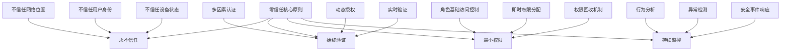

随着网络安全威胁的不断增加，传统的边界安全模型已经无法满足现代微服务架构的安全需求。零信任（Zero Trust）安全模型作为一种新兴的安全架构，正在改变我们对系统安全的理解和实践。在微服务环境中，零信任架构不仅要求对网络访问进行严格控制，还要求对日志数据的安全性给予高度重视。本章将深入探讨微服务中的零信任架构与日志安全实践。

## 零信任安全模型基础

### 零信任核心原则

零信任安全模型基于"永不信任，始终验证"的核心理念：



### 零信任架构组件

```yaml
# 零信任架构核心组件
zero_trust_components:
  identity_management:
    description: "身份管理"
    components:
      - Identity Provider: 身份提供商
      - Directory Service: 目录服务
      - Access Management: 访问管理
      - Credential Management: 凭证管理
      
  device_security:
    description: "设备安全"
    components:
      - Device Registry: 设备注册
      - Endpoint Protection: 端点保护
      - Device Compliance: 设备合规性
      - Device Attestation: 设备证明
      
  network_security:
    description: "网络安全"
    components:
      - Microsegmentation: 微隔离
      - Software-Defined Perimeter: 软件定义边界
      - Encrypted Traffic: 加密流量
      - Network Access Control: 网络访问控制
      
  data_protection:
    description: "数据保护"
    components:
      - Data Classification: 数据分类
      - Encryption: 加密
      - Data Loss Prevention: 数据丢失防护
      - Access Logging: 访问日志
```

## 零信任环境中的身份验证

### 多因素认证实现

```python
# 零信任环境中的多因素认证实现
import hashlib
import hmac
import base64
import time
import json
from datetime import datetime, timedelta
from typing import Dict, Any, List, Optional
import secrets
import jwt

class ZeroTrustAuthenticator:
    """零信任认证器"""
    def __init__(self, issuer: str, secret_key: str):
        self.issuer = issuer
        self.secret_key = secret_key.encode('utf-8')
        self.users = {}  # 用户存储（实际应用中应使用安全存储）
        self.devices = {}  # 设备存储
        self.sessions = {}  # 会话存储
        
    def register_user(self, username: str, password: str, 
                     email: str, roles: List[str] = None) -> bool:
        """注册用户"""
        if username in self.users:
            return False
            
        # 密码哈希
        password_hash = self._hash_password(password)
        
        self.users[username] = {
            'username': username,
            'password_hash': password_hash,
            'email': email,
            'roles': roles or [],
            'created_at': datetime.utcnow().isoformat(),
            'last_login': None,
            'is_active': True,
            'mfa_enabled': False,
            'mfa_secret': None
        }
        
        return True
        
    def authenticate_user(self, username: str, password: str) -> Optional[Dict[str, Any]]:
        """用户认证（第一因素）"""
        user = self.users.get(username)
        if not user or not user['is_active']:
            return None
            
        if not self._verify_password(password, user['password_hash']):
            return None
            
        # 更新最后登录时间
        user['last_login'] = datetime.utcnow().isoformat()
        
        return {
            'username': username,
            'roles': user['roles'],
            'requires_mfa': user.get('mfa_enabled', False),
            'user_id': self._generate_user_id(username)
        }
        
    def enable_mfa(self, username: str) -> Optional[str]:
        """启用多因素认证"""
        user = self.users.get(username)
        if not user:
            return None
            
        # 生成MFA密钥
        mfa_secret = base64.b32encode(secrets.token_bytes(20)).decode('utf-8')
        user['mfa_enabled'] = True
        user['mfa_secret'] = mfa_secret
        
        return mfa_secret
        
    def verify_mfa_token(self, username: str, token: str, 
                        totp_window: int = 1) -> bool:
        """验证MFA令牌"""
        user = self.users.get(username)
        if not user or not user.get('mfa_enabled'):
            return False
            
        secret = user['mfa_secret']
        if not secret:
            return False
            
        # 验证TOTP令牌
        current_time = int(time.time())
        for i in range(-totp_window, totp_window + 1):
            time_window = current_time + (i * 30)  # TOTP时间窗口
            expected_token = self._generate_totp(secret, time_window)
            if hmac.compare_digest(expected_token, token):
                return True
                
        return False
        
    def create_session(self, username: str, device_info: Dict[str, Any] = None) -> str:
        """创建会话"""
        session_id = self._generate_session_id(username)
        
        session = {
            'session_id': session_id,
            'username': username,
            'created_at': datetime.utcnow().isoformat(),
            'expires_at': (datetime.utcnow() + timedelta(hours=8)).isoformat(),
            'device_info': device_info or {},
            'permissions': self.users[username]['roles']
        }
        
        self.sessions[session_id] = session
        return session_id
        
    def validate_session(self, session_id: str) -> Optional[Dict[str, Any]]:
        """验证会话"""
        session = self.sessions.get(session_id)
        if not session:
            return None
            
        # 检查会话是否过期
        expires_at = datetime.fromisoformat(session['expires_at'])
        if datetime.utcnow() > expires_at:
            del self.sessions[session_id]
            return None
            
        return session
        
    def refresh_session(self, session_id: str) -> bool:
        """刷新会话"""
        session = self.sessions.get(session_id)
        if not session:
            return False
            
        # 延长会话有效期
        session['expires_at'] = (datetime.utcnow() + timedelta(hours=8)).isoformat()
        return True
        
    def revoke_session(self, session_id: str) -> bool:
        """撤销会话"""
        if session_id in self.sessions:
            del self.sessions[session_id]
            return True
        return False
        
    def register_device(self, device_id: str, device_info: Dict[str, Any]) -> bool:
        """注册设备"""
        self.devices[device_id] = {
            'device_id': device_id,
            'device_info': device_info,
            'registered_at': datetime.utcnow().isoformat(),
            'last_seen': datetime.utcnow().isoformat(),
            'is_trusted': False,
            'compliance_status': 'pending'
        }
        return True
        
    def verify_device(self, device_id: str) -> bool:
        """验证设备"""
        device = self.devices.get(device_id)
        if not device:
            return False
            
        # 更新设备最后出现时间
        device['last_seen'] = datetime.utcnow().isoformat()
        
        # 简化的设备验证逻辑
        # 实际应用中应包含更复杂的设备合规性检查
        device['is_trusted'] = True
        device['compliance_status'] = 'compliant'
        
        return True
        
    def generate_jwt_token(self, session_id: str) -> Optional[str]:
        """生成JWT令牌"""
        session = self.validate_session(session_id)
        if not session:
            return None
            
        payload = {
            'iss': self.issuer,
            'sub': session['username'],
            'session_id': session_id,
            'exp': datetime.utcnow() + timedelta(hours=8),
            'iat': datetime.utcnow(),
            'permissions': session['permissions']
        }
        
        token = jwt.encode(payload, self.secret_key, algorithm='HS256')
        return token
        
    def validate_jwt_token(self, token: str) -> Optional[Dict[str, Any]]:
        """验证JWT令牌"""
        try:
            payload = jwt.decode(token, self.secret_key, algorithms=['HS256'])
            
            # 验证会话
            session = self.validate_session(payload['session_id'])
            if not session:
                return None
                
            return {
                'username': payload['sub'],
                'session_id': payload['session_id'],
                'permissions': payload['permissions']
            }
            
        except jwt.InvalidTokenError:
            return None
            
    def _hash_password(self, password: str) -> str:
        """密码哈希"""
        salt = secrets.token_bytes(32)
        pwdhash = hashlib.pbkdf2_hmac('sha256', password.encode('utf-8'), salt, 100000)
        return base64.b64encode(salt + pwdhash).decode('utf-8')
        
    def _verify_password(self, password: str, stored_hash: str) -> bool:
        """验证密码"""
        stored_bytes = base64.b64decode(stored_hash.encode('utf-8'))
        salt = stored_bytes[:32]
        stored_pwdhash = stored_bytes[32:]
        pwdhash = hashlib.pbkdf2_hmac('sha256', password.encode('utf-8'), salt, 100000)
        return hmac.compare_digest(pwdhash, stored_pwdhash)
        
    def _generate_totp(self, secret: str, time_step: int) -> str:
        """生成TOTP令牌"""
        key = base64.b32decode(secret.upper() + '=' * ((8 - len(secret)) % 8))
        counter = int(time_step // 30).to_bytes(8, 'big')
        mac = hmac.new(key, counter, hashlib.sha1).digest()
        offset = mac[-1] & 0x0f
        binary = ((mac[offset] & 0x7f) << 24 |
                 (mac[offset + 1] & 0xff) << 16 |
                 (mac[offset + 2] & 0xff) << 8 |
                 (mac[offset + 3] & 0xff))
        otp = str(binary % 1000000).zfill(6)
        return otp
        
    def _generate_user_id(self, username: str) -> str:
        """生成用户ID"""
        return hashlib.sha256(f"{username}:{self.issuer}".encode()).hexdigest()[:32]
        
    def _generate_session_id(self, username: str) -> str:
        """生成会话ID"""
        session_data = f"{username}:{datetime.utcnow().isoformat()}:{secrets.token_hex(16)}"
        return hashlib.sha256(session_data.encode()).hexdigest()

# 使用示例
def demonstrate_zero_trust_authentication():
    """演示零信任认证"""
    # 初始化认证器
    authenticator = ZeroTrustAuthenticator('my-service', 'super-secret-key')
    
    # 注册用户
    success = authenticator.register_user(
        'john_doe',
        'secure_password_123',
        'john@example.com',
        ['user', 'reader']
    )
    print(f"User registration: {success}")
    
    # 启用MFA
    mfa_secret = authenticator.enable_mfa('john_doe')
    print(f"MFA secret: {mfa_secret}")
    
    # 用户认证（第一因素）
    auth_result = authenticator.authenticate_user('john_doe', 'secure_password_123')
    print(f"Authentication result: {auth_result}")
    
    if auth_result and auth_result['requires_mfa']:
        # 生成并验证MFA令牌（实际应用中用户需要输入这个令牌）
        current_token = authenticator._generate_totp(mfa_secret, int(time.time()))
        mfa_valid = authenticator.verify_mfa_token('john_doe', current_token)
        print(f"MFA validation: {mfa_valid}")
        
        if mfa_valid:
            # 创建会话
            session_id = authenticator.create_session('john_doe', {
                'device_type': 'laptop',
                'os': 'Windows 11',
                'browser': 'Chrome'
            })
            print(f"Session created: {session_id}")
            
            # 生成JWT令牌
            jwt_token = authenticator.generate_jwt_token(session_id)
            print(f"JWT token: {jwt_token}")
            
            # 验证JWT令牌
            token_validation = authenticator.validate_jwt_token(jwt_token)
            print(f"Token validation: {token_validation}")

# demonstrate_zero_trust_authentication()
```

## 动态授权与访问控制

### 基于属性的访问控制

```python
# 动态授权与访问控制实现
from datetime import datetime
from typing import Dict, Any, List, Set
import json

class DynamicAccessController:
    """动态访问控制器"""
    def __init__(self):
        self.policies = {}  # 访问策略
        self.user_attributes = {}  # 用户属性
        self.resource_attributes = {}  # 资源属性
        self.role_mappings = {}  # 角色映射
        
    def add_policy(self, policy_name: str, policy: Dict[str, Any]):
        """添加访问策略"""
        self.policies[policy_name] = policy
        
    def set_user_attributes(self, username: str, attributes: Dict[str, Any]):
        """设置用户属性"""
        self.user_attributes[username] = attributes
        
    def set_resource_attributes(self, resource_id: str, attributes: Dict[str, Any]):
        """设置资源属性"""
        self.resource_attributes[resource_id] = attributes
        
    def map_role_to_attributes(self, role: str, attributes: Dict[str, Any]):
        """映射角色到属性"""
        self.role_mappings[role] = attributes
        
    def evaluate_access(self, username: str, resource_id: str, 
                       action: str, context: Dict[str, Any] = None) -> bool:
        """评估访问权限"""
        # 获取用户和资源属性
        user_attrs = self.user_attributes.get(username, {})
        resource_attrs = self.resource_attributes.get(resource_id, {})
        
        # 合并上下文属性
        eval_context = {
            'user': user_attrs,
            'resource': resource_attrs,
            'action': action,
            'time': datetime.utcnow().isoformat(),
            'context': context or {}
        }
        
        # 评估所有策略
        for policy_name, policy in self.policies.items():
            if not self._evaluate_policy(policy, eval_context):
                return False
                
        return True
        
    def _evaluate_policy(self, policy: Dict[str, Any], context: Dict[str, Any]) -> bool:
        """评估单个策略"""
        # 检查主体条件
        if 'subject' in policy:
            if not self._evaluate_condition(policy['subject'], context['user']):
                return False
                
        # 检查资源条件
        if 'resource' in policy:
            if not self._evaluate_condition(policy['resource'], context['resource']):
                return False
                
        # 检查动作条件
        if 'action' in policy:
            if not self._match_action(policy['action'], context['action']):
                return False
                
        # 检查环境条件
        if 'environment' in policy:
            if not self._evaluate_condition(policy['environment'], context):
                return False
                
        return True
        
    def _evaluate_condition(self, condition: Dict[str, Any], attributes: Dict[str, Any]) -> bool:
        """评估条件"""
        if not condition:
            return True
            
        # 处理AND条件
        if 'and' in condition:
            for sub_condition in condition['and']:
                if not self._evaluate_condition(sub_condition, attributes):
                    return False
            return True
            
        # 处理OR条件
        if 'or' in condition:
            for sub_condition in condition['or']:
                if self._evaluate_condition(sub_condition, attributes):
                    return True
            return False
            
        # 处理NOT条件
        if 'not' in condition:
            return not self._evaluate_condition(condition['not'], attributes)
            
        # 处理属性比较
        for attr_name, expected_value in condition.items():
            if attr_name in ['and', 'or', 'not']:
                continue
                
            actual_value = self._get_nested_attribute(attributes, attr_name)
            
            # 处理操作符
            if isinstance(expected_value, dict):
                op = list(expected_value.keys())[0]
                value = expected_value[op]
                
                if op == 'eq':
                    if actual_value != value:
                        return False
                elif op == 'ne':
                    if actual_value == value:
                        return False
                elif op == 'gt':
                    if not (actual_value is not None and actual_value > value):
                        return False
                elif op == 'lt':
                    if not (actual_value is not None and actual_value < value):
                        return False
                elif op == 'in':
                    if actual_value not in value:
                        return False
                elif op == 'contains':
                    if not (hasattr(actual_value, '__contains__') and value in actual_value):
                        return False
            else:
                # 直接相等比较
                if actual_value != expected_value:
                    return False
                    
        return True
        
    def _match_action(self, expected_action: str, actual_action: str) -> bool:
        """匹配动作"""
        if expected_action == '*':
            return True
        return expected_action == actual_action
        
    def _get_nested_attribute(self, obj: Dict[str, Any], path: str):
        """获取嵌套属性"""
        keys = path.split('.')
        current = obj
        
        for key in keys:
            if isinstance(current, dict) and key in current:
                current = current[key]
            else:
                return None
                
        return current
        
    def get_user_permissions(self, username: str, resource_id: str = None) -> Set[str]:
        """获取用户权限"""
        permissions = set()
        user_attrs = self.user_attributes.get(username, {})
        
        # 基于角色的权限
        roles = user_attrs.get('roles', [])
        for role in roles:
            if role in self.role_mappings:
                role_permissions = self.role_mappings[role].get('permissions', [])
                permissions.update(role_permissions)
                
        # 基于策略的权限
        for policy_name, policy in self.policies.items():
            if 'permissions' in policy:
                # 检查用户是否满足策略条件
                context = {
                    'user': user_attrs,
                    'resource': self.resource_attributes.get(resource_id, {}) if resource_id else {},
                    'action': 'read',  # 用于权限检查的虚拟动作
                    'time': datetime.utcnow().isoformat()
                }
                
                if self._evaluate_policy(policy, context):
                    permissions.update(policy['permissions'])
                    
        return permissions

# 使用示例
def demonstrate_dynamic_access_control():
    """演示动态访问控制"""
    # 初始化访问控制器
    access_controller = DynamicAccessController()
    
    # 添加策略
    access_controller.add_policy('time_based_access', {
        'environment': {
            'time': {
                'and': [
                    {'time': {'gt': '09:00:00'}},
                    {'time': {'lt': '18:00:00'}}
                ]
            }
        }
    })
    
    access_controller.add_policy('admin_only', {
        'subject': {
            'roles': {'contains': 'admin'}
        }
    })
    
    access_controller.add_policy('resource_owner', {
        'or': [
            {'subject': {'roles': {'contains': 'admin'}}},
            {'and': [
                {'subject': {'username': {'eq': 'resource.owner'}}},
                {'resource': {'owner': {'eq': 'resource.owner'}}}
            ]}
        ]
    })
    
    # 设置用户属性
    access_controller.set_user_attributes('john_doe', {
        'username': 'john_doe',
        'roles': ['user', 'reader'],
        'department': 'engineering',
        'security_level': 2
    })
    
    access_controller.set_user_attributes('admin_user', {
        'username': 'admin_user',
        'roles': ['admin', 'user'],
        'department': 'security',
        'security_level': 5
    })
    
    # 设置资源属性
    access_controller.set_resource_attributes('sensitive_data', {
        'type': 'database',
        'owner': 'admin_user',
        'classification': 'confidential',
        'security_level': 4
    })
    
    # 设置角色映射
    access_controller.map_role_to_attributes('admin', {
        'permissions': ['read', 'write', 'delete', 'admin']
    })
    
    access_controller.map_role_to_attributes('user', {
        'permissions': ['read']
    })
    
    # 评估访问权限
    can_john_read = access_controller.evaluate_access(
        'john_doe', 
        'sensitive_data', 
        'read'
    )
    print(f"John can read sensitive data: {can_john_read}")
    
    can_admin_read = access_controller.evaluate_access(
        'admin_user',
        'sensitive_data',
        'read'
    )
    print(f"Admin can read sensitive data: {can_admin_read}")
    
    # 获取用户权限
    john_permissions = access_controller.get_user_permissions('john_doe', 'sensitive_data')
    print(f"John's permissions: {john_permissions}")
    
    admin_permissions = access_controller.get_user_permissions('admin_user', 'sensitive_data')
    print(f"Admin's permissions: {admin_permissions}")

# demonstrate_dynamic_access_control()
```

## 日志安全与隐私保护

### 加密日志实现

```python
# 日志安全与隐私保护实现
import hashlib
import hmac
import json
from datetime import datetime
from typing import Dict, Any, List, Optional
import base64
from cryptography.fernet import Fernet
from cryptography.hazmat.primitives import hashes
from cryptography.hazmat.primitives.kdf.pbkdf2 import PBKDF2HMAC
import logging

class SecureLogger:
    """安全日志记录器"""
    def __init__(self, service_name: str, encryption_key: Optional[bytes] = None):
        self.service_name = service_name
        self.encryption_key = encryption_key
        self.logger = logging.getLogger(f'secure-logger.{service_name}')
        
        if encryption_key:
            self.cipher_suite = Fernet(encryption_key)
        else:
            self.cipher_suite = None
            
        self.sensitive_fields = {
            'password', 'token', 'secret', 'key', 'authorization',
            'credit_card', 'ssn', 'phone', 'email', 'address'
        }
        
    def log_event(self, event_type: str, data: Dict[str, Any], 
                 severity: str = 'INFO', encrypt: bool = False) -> str:
        """记录安全事件"""
        timestamp = datetime.utcnow()
        
        # 准备日志条目
        log_entry = {
            'timestamp': timestamp.isoformat(),
            'service': self.service_name,
            'event_type': event_type,
            'severity': severity,
            'data': self._sanitize_data(data.copy()),
            'event_hash': None,
            'signature': None
        }
        
        # 生成事件哈希
        event_hash = self._generate_event_hash(log_entry)
        log_entry['event_hash'] = event_hash
        
        # 生成数字签名
        signature = self._generate_signature(event_hash)
        log_entry['signature'] = signature
        
        # 加密敏感数据（如果需要）
        if encrypt and self.cipher_suite:
            log_entry = self._encrypt_sensitive_fields(log_entry)
            
        # 输出日志
        self._output_log(log_entry)
        
        return event_hash
        
    def verify_log_integrity(self, log_entry: Dict[str, Any]) -> bool:
        """验证日志完整性"""
        # 保存原始签名和哈希
        original_signature = log_entry.get('signature')
        original_hash = log_entry.get('event_hash')
        
        if not original_signature or not original_hash:
            return False
            
        # 重新生成哈希和签名
        log_copy = log_entry.copy()
        log_copy['signature'] = None
        log_copy['event_hash'] = None
        
        recalculated_hash = self._generate_event_hash(log_copy)
        recalculated_signature = self._generate_signature(recalculated_hash)
        
        # 验证哈希和签名
        return (hmac.compare_digest(recalculated_hash, original_hash) and
                hmac.compare_digest(recalculated_signature, original_signature))
        
    def decrypt_log_entry(self, encrypted_log: Dict[str, Any]) -> Dict[str, Any]:
        """解密日志条目"""
        if not self.cipher_suite:
            raise ValueError("No encryption key configured")
            
        decrypted_log = encrypted_log.copy()
        
        # 解密敏感字段
        if 'encrypted_data' in decrypted_log:
            encrypted_data = base64.b64decode(decrypted_log['encrypted_data'])
            decrypted_data = self.cipher_suite.decrypt(encrypted_data)
            decrypted_log['data'] = json.loads(decrypted_data.decode())
            del decrypted_log['encrypted_data']
            
        return decrypted_log
        
    def add_sensitive_field(self, field_name: str):
        """添加敏感字段"""
        self.sensitive_fields.add(field_name.lower())
        
    def remove_sensitive_field(self, field_name: str):
        """移除敏感字段"""
        self.sensitive_fields.discard(field_name.lower())
        
    def _sanitize_data(self, data: Dict[str, Any]) -> Dict[str, Any]:
        """清理敏感数据"""
        sanitized = {}
        
        for key, value in data.items():
            key_lower = key.lower()
            
            if key_lower in self.sensitive_fields:
                # 对于敏感字段，只保留字段名，值替换为占位符
                sanitized[key] = '***REDACTED***'
            elif isinstance(value, dict):
                # 递归处理嵌套字典
                sanitized[key] = self._sanitize_data(value)
            elif isinstance(value, list):
                # 处理列表中的字典元素
                sanitized[key] = [
                    self._sanitize_data(item) if isinstance(item, dict) else item
                    for item in value
                ]
            else:
                sanitized[key] = value
                
        return sanitized
        
    def _encrypt_sensitive_fields(self, log_entry: Dict[str, Any]) -> Dict[str, Any]:
        """加密敏感字段"""
        if not self.cipher_suite:
            return log_entry
            
        encrypted_log = log_entry.copy()
        
        # 加密原始数据
        original_data = json.dumps(log_entry['data']).encode()
        encrypted_data = self.cipher_suite.encrypt(original_data)
        encrypted_log['encrypted_data'] = base64.b64encode(encrypted_data).decode()
        
        # 移除原始数据以保护隐私
        del encrypted_log['data']
        
        return encrypted_log
        
    def _generate_event_hash(self, event_data: Dict[str, Any]) -> str:
        """生成事件哈希"""
        # 创建事件数据的副本并移除签名相关字段
        data_copy = {k: v for k, v in event_data.items() 
                    if k not in ['event_hash', 'signature']}
        
        # 序列化并生成哈希
        serialized_data = json.dumps(data_copy, sort_keys=True, separators=(',', ':'))
        return hashlib.sha256(serialized_data.encode('utf-8')).hexdigest()
        
    def _generate_signature(self, data_hash: str) -> str:
        """生成数字签名"""
        if not self.encryption_key:
            return ""
            
        signature = hmac.new(
            self.encryption_key,
            data_hash.encode('utf-8'),
            hashlib.sha256
        ).digest()
        return base64.b64encode(signature).decode('utf-8')
        
    def _output_log(self, log_entry: Dict[str, Any]):
        """输出日志"""
        try:
            self.logger.info(json.dumps(log_entry))
        except Exception as e:
            # 如果JSON序列化失败，记录简化版本
            simplified_entry = {
                'timestamp': log_entry.get('timestamp'),
                'service': log_entry.get('service'),
                'event_type': log_entry.get('event_type'),
                'severity': log_entry.get('severity')
            }
            self.logger.info(json.dumps(simplified_entry))

class AuditTrail:
    """审计跟踪"""
    def __init__(self, secure_logger: SecureLogger):
        self.secure_logger = secure_logger
        self.audit_events = []
        
    def log_access(self, user_id: str, resource_id: str, action: str, 
                  success: bool, details: Dict[str, Any] = None):
        """记录访问事件"""
        audit_data = {
            'user_id': user_id,
            'resource_id': resource_id,
            'action': action,
            'success': success,
            'details': details or {}
        }
        
        event_hash = self.secure_logger.log_event(
            'access_audit',
            audit_data,
            'INFO',
            encrypt=True
        )
        
        # 存储到审计跟踪
        self.audit_events.append({
            'event_hash': event_hash,
            'timestamp': datetime.utcnow().isoformat(),
            'user_id': user_id,
            'resource_id': resource_id,
            'action': action
        })
        
        return event_hash
        
    def log_security_event(self, event_type: str, severity: str,
                          details: Dict[str, Any], affected_resources: List[str] = None):
        """记录安全事件"""
        security_data = {
            'event_type': event_type,
            'severity': severity,
            'details': details,
            'affected_resources': affected_resources or []
        }
        
        event_hash = self.secure_logger.log_event(
            f'security_{event_type}',
            security_data,
            severity,
            encrypt=True
        )
        
        return event_hash
        
    def get_user_audit_history(self, user_id: str, hours: int = 24) -> List[Dict[str, Any]]:
        """获取用户审计历史"""
        from datetime import timedelta
        
        cutoff_time = datetime.utcnow() - timedelta(hours=hours)
        
        user_events = [
            event for event in self.audit_events
            if (event['user_id'] == user_id and 
                datetime.fromisoformat(event['timestamp']) > cutoff_time)
        ]
        
        return sorted(user_events, key=lambda x: x['timestamp'], reverse=True)
        
    def detect_suspicious_activity(self, user_id: str) -> List[Dict[str, Any]]:
        """检测可疑活动"""
        user_history = self.get_user_audit_history(user_id, 24)
        
        suspicious_activities = []
        
        # 检查异常时间访问
        for event in user_history:
            event_time = datetime.fromisoformat(event['timestamp'])
            # 检查是否在非工作时间访问
            if event_time.hour < 6 or event_time.hour > 22:
                suspicious_activities.append({
                    'type': 'off_hours_access',
                    'event': event,
                    'risk_level': 'medium'
                })
                
        # 检查访问频率异常
        resource_access_count = {}
        for event in user_history:
            resource = event['resource_id']
            resource_access_count[resource] = resource_access_count.get(resource, 0) + 1
            
        for resource, count in resource_access_count.items():
            if count > 10:  # 阈值可配置
                suspicious_activities.append({
                    'type': 'high_frequency_access',
                    'resource': resource,
                    'count': count,
                    'risk_level': 'high'
                })
                
        return suspicious_activities

# 使用示例
def demonstrate_secure_logging():
    """演示安全日志记录"""
    # 生成加密密钥
    encryption_key = Fernet.generate_key()
    
    # 初始化安全日志记录器
    secure_logger = SecureLogger('UserService', encryption_key)
    audit_trail = AuditTrail(secure_logger)
    
    # 记录普通事件
    event_hash1 = secure_logger.log_event(
        'user_login',
        {
            'user_id': 'user123',
            'ip_address': '192.168.1.100',
            'user_agent': 'Mozilla/5.0...',
            'password': 'secret_password'  # 敏感字段会被自动清理
        }
    )
    print(f"Normal event logged: {event_hash1}")
    
    # 记录加密事件
    event_hash2 = secure_logger.log_event(
        'sensitive_operation',
        {
            'user_id': 'admin_user',
            'operation': 'database_backup',
            'credentials': 'admin:super_secret_password'
        },
        'HIGH',
        encrypt=True
    )
    print(f"Encrypted event logged: {event_hash2}")
    
    # 记录审计事件
    audit_hash = audit_trail.log_access(
        'user123',
        'user_profile_456',
        'read',
        True,
        {'session_id': 'sess_789'}
    )
    print(f"Audit event logged: {audit_hash}")
    
    # 验证日志完整性
    # 注意：这里需要实际的日志条目来进行验证
    print("Log integrity verification would be performed on actual log entries")
    
    # 检测可疑活动
    suspicious_activities = audit_trail.detect_suspicious_activity('user123')
    print(f"Suspicious activities: {suspicious_activities}")

# demonstrate_secure_logging()
```

## 零信任网络与微隔离

### 服务网格安全实现

```python
# 零信任网络与微隔离实现
import hashlib
from datetime import datetime, timedelta
from typing import Dict, Any, List, Optional
import json

class ZeroTrustNetwork:
    """零信任网络控制器"""
    def __init__(self, network_id: str):
        self.network_id = network_id
        self.services = {}  # 服务注册
        self.policies = []  # 网络策略
        self.connections = {}  # 连接状态
        self.certificates = {}  # 服务证书
        
    def register_service(self, service_id: str, service_info: Dict[str, Any]) -> bool:
        """注册服务"""
        self.services[service_id] = {
            'service_id': service_id,
            'info': service_info,
            'registered_at': datetime.utcnow().isoformat(),
            'last_heartbeat': None,
            'is_healthy': False,
            'security_level': service_info.get('security_level', 1),
            'allowed_peers': set()
        }
        return True
        
    def add_network_policy(self, policy: Dict[str, Any]):
        """添加网络策略"""
        policy['policy_id'] = hashlib.sha256(
            json.dumps(policy, sort_keys=True).encode()
        ).hexdigest()[:16]
        policy['created_at'] = datetime.utcnow().isoformat()
        self.policies.append(policy)
        
    def validate_connection(self, source_service: str, 
                          target_service: str, 
                          context: Dict[str, Any] = None) -> bool:
        """验证服务间连接"""
        # 检查服务是否存在
        if source_service not in self.services or target_service not in self.services:
            return False
            
        # 更新心跳
        self.services[source_service]['last_heartbeat'] = datetime.utcnow().isoformat()
        self.services[target_service]['last_heartbeat'] = datetime.utcnow().isoformat()
        
        # 评估网络策略
        connection_context = {
            'source': self.services[source_service],
            'target': self.services[target_service],
            'timestamp': datetime.utcnow().isoformat(),
            'context': context or {}
        }
        
        for policy in self.policies:
            if not self._evaluate_network_policy(policy, connection_context):
                return False
                
        # 记录连接
        connection_id = f"{source_service}->{target_service}"
        self.connections[connection_id] = {
            'source': source_service,
            'target': target_service,
            'established_at': datetime.utcnow().isoformat(),
            'context': context
        }
        
        return True
        
    def _evaluate_network_policy(self, policy: Dict[str, Any], 
                               context: Dict[str, Any]) -> bool:
        """评估网络策略"""
        # 检查源服务条件
        if 'source' in policy:
            if not self._match_service_condition(policy['source'], context['source']):
                return False
                
        # 检查目标服务条件
        if 'target' in policy:
            if not self._match_service_condition(policy['target'], context['target']):
                return False
                
        # 检查时间条件
        if 'time' in policy:
            if not self._match_time_condition(policy['time']):
                return False
                
        # 检查安全级别
        if 'security_level' in policy:
            source_level = context['source']['info'].get('security_level', 1)
            target_level = context['target']['info'].get('security_level', 1)
            required_level = policy['security_level']
            
            if source_level < required_level or target_level < required_level:
                return False
                
        return True
        
    def _match_service_condition(self, condition: Dict[str, Any], 
                               service: Dict[str, Any]) -> bool:
        """匹配服务条件"""
        service_info = service['info']
        
        for key, expected_value in condition.items():
            if key not in service_info:
                return False
                
            actual_value = service_info[key]
            
            # 处理操作符
            if isinstance(expected_value, dict):
                op = list(expected_value.keys())[0]
                value = expected_value[op]
                
                if op == 'eq':
                    if actual_value != value:
                        return False
                elif op == 'ne':
                    if actual_value == value:
                        return False
                elif op == 'gt':
                    if not (actual_value > value):
                        return False
                elif op == 'lt':
                    if not (actual_value < value):
                        return False
                elif op == 'in':
                    if actual_value not in value:
                        return False
            else:
                # 直接相等比较
                if actual_value != expected_value:
                    return False
                    
        return True
        
    def _match_time_condition(self, condition: Dict[str, Any]) -> bool:
        """匹配时间条件"""
        current_time = datetime.utcnow()
        
        if 'after' in condition:
            after_time = datetime.fromisoformat(condition['after'])
            if current_time < after_time:
                return False
                
        if 'before' in condition:
            before_time = datetime.fromisoformat(condition['before'])
            if current_time > before_time:
                return False
                
        # 检查工作时间
        if condition.get('business_hours', False):
            hour = current_time.hour
            if hour < 9 or hour > 17:  # 9 AM to 5 PM
                return False
                
        return True
        
    def issue_certificate(self, service_id: str, validity_days: int = 365) -> str:
        """颁发服务证书"""
        if service_id not in self.services:
            raise ValueError(f"Service {service_id} not registered")
            
        # 生成证书（简化实现）
        cert_data = {
            'service_id': service_id,
            'network_id': self.network_id,
            'issued_at': datetime.utcnow().isoformat(),
            'expires_at': (datetime.utcnow() + timedelta(days=validity_days)).isoformat(),
            'public_key': f"pubkey_{service_id}"
        }
        
        cert_hash = hashlib.sha256(
            json.dumps(cert_data, sort_keys=True).encode()
        ).hexdigest()
        
        self.certificates[cert_hash] = cert_data
        self.services[service_id]['certificate'] = cert_hash
        
        return cert_hash
        
    def validate_certificate(self, cert_hash: str) -> bool:
        """验证证书"""
        if cert_hash not in self.certificates:
            return False
            
        cert = self.certificates[cert_hash]
        expires_at = datetime.fromisoformat(cert['expires_at'])
        
        return datetime.utcnow() < expires_at
        
    def get_service_connectivity_map(self) -> Dict[str, Any]:
        """获取服务连接图"""
        connectivity_map = {
            'network_id': self.network_id,
            'services': list(self.services.keys()),
            'connections': {},
            'policies': len(self.policies)
        }
        
        # 构建连接关系
        for conn_id, conn in self.connections.items():
            source = conn['source']
            target = conn['target']
            
            if source not in connectivity_map['connections']:
                connectivity_map['connections'][source] = []
            connectivity_map['connections'][source].append(target)
            
        return connectivity_map

class SecureServiceMesh:
    """安全服务网格"""
    def __init__(self, mesh_id: str):
        self.mesh_id = mesh_id
        self.network_controller = ZeroTrustNetwork(mesh_id)
        self.service_proxies = {}  # 服务代理
        
    def add_service(self, service_id: str, service_config: Dict[str, Any]):
        """添加服务到网格"""
        # 注册服务
        self.network_controller.register_service(service_id, service_config)
        
        # 颁发证书
        cert_hash = self.network_controller.issue_certificate(service_id)
        
        # 创建服务代理
        proxy = SecureServiceProxy(service_id, cert_hash, self.network_controller)
        self.service_proxies[service_id] = proxy
        
        return proxy
        
    def establish_secure_connection(self, source_service: str, 
                                  target_service: str) -> bool:
        """建立安全连接"""
        return self.network_controller.validate_connection(
            source_service, 
            target_service
        )
        
    def get_mesh_status(self) -> Dict[str, Any]:
        """获取网格状态"""
        return {
            'mesh_id': self.mesh_id,
            'services_count': len(self.service_proxies),
            'connections_count': len(self.network_controller.connections),
            'policies_count': len(self.network_controller.policies),
            'connectivity_map': self.network_controller.get_service_connectivity_map()
        }

class SecureServiceProxy:
    """安全服务代理"""
    def __init__(self, service_id: str, certificate: str, 
                 network_controller: ZeroTrustNetwork):
        self.service_id = service_id
        self.certificate = certificate
        self.network_controller = network_controller
        self.request_count = 0
        self.error_count = 0
        
    def make_secure_request(self, target_service: str, 
                          request_data: Dict[str, Any]) -> Dict[str, Any]:
        """发起安全请求"""
        # 验证连接
        if not self.network_controller.validate_connection(
            self.service_id, 
            target_service
        ):
            raise PermissionError(f"Connection from {self.service_id} to {target_service} denied")
            
        # 验证证书
        if not self.network_controller.validate_certificate(self.certificate):
            raise ValueError("Invalid or expired certificate")
            
        # 增加请求计数
        self.request_count += 1
        
        # 模拟安全请求处理
        response = {
            'status': 'success',
            'data': f"Response from {target_service}",
            'timestamp': datetime.utcnow().isoformat(),
            'source': self.service_id,
            'target': target_service
        }
        
        return response
        
    def get_proxy_stats(self) -> Dict[str, Any]:
        """获取代理统计信息"""
        return {
            'service_id': self.service_id,
            'request_count': self.request_count,
            'error_count': self.error_count,
            'certificate_valid': self.network_controller.validate_certificate(self.certificate)
        }

# 使用示例
def demonstrate_zero_trust_network():
    """演示零信任网络"""
    # 初始化安全服务网格
    service_mesh = SecureServiceMesh('production-mesh-001')
    
    # 添加网络策略
    service_mesh.network_controller.add_network_policy({
        'source': {'environment': 'production'},
        'target': {'environment': 'production'},
        'security_level': 3,
        'time': {'business_hours': True}
    })
    
    service_mesh.network_controller.add_network_policy({
        'source': {'service_type': 'frontend'},
        'target': {'service_type': 'backend'},
        'security_level': 2
    })
    
    # 添加服务
    frontend_proxy = service_mesh.add_service('frontend-service', {
        'service_type': 'frontend',
        'environment': 'production',
        'security_level': 3,
        'version': '1.2.0'
    })
    
    backend_proxy = service_mesh.add_service('backend-service', {
        'service_type': 'backend',
        'environment': 'production',
        'security_level': 3,
        'version': '2.1.0'
    })
    
    database_proxy = service_mesh.add_service('database-service', {
        'service_type': 'database',
        'environment': 'production',
        'security_level': 5,
        'version': '1.0.0'
    })
    
    # 建立安全连接
    connection_allowed = service_mesh.establish_secure_connection(
        'frontend-service',
        'backend-service'
    )
    print(f"Frontend to Backend connection: {connection_allowed}")
    
    # 发起安全请求
    try:
        response = frontend_proxy.make_secure_request(
            'backend-service',
            {'action': 'get_user_data', 'user_id': '123'}
        )
        print(f"Secure request response: {response}")
    except Exception as e:
        print(f"Request failed: {e}")
        
    # 获取网格状态
    mesh_status = service_mesh.get_mesh_status()
    print("Mesh status:", json.dumps(mesh_status, indent=2))
    
    # 获取代理统计
    frontend_stats = frontend_proxy.get_proxy_stats()
    print("Frontend proxy stats:", frontend_stats)

# demonstrate_zero_trust_network()
```

## 数据保护与合规性

### 数据分类与保护实现

```python
# 数据保护与合规性实现
import hashlib
from datetime import datetime
from typing import Dict, Any, List, Set
import json
import re

class DataProtectionManager:
    """数据保护管理器"""
    def __init__(self, organization_name: str):
        self.organization_name = organization_name
        self.data_classification = {}  # 数据分类
        self.data_protection_rules = []  # 数据保护规则
        self.compliance_requirements = {}  # 合规要求
        self.data_inventory = {}  # 数据清单
        
    def classify_data(self, data_id: str, classification: Dict[str, Any]):
        """分类数据"""
        self.data_classification[data_id] = {
            'data_id': data_id,
            'classification': classification,
            'classified_at': datetime.utcnow().isoformat(),
            'classified_by': 'system'  # 或用户ID
        }
        
        # 更新数据清单
        if data_id not in self.data_inventory:
            self.data_inventory[data_id] = {}
        self.data_inventory[data_id]['classification'] = classification
        
    def add_protection_rule(self, rule: Dict[str, Any]):
        """添加保护规则"""
        rule_id = hashlib.sha256(
            json.dumps(rule, sort_keys=True).encode()
        ).hexdigest()[:16]
        
        rule['rule_id'] = rule_id
        rule['created_at'] = datetime.utcnow().isoformat()
        self.data_protection_rules.append(rule)
        
    def add_compliance_requirement(self, requirement_id: str, 
                                 requirement: Dict[str, Any]):
        """添加合规要求"""
        self.compliance_requirements[requirement_id] = {
            'requirement_id': requirement_id,
            'requirement': requirement,
            'added_at': datetime.utcnow().isoformat()
        }
        
    def evaluate_data_protection(self, data_id: str, 
                               operation: str, 
                               context: Dict[str, Any] = None) -> Dict[str, Any]:
        """评估数据保护要求"""
        # 获取数据分类
        classification = self.data_classification.get(data_id, {}).get('classification', {})
        if not classification:
            return {'allowed': False, 'reason': 'Data not classified'}
            
        # 构建评估上下文
        eval_context = {
            'data': classification,
            'operation': operation,
            'context': context or {},
            'timestamp': datetime.utcnow().isoformat()
        }
        
        # 评估所有保护规则
        violations = []
        for rule in self.data_protection_rules:
            if not self._evaluate_protection_rule(rule, eval_context):
                violations.append({
                    'rule_id': rule['rule_id'],
                    'rule': rule,
                    'violation_details': 'Rule condition not met'
                })
                
        # 检查合规要求
        compliance_violations = self._check_compliance_requirements(
            classification, 
            operation, 
            context
        )
        violations.extend(compliance_violations)
        
        return {
            'allowed': len(violations) == 0,
            'violations': violations,
            'data_classification': classification
        }
        
    def _evaluate_protection_rule(self, rule: Dict[str, Any], 
                                context: Dict[str, Any]) -> bool:
        """评估保护规则"""
        # 检查数据分类条件
        if 'data_classification' in rule:
            if not self._match_classification(
                rule['data_classification'], 
                context['data']
            ):
                return True  # 规则不适用
                
        # 检查操作条件
        if 'operation' in rule:
            if not self._match_operation(rule['operation'], context['operation']):
                return True  # 规则不适用
                
        # 检查上下文条件
        if 'context' in rule:
            if not self._match_context(rule['context'], context['context']):
                return True  # 规则不适用
                
        # 检查时间条件
        if 'time' in rule:
            if not self._match_time_condition(rule['time']):
                return False
                
        # 如果所有条件都满足，检查是否允许操作
        return rule.get('allow', True)
        
    def _match_classification(self, rule_classification: Dict[str, Any], 
                            data_classification: Dict[str, Any]) -> bool:
        """匹配数据分类"""
        for key, expected_value in rule_classification.items():
            if key not in data_classification:
                return False
                
            actual_value = data_classification[key]
            
            # 处理操作符
            if isinstance(expected_value, dict):
                op = list(expected_value.keys())[0]
                value = expected_value[op]
                
                if op == 'eq':
                    if actual_value != value:
                        return False
                elif op == 'ne':
                    if actual_value == value:
                        return False
                elif op == 'in':
                    if actual_value not in value:
                        return False
                elif op == 'contains':
                    if value not in actual_value:
                        return False
            else:
                # 直接相等比较
                if actual_value != expected_value:
                    return False
                    
        return True
        
    def _match_operation(self, expected_operation: str, actual_operation: str) -> bool:
        """匹配操作"""
        if expected_operation == '*':
            return True
        return expected_operation == actual_operation
        
    def _match_context(self, rule_context: Dict[str, Any], 
                      actual_context: Dict[str, Any]) -> bool:
        """匹配上下文"""
        for key, expected_value in rule_context.items():
            if key not in actual_context:
                return False
                
            actual_value = actual_context[key]
            
            # 处理操作符
            if isinstance(expected_value, dict):
                op = list(expected_value.keys())[0]
                value = expected_value[op]
                
                if op == 'eq':
                    if actual_value != value:
                        return False
                elif op == 'ne':
                    if actual_value == value:
                        return False
                elif op == 'in':
                    if actual_value not in value:
                        return False
            else:
                # 直接相等比较
                if actual_value != expected_value:
                    return False
                    
        return True
        
    def _match_time_condition(self, condition: Dict[str, Any]) -> bool:
        """匹配时间条件"""
        current_time = datetime.utcnow()
        
        if 'after' in condition:
            after_time = datetime.fromisoformat(condition['after'])
            if current_time < after_time:
                return False
                
        if 'before' in condition:
            before_time = datetime.fromisoformat(condition['before'])
            if current_time > before_time:
                return False
                
        return True
        
    def _check_compliance_requirements(self, classification: Dict[str, Any], 
                                     operation: str, 
                                     context: Dict[str, Any]) -> List[Dict[str, Any]]:
        """检查合规要求"""
        violations = []
        
        for req_id, requirement in self.compliance_requirements.items():
            req_details = requirement['requirement']
            
            # 检查数据分类是否匹配
            if 'data_classification' in req_details:
                if not self._match_classification(
                    req_details['data_classification'], 
                    classification
                ):
                    continue  # 要求不适用
                    
            # 检查操作是否受限制
            if 'restricted_operations' in req_details:
                if operation in req_details['restricted_operations']:
                    violations.append({
                        'requirement_id': req_id,
                        'violation_type': 'operation_restricted',
                        'details': f"Operation {operation} is restricted for this data classification"
                    })
                    
            # 检查特定上下文要求
            if 'context_requirements' in req_details:
                for ctx_req in req_details['context_requirements']:
                    if not self._check_context_requirement(ctx_req, context):
                        violations.append({
                            'requirement_id': req_id,
                            'violation_type': 'context_requirement_violation',
                            'details': f"Context requirement not met: {ctx_req}"
                        })
                        
        return violations
        
    def _check_context_requirement(self, requirement: Dict[str, Any], 
                                 context: Dict[str, Any]) -> bool:
        """检查上下文要求"""
        req_type = requirement.get('type')
        
        if req_type == 'encryption_required':
            return context.get('encryption', False)
        elif req_type == 'access_logging_required':
            return context.get('access_logged', False)
        elif req_type == 'multi_factor_auth_required':
            return context.get('mfa_verified', False)
        elif req_type == 'data_masking_required':
            return context.get('data_masked', False)
            
        return True  # 未知要求类型，默认通过
        
    def get_data_protection_report(self) -> Dict[str, Any]:
        """获取数据保护报告"""
        return {
            'organization': self.organization_name,
            'report_time': datetime.utcnow().isoformat(),
            'data_count': len(self.data_inventory),
            'classified_data_count': len(self.data_classification),
            'protection_rules_count': len(self.data_protection_rules),
            'compliance_requirements_count': len(self.compliance_requirements),
            'data_classification_summary': self._get_classification_summary()
        }
        
    def _get_classification_summary(self) -> Dict[str, int]:
        """获取分类摘要"""
        summary = {}
        for data_id, classification_info in self.data_classification.items():
            classification = classification_info['classification']
            classification_type = classification.get('type', 'unknown')
            summary[classification_type] = summary.get(classification_type, 0) + 1
        return summary

# 隐私数据检测器
class PrivacyDataDetector:
    """隐私数据检测器"""
    def __init__(self):
        self.patterns = {
            'email': r'\b[A-Za-z0-9._%+-]+@[A-Za-z0-9.-]+\.[A-Z|a-z]{2,}\b',
            'phone': r'\b\d{3}[-.]?\d{3}[-.]?\d{4}\b',
            'ssn': r'\b\d{3}-?\d{2}-?\d{4}\b',
            'credit_card': r'\b(?:\d{4}[-\s]?){3}\d{4}\b|\b\d{16}\b',
            'ip_address': r'\b(?:[0-9]{1,3}\.){3}[0-9]{1,3}\b',
            'url': r'https?://(?:[-\w.])+(?:[:\d]+)?(?:/(?:[\w/_.])*(?:\?(?:[\w&=%.])*)?(?:#(?:[\w.])*)?)?'
        }
        
    def detect_sensitive_data(self, text: str) -> Dict[str, List[str]]:
        """检测敏感数据"""
        findings = {}
        
        for data_type, pattern in self.patterns.items():
            matches = re.findall(pattern, text)
            if matches:
                findings[data_type] = matches
                
        return findings
        
    def mask_sensitive_data(self, text: str) -> str:
        """屏蔽敏感数据"""
        masked_text = text
        
        # 邮箱屏蔽
        masked_text = re.sub(
            self.patterns['email'],
            lambda m: f"{m.group(0)[:3]}***@***.{m.group(0).split('.')[-1]}",
            masked_text
        )
        
        # 电话号码屏蔽
        masked_text = re.sub(
            self.patterns['phone'],
            lambda m: f"***-***-{m.group(0)[-4:]}",
            masked_text
        )
        
        # 社保号码屏蔽
        masked_text = re.sub(
            self.patterns['ssn'],
            lambda m: f"***-**-{m.group(0)[-4:]}",
            masked_text
        )
        
        # 信用卡号码屏蔽
        masked_text = re.sub(
            self.patterns['credit_card'],
            lambda m: f"****-****-****-{m.group(0)[-4:]}",
            masked_text
        )
        
        return masked_text

# 使用示例
def demonstrate_data_protection():
    """演示数据保护"""
    # 初始化数据保护管理器
    dp_manager = DataProtectionManager('Acme Corp')
    
    # 添加数据分类
    dp_manager.classify_data('user_data_123', {
        'type': 'personal',
        'sensitivity': 'high',
        'category': 'user_profile',
        'retention_period': '5 years'
    })
    
    dp_manager.classify_data('financial_data_456', {
        'type': 'financial',
        'sensitivity': 'very_high',
        'category': 'transaction',
        'retention_period': '7 years'
    })
    
    # 添加保护规则
    dp_manager.add_protection_rule({
        'name': 'High sensitivity data protection',
        'data_classification': {'sensitivity': 'high'},
        'operation': 'delete',
        'allow': False,
        'reason': 'High sensitivity data cannot be deleted'
    })
    
    dp_manager.add_protection_rule({
        'name': 'Financial data access restriction',
        'data_classification': {'type': 'financial'},
        'operation': '*',
        'context': {'user_role': {'in': ['admin', 'finance']}},
        'allow': True
    })
    
    # 添加合规要求
    dp_manager.add_compliance_requirement('gdpr_compliance', {
        'regulation': 'GDPR',
        'data_classification': {'type': 'personal'},
        'restricted_operations': ['delete_without_consent'],
        'context_requirements': [
            {'type': 'access_logging_required'},
            {'type': 'encryption_required'}
        ]
    })
    
    # 评估数据保护
    protection_result = dp_manager.evaluate_data_protection(
        'user_data_123',
        'read',
        {'user_role': 'user', 'access_logged': True, 'encryption': True}
    )
    print("Protection evaluation result:", protection_result)
    
    # 获取数据保护报告
    report = dp_manager.get_data_protection_report()
    print("Data protection report:", json.dumps(report, indent=2))
    
    # 演示隐私数据检测
    detector = PrivacyDataDetector()
    
    sample_text = """
    Contact John Doe at john.doe@example.com or call 555-123-4567.
    SSN: 123-45-6789, Credit Card: 4532-1234-5678-9012
    Visit https://secure.example.com for more information.
    IP Address: 192.168.1.100
    """
    
    findings = detector.detect_sensitive_data(sample_text)
    print("Sensitive data findings:", findings)
    
    masked_text = detector.mask_sensitive_data(sample_text)
    print("Masked text:", masked_text)

# demonstrate_data_protection()
```

## 最佳实践总结

### 1. 零信任实施最佳实践

```yaml
# 零信任实施最佳实践
zero_trust_implementation_best_practices:
  identity_management:
    guidelines:
      - "实施强身份验证机制"
      - "启用多因素认证"
      - "定期轮换凭证"
      - "实施最小权限原则"
      
  device_security:
    guidelines:
      - "设备注册和验证"
      - "持续设备合规性检查"
      - "端点保护和监控"
      - "设备生命周期管理"
      
  network_security:
    guidelines:
      - "实施微隔离"
      - "加密所有通信"
      - "动态访问控制"
      - "持续网络监控"
      
  data_protection:
    guidelines:
      - "数据分类和标记"
      - "实施数据丢失防护"
      - "加密敏感数据"
      - "访问审计和监控"
```

### 2. 日志安全最佳实践

```yaml
# 日志安全最佳实践
log_security_best_practices:
  data_protection:
    guidelines:
      - "识别和清理敏感数据"
      - "实施日志加密"
      - "使用不可篡改的日志存储"
      - "定期备份和归档"
      
  integrity:
    guidelines:
      - "实施日志完整性验证"
      - "使用数字签名"
      - "防止日志篡改"
      - "定期完整性检查"
      
  access_control:
    guidelines:
      - "限制日志访问权限"
      - "实施审计跟踪"
      - "监控异常访问"
      - "定期权限审查"
      
  compliance:
    guidelines:
      - "满足法规要求"
      - "实施数据保留策略"
      - "支持合规性审计"
      - "定期合规性评估"
```

## 总结

微服务中的零信任架构与日志安全是构建安全可信系统的关键要素。通过实施多因素认证、动态授权、网络微隔离、数据保护和合规性管理，我们可以构建强大的安全防护体系。

关键要点包括：
1. **身份验证**：实施强身份验证和多因素认证机制
2. **动态授权**：基于属性和上下文的细粒度访问控制
3. **网络安全**：零信任网络模型和微隔离技术
4. **数据保护**：数据分类、加密和合规性管理
5. **日志安全**：敏感数据保护、完整性验证和访问控制

通过遵循最佳实践和使用适当的工具，我们可以构建适应零信任架构特点的安全体系，为现代微服务系统提供强有力的安全保障。

在下一节中，我们将探讨自适应与智能监控系统的未来趋势。