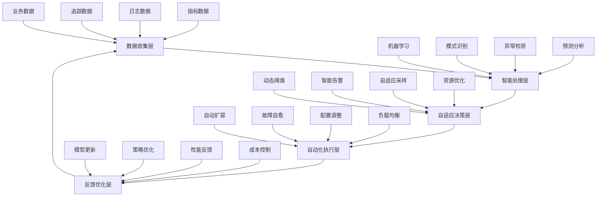

随着人工智能、机器学习和自动化技术的快速发展，监控系统正在从被动响应向主动预测和自适应优化转变。传统的基于规则和阈值的监控方法已经无法满足现代复杂微服务架构的需求。自适应与智能监控系统代表了可观察性领域的未来发展方向，它们能够自动学习系统行为、预测潜在问题、智能调整监控策略，并实现自主运维。本章将深入探讨自适应与智能监控系统的未来趋势。

## 智能监控系统架构

### 自适应监控核心组件

智能监控系统基于自适应和学习能力构建：



### 智能监控系统特性

```yaml
# 智能监控系统特性
intelligent_monitoring_features:
  self_learning:
    description: "自学习能力"
    characteristics:
      - 自动学习系统行为模式
      - 适应业务变化和季节性
      - 持续优化监控策略
      - 从历史数据中学习经验
      
  predictive_analytics:
    description: "预测分析能力"
    characteristics:
      - 预测系统性能趋势
      - 提前识别潜在问题
      - 容量规划和资源预测
      - 风险评估和预警
      
  autonomous_operations:
    description: "自主运维能力"
    characteristics:
      - 自动故障检测和修复
      - 智能资源调度
      - 动态配置调整
      - 自适应监控策略
      
  contextual_awareness:
    description: "上下文感知能力"
    characteristics:
      - 理解业务上下文
      - 关联多维度数据
      - 识别因果关系
      - 提供可操作的洞察
```

## 机器学习在监控中的应用

### 异常检测算法

```python
# 机器学习异常检测实现
import numpy as np
import pandas as pd
from sklearn.ensemble import IsolationForest
from sklearn.preprocessing import StandardScaler
from sklearn.cluster import DBSCAN
from sklearn.svm import OneClassSVM
from datetime import datetime, timedelta
from typing import Dict, Any, List, Tuple
import json

class MLAnomalyDetector:
    """机器学习异常检测器"""
    def __init__(self, service_name: str):
        self.service_name = service_name
        self.models = {}
        self.scalers = {}
        self.training_data = {}
        self.anomaly_history = []
        
    def train_isolation_forest(self, metric_name: str, training_data: List[float], 
                             contamination: float = 0.1):
        """训练孤立森林模型"""
        # 标准化数据
        scaler = StandardScaler()
        scaled_data = scaler.fit_transform(np.array(training_data).reshape(-1, 1))
        
        # 训练孤立森林模型
        model = IsolationForest(
            contamination=contamination,
            random_state=42,
            n_estimators=100
        )
        model.fit(scaled_data)
        
        # 保存模型和缩放器
        self.models[metric_name] = model
        self.scalers[metric_name] = scaler
        self.training_data[metric_name] = training_data.copy()
        
    def train_one_class_svm(self, metric_name: str, training_data: List[float], 
                          nu: float = 0.1):
        """训练一类SVM模型"""
        # 标准化数据
        scaler = StandardScaler()
        scaled_data = scaler.fit_transform(np.array(training_data).reshape(-1, 1))
        
        # 训练一类SVM模型
        model = OneClassSVM(nu=nu, kernel='rbf', gamma='scale')
        model.fit(scaled_data)
        
        # 保存模型和缩放器
        self.models[f"{metric_name}_svm"] = model
        self.scalers[f"{metric_name}_svm"] = scaler
        
    def detect_anomalies(self, metric_name: str, current_values: List[float]) -> Dict[str, Any]:
        """检测异常"""
        results = {}
        
        # 使用孤立森林检测
        if metric_name in self.models:
            results['isolation_forest'] = self._detect_with_isolation_forest(
                metric_name, current_values
            )
            
        # 使用一类SVM检测
        svm_model_name = f"{metric_name}_svm"
        if svm_model_name in self.models:
            results['one_class_svm'] = self._detect_with_one_class_svm(
                metric_name, current_values
            )
            
        # 综合结果
        results['consensus'] = self._get_consensus_result(results)
        
        # 记录异常历史
        if results['consensus']['is_anomaly']:
            self._record_anomaly(metric_name, current_values, results)
            
        return results
        
    def _detect_with_isolation_forest(self, metric_name: str, 
                                    values: List[float]) -> Dict[str, Any]:
        """使用孤立森林检测异常"""
        model = self.models[metric_name]
        scaler = self.scalers[metric_name]
        
        # 标准化数据
        scaled_values = scaler.transform(np.array(values).reshape(-1, 1))
        
        # 预测异常
        predictions = model.predict(scaled_values)
        anomaly_scores = model.decision_function(scaled_values)
        
        return {
            'is_anomaly': predictions == -1,
            'anomaly_scores': anomaly_scores,
            'anomaly_rate': np.mean(predictions == -1)
        }
        
    def _detect_with_one_class_svm(self, metric_name: str, 
                                 values: List[float]) -> Dict[str, Any]:
        """使用一类SVM检测异常"""
        model_name = f"{metric_name}_svm"
        model = self.models[model_name]
        scaler = self.scalers[model_name]
        
        # 标准化数据
        scaled_values = scaler.transform(np.array(values).reshape(-1, 1))
        
        # 预测异常
        predictions = model.predict(scaled_values)
        
        return {
            'is_anomaly': predictions == -1,
            'anomaly_rate': np.mean(predictions == -1)
        }
        
    def _get_consensus_result(self, results: Dict[str, Any]) -> Dict[str, Any]:
        """获取共识结果"""
        if not results:
            return {'is_anomaly': False, 'confidence': 0.0}
            
        # 简单的多数投票
        anomaly_votes = 0
        total_votes = 0
        
        for method, result in results.items():
            if 'is_anomaly' in result:
                if isinstance(result['is_anomaly'], np.ndarray):
                    anomaly_votes += np.sum(result['is_anomaly'])
                    total_votes += len(result['is_anomaly'])
                else:
                    anomaly_votes += int(result['is_anomaly'])
                    total_votes += 1
                    
        is_anomaly = anomaly_votes > total_votes / 2
        confidence = anomaly_votes / total_votes if total_votes > 0 else 0.0
        
        return {
            'is_anomaly': is_anomaly,
            'confidence': confidence,
            'votes': {
                'anomaly': anomaly_votes,
                'total': total_votes
            }
        }
        
    def _record_anomaly(self, metric_name: str, values: List[float], 
                       detection_results: Dict[str, Any]):
        """记录异常"""
        anomaly_record = {
            'timestamp': datetime.utcnow().isoformat(),
            'service': self.service_name,
            'metric_name': metric_name,
            'values': values,
            'detection_results': detection_results,
            'severity': 'high' if detection_results['consensus']['confidence'] > 0.8 else 'medium'
        }
        
        self.anomaly_history.append(anomaly_record)
        
    def get_anomaly_summary(self, hours: int = 24) -> Dict[str, Any]:
        """获取异常摘要"""
        cutoff_time = datetime.utcnow() - timedelta(hours=hours)
        
        recent_anomalies = [
            anomaly for anomaly in self.anomaly_history
            if datetime.fromisoformat(anomaly['timestamp']) > cutoff_time
        ]
        
        # 按指标分组统计
        metric_stats = {}
        for anomaly in recent_anomalies:
            metric = anomaly['metric_name']
            if metric not in metric_stats:
                metric_stats[metric] = {
                    'count': 0,
                    'high_severity': 0,
                    'medium_severity': 0,
                    'latest_anomaly': None
                }
            metric_stats[metric]['count'] += 1
            if anomaly['severity'] == 'high':
                metric_stats[metric]['high_severity'] += 1
            else:
                metric_stats[metric]['medium_severity'] += 1
            metric_stats[metric]['latest_anomaly'] = anomaly['timestamp']
            
        return {
            'total_anomalies': len(recent_anomalies),
            'time_period_hours': hours,
            'metric_statistics': metric_stats,
            'anomaly_rate': len(recent_anomalies) / hours if hours > 0 else 0
        }

# 时间序列预测实现
class TimeSeriesPredictor:
    """时间序列预测器"""
    def __init__(self, service_name: str):
        self.service_name = service_name
        self.models = {}
        self.scalers = {}
        self.prediction_history = []
        
    def train_lstm_model(self, metric_name: str, time_series_data: List[float], 
                        sequence_length: int = 10, epochs: int = 50):
        """训练LSTM模型"""
        try:
            import tensorflow as tf
            from tensorflow.keras.models import Sequential
            from tensorflow.keras.layers import LSTM, Dense, Dropout
            
            # 准备数据
            X, y = self._prepare_lstm_data(time_series_data, sequence_length)
            
            # 标准化数据
            scaler = StandardScaler()
            X_scaled = scaler.fit_transform(X)
            y_scaled = scaler.fit_transform(np.array(y).reshape(-1, 1)).flatten()
            
            # 重塑数据以适应LSTM输入
            X_reshaped = X_scaled.reshape((X_scaled.shape[0], X_scaled.shape[1], 1))
            
            # 构建LSTM模型
            model = Sequential([
                LSTM(50, return_sequences=True, input_shape=(sequence_length, 1)),
                Dropout(0.2),
                LSTM(50, return_sequences=False),
                Dropout(0.2),
                Dense(25),
                Dense(1)
            ])
            
            model.compile(optimizer='adam', loss='mean_squared_error')
            
            # 训练模型
            model.fit(X_reshaped, y_scaled, batch_size=32, epochs=epochs, verbose=0)
            
            # 保存模型和缩放器
            self.models[metric_name] = model
            self.scalers[metric_name] = scaler
            
        except ImportError:
            print("TensorFlow not available, skipping LSTM training")
            
    def _prepare_lstm_data(self, data: List[float], sequence_length: int) -> Tuple[np.ndarray, np.ndarray]:
        """准备LSTM训练数据"""
        X, y = [], []
        for i in range(len(data) - sequence_length):
            X.append(data[i:(i + sequence_length)])
            y.append(data[i + sequence_length])
        return np.array(X), np.array(y)
        
    def predict_future_values(self, metric_name: str, recent_data: List[float], 
                            steps: int = 5) -> Dict[str, Any]:
        """预测未来值"""
        if metric_name not in self.models:
            return {'error': 'Model not trained for this metric'}
            
        model = self.models[metric_name]
        scaler = self.scalers[metric_name]
        
        # 准备输入数据
        sequence_length = model.input_shape[1]
        if len(recent_data) < sequence_length:
            return {'error': 'Insufficient data for prediction'}
            
        input_sequence = np.array(recent_data[-sequence_length:]).reshape(1, sequence_length, 1)
        input_scaled = scaler.transform(input_sequence.reshape(-1, 1)).reshape(1, sequence_length, 1)
        
        # 进行预测
        predictions = []
        current_sequence = input_scaled.copy()
        
        for _ in range(steps):
            pred_scaled = model.predict(current_sequence, verbose=0)[0]
            pred_original = scaler.inverse_transform(pred_scaled.reshape(-1, 1))[0][0]
            predictions.append(pred_original)
            
            # 更新序列（滑动窗口）
            current_sequence = np.roll(current_sequence, -1, axis=1)
            current_sequence[0, -1, 0] = pred_scaled
            
        # 记录预测历史
        self._record_prediction(metric_name, recent_data, predictions)
        
        return {
            'predictions': predictions,
            'confidence_intervals': self._calculate_confidence_intervals(predictions),
            'trend': self._analyze_trend(predictions)
        }
        
    def _calculate_confidence_intervals(self, predictions: List[float]) -> List[Dict[str, float]]:
        """计算置信区间"""
        # 简化的置信区间计算
        std_dev = np.std(predictions) if len(predictions) > 1 else 0
        confidence_intervals = []
        
        for pred in predictions:
            confidence_intervals.append({
                'prediction': pred,
                'lower_bound': pred - 1.96 * std_dev,
                'upper_bound': pred + 1.96 * std_dev
            })
            
        return confidence_intervals
        
    def _analyze_trend(self, predictions: List[float]) -> str:
        """分析趋势"""
        if len(predictions) < 2:
            return 'stable'
            
        # 简单的线性趋势分析
        x = np.arange(len(predictions))
        slope = np.polyfit(x, predictions, 1)[0]
        
        if slope > 0.1:
            return 'increasing'
        elif slope < -0.1:
            return 'decreasing'
        else:
            return 'stable'
            
    def _record_prediction(self, metric_name: str, input_data: List[float], 
                          predictions: List[float]):
        """记录预测"""
        prediction_record = {
            'timestamp': datetime.utcnow().isoformat(),
            'service': self.service_name,
            'metric_name': metric_name,
            'input_data': input_data[-10:],  # 最近10个数据点
            'predictions': predictions,
            'trend': self._analyze_trend(predictions)
        }
        
        self.prediction_history.append(prediction_record)
        
    def get_prediction_accuracy(self, metric_name: str, hours: int = 24) -> Dict[str, Any]:
        """获取预测准确性"""
        cutoff_time = datetime.utcnow() - timedelta(hours=hours)
        
        recent_predictions = [
            pred for pred in self.prediction_history
            if (pred['metric_name'] == metric_name and
                datetime.fromisoformat(pred['timestamp']) > cutoff_time)
        ]
        
        if not recent_predictions:
            return {'accuracy': None, 'prediction_count': 0}
            
        # 计算准确性（简化实现）
        accurate_predictions = len([p for p in recent_predictions 
                                  if p['trend'] in ['increasing', 'decreasing', 'stable']])
        
        accuracy = accurate_predictions / len(recent_predictions)
        
        return {
            'accuracy': accuracy,
            'prediction_count': len(recent_predictions),
            'time_period_hours': hours
        }

# 使用示例
def demonstrate_ml_monitoring():
    """演示机器学习监控"""
    # 初始化异常检测器
    anomaly_detector = MLAnomalyDetector('UserService')
    
    # 生成训练数据（模拟正常系统行为）
    np.random.seed(42)
    normal_response_times = np.random.normal(100, 15, 1000).tolist()  # 平均100ms
    normal_error_rates = np.random.beta(1, 19, 1000).tolist()  # 平均5%错误率
    
    # 训练模型
    anomaly_detector.train_isolation_forest('response_time', normal_response_times)
    anomaly_detector.train_isolation_forest('error_rate', normal_error_rates)
    
    # 模拟实时数据（包含一些异常值）
    current_response_times = [95, 102, 150, 98, 200, 101, 99, 103, 97, 105]  # 包含异常值150, 200
    current_error_rates = [0.03, 0.07, 0.02, 0.01, 0.15, 0.04, 0.06, 0.03, 0.02, 0.05]  # 包含异常值0.15
    
    # 检测异常
    response_anomalies = anomaly_detector.detect_anomalies('response_time', current_response_times)
    error_anomalies = anomaly_detector.detect_anomalies('error_rate', current_error_rates)
    
    print("Response time anomalies:", response_anomalies['consensus'])
    print("Error rate anomalies:", error_anomalies['consensus'])
    
    # 获取异常摘要
    anomaly_summary = anomaly_detector.get_anomaly_summary()
    print("Anomaly summary:", json.dumps(anomaly_summary, indent=2))
    
    # 初始化时间序列预测器
    predictor = TimeSeriesPredictor('UserService')
    
    # 生成时间序列数据
    time_points = np.linspace(0, 100, 1000)
    trend = 50 + 10 * np.sin(2 * np.pi * time_points / 50)
    noise = np.random.normal(0, 2, 1000)
    cpu_usage = (trend + noise).tolist()
    
    # 训练预测模型（如果TensorFlow可用）
    try:
        predictor.train_lstm_model('cpu_usage', cpu_usage[:800])
        
        # 预测未来值
        recent_data = cpu_usage[800:900]
        predictions = predictor.predict_future_values('cpu_usage', recent_data, steps=5)
        print("CPU usage predictions:", predictions)
        
    except Exception as e:
        print(f"Skipping prediction demo: {e}")

# demonstrate_ml_monitoring()
```

## 自适应阈值调整

### 动态阈值算法

```python
# 自适应阈值调整实现
import numpy as np
from datetime import datetime, timedelta
from typing import Dict, Any, List
import json

class AdaptiveThresholdManager:
    """自适应阈值管理器"""
    def __init__(self, service_name: str):
        self.service_name = service_name
        self.thresholds = {}
        self.historical_data = {}
        self.adaptation_rules = {}
        
    def set_initial_threshold(self, metric_name: str, threshold_config: Dict[str, Any]):
        """设置初始阈值"""
        self.thresholds[metric_name] = {
            'config': threshold_config,
            'current_value': threshold_config.get('initial_value'),
            'last_updated': datetime.utcnow().isoformat(),
            'adaptation_count': 0
        }
        
    def add_adaptation_rule(self, rule_name: str, rule_config: Dict[str, Any]):
        """添加自适应规则"""
        self.adaptation_rules[rule_name] = rule_config
        
    def update_threshold(self, metric_name: str, current_value: float, 
                        context: Dict[str, Any] = None):
        """更新阈值"""
        if metric_name not in self.thresholds:
            return
            
        threshold_info = self.thresholds[metric_name]
        config = threshold_info['config']
        
        # 存储历史数据
        if metric_name not in self.historical_data:
            self.historical_data[metric_name] = []
        self.historical_data[metric_name].append({
            'timestamp': datetime.utcnow().isoformat(),
            'value': current_value,
            'context': context or {}
        })
        
        # 保持历史数据在合理范围内
        if len(self.historical_data[metric_name]) > 1000:
            self.historical_data[metric_name] = self.historical_data[metric_name][-1000:]
            
        # 应用自适应规则
        new_threshold = self._apply_adaptation_rules(
            metric_name, 
            current_value, 
            threshold_info['current_value'],
            context
        )
        
        if new_threshold != threshold_info['current_value']:
            threshold_info['current_value'] = new_threshold
            threshold_info['last_updated'] = datetime.utcnow().isoformat()
            threshold_info['adaptation_count'] += 1
            
            # 记录阈值变更
            self._log_threshold_change(metric_name, new_threshold)
            
    def _apply_adaptation_rules(self, metric_name: str, current_value: float, 
                              current_threshold: float, 
                              context: Dict[str, Any] = None) -> float:
        """应用自适应规则"""
        new_threshold = current_threshold
        
        for rule_name, rule_config in self.adaptation_rules.items():
            # 检查规则是否适用于此指标
            if 'metrics' in rule_config:
                if metric_name not in rule_config['metrics']:
                    continue
                    
            # 应用具体的调整逻辑
            rule_type = rule_config.get('type', 'statistical')
            
            if rule_type == 'statistical':
                new_threshold = self._apply_statistical_adaptation(
                    metric_name, current_value, current_threshold, rule_config
                )
            elif rule_type == 'contextual':
                new_threshold = self._apply_contextual_adaptation(
                    metric_name, current_value, current_threshold, context, rule_config
                )
            elif rule_type == 'trend_based':
                new_threshold = self._apply_trend_based_adaptation(
                    metric_name, current_value, current_threshold, rule_config
                )
                
        return new_threshold
        
    def _apply_statistical_adaptation(self, metric_name: str, current_value: float, 
                                   current_threshold: float, 
                                   rule_config: Dict[str, Any]) -> float:
        """应用统计自适应"""
        # 获取历史数据
        history = self.historical_data.get(metric_name, [])
        if len(history) < rule_config.get('min_samples', 10):
            return current_threshold
            
        # 计算统计指标
        values = [h['value'] for h in history[-rule_config.get('window_size', 100):]]
        mean = np.mean(values)
        std = np.std(values)
        
        # 基于统计的阈值调整
        adaptation_factor = rule_config.get('adaptation_factor', 0.1)
        target_percentile = rule_config.get('target_percentile', 95)
        
        # 计算目标阈值
        target_threshold = np.percentile(values, target_percentile)
        
        # 平滑调整
        new_threshold = current_threshold + adaptation_factor * (target_threshold - current_threshold)
        
        # 应用边界限制
        min_threshold = rule_config.get('min_threshold', 0)
        max_threshold = rule_config.get('max_threshold', float('inf'))
        
        new_threshold = max(min_threshold, min(max_threshold, new_threshold))
        
        return new_threshold
        
    def _apply_contextual_adaptation(self, metric_name: str, current_value: float, 
                                   current_threshold: float, context: Dict[str, Any],
                                   rule_config: Dict[str, Any]) -> float:
        """应用上下文自适应"""
        if not context:
            return current_threshold
            
        # 基于上下文的阈值调整
        context_factor = 1.0
        
        # 业务高峰期调整
        if context.get('business_hours', False):
            context_factor *= rule_config.get('business_hours_factor', 1.2)
            
        # 系统负载调整
        system_load = context.get('system_load', 0.5)
        if system_load > 0.8:
            context_factor *= rule_config.get('high_load_factor', 1.3)
        elif system_load < 0.2:
            context_factor *= rule_config.get('low_load_factor', 0.8)
            
        # 用户活动调整
        user_activity = context.get('user_activity', 1.0)
        context_factor *= (user_activity / 1.0)  # 基于基准用户活动的调整
            
        new_threshold = current_threshold * context_factor
        
        return new_threshold
        
    def _apply_trend_based_adaptation(self, metric_name: str, current_value: float, 
                                    current_threshold: float, 
                                    rule_config: Dict[str, Any]) -> float:
        """应用趋势自适应"""
        history = self.historical_data.get(metric_name, [])
        if len(history) < rule_config.get('min_samples', 20):
            return current_threshold
            
        # 计算趋势
        recent_history = history[-rule_config.get('trend_window', 50):]
        values = [h['value'] for h in recent_history]
        
        if len(values) < 2:
            return current_threshold
            
        # 简单线性趋势
        x = np.arange(len(values))
        slope = np.polyfit(x, values, 1)[0]
        
        # 基于趋势的调整
        trend_factor = rule_config.get('trend_factor', 0.05)
        trend_adjustment = 1.0 + (slope * trend_factor)
        
        new_threshold = current_threshold * trend_adjustment
        
        return new_threshold
        
    def _log_threshold_change(self, metric_name: str, new_threshold: float):
        """记录阈值变更"""
        print(f"Threshold updated for {metric_name}: {new_threshold}")
        
    def get_threshold(self, metric_name: str) -> float:
        """获取当前阈值"""
        if metric_name in self.thresholds:
            return self.thresholds[metric_name]['current_value']
        return None
        
    def get_threshold_history(self, metric_name: str, hours: int = 24) -> List[Dict[str, Any]]:
        """获取阈值历史"""
        if metric_name not in self.thresholds:
            return []
            
        threshold_info = self.thresholds[metric_name]
        cutoff_time = datetime.utcnow() - timedelta(hours=hours)
        
        # 简化的阈值历史（实际实现中应存储每次变更）
        return [
            {
                'timestamp': threshold_info['last_updated'],
                'threshold': threshold_info['current_value'],
                'adaptation_count': threshold_info['adaptation_count']
            }
        ]
        
    def get_adaptation_summary(self) -> Dict[str, Any]:
        """获取自适应摘要"""
        summary = {
            'service': self.service_name,
            'total_metrics': len(self.thresholds),
            'adaptation_rules': len(self.adaptation_rules),
            'total_adaptations': sum(t['adaptation_count'] for t in self.thresholds.values())
        }
        
        # 按指标统计
        metric_stats = {}
        for metric_name, threshold_info in self.thresholds.items():
            metric_stats[metric_name] = {
                'current_threshold': threshold_info['current_value'],
                'adaptation_count': threshold_info['adaptation_count'],
                'last_updated': threshold_info['last_updated']
            }
            
        summary['metric_statistics'] = metric_stats
        return summary

# 使用示例
def demonstrate_adaptive_thresholds():
    """演示自适应阈值"""
    # 初始化自适应阈值管理器
    threshold_manager = AdaptiveThresholdManager('UserService')
    
    # 设置初始阈值
    threshold_manager.set_initial_threshold('response_time', {
        'initial_value': 1000,  # 1秒
        'min_threshold': 100,   # 100毫秒
        'max_threshold': 5000   # 5秒
    })
    
    threshold_manager.set_initial_threshold('error_rate', {
        'initial_value': 0.05,  # 5%
        'min_threshold': 0.001, # 0.1%
        'max_threshold': 0.5    # 50%
    })
    
    # 添加自适应规则
    threshold_manager.add_adaptation_rule('statistical_adaptation', {
        'type': 'statistical',
        'metrics': ['response_time', 'error_rate'],
        'min_samples': 10,
        'window_size': 100,
        'target_percentile': 95,
        'adaptation_factor': 0.1
    })
    
    threshold_manager.add_adaptation_rule('contextual_adaptation', {
        'type': 'contextual',
        'metrics': ['response_time'],
        'business_hours_factor': 1.2,
        'high_load_factor': 1.3,
        'low_load_factor': 0.8
    })
    
    threshold_manager.add_adaptation_rule('trend_adaptation', {
        'type': 'trend_based',
        'metrics': ['error_rate'],
        'min_samples': 20,
        'trend_window': 50,
        'trend_factor': 0.05
    })
    
    # 模拟阈值更新
    # 正常业务数据
    for i in range(100):
        response_time = np.random.normal(200, 50)  # 平均200ms
        error_rate = np.random.beta(1, 19)  # 平均5%错误率
        
        context = {
            'business_hours': True,
            'system_load': 0.6,
            'user_activity': 1.0
        }
        
        threshold_manager.update_threshold('response_time', response_time, context)
        threshold_manager.update_threshold('error_rate', error_rate, context)
        
        if i % 20 == 0:  # 每20次更新显示一次当前阈值
            response_threshold = threshold_manager.get_threshold('response_time')
            error_threshold = threshold_manager.get_threshold('error_rate')
            print(f"Iteration {i}: Response threshold = {response_threshold:.2f}ms, "
                  f"Error threshold = {error_threshold:.4f}")
    
    # 高负载情况下的阈值调整
    print("\nSimulating high load scenario...")
    for i in range(20):
        response_time = np.random.normal(500, 100)  # 平均500ms（高负载）
        error_rate = np.random.beta(2, 18)  # 平均10%错误率（高错误率）
        
        context = {
            'business_hours': True,
            'system_load': 0.9,  # 高负载
            'user_activity': 2.0  # 高用户活动
        }
        
        threshold_manager.update_threshold('response_time', response_time, context)
        threshold_manager.update_threshold('error_rate', error_rate, context)
        
    # 显示最终阈值
    final_response_threshold = threshold_manager.get_threshold('response_time')
    final_error_threshold = threshold_manager.get_threshold('error_rate')
    print(f"\nFinal thresholds:")
    print(f"Response time threshold: {final_response_threshold:.2f}ms")
    print(f"Error rate threshold: {final_error_threshold:.4f}")
    
    # 获取自适应摘要
    adaptation_summary = threshold_manager.get_adaptation_summary()
    print("\nAdaptation summary:")
    print(json.dumps(adaptation_summary, indent=2))

# demonstrate_adaptive_thresholds()
```

## 智能告警与自动化响应

### 智能告警系统

```python
# 智能告警与自动化响应实现
import asyncio
import json
from datetime import datetime, timedelta
from typing import Dict, Any, List, Callable
from collections import defaultdict, deque
import heapq

class IntelligentAlertingSystem:
    """智能告警系统"""
    def __init__(self, system_name: str):
        self.system_name = system_name
        self.alert_rules = []
        self.active_alerts = {}
        self.alert_history = deque(maxlen=1000)
        self.notification_channels = {}
        self.automation_actions = {}
        self.alert_suppressions = []
        
    def add_alert_rule(self, rule_config: Dict[str, Any]):
        """添加告警规则"""
        rule_id = rule_config.get('rule_id') or f"rule_{len(self.alert_rules)}"
        rule_config['rule_id'] = rule_id
        rule_config['created_at'] = datetime.utcnow().isoformat()
        rule_config['enabled'] = rule_config.get('enabled', True)
        
        self.alert_rules.append(rule_config)
        
    def add_notification_channel(self, channel_name: str, 
                               channel_config: Dict[str, Any]):
        """添加通知渠道"""
        self.notification_channels[channel_name] = channel_config
        
    def add_automation_action(self, action_name: str, 
                            action_func: Callable):
        """添加自动化动作"""
        self.automation_actions[action_name] = action_func
        
    def evaluate_alerts(self, metrics: Dict[str, Any], 
                       context: Dict[str, Any] = None):
        """评估告警"""
        triggered_alerts = []
        
        for rule in self.alert_rules:
            if not rule.get('enabled', True):
                continue
                
            if self._evaluate_alert_rule(rule, metrics, context):
                alert = self._create_alert(rule, metrics, context)
                triggered_alerts.append(alert)
                
        # 处理触发的告警
        for alert in triggered_alerts:
            self._process_alert(alert)
            
    def _evaluate_alert_rule(self, rule: Dict[str, Any], 
                           metrics: Dict[str, Any], 
                           context: Dict[str, Any] = None) -> bool:
        """评估告警规则"""
        # 检查条件
        if 'conditions' in rule:
            for condition in rule['conditions']:
                if not self._evaluate_condition(condition, metrics, context):
                    return False
                    
        # 检查持续时间
        if 'duration' in rule:
            if not self._check_duration_condition(rule, metrics):
                return False
                
        # 检查抑制规则
        if self._is_alert_suppressed(rule, metrics, context):
            return False
            
        return True
        
    def _evaluate_condition(self, condition: Dict[str, Any], 
                          metrics: Dict[str, Any], 
                          context: Dict[str, Any] = None) -> bool:
        """评估条件"""
        metric_name = condition.get('metric')
        operator = condition.get('operator')
        threshold = condition.get('threshold')
        
        if metric_name not in metrics:
            return False
            
        metric_value = metrics[metric_name]
        
        if operator == 'gt':
            return metric_value > threshold
        elif operator == 'lt':
            return metric_value < threshold
        elif operator == 'eq':
            return metric_value == threshold
        elif operator == 'ge':
            return metric_value >= threshold
        elif operator == 'le':
            return metric_value <= threshold
        elif operator == 'ne':
            return metric_value != threshold
            
        return False
        
    def _check_duration_condition(self, rule: Dict[str, Any], 
                                metrics: Dict[str, Any]) -> bool:
        """检查持续时间条件"""
        duration = rule.get('duration', 0)
        if duration <= 0:
            return True
            
        rule_id = rule['rule_id']
        
        # 检查此规则最近是否持续触发
        recent_triggers = [
            alert for alert in self.alert_history
            if (alert.get('rule_id') == rule_id and
                datetime.utcnow() - datetime.fromisoformat(alert['timestamp']) < timedelta(seconds=duration))
        ]
        
        return len(recent_triggers) > 0
        
    def _is_alert_suppressed(self, rule: Dict[str, Any], 
                           metrics: Dict[str, Any], 
                           context: Dict[str, Any] = None) -> bool:
        """检查告警是否被抑制"""
        for suppression in self.alert_suppressions:
            if self._evaluate_suppression(suppression, rule, metrics, context):
                return True
        return False
        
    def _evaluate_suppression(self, suppression: Dict[str, Any], 
                            rule: Dict[str, Any], 
                            metrics: Dict[str, Any], 
                            context: Dict[str, Any] = None) -> bool:
        """评估抑制规则"""
        # 简化的抑制逻辑
        if suppression.get('rule_id') == rule['rule_id']:
            return True
        return False
        
    def _create_alert(self, rule: Dict[str, Any], 
                     metrics: Dict[str, Any], 
                     context: Dict[str, Any] = None) -> Dict[str, Any]:
        """创建告警"""
        alert_id = f"alert_{datetime.utcnow().timestamp()}"
        
        alert = {
            'alert_id': alert_id,
            'rule_id': rule['rule_id'],
            'timestamp': datetime.utcnow().isoformat(),
            'severity': rule.get('severity', 'medium'),
            'title': rule.get('title', 'Alert'),
            'description': rule.get('description', ''),
            'metrics': metrics,
            'context': context or {},
            'status': 'triggered'
        }
        
        return alert
        
    def _process_alert(self, alert: Dict[str, Any]):
        """处理告警"""
        alert_id = alert['alert_id']
        
        # 检查是否已存在相同规则的活跃告警
        existing_alert = self._find_existing_alert(alert['rule_id'])
        if existing_alert:
            # 更新现有告警
            existing_alert['timestamp'] = alert['timestamp']
            existing_alert['metrics'] = alert['metrics']
            existing_alert['status'] = 'active'
        else:
            # 创建新告警
            self.active_alerts[alert_id] = alert
            
        # 添加到历史记录
        self.alert_history.append(alert)
        
        # 发送通知
        self._send_notifications(alert)
        
        # 执行自动化动作
        self._execute_automation_actions(alert)
        
    def _find_existing_alert(self, rule_id: str) -> Dict[str, Any]:
        """查找现有的活跃告警"""
        for alert in self.active_alerts.values():
            if alert['rule_id'] == rule_id and alert['status'] in ['triggered', 'active']:
                return alert
        return None
        
    def _send_notifications(self, alert: Dict[str, Any]):
        """发送通知"""
        rule = next((r for r in self.alert_rules if r['rule_id'] == alert['rule_id']), None)
        if not rule:
            return
            
        channels = rule.get('notification_channels', [])
        for channel_name in channels:
            if channel_name in self.notification_channels:
                self._send_notification_to_channel(
                    channel_name, 
                    self.notification_channels[channel_name], 
                    alert
                )
                
    def _send_notification_to_channel(self, channel_name: str, 
                                    channel_config: Dict[str, Any], 
                                    alert: Dict[str, Any]):
        """发送通知到特定渠道"""
        channel_type = channel_config.get('type', 'console')
        
        if channel_type == 'console':
            print(f"ALERT [{alert['severity']}]: {alert['title']}")
            print(f"Description: {alert['description']}")
            print(f"Metrics: {json.dumps(alert['metrics'], indent=2)}")
        elif channel_type == 'email':
            # 简化的邮件发送
            print(f"Sending email alert to {channel_config.get('recipients')}")
        elif channel_type == 'slack':
            # 简化的Slack通知
            print(f"Sending Slack alert to {channel_config.get('webhook_url')}")
            
    def _execute_automation_actions(self, alert: Dict[str, Any]):
        """执行自动化动作"""
        rule = next((r for r in self.alert_rules if r['rule_id'] == alert['rule_id']), None)
        if not rule:
            return
            
        actions = rule.get('automation_actions', [])
        for action_name in actions:
            if action_name in self.automation_actions:
                try:
                    self.automation_actions[action_name](alert)
                except Exception as e:
                    print(f"Error executing automation action {action_name}: {e}")
                    
    def add_alert_suppression(self, suppression_rule: Dict[str, Any]):
        """添加告警抑制规则"""
        self.alert_suppressions.append(suppression_rule)
        
    def resolve_alert(self, alert_id: str):
        """解决告警"""
        if alert_id in self.active_alerts:
            alert = self.active_alerts[alert_id]
            alert['status'] = 'resolved'
            alert['resolved_at'] = datetime.utcnow().isoformat()
            
    def get_active_alerts(self) -> List[Dict[str, Any]]:
        """获取活跃告警"""
        return [alert for alert in self.active_alerts.values() 
                if alert['status'] in ['triggered', 'active']]
        
    def get_alert_statistics(self, hours: int = 24) -> Dict[str, Any]:
        """获取告警统计"""
        cutoff_time = datetime.utcnow() - timedelta(hours=hours)
        
        recent_alerts = [
            alert for alert in self.alert_history
            if datetime.fromisoformat(alert['timestamp']) > cutoff_time
        ]
        
        # 按严重性统计
        severity_stats = defaultdict(int)
        for alert in recent_alerts:
            severity_stats[alert['severity']] += 1
            
        # 按规则统计
        rule_stats = defaultdict(int)
        for alert in recent_alerts:
            rule_stats[alert['rule_id']] += 1
            
        return {
            'total_alerts': len(recent_alerts),
            'severity_distribution': dict(severity_stats),
            'rule_distribution': dict(rule_stats),
            'active_alerts': len(self.get_active_alerts()),
            'time_period_hours': hours
        }

# 自动化动作示例
class AutomationActions:
    """自动化动作示例"""
    
    @staticmethod
    def scale_up_service(alert: Dict[str, Any]):
        """自动扩容服务"""
        print(f"Scaling up service due to alert: {alert['title']}")
        # 实际实现中会调用云服务API进行扩容
        
    @staticmethod
    def restart_service(alert: Dict[str, Any]):
        """自动重启服务"""
        print(f"Restarting service due to alert: {alert['title']}")
        # 实际实现中会执行服务重启操作
        
    @staticmethod
    def send_to_escalation(alert: Dict[str, Any]):
        """发送到升级流程"""
        print(f"Escalating alert: {alert['title']}")
        # 实际实现中会发送给高级运维团队

# 使用示例
def demonstrate_intelligent_alerting():
    """演示智能告警系统"""
    # 初始化智能告警系统
    alerting_system = IntelligentAlertingSystem('ProductionSystem')
    
    # 添加通知渠道
    alerting_system.add_notification_channel('ops_team', {
        'type': 'console',
        'recipients': ['ops-team@example.com']
    })
    
    alerting_system.add_notification_channel('slack_alerts', {
        'type': 'slack',
        'webhook_url': 'https://hooks.slack.com/services/XXX'
    })
    
    # 添加自动化动作
    alerting_system.add_automation_action('scale_up', AutomationActions.scale_up_service)
    alerting_system.add_automation_action('restart_service', AutomationActions.restart_service)
    alerting_system.add_automation_action('escalate', AutomationActions.send_to_escalation)
    
    # 添加告警规则
    alerting_system.add_alert_rule({
        'rule_id': 'high_response_time',
        'title': 'High Response Time',
        'description': 'Response time exceeded threshold',
        'severity': 'high',
        'conditions': [
            {'metric': 'response_time', 'operator': 'gt', 'threshold': 1000}
        ],
        'duration': 300,  # 5分钟内持续触发
        'notification_channels': ['ops_team', 'slack_alerts'],
        'automation_actions': ['scale_up']
    })
    
    alerting_system.add_alert_rule({
        'rule_id': 'high_error_rate',
        'title': 'High Error Rate',
        'description': 'Error rate exceeded threshold',
        'severity': 'critical',
        'conditions': [
            {'metric': 'error_rate', 'operator': 'gt', 'threshold': 0.1}
        ],
        'notification_channels': ['ops_team'],
        'automation_actions': ['restart_service', 'escalate']
    })
    
    # 模拟正常指标数据
    print("Simulating normal system behavior...")
    for i in range(10):
        metrics = {
            'response_time': np.random.normal(200, 50),  # 平均200ms
            'error_rate': np.random.beta(1, 19)  # 平均5%错误率
        }
        
        context = {
            'service': 'UserService',
            'environment': 'production'
        }
        
        alerting_system.evaluate_alerts(metrics, context)
        active_alerts = alerting_system.get_active_alerts()
        print(f"Iteration {i}: Active alerts = {len(active_alerts)}")
        
        asyncio.sleep(0.1)  # 模拟时间间隔
    
    # 模拟异常情况
    print("\nSimulating high response time scenario...")
    for i in range(5):
        metrics = {
            'response_time': 1500 + np.random.normal(0, 100),  # 高响应时间
            'error_rate': np.random.beta(1, 19)  # 正常错误率
        }
        
        context = {
            'service': 'UserService',
            'environment': 'production'
        }
        
        alerting_system.evaluate_alerts(metrics, context)
        active_alerts = alerting_system.get_active_alerts()
        print(f"High response time iteration {i}: Active alerts = {len(active_alerts)}")
        
        asyncio.sleep(0.1)
    
    # 显示告警统计
    alert_stats = alerting_system.get_alert_statistics()
    print("\nAlert statistics:")
    print(json.dumps(alert_stats, indent=2))
    
    # 显示活跃告警
    active_alerts = alerting_system.get_active_alerts()
    print(f"\nActive alerts ({len(active_alerts)}):")
    for alert in active_alerts:
        print(f"  - {alert['title']} ({alert['severity']}) at {alert['timestamp']}")

# demonstrate_intelligent_alerting()
```

## 自主运维与优化

### 自主优化系统

```python
# 自主运维与优化实现
import asyncio
import json
from datetime import datetime, timedelta
from typing import Dict, Any, List, Callable
import numpy as np

class AutonomousOptimizationSystem:
    """自主优化系统"""
    def __init__(self, system_name: str):
        self.system_name = system_name
        self.optimization_goals = []
        self.optimization_policies = []
        self.resource_managers = {}
        self.performance_metrics = {}
        self.optimization_history = []
        self.recommendation_engine = RecommendationEngine()
        
    def add_optimization_goal(self, goal_config: Dict[str, Any]):
        """添加优化目标"""
        goal_id = goal_config.get('goal_id') or f"goal_{len(self.optimization_goals)}"
        goal_config['goal_id'] = goal_id
        goal_config['created_at'] = datetime.utcnow().isoformat()
        goal_config['enabled'] = goal_config.get('enabled', True)
        
        self.optimization_goals.append(goal_config)
        
    def add_optimization_policy(self, policy_config: Dict[str, Any]):
        """添加优化策略"""
        policy_id = policy_config.get('policy_id') or f"policy_{len(self.optimization_policies)}"
        policy_config['policy_id'] = policy_id
        policy_config['created_at'] = datetime.utcnow().isoformat()
        
        self.optimization_policies.append(policy_config)
        
    def add_resource_manager(self, resource_type: str, 
                           manager: 'ResourceManager'):
        """添加资源管理器"""
        self.resource_managers[resource_type] = manager
        
    def collect_performance_metrics(self, metrics: Dict[str, Any]):
        """收集性能指标"""
        timestamp = datetime.utcnow().isoformat()
        
        for metric_name, value in metrics.items():
            if metric_name not in self.performance_metrics:
                self.performance_metrics[metric_name] = []
            self.performance_metrics[metric_name].append({
                'timestamp': timestamp,
                'value': value
            })
            
            # 保持历史数据在合理范围内
            if len(self.performance_metrics[metric_name]) > 1000:
                self.performance_metrics[metric_name] = \
                    self.performance_metrics[metric_name][-1000:]
                    
    def run_optimization_cycle(self):
        """运行优化周期"""
        # 分析当前性能
        performance_analysis = self._analyze_performance()
        
        # 生成优化建议
        recommendations = self.recommendation_engine.generate_recommendations(
            performance_analysis,
            self.optimization_goals
        )
        
        # 执行优化动作
        executed_actions = []
        for recommendation in recommendations:
            if self._execute_recommendation(recommendation):
                executed_actions.append(recommendation)
                
        # 记录优化历史
        optimization_record = {
            'timestamp': datetime.utcnow().isoformat(),
            'performance_analysis': performance_analysis,
            'recommendations': recommendations,
            'executed_actions': executed_actions,
            'system_state': self._get_system_state()
        }
        
        self.optimization_history.append(optimization_record)
        
        return optimization_record
        
    def _analyze_performance(self) -> Dict[str, Any]:
        """分析性能"""
        analysis = {
            'timestamp': datetime.utcnow().isoformat(),
            'metrics': {}
        }
        
        for metric_name, history in self.performance_metrics.items():
            if not history:
                continue
                
            recent_values = [h['value'] for h in history[-100:]]  # 最近100个值
            analysis['metrics'][metric_name] = {
                'current': recent_values[-1] if recent_values else None,
                'average': np.mean(recent_values) if recent_values else None,
                'std_dev': np.std(recent_values) if len(recent_values) > 1 else 0,
                'min': np.min(recent_values) if recent_values else None,
                'max': np.max(recent_values) if recent_values else None,
                'trend': self._calculate_trend(recent_values)
            }
            
        return analysis
        
    def _calculate_trend(self, values: List[float]) -> str:
        """计算趋势"""
        if len(values) < 2:
            return 'stable'
            
        # 简单的线性趋势分析
        x = np.arange(len(values))
        slope = np.polyfit(x, values, 1)[0]
        
        if slope > 0.1:
            return 'increasing'
        elif slope < -0.1:
            return 'decreasing'
        else:
            return 'stable'
            
    def _execute_recommendation(self, recommendation: Dict[str, Any]) -> bool:
        """执行推荐"""
        try:
            action_type = recommendation.get('action_type')
            resource_type = recommendation.get('resource_type')
            parameters = recommendation.get('parameters', {})
            
            if resource_type in self.resource_managers:
                manager = self.resource_managers[resource_type]
                return manager.execute_action(action_type, parameters)
            else:
                print(f"No resource manager for {resource_type}")
                return False
                
        except Exception as e:
            print(f"Error executing recommendation: {e}")
            return False
            
    def _get_system_state(self) -> Dict[str, Any]:
        """获取系统状态"""
        return {
            'resource_managers': list(self.resource_managers.keys()),
            'active_goals': [g for g in self.optimization_goals if g.get('enabled', True)],
            'active_policies': self.optimization_policies
        }
        
    def get_optimization_summary(self, hours: int = 24) -> Dict[str, Any]:
        """获取优化摘要"""
        cutoff_time = datetime.utcnow() - timedelta(hours=hours)
        
        recent_optimizations = [
            opt for opt in self.optimization_history
            if datetime.fromisoformat(opt['timestamp']) > cutoff_time
        ]
        
        return {
            'total_optimizations': len(recent_optimizations),
            'successful_actions': sum(len(opt['executed_actions']) for opt in recent_optimizations),
            'time_period_hours': hours,
            'current_performance': self._analyze_performance()
        }

class RecommendationEngine:
    """推荐引擎"""
    def generate_recommendations(self, performance_analysis: Dict[str, Any], 
                               optimization_goals: List[Dict[str, Any]]) -> List[Dict[str, Any]]:
        """生成推荐"""
        recommendations = []
        
        for goal in optimization_goals:
            if not goal.get('enabled', True):
                continue
                
            goal_recommendations = self._generate_goal_recommendations(
                performance_analysis, 
                goal
            )
            recommendations.extend(goal_recommendations)
            
        return recommendations
        
    def _generate_goal_recommendations(self, performance_analysis: Dict[str, Any], 
                                     goal: Dict[str, Any]) -> List[Dict[str, Any]]:
        """为特定目标生成推荐"""
        recommendations = []
        goal_type = goal.get('type')
        
        if goal_type == 'response_time_optimization':
            recommendations.extend(
                self._generate_response_time_recommendations(performance_analysis, goal)
            )
        elif goal_type == 'cost_optimization':
            recommendations.extend(
                self._generate_cost_recommendations(performance_analysis, goal)
            )
        elif goal_type == 'availability_optimization':
            recommendations.extend(
                self._generate_availability_recommendations(performance_analysis, goal)
            )
            
        return recommendations
        
    def _generate_response_time_recommendations(self, performance_analysis: Dict[str, Any], 
                                              goal: Dict[str, Any]) -> List[Dict[str, Any]]:
        """生成响应时间优化推荐"""
        recommendations = []
        
        response_time_metric = performance_analysis['metrics'].get('response_time')
        if not response_time_metric:
            return recommendations
            
        current_response_time = response_time_metric['current']
        target_response_time = goal.get('target_value', 500)  # 默认500ms
        
        if current_response_time and current_response_time > target_response_time:
            # 响应时间过高，建议扩容
            recommendations.append({
                'action_type': 'scale_up',
                'resource_type': 'compute',
                'priority': 'high',
                'reason': f'Response time {current_response_time:.2f}ms exceeds target {target_response_time}ms',
                'parameters': {
                    'scale_factor': 1.2  # 扩容20%
                }
            })
            
        return recommendations
        
    def _generate_cost_recommendations(self, performance_analysis: Dict[str, Any], 
                                     goal: Dict[str, Any]) -> List[Dict[str, Any]]:
        """生成成本优化推荐"""
        recommendations = []
        
        # 检查资源利用率
        cpu_metric = performance_analysis['metrics'].get('cpu_utilization')
        memory_metric = performance_analysis['metrics'].get('memory_utilization')
        
        if cpu_metric and cpu_metric['average'] and cpu_metric['average'] < 20:
            # CPU利用率过低，建议缩容
            recommendations.append({
                'action_type': 'scale_down',
                'resource_type': 'compute',
                'priority': 'medium',
                'reason': f'CPU utilization {cpu_metric["average"]:.2f}% is below threshold',
                'parameters': {
                    'scale_factor': 0.8  # 缩容20%
                }
            })
            
        if memory_metric and memory_metric['average'] and memory_metric['average'] < 30:
            # 内存利用率过低，建议缩容
            recommendations.append({
                'action_type': 'scale_down',
                'resource_type': 'memory',
                'priority': 'medium',
                'reason': f'Memory utilization {memory_metric["average"]:.2f}% is below threshold',
                'parameters': {
                    'scale_factor': 0.8
                }
            })
            
        return recommendations
        
    def _generate_availability_recommendations(self, performance_analysis: Dict[str, Any], 
                                             goal: Dict[str, Any]) -> List[Dict[str, Any]]:
        """生成可用性优化推荐"""
        recommendations = []
        
        error_rate_metric = performance_analysis['metrics'].get('error_rate')
        if not error_rate_metric:
            return recommendations
            
        current_error_rate = error_rate_metric['current']
        target_error_rate = goal.get('target_value', 0.01)  # 默认1%
        
        if current_error_rate and current_error_rate > target_error_rate:
            # 错误率过高，建议重启服务
            recommendations.append({
                'action_type': 'restart_service',
                'resource_type': 'application',
                'priority': 'high',
                'reason': f'Error rate {current_error_rate:.4f} exceeds target {target_error_rate}',
                'parameters': {}
            })
            
        return recommendations

class ResourceManager:
    """资源管理器基类"""
    def __init__(self, resource_type: str):
        self.resource_type = resource_type
        self.resources = {}
        
    def execute_action(self, action_type: str, parameters: Dict[str, Any]) -> bool:
        """执行动作"""
        if action_type == 'scale_up':
            return self._scale_up(parameters)
        elif action_type == 'scale_down':
            return self._scale_down(parameters)
        elif action_type == 'restart_service':
            return self._restart_service(parameters)
        else:
            print(f"Unknown action type: {action_type}")
            return False
            
    def _scale_up(self, parameters: Dict[str, Any]) -> bool:
        """扩容"""
        scale_factor = parameters.get('scale_factor', 1.1)
        print(f"Scaling up {self.resource_type} by factor {scale_factor}")
        # 实际实现中会调用云服务API进行扩容
        return True
        
    def _scale_down(self, parameters: Dict[str, Any]) -> bool:
        """缩容"""
        scale_factor = parameters.get('scale_factor', 0.9)
        print(f"Scaling down {self.resource_type} by factor {scale_factor}")
        # 实际实现中会调用云服务API进行缩容
        return True
        
    def _restart_service(self, parameters: Dict[str, Any]) -> bool:
        """重启服务"""
        print(f"Restarting service for {self.resource_type}")
        # 实际实现中会执行服务重启操作
        return True

# 使用示例
def demonstrate_autonomous_optimization():
    """演示自主优化系统"""
    # 初始化自主优化系统
    optimization_system = AutonomousOptimizationSystem('ProductionSystem')
    
    # 添加资源管理器
    compute_manager = ResourceManager('compute')
    memory_manager = ResourceManager('memory')
    app_manager = ResourceManager('application')
    
    optimization_system.add_resource_manager('compute', compute_manager)
    optimization_system.add_resource_manager('memory', memory_manager)
    optimization_system.add_resource_manager('application', app_manager)
    
    # 添加优化目标
    optimization_system.add_optimization_goal({
        'goal_id': 'response_time_optimization',
        'type': 'response_time_optimization',
        'target_value': 500,  # 500ms
        'description': 'Optimize response time to under 500ms'
    })
    
    optimization_system.add_optimization_goal({
        'goal_id': 'cost_optimization',
        'type': 'cost_optimization',
        'description': 'Optimize resource utilization to reduce costs'
    })
    
    optimization_system.add_optimization_goal({
        'goal_id': 'availability_optimization',
        'type': 'availability_optimization',
        'target_value': 0.01,  # 1%错误率
        'description': 'Maintain error rate below 1%'
    })
    
    # 模拟系统运行和优化
    print("Starting autonomous optimization system...")
    
    for cycle in range(10):
        print(f"\n--- Optimization Cycle {cycle + 1} ---")
        
        # 模拟收集性能指标
        metrics = {
            'response_time': np.random.normal(300, 100),  # 平均300ms
            'error_rate': np.random.beta(1, 99),  # 平均1%错误率
            'cpu_utilization': np.random.normal(60, 15),  # 平均60% CPU利用率
            'memory_utilization': np.random.normal(50, 10)  # 平均50%内存利用率
        }
        
        # 偶尔模拟性能问题
        if cycle == 5:
            metrics['response_time'] = 1200  # 高响应时间
        elif cycle == 7:
            metrics['error_rate'] = 0.05  # 高错误率
        elif cycle == 8:
            metrics['cpu_utilization'] = 15  # 低CPU利用率
            
        optimization_system.collect_performance_metrics(metrics)
        
        # 运行优化周期
        optimization_result = optimization_system.run_optimization_cycle()
        
        print(f"Optimization cycle completed:")
        print(f"  Recommendations: {len(optimization_result['recommendations'])}")
        print(f"  Executed actions: {len(optimization_result['executed_actions'])}")
        
        # 显示执行的动作
        for action in optimization_result['executed_actions']:
            print(f"  - {action['action_type']} on {action['resource_type']}: {action['reason']}")
        
        asyncio.sleep(0.5)  # 模拟时间间隔
    
    # 显示优化摘要
    optimization_summary = optimization_system.get_optimization_summary()
    print(f"\nOptimization Summary:")
    print(f"  Total optimizations: {optimization_summary['total_optimizations']}")
    print(f"  Successful actions: {optimization_summary['successful_actions']}")
    
    # 显示当前性能
    current_performance = optimization_summary['current_performance']
    print(f"\nCurrent Performance:")
    for metric_name, metric_data in current_performance['metrics'].items():
        print(f"  {metric_name}: {metric_data['current']:.2f} (avg: {metric_data['average']:.2f})")

# demonstrate_autonomous_optimization()
```

## 最佳实践总结

### 1. 智能监控实施最佳实践

```yaml
# 智能监控实施最佳实践
intelligent_monitoring_best_practices:
  model_management:
    guidelines:
      - "定期重新训练机器学习模型"
      - "监控模型性能和准确性"
      - "实施模型版本控制"
      - "建立模型回滚机制"
      
  data_quality:
    guidelines:
      - "确保训练数据的质量和代表性"
      - "处理缺失值和异常值"
      - "实施数据验证和清洗"
      - "监控数据漂移"
      
  system_design:
    guidelines:
      - "设计可扩展的架构"
      - "实施容错和恢复机制"
      - "优化计算资源使用"
      - "确保系统可维护性"
      
  continuous_improvement:
    guidelines:
      - "收集用户反馈"
      - "定期评估系统效果"
      - "持续优化算法和策略"
      - "跟上技术发展趋势"
```

### 2. 自主运维最佳实践

```yaml
# 自主运维最佳实践
autonomous_operations_best_practices:
  safety_controls:
    guidelines:
      - "实施安全边界和限制"
      - "提供人工干预选项"
      - "建立审批和确认机制"
      - "监控自动化操作效果"
      
  reliability:
    guidelines:
      - "确保决策的可解释性"
      - "实施冗余和备份机制"
      - "监控系统健康状态"
      - "建立故障恢复流程"
      
  transparency:
    guidelines:
      - "记录所有自动化操作"
      - "提供操作审计功能"
      - "可视化系统决策过程"
      - "支持事后分析和改进"
      
  governance:
    guidelines:
      - "建立变更管理流程"
      - "实施权限和访问控制"
      - "定期审查自动化策略"
      - "确保合规性要求"
```

## 总结

自适应与智能监控系统代表了可观察性领域的未来发展方向。通过应用机器学习、自动化和人工智能技术，这些系统能够自动学习系统行为、预测潜在问题、智能调整监控策略，并实现自主运维。

关键要点包括：
1. **机器学习应用**：异常检测、时间序列预测、模式识别
2. **自适应阈值**：基于统计、上下文和趋势的动态阈值调整
3. **智能告警**：智能告警规则、自动化响应、告警抑制
4. **自主优化**：性能分析、优化推荐、自动化执行

通过遵循最佳实践和使用适当的工具，我们可以构建先进的智能监控系统，为现代微服务架构提供强大的可观察性支持，实现从被动响应到主动预测和自主运维的转变。

随着技术的不断发展，智能监控系统将继续演进，为我们的系统提供更加精准、高效和自主的可观察性能力。