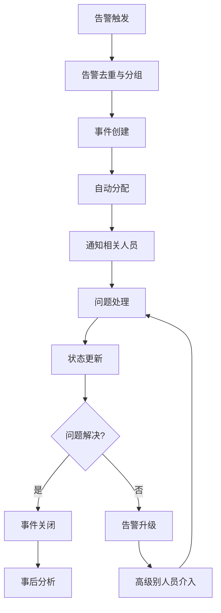

在现代微服务架构中，告警系统不仅要能够及时发现问题，还需要与事件管理平台深度集成，形成完整的告警响应体系。通过与PagerDuty、Opsgenie等专业的事件管理平台集成，可以实现告警的自动分派、升级机制、响应团队协调等功能，大大提升问题处理的效率和质量。

## 事件管理平台的核心价值

事件管理平台作为告警响应体系的核心组件，提供了以下关键价值：

### 1. 告警生命周期管理

事件管理平台能够完整地管理告警从产生到解决的整个生命周期：

```yaml
# 告警生命周期示例
alert_lifecycle:
  trigger: 告警触发
  deduplication: 告警去重
  routing: 告警路由
  assignment: 告警分派
  escalation: 告警升级
  resolution: 告警解决
  post_mortem: 事后分析
```

### 2. 响应团队协调

通过事件管理平台，可以实现响应团队的有效协调：

- **值班管理**：自动分配值班人员
- **通知机制**：通过多种渠道通知相关人员
- **协作工具**：提供统一的协作平台
- **状态跟踪**：实时跟踪问题处理状态

## PagerDuty集成实践

PagerDuty作为业界领先的事件管理平台，提供了丰富的集成能力。

### 集成配置

```json
{
  "integration": {
    "type": "generic_events_api_inbound_integration",
    "name": "Prometheus Alertmanager",
    "vendor": {
      "type": "vendor_reference",
      "id": "PAM4FGS"
    }
  },
  "service": {
    "type": "service",
    "name": "Microservices Monitoring",
    "description": "Microservices monitoring alerts",
    "escalation_policy": {
      "type": "escalation_policy_reference",
      "id": "PJFWPEP"
    },
    "alert_creation": "create_alerts_and_incidents"
  }
}
```

### Alertmanager配置

```yaml
# Alertmanager配置示例
global:
  pagerduty_url: https://events.pagerduty.com/v2/enqueue

route:
  group_by: ['alertname', 'cluster']
  group_wait: 30s
  group_interval: 5m
  repeat_interval: 3h
  receiver: 'pagerduty'

receivers:
- name: 'pagerduty'
  pagerduty_configs:
  - service_key: 'YOUR_SERVICE_KEY'
    send_resolved: true
    description: '{{ template "pagerduty.default.description" . }}'
    details:
      firing: '{{ template "pagerduty.default.firing" . }}'
      resolved: '{{ template "pagerduty.default.resolved" . }}'
      num_firing: '{{ .Alerts.Firing | len }}'
      num_resolved: '{{ .Alerts.Resolved | len }}'
```

### 自动化工作流

```python
# PagerDuty自动化工作流示例
import pdpyras

def create_incident_alert(session, service_id, title, body):
    """创建事件告警"""
    incident = session.rpost('/incidents', json={
        'type': 'incident',
        'title': title,
        'service': {
            'id': service_id,
            'type': 'service_reference'
        },
        'body': {
            'type': 'incident_body',
            'details': body
        }
    })
    return incident

def assign_incident(session, incident_id, user_id):
    """分配事件给指定用户"""
    session.rput(f'/incidents/{incident_id}', json={
        'type': 'incident_reference',
        'id': incident_id,
        'assignments': [
            {
                'assignee': {
                    'id': user_id,
                    'type': 'user_reference'
                }
            }
        ]
    })

def add_incident_note(session, incident_id, content):
    """添加事件备注"""
    session.rpost(f'/incidents/{incident_id}/notes', json={
        'content': content
    })
```

## Opsgenie集成实践

Opsgenie是另一个强大的事件管理平台，提供了丰富的功能和灵活的集成选项。

### 集成配置

```yaml
# Alertmanager配置示例
global:
  opsgenie_api_url: https://api.opsgenie.com/

route:
  group_by: ['alertname', 'cluster']
  group_wait: 30s
  group_interval: 5m
  repeat_interval: 3h
  receiver: 'opsgenie'

receivers:
- name: 'opsgenie'
  opsgenie_configs:
  - api_key: 'YOUR_API_KEY'
    send_resolved: true
    message: '{{ template "opsgenie.default.message" . }}'
    description: '{{ template "opsgenie.default.description" . }}'
    source: '{{ template "opsgenie.default.source" . }}'
    details:
      firing: '{{ template "opsgenie.default.firing" . }}'
      resolved: '{{ template "opsgenie.default.resolved" . }}'
      num_firing: '{{ .Alerts.Firing | len }}'
      num_resolved: '{{ .Alerts.Resolved | len }}'
```

### 自定义告警策略

```json
{
  "name": "Microservices Alert Policy",
  "teamId": "microservices-team",
  "rules": [
    {
      "conditionMatchType": "match-all",
      "conditions": [
        {
          "field": "tags",
          "operation": "contains",
          "expectedValue": "critical"
        }
      ],
      "notify": [
        {
          "name": "on-call-engineer",
          "type": "schedule"
        }
      ],
      "escalations": [
        {
          "condition": "if-not-acked-in-10-minutes",
          "notify": [
            {
              "name": "engineering-manager",
              "type": "user"
            }
          ]
        }
      ]
    }
  ]
}
```

## 事件响应流程设计

### 标准化事件响应流程



### 事件模板设计

```markdown
## 事件报告模板

### 基本信息
- **事件ID**: {{incident.id}}
- **事件标题**: {{incident.title}}
- **触发时间**: {{incident.created_at}}
- **影响服务**: {{incident.service.name}}
- **严重级别**: {{incident.urgency}}

### 问题描述
{{incident.description}}

### 影响范围
- 受影响用户数: {{incident.affected_users}}
- 服务可用性: {{incident.service_availability}}
- 业务影响: {{incident.business_impact}}

### 处理过程
#### 时间线
{{incident.timeline}}

#### 处理步骤
1. {{step1}}
2. {{step2}}
3. {{step3}}

### 根本原因分析
{{incident.root_cause}}

### 解决方案
{{incident.resolution}}

### 预防措施
{{incident.preventive_measures}}
```

## 自动化响应集成

### ChatOps集成

```python
# Slack集成示例
import slack_sdk

class IncidentNotifier:
    def __init__(self, slack_token, channel):
        self.client = slack_sdk.WebClient(token=slack_token)
        self.channel = channel
    
    def notify_incident(self, incident):
        """通知事件发生"""
        blocks = [
            {
                "type": "header",
                "text": {
                    "type": "plain_text",
                    "text": f"🚨 新事件: {incident.title}"
                }
            },
            {
                "type": "section",
                "fields": [
                    {
                        "type": "mrkdwn",
                        "text": f"*事件ID:*\n{incident.id}"
                    },
                    {
                        "type": "mrkdwn",
                        "text": f"*严重级别:*\n{incident.severity}"
                    },
                    {
                        "type": "mrkdwn",
                        "text": f"*影响服务:*\n{incident.service}"
                    },
                    {
                        "type": "mrkdwn",
                        "text": f"*触发时间:*\n{incident.created_at}"
                    }
                ]
            },
            {
                "type": "actions",
                "elements": [
                    {
                        "type": "button",
                        "text": {
                            "type": "plain_text",
                            "text": "查看事件详情"
                        },
                        "url": incident.url
                    },
                    {
                        "type": "button",
                        "text": {
                            "type": "plain_text",
                            "text": "认领事件"
                        },
                        "action_id": "claim_incident",
                        "value": incident.id
                    }
                ]
            }
        ]
        
        self.client.chat_postMessage(
            channel=self.channel,
            blocks=blocks
        )
```

### 电话通知集成

```python
# Twilio集成示例
from twilio.rest import Client

class VoiceNotifier:
    def __init__(self, account_sid, auth_token, from_number):
        self.client = Client(account_sid, auth_token)
        self.from_number = from_number
    
    def call_oncall_engineer(self, to_number, incident_info):
        """呼叫值班工程师"""
        call = self.client.calls.create(
            to=to_number,
            from_=self.from_number,
            twiml=f'''
                <Response>
                    <Say voice="alice" language="zh-CN">
                        紧急通知：{incident_info['service']}服务出现严重问题。
                        事件标题：{incident_info['title']}。
                        请立即登录事件管理系统查看详情并处理。
                    </Say>
                </Response>
            '''
        )
        return call.sid
```

## 事件分析与优化

### 事件统计分析

```sql
-- 事件统计查询示例
SELECT 
    DATE_TRUNC('day', created_at) as day,
    COUNT(*) as total_incidents,
    AVG(EXTRACT(EPOCH FROM (resolved_at - created_at))/60) as avg_resolution_minutes,
    COUNT(CASE WHEN severity = 'P1' THEN 1 END) as p1_incidents,
    COUNT(CASE WHEN severity = 'P2' THEN 1 END) as p2_incidents
FROM incidents 
WHERE created_at >= NOW() - INTERVAL '30 days'
GROUP BY DATE_TRUNC('day', created_at)
ORDER BY day DESC;
```

### MTTR优化策略

```python
# MTTR计算与优化
class MTTRAnalyzer:
    def calculate_mttr(self, incidents):
        """计算平均修复时间"""
        total_time = sum(
            (incident.resolved_at - incident.created_at).total_seconds()
            for incident in incidents
            if incident.resolved_at
        )
        return total_time / len(incidents) / 60  # 转换为分钟
    
    def identify_bottlenecks(self, incidents):
        """识别处理瓶颈"""
        # 分析事件处理各阶段耗时
        stages = {
            'detection': [],
            'notification': [],
            'response': [],
            'resolution': []
        }
        
        for incident in incidents:
            stages['detection'].append(
                (incident.notified_at - incident.created_at).total_seconds()
            )
            stages['notification'].append(
                (incident.acknowledged_at - incident.notified_at).total_seconds()
            )
            stages['response'].append(
                (incident.work_started_at - incident.acknowledged_at).total_seconds()
            )
            stages['resolution'].append(
                (incident.resolved_at - incident.work_started_at).total_seconds()
            )
        
        # 计算各阶段平均耗时
        avg_times = {
            stage: sum(times) / len(times) / 60  # 转换为分钟
            for stage, times in stages.items()
        }
        
        return avg_times
```

## 最佳实践总结

### 1. 集成策略

- **渐进式集成**：从核心服务开始，逐步扩展到所有服务
- **标准化接口**：使用标准化的API接口进行集成
- **测试验证**：充分测试集成配置，确保告警能够正确传递

### 2. 流程优化

- **自动化优先**：尽可能实现自动化处理
- **持续改进**：定期回顾和优化事件响应流程
- **知识沉淀**：建立知识库，积累处理经验

### 3. 团队协作

- **明确职责**：清晰定义各角色的职责和权限
- **技能培训**：定期进行事件响应培训
- **演练机制**：定期进行事件响应演练

## 总结

通过与专业的事件管理平台集成，可以构建完整的告警响应体系，实现告警的自动分派、升级机制和团队协作。PagerDuty和Opsgenie等平台提供了丰富的功能，能够满足不同规模和复杂度的微服务架构需求。

在实际应用中，需要根据业务特点和团队结构选择合适的事件管理平台，并设计合理的集成方案和响应流程。通过持续优化和改进，可以不断提升事件响应的效率和质量，保障系统的稳定运行。

在下一章中，我们将探讨微服务日志与监控的最佳实践，分享在实际项目中积累的经验和教训。