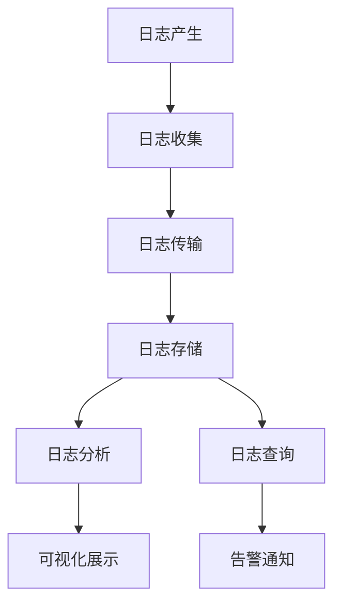

在微服务架构中，日志数据分散在各个服务实例中，给问题排查和系统分析带来了巨大挑战。通过构建集中式日志管理平台，可以将分散的日志数据统一收集、存储和分析，显著提升运维效率和问题诊断能力。本章将深入探讨集中式日志管理的架构设计、实现方案和查询优化技巧。

## 集中式日志管理架构

### 架构设计原则

集中式日志管理平台需要遵循以下设计原则：



### 核心组件

1. **日志收集器（Collector）**：负责从各个服务实例收集日志数据
2. **日志传输器（Shipper）**：负责将日志数据安全可靠地传输到存储系统
3. **日志存储系统（Storage）**：负责存储和索引日志数据
4. **日志查询引擎（Query Engine）**：提供高效的日志查询能力
5. **分析平台（Analytics Platform）**：提供日志分析和可视化功能

## ELK Stack实现方案

ELK Stack（Elasticsearch、Logstash、Kibana）是业界广泛使用的日志管理解决方案。

### Elasticsearch存储优化

```yaml
# Elasticsearch索引模板配置
PUT _template/microservices_logs_template
{
  "index_patterns": ["microservices-logs-*"],
  "settings": {
    "number_of_shards": 3,
    "number_of_replicas": 1,
    "refresh_interval": "30s",
    "translog.durability": "async",
    "translog.sync_interval": "30s"
  },
  "mappings": {
    "properties": {
      "timestamp": {
        "type": "date",
        "format": "yyyy-MM-dd'T'HH:mm:ss.SSS'Z'"
      },
      "level": {
        "type": "keyword"
      },
      "service": {
        "type": "keyword"
      },
      "trace_id": {
        "type": "keyword"
      },
      "span_id": {
        "type": "keyword"
      },
      "message": {
        "type": "text",
        "analyzer": "ik_max_word"
      },
      "duration_ms": {
        "type": "integer"
      },
      "status": {
        "type": "keyword"
      }
    }
  }
}
```

### Logstash配置优化

```ruby
# Logstash配置文件
input {
  beats {
    port => 5044
    codec => json
  }
}

filter {
  # 时间戳解析
  date {
    match => [ "timestamp", "ISO8601" ]
    target => "@timestamp"
  }
  
  # 字段类型转换
  mutate {
    convert => {
      "duration_ms" => "integer"
    }
  }
  
  # 添加地理信息
  geoip {
    source => "ip_address"
    target => "geoip"
  }
  
  # 用户代理解析
  useragent {
    source => "user_agent"
    target => "user_agent"
  }
}

output {
  # 输出到Elasticsearch
  elasticsearch {
    hosts => ["http://elasticsearch:9200"]
    index => "microservices-logs-%{+YYYY.MM.dd}"
    template_name => "microservices_logs_template"
    template => "/etc/logstash/templates/microservices_logs_template.json"
    template_overwrite => true
  }
  
  # 输出到标准输出（调试用）
  stdout {
    codec => rubydebug
  }
}
```

### Filebeat轻量级收集器

```yaml
# Filebeat配置文件
filebeat.inputs:
- type: log
  enabled: true
  paths:
    - /var/log/microservices/*.log
  json.keys_under_root: true
  json.add_error_key: true
  fields:
    service: ${SERVICE_NAME}
    environment: ${ENVIRONMENT}
  fields_under_root: true

processors:
- add_host_metadata:
    when.not.contains.tags: forwarded
- add_cloud_metadata: ~
- add_docker_metadata: ~

output.logstash:
  hosts: ["logstash:5044"]
  bulk_max_size: 1024
  worker: 2

logging.level: info
logging.to_files: true
logging.files:
  path: /var/log/filebeat
  name: filebeat
  keepfiles: 7
  permissions: 0644
```

## 高效查询优化

### 查询性能优化策略

1. **索引优化**：合理设计索引结构和分片策略
2. **字段类型**：选择合适的字段类型以提升查询效率
3. **查询语句**：编写高效的查询语句

```json
// 高效查询示例
{
  "query": {
    "bool": {
      "must": [
        {
          "range": {
            "timestamp": {
              "gte": "2025-08-31T00:00:00Z",
              "lte": "2025-08-31T23:59:59Z"
            }
          }
        },
        {
          "term": {
            "service": "user-service"
          }
        }
      ],
      "filter": [
        {
          "terms": {
            "level": ["ERROR", "FATAL"]
          }
        }
      ]
    }
  },
  "sort": [
    {
      "timestamp": {
        "order": "desc"
      }
    }
  ],
  "size": 100
}
```

### 聚合查询优化

```json
// 聚合查询示例
{
  "size": 0,
  "aggs": {
    "errors_by_service": {
      "terms": {
        "field": "service",
        "size": 10
      },
      "aggs": {
        "error_count": {
          "value_count": {
            "field": "level"
          }
        },
        "top_error_messages": {
          "terms": {
            "field": "message.keyword",
            "size": 5
          }
        }
      }
    },
    "errors_over_time": {
      "date_histogram": {
        "field": "timestamp",
        "calendar_interval": "1h"
      }
    }
  }
}
```

## 日志分析与可视化

### Kibana仪表板设计

```json
// Kibana仪表板配置示例
{
  "title": "微服务日志监控仪表板",
  "description": "实时监控微服务日志状态",
  "panels": [
    {
      "id": "error_count",
      "type": "visualization",
      "title": "错误日志数量",
      "gridData": {
        "x": 0,
        "y": 0,
        "w": 24,
        "h": 12
      }
    },
    {
      "id": "service_distribution",
      "type": "visualization",
      "title": "服务日志分布",
      "gridData": {
        "x": 24,
        "y": 0,
        "w": 24,
        "h": 12
      }
    }
  ]
}
```

### 实时监控告警

```yaml
# Elasticsearch Watcher告警配置
PUT _watcher/watch/error_rate_alert
{
  "trigger": {
    "schedule": {
      "interval": "5m"
    }
  },
  "input": {
    "search": {
      "request": {
        "search_type": "query_then_fetch",
        "indices": [
          "microservices-logs-*"
        ],
        "body": {
          "query": {
            "bool": {
              "filter": [
                {
                  "range": {
                    "timestamp": {
                      "gte": "now-5m"
                    }
                  }
                },
                {
                  "terms": {
                    "level": [
                      "ERROR",
                      "FATAL"
                    ]
                  }
                }
              ]
            }
          },
          "aggs": {
            "error_count": {
              "value_count": {
                "field": "_index"
              }
            }
          }
        }
      }
    }
  },
  "condition": {
    "compare": {
      "ctx.payload.aggregations.error_count.value": {
        "gt": 100
      }
    }
  },
  "actions": {
    "send_email": {
      "email": {
        "to": "ops-team@example.com",
        "subject": "微服务错误日志数量异常",
        "body": "在过去5分钟内，错误日志数量超过了阈值：{{ctx.payload.aggregations.error_count.value}}"
      }
    }
  }
}
```

## 分布式日志收集

### 多区域部署

```yaml
# 多区域日志收集架构
version: '3.7'
services:
  filebeat-region1:
    image: docker.elastic.co/beats/filebeat:7.14.0
    hostname: filebeat-region1
    environment:
      - SERVICE_NAME=user-service
      - ENVIRONMENT=production
      - REGION=us-east-1
    volumes:
      - ./filebeat.yml:/usr/share/filebeat/filebeat.yml:ro
      - /var/log/microservices:/var/log/microservices:ro
    networks:
      - logging

  filebeat-region2:
    image: docker.elastic.co/beats/filebeat:7.14.0
    hostname: filebeat-region2
    environment:
      - SERVICE_NAME=user-service
      - ENVIRONMENT=production
      - REGION=eu-west-1
    volumes:
      - ./filebeat.yml:/usr/share/filebeat/filebeat.yml:ro
      - /var/log/microservices:/var/log/microservices:ro
    networks:
      - logging

  logstash:
    image: docker.elastic.co/logstash/logstash:7.14.0
    hostname: logstash
    ports:
      - "5044:5044"
    volumes:
      - ./logstash.conf:/usr/share/logstash/pipeline/logstash.conf:ro
    networks:
      - logging
    depends_on:
      - elasticsearch

networks:
  logging:
    driver: bridge
```

### 负载均衡与高可用

```yaml
# 负载均衡配置
upstream logstash_backend {
    server logstash1:5044 weight=1 max_fails=3 fail_timeout=30s;
    server logstash2:5044 weight=1 max_fails=3 fail_timeout=30s;
    server logstash3:5044 weight=1 max_fails=3 fail_timeout=30s;
}

server {
    listen 5044;
    proxy_pass logstash_backend;
    proxy_connect_timeout 1s;
    proxy_timeout 30s;
}
```

## 安全与权限管理

### 访问控制

```yaml
# Elasticsearch安全配置
xpack.security.enabled: true
xpack.security.transport.ssl.enabled: true
xpack.security.transport.ssl.verification_mode: certificate
xpack.security.transport.ssl.key: certs/elasticsearch/elasticsearch.key
xpack.security.transport.ssl.certificate: certs/elasticsearch/elasticsearch.crt
xpack.security.transport.ssl.certificate_authorities: certs/ca/ca.crt

xpack.security.http.ssl.enabled: true
xpack.security.http.ssl.truststore.path: certs/elasticsearch/elasticsearch.p12
```

### 用户权限管理

```json
// 角色定义
PUT _security/role/log_reader
{
  "cluster": ["monitor"],
  "indices": [
    {
      "names": ["microservices-logs-*"],
      "privileges": ["read", "read_cross_cluster", "view_index_metadata"]
    }
  ]
}

// 用户角色映射
PUT _security/user/log_analyst
{
  "password": "strong_password",
  "roles": ["log_reader"],
  "full_name": "Log Analyst"
}
```

## 性能监控与调优

### 系统监控指标

```promql
# 日志收集延迟
rate(filebeat_events_total[5m]) / rate(filebeat_harvester_closed_total[5m])

# Elasticsearch索引性能
rate(elasticsearch_indices_indexing_index_total[5m])

# 查询性能
rate(elasticsearch_indices_search_query_total[5m])
```

### 资源调优

```yaml
# Elasticsearch JVM调优
ES_JAVA_OPTS="-Xms4g -Xmx4g -XX:+UseG1GC -XX:G1HeapRegionSize=32m -XX:MaxGCPauseMillis=200"

# 系统参数调优
vm.max_map_count: 262144
vm.swappiness: 1
```

## 最佳实践总结

### 1. 架构设计

- **分层架构**：采用分层架构设计，确保各组件职责清晰
- **可扩展性**：设计可水平扩展的架构，支持业务增长
- **高可用性**：实现组件的高可用部署，确保系统稳定性

### 2. 性能优化

- **索引策略**：制定合理的索引策略，平衡查询性能和存储成本
- **查询优化**：编写高效的查询语句，避免全表扫描
- **资源调优**：根据实际负载调整系统资源配置

### 3. 安全管理

- **访问控制**：实施严格的访问控制策略，保护日志数据安全
- **数据加密**：对敏感日志数据进行加密存储和传输
- **审计日志**：记录日志系统的操作审计信息

## 总结

集中式日志管理是微服务架构中不可或缺的组成部分。通过构建统一的日志收集、存储和分析平台，可以显著提升系统的可观察性和运维效率。ELK Stack作为业界成熟的解决方案，提供了完整的日志管理能力，但在实际应用中需要根据业务需求进行定制化配置和优化。

在实施集中式日志管理时，需要重点关注架构设计、性能优化、安全管理和成本控制等方面。通过合理的配置和持续的优化，可以构建高效、稳定、安全的日志管理平台，为微服务系统的运维和问题排查提供有力支撑。

在下一节中，我们将探讨高效的监控指标设计与告警策略。