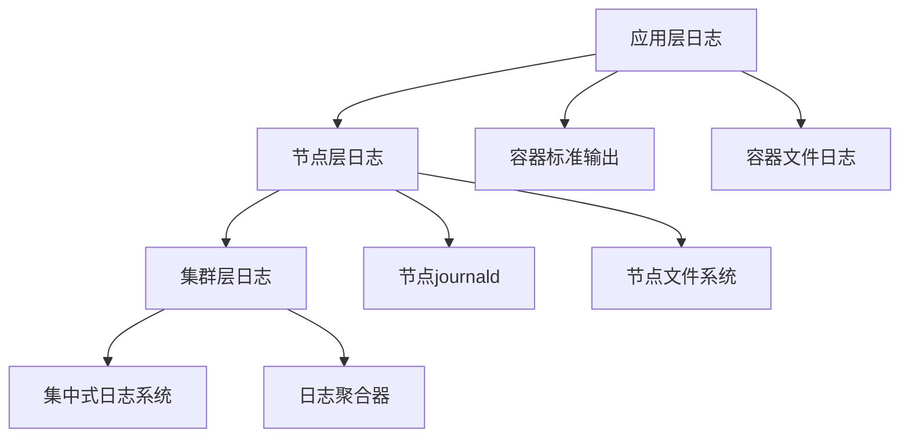

随着容器化技术的普及，Docker和Kubernetes已成为现代微服务架构的核心基础设施。在容器化环境中，日志与监控面临着新的挑战和机遇。容器的临时性、动态性以及编排复杂性要求我们采用新的方法来收集、存储和分析日志与监控数据。本章将深入探讨在Docker和Kubernetes环境中的日志与监控最佳实践。

## Docker环境中的日志管理

### Docker日志驱动

Docker提供了多种日志驱动来处理容器日志：

```json
// Docker日志驱动配置
{
  "log-driver": "json-file",
  "log-opts": {
    "max-size": "10m",
    "max-file": "3"
  }
}
```

### 日志驱动类型对比

| 驱动类型 | 优点 | 缺点 | 适用场景 |
|---------|------|------|---------|
| json-file | 简单易用，Docker默认 | 文件分散，不易集中管理 | 开发测试环境 |
| syslog | 标准协议，易于集成 | 需要syslog服务器 | 传统系统集成 |
| journald | 系统集成，支持查询 | 仅限systemd系统 | Linux系统 |
| gelf | 结构化日志，支持Graylog | 需要GELF服务器 | 集中式日志管理 |
| fluentd | 灵活配置，插件丰富 | 配置复杂 | 生产环境 |

### Docker Compose日志配置

```yaml
# docker-compose.yml
version: '3.8'
services:
  user-service:
    image: mycompany/user-service:latest
    logging:
      driver: "json-file"
      options:
        max-size: "10m"
        max-file: "3"
    environment:
      - LOG_LEVEL=INFO
      - SERVICE_NAME=user-service
    labels:
      - "com.docker.swarm.task.name=user-service"
  
  order-service:
    image: mycompany/order-service:latest
    logging:
      driver: "gelf"
      options:
        gelf-address: "udp://localhost:12201"
        tag: "order-service"
    environment:
      - LOG_LEVEL=INFO
      - SERVICE_NAME=order-service
```

## Kubernetes日志架构

### Kubernetes日志层次

Kubernetes环境中的日志分为三个层次：



### DaemonSet日志收集

```yaml
# Fluentd DaemonSet配置
apiVersion: apps/v1
kind: DaemonSet
metadata:
  name: fluentd
  namespace: kube-logging
  labels:
    k8s-app: fluentd-logging
spec:
  selector:
    matchLabels:
      name: fluentd
  template:
    metadata:
      labels:
        name: fluentd
    spec:
      serviceAccount: fluentd
      serviceAccountName: fluentd
      containers:
      - name: fluentd
        image: fluent/fluentd-kubernetes-daemonset:v1.14.6-debian-elasticsearch7-1.0
        env:
          - name: FLUENT_ELASTICSEARCH_HOST
            value: "elasticsearch.logging.svc.cluster.local"
          - name: FLUENT_ELASTICSEARCH_PORT
            value: "9200"
          - name: FLUENT_UID
            value: "0"
        resources:
          limits:
            memory: 512Mi
          requests:
            cpu: 100m
            memory: 200Mi
        volumeMounts:
        - name: varlog
          mountPath: /var/log
        - name: varlibdockercontainers
          mountPath: /var/lib/docker/containers
          readOnly: true
        - name: fluentd-config
          mountPath: /fluentd/etc/fluent.conf
          subPath: fluent.conf
      volumes:
      - name: varlog
        hostPath:
          path: /var/log
      - name: varlibdockercontainers
        hostPath:
          path: /var/lib/docker/containers
      - name: fluentd-config
        configMap:
          name: fluentd-config
      tolerations:
      - key: node-role.kubernetes.io/master
        effect: NoSchedule
```

### Sidecar日志收集

```yaml
# Sidecar模式日志收集
apiVersion: v1
kind: Pod
metadata:
  name: app-with-sidecar
spec:
  containers:
  - name: app
    image: mycompany/app:latest
    volumeMounts:
    - name: shared-logs
      mountPath: /var/log/app
  - name: fluentd-sidecar
    image: fluent/fluentd:latest
    volumeMounts:
    - name: shared-logs
      mountPath: /var/log/app
    - name: fluentd-config
      mountPath: /fluentd/etc
  volumes:
  - name: shared-logs
    emptyDir: {}
  - name: fluentd-config
    configMap:
      name: fluentd-sidecar-config
```

## Kubernetes监控架构

### 核心监控组件

```yaml
# Prometheus Operator部署
apiVersion: v1
kind: Namespace
metadata:
  name: monitoring
---
apiVersion: rbac.authorization.k8s.io/v1
kind: ClusterRoleBinding
metadata:
  name: prometheus-operator
roleRef:
  apiGroup: rbac.authorization.k8s.io
  kind: ClusterRole
  name: prometheus-operator
subjects:
- kind: ServiceAccount
  name: prometheus-operator
  namespace: monitoring
---
apiVersion: apps/v1
kind: Deployment
metadata:
  labels:
    app.kubernetes.io/component: controller
    app.kubernetes.io/name: prometheus-operator
    app.kubernetes.io/version: 0.50.0
  name: prometheus-operator
  namespace: monitoring
spec:
  replicas: 1
  selector:
    matchLabels:
      app.kubernetes.io/component: controller
      app.kubernetes.io/name: prometheus-operator
  template:
    metadata:
      labels:
        app.kubernetes.io/component: controller
        app.kubernetes.io/name: prometheus-operator
        app.kubernetes.io/version: 0.50.0
    spec:
      containers:
      - args:
        - --kubelet-service=kube-system/kubelet
        - --prometheus-config-reloader=quay.io/prometheus-operator/prometheus-config-reloader:v0.50.0
        image: quay.io/prometheus-operator/prometheus-operator:v0.50.0
        name: prometheus-operator
        ports:
        - containerPort: 8080
          name: http
        resources:
          limits:
            cpu: 200m
            memory: 200Mi
          requests:
            cpu: 100m
            memory: 100Mi
        securityContext:
          allowPrivilegeEscalation: false
      securityContext:
        runAsNonRoot: true
        runAsUser: 65534
      serviceAccountName: prometheus-operator
```

### ServiceMonitor配置

```yaml
# ServiceMonitor配置示例
apiVersion: monitoring.coreos.com/v1
kind: ServiceMonitor
metadata:
  name: user-service-monitor
  namespace: monitoring
  labels:
    app: user-service
spec:
  selector:
    matchLabels:
      app: user-service
  endpoints:
  - port: http
    path: /metrics
    interval: 30s
    scrapeTimeout: 10s
    relabelings:
    - sourceLabels: [__meta_kubernetes_pod_name]
      targetLabel: pod
    - sourceLabels: [__meta_kubernetes_namespace]
      targetLabel: namespace
```

### PodMonitor配置

```yaml
# PodMonitor配置示例
apiVersion: monitoring.coreos.com/v1
kind: PodMonitor
metadata:
  name: app-pod-monitor
  namespace: monitoring
spec:
  selector:
    matchLabels:
      app: my-app
  podMetricsEndpoints:
  - port: metrics
    path: /metrics
    interval: 30s
```

## 容器日志标准化

### 结构化日志格式

```go
// Go应用中的结构化日志
package main

import (
    "context"
    "encoding/json"
    "time"
    "go.uber.org/zap"
)

type LogEntry struct {
    Timestamp  time.Time         `json:"timestamp"`
    Level      string            `json:"level"`
    Service    string            `json:"service"`
    TraceID    string            `json:"trace_id,omitempty"`
    SpanID     string            `json:"span_id,omitempty"`
    Message    string            `json:"message"`
    Fields     map[string]interface{} `json:"fields,omitempty"`
}

func NewStructuredLogger(serviceName string) *zap.Logger {
    config := zap.NewProductionConfig()
    config.EncoderConfig.TimeKey = "timestamp"
    config.EncoderConfig.EncodeTime = zapcore.ISO8601TimeEncoder
    config.InitialFields = map[string]interface{}{
        "service": serviceName,
    }
    
    logger, _ := config.Build()
    return logger
}

func LogWithContext(ctx context.Context, logger *zap.Logger, level string, message string, fields map[string]interface{}) {
    // 从context中提取追踪信息
    traceID := ctx.Value("trace_id")
    spanID := ctx.Value("span_id")
    
    entry := LogEntry{
        Timestamp: time.Now(),
        Level:     level,
        Service:   logger.Core().(*zapcore.Core).Fields()["service"].(string),
        Message:   message,
        Fields:    fields,
    }
    
    if traceID != nil {
        entry.TraceID = traceID.(string)
    }
    if spanID != nil {
        entry.SpanID = spanID.(string)
    }
    
    jsonEntry, _ := json.Marshal(entry)
    fmt.Println(string(jsonEntry))
}
```

### 日志标签管理

```yaml
# Kubernetes日志标签配置
apiVersion: v1
kind: Pod
metadata:
  name: app-with-labels
  labels:
    app: user-service
    version: v1.2.3
    environment: production
    team: backend
spec:
  containers:
  - name: app
    image: mycompany/user-service:1.2.3
    env:
    - name: POD_NAME
      valueFrom:
        fieldRef:
          fieldPath: metadata.name
    - name: POD_NAMESPACE
      valueFrom:
        fieldRef:
          fieldPath: metadata.namespace
    - name: NODE_NAME
      valueFrom:
        fieldRef:
          fieldPath: spec.nodeName
```

## 容器监控指标

### Kubernetes核心指标

```promql
# 节点资源使用率
1 - avg(rate(node_cpu_seconds_total{mode="idle"}[5m]))

# Pod内存使用
sum(container_memory_usage_bytes{pod!="", container!="POD"}) by (pod, namespace)

# Pod CPU使用
sum(rate(container_cpu_usage_seconds_total{pod!="", container!="POD"}[5m])) by (pod, namespace)

# Pod网络流量
sum(rate(container_network_receive_bytes_total[5m])) by (pod, namespace)
```

### 应用自定义指标

```java
// Java应用中的自定义指标
@RestController
public class UserController {
    
    private final MeterRegistry meterRegistry;
    private final Counter userLoginCounter;
    private final Timer userLoginTimer;
    
    public UserController(MeterRegistry meterRegistry) {
        this.meterRegistry = meterRegistry;
        this.userLoginCounter = Counter.builder("user.login")
                .description("用户登录次数")
                .tag("service", "user-service")
                .register(meterRegistry);
        this.userLoginTimer = Timer.builder("user.login.duration")
                .description("用户登录耗时")
                .tag("service", "user-service")
                .register(meterRegistry);
    }
    
    @PostMapping("/login")
    public ResponseEntity<String> login(@RequestBody LoginRequest request) {
        return Timer.Sample.start(meterRegistry)
                .stop(userLoginTimer, () -> {
                    // 登录逻辑
                    boolean success = performLogin(request);
                    if (success) {
                        userLoginCounter.increment();
                        return ResponseEntity.ok("登录成功");
                    } else {
                        return ResponseEntity.status(401).body("登录失败");
                    }
                });
    }
}
```

## 安全与合规

### 日志访问控制

```yaml
# Kubernetes RBAC配置
apiVersion: rbac.authorization.k8s.io/v1
kind: Role
metadata:
  namespace: logging
  name: log-reader
rules:
- apiGroups: [""]
  resources: ["pods", "pods/log"]
  verbs: ["get", "list"]
---
apiVersion: rbac.authorization.k8s.io/v1
kind: RoleBinding
metadata:
  name: read-logs
  namespace: logging
subjects:
- kind: User
  name: log-analyst
  apiGroup: rbac.authorization.k8s.io
roleRef:
  kind: Role
  name: log-reader
  apiGroup: rbac.authorization.k8s.io
```

### 审计日志配置

```yaml
# Kubernetes审计日志配置
apiVersion: audit.k8s.io/v1
kind: Policy
rules:
- level: Metadata
  resources:
  - group: ""
    resources: ["pods", "services", "deployments"]
- level: Request
  verbs: ["create", "update", "delete"]
  resources:
  - group: ""
    resources: ["secrets"]
- level: None
  users: ["system:kube-proxy"]
  verbs: ["watch"]
```

## 性能优化

### 资源限制与请求

```yaml
# 容器资源限制
apiVersion: v1
kind: Pod
metadata:
  name: app-with-resources
spec:
  containers:
  - name: app
    image: mycompany/app:latest
    resources:
      requests:
        memory: "64Mi"
        cpu: "250m"
      limits:
        memory: "128Mi"
        cpu: "500m"
    # 日志轮转配置
    env:
    - name: LOG_LEVEL
      value: "INFO"
```

### 日志轮转策略

```yaml
# Fluentd日志轮转配置
<source>
  @type tail
  path /var/log/containers/*.log
  pos_file /var/log/fluentd-containers.log.pos
  tag kubernetes.*
  read_from_head true
  <parse>
    @type json
    time_format %Y-%m-%dT%H:%M:%S.%NZ
  </parse>
</source>

<match kubernetes.**>
  @type file
  path /var/log/kubernetes/kubernetes
  append true
  <buffer>
    @type file
    path /var/log/kubernetes/kubernetes.buffer
    flush_mode interval
    flush_interval 5s
    flush_thread_count 2
    retry_type exponential_backoff
    retry_forever true
    retry_max_interval 30
    chunk_limit_size 2M
    queue_limit_length 32
    overflow_action block
  </buffer>
</match>
```

## 最佳实践总结

### 1. 日志管理

- **标准化格式**：采用结构化日志格式，便于分析和查询
- **集中收集**：使用DaemonSet或Sidecar模式集中收集日志
- **标签管理**：为日志添加丰富的元数据标签
- **轮转策略**：实施合理的日志轮转策略，控制存储成本

### 2. 监控体系

- **分层监控**：建立从基础设施到应用的分层监控体系
- **自定义指标**：结合业务特点设计自定义监控指标
- **告警优化**：实施告警去重和抑制策略
- **可视化展示**：提供直观的监控仪表板

### 3. 安全合规

- **访问控制**：实施严格的日志访问控制策略
- **审计日志**：启用并配置审计日志功能
- **敏感信息**：避免在日志中记录敏感信息
- **合规要求**：满足相关法规的合规要求

## 总结

容器化环境中的日志与监控面临着独特的挑战，包括容器的临时性、动态性以及编排复杂性。通过采用合适的日志驱动、部署DaemonSet日志收集器、配置ServiceMonitor和PodMonitor等方法，可以构建完整的容器化环境监控体系。

在实际应用中，需要根据具体的业务需求和技术栈选择合适的工具和方案。同时，要注意日志标准化、资源优化、安全合规等方面的要求，确保日志与监控系统的高效、安全和合规运行。

通过合理的架构设计和持续优化，可以充分发挥容器化技术的优势，构建高效、可靠的微服务监控体系，为业务的稳定运行提供有力保障。

在下一节中，我们将探讨日志与监控的数据保留与清理策略。