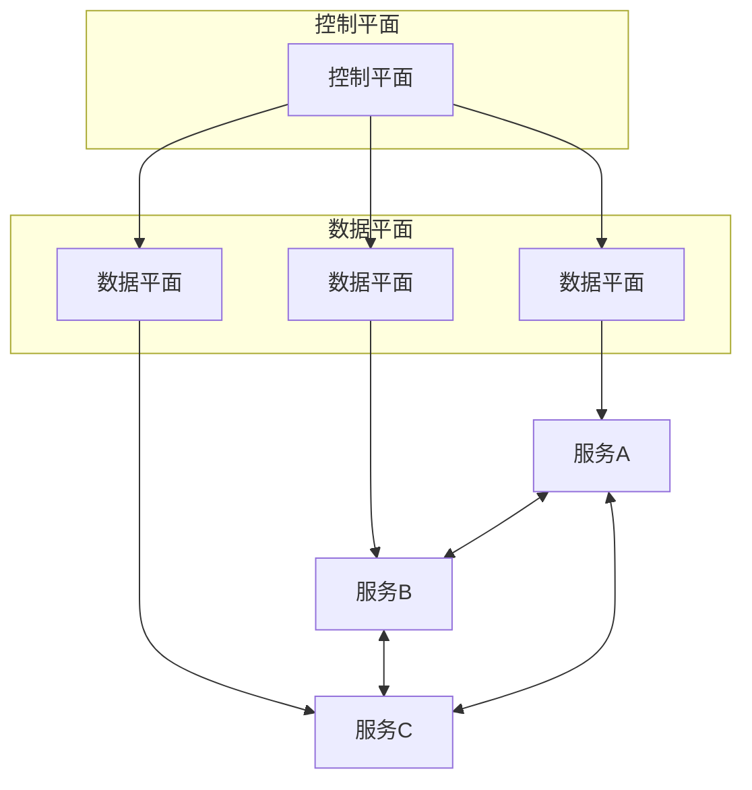
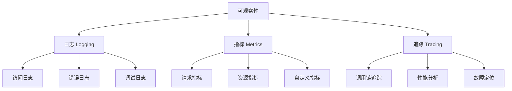
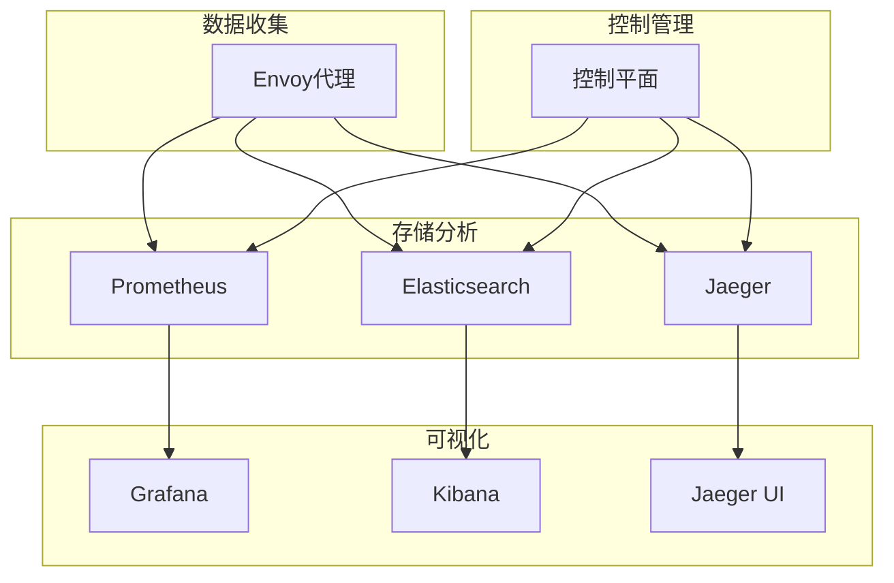

随着微服务架构的普及，服务间的通信变得越来越复杂，传统的监控和日志收集方式已难以满足现代分布式系统的需求。服务网格作为一种基础设施层，为服务间通信提供了统一的控制和观测能力。通过将日志与监控功能集成到服务网格中，可以实现更细粒度的观测、更智能的流量管理和更高效的故障排查。本章将深入探讨服务网格中的日志与监控实践。

## 服务网格核心概念

### 什么是服务网格

服务网格是一个专门处理服务间通信的基础设施层，它负责为服务间的通信提供可靠、安全和可观察的传输。服务网格通常由数据平面和控制平面组成：



### 服务网格的核心组件

1. **数据平面（Data Plane）**：由一组智能代理（如Envoy）组成，负责处理服务间的通信
2. **控制平面（Control Plane）**：负责管理和配置数据平面的行为

### 服务网格的价值

```yaml
# 服务网格核心价值
service_mesh_values:
  observability:
    description: "增强的可观察性"
    benefits:
      - 统一的日志收集
      - 细粒度的指标监控
      - 分布式追踪支持
      - 实时流量监控
  
  security:
    description: "增强的安全性"
    benefits:
      - mTLS加密通信
      - 身份认证与授权
      - 流量加密
      - 安全策略实施
  
  traffic_management:
    description: "智能流量管理"
    benefits:
      - 负载均衡
      - 流量路由
      - 故障注入
      - 熔断机制
  
  resilience:
    description: "增强的弹性"
    benefits:
      - 重试机制
      - 超时控制
      - 熔断器
      - 限流控制
```

## 服务网格中的可观察性

### 可观察性三要素

服务网格提供了增强的可观察性能力，主要包括三个方面：



### 服务网格日志特性

```json
{
  "timestamp": "2025-08-31T10:30:00.123Z",
  "source": {
    "address": "10.1.1.23:443",
    "service": "user-service",
    "version": "v1.2.3"
  },
  "destination": {
    "address": "10.1.1.45:8080",
    "service": "order-service",
    "version": "v1.0.0"
  },
  "request": {
    "method": "POST",
    "path": "/api/orders",
    "protocol": "HTTP/1.1",
    "scheme": "https",
    "user_agent": "curl/7.68.0",
    "size": 1234
  },
  "response": {
    "code": 201,
    "flags": "-",
    "size": 567,
    "duration": "25ms"
  },
  "upstream_cluster": "outbound|8080||order-service.default.svc.cluster.local",
  "route_name": "default",
  "downstream_remote_address": "10.1.1.67:54321",
  "downstream_local_address": "10.1.1.23:443",
  "upstream_local_address": "10.1.1.23:54322",
  "upstream_remote_address": "10.1.1.45:8080",
  "requested_server_name": "outbound_.8080_.v1_.order-service.default.svc.cluster.local",
  "istio_policy_status": "-"
}
```

## 主流服务网格方案

### Istio

Istio是目前最流行的服务网格实现之一，提供了完整的可观察性解决方案：

```yaml
# Istio架构组件
istio_components:
  pilot:
    description: "流量管理组件"
    functions:
      - 服务发现
      - 流量路由
      - 配置管理
  
  mixer:
    description: "策略和遥测组件"
    functions:
      - 遥测收集
      - 策略实施
      - 访问控制
  
  citadel:
    description: "安全组件"
    functions:
      - 身份管理
      - 证书颁发
      - mTLS支持
  
  galley:
    description: "配置管理组件"
    functions:
      - 配置验证
      - 配置分发
      - 配置管理
```

### Linkerd

Linkerd是另一个轻量级的服务网格实现：

```yaml
# Linkerd架构特点
linkerd_features:
  simplicity:
    description: "简单易用"
    characteristics:
      - 单一控制平面组件
      - 无依赖外部系统
      - 易于安装和维护
  
  performance:
    description: "高性能"
    characteristics:
      - Rust编写的数据平面
      - 低延迟
      - 高吞吐量
  
  security:
    description: "内置安全"
    characteristics:
      - 默认mTLS
      - 自动证书轮换
      - 零配置安全
```

## 服务网格监控架构

### 监控数据流



### 监控指标类型

```promql
# 服务网格核心指标
# 请求成功率
istio_requests_total{reporter="destination", response_code!~"5.*"}

# 请求延迟
histogram_quantile(0.95, sum(rate(istio_request_duration_milliseconds_bucket[1m])) by (le))

# 流量速率
rate(istio_requests_total[1m])

# 错误率
rate(istio_requests_total{response_code=~"5.*"}[1m])

# 连接数
istio_tcp_connections_opened_total
```

## 服务网格日志架构

### 日志收集方式

```yaml
# 服务网格日志收集方式
log_collection_methods:
  envoy_access_logs:
    description: "Envoy访问日志"
    features:
      - 统一格式
      - 丰富字段
      - 实时收集
    configuration:
      access_log:
        - name: envoy.access_loggers.file
          typed_config:
            "@type": type.googleapis.com/envoy.extensions.access_loggers.file.v3.FileAccessLog
            path: /dev/stdout
            log_format:
              text_format_source:
                inline_string: "%START_TIME% %REQ(:METHOD)% %REQ(X-ENVOY-ORIGINAL-PATH?:PATH)% %PROTOCOL% %RESPONSE_CODE% %RESPONSE_FLAGS% %BYTES_RECEIVED% %BYTES_SENT% %DURATION% %RESP(X-ENVOY-UPSTREAM-SERVICE-TIME)% %REQ(X-FORWARDED-FOR)% %REQ(USER-AGENT)% %REQ(X-REQUEST-ID)% %REQ(:AUTHORITY)% %UPSTREAM_HOST%\n"

  application_logs:
    description: "应用日志"
    features:
      - 业务相关
      - 自定义内容
      - 结构化格式
    collection: "通过标准日志收集器收集"

  control_plane_logs:
    description: "控制平面日志"
    features:
      - 系统状态
      - 配置变更
      - 错误信息
    collection: "通过标准日志收集器收集"
```

## 服务网格追踪架构

### 分布式追踪集成

```yaml
# Istio追踪配置
apiVersion: install.istio.io/v1alpha1
kind: IstioOperator
spec:
  meshConfig:
    enableTracing: true
    defaultConfig:
      tracing:
        sampling: 100
        custom_tags:
          service:
            environment:
              name: SERVICE_NAME
          version:
            environment:
              name: SERVICE_VERSION
        zipkin:
          address: zipkin.istio-system:9411
```

### 追踪数据结构

```json
{
  "traceId": "abc123def456ghi789",
  "id": "jkl012mno345",
  "name": "POST /api/orders",
  "timestamp": 1630482600123456,
  "duration": 25000,
  "localEndpoint": {
    "serviceName": "user-service",
    "ipv4": "10.1.1.23"
  },
  "tags": {
    "http.method": "POST",
    "http.path": "/api/orders",
    "http.status_code": "201",
    "peer.service": "order-service"
  },
  "annotations": [
    {
      "timestamp": 1630482600123456,
      "value": "cs"
    },
    {
      "timestamp": 1630482600148456,
      "value": "cr"
    }
  ]
}
```

## 本章内容概览

在本章中，我们将通过以下小节深入探讨服务网格中的日志与监控：

1. **服务网格简介与日志、监控需求**：详细介绍服务网格的基本概念、核心组件以及日志与监控需求
2. **Istio的日志与监控支持**：深入分析Istio在日志收集、指标监控和分布式追踪方面的具体实现
3. **使用Envoy代理进行日志采集**：探讨如何配置和优化Envoy代理的日志收集能力
4. **集成Prometheus、Grafana与服务网格**：详细介绍如何将主流监控工具与服务网格集成
5. **服务网格中的追踪与流量分析**：深入探讨服务网格中的分布式追踪和流量分析技术

## 总结

服务网格为微服务架构提供了强大的可观察性能力，通过将日志、指标和追踪功能集成到基础设施层，可以实现更细粒度的监控和更高效的故障排查。Istio和Linkerd等主流服务网格方案提供了完整的解决方案，但在实际应用中需要根据具体需求选择合适的方案并进行定制化配置。

在下一节中，我们将详细探讨Istio的日志与监控支持。