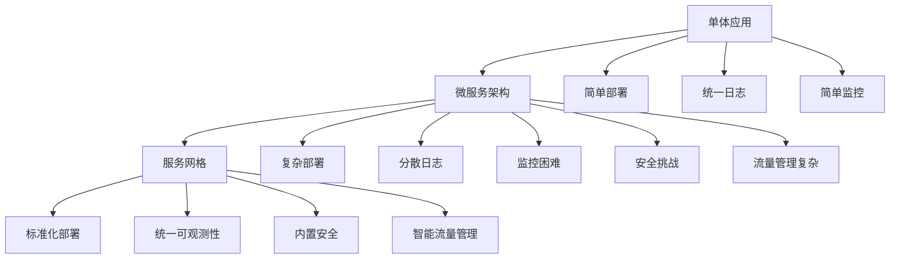
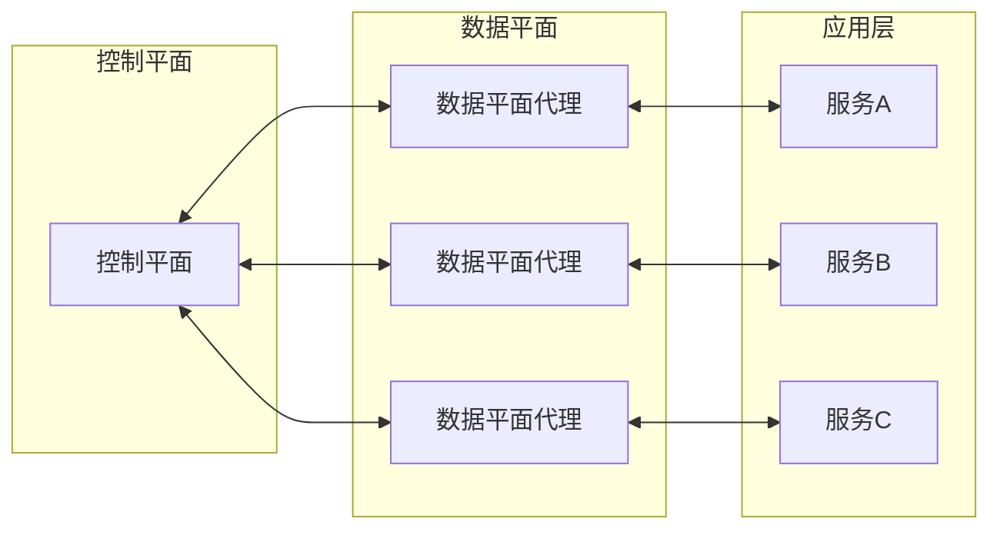

服务网格作为微服务架构演进的重要成果，为解决服务间通信的复杂性提供了全新的思路。它通过在基础设施层实现服务间通信的标准化管理，不仅简化了应用开发，还提供了增强的可观察性能力。本章将深入探讨服务网格的核心概念、架构组成以及在日志与监控方面的特殊需求。

## 服务网格的演进背景

### 微服务架构的挑战

随着微服务架构的普及，服务数量呈指数级增长，服务间通信的复杂性也随之增加：



### 服务网格的诞生

服务网格的出现是为了解决微服务架构中的以下核心问题：

```yaml
# 微服务架构挑战
microservices_challenges:
  communication_complexity:
    description: "服务间通信复杂性"
    issues:
      - 服务发现困难
      - 负载均衡复杂
      - 超时和重试机制
      - 故障处理复杂
    
  observability_gaps:
    description: "可观察性不足"
    issues:
      - 缺乏统一监控视图
      - 跨服务追踪困难
      - 流量可视化不足
      - 性能瓶颈难定位
    
  security_vulnerabilities:
    description: "安全风险"
    issues:
      - 通信未加密
      - 身份认证缺失
      - 授权控制不足
      - 安全策略难实施
    
  operational_overhead:
    description: "运维复杂性"
    issues:
      - 配置管理复杂
      - 版本升级困难
      - 流量控制复杂
      - 故障排查耗时
```

## 服务网格核心架构

### 数据平面与控制平面

服务网格采用数据平面和控制平面分离的架构设计：



### 数据平面详解

数据平面由智能代理组成，负责处理服务间的所有通信：

```yaml
# Envoy代理核心功能
envoy_features:
  traffic_control:
    description: "流量控制"
    capabilities:
      - HTTP/1.1和HTTP/2支持
      - gRPC支持
      - TCP代理
      - TLS终止
      - 健康检查
  
  observability:
    description: "可观察性"
    capabilities:
      - 访问日志记录
      - 分布式追踪
      - 指标收集
      - 统计信息
  
  security:
    description: "安全性"
    capabilities:
      - mTLS加密
      - 身份认证
      - 授权控制
      - 证书管理
  
  resilience:
    description: "弹性"
    capabilities:
      - 超时控制
      - 重试机制
      - 熔断器
      - 限流控制
```

### 控制平面详解

控制平面负责管理和配置数据平面的行为：

```yaml
# Istio控制平面组件
istio_control_plane:
  istiod:
    description: "集成控制平面"
    components:
      - Pilot: 流量管理
      - Citadel: 安全管理
      - Galley: 配置管理
    functions:
      - 服务发现
      - 配置分发
      - 证书管理
      - 验证控制
  
  addons:
    description: "附加组件"
    components:
      - Prometheus: 指标收集
      - Grafana: 数据可视化
      - Jaeger: 分布式追踪
      - Kiali: 服务网格可视化
```

## 服务网格中的日志需求

### 日志类型划分

服务网格环境中的日志可以分为以下几类：

```json
{
  "log_categories": {
    "access_logs": {
      "description": "访问日志",
      "content": "记录所有服务间通信的详细信息",
      "format": "统一结构化格式",
      "collection": "由Envoy代理自动生成"
    },
    "application_logs": {
      "description": "应用日志",
      "content": "应用程序生成的业务相关日志",
      "format": "自定义结构化格式",
      "collection": "通过标准日志收集器"
    },
    "control_plane_logs": {
      "description": "控制平面日志",
      "content": "服务网格控制平面的操作日志",
      "format": "结构化日志",
      "collection": "通过标准日志收集器"
    },
    "security_logs": {
      "description": "安全日志",
      "content": "安全相关事件和审计信息",
      "format": "标准化安全日志格式",
      "collection": "由控制平面生成"
    }
  }
}
```

### 访问日志特性

Envoy代理生成的访问日志具有以下特性：

```text
[2025-08-31T10:30:00.123Z] "POST /api/orders HTTP/1.1" 201 - 1234 567 25ms "curl/7.68.0" "abc123-def456-ghi789" "outbound|8080||order-service" - - -
```

日志字段说明：
- 时间戳：请求处理时间
- HTTP方法和路径：请求的详细信息
- 响应码：HTTP响应状态码
- 请求和响应大小：数据传输量
- 处理时间：请求处理耗时
- 用户代理：客户端信息
- 请求ID：唯一标识符
- 上游服务：目标服务信息

### 日志收集挑战

在服务网格环境中，日志收集面临以下挑战：

```yaml
# 日志收集挑战
logging_challenges:
  volume_explosion:
    description: "日志量激增"
    challenges:
      - 每个服务间通信都产生日志
      - 日志量随服务数量平方增长
      - 存储和处理成本增加
    
  format_standardization:
    description: "格式标准化"
    challenges:
      - 不同服务可能使用不同日志格式
      - 需要统一的日志结构
      - 兼容现有日志系统
    
  context_enrichment:
    description: "上下文丰富化"
    challenges:
      - 添加服务网格元数据
      - 关联应用日志和服务网格日志
      - 跨服务日志关联
    
  performance_impact:
    description: "性能影响"
    challenges:
      - 日志收集可能影响服务性能
      - 需要平衡详细程度和性能
      - 实时收集与批量处理的权衡
```

## 服务网格中的监控需求

### 监控指标类型

服务网格提供了丰富的监控指标：

```promql
# 核心监控指标
core_metrics:
  request_metrics:
    description: "请求相关指标"
    examples:
      - istio_requests_total: 请求总量计数器
      - istio_request_duration_milliseconds: 请求延迟直方图
      - istio_request_bytes: 请求大小直方图
    
  tcp_metrics:
    description: "TCP连接指标"
    examples:
      - istio_tcp_connections_opened_total: TCP连接打开计数
      - istio_tcp_connections_closed_total: TCP连接关闭计数
      - istio_tcp_received_bytes_total: TCP接收字节计数
  
  resource_metrics:
    description: "资源使用指标"
    examples:
      - envoy_cluster_upstream_cx_active: 活跃连接数
      - envoy_server_memory_allocated: 内存使用量
      - envoy_server_cpu_seconds_total: CPU使用时间
```

### 监控维度

服务网格监控具有丰富的维度信息：

```yaml
# 监控维度
monitoring_dimensions:
  service_level:
    description: "服务级别维度"
    dimensions:
      - destination_service: 目标服务
      - source_service: 源服务
      - service_version: 服务版本
    
  request_level:
    description: "请求级别维度"
    dimensions:
      - request_method: HTTP方法
      - request_path: 请求路径
      - response_code: 响应码
    
  mesh_level:
    description: "网格级别维度"
    dimensions:
      - mesh_id: 网格标识
      - cluster_id: 集群标识
      - node_id: 节点标识
```

### 监控挑战

服务网格监控面临以下挑战：

```yaml
# 监控挑战
monitoring_challenges:
  metric_explosion:
    description: "指标爆炸"
    challenges:
      - 指标数量随服务数量平方增长
      - 高基数问题
      - 存储和查询性能影响
    
  dimensionality:
    description: "维度复杂性"
    challenges:
      - 多维度标签组合
      - 查询复杂度增加
      - 可视化难度提升
    
  correlation:
    description: "关联分析"
    challenges:
      - 跨服务指标关联
      - 应用指标与网格指标关联
      - 时间序列对齐问题
    
  sampling:
    description: "采样策略"
    challenges:
      - 高频指标采样
      - 保持统计准确性
      - 成本与精度平衡
```

## 服务网格中的追踪需求

### 分布式追踪增强

服务网格为分布式追踪提供了增强能力：

```json
{
  "tracing_enhancements": {
    "automatic_instrumentation": {
      "description": "自动插桩",
      "benefits": [
        "无需修改应用代码",
        "统一追踪格式",
        "完整调用链覆盖"
      ]
    },
    "context_propagation": {
      "description": "上下文传播",
      "benefits": [
        "跨服务追踪ID传递",
        "baggage信息传播",
        "一致性追踪上下文"
      ]
    },
    "span_enrichment": {
      "description": "Span信息丰富化",
      "benefits": [
        "服务网格元数据添加",
        "网络层信息包含",
        "安全信息记录"
      ]
    }
  }
}
```

### 追踪数据结构

服务网格生成的追踪数据包含丰富的信息：

```json
{
  "traceId": "abc123def456ghi789",
  "id": "jkl012mno345",
  "parentId": "pqr789stu012",
  "name": "POST /api/orders",
  "timestamp": 1630482600123456,
  "duration": 25000,
  "localEndpoint": {
    "serviceName": "user-service",
    "ipv4": "10.1.1.23"
  },
  "tags": {
    "http.method": "POST",
    "http.path": "/api/orders",
    "http.status_code": "201",
    "peer.service": "order-service",
    "istio.mesh_id": "mesh1",
    "istio.cluster_id": "cluster1",
    "istio.canonical_service": "user-service",
    "istio.canonical_revision": "v1.2.3"
  }
}
```

### 追踪挑战

服务网格追踪面临以下挑战：

```yaml
# 追踪挑战
tracing_challenges:
  sampling_strategy:
    description: "采样策略"
    challenges:
      - 高频请求采样
      - 错误请求优先采样
      - 成本与覆盖率平衡
    
  data_volume:
    description: "数据量"
    challenges:
      - 追踪数据量巨大
      - 存储成本高
      - 查询性能影响
    
  correlation:
    description: "关联性"
    challenges:
      - 与应用追踪关联
      - 与日志数据关联
      - 与指标数据关联
    
  visualization:
    description: "可视化"
    challenges:
      - 复杂调用链展示
      - 性能瓶颈识别
      - 故障根因分析
```

## 最佳实践建议

### 架构设计原则

```yaml
# 服务网格可观测性设计原则
design_principles:
  unified_observability:
    description: "统一可观察性"
    guidelines:
      - 统一日志格式
      - 标准化指标命名
      - 一致追踪上下文
      
  layered_approach:
    description: "分层方法"
    guidelines:
      - 基础设施层监控
      - 服务网格层监控
      - 应用层监控
      
  cost_optimization:
    description: "成本优化"
    guidelines:
      - 智能采样策略
      - 分层存储策略
      - 数据保留策略
```

### 实施策略

```yaml
# 实施策略
implementation_strategies:
  incremental_adoption:
    description: "渐进式采用"
    steps:
      - 从非关键服务开始
      - 逐步扩展到核心服务
      - 持续优化配置
      
  tool_integration:
    description: "工具集成"
    steps:
      - 集成现有监控系统
      - 统一告警策略
      - 建立可视化仪表板
      
  team_enablement:
    description: "团队赋能"
    steps:
      - 培训团队成员
      - 建立最佳实践
      - 持续知识分享
```

## 总结

服务网格作为微服务架构演进的重要成果，为解决服务间通信的复杂性提供了全新的解决方案。通过数据平面和控制平面的分离架构，服务网格不仅简化了应用开发，还提供了增强的可观察性能力。

在日志方面，服务网格通过Envoy代理自动生成统一格式的访问日志，但同时也带来了日志量激增的挑战。在监控方面，服务网格提供了丰富的指标和维度信息，但需要处理指标爆炸和高基数问题。在追踪方面，服务网格通过自动插桩和上下文传播增强了分布式追踪能力，但也需要合理的采样策略和存储优化。

通过遵循统一可观察性、分层方法和成本优化等设计原则，可以有效地实施服务网格的可观测性方案，为微服务系统的稳定运行提供有力保障。

在下一节中，我们将详细探讨Istio在日志与监控方面的具体实现。