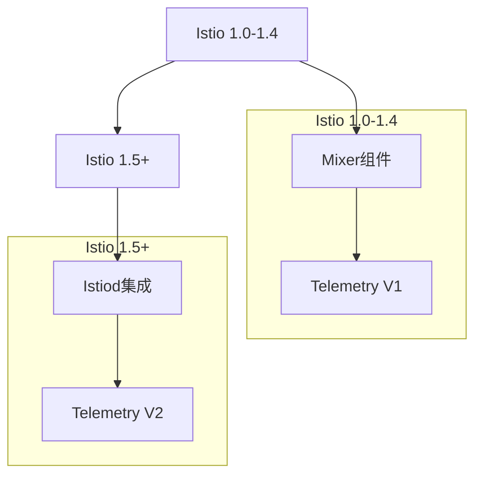

Istio作为最流行的服务网格实现之一，提供了强大的日志与监控支持。通过其内置的遥测功能，Istio能够自动收集服务间通信的详细信息，生成丰富的指标、日志和追踪数据。本章将深入探讨Istio在日志与监控方面的具体实现，包括配置方法、最佳实践以及与其他监控系统的集成。

## Istio遥测架构

### 遥测组件演进

Istio的遥测架构经历了重要的演进：



### Telemetry V2架构

Istio 1.5+采用集成的Telemetry V2架构：

```yaml
# Telemetry V2架构特点
telemetry_v2_features:
  in-proxy_processing:
    description: "代理内处理"
    benefits:
      - 减少组件依赖
      - 提升处理性能
      - 降低延迟
    
  wasm_extensions:
    description: "WASM扩展"
    benefits:
      - 可插拔架构
      - 动态配置更新
      - 自定义处理逻辑
    
  unified_telemetry:
    description: "统一遥测"
    benefits:
      - 统一数据格式
      - 一致处理流程
      - 简化配置管理
```

## Istio日志配置与管理

### 访问日志配置

Istio通过EnvoyFilter配置访问日志：

```yaml
# 访问日志配置
apiVersion: networking.istio.io/v1alpha3
kind: EnvoyFilter
metadata:
  name: access-log-config
  namespace: istio-system
spec:
  configPatches:
  - applyTo: NETWORK_FILTER
    match:
      context: ANY
      listener:
        filterChain:
          filter:
            name: "envoy.filters.network.http_connection_manager"
    patch:
      operation: MERGE
      value:
        typed_config:
          "@type": "type.googleapis.com/envoy.extensions.filters.network.http_connection_manager.v3.HttpConnectionManager"
          access_log:
          - name: envoy.access_loggers.file
            typed_config:
              "@type": type.googleapis.com/envoy.extensions.access_loggers.file.v3.FileAccessLog
              path: /dev/stdout
              log_format:
                text_format_source:
                  inline_string: "[%START_TIME%] \"%REQ(:METHOD)% %REQ(X-ENVOY-ORIGINAL-PATH?:PATH)% %PROTOCOL%\" %RESPONSE_CODE% %RESPONSE_FLAGS% %BYTES_RECEIVED% %BYTES_SENT% %DURATION% %RESP(X-ENVOY-UPSTREAM-SERVICE-TIME)% \"%REQ(X-FORWARDED-FOR)%\" \"%REQ(USER-AGENT)%\" \"%REQ(X-REQUEST-ID)%\" \"%REQ(:AUTHORITY)%\" \"%UPSTREAM_HOST%\" %UPSTREAM_CLUSTER% %UPSTREAM_LOCAL_ADDRESS% %DOWNSTREAM_LOCAL_ADDRESS% %DOWNSTREAM_REMOTE_ADDRESS% %REQUESTED_SERVER_NAME% %ROUTE_NAME%\n"
```

### 结构化日志格式

Istio支持JSON格式的结构化日志：

```yaml
# JSON格式访问日志
apiVersion: networking.istio.io/v1alpha3
kind: EnvoyFilter
metadata:
  name: json-access-log
  namespace: istio-system
spec:
  configPatches:
  - applyTo: NETWORK_FILTER
    match:
      context: ANY
      listener:
        filterChain:
          filter:
            name: "envoy.filters.network.http_connection_manager"
    patch:
      operation: MERGE
      value:
        typed_config:
          "@type": "type.googleapis.com/envoy.extensions.filters.network.http_connection_manager.v3.HttpConnectionManager"
          access_log:
          - name: envoy.access_loggers.file
            typed_config:
              "@type": type.googleapis.com/envoy.extensions.access_loggers.file.v3.FileAccessLog
              path: /dev/stdout
              log_format:
                json_format:
                  timestamp: "%START_TIME%"
                  method: "%REQ(:METHOD)%"
                  path: "%REQ(X-ENVOY-ORIGINAL-PATH?:PATH)%"
                  protocol: "%PROTOCOL%"
                  response_code: "%RESPONSE_CODE%"
                  response_flags: "%RESPONSE_FLAGS%"
                  bytes_received: "%BYTES_RECEIVED%"
                  bytes_sent: "%BYTES_SENT%"
                  duration: "%DURATION%"
                  upstream_service_time: "%RESP(X-ENVOY-UPSTREAM-SERVICE-TIME)%"
                  forwarded_for: "%REQ(X-FORWARDED-FOR)%"
                  user_agent: "%REQ(USER-AGENT)%"
                  request_id: "%REQ(X-REQUEST-ID)%"
                  authority: "%REQ(:AUTHORITY)%"
                  upstream_host: "%UPSTREAM_HOST%"
                  upstream_cluster: "%UPSTREAM_CLUSTER%"
                  route_name: "%ROUTE_NAME%"
```

### 自定义日志字段

通过Telemetry API添加自定义字段：

```yaml
# 自定义日志字段
apiVersion: telemetry.istio.io/v1alpha1
kind: Telemetry
metadata:
  name: custom-logs
  namespace: istio-system
spec:
  accessLogging:
  - providers:
    - name: envoy
    filter:
      expression: response.code >= 400
    match:
      mode: CLIENT_AND_SERVER
    logFormat:
      labels:
        source_service: "%SOURCE_SERVICE%"
        destination_service: "%DESTINATION_SERVICE%"
        response_code: "%RESPONSE_CODE%"
        request_method: "%REQ(:METHOD)%"
        request_path: "%REQ(X-ENVOY-ORIGINAL-PATH?:PATH)%"
        user_agent: "%REQ(USER-AGENT)%"
        request_id: "%REQ(X-REQUEST-ID)%"
        custom_tag: "istio-mesh"
```

## Istio监控指标详解

### 核心指标类型

Istio提供了丰富的监控指标：

```promql
# 请求相关指标
request_metrics:
  istio_requests_total:
    description: "请求总量计数器"
    type: "Counter"
    labels:
      - source_workload
      - source_workload_namespace
      - destination_workload
      - destination_workload_namespace
      - response_code
      - response_flags
      - reporter
      
  istio_request_duration_milliseconds:
    description: "请求延迟直方图"
    type: "Histogram"
    labels:
      - source_workload
      - source_workload_namespace
      - destination_workload
      - destination_workload_namespace
      - response_code
      
  istio_request_bytes:
    description: "请求大小直方图"
    type: "Histogram"
    labels:
      - source_workload
      - source_workload_namespace
      - destination_workload
      - destination_workload_namespace

# TCP连接指标
tcp_metrics:
  istio_tcp_connections_opened_total:
    description: "TCP连接打开计数"
    type: "Counter"
    labels:
      - source_workload
      - source_workload_namespace
      - destination_workload
      - destination_workload_namespace
      
  istio_tcp_connections_closed_total:
    description: "TCP连接关闭计数"
    type: "Counter"
    labels:
      - source_workload
      - source_workload_namespace
      - destination_workload
      - destination_workload_namespace
      
  istio_tcp_sent_bytes_total:
    description: "TCP发送字节计数"
    type: "Counter"
    labels:
      - source_workload
      - source_workload_namespace
      - destination_workload
      - destination_workload_namespace
```

### 服务级别指标

```promql
# 服务级别指标查询示例
# 服务成功率
rate(istio_requests_total{reporter="destination", response_code!~"5.*"}[5m]) / 
rate(istio_requests_total{reporter="destination"}[5m])

# 服务延迟（95百分位）
histogram_quantile(0.95, 
  sum(rate(istio_request_duration_milliseconds_bucket{reporter="destination"}[5m])) by (le, destination_workload))

# 服务流量
rate(istio_requests_total{reporter="destination"}[5m])

# 服务错误率
rate(istio_requests_total{reporter="destination", response_code=~"5.*"}[5m]) / 
rate(istio_requests_total{reporter="destination"}[5m])
```

### 网格级别指标

```promql
# 网格级别指标查询示例
# 网格总请求数
sum(rate(istio_requests_total[5m]))

# 网格平均延迟
histogram_quantile(0.95, 
  sum(rate(istio_request_duration_milliseconds_bucket[5m])) by (le))

# 网格错误率
sum(rate(istio_requests_total{response_code=~"5.*"}[5m])) / 
sum(rate(istio_requests_total[5m]))

# 活跃连接数
sum(istio_tcp_connections_opened_total) - sum(istio_tcp_connections_closed_total)
```

## Istio分布式追踪

### 追踪配置

Istio支持多种追踪后端：

```yaml
# Istio追踪配置
apiVersion: install.istio.io/v1alpha1
kind: IstioOperator
spec:
  meshConfig:
    enableTracing: true
    defaultConfig:
      tracing:
        sampling: 100
        custom_tags:
          service:
            environment:
              name: SERVICE_NAME
          version:
            environment:
              name: SERVICE_VERSION
          cluster:
            environment:
              name: CLUSTER_NAME
        zipkin:
          address: zipkin.istio-system:9411
```

### 追踪采样策略

```yaml
# 自定义追踪采样策略
apiVersion: telemetry.istio.io/v1alpha1
kind: Telemetry
metadata:
  name: custom-tracing
  namespace: istio-system
spec:
  tracing:
  - providers:
    - name: "zipkin"
    randomSamplingPercentage: 50.0
    customTags:
      service_version:
        literal:
          value: "v1.2.3"
      cluster_id:
        environment:
          name: CLUSTER_ID
          defaultValue: "unknown"
      request_id:
        header:
          name: "x-request-id"
```

### 追踪数据增强

```yaml
# 追踪数据增强配置
apiVersion: telemetry.istio.io/v1alpha1
kind: Telemetry
metadata:
  name: enhanced-tracing
  namespace: istio-system
spec:
  tracing:
  - providers:
    - name: "zipkin"
    randomSamplingPercentage: 100.0
    customTags:
      # 添加服务网格元数据
      mesh_id:
        literal:
          value: "mesh1"
      # 添加环境信息
      environment:
        environment:
          name: ENVIRONMENT
          defaultValue: "production"
      # 添加自定义业务标签
      business_unit:
        literal:
          value: "ecommerce"
      # 从HTTP头提取信息
      user_id:
        header:
          name: "x-user-id"
```

## 与监控系统的集成

### Prometheus集成

```yaml
# Prometheus配置
apiVersion: v1
kind: ConfigMap
metadata:
  name: prometheus-config
  namespace: istio-system
data:
  prometheus.yml: |
    global:
      scrape_interval: 15s
    scrape_configs:
    - job_name: 'istio-mesh'
      kubernetes_sd_configs:
      - role: endpoints
        namespaces:
          names:
          - istio-system
      relabel_configs:
      - source_labels: [__meta_kubernetes_service_name, __meta_kubernetes_endpoint_port_name]
        action: keep
        regex: istiod;http-monitoring
```

### Grafana仪表板

```json
{
  "dashboard": {
    "title": "Istio Service Dashboard",
    "panels": [
      {
        "title": "服务成功率",
        "type": "stat",
        "targets": [
          {
            "expr": "rate(istio_requests_total{reporter=\"destination\", response_code!~\"5.*\"}[5m]) / rate(istio_requests_total{reporter=\"destination\"}[5m]) * 100",
            "legendFormat": "成功率"
          }
        ]
      },
      {
        "title": "服务延迟",
        "type": "graph",
        "targets": [
          {
            "expr": "histogram_quantile(0.5, sum(rate(istio_request_duration_milliseconds_bucket{reporter=\"destination\"}[5m])) by (le))",
            "legendFormat": "50百分位"
          },
          {
            "expr": "histogram_quantile(0.95, sum(rate(istio_request_duration_milliseconds_bucket{reporter=\"destination\"}[5m])) by (le))",
            "legendFormat": "95百分位"
          }
        ]
      },
      {
        "title": "服务流量",
        "type": "graph",
        "targets": [
          {
            "expr": "rate(istio_requests_total{reporter=\"destination\"}[5m])",
            "legendFormat": "RPS"
          }
        ]
      }
    ]
  }
}
```

### Jaeger集成

```yaml
# Jaeger部署配置
apiVersion: apps/v1
kind: Deployment
metadata:
  name: jaeger
  namespace: istio-system
spec:
  selector:
    matchLabels:
      app: jaeger
  template:
    metadata:
      labels:
        app: jaeger
    spec:
      containers:
      - name: jaeger
        image: jaegertracing/all-in-one:1.41
        ports:
        - containerPort: 16686
          name: query-http
        - containerPort: 14268
          name: collector-http
        - containerPort: 14250
          name: grpc
        env:
        - name: SPAN_STORAGE_TYPE
          value: badger
        - name: BADGER_EPHEMERAL
          value: "false"
        - name: BADGER_DIRECTORY_VALUE
          value: "/badger/data"
        - name: BADGER_DIRECTORY_KEY
          value: "/badger/key"
        volumeMounts:
        - name: data
          mountPath: /badger
      volumes:
      - name: data
        emptyDir: {}
```

## 性能优化与最佳实践

### 日志性能优化

```yaml
# 日志性能优化配置
apiVersion: telemetry.istio.io/v1alpha1
kind: Telemetry
metadata:
  name: optimized-logging
  namespace: istio-system
spec:
  accessLogging:
  - providers:
    - name: envoy
    # 仅记录错误请求
    filter:
      expression: response.code >= 500
    # 降低采样率
    samplingRate: 0.1
    # 使用更简洁的日志格式
    logFormat:
      text: "[%START_TIME%] \"%REQ(:METHOD)% %REQ(X-ENVOY-ORIGINAL-PATH?:PATH)%\" %RESPONSE_CODE% %DURATION%\n"
```

### 监控性能优化

```yaml
# 监控性能优化配置
apiVersion: telemetry.istio.io/v1alpha1
kind: Telemetry
metadata:
  name: optimized-metrics
  namespace: istio-system
spec:
  metrics:
  - providers:
    - name: prometheus
    # 降低指标收集频率
    reportingInterval: 30s
    # 过滤不必要的指标
    overrides:
    - match:
        metric: REQUEST_COUNT
      tagOverrides:
        request_operation:
          operation: REMOVE
        grpc_status:
          operation: REMOVE
```

### 资源限制配置

```yaml
# 资源限制配置
apiVersion: install.istio.io/v1alpha1
kind: IstioOperator
spec:
  components:
    pilot:
      k8s:
        resources:
          requests:
            cpu: 100m
            memory: 128Mi
          limits:
            cpu: 500m
            memory: 512Mi
    ingressGateways:
    - name: istio-ingressgateway
      k8s:
        resources:
          requests:
            cpu: 100m
            memory: 128Mi
          limits:
            cpu: 2000m
            memory: 1024Mi
```

## 故障排查与调试

### 日志级别调整

```yaml
# 调整日志级别
apiVersion: install.istio.io/v1alpha1
kind: IstioOperator
spec:
  values:
    global:
      logging:
        level: "info"
    pilot:
      logging:
        level: "debug"
```

### 调试端点访问

```bash
# 访问Envoy管理端点
kubectl exec -it <pod-name> -c istio-proxy -- curl http://localhost:15000/stats/prometheus

# 查看配置摘要
kubectl exec -it <pod-name> -c istio-proxy -- curl http://localhost:15000/config_dump

# 查看集群信息
kubectl exec -it <pod-name> -c istio-proxy -- curl http://localhost:15000/clusters
```

### 常见问题诊断

```yaml
# 常见问题诊断清单
troubleshooting_checklist:
  metrics_issues:
    checks:
      - "确认Prometheus能够访问istiod服务"
      - "检查指标收集间隔配置"
      - "验证标签匹配规则"
      
  logging_issues:
    checks:
      - "确认EnvoyFilter配置正确"
      - "检查日志格式配置"
      - "验证日志收集器能够读取标准输出"
      
  tracing_issues:
    checks:
      - "确认追踪后端服务正常运行"
      - "检查采样率配置"
      - "验证追踪上下文传播"
```

## 最佳实践总结

### 配置管理

```yaml
# 配置管理最佳实践
best_practices:
  configuration_management:
    guidelines:
      - "使用Telemetry API而非EnvoyFilter进行配置"
      - "按命名空间分隔配置"
      - "使用版本控制管理配置变更"
      
  performance_optimization:
    guidelines:
      - "根据业务需求调整采样率"
      - "合理设置指标收集间隔"
      - "优化日志格式减少存储开销"
      
  security_considerations:
    guidelines:
      - "限制敏感信息在日志中的暴露"
      - "配置适当的访问控制策略"
      - "定期审查和更新安全配置"
```

### 监控策略

```yaml
# 监控策略最佳实践
monitoring_strategies:
  alerting:
    guidelines:
      - "为关键服务设置成功率告警"
      - "监控服务延迟异常"
      - "设置错误率阈值告警"
      
  dashboard_design:
    guidelines:
      - "按服务级别组织仪表板"
      - "提供网格级别概览"
      - "包含故障排查视图"
      
  capacity_planning:
    guidelines:
      - "监控资源使用情况"
      - "预测指标增长趋势"
      - "规划存储容量扩展"
```

## 总结

Istio通过其强大的遥测功能，为服务网格提供了全面的日志与监控支持。从访问日志配置到指标收集，再到分布式追踪，Istio都能够自动处理大部分复杂性，让开发者能够专注于业务逻辑。

在实际应用中，需要根据具体的业务需求和性能要求来调整配置，合理设置采样率和收集频率，以平衡监控的详细程度和系统性能。通过与Prometheus、Grafana、Jaeger等主流监控工具的集成，可以构建完整的可观测性体系。

通过遵循最佳实践，合理配置资源限制，及时进行故障排查和性能优化，可以确保Istio遥测系统的稳定运行，为微服务架构提供可靠的可观察性保障。

在下一节中，我们将探讨如何使用Envoy代理进行日志采集。