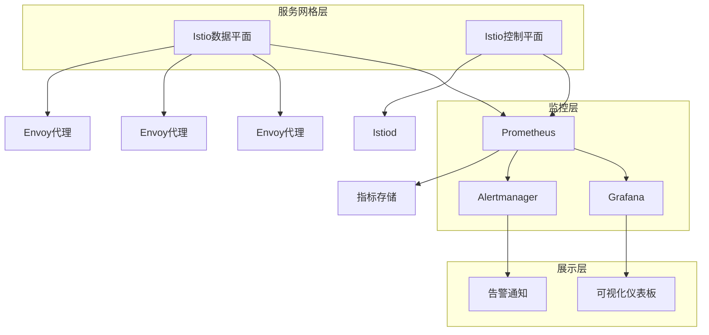
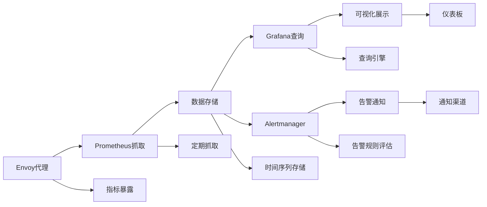

在服务网格环境中，Prometheus和Grafana作为业界领先的监控和可视化工具，为微服务架构提供了强大的可观测性能力。通过与Istio等服务网格的深度集成，可以实现自动化的指标收集、丰富的仪表板展示和智能的告警机制。本章将深入探讨如何将Prometheus、Grafana与服务网格集成，构建完整的可视化监控体系。

## 监控架构设计

### 服务网格监控架构



### 监控数据流



## Prometheus与服务网格集成

### 自动发现配置

```yaml
# Prometheus自动发现配置
apiVersion: v1
kind: ConfigMap
metadata:
  name: prometheus-config
  namespace: istio-system
data:
  prometheus.yml: |
    global:
      scrape_interval: 15s
      evaluation_interval: 15s
    
    rule_files:
      - "istio_rules.yml"
    
    scrape_configs:
    # Istio网格指标
    - job_name: 'istio-mesh'
      kubernetes_sd_configs:
      - role: endpoints
        namespaces:
          names:
          - istio-system
      relabel_configs:
      - source_labels: [__meta_kubernetes_service_name, __meta_kubernetes_endpoint_port_name]
        action: keep
        regex: istiod;http-monitoring
    
    # Envoy代理指标
    - job_name: 'envoy-stats'
      kubernetes_sd_configs:
      - role: pod
      relabel_configs:
      - source_labels: [__meta_kubernetes_pod_container_name]
        action: keep
        regex: 'istio-proxy'
      - source_labels: [__meta_kubernetes_pod_name]
        action: replace
        target_label: pod_name
      - source_labels: [__meta_kubernetes_namespace]
        action: replace
        target_label: namespace
    
    # 应用指标
    - job_name: 'kubernetes-pods'
      kubernetes_sd_configs:
      - role: pod
      relabel_configs:
      - source_labels: [__meta_kubernetes_pod_annotation_prometheus_io_scrape]
        action: keep
        regex: true
      - source_labels: [__meta_kubernetes_pod_annotation_prometheus_io_path]
        action: replace
        target_label: __metrics_path__
        regex: (.+)
      - source_labels: [__address__, __meta_kubernetes_pod_annotation_prometheus_io_port]
        action: replace
        regex: ([^:]+)(?::\d+)?;(\d+)
        replacement: $1:$2
        target_label: __address__
      - action: labelmap
        regex: __meta_kubernetes_pod_label_(.+)
      - source_labels: [__meta_kubernetes_namespace]
        action: replace
        target_label: kubernetes_namespace
      - source_labels: [__meta_kubernetes_pod_name]
        action: replace
        target_label: kubernetes_pod_name
```

### Istio指标配置

```yaml
# Istio指标配置
apiVersion: telemetry.istio.io/v1alpha1
kind: Telemetry
metadata:
  name: mesh-metrics
  namespace: istio-system
spec:
  metrics:
  - providers:
    - name: prometheus
    overrides:
    - match:
        metric: REQUEST_COUNT
      tagOverrides:
        request_operation:
          operation: UPSERT
          value: "%REQ(:METHOD)%"
        grpc_status:
          operation: REMOVE
    - match:
        metric: REQUEST_DURATION
      tagOverrides:
        response_code:
          operation: UPSERT
          value: "%RESPONSE_CODE%"
```

### 自定义指标收集

```yaml
# 自定义指标收集配置
apiVersion: telemetry.istio.io/v1alpha1
kind: Telemetry
metadata:
  name: custom-metrics
  namespace: istio-system
spec:
  metrics:
  - providers:
    - name: prometheus
    overrides:
    - match:
        metric: CUSTOM_REQUEST_COUNT
      tagOverrides:
        custom_tag:
          operation: UPSERT
          value: "custom-value"
```

## Grafana仪表板设计

### 核心服务仪表板

```json
{
  "dashboard": {
    "title": "Istio Service Dashboard",
    "tags": ["istio", "service", "microservices"],
    "timezone": "browser",
    "schemaVersion": 16,
    "version": 1,
    "panels": [
      {
        "id": 1,
        "title": "服务成功率",
        "type": "stat",
        "gridPos": {
          "x": 0,
          "y": 0,
          "w": 6,
          "h": 6
        },
        "targets": [
          {
            "expr": "rate(istio_requests_total{reporter=\"destination\", response_code!~\"5.*\"}[5m]) / rate(istio_requests_total{reporter=\"destination\"}[5m]) * 100",
            "legendFormat": "成功率",
            "refId": "A"
          }
        ],
        "options": {
          "reduceOptions": {
            "values": false,
            "calcs": ["lastNotNull"]
          },
          "orientation": "horizontal",
          "textMode": "auto",
          "colorMode": "value",
          "graphMode": "area",
          "justifyMode": "auto"
        }
      },
      {
        "id": 2,
        "title": "服务延迟 (95百分位)",
        "type": "gauge",
        "gridPos": {
          "x": 6,
          "y": 0,
          "w": 6,
          "h": 6
        },
        "targets": [
          {
            "expr": "histogram_quantile(0.95, sum(rate(istio_request_duration_milliseconds_bucket{reporter=\"destination\"}[5m])) by (le))",
            "legendFormat": "延迟",
            "refId": "A"
          }
        ],
        "options": {
          "reduceOptions": {
            "values": false,
            "calcs": ["lastNotNull"]
          },
          "orientation": "auto",
          "textMode": "auto",
          "colorMode": "value",
          "graphMode": "area",
          "justifyMode": "auto"
        }
      },
      {
        "id": 3,
        "title": "请求速率",
        "type": "graph",
        "gridPos": {
          "x": 12,
          "y": 0,
          "w": 12,
          "h": 6
        },
        "targets": [
          {
            "expr": "rate(istio_requests_total{reporter=\"destination\"}[5m])",
            "legendFormat": "RPS",
            "refId": "A"
          }
        ],
        "xaxis": {
          "mode": "time"
        },
        "yaxes": [
          {
            "format": "reqps",
            "label": "请求/秒"
          },
          {
            "format": "short"
          }
        ]
      },
      {
        "id": 4,
        "title": "错误率",
        "type": "graph",
        "gridPos": {
          "x": 0,
          "y": 6,
          "w": 12,
          "h": 6
        },
        "targets": [
          {
            "expr": "rate(istio_requests_total{reporter=\"destination\", response_code=~\"5.*\"}[5m]) / rate(istio_requests_total{reporter=\"destination\"}[5m]) * 100",
            "legendFormat": "错误率 %",
            "refId": "A"
          }
        ],
        "xaxis": {
          "mode": "time"
        },
        "yaxes": [
          {
            "format": "percent",
            "label": "错误率"
          },
          {
            "format": "short"
          }
        ]
      },
      {
        "id": 5,
        "title": "流量分布",
        "type": "piechart",
        "gridPos": {
          "x": 12,
          "y": 6,
          "w": 12,
          "h": 6
        },
        "targets": [
          {
            "expr": "sum(rate(istio_requests_total{reporter=\"destination\"}[5m])) by (response_code)",
            "legendFormat": "状态码 {{response_code}}",
            "refId": "A"
          }
        ]
      }
    ]
  }
}
```

### 网格级别仪表板

```json
{
  "dashboard": {
    "title": "Istio Mesh Dashboard",
    "tags": ["istio", "mesh", "overview"],
    "timezone": "browser",
    "schemaVersion": 16,
    "version": 1,
    "panels": [
      {
        "id": 1,
        "title": "网格总请求数",
        "type": "stat",
        "gridPos": {
          "x": 0,
          "y": 0,
          "w": 6,
          "h": 6
        },
        "targets": [
          {
            "expr": "sum(rate(istio_requests_total[5m]))",
            "legendFormat": "总请求数",
            "refId": "A"
          }
        ]
      },
      {
        "id": 2,
        "title": "网格平均延迟",
        "type": "stat",
        "gridPos": {
          "x": 6,
          "y": 0,
          "w": 6,
          "h": 6
        },
        "targets": [
          {
            "expr": "histogram_quantile(0.95, sum(rate(istio_request_duration_milliseconds_bucket[5m])) by (le))",
            "legendFormat": "平均延迟",
            "refId": "A"
          }
        ]
      },
      {
        "id": 3,
        "title": "网格错误率",
        "type": "stat",
        "gridPos": {
          "x": 12,
          "y": 0,
          "w": 6,
          "h": 6
        },
        "targets": [
          {
            "expr": "sum(rate(istio_requests_total{response_code=~\"5.*\"}[5m])) / sum(rate(istio_requests_total[5m])) * 100",
            "legendFormat": "错误率",
            "refId": "A"
          }
        ]
      },
      {
        "id": 4,
        "title": "服务间通信矩阵",
        "type": "heatmap",
        "gridPos": {
          "x": 0,
          "y": 6,
          "w": 24,
          "h": 8
        },
        "targets": [
          {
            "expr": "rate(istio_requests_total{reporter=\"source\"}[5m])",
            "legendFormat": "{{source_workload}} -> {{destination_workload}}",
            "refId": "A"
          }
        ]
      }
    ]
  }
}
```

## 告警规则配置

### 核心服务告警

```yaml
# 核心服务告警规则
groups:
- name: istio-service-alerts
  rules:
  # 服务成功率告警
  - alert: ServiceSuccessRateLow
    expr: rate(istio_requests_total{reporter="destination", response_code!~"5.*"}[5m]) / rate(istio_requests_total{reporter="destination"}[5m]) < 0.95
    for: 5m
    labels:
      severity: warning
    annotations:
      summary: "服务 {{ $labels.destination_workload }} 成功率低于95%"
      description: "服务 {{ $labels.destination_workload }} 在过去5分钟内的成功率 {{ $value }} 低于阈值95%"

  # 服务延迟告警
  - alert: ServiceLatencyHigh
    expr: histogram_quantile(0.95, sum(rate(istio_request_duration_milliseconds_bucket{reporter="destination"}[5m])) by (le, destination_workload)) > 1000
    for: 5m
    labels:
      severity: warning
    annotations:
      summary: "服务 {{ $labels.destination_workload }} 延迟过高"
      description: "服务 {{ $labels.destination_workload }} 的95%延迟 {{ $value }}ms 超过阈值1000ms"

  # 服务错误率告警
  - alert: ServiceErrorRateHigh
    expr: rate(istio_requests_total{reporter="destination", response_code=~"5.*"}[5m]) / rate(istio_requests_total{reporter="destination"}[5m]) > 0.05
    for: 5m
    labels:
      severity: critical
    annotations:
      summary: "服务 {{ $labels.destination_workload }} 错误率过高"
      description: "服务 {{ $labels.destination_workload }} 在过去5分钟内的错误率 {{ $value }} 超过阈值5%"

  # 服务不可用告警
  - alert: ServiceDown
    expr: up{job="istio-mesh"} == 0
    for: 2m
    labels:
      severity: critical
    annotations:
      summary: "Istio服务不可用"
      description: "Istio控制平面服务已宕机超过2分钟"
```

### 网格级别告警

```yaml
# 网格级别告警规则
groups:
- name: istio-mesh-alerts
  rules:
  # 网格整体成功率告警
  - alert: MeshSuccessRateLow
    expr: sum(rate(istio_requests_total{reporter="destination", response_code!~"5.*"}[5m])) / sum(rate(istio_requests_total{reporter="destination"}[5m])) < 0.90
    for: 5m
    labels:
      severity: critical
    annotations:
      summary: "服务网格整体成功率低于90%"
      description: "服务网格在过去5分钟内的整体成功率 {{ $value }} 低于阈值90%"

  # 网格整体延迟告警
  - alert: MeshLatencyHigh
    expr: histogram_quantile(0.95, sum(rate(istio_request_duration_milliseconds_bucket[5m])) by (le)) > 2000
    for: 5m
    labels:
      severity: warning
    annotations:
      summary: "服务网格整体延迟过高"
      description: "服务网格的95%延迟 {{ $value }}ms 超过阈值2000ms"

  # 网格错误率告警
  - alert: MeshErrorRateHigh
    expr: sum(rate(istio_requests_total{response_code=~"5.*"}[5m])) / sum(rate(istio_requests_total[5m])) > 0.10
    for: 5m
    labels:
      severity: critical
    annotations:
      summary: "服务网格整体错误率过高"
      description: "服务网格在过去5分钟内的整体错误率 {{ $value }} 超过阈值10%"
```

## 性能优化与最佳实践

### Prometheus性能优化

```yaml
# Prometheus性能优化配置
apiVersion: v1
kind: ConfigMap
metadata:
  name: prometheus-config
  namespace: istio-system
data:
  prometheus.yml: |
    global:
      scrape_interval: 30s  # 增加抓取间隔
      scrape_timeout: 10s
      evaluation_interval: 30s
    
    # 样本过期时间
    storage:
      tsdb:
        retention.time: 15d  # 减少保留时间
        retention.size: 50GB  # 限制存储大小
    
    scrape_configs:
    # 降低高基数指标的抓取频率
    - job_name: 'high-cardinality-metrics'
      scrape_interval: 60s
      scrape_timeout: 20s
      kubernetes_sd_configs:
      - role: endpoints
      relabel_configs:
      - source_labels: [__meta_kubernetes_service_name]
        action: keep
        regex: 'high-cardinality-service'
    
    # 过滤不必要的标签
    metric_relabel_configs:
    - source_labels: [__name__]
      regex: 'envoy_cluster_upstream_cx_(active|connect_timeout)'
      action: drop
```

### Grafana性能优化

```json
{
  "dashboard": {
    "title": "Optimized Dashboard",
    "panels": [
      {
        "id": 1,
        "title": "优化的查询",
        "type": "graph",
        "targets": [
          {
            "expr": "rate(istio_requests_total{reporter=\"destination\"}[5m])",
            "legendFormat": "{{destination_workload}}",
            "interval": "1m",  # 设置查询间隔
            "intervalFactor": 2  # 降低数据点密度
          }
        ]
      }
    ]
  }
}
```

### 资源限制配置

```yaml
# Prometheus资源限制
apiVersion: apps/v1
kind: Deployment
metadata:
  name: prometheus
  namespace: istio-system
spec:
  template:
    spec:
      containers:
      - name: prometheus
        resources:
          requests:
            memory: "400Mi"
            cpu: "300m"
          limits:
            memory: "2Gi"
            cpu: "1000m"
        # 存储配置
        volumeMounts:
        - name: prometheus-storage
          mountPath: /prometheus
      volumes:
      - name: prometheus-storage
        persistentVolumeClaim:
          claimName: prometheus-pvc
```

```yaml
# Grafana资源限制
apiVersion: apps/v1
kind: Deployment
metadata:
  name: grafana
  namespace: istio-system
spec:
  template:
    spec:
      containers:
      - name: grafana
        resources:
          requests:
            memory: "100Mi"
            cpu: "100m"
          limits:
            memory: "500Mi"
            cpu: "500m"
```

## 安全配置

### 访问控制

```yaml
# Prometheus安全配置
apiVersion: v1
kind: Secret
metadata:
  name: prometheus-basic-auth
  namespace: istio-system
data:
  auth: <base64-encoded-auth-string>

---
apiVersion: v1
kind: ConfigMap
metadata:
  name: prometheus-web-config
  namespace: istio-system
data:
  web.yml: |
    basic_auth_users:
      prometheus: <bcrypt-hash-of-password>
```

### TLS配置

```yaml
# Prometheus TLS配置
apiVersion: v1
kind: Secret
metadata:
  name: prometheus-tls
  namespace: istio-system
type: kubernetes.io/tls
data:
  tls.crt: <base64-encoded-certificate>
  tls.key: <base64-encoded-private-key>

---
apiVersion: apps/v1
kind: Deployment
metadata:
  name: prometheus
  namespace: istio-system
spec:
  template:
    spec:
      containers:
      - name: prometheus
        args:
        - --web.config.file=/etc/prometheus/web.yml
        volumeMounts:
        - name: tls-certs
          mountPath: /etc/prometheus/certs
          readOnly: true
        - name: web-config
          mountPath: /etc/prometheus/web.yml
          subPath: web.yml
      volumes:
      - name: tls-certs
        secret:
          secretName: prometheus-tls
      - name: web-config
        configMap:
          name: prometheus-web-config
```

## 故障排查与调试

### 常见问题诊断

```bash
# 检查Prometheus目标状态
kubectl get pods -n istio-system
kubectl port-forward -n istio-system prometheus-<pod-name> 9090:9090
# 访问 http://localhost:9090/targets

# 检查指标抓取情况
# 访问 http://localhost:9090/graph
# 查询: up

# 检查Grafana数据源
kubectl port-forward -n istio-system grafana-<pod-name> 3000:3000
# 访问 http://localhost:3000
# 检查数据源配置和测试连接

# 查看Istio指标
kubectl exec -it istiod-<pod-name> -n istio-system -- curl http://localhost:15014/metrics
```

### 日志分析

```bash
# Prometheus日志
kubectl logs -n istio-system prometheus-<pod-name>

# Grafana日志
kubectl logs -n istio-system grafana-<pod-name>

# Istio控制平面日志
kubectl logs -n istio-system istiod-<pod-name>
```

### 性能监控

```promql
# Prometheus自身性能监控
# 存储空间使用
sum(prometheus_tsdb_storage_blocks_bytes) / 1024 / 1024

# 内存使用
process_resident_memory_bytes / 1024 / 1024

# 抓取延迟
prometheus_target_interval_length_seconds{quantile="0.99"}

# 查询性能
histogram_quantile(0.99, sum(rate(prometheus_engine_query_duration_seconds_bucket[5m])) by (le))
```

## 最佳实践总结

### 部署策略

```yaml
# 部署策略最佳实践
best_practices:
  deployment_strategy:
    guidelines:
      - "使用独立的监控命名空间"
      - "实施高可用部署"
      - "配置适当的资源限制"
      - "启用持久化存储"
      
  scaling_considerations:
    guidelines:
      - "根据服务数量调整资源"
      - "实施分片策略处理大规模部署"
      - "优化存储和查询性能"
      - "定期清理过期数据"
```

### 配置管理

```yaml
# 配置管理最佳实践
configuration_best_practices:
  monitoring_config:
    guidelines:
      - "使用配置管理工具管理配置"
      - "实施配置版本控制"
      - "定期审查和优化配置"
      - "建立配置变更流程"
      
  dashboard_management:
    guidelines:
      - "建立标准化仪表板模板"
      - "实施仪表板版本控制"
      - "定期审查仪表板有效性"
      - "建立仪表板共享机制"
```

### 安全管理

```yaml
# 安全管理最佳实践
security_best_practices:
  access_control:
    guidelines:
      - "实施最小权限原则"
      - "启用身份认证和授权"
      - "定期轮换访问凭证"
      - "监控异常访问行为"
      
  data_protection:
    guidelines:
      - "启用传输加密"
      - "实施数据备份策略"
      - "定期进行安全审计"
      - "保护敏感监控数据"
```

## 总结

通过将Prometheus、Grafana与服务网格深度集成，可以构建强大的可视化监控体系，为微服务架构提供全面的可观测性。关键要点包括：

1. **合理的架构设计**：建立清晰的监控数据流和组件关系
2. **精细化的指标收集**：配置适当的自动发现和指标收集策略
3. **直观的可视化展示**：设计有效的仪表板和告警规则
4. **性能优化**：实施资源限制和查询优化策略
5. **安全保障**：配置访问控制和数据保护机制

通过遵循最佳实践，合理配置资源限制，及时进行故障排查和性能优化，可以确保监控系统的稳定运行，为微服务架构提供可靠的可观测性保障。

在下一节中，我们将探讨服务网格中的追踪与流量分析技术。