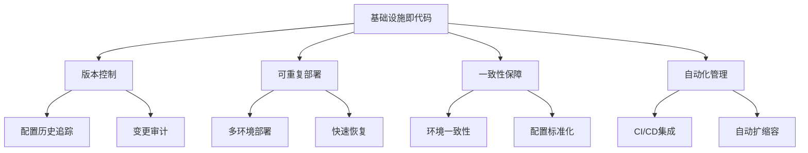

Terraform作为业界领先的基础设施即代码（IaC）工具，为日志与监控系统的部署提供了强大而灵活的解决方案。通过声明式的配置方式，Terraform能够确保监控基础设施的一致性、可重复性和可管理性。本章将深入探讨如何使用Terraform部署完整的日志与监控系统，包括Prometheus、Grafana、Elasticsearch、Fluentd等核心组件。

## Terraform核心概念

### 基础设施即代码优势



### Terraform工作流

```yaml
# Terraform工作流
terraform_workflow:
  init:
    description: "初始化工作目录"
    command: "terraform init"
    purpose: "下载提供者插件，初始化后端"
    
  plan:
    description: "创建执行计划"
    command: "terraform plan"
    purpose: "预览将要执行的操作"
    
  apply:
    description: "应用配置"
    command: "terraform apply"
    purpose: "创建或更新基础设施"
    
  destroy:
    description: "销毁基础设施"
    command: "terraform destroy"
    purpose: "安全地销毁所有资源"
```

## 监控系统Terraform配置

### Prometheus Operator部署

```hcl
# main.tf - Prometheus监控系统部署
terraform {
  required_version = ">= 1.0"
  required_providers {
    kubernetes = {
      source  = "hashicorp/kubernetes"
      version = ">= 2.0"
    }
    helm = {
      source  = "hashicorp/helm"
      version = ">= 2.0"
    }
  }
}

provider "kubernetes" {
  config_path = "~/.kube/config"
}

provider "helm" {
  kubernetes {
    config_path = "~/.kube/config"
  }
}

# 创建监控命名空间
resource "kubernetes_namespace" "monitoring" {
  metadata {
    name = "monitoring"
    labels = {
      "name" = "monitoring"
    }
  }
}

# 部署Prometheus Operator
resource "helm_release" "prometheus_operator" {
  name       = "prometheus-operator"
  repository = "https://prometheus-community.github.io/helm-charts"
  chart      = "kube-prometheus-stack"
  version    = "45.1.1"
  namespace  = kubernetes_namespace.monitoring.metadata[0].name

  # 基础配置
  values = [
    templatefile("${path.module}/templates/prometheus-values.yaml", {
      retention_time     = var.prometheus_retention_time
      storage_size       = var.prometheus_storage_size
      replica_count      = var.prometheus_replica_count
      resources_requests = var.prometheus_resources_requests
      resources_limits   = var.prometheus_resources_limits
    })
  ]

  # 特定配置覆盖
  set {
    name  = "prometheus.prometheusSpec.serviceMonitorSelectorNilUsesHelmValues"
    value = "false"
  }

  set {
    name  = "prometheus.prometheusSpec.ruleSelectorNilUsesHelmValues"
    value = "false"
  }

  set {
    name  = "grafana.adminPassword"
    value = var.grafana_admin_password
  }

  # 依赖关系
  depends_on = [
    kubernetes_namespace.monitoring
  ]
}

# Prometheus自定义资源配置
resource "kubernetes_manifest" "prometheus_additional_scrape_configs" {
  manifest = {
    "apiVersion" = "v1"
    "kind"       = "Secret"
    "metadata" = {
      "name"      = "additional-scrape-configs"
      "namespace" = kubernetes_namespace.monitoring.metadata[0].name
    }
    "data" = {
      "prometheus-additional.yaml" = base64encode(templatefile("${path.module}/templates/additional-scrape-configs.yaml", {
        external_targets = var.external_monitoring_targets
      }))
    }
  }

  depends_on = [
    kubernetes_namespace.monitoring
  ]
}
```

### 变量定义文件

```hcl
# variables.tf - 变量定义
variable "environment" {
  description = "部署环境 (dev, staging, prod)"
  type        = string
  default     = "dev"
}

variable "prometheus_retention_time" {
  description = "Prometheus数据保留时间"
  type        = string
  default     = "15d"
}

variable "prometheus_storage_size" {
  description = "Prometheus存储大小"
  type        = string
  default     = "50Gi"
}

variable "prometheus_replica_count" {
  description = "Prometheus副本数量"
  type        = number
  default     = 1
}

variable "prometheus_resources_requests" {
  description = "Prometheus资源请求"
  type = object({
    memory = string
    cpu    = string
  })
  default = {
    memory = "1Gi"
    cpu    = "500m"
  }
}

variable "prometheus_resources_limits" {
  description = "Prometheus资源限制"
  type = object({
    memory = string
    cpu    = string
  })
  default = {
    memory = "2Gi"
    cpu    = "1000m"
  }
}

variable "grafana_admin_password" {
  description = "Grafana管理员密码"
  type        = string
  sensitive   = true
}

variable "external_monitoring_targets" {
  description = "外部监控目标列表"
  type = list(object({
    job_name = string
    targets  = list(string)
  }))
  default = []
}
```

### Prometheus配置模板

```yaml
# templates/prometheus-values.yaml
prometheus:
  prometheusSpec:
    retention: {{ .retention_time }}
    replicas: {{ .replica_count }}
    resources:
      requests:
        memory: {{ .resources_requests.memory }}
        cpu: {{ .resources_requests.cpu }}
      limits:
        memory: {{ .resources_limits.memory }}
        cpu: {{ .resources_limits.cpu }}
    
    storageSpec:
      volumeClaimTemplate:
        spec:
          accessModes: ["ReadWriteOnce"]
          resources:
            requests:
              storage: {{ .storage_size }}
    
    # 环境特定配置
    {{- if eq .environment "dev" }}
    externalLabels:
      environment: development
      cluster: dev-cluster
    {{- else if eq .environment "staging" }}
    externalLabels:
      environment: staging
      cluster: staging-cluster
    {{- else }}
    externalLabels:
      environment: production
      cluster: prod-cluster
    {{- end }}
    
    # 额外的抓取配置
    additionalScrapeConfigs:
      name: additional-scrape-configs
      key: prometheus-additional.yaml

alertmanager:
  alertmanagerSpec:
    replicas: {{ if eq .environment "prod" }}3{{ else }}1{{ end }}
    resources:
      requests:
        memory: 128Mi
        cpu: 100m
      limits:
        memory: 256Mi
        cpu: 200m
```

## 日志系统Terraform配置

### ELK Stack部署

```hcl
# elk-stack.tf - ELK日志系统部署
# 部署Elasticsearch
resource "helm_release" "elasticsearch" {
  name       = "elasticsearch"
  repository = "https://helm.elastic.co"
  chart      = "elasticsearch"
  version    = "7.17.3"
  namespace  = kubernetes_namespace.monitoring.metadata[0].name

  values = [
    templatefile("${path.module}/templates/elasticsearch-values.yaml", {
      replica_count = var.elasticsearch_replica_count
      heap_size     = var.elasticsearch_heap_size
      storage_size  = var.elasticsearch_storage_size
      resources     = var.elasticsearch_resources
    })
  ]

  depends_on = [
    kubernetes_namespace.monitoring
  ]
}

# 部署Fluentd
resource "helm_release" "fluentd" {
  name       = "fluentd"
  repository = "https://fluent.github.io/helm-charts"
  chart      = "fluentd"
  version    = "0.3.2"
  namespace  = kubernetes_namespace.monitoring.metadata[0].name

  values = [
    templatefile("${path.module}/templates/fluentd-values.yaml", {
      elasticsearch_host = helm_release.elasticsearch.name
      elasticsearch_port = 9200
      log_level          = var.fluentd_log_level
      buffer_chunk_limit = var.fluentd_buffer_chunk_limit
    })
  ]

  depends_on = [
    helm_release.elasticsearch
  ]
}

# 部署Kibana
resource "helm_release" "kibana" {
  name       = "kibana"
  repository = "https://helm.elastic.co"
  chart      = "kibana"
  version    = "7.17.3"
  namespace  = kubernetes_namespace.monitoring.metadata[0].name

  values = [
    templatefile("${path.module}/templates/kibana-values.yaml", {
      elasticsearch_host = helm_release.elasticsearch.name
      elasticsearch_port = 9200
      resources          = var.kibana_resources
    })
  ]

  depends_on = [
    helm_release.elasticsearch
  ]
}
```

### Elasticsearch配置模板

```yaml
# templates/elasticsearch-values.yaml
---
# Elasticsearch资源配置
replicas: {{ .replica_count }}

# 资源限制
resources:
  requests:
    memory: {{ .resources.requests.memory }}
    cpu: {{ .resources.requests.cpu }}
  limits:
    memory: {{ .resources.limits.memory }}
    cpu: {{ .resources.limits.cpu }}

# 存储配置
volumeClaimTemplate:
  accessModes: [ "ReadWriteOnce" ]
  resources:
    requests:
      storage: {{ .storage_size }}

# JVM配置
esJavaOpts: "-Xmx{{ .heap_size }} -Xms{{ .heap_size }}"

# 网络配置
networkHost: "0.0.0.0"

# 环境特定配置
{{- if eq .environment "dev" }}
clusterHealthCheckParams: "wait_for_status=yellow&timeout=1s"
minimumMasterNodes: 1
{{- else }}
clusterHealthCheckParams: "wait_for_status=green&timeout=1s"
minimumMasterNodes: {{ if ge .replica_count 3 }}2{{ else }}1{{ end }}
{{- end }}
```

### Fluentd配置模板

```yaml
# templates/fluentd-values.yaml
---
# Fluentd配置
fluentd:
  config:
    logLevel: {{ .log_level }}
    
    # 输入配置
    inputs: |
      <source>
        @type tail
        @id in_tail_container_logs
        path /var/log/containers/*.log
        pos_file /var/log/fluentd-containers.log.pos
        tag kubernetes.*
        read_from_head true
        <parse>
          @type json
          time_format %Y-%m-%dT%H:%M:%S.%NZ
        </parse>
      </source>
      
      <source>
        @type systemd
        @id in_systemd_kubelet
        filters [{ "_SYSTEMD_UNIT": "kubelet.service" }]
        <entry>
          field_map {"MESSAGE": "message", "_HOSTNAME": "hostname", "_SYSTEMD_UNIT": "systemd_unit"}
          field_map_strict true
        </entry>
        path /var/log/journal
        pos_file /var/log/fluentd-journald-kubelet.pos
        read_from_head true
        tag kubelet
      </source>

    # 过滤器配置
    filters: |
      <filter kubernetes.**>
        @type kubernetes_metadata
        @id filter_kube_metadata
        kubernetes_url "#{ENV['KUBERNETES_URL']}"
        bearer_token_file "#{ENV['KUBERNETES_BEARER_TOKEN_FILE']}"
        ca_file "#{ENV['KUBERNETES_CA_FILE']}"
        watch false
      </filter>

    # 输出配置
    outputs: |
      <match **>
        @type elasticsearch
        @id out_es
        host {{ .elasticsearch_host }}
        port {{ .elasticsearch_port }}
        logstash_format true
        logstash_prefix "#{ENV['LOGSTASH_PREFIX'] || 'logstash'}"
        include_tag_key true
        tag_key @log_name
        flush_interval 10s
        <buffer>
          @type file
          path /var/log/fluentd-buffers/kubernetes.system.buffer
          flush_mode interval
          retry_type exponential_backoff
          flush_thread_count 2
          flush_interval 5s
          retry_forever
          retry_max_interval 30
          chunk_limit_size {{ .buffer_chunk_limit }}
          queue_limit_length 8
          overflow_action block
        </buffer>
      </match>

# DaemonSet配置
daemonset:
  containers:
    - name: fluentd
      env:
        - name: ELASTICSEARCH_HOST
          value: {{ .elasticsearch_host }}
        - name: ELASTICSEARCH_PORT
          value: "{{ .elasticsearch_port }}"
```

## 环境管理配置

### 多环境变量文件

```hcl
# environments/dev.tfvars
environment = "dev"
prometheus_retention_time = "2d"
prometheus_storage_size = "50Gi"
prometheus_replica_count = 1
prometheus_resources_requests = {
  memory = "512Mi"
  cpu    = "200m"
}
prometheus_resources_limits = {
  memory = "1Gi"
  cpu    = "500m"
}

grafana_admin_password = "dev-password-123"

elasticsearch_replica_count = 1
elasticsearch_heap_size = "1g"
elasticsearch_storage_size = "50Gi"
elasticsearch_resources = {
  requests = {
    memory = "1Gi"
    cpu    = "500m"
  }
  limits = {
    memory = "2Gi"
    cpu    = "1000m"
  }
}

fluentd_log_level = "info"
fluentd_buffer_chunk_limit = "2M"
```

```hcl
# environments/prod.tfvars
environment = "prod"
prometheus_retention_time = "30d"
prometheus_storage_size = "1000Gi"
prometheus_replica_count = 3
prometheus_resources_requests = {
  memory = "4Gi"
  cpu    = "2000m"
}
prometheus_resources_limits = {
  memory = "8Gi"
  cpu    = "4000m"
}

grafana_admin_password = "super-secret-password"

elasticsearch_replica_count = 5
elasticsearch_heap_size = "4g"
elasticsearch_storage_size = "1000Gi"
elasticsearch_resources = {
  requests = {
    memory = "8Gi"
    cpu    = "4000m"
  }
  limits = {
    memory = "16Gi"
    cpu    = "8000m"
  }
}

fluentd_log_level = "warn"
fluentd_buffer_chunk_limit = "8M"
```

## 自动化部署脚本

### 部署管理脚本

```bash
#!/bin/bash
# Terraform部署管理脚本

# 颜色定义
RED='\033[0;31m'
GREEN='\033[0;32m'
YELLOW='\033[1;33m'
NC='\033[0m' # No Color

# 日志函数
log_info() {
    echo -e "${GREEN}[INFO]${NC} $1"
}

log_warn() {
    echo -e "${YELLOW}[WARN]${NC} $1"
}

log_error() {
    echo -e "${RED}[ERROR]${NC} $1"
}

# 验证环境
validate_environment() {
    local env=$1
    
    if [[ ! -f "environments/${env}.tfvars" ]]; then
        log_error "环境配置文件 environments/${env}.tfvars 不存在"
        return 1
    fi
    
    log_info "验证环境配置: $env"
    return 0
}

# 初始化Terraform
terraform_init() {
    log_info "初始化Terraform..."
    
    if ! terraform init; then
        log_error "Terraform初始化失败"
        return 1
    fi
    
    log_info "Terraform初始化成功"
    return 0
}

# 计划部署
terraform_plan() {
    local env=$1
    
    log_info "生成部署计划 for environment: $env"
    
    if ! terraform plan -var-file="environments/${env}.tfvars"; then
        log_error "生成部署计划失败"
        return 1
    fi
    
    log_info "部署计划生成成功"
    return 0
}

# 应用部署
terraform_apply() {
    local env=$1
    local auto_approve=$2
    
    log_info "应用部署 for environment: $env"
    
    local apply_cmd="terraform apply -var-file=environments/${env}.tfvars"
    if [[ $auto_approve == "true" ]]; then
        apply_cmd="$apply_cmd -auto-approve"
    fi
    
    if ! $apply_cmd; then
        log_error "部署应用失败"
        return 1
    fi
    
    log_info "部署应用成功"
    return 0
}

# 销毁部署
terraform_destroy() {
    local env=$1
    local auto_approve=$2
    
    log_warn "即将销毁环境: $env"
    log_warn "此操作不可逆，请确认！"
    
    local destroy_cmd="terraform destroy -var-file=environments/${env}.tfvars"
    if [[ $auto_approve == "true" ]]; then
        destroy_cmd="$destroy_cmd -auto-approve"
    fi
    
    if ! $destroy_cmd; then
        log_error "环境销毁失败"
        return 1
    fi
    
    log_info "环境销毁成功"
    return 0
}

# 验证部署状态
validate_deployment() {
    local env=$1
    
    log_info "验证部署状态 for environment: $env"
    
    # 检查关键组件状态
    local components=("prometheus-operator" "elasticsearch" "fluentd" "kibana")
    
    for component in "${components[@]}"; do
        if helm status "$component" -n monitoring >/dev/null 2>&1; then
            log_info "组件 $component 状态正常"
        else
            log_warn "组件 $component 状态异常或未部署"
        fi
    done
    
    return 0
}

# 主函数
main() {
    local action=$1
    local environment=$2
    local auto_approve=$3
    
    # 参数验证
    if [[ -z "$action" ]]; then
        echo "用法: $0 {init|plan|apply|destroy|validate} [environment] [auto-approve]"
        echo "示例: $0 apply prod true"
        return 1
    fi
    
    # 执行相应操作
    case $action in
        "init")
            terraform_init
            ;;
        "plan")
            if [[ -z "$environment" ]]; then
                log_error "plan操作需要指定环境"
                return 1
            fi
            validate_environment "$environment" && terraform_plan "$environment"
            ;;
        "apply")
            if [[ -z "$environment" ]]; then
                log_error "apply操作需要指定环境"
                return 1
            fi
            validate_environment "$environment" && terraform_init && terraform_apply "$environment" "$auto_approve"
            ;;
        "destroy")
            if [[ -z "$environment" ]]; then
                log_error "destroy操作需要指定环境"
                return 1
            fi
            validate_environment "$environment" && terraform_destroy "$environment" "$auto_approve"
            ;;
        "validate")
            if [[ -z "$environment" ]]; then
                log_error "validate操作需要指定环境"
                return 1
            fi
            validate_deployment "$environment"
            ;;
        *)
            log_error "未知操作: $action"
            return 1
            ;;
    esac
}

# 执行主函数
main "$@"
```

## 状态管理与后端配置

### 远程状态配置

```hcl
# backend.tf - 远程状态配置
terraform {
  backend "s3" {
    bucket         = "terraform-state-bucket"
    key            = "monitoring/terraform.tfstate"
    region         = "us-west-2"
    dynamodb_table = "terraform-state-lock"
    encrypt        = true
  }
}
```

### 状态锁配置

```hcl
# state-lock.tf - 状态锁配置
resource "aws_dynamodb_table" "terraform_state_lock" {
  name           = "terraform-state-lock"
  read_capacity  = 5
  write_capacity = 5
  hash_key       = "LockID"

  attribute {
    name = "LockID"
    type = "S"
  }

  tags = {
    Name = "Terraform State Lock Table"
  }
}
```

## 安全配置管理

### 密码和密钥管理

```hcl
# secrets.tf - 密钥管理
# 使用外部密钥管理服务
data "aws_secretsmanager_secret_version" "grafana_admin_password" {
  secret_id = "monitoring/grafana-admin-password"
}

data "aws_secretsmanager_secret_version" "elasticsearch_password" {
  secret_id = "monitoring/elasticsearch-password"
}

# 在helm_release中使用
resource "helm_release" "prometheus_operator" {
  # ... 其他配置 ...
  
  set_sensitive {
    name  = "grafana.adminPassword"
    value = data.aws_secretsmanager_secret_version.grafana_admin_password.secret_string
  }
}
```

## 最佳实践总结

### 部署最佳实践

```yaml
# 部署最佳实践
deployment_best_practices:
  infrastructure_design:
    guidelines:
      - "使用模块化设计组织配置"
      - "实施环境差异化配置"
      - "建立清晰的资源依赖关系"
      - "合理规划资源命名规范"
      
  security_considerations:
    guidelines:
      - "敏感信息使用外部密钥管理"
      - "实施最小权限原则"
      - "启用资源加密"
      - "定期轮换凭证"
      
  performance_optimization:
    guidelines:
      - "根据环境调整资源配置"
      - "实施自动扩缩容策略"
      - "优化存储配置"
      - "监控资源使用情况"
```

### 故障排查指南

```bash
# 常见问题排查命令
# 检查Terraform状态
terraform state list

# 检查特定资源状态
terraform state show helm_release.prometheus_operator

# 强制重新创建资源
terraform taint helm_release.prometheus_operator

# 导入现有资源
terraform import helm_release.existing_release namespace/release-name

# 验证配置语法
terraform validate

# 格式化配置文件
terraform fmt -recursive
```

## 总结

通过使用Terraform部署日志与监控系统，可以实现基础设施的标准化、自动化和可管理性。关键要点包括：

1. **模块化设计**：合理组织Terraform配置，提高可维护性
2. **环境管理**：通过变量文件实现环境差异化配置
3. **安全保护**：使用外部密钥管理服务保护敏感信息
4. **自动化流程**：建立完整的CI/CD流水线
5. **状态管理**：实施远程状态和状态锁机制

通过遵循最佳实践，合理配置资源和安全策略，可以确保监控基础设施的稳定、安全和高效运行。Terraform的强大功能使得复杂的监控系统部署变得简单、可靠和可重复。

在下一节中，我们将探讨自动化的监控报警与事件响应机制。