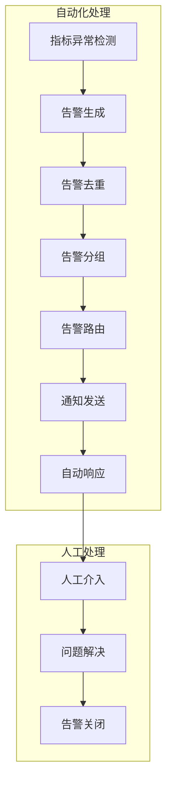

在现代微服务架构中，系统的复杂性和规模不断增长，传统的手动监控和告警响应方式已无法满足高效运维的需求。通过实现自动化的监控报警与事件响应机制，可以显著提升问题发现的及时性、响应的准确性和处理的效率。本章将深入探讨如何构建自动化的监控报警与事件响应体系，实现智能化的运维管理。

## 自动化告警架构

### 告警处理流程



### 告警生命周期管理

```yaml
# 告警生命周期
alert_lifecycle:
  trigger:
    description: "告警触发"
    actions:
      - 异常检测
      - 告警生成
      - 告警验证
      
  processing:
    description: "告警处理"
    actions:
      - 告警去重
      - 告警分组
      - 告警抑制
      - 告警升级
      
  notification:
    description: "通知发送"
    actions:
      - 渠道选择
      - 人员通知
      - 状态更新
      
  response:
    description: "响应处理"
    actions:
      - 自动响应
      - 人工处理
      - 协作沟通
      
  resolution:
    description: "问题解决"
    actions:
      - 根因分析
      - 解决方案实施
      - 告警关闭
      - 事后总结
```

## 智能告警策略

### 告警级别设计

```yaml
# 告警级别定义
alert_levels:
  P1_CRITICAL:
    description: "关键告警"
    response_time: "< 15分钟"
    channels: ["phone", "sms", "slack_critical"]
    escalation_time: "5分钟"
    targets: ["oncall_engineer", "team_lead"]
    
  P2_HIGH:
    description: "高优先级告警"
    response_time: "< 1小时"
    channels: ["slack_high", "email"]
    escalation_time: "30分钟"
    targets: ["primary_team"]
    
  P3_MEDIUM:
    description: "中优先级告警"
    response_time: "< 4小时"
    channels: ["slack_medium", "email"]
    escalation_time: "2小时"
    targets: ["secondary_team"]
    
  P4_LOW:
    description: "低优先级告警"
    response_time: "< 24小时"
    channels: ["slack_low"]
    escalation_time: "8小时"
    targets: ["monitoring_team"]
```

### 告警规则配置

```yaml
# Prometheus告警规则
groups:
- name: service-health-alerts
  rules:
  # 服务不可用告警
  - alert: ServiceDown
    expr: up == 0
    for: 2m
    labels:
      severity: P1_CRITICAL
      team: infrastructure
    annotations:
      summary: "服务 {{ $labels.job }} 不可用"
      description: "服务 {{ $labels.job }} 已经宕机超过2分钟"
      runbook_url: "https://internal/wiki/ServiceDownRunbook"

  # 高错误率告警
  - alert: HighErrorRate
    expr: rate(http_requests_total{status=~"5.."}[5m]) / rate(http_requests_total[5m]) > 0.05
    for: 5m
    labels:
      severity: P2_HIGH
      team: application
    annotations:
      summary: "服务 {{ $labels.job }} 错误率过高"
      description: "服务 {{ $labels.job }} 的5分钟错误率 {{ $value }} 超过阈值5%"
      runbook_url: "https://internal/wiki/HighErrorRateRunbook"

  # 高延迟告警
  - alert: HighLatency
    expr: histogram_quantile(0.95, sum(rate(http_request_duration_seconds_bucket[5m])) by (le, job)) > 2
    for: 5m
    labels:
      severity: P2_HIGH
      team: performance
    annotations:
      summary: "服务 {{ $labels.job }} 响应延迟过高"
      description: "服务 {{ $labels.job }} 的95%响应时间 {{ $value }} 超过阈值2秒"
      runbook_url: "https://internal/wiki/HighLatencyRunbook"

# 业务指标告警
- name: business-metrics-alerts
  rules:
  # 订单处理延迟告警
  - alert: OrderProcessingDelay
    expr: rate(order_processing_time_seconds_sum[5m]) / rate(order_processing_time_seconds_count[5m]) > 30
    for: 10m
    labels:
      severity: P2_HIGH
      team: business
    annotations:
      summary: "订单处理延迟过高"
      description: "订单平均处理时间 {{ $value }} 超过阈值30秒"
      runbook_url: "https://internal/wiki/OrderProcessingDelayRunbook"
```

## Alertmanager自动化配置

### 路由配置

```yaml
# Alertmanager路由配置
route:
  # 默认接收器
  receiver: default-receiver
  group_by: ['alertname', 'cluster', 'service']
  group_wait: 30s
  group_interval: 5m
  repeat_interval: 3h
  
  # 路由树
  routes:
  # 基础设施团队路由
  - matchers:
    - team = "infrastructure"
    receiver: infrastructure-team
    group_interval: 1m
    repeat_interval: 1h
    routes:
    - matchers:
      - severity = "P1_CRITICAL"
      receiver: infrastructure-critical
      group_wait: 10s
      
  # 应用团队路由
  - matchers:
    - team = "application"
    receiver: application-team
    group_interval: 5m
    repeat_interval: 2h
    
  # 性能团队路由
  - matchers:
    - team = "performance"
    receiver: performance-team
    group_interval: 10m
    repeat_interval: 4h

# 接收器配置
receivers:
# 默认接收器
- name: default-receiver
  webhook_configs:
  - url: 'http://notification-service:8080/default'
    send_resolved: true

# 基础设施团队接收器
- name: infrastructure-team
  slack_configs:
  - api_url: 'https://hooks.slack.com/services/XXX'
    channel: '#infrastructure-alerts'
    send_resolved: true
    title: '{{ template "slack.title" . }}'
    text: '{{ template "slack.text" . }}'
    icon_emoji: ':rotating_light:'
    
  email_configs:
  - to: 'infrastructure-team@company.com'
    send_resolved: true
    headers:
      Subject: '{{ template "email.subject" . }}'

# 基础设施关键告警接收器
- name: infrastructure-critical
  webhook_configs:
  - url: 'http://pagerduty-proxy:8080/critical'
    send_resolved: true
    http_config:
      basic_auth:
        username: 'pagerduty'
        password_file: '/etc/alertmanager/pagerduty-password'
        
  slack_configs:
  - api_url: 'https://hooks.slack.com/services/XXX'
    channel: '#infrastructure-critical'
    send_resolved: true
    title: '[CRITICAL] {{ template "slack.title" . }}'
    text: '{{ template "slack.text" . }}'
    icon_emoji: ':rotating_light:'
```

### 告警抑制规则

```yaml
# 告警抑制规则
inhibit_rules:
# 当服务完全宕机时，抑制高错误率告警
- source_matchers:
  - alertname = "ServiceDown"
  target_matchers:
  - alertname = "HighErrorRate"
  equal: ['job', 'cluster']

# 当数据库宕机时，抑制相关应用告警
- source_matchers:
  - alertname = "DatabaseDown"
  target_matchers:
  - alertname = "ApplicationError"
  equal: ['database', 'cluster']

# 当网络分区时，抑制跨区域通信告警
- source_matchers:
  - alertname = "NetworkPartition"
  target_matchers:
  - alertname = "CrossRegionCommunicationFailure"
  equal: ['region']
```

## 自动化响应机制

### Webhook响应处理器

```python
# 自动化响应处理器
import json
import requests
from flask import Flask, request, jsonify
import logging

app = Flask(__name__)
logger = logging.getLogger(__name__)

class AutomatedResponder:
    def __init__(self):
        self.handlers = {
            'ServiceDown': self.handle_service_down,
            'HighErrorRate': self.handle_high_error_rate,
            'HighLatency': self.handle_high_latency
        }
    
    def process_alert(self, alert_data):
        """处理告警"""
        alert_name = alert_data.get('labels', {}).get('alertname')
        severity = alert_data.get('labels', {}).get('severity')
        
        logger.info(f"处理告警: {alert_name}, 严重级别: {severity}")
        
        # 根据告警类型调用相应处理器
        if alert_name in self.handlers:
            return self.handlers[alert_name](alert_data)
        else:
            logger.warning(f"未知告警类型: {alert_name}")
            return {"status": "unknown_alert", "message": f"未知告警类型: {alert_name}"}
    
    def handle_service_down(self, alert_data):
        """处理服务宕机告警"""
        service_name = alert_data.get('labels', {}).get('job')
        cluster = alert_data.get('labels', {}).get('cluster')
        
        # 自动重启服务
        restart_result = self.restart_service(service_name, cluster)
        
        # 通知相关人员
        self.notify_team(f"服务 {service_name} 在集群 {cluster} 中宕机，已尝试自动重启")
        
        # 记录事件
        self.log_incident(alert_data, "service_restart", restart_result)
        
        return {
            "status": "processed",
            "action": "service_restart",
            "result": restart_result
        }
    
    def handle_high_error_rate(self, alert_data):
        """处理高错误率告警"""
        service_name = alert_data.get('labels', {}).get('job')
        
        # 自动扩容服务
        scale_result = self.scale_service(service_name, 2)  # 扩容2个实例
        
        # 调整负载均衡权重
        self.adjust_load_balancer(service_name, 0.8)  # 降低80%权重
        
        # 通知团队
        self.notify_team(f"服务 {service_name} 错误率过高，已自动扩容并调整负载均衡")
        
        return {
            "status": "processed",
            "action": "auto_scaling",
            "result": scale_result
        }
    
    def handle_high_latency(self, alert_data):
        """处理高延迟告警"""
        service_name = alert_data.get('labels', {}).get('job')
        
        # 收集性能数据
        perf_data = self.collect_performance_data(service_name)
        
        # 触发性能分析
        analysis_result = self.trigger_performance_analysis(service_name, perf_data)
        
        # 通知性能团队
        self.notify_performance_team(f"服务 {service_name} 延迟过高，已触发性能分析")
        
        return {
            "status": "processed",
            "action": "performance_analysis",
            "result": analysis_result
        }
    
    def restart_service(self, service_name, cluster):
        """重启服务"""
        try:
            # 这里应该是实际的重启逻辑
            # 例如调用Kubernetes API重启Pod
            logger.info(f"重启服务: {service_name} 在集群: {cluster}")
            return {"status": "success", "message": "服务重启成功"}
        except Exception as e:
            logger.error(f"重启服务失败: {e}")
            return {"status": "failed", "message": str(e)}
    
    def scale_service(self, service_name, replicas):
        """扩容服务"""
        try:
            # 这里应该是实际的扩容逻辑
            logger.info(f"扩容服务: {service_name} 到 {replicas} 个实例")
            return {"status": "success", "message": f"服务扩容到{replicas}个实例"}
        except Exception as e:
            logger.error(f"扩容服务失败: {e}")
            return {"status": "failed", "message": str(e)}
    
    def notify_team(self, message):
        """通知团队"""
        # 发送Slack通知
        self.send_slack_notification("#ops-team", message)
        
        # 发送邮件通知
        self.send_email_notification("ops-team@company.com", "自动响应通知", message)
    
    def notify_performance_team(self, message):
        """通知性能团队"""
        self.send_slack_notification("#performance-team", message)
    
    def send_slack_notification(self, channel, message):
        """发送Slack通知"""
        # 实际的Slack API调用
        pass
    
    def send_email_notification(self, to, subject, message):
        """发送邮件通知"""
        # 实际的邮件发送逻辑
        pass
    
    def collect_performance_data(self, service_name):
        """收集性能数据"""
        # 收集CPU、内存、网络等性能指标
        return {"cpu_usage": 80, "memory_usage": 70, "network_latency": 100}
    
    def trigger_performance_analysis(self, service_name, perf_data):
        """触发性能分析"""
        # 调用性能分析工具
        return {"status": "triggered", "analysis_id": "perf-12345"}
    
    def log_incident(self, alert_data, action, result):
        """记录事件"""
        # 将事件记录到事件管理系统
        pass

# 初始化响应器
responder = AutomatedResponder()

@app.route('/webhook/alerts', methods=['POST'])
def handle_alerts():
    """处理Alertmanager Webhook"""
    try:
        alert_data = request.json
        logger.info(f"收到告警数据: {json.dumps(alert_data, indent=2)}")
        
        # 处理每个告警
        results = []
        for alert in alert_data.get('alerts', []):
            result = responder.process_alert(alert)
            results.append(result)
        
        return jsonify({
            "status": "success",
            "results": results
        })
    except Exception as e:
        logger.error(f"处理告警时出错: {e}")
        return jsonify({
            "status": "error",
            "message": str(e)
        }), 500

if __name__ == '__main__':
    app.run(host='0.0.0.0', port=8080, debug=True)
```

## 事件管理平台集成

### PagerDuty集成

```python
# PagerDuty集成
import pdpyras

class PagerDutyIntegration:
    def __init__(self, api_key, default_service_id):
        self.session = pdpyras.APISession(api_key)
        self.default_service_id = default_service_id
    
    def create_incident(self, title, body, service_id=None):
        """创建事件"""
        if service_id is None:
            service_id = self.default_service_id
            
        try:
            incident = self.session.rpost('/incidents', json={
                'type': 'incident',
                'title': title,
                'service': {
                    'id': service_id,
                    'type': 'service_reference'
                },
                'body': {
                    'type': 'incident_body',
                    'details': body
                }
            })
            return incident
        except Exception as e:
            print(f"创建事件失败: {e}")
            return None
    
    def acknowledge_incident(self, incident_id):
        """确认事件"""
        try:
            self.session.rput(f'/incidents/{incident_id}', json={
                'type': 'incident_reference',
                'id': incident_id,
                'status': 'acknowledged'
            })
            return True
        except Exception as e:
            print(f"确认事件失败: {e}")
            return False
    
    def resolve_incident(self, incident_id, resolution):
        """解决事件"""
        try:
            self.session.rput(f'/incidents/{incident_id}', json={
                'type': 'incident_reference',
                'id': incident_id,
                'status': 'resolved',
                'resolution': resolution
            })
            return True
        except Exception as e:
            print(f"解决事件失败: {e}")
            return False

# 使用示例
pagerduty = PagerDutyIntegration('your-api-key', 'service-id')
incident = pagerduty.create_incident(
    title='关键服务宕机',
    body='用户服务在生产环境中宕机，影响用户登录'
)
```

### Opsgenie集成

```python
# Opsgenie集成
import opsgenie_sdk

class OpsgenieIntegration:
    def __init__(self, api_key):
        self.conf = opsgenie_sdk.configuration.Configuration()
        self.conf.api_key['Authorization'] = api_key
        self.api_client = opsgenie_sdk.api_client.ApiClient(configuration=self.conf)
        self.alert_api = opsgenie_sdk.AlertApi(api_client=self.api_client)
    
    def create_alert(self, message, alias, description, priority='P3', tags=None):
        """创建告警"""
        if tags is None:
            tags = []
            
        body = opsgenie_sdk.CreateAlertPayload(
            message=message,
            alias=alias,
            description=description,
            priority=priority,
            tags=tags
        )
        
        try:
            response = self.alert_api.create_alert(body)
            return response
        except Exception as e:
            print(f"创建告警失败: {e}")
            return None
    
    def acknowledge_alert(self, alert_id, note=None):
        """确认告警"""
        body = opsgenie_sdk.AcknowledgeAlertPayload(
            note=note
        )
        
        try:
            response = self.alert_api.acknowledge_alert(alert_id, body)
            return response
        except Exception as e:
            print(f"确认告警失败: {e}")
            return None
    
    def close_alert(self, alert_id, note=None):
        """关闭告警"""
        body = opsgenie_sdk.CloseAlertPayload(
            note=note
        )
        
        try:
            response = self.alert_api.close_alert(alert_id, body)
            return response
        except Exception as e:
            print(f"关闭告警失败: {e}")
            return None

# 使用示例
opsgenie = OpsgenieIntegration('your-api-key')
alert = opsgenie.create_alert(
    message='数据库连接失败',
    alias='db-connection-failure-20250831',
    description='主数据库连接失败，影响订单处理服务',
    priority='P1',
    tags=['database', 'critical']
)
```

## 监控与优化

### 告警效果监控

```promql
# 告警效果监控指标
# 告警触发率
rate(alerts_fired_total[5m])

# 告警解决时间
histogram_quantile(0.95, sum(rate(alert_resolution_time_seconds_bucket[5m])) by (le, alertname))

# 告警误报率
rate(alerts_fired_total{false_positive="true"}[1h]) / rate(alerts_fired_total[1h])

# 告警响应时间
histogram_quantile(0.95, sum(rate(alert_response_time_seconds_bucket[5m])) by (le, alertname))
```

### 告警优化策略

```python
# 告警优化分析器
import pandas as pd
from datetime import datetime, timedelta

class AlertOptimizer:
    def __init__(self, alert_data_source):
        self.alert_data_source = alert_data_source
    
    def analyze_alert_patterns(self, days=30):
        """分析告警模式"""
        # 获取历史告警数据
        alert_data = self.alert_data_source.get_alerts_history(days)
        
        # 转换为DataFrame进行分析
        df = pd.DataFrame(alert_data)
        
        # 分析告警频率
        alert_frequency = df.groupby('alertname').size().sort_values(ascending=False)
        
        # 分析告警时间模式
        df['timestamp'] = pd.to_datetime(df['timestamp'])
        df['hour'] = df['timestamp'].dt.hour
        time_patterns = df.groupby(['alertname', 'hour']).size().unstack(fill_value=0)
        
        # 分析告警相关性
        correlation_matrix = self.analyze_alert_correlation(df)
        
        return {
            'frequency': alert_frequency,
            'time_patterns': time_patterns,
            'correlations': correlation_matrix
        }
    
    def analyze_alert_correlation(self, df):
        """分析告警相关性"""
        # 创建告警时间序列
        alert_series = df.pivot_table(
            index='timestamp',
            columns='alertname',
            values='severity',
            aggfunc='count',
            fill_value=0
        )
        
        # 计算相关性矩阵
        correlation_matrix = alert_series.corr()
        
        return correlation_matrix
    
    def identify_false_positives(self):
        """识别误报"""
        # 获取短时间内触发和解决的告警
        short_lived_alerts = self.alert_data_source.get_short_lived_alerts(minutes=5)
        
        # 分析误报模式
        false_positive_patterns = self.analyze_false_positive_patterns(short_lived_alerts)
        
        return false_positive_patterns
    
    def optimize_alert_thresholds(self):
        """优化告警阈值"""
        # 获取历史指标数据
        metric_data = self.alert_data_source.get_metric_history(days=7)
        
        # 使用统计学方法优化阈值
        optimized_thresholds = self.calculate_optimized_thresholds(metric_data)
        
        return optimized_thresholds
    
    def calculate_optimized_thresholds(self, metric_data):
        """计算优化的阈值"""
        thresholds = {}
        
        for metric_name, data in metric_data.items():
            # 计算均值和标准差
            mean = data.mean()
            std = data.std()
            
            # 设置阈值为均值 + 3倍标准差（99.7%置信区间）
            threshold = mean + 3 * std
            
            thresholds[metric_name] = {
                'mean': mean,
                'std': std,
                'threshold': threshold,
                'confidence': 0.997
            }
        
        return thresholds

# 使用示例
optimizer = AlertOptimizer(alert_data_source)
analysis_results = optimizer.analyze_alert_patterns(days=30)
print("告警频率分析:", analysis_results['frequency'])
print("时间模式分析:", analysis_results['time_patterns'])
```

## 最佳实践总结

### 告警设计最佳实践

```yaml
# 告警设计最佳实践
alert_design_best_practices:
  alert_quality:
    guidelines:
      - "确保告警的准确性和及时性"
      - "避免告警风暴和误报"
      - "提供清晰的告警信息和处理建议"
      - "建立告警的可追溯性"
      
  alert_routing:
    guidelines:
      - "根据团队和严重级别路由告警"
      - "实施告警去重和抑制策略"
      - "设置合理的告警升级机制"
      - "提供多种通知渠道"
      
  automated_response:
    guidelines:
      - "对可自动处理的问题实施自动化响应"
      - "建立自动化响应的安全机制"
      - "监控自动化响应的效果"
      - "持续优化自动化策略"
```

### 事件响应最佳实践

```yaml
# 事件响应最佳实践
incident_response_best_practices:
  response_process:
    guidelines:
      - "建立标准化的事件响应流程"
      - "明确各角色的职责和权限"
      - "实施事件的分级响应机制"
      - "建立事件的沟通和协作机制"
      
  post_incident:
    guidelines:
      - "进行事件的根因分析"
      - "总结事件处理的经验教训"
      - "更新相关的文档和流程"
      - "实施预防措施避免类似事件"
```

## 总结

自动化的监控报警与事件响应机制是现代微服务架构运维的重要组成部分。通过合理的告警策略设计、智能的告警处理流程和有效的自动化响应机制，可以显著提升系统的可靠性和运维效率。

关键要点包括：
1. **智能告警设计**：实施分级告警策略，避免告警疲劳
2. **自动化处理**：对可自动处理的问题实施自动化响应
3. **事件管理集成**：与专业的事件管理平台深度集成
4. **持续优化**：通过数据分析持续优化告警策略

通过遵循最佳实践，合理配置告警规则和响应机制，建立完善的监控报警体系，可以确保微服务系统的稳定运行，提升用户体验和业务连续性。

在下一节中，我们将探讨日志与监控的基础设施即代码实践。