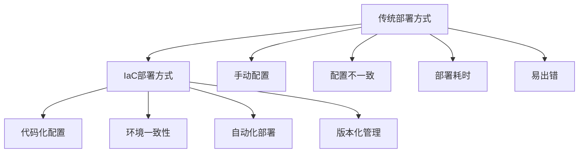

在现代微服务架构中，基础设施即代码（Infrastructure as Code, IaC）已成为实现高效、可靠运维的关键实践。通过将日志与监控系统的配置和部署代码化，可以实现配置的版本化管理、环境一致性保证以及自动化部署。本章将深入探讨如何使用基础设施即代码实践来管理日志与监控系统，提升运维效率和系统可靠性。

## 基础设施即代码概述

### IaC的核心概念

基础设施即代码是一种将基础设施配置和管理代码化的实践，通过代码来定义、部署和管理基础设施资源。在日志与监控领域，IaC可以帮助我们实现：

```yaml
# IaC核心概念
iac_concepts:
  declarative_configuration:
    description: "声明式配置"
    benefits:
      - 配置即代码，版本化管理
      - 环境一致性保证
      - 可重复部署
      - 自动化验证
    
  infrastructure_versioning:
    description: "基础设施版本化"
    benefits:
      - 配置变更历史追踪
      - 回滚能力
      - 协作开发支持
      - 审计合规性
    
  automated_deployment:
    description: "自动化部署"
    benefits:
      - 减少人为错误
      - 提高部署效率
      - 标准化流程
      - 快速环境搭建
```

### 日志与监控IaC的价值



## Terraform在日志监控中的应用

### Terraform核心概念

Terraform是HashiCorp开发的基础设施即代码工具，通过声明式配置来管理基础设施资源。在日志与监控场景中，Terraform可以帮助我们：

```hcl
# Terraform核心概念示例
terraform {
  required_providers {
    aws = {
      source  = "hashicorp/aws"
      version = "~> 4.0"
    }
    kubernetes = {
      source  = "hashicorp/kubernetes"
      version = "~> 2.0"
    }
  }
}

# 变量定义
variable "region" {
  description = "AWS region"
  type        = string
  default     = "us-west-2"
}

variable "environment" {
  description = "Environment name"
  type        = string
  default     = "production"
}

# 输出定义
output "elasticsearch_endpoint" {
  value = aws_elasticsearch_domain.logging.endpoint
}

output "prometheus_server_url" {
  value = kubernetes_service.prometheus.status[0].load_balancer[0].ingress[0].hostname
}
```

### 日志系统Terraform配置

```hcl
# Elasticsearch日志系统配置
resource "aws_elasticsearch_domain" "logging" {
  domain_name           = "microservices-logging-${var.environment}"
  elasticsearch_version = "7.10"
  
  cluster_config {
    instance_type = "t3.small.elasticsearch"
    instance_count = var.environment == "production" ? 3 : 1
    zone_awareness_enabled = var.environment == "production"
    
    zone_awareness_config {
      availability_zone_count = 2
    }
  }
  
  ebs_options {
    ebs_enabled = true
    volume_size = var.environment == "production" ? 100 : 20
    volume_type = "gp2"
  }
  
  encrypt_at_rest {
    enabled    = true
    kms_key_id = aws_kms_key.logging.id
  }
  
  node_to_node_encryption {
    enabled = true
  }
  
  domain_endpoint_options {
    enforce_https       = true
    tls_security_policy = "Policy-Min-TLS-1-2-2019-07"
  }
  
  tags = {
    Environment = var.environment
    Service     = "logging"
  }
}

# Kibana配置
resource "aws_elasticsearch_domain_policy" "logging" {
  domain_name = aws_elasticsearch_domain.logging.domain_name
  
  access_policies = jsonencode({
    Version = "2012-10-17"
    Statement = [
      {
        Effect = "Allow"
        Principal = {
          AWS = "*"
        }
        Action = [
          "es:*"
        ]
        Resource = "${aws_elasticsearch_domain.logging.arn}/*"
        Condition = {
          IpAddress = {
            "aws:SourceIp" = var.allowed_ips
          }
        }
      }
    ]
  })
}
```

### 监控系统Terraform配置

```hcl
# Prometheus监控系统配置
resource "kubernetes_deployment" "prometheus" {
  metadata {
    name      = "prometheus"
    namespace = "monitoring"
    labels = {
      app = "prometheus"
    }
  }
  
  spec {
    replicas = var.environment == "production" ? 2 : 1
    
    selector {
      match_labels = {
        app = "prometheus"
      }
    }
    
    template {
      metadata {
        labels = {
          app = "prometheus"
        }
      }
      
      spec {
        service_account_name = "prometheus"
        
        container {
          image = "prom/prometheus:v2.37.0"
          name  = "prometheus"
          
          args = [
            "--config.file=/etc/prometheus/prometheus.yml",
            "--storage.tsdb.path=/prometheus",
            "--web.console.libraries=/etc/prometheus/console_libraries",
            "--web.console.templates=/etc/prometheus/consoles",
            "--storage.tsdb.retention.time=30d",
            "--web.enable-lifecycle"
          ]
          
          port {
            container_port = 9090
          }
          
          resources {
            limits = {
              cpu    = "1"
              memory = "2Gi"
            }
            requests = {
              cpu    = "500m"
              memory = "1Gi"
            }
          }
          
          volume_mount {
            name       = "prometheus-config"
            mount_path = "/etc/prometheus"
          }
          
          volume_mount {
            name       = "prometheus-storage"
            mount_path = "/prometheus"
          }
        }
        
        volume {
          name = "prometheus-config"
          config_map {
            name = "prometheus-config"
          }
        }
        
        volume {
          name = "prometheus-storage"
          persistent_volume_claim {
            claim_name = "prometheus-pvc"
          }
        }
      }
    }
  }
}

# Grafana配置
resource "kubernetes_deployment" "grafana" {
  metadata {
    name      = "grafana"
    namespace = "monitoring"
    labels = {
      app = "grafana"
    }
  }
  
  spec {
    replicas = 1
    
    selector {
      match_labels = {
        app = "grafana"
      }
    }
    
    template {
      metadata {
        labels = {
          app = "grafana"
        }
      }
      
      spec {
        container {
          image = "grafana/grafana:9.1.0"
          name  = "grafana"
          
          env {
            name  = "GF_SECURITY_ADMIN_PASSWORD"
            value = var.grafana_admin_password
          }
          
          port {
            container_port = 3000
          }
          
          resources {
            limits = {
              cpu    = "500m"
              memory = "1Gi"
            }
            requests = {
              cpu    = "250m"
              memory = "512Mi"
            }
          }
          
          volume_mount {
            name       = "grafana-storage"
            mount_path = "/var/lib/grafana"
          }
        }
        
        volume {
          name = "grafana-storage"
          persistent_volume_claim {
            claim_name = "grafana-pvc"
          }
        }
      }
    }
  }
}
```

## 模块化设计与复用

### 日志系统模块

```hcl
# 日志系统模块定义
# modules/logging/elasticsearch/main.tf
variable "domain_name" {
  description = "Elasticsearch domain name"
  type        = string
}

variable "instance_type" {
  description = "Elasticsearch instance type"
  type        = string
  default     = "t3.small.elasticsearch"
}

variable "instance_count" {
  description = "Number of Elasticsearch instances"
  type        = number
  default     = 1
}

variable "volume_size" {
  description = "EBS volume size in GB"
  type        = number
  default     = 20
}

resource "aws_elasticsearch_domain" "this" {
  domain_name           = var.domain_name
  elasticsearch_version = "7.10"
  
  cluster_config {
    instance_type          = var.instance_type
    instance_count         = var.instance_count
    zone_awareness_enabled = var.instance_count > 1
  }
  
  ebs_options {
    ebs_enabled = true
    volume_size = var.volume_size
    volume_type = "gp2"
  }
  
  encrypt_at_rest {
    enabled = true
  }
  
  node_to_node_encryption {
    enabled = true
  }
  
  domain_endpoint_options {
    enforce_https       = true
    tls_security_policy = "Policy-Min-TLS-1-2-2019-07"
  }
}

output "endpoint" {
  value = aws_elasticsearch_domain.this.endpoint
}

output "arn" {
  value = aws_elasticsearch_domain.this.arn
}
```

### 监控系统模块

```hcl
# 监控系统模块定义
# modules/monitoring/prometheus/main.tf
variable "namespace" {
  description = "Kubernetes namespace"
  type        = string
  default     = "monitoring"
}

variable "replicas" {
  description = "Number of Prometheus replicas"
  type        = number
  default     = 1
}

variable "storage_size" {
  description = "Storage size for Prometheus"
  type        = string
  default     = "50Gi"
}

resource "kubernetes_namespace" "monitoring" {
  metadata {
    name = var.namespace
  }
}

resource "kubernetes_persistent_volume_claim" "prometheus" {
  metadata {
    name      = "prometheus-pvc"
    namespace = var.namespace
  }
  
  spec {
    access_modes = ["ReadWriteOnce"]
    resources {
      requests = {
        storage = var.storage_size
      }
    }
  }
}

resource "kubernetes_deployment" "prometheus" {
  metadata {
    name      = "prometheus"
    namespace = var.namespace
    labels = {
      app = "prometheus"
    }
  }
  
  spec {
    replicas = var.replicas
    
    selector {
      match_labels = {
        app = "prometheus"
      }
    }
    
    template {
      metadata {
        labels = {
          app = "prometheus"
        }
      }
      
      spec {
        container {
          image = "prom/prometheus:v2.37.0"
          name  = "prometheus"
          
          port {
            container_port = 9090
          }
          
          resources {
            limits = {
              cpu    = "1"
              memory = "2Gi"
            }
            requests = {
              cpu    = "500m"
              memory = "1Gi"
            }
          }
          
          volume_mount {
            name       = "prometheus-storage"
            mount_path = "/prometheus"
          }
        }
        
        volume {
          name = "prometheus-storage"
          persistent_volume_claim {
            claim_name = "prometheus-pvc"
          }
        }
      }
    }
  }
}

output "service_url" {
  value = kubernetes_service.prometheus.status[0].load_balancer[0].ingress[0].hostname
}
```

## 配置管理与版本控制

### GitOps实践

```yaml
# GitOps工作流
gitops_workflow:
  repository_structure:
    description: "代码仓库结构"
    structure:
      - terraform/
        - environments/
          - dev/
          - staging/
          - prod/
        - modules/
          - logging/
          - monitoring/
        - scripts/
        - README.md
      
  branching_strategy:
    description: "分支策略"
    strategy:
      - main: 生产环境配置
      - staging: 预发布环境配置
      - feature branches: 新功能开发
      
  ci_cd_pipeline:
    description: "CI/CD流水线"
    pipeline:
      - 代码提交到feature branch
      - Pull Request审查
      - 自动化测试
      - 合并到主分支
      - 自动部署到对应环境
```

### 配置差异化管理

```hcl
# 环境差异化配置
# terraform/environments/prod/variables.tf
variable "elasticsearch_instance_count" {
  description = "Number of Elasticsearch instances in production"
  type        = number
  default     = 3
}

variable "prometheus_replicas" {
  description = "Number of Prometheus replicas in production"
  type        = number
  default     = 2
}

variable "storage_size" {
  description = "Storage size for production"
  type        = string
  default     = "200Gi"
}

# terraform/environments/dev/variables.tf
variable "elasticsearch_instance_count" {
  description = "Number of Elasticsearch instances in development"
  type        = number
  default     = 1
}

variable "prometheus_replicas" {
  description = "Number of Prometheus replicas in development"
  type        = number
  default     = 1
}

variable "storage_size" {
  description = "Storage size for development"
  type        = string
  default     = "20Gi"
}
```

## 安全与合规性

### 访问控制配置

```hcl
# IAM角色和策略
resource "aws_iam_role" "logging_role" {
  name = "microservices-logging-role"
  
  assume_role_policy = jsonencode({
    Version = "2012-10-17"
    Statement = [
      {
        Action = "sts:AssumeRole"
        Effect = "Allow"
        Principal = {
          Service = "es.amazonaws.com"
        }
      }
    ]
  })
}

resource "aws_iam_role_policy" "logging_policy" {
  name = "microservices-logging-policy"
  role = aws_iam_role.logging_role.id
  
  policy = jsonencode({
    Version = "2012-10-17"
    Statement = [
      {
        Effect = "Allow"
        Action = [
          "logs:PutLogEvents",
          "logs:CreateLogStream",
          "logs:CreateLogGroup"
        ]
        Resource = "*"
      }
    ]
  })
}

# Kubernetes RBAC配置
resource "kubernetes_role" "monitoring_reader" {
  metadata {
    name      = "monitoring-reader"
    namespace = "monitoring"
  }
  
  rule {
    api_groups = [""]
    resources  = ["pods", "services", "endpoints"]
    verbs      = ["get", "list", "watch"]
  }
  
  rule {
    api_groups = ["extensions", "networking.k8s.io"]
    resources  = ["ingresses"]
    verbs      = ["get", "list", "watch"]
  }
}

resource "kubernetes_role_binding" "monitoring_reader" {
  metadata {
    name      = "monitoring-reader"
    namespace = "monitoring"
  }
  
  role_ref {
    api_group = "rbac.authorization.k8s.io"
    kind      = "Role"
    name      = kubernetes_role.monitoring_reader.metadata[0].name
  }
  
  subject {
    kind      = "User"
    name      = "monitoring-user"
    api_group = "rbac.authorization.k8s.io"
  }
}
```

### 加密与密钥管理

```hcl
# KMS密钥管理
resource "aws_kms_key" "logging" {
  description             = "KMS key for logging system"
  deletion_window_in_days = 10
  enable_key_rotation     = true
  
  tags = {
    Environment = var.environment
    Service     = "logging"
  }
}

resource "aws_kms_alias" "logging" {
  name          = "alias/logging-${var.environment}"
  target_key_id = aws_kms_key.logging.key_id
}

# Kubernetes Secret管理
resource "kubernetes_secret" "grafana_credentials" {
  metadata {
    name      = "grafana-credentials"
    namespace = "monitoring"
  }
  
  data = {
    admin-password = var.grafana_admin_password
    admin-user     = "admin"
  }
  
  type = "Opaque"
}
```

## 自动化测试与验证

### 配置验证脚本

```python
# 配置验证脚本
import boto3
import kubernetes
import requests
import time

class InfrastructureValidator:
    def __init__(self, environment):
        self.environment = environment
        self.es_client = boto3.client('es')
        self.k8s_client = kubernetes.client.CoreV1Api()
        
    def validate_elasticsearch(self, domain_name):
        """验证Elasticsearch配置"""
        try:
            response = self.es_client.describe_elasticsearch_domain(
                DomainName=domain_name
            )
            
            # 检查实例数量
            instance_count = response['DomainStatus']['ElasticsearchClusterConfig']['InstanceCount']
            expected_count = 3 if self.environment == 'production' else 1
            
            if instance_count != expected_count:
                return False, f"实例数量不匹配: 期望{expected_count}, 实际{instance_count}"
            
            # 检查加密状态
            encryption_enabled = response['DomainStatus']['EncryptionAtRestOptions']['Enabled']
            if not encryption_enabled:
                return False, "未启用静态加密"
            
            # 检查节点间加密
            node_encryption = response['DomainStatus']['NodeToNodeEncryptionOptions']['Enabled']
            if not node_encryption:
                return False, "未启用节点间加密"
            
            return True, "Elasticsearch配置验证通过"
        except Exception as e:
            return False, f"Elasticsearch验证失败: {str(e)}"
    
    def validate_prometheus(self, namespace="monitoring"):
        """验证Prometheus配置"""
        try:
            # 检查Prometheus Pod状态
            pods = self.k8s_client.list_namespaced_pod(
                namespace=namespace,
                label_selector="app=prometheus"
            )
            
            if not pods.items:
                return False, "未找到Prometheus Pod"
            
            for pod in pods.items:
                if pod.status.phase != 'Running':
                    return False, f"Prometheus Pod {pod.metadata.name} 状态异常: {pod.status.phase}"
            
            # 检查Prometheus服务
            service = self.k8s_client.read_namespaced_service(
                name="prometheus",
                namespace=namespace
            )
            
            if not service.spec.ports:
                return False, "Prometheus服务端口未配置"
            
            return True, "Prometheus配置验证通过"
        except Exception as e:
            return False, f"Prometheus验证失败: {str(e)}"
    
    def validate_grafana(self, namespace="monitoring"):
        """验证Grafana配置"""
        try:
            # 检查Grafana Pod状态
            pods = self.k8s_client.list_namespaced_pod(
                namespace=namespace,
                label_selector="app=grafana"
            )
            
            if not pods.items:
                return False, "未找到Grafana Pod"
            
            for pod in pods.items:
                if pod.status.phase != 'Running':
                    return False, f"Grafana Pod {pod.metadata.name} 状态异常: {pod.status.phase}"
            
            # 检查Grafana服务可访问性
            service = self.k8s_client.read_namespaced_service(
                name="grafana",
                namespace=namespace
            )
            
            if service.status.load_balancer.ingress:
                grafana_url = f"http://{service.status.load_balancer.ingress[0].hostname}"
                # 简单的HTTP可达性检查
                response = requests.get(grafana_url, timeout=10)
                if response.status_code != 200:
                    return False, f"Grafana服务返回状态码: {response.status_code}"
            
            return True, "Grafana配置验证通过"
        except Exception as e:
            return False, f"Grafana验证失败: {str(e)}"

# 使用示例
validator = InfrastructureValidator('production')
es_valid, es_msg = validator.validate_elasticsearch('microservices-logging-production')
prom_valid, prom_msg = validator.validate_prometheus()
grafana_valid, grafana_msg = validator.validate_grafana()

print(f"Elasticsearch: {es_msg}")
print(f"Prometheus: {prom_msg}")
print(f"Grafana: {grafana_msg}")
```

## 最佳实践总结

### 1. 模块化设计

```yaml
# 模块化设计最佳实践
modular_design_best_practices:
  module_structure:
    guidelines:
      - "按功能划分模块（日志、监控、追踪等）"
      - "保持模块的单一职责"
      - "提供合理的默认值"
      - "支持灵活的参数配置"
      
  module_reusability:
    guidelines:
      - "使用输入变量控制模块行为"
      - "提供清晰的输出变量"
      - "编写详细的文档"
      - "支持不同环境的配置"
```

### 2. 版本控制与协作

```yaml
# 版本控制最佳实践
version_control_best_practices:
  git_workflow:
    guidelines:
      - "使用Git进行配置版本管理"
      - "实施分支策略"
      - "编写清晰的提交信息"
      - "定期同步上游变更"
      
  collaboration:
    guidelines:
      - "实施代码审查机制"
      - "使用Pull Request流程"
      - "编写自动化测试"
      - "文档与代码同步更新"
```

### 3. 安全与合规

```yaml
# 安全最佳实践
security_best_practices:
  access_control:
    guidelines:
      - "最小权限原则"
      - "定期轮换密钥"
      - "审计日志记录"
      - "网络访问控制"
      
  encryption:
    guidelines:
      - "启用静态加密"
      - "启用传输加密"
      - "使用密钥管理系统"
      - "定期更新加密策略"
```

## 总结

基础设施即代码是现代微服务架构中管理日志与监控系统的重要实践。通过Terraform等工具，我们可以实现配置的代码化、版本化管理，确保环境一致性并提升部署效率。

关键要点包括：
1. **模块化设计**：通过模块化提高代码复用性和可维护性
2. **版本控制**：使用Git管理配置变更历史，支持协作开发
3. **安全合规**：实施访问控制、加密等安全措施
4. **自动化验证**：编写测试脚本验证配置正确性

通过遵循最佳实践，合理使用IaC工具，可以构建高效、可靠的日志与监控基础设施，为微服务系统的稳定运行提供坚实保障。

在下一节中，我们将探讨微服务监控的生命周期管理。