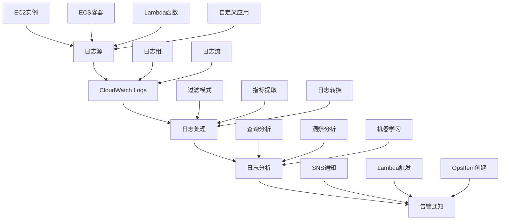

Amazon CloudWatch是AWS提供的监控和可观察性服务，为AWS资源和在AWS上运行的应用程序提供数据和可操作的洞察。在微服务架构中，CloudWatch可以帮助我们收集、监控和分析指标、日志和追踪数据，构建全面的云原生监控体系。本章将深入探讨如何在微服务环境中有效使用AWS CloudWatch进行监控。

## CloudWatch核心组件

### CloudWatch Metrics

CloudWatch Metrics是CloudWatch的核心组件之一，用于收集和跟踪指标数据：

```yaml
# CloudWatch Metrics特性
cloudwatch_metrics_features:
  data_collection:
    description: "数据收集"
    capabilities:
      - 自动收集AWS服务指标
      - 自定义指标收集
      - 高频指标支持（秒级）
      - 多维度指标
      
  visualization:
    description: "可视化"
    capabilities:
      - 实时图表展示
      - 自定义仪表板
      - 指标告警
      - 历史数据分析
      
  integration:
    description: "集成"
    capabilities:
      - 与AWS服务深度集成
      - SDK和API支持
      - 第三方工具集成
      - 自动化操作
```

### CloudWatch Logs

CloudWatch Logs用于监控、存储和访问日志文件：



### CloudWatch Alarms

CloudWatch Alarms用于监控指标并在满足条件时发送通知：

```json
{
  "alarm_configuration": {
    "alarm_name": "HighCPUUtilization",
    "alarm_description": "Alarm when CPU exceeds 70%",
    "metric_name": "CPUUtilization",
    "namespace": "AWS/EC2",
    "statistic": "Average",
    "period": 300,
    "evaluation_periods": 2,
    "threshold": 70.0,
    "comparison_operator": "GreaterThanThreshold",
    "alarm_actions": [
      "arn:aws:sns:us-west-2:123456789012:alert-topic"
    ],
    "ok_actions": [
      "arn:aws:sns:us-west-2:123456789012:ok-topic"
    ],
    "insufficient_data_actions": [
      "arn:aws:sns:us-west-2:123456789012:insufficient-data-topic"
    ]
  }
}
```

## 微服务监控架构设计

### 基于CloudWatch的监控架构

```yaml
# CloudWatch微服务监控架构
cloudwatch_microservices_architecture:
  data_layer:
    description: "数据层"
    components:
      - CloudWatch Agent: 收集系统和应用指标
      - Fluent Bit: 收集和转发日志
      - X-Ray SDK: 收集追踪数据
      - Custom Metrics: 应用自定义指标
      
  collection_layer:
    description: "收集层"
    components:
      - EC2 Integration: EC2实例指标收集
      - Container Insights: 容器指标收集
      - Lambda Integration: Lambda函数监控
      - API Gateway Integration: API监控
      
  processing_layer:
    description: "处理层"
    components:
      - Metric Filters: 日志到指标转换
      - Anomaly Detection: 异常检测
      - Contributor Insights: 贡献者分析
      - Synthetics: 合成监控
      
  analysis_layer:
    description: "分析层"
    components:
      - CloudWatch Dashboards: 仪表板展示
      - CloudWatch Logs Insights: 日志分析
      - X-Ray Service Map: 服务地图
      - Application Insights: 应用洞察
      
  action_layer:
    description: "动作层"
    components:
      - SNS Notifications: 告警通知
      - Auto Scaling: 自动扩缩容
      - Lambda Functions: 自动化响应
      - Systems Manager: 自动化运维
```

### CloudWatch Agent配置

```json
{
  "agent": {
    "metrics_collection_interval": 60,
    "run_as_user": "cwagent"
  },
  "metrics": {
    "namespace": "MyMicroservice",
    "append_dimensions": {
      "InstanceId": "${aws:InstanceId}",
      "InstanceType": "${aws:InstanceType}",
      "AutoScalingGroupName": "${aws:AutoScalingGroupName}"
    },
    "aggregation_dimensions": [["InstanceId"], ["InstanceType"]],
    "metrics_collected": {
      "cpu": {
        "resources": ["*"],
        "measurement": [
          {"name": "cpu_usage_idle", "rename": "CPU_USAGE_IDLE", "unit": "Percent"},
          {"name": "cpu_usage_nice", "rename": "CPU_USAGE_NICE", "unit": "Percent"},
          {"name": "cpu_usage_guest", "rename": "CPU_USAGE_GUEST", "unit": "Percent"}
        ],
        "metrics_collection_interval": 60,
        "append_dimensions": {
          "ImageId": "${aws:ImageId}"
        }
      },
      "mem": {
        "measurement": [
          "mem_used_percent"
        ],
        "metrics_collection_interval": 60
      },
      "disk": {
        "resources": ["/"],
        "measurement": [
          "disk_free",
          "disk_total"
        ],
        "metrics_collection_interval": 60
      }
    }
  },
  "logs": {
    "logs_collected": {
      "files": {
        "collect_list": [
          {
            "file_path": "/var/log/myapp/*.log",
            "log_group_name": "myapp-logs",
            "log_stream_name": "{instance_id}",
            "timestamp_format": "%Y-%m-%d %H:%M:%S",
            "timezone": "UTC"
          }
        ]
      }
    },
    "log_stream_name": "default"
  }
}
```

## 自定义指标与日志集成

### 应用程序指标集成

```java
// Java应用集成CloudWatch指标
import software.amazon.awssdk.services.cloudwatch.CloudWatchClient;
import software.amazon.awssdk.services.cloudwatch.model.*;
import java.time.Instant;
import java.util.ArrayList;
import java.util.List;

public class CloudWatchMetricsService {
    private final CloudWatchClient cloudWatchClient;
    private final String namespace;
    
    public CloudWatchMetricsService(String namespace) {
        this.cloudWatchClient = CloudWatchClient.builder().build();
        this.namespace = namespace;
    }
    
    public void putMetricData(String metricName, double value, 
                            List<Dimension> dimensions) {
        MetricDatum datum = MetricDatum.builder()
                .metricName(metricName)
                .value(value)
                .unit(StandardUnit.COUNT)
                .timestamp(Instant.now())
                .dimensions(dimensions)
                .build();
        
        PutMetricDataRequest request = PutMetricDataRequest.builder()
                .namespace(namespace)
                .metricData(datum)
                .build();
        
        try {
            cloudWatchClient.putMetricData(request);
        } catch (CloudWatchException e) {
            System.err.println("CloudWatch error: " + e.getMessage());
        }
    }
    
    public void recordBusinessMetrics(String serviceName, String version) {
        // 记录业务指标
        List<Dimension> dimensions = new ArrayList<>();
        dimensions.add(Dimension.builder().name("Service").value(serviceName).build());
        dimensions.add(Dimension.builder().name("Version").value(version).build());
        
        // 订单创建计数
        putMetricData("OrderCreated", 1.0, dimensions);
        
        // 用户注册计数
        putMetricData("UserRegistered", 1.0, dimensions);
        
        // 支付成功计数
        putMetricData("PaymentSuccess", 1.0, dimensions);
    }
    
    public void recordPerformanceMetrics(String serviceName, String endpoint, 
                                       double responseTime, boolean success) {
        List<Dimension> dimensions = new ArrayList<>();
        dimensions.add(Dimension.builder().name("Service").value(serviceName).build());
        dimensions.add(Dimension.builder().name("Endpoint").value(endpoint).build());
        
        // 响应时间指标
        putMetricData("ResponseTime", responseTime, dimensions);
        
        // 成功率指标
        putMetricData("SuccessRate", success ? 1.0 : 0.0, dimensions);
    }
}
```

### 结构化日志集成

```python
# Python应用集成CloudWatch Logs
import boto3
import json
import logging
from datetime import datetime

class CloudWatchLogger:
    def __init__(self, log_group, log_stream):
        self.log_group = log_group
        self.log_stream = log_stream
        self.client = boto3.client('logs')
        self.sequence_token = None
        self._ensure_log_group_and_stream()
    
    def _ensure_log_group_and_stream(self):
        """确保日志组和日志流存在"""
        try:
            self.client.create_log_group(logGroupName=self.log_group)
        except self.client.exceptions.ResourceAlreadyExistsException:
            pass
        
        try:
            self.client.create_log_stream(
                logGroupName=self.log_group,
                logStreamName=self.log_stream
            )
        except self.client.exceptions.ResourceAlreadyExistsException:
            pass
    
    def log(self, level, message, **kwargs):
        """记录结构化日志"""
        log_entry = {
            "timestamp": datetime.utcnow().isoformat(),
            "level": level,
            "message": message,
            "service": "user-service",
            "version": "1.0.0",
            **kwargs
        }
        
        self._put_log_event(json.dumps(log_entry))
    
    def info(self, message, **kwargs):
        self.log("INFO", message, **kwargs)
    
    def error(self, message, **kwargs):
        self.log("ERROR", message, **kwargs)
    
    def warn(self, message, **kwargs):
        self.log("WARN", message, **kwargs)
    
    def _put_log_event(self, message):
        """发送日志事件"""
        try:
            kwargs = {
                'logGroupName': self.log_group,
                'logStreamName': self.log_stream,
                'logEvents': [
                    {
                        'timestamp': int(datetime.now().timestamp() * 1000),
                        'message': message
                    }
                ]
            }
            
            if self.sequence_token:
                kwargs['sequenceToken'] = self.sequence_token
            
            response = self.client.put_log_events(**kwargs)
            self.sequence_token = response.get('nextSequenceToken')
            
        except Exception as e:
            print(f"Failed to send log to CloudWatch: {e}")

# 使用示例
logger = CloudWatchLogger('/aws/microservices/user-service', 'application-logs')

# 记录业务日志
logger.info("User login successful", user_id="user123", ip_address="192.168.1.1")

# 记录错误日志
logger.error("Database connection failed", error_code=500, retry_count=3)
```

## 告警策略与自动化响应

### 智能告警配置

```json
{
  "alarm_templates": {
    "high_error_rate": {
      "alarm_name": "HighErrorRate-{service}",
      "alarm_description": "High error rate for {service}",
      "metric_name": "ErrorRate",
      "namespace": "Microservices/{service}",
      "statistic": "Average",
      "period": 300,
      "evaluation_periods": 2,
      "threshold": 5.0,
      "comparison_operator": "GreaterThanThreshold",
      "treat_missing_data": "breaching",
      "alarm_actions": [
        "arn:aws:sns:{region}:{account}:high-error-alerts"
      ]
    },
    "high_latency": {
      "alarm_name": "HighLatency-{service}",
      "alarm_description": "High latency for {service}",
      "metric_name": "ResponseTime",
      "namespace": "Microservices/{service}",
      "statistic": "p95",
      "period": 300,
      "evaluation_periods": 3,
      "threshold": 2000.0,
      "comparison_operator": "GreaterThanThreshold",
      "alarm_actions": [
        "arn:aws:sns:{region}:{account}:high-latency-alerts"
      ]
    },
    "low_availability": {
      "alarm_name": "LowAvailability-{service}",
      "alarm_description": "Low availability for {service}",
      "metric_name": "Availability",
      "namespace": "Microservices/{service}",
      "statistic": "Average",
      "period": 300,
      "evaluation_periods": 2,
      "threshold": 95.0,
      "comparison_operator": "LessThanThreshold",
      "alarm_actions": [
        "arn:aws:sns:{region}:{account}:low-availability-alerts"
      ]
    }
  }
}
```

### 自动化响应机制

```python
# CloudWatch告警自动化响应
import boto3
import json

class CloudWatchAutoResponder:
    def __init__(self):
        self.ec2 = boto3.client('ec2')
        self.autoscaling = boto3.client('autoscaling')
        self.sns = boto3.client('sns')
        self.lambda_client = boto3.client('lambda')
    
    def handle_alarm_notification(self, event):
        """处理告警通知"""
        message = json.loads(event['Records'][0]['Sns']['Message'])
        
        alarm_name = message.get('AlarmName')
        new_state = message.get('NewStateValue')
        reason = message.get('NewStateReason')
        
        print(f"Alarm {alarm_name} changed to {new_state}: {reason}")
        
        # 根据告警类型执行相应操作
        if 'HighCPU' in alarm_name:
            self.handle_high_cpu_alarm(message)
        elif 'HighErrorRate' in alarm_name:
            self.handle_high_error_rate_alarm(message)
        elif 'LowAvailability' in alarm_name:
            self.handle_low_availability_alarm(message)
    
    def handle_high_cpu_alarm(self, alarm_message):
        """处理高CPU告警"""
        # 自动扩容EC2实例
        asg_name = self._extract_asg_name(alarm_message)
        if asg_name:
            try:
                response = self.autoscaling.describe_auto_scaling_groups(
                    AutoScalingGroupNames=[asg_name]
                )
                
                current_capacity = response['AutoScalingGroups'][0]['DesiredCapacity']
                new_capacity = min(current_capacity + 1, 10)  # 最多扩容到10个实例
                
                self.autoscaling.set_desired_capacity(
                    AutoScalingGroupName=asg_name,
                    DesiredCapacity=new_capacity,
                    HonorCooldown=False
                )
                
                print(f"Scaled up ASG {asg_name} from {current_capacity} to {new_capacity}")
                
                # 发送通知
                self._send_notification(
                    f"Auto-scaled up {asg_name} to {new_capacity} instances due to high CPU"
                )
            except Exception as e:
                print(f"Failed to scale up: {e}")
    
    def handle_high_error_rate_alarm(self, alarm_message):
        """处理高错误率告警"""
        # 启动故障排查Lambda函数
        try:
            self.lambda_client.invoke(
                FunctionName='error-rate-analyzer',
                InvocationType='Event',
                Payload=json.dumps(alarm_message)
            )
            
            print("Triggered error rate analysis Lambda function")
            
            # 发送通知
            self._send_notification(
                "High error rate detected, triggered automated analysis"
            )
        except Exception as e:
            print(f"Failed to trigger error analysis: {e}")
    
    def handle_low_availability_alarm(self, alarm_message):
        """处理低可用性告警"""
        # 启动健康检查和恢复流程
        try:
            self.lambda_client.invoke(
                FunctionName='availability-recovery',
                InvocationType='Event',
                Payload=json.dumps(alarm_message)
            )
            
            print("Triggered availability recovery Lambda function")
            
            # 发送通知
            self._send_notification(
                "Low availability detected, triggered automated recovery"
            )
        except Exception as e:
            print(f"Failed to trigger availability recovery: {e}")
    
    def _extract_asg_name(self, alarm_message):
        """从告警消息中提取自动伸缩组名称"""
        # 实现提取逻辑
        dimensions = alarm_message.get('Trigger', {}).get('Dimensions', [])
        for dim in dimensions:
            if dim.get('name') == 'AutoScalingGroupName':
                return dim.get('value')
        return None
    
    def _send_notification(self, message):
        """发送通知"""
        try:
            self.sns.publish(
                TopicArn='arn:aws:sns:us-west-2:123456789012:ops-notifications',
                Message=message,
                Subject='CloudWatch Auto Response'
            )
        except Exception as e:
            print(f"Failed to send notification: {e}")

# Lambda函数入口点
def lambda_handler(event, context):
    responder = CloudWatchAutoResponder()
    responder.handle_alarm_notification(event)
    return {'statusCode': 200}
```

## 日志分析与洞察

### CloudWatch Logs Insights查询

```sql
-- 分析错误日志模式
fields @timestamp, @message, @logStream
| filter @message like /ERROR/
| sort @timestamp desc
| limit 20

-- 统计每小时错误数量
fields @timestamp, @message
| filter @message like /ERROR/
| stats count(*) as errorCount by bin(1h)
| sort errorCount desc

-- 分析用户行为模式
fields @timestamp, userId, action
| filter action = "login" or action = "logout"
| stats count(*) as actionCount by action, bin(1d)
| sort @timestamp desc

-- 查找性能瓶颈
fields @timestamp, duration, endpoint
| filter duration > 1000
| sort duration desc
| limit 50

-- 分析服务依赖关系
fields @timestamp, service, dependency, status
| stats count(*) as callCount, avg(duration) as avgDuration 
  by service, dependency, status
| sort avgDuration desc
```

### 高级日志分析

```python
# CloudWatch Logs高级分析
import boto3
import pandas as pd
from datetime import datetime, timedelta

class CloudWatchLogAnalyzer:
    def __init__(self, log_group_name):
        self.log_group_name = log_group_name
        self.client = boto3.client('logs')
    
    def analyze_error_patterns(self, hours=24):
        """分析错误模式"""
        end_time = datetime.now()
        start_time = end_time - timedelta(hours=hours)
        
        query = """
        fields @timestamp, @message, service, error_code
        | filter @message like /ERROR/
        | stats count(*) as error_count by service, error_code, bin(1h)
        | sort error_count desc
        """
        
        response = self._execute_query(query, start_time, end_time)
        return self._process_query_results(response)
    
    def analyze_performance_trends(self, hours=24):
        """分析性能趋势"""
        end_time = datetime.now()
        start_time = end_time - timedelta(hours=hours)
        
        query = """
        fields @timestamp, service, duration, endpoint
        | filter duration > 0
        | stats avg(duration) as avg_duration, 
                percentile(duration, 95) as p95_duration,
                count(*) as request_count
          by service, bin(1h)
        | sort @timestamp desc
        """
        
        response = self._execute_query(query, start_time, end_time)
        return self._process_query_results(response)
    
    def detect_anomalies(self, metric_name, hours=24):
        """检测异常"""
        end_time = datetime.now()
        start_time = end_time - timedelta(hours=hours)
        
        query = f"""
        fields @timestamp, {metric_name}
        | stats avg({metric_name}) as avg_value, 
                stddev({metric_name}) as std_dev
          by bin(1h)
        | filter avg_value > (avg_value + 2 * std_dev) or 
                avg_value < (avg_value - 2 * std_dev)
        """
        
        response = self._execute_query(query, start_time, end_time)
        return self._process_query_results(response)
    
    def _execute_query(self, query, start_time, end_time):
        """执行Logs Insights查询"""
        try:
            start_query_response = self.client.start_query(
                logGroupName=self.log_group_name,
                startTime=int(start_time.timestamp()),
                endTime=int(end_time.timestamp()),
                queryString=query
            )
            
            query_id = start_query_response['queryId']
            
            # 轮询查询结果
            while True:
                response = self.client.get_query_results(queryId=query_id)
                if response['status'] == 'Complete':
                    return response
                elif response['status'] in ['Failed', 'Cancelled']:
                    raise Exception(f"Query failed with status: {response['status']}")
                
                time.sleep(1)
                
        except Exception as e:
            print(f"Query execution failed: {e}")
            return None
    
    def _process_query_results(self, response):
        """处理查询结果"""
        if not response or 'results' not in response:
            return []
        
        results = []
        for result_row in response['results']:
            row_data = {}
            for field in result_row:
                row_data[field['field']] = field['value']
            results.append(row_data)
        
        return results

# 使用示例
analyzer = CloudWatchLogAnalyzer('/aws/microservices/user-service')
error_patterns = analyzer.analyze_error_patterns(hours=24)
print("Error patterns:", error_patterns)

performance_trends = analyzer.analyze_performance_trends(hours=24)
print("Performance trends:", performance_trends)
```

## 成本优化与管理

### CloudWatch成本控制

```yaml
# CloudWatch成本控制策略
cloudwatch_cost_optimization:
  metrics_optimization:
    description: "指标优化"
    strategies:
      - "减少不必要的自定义指标"
      - "合理设置指标保留期"
      - "使用聚合指标替代详细指标"
      - "定期清理未使用的指标"
      
  logs_optimization:
    description: "日志优化"
    strategies:
      - "设置合理的日志保留期"
      - "过滤掉低价值日志"
      - "压缩日志数据"
      - "使用日志采样"
      
  alarms_optimization:
    description: "告警优化"
    strategies:
      - "避免重复告警"
      - "合理设置告警频率"
      - "使用告警抑制"
      - "定期审查告警有效性"
      
  insights_optimization:
    description: "洞察优化"
    strategies:
      - "优化查询语句"
      - "限制查询时间范围"
      - "缓存常用查询结果"
      - "避免复杂聚合查询"
```

### 监控成本分析

```python
# CloudWatch成本分析工具
import boto3
import pandas as pd
from datetime import datetime, timedelta

class CloudWatchCostAnalyzer:
    def __init__(self):
        self.cloudwatch = boto3.client('cloudwatch')
        self.ce = boto3.client('ce')
    
    def analyze_metrics_cost(self, days=30):
        """分析指标成本"""
        end_date = datetime.now()
        start_date = end_date - timedelta(days=days)
        
        # 获取指标使用情况
        metrics_usage = self._get_metrics_usage(start_date, end_date)
        
        # 计算成本
        custom_metrics_cost = len(metrics_usage.get('custom_metrics', [])) * 0.10  # 每个自定义指标$0.10/月
        api_requests_cost = metrics_usage.get('api_requests', 0) * 0.01 / 1000  # 每1000个请求$0.01
        
        return {
            'custom_metrics_count': len(metrics_usage.get('custom_metrics', [])),
            'api_requests_count': metrics_usage.get('api_requests', 0),
            'estimated_monthly_cost': custom_metrics_cost + api_requests_cost,
            'cost_breakdown': {
                'custom_metrics': custom_metrics_cost,
                'api_requests': api_requests_cost
            }
        }
    
    def analyze_logs_cost(self, log_groups):
        """分析日志成本"""
        total_cost = 0
        log_group_costs = {}
        
        for log_group in log_groups:
            # 估算日志数据量和成本
            data_ingested_gb = self._estimate_log_data_ingestion(log_group)
            cost = data_ingested_gb * 0.50  # 每GB $0.50
            
            log_group_costs[log_group] = {
                'data_ingested_gb': data_ingested_gb,
                'estimated_cost': cost
            }
            total_cost += cost
        
        return {
            'total_cost': total_cost,
            'log_group_costs': log_group_costs
        }
    
    def _get_metrics_usage(self, start_date, end_date):
        """获取指标使用情况"""
        # 实现指标使用情况查询逻辑
        return {
            'custom_metrics': ['metric1', 'metric2'],  # 示例数据
            'api_requests': 100000  # 示例数据
        }
    
    def _estimate_log_data_ingestion(self, log_group):
        """估算日志数据摄入量"""
        # 实现日志数据量估算逻辑
        return 10.5  # 示例数据，单位GB

# 使用示例
cost_analyzer = CloudWatchCostAnalyzer()
metrics_cost = cost_analyzer.analyze_metrics_cost(days=30)
print("Metrics cost analysis:", metrics_cost)

logs_cost = cost_analyzer.analyze_logs_cost([
    '/aws/microservices/user-service',
    '/aws/microservices/order-service'
])
print("Logs cost analysis:", logs_cost)
```

## 最佳实践总结

### 1. 指标设计最佳实践

```yaml
# 指标设计最佳实践
metrics_design_best_practices:
  naming_conventions:
    guidelines:
      - "使用清晰、一致的命名规范"
      - "包含服务名称和指标类型"
      - "避免特殊字符和空格"
      - "使用驼峰命名或下划线分隔"
      
  dimension_design:
    guidelines:
      - "合理使用维度进行分类"
      - "避免过多维度导致高基数问题"
      - "保持维度值的稳定性"
      - "使用有意义的维度名称"
      
  data_collection:
    guidelines:
      - "只收集必要的指标"
      - "合理设置收集频率"
      - "确保指标数据的准确性"
      - "实施指标数据验证"
```

### 2. 告警配置最佳实践

```yaml
# 告警配置最佳实践
alerting_best_practices:
  alarm_design:
    guidelines:
      - "设置合理的阈值"
      - "避免告警风暴"
      - "实施告警分层"
      - "定期审查告警有效性"
      
  notification_strategy:
    guidelines:
      - "根据严重程度选择通知渠道"
      - "实施告警升级机制"
      - "避免通知疲劳"
      - "提供清晰的告警信息"
      
  automation:
    guidelines:
      - "对可自动处理的问题实施自动化"
      - "确保自动化操作的安全性"
      - "监控自动化执行效果"
      - "提供人工干预选项"
```

## 总结

AWS CloudWatch为微服务架构提供了全面的监控和可观察性解决方案。通过合理配置指标、日志和告警，我们可以构建高效的云原生监控体系。

关键要点包括：
1. **架构设计**：设计适应微服务特点的CloudWatch监控架构
2. **指标集成**：有效集成自定义业务和技术指标
3. **自动化响应**：实施智能告警和自动化响应机制
4. **成本控制**：优化资源配置，控制监控成本

通过遵循最佳实践，合理使用CloudWatch的各项功能，可以为微服务系统提供强大的可观察性支持，保障系统的稳定运行和持续优化。

在下一节中，我们将探讨Azure Monitor在微服务监控中的应用。