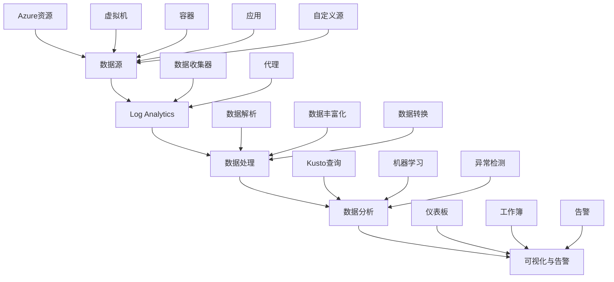

Azure Monitor是Microsoft Azure提供的全面监控解决方案，为Azure资源和混合环境中的应用提供可观察性。在微服务架构中，Azure Monitor通过Application Insights、Log Analytics和Metrics等组件，帮助我们收集、分析和可视化指标、日志和追踪数据，构建完整的云原生监控体系。本章将深入探讨如何在微服务环境中有效使用Azure Monitor进行监控。

## Azure Monitor核心组件

### Azure Monitor Metrics

Azure Monitor Metrics提供对Azure资源和应用指标的收集和可视化：

```yaml
# Azure Monitor Metrics特性
azure_monitor_metrics_features:
  data_sources:
    description: "数据源"
    sources:
      - Platform Metrics: Azure平台自动收集的指标
      - Application Metrics: 应用程序自定义指标
      - Guest OS Metrics: 虚拟机操作系统指标
      - Custom Metrics: 自定义指标
      
  visualization:
    description: "可视化"
    capabilities:
      - 实时图表和仪表板
      - 指标告警
      - Power BI集成
      - API访问
      
  integration:
    description: "集成"
    capabilities:
      - 与Azure服务深度集成
      - REST API支持
      - 第三方工具集成
      - 自动化操作
```

### Log Analytics

Log Analytics是Azure Monitor的日志分析服务，用于收集、查询和分析日志数据：



### Application Insights

Application Insights是Azure Monitor的应用程序性能管理服务：

```json
{
  "application_insights_features": {
    "availability_monitoring": {
      "description": "可用性监控",
      "capabilities": [
        "URL ping测试",
        "多位置测试",
        "自定义可用性测试",
        "SLA跟踪"
      ]
    },
    "performance_monitoring": {
      "description": "性能监控",
      "capabilities": [
        "请求速率监控",
        "响应时间分析",
        "依赖跟踪",
        "性能计数器"
      ]
    },
    "exception_monitoring": {
      "description": "异常监控",
      "capabilities": [
        "异常捕获",
        "堆栈跟踪",
        "异常趋势分析",
        "异常分组"
      ]
    },
    "distributed_tracing": {
      "description": "分布式追踪",
      "capabilities": [
        "请求追踪",
        "依赖调用链",
        "性能瓶颈识别",
        "服务地图"
      ]
    }
  }
}
```

## 微服务监控架构设计

### 基于Azure Monitor的监控架构

```yaml
# Azure Monitor微服务监控架构
azure_monitor_microservices_architecture:
  data_collection_layer:
    description: "数据收集层"
    components:
      - Application Insights SDK: 应用指标和追踪收集
      - Log Analytics Agent: 系统和应用日志收集
      - Azure Monitor Metrics: Azure资源指标收集
      - Custom Collectors: 自定义数据收集器
      
  data_processing_layer:
    description: "数据处理层"
    components:
      - Data Ingestion: 数据摄入
      - Data Transformation: 数据转换
      - Data Enrichment: 数据丰富化
      - Data Filtering: 数据过滤
      
  storage_layer:
    description: "存储层"
    components:
      - Metrics Database: 指标存储
      - Log Analytics Workspace: 日志存储
      - Application Insights: 应用数据存储
      - Blob Storage: 归档存储
      
  analysis_layer:
    description: "分析层"
    components:
      - Kusto Query Engine: 查询引擎
      - Analytics Services: 分析服务
      - ML Services: 机器学习服务
      - Visualization: 可视化服务
      
  action_layer:
    description: "动作层"
    components:
      - Alerting: 告警服务
      - Automation: 自动化服务
      - Notification: 通知服务
      - Integration: 集成服务
```

### Application Insights配置

```xml
<!-- Application Insights配置 -->
<ApplicationInsights>
  <InstrumentationKey>your-instrumentation-key</InstrumentationKey>
  <TelemetryChannel>
    <DeveloperMode>false</DeveloperMode>
  </TelemetryChannel>
  <TelemetryModules>
    <Add Type="Microsoft.ApplicationInsights.DependencyCollector.DependencyTrackingTelemetryModule, Microsoft.AI.DependencyCollector"/>
    <Add Type="Microsoft.ApplicationInsights.Extensibility.PerfCounterCollector.PerformanceCollectorModule, Microsoft.AI.PerfCounterCollector"/>
    <Add Type="Microsoft.ApplicationInsights.Extensibility.PerfCounterCollector.QuickPulse.QuickPulseTelemetryModule, Microsoft.AI.PerfCounterCollector"/>
  </TelemetryModules>
  <TelemetryProcessors>
    <Add Type="Microsoft.ApplicationInsights.Extensibility.PerfCounterCollector.QuickPulse.QuickPulseTelemetryProcessor, Microsoft.AI.PerfCounterCollector"/>
    <Add Type="Microsoft.ApplicationInsights.WindowsServer.TelemetryChannel.AdaptiveSamplingTelemetryProcessor, Microsoft.AI.ServerTelemetryChannel"/>
  </TelemetryProcessors>
  <TelemetryInitializers>
    <Add Type="Microsoft.ApplicationInsights.WindowsServer.AzureRoleEnvironmentTelemetryInitializer, Microsoft.AI.WindowsServer"/>
    <Add Type="Microsoft.ApplicationInsights.WindowsServer.BuildInfoConfigComponentVersionTelemetryInitializer, Microsoft.AI.WindowsServer"/>
  </TelemetryInitializers>
</ApplicationInsights>
```

## 自定义指标与日志集成

### 应用程序指标集成

```csharp
// C#应用集成Application Insights指标
using Microsoft.ApplicationInsights;
using Microsoft.ApplicationInsights.DataContracts;
using Microsoft.ApplicationInsights.Extensibility;
using System;
using System.Collections.Generic;

public class AzureMonitorMetricsService
{
    private readonly TelemetryClient telemetryClient;
    
    public AzureMonitorMetricsService(string instrumentationKey)
    {
        var config = TelemetryConfiguration.CreateDefault();
        config.InstrumentationKey = instrumentationKey;
        this.telemetryClient = new TelemetryClient(config);
    }
    
    public void RecordBusinessMetrics(string serviceName, string operation, 
                                    double value, Dictionary<string, string> properties = null)
    {
        var metricTelemetry = new MetricTelemetry
        {
            Name = $"{serviceName}.{operation}",
            Sum = value
        };
        
        // 添加自定义属性
        if (properties != null)
        {
            foreach (var prop in properties)
            {
                metricTelemetry.Properties[prop.Key] = prop.Value;
            }
        }
        
        telemetryClient.TrackMetric(metricTelemetry);
    }
    
    public void RecordRequest(string name, DateTimeOffset startTime, 
                            TimeSpan duration, string responseCode, bool success)
    {
        var requestTelemetry = new RequestTelemetry
        {
            Name = name,
            Timestamp = startTime,
            Duration = duration,
            ResponseCode = responseCode,
            Success = success
        };
        
        telemetryClient.TrackRequest(requestTelemetry);
    }
    
    public void RecordDependency(string dependencyTypeName, string target, 
                               string dependencyName, string data, DateTimeOffset startTime,
                               TimeSpan duration, string resultCode, bool success)
    {
        var dependencyTelemetry = new DependencyTelemetry
        {
            Type = dependencyTypeName,
            Target = target,
            Name = dependencyName,
            Data = data,
            Timestamp = startTime,
            Duration = duration,
            ResultCode = resultCode,
            Success = success
        };
        
        telemetryClient.TrackDependency(dependencyTelemetry);
    }
    
    public void RecordException(Exception exception, Dictionary<string, string> properties = null)
    {
        var exceptionTelemetry = new ExceptionTelemetry(exception);
        
        if (properties != null)
        {
            foreach (var prop in properties)
            {
                exceptionTelemetry.Properties[prop.Key] = prop.Value;
            }
        }
        
        telemetryClient.TrackException(exceptionTelemetry);
    }
    
    public void Flush()
    {
        telemetryClient.Flush();
    }
}
```

### 结构化日志集成

```csharp
// C#应用集成Azure Monitor日志
using Microsoft.Extensions.Logging;
using System;
using System.Collections.Generic;

public class AzureMonitorLogger : ILogger
{
    private readonly string categoryName;
    private readonly TelemetryClient telemetryClient;
    
    public AzureMonitorLogger(string categoryName, TelemetryClient telemetryClient)
    {
        this.categoryName = categoryName;
        this.telemetryClient = telemetryClient;
    }
    
    public IDisposable BeginScope<TState>(TState state)
    {
        return null;
    }
    
    public bool IsEnabled(LogLevel logLevel)
    {
        return true;
    }
    
    public void Log<TState>(LogLevel logLevel, EventId eventId, TState state, 
                          Exception exception, Func<TState, Exception, string> formatter)
    {
        if (!IsEnabled(logLevel))
        {
            return;
        }
        
        var message = formatter(state, exception);
        
        var traceTelemetry = new TraceTelemetry(message)
        {
            SeverityLevel = ConvertLogLevel(logLevel)
        };
        
        traceTelemetry.Properties["CategoryName"] = categoryName;
        traceTelemetry.Properties["EventId"] = eventId.Id.ToString();
        
        // 添加结构化属性
        if (state is IEnumerable<KeyValuePair<string, object>> properties)
        {
            foreach (var property in properties)
            {
                traceTelemetry.Properties[property.Key] = property.Value?.ToString();
            }
        }
        
        // 如果有异常，记录异常信息
        if (exception != null)
        {
            traceTelemetry.Properties["ExceptionType"] = exception.GetType().FullName;
            traceTelemetry.Properties["ExceptionMessage"] = exception.Message;
            traceTelemetry.Properties["StackTrace"] = exception.StackTrace;
        }
        
        telemetryClient.TrackTrace(traceTelemetry);
    }
    
    private SeverityLevel ConvertLogLevel(LogLevel logLevel)
    {
        return logLevel switch
        {
            LogLevel.Trace => SeverityLevel.Verbose,
            LogLevel.Debug => SeverityLevel.Verbose,
            LogLevel.Information => SeverityLevel.Information,
            LogLevel.Warning => SeverityLevel.Warning,
            LogLevel.Error => SeverityLevel.Error,
            LogLevel.Critical => SeverityLevel.Critical,
            _ => SeverityLevel.Information
        };
    }
}
```

## 告警策略与自动化响应

### 智能告警配置

```json
{
  "alert_rules": {
    "metric_alerts": {
      "high_cpu_utilization": {
        "name": "High CPU Utilization",
        "description": "Alert when CPU utilization exceeds threshold",
        "severity": 3,
        "enabled": true,
        "scopes": [
          "/subscriptions/{subscription-id}/resourceGroups/{resource-group}/providers/Microsoft.Compute/virtualMachines/{vm-name}"
        ],
        "evaluationFrequency": "PT1M",
        "windowSize": "PT5M",
        "criteria": {
          "allOf": [
            {
              "threshold": 80,
              "name": "Metric1",
              "metricNamespace": "Microsoft.Compute/virtualMachines",
              "metricName": "Percentage CPU",
              "operator": "GreaterThan",
              "timeAggregation": "Average",
              "criterionType": "StaticThresholdCriterion"
            }
          ]
        },
        "autoMitigate": true,
        "actions": [
          {
            "actionGroupId": "/subscriptions/{subscription-id}/resourceGroups/{resource-group}/providers/microsoft.insights/actionGroups/{action-group}"
          }
        ]
      }
    },
    "log_alerts": {
      "high_error_rate": {
        "name": "High Error Rate",
        "description": "Alert when error rate exceeds threshold",
        "severity": 2,
        "enabled": true,
        "scopes": [
          "/subscriptions/{subscription-id}/resourceGroups/{resource-group}/providers/Microsoft.OperationalInsights/workspaces/{workspace-name}"
        ],
        "evaluationFrequency": "PT5M",
        "windowSize": "PT10M",
        "criteria": {
          "allOf": [
            {
              "query": "AppRequests | where success == false | summarize error_rate = count() by bin(TimeGenerated, 1m) | summarize avg(error_rate)",
              "timeAggregation": "Average",
              "operator": "GreaterThan",
              "threshold": 100,
              "failingPeriods": {
                "numberOfEvaluationPeriods": 1,
                "minFailingPeriodsToAlert": 1
              }
            }
          ]
        },
        "autoMitigate": false,
        "actions": [
          {
            "actionGroupId": "/subscriptions/{subscription-id}/resourceGroups/{resource-group}/providers/microsoft.insights/actionGroups/{action-group}"
          }
        ]
      }
    }
  }
}
```

### 自动化响应机制

```csharp
// Azure Monitor告警自动化响应
using Microsoft.Azure.Functions.Worker;
using Microsoft.Azure.Functions.Worker.Http;
using Microsoft.Extensions.Logging;
using System.Threading.Tasks;
using System.Text.Json;

public class AzureMonitorAutoResponder
{
    private readonly ILogger<AzureMonitorAutoResponder> logger;
    
    public AzureMonitorAutoResponder(ILogger<AzureMonitorAutoResponder> logger)
    {
        this.logger = logger;
    }
    
    [Function("HandleAlert")]
    public async Task<HttpResponseData> HandleAlert(
        [HttpTrigger(AuthorizationLevel.Function, "post")] HttpRequestData req)
    {
        var requestBody = await new StreamReader(req.Body).ReadToEndAsync();
        var alertData = JsonSerializer.Deserialize<AlertData>(requestBody);
        
        logger.LogInformation($"Received alert: {alertData?.data?.essentials?.alertRule}");
        
        // 根据告警类型执行相应操作
        if (alertData?.data?.essentials?.alertRule?.Contains("HighCPU") == true)
        {
            await HandleHighCpuAlert(alertData);
        }
        else if (alertData?.data?.essentials?.alertRule?.Contains("HighErrorRate") == true)
        {
            await HandleHighErrorRateAlert(alertData);
        }
        else if (alertData?.data?.essentials?.alertRule?.Contains("LowAvailability") == true)
        {
            await HandleLowAvailabilityAlert(alertData);
        }
        
        var response = req.CreateResponse(System.Net.HttpStatusCode.OK);
        await response.WriteStringAsync("Alert processed successfully");
        return response;
    }
    
    private async Task HandleHighCpuAlert(AlertData alertData)
    {
        logger.LogInformation("Handling high CPU alert");
        
        // 自动扩容虚拟机规模集
        // 这里应该调用Azure Management API来调整VMSS实例数
        await ScaleUpVirtualMachineScaleSet(alertData);
        
        // 发送通知
        await SendNotification("High CPU alert triggered, scaled up VMSS instances");
    }
    
    private async Task HandleHighErrorRateAlert(AlertData alertData)
    {
        logger.LogInformation("Handling high error rate alert");
        
        // 启动故障排查流程
        await TriggerErrorAnalysis(alertData);
        
        // 发送通知
        await SendNotification("High error rate detected, triggered automated analysis");
    }
    
    private async Task HandleLowAvailabilityAlert(AlertData alertData)
    {
        logger.LogInformation("Handling low availability alert");
        
        // 启动恢复流程
        await TriggerRecoveryProcess(alertData);
        
        // 发送通知
        await SendNotification("Low availability detected, triggered automated recovery");
    }
    
    private async Task ScaleUpVirtualMachineScaleSet(AlertData alertData)
    {
        // 实现VMSS扩容逻辑
        // 使用Azure Management SDK调整实例数
        logger.LogInformation("Scaling up VMSS instances");
        await Task.Delay(1000); // 模拟操作
    }
    
    private async Task TriggerErrorAnalysis(AlertData alertData)
    {
        // 实现错误分析触发逻辑
        logger.LogInformation("Triggering error analysis");
        await Task.Delay(1000); // 模拟操作
    }
    
    private async Task TriggerRecoveryProcess(AlertData alertData)
    {
        // 实现恢复流程触发逻辑
        logger.LogInformation("Triggering recovery process");
        await Task.Delay(1000); // 模拟操作
    }
    
    private async Task SendNotification(string message)
    {
        // 实现通知发送逻辑
        logger.LogInformation($"Sending notification: {message}");
        await Task.Delay(100); // 模拟操作
    }
}

// 告警数据模型
public class AlertData
{
    public AlertDataContext data { get; set; }
    public string schemaId { get; set; }
}

public class AlertDataContext
{
    public AlertDataEssentials essentials { get; set; }
    public AlertDataProperties alertContext { get; set; }
}

public class AlertDataEssentials
{
    public string alertId { get; set; }
    public string alertRule { get; set; }
    public string severity { get; set; }
    public string signalType { get; set; }
    public string monitorCondition { get; set; }
    public string monitoringService { get; set; }
    public List<string> alertTargetIDs { get; set; }
    public string originAlertId { get; set; }
    public DateTime firedDateTime { get; set; }
    public DateTime resolvedDateTime { get; set; }
    public string description { get; set; }
    public string essentialsVersion { get; set; }
    public string alertContextVersion { get; set; }
}

public class AlertDataProperties
{
    // 根据具体的告警类型定义属性
}
```

## 日志分析与洞察

### Kusto查询语言(KQL)示例

```kusto
// 分析错误日志模式
AppExceptions
| where timestamp > ago(24h)
| summarize errorCount = count() by exceptionType, innermostMessage, bin(timestamp, 1h)
| order by errorCount desc
| limit 20

// 统计每小时请求量和错误率
AppRequests
| where timestamp > ago(24h)
| summarize 
    requestCount = count(),
    errorCount = countif(success == false)
    by bin(timestamp, 1h)
| extend errorRate = todouble(errorCount) / requestCount * 100
| project timestamp, requestCount, errorCount, errorRate
| order by timestamp asc

// 分析用户行为模式
customEvents
| where timestamp > ago(7d)
| where name == "UserAction"
| summarize actionCount = count() by tostring(customDimensions.action), bin(timestamp, 1d)
| order by timestamp asc

// 查找性能瓶颈
AppDependencies
| where timestamp > ago(1h)
| where duration > 1000
| summarize avgDuration = avg(duration), count() by target, name
| order by avgDuration desc
| limit 50

// 分析服务依赖关系
AppDependencies
| where timestamp > ago(1h)
| summarize 
    callCount = count(),
    avgDuration = avg(duration),
    successRate = countif(success == true) * 100.0 / count()
    by source, target, name
| order by avgDuration desc
```

### 高级日志分析

```csharp
// Azure Monitor日志高级分析
using Microsoft.Azure.Management.Monitor;
using Microsoft.Azure.Management.Monitor.Models;
using Microsoft.Rest.Azure.Authentication;
using System;
using System.Threading.Tasks;

public class AzureMonitorLogAnalyzer
{
    private readonly MonitorManagementClient monitorClient;
    
    public AzureMonitorLogAnalyzer(string tenantId, string clientId, 
                                 string clientSecret, string subscriptionId)
    {
        var credentials = ApplicationTokenProvider.LoginSilentAsync(
            tenantId, clientId, clientSecret).Result;
        this.monitorClient = new MonitorManagementClient(credentials)
        {
            SubscriptionId = subscriptionId
        };
    }
    
    public async Task<AnalysisResult> AnalyzeErrorPatternsAsync(string resourceGroupName, 
                                                              string workspaceName, 
                                                              int hours = 24)
    {
        var query = @"
AppExceptions
| where timestamp > ago({hours}h)
| summarize errorCount = count() by exceptionType, innermostMessage, bin(timestamp, 1h)
| order by errorCount desc
| limit 20";
        
        var parameters = new QueryBody(query.Replace("{hours}", hours.ToString()));
        
        try
        {
            var result = await monitorClient.Query.ExecuteAsync(resourceGroupName, 
                                                              workspaceName, 
                                                              parameters);
            
            return new AnalysisResult
            {
                Query = query,
                Results = result,
                AnalysisTime = DateTime.UtcNow
            };
        }
        catch (Exception ex)
        {
            return new AnalysisResult
            {
                Error = ex.Message,
                AnalysisTime = DateTime.UtcNow
            };
        }
    }
    
    public async Task<AnalysisResult> AnalyzePerformanceTrendsAsync(string resourceGroupName, 
                                                                   string workspaceName, 
                                                                   int hours = 24)
    {
        var query = @"
AppRequests
| where timestamp > ago({hours}h)
| summarize 
    avgDuration = avg(duration),
    percentile95 = percentile(duration, 95),
    requestCount = count()
    by bin(timestamp, 1h)
| order by timestamp asc";
        
        var parameters = new QueryBody(query.Replace("{hours}", hours.ToString()));
        
        try
        {
            var result = await monitorClient.Query.ExecuteAsync(resourceGroupName, 
                                                              workspaceName, 
                                                              parameters);
            
            return new AnalysisResult
            {
                Query = query,
                Results = result,
                AnalysisTime = DateTime.UtcNow
            };
        }
        catch (Exception ex)
        {
            return new AnalysisResult
            {
                Error = ex.Message,
                AnalysisTime = DateTime.UtcNow
            };
        }
    }
    
    public async Task<DetectionResult> DetectAnomaliesAsync(string resourceGroupName, 
                                                           string workspaceName, 
                                                           string metricName, 
                                                           int hours = 24)
    {
        var query = $@"
AppRequests
| where timestamp > ago({hours}h)
| summarize avgValue = avg({metricName}) by bin(timestamp, 1h)
| extend upperBound = avgValue + 2 * stdevp(avgValue)
| extend lowerBound = avgValue - 2 * stdevp(avgValue)
| where {metricName} > upperBound or {metricName} < lowerBound";
        
        var parameters = new QueryBody(query);
        
        try
        {
            var result = await monitorClient.Query.ExecuteAsync(resourceGroupName, 
                                                              workspaceName, 
                                                              parameters);
            
            return new DetectionResult
            {
                Query = query,
                Anomalies = result,
                DetectionTime = DateTime.UtcNow
            };
        }
        catch (Exception ex)
        {
            return new DetectionResult
            {
                Error = ex.Message,
                DetectionTime = DateTime.UtcNow
            };
        }
    }
}

// 分析结果模型
public class AnalysisResult
{
    public string Query { get; set; }
    public object Results { get; set; }
    public string Error { get; set; }
    public DateTime AnalysisTime { get; set; }
}

public class DetectionResult
{
    public string Query { get; set; }
    public object Anomalies { get; set; }
    public string Error { get; set; }
    public DateTime DetectionTime { get; set; }
}
```

## 成本优化与管理

### Azure Monitor成本控制

```yaml
# Azure Monitor成本控制策略
azure_monitor_cost_optimization:
  metrics_optimization:
    description: "指标优化"
    strategies:
      - "减少不必要的自定义指标"
      - "合理设置指标保留期"
      - "使用聚合指标替代详细指标"
      - "定期清理未使用的指标"
      
  logs_optimization:
    description: "日志优化"
    strategies:
      - "设置合理的日志保留期"
      - "过滤掉低价值日志"
      - "压缩日志数据"
      - "使用日志采样"
      
  data_collection_optimization:
    description: "数据收集优化"
    strategies:
      - "调整采样率"
      - "限制收集的数据量"
      - "优化代理配置"
      - "使用智能采样"
      
  query_optimization:
    description: "查询优化"
    strategies:
      - "优化KQL查询"
      - "限制查询时间范围"
      - "缓存常用查询结果"
      - "避免复杂聚合查询"
```

### 监控成本分析

```csharp
// Azure Monitor成本分析工具
using Microsoft.Azure.Management.Consumption;
using Microsoft.Azure.Management.Consumption.Models;
using Microsoft.Rest.Azure.Authentication;
using System;
using System.Threading.Tasks;

public class AzureMonitorCostAnalyzer
{
    private readonly ConsumptionManagementClient consumptionClient;
    
    public AzureMonitorCostAnalyzer(string tenantId, string clientId, 
                                  string clientSecret, string subscriptionId)
    {
        var credentials = ApplicationTokenProvider.LoginSilentAsync(
            tenantId, clientId, clientSecret).Result;
        this.consumptionClient = new ConsumptionManagementClient(credentials)
        {
            SubscriptionId = subscriptionId
        };
    }
    
    public async Task<CostAnalysisResult> AnalyzeMonitorCostsAsync(string resourceGroupName, 
                                                                 DateTime startDate, 
                                                                 DateTime endDate)
    {
        try
        {
            // 查询Azure Monitor相关成本
            var query = new QueryDefinition()
            {
                Type = "Usage",
                Timeframe = "Custom",
                TimePeriod = new QueryTimePeriod(startDate, endDate),
                Dataset = new QueryDataset()
                {
                    Granularity = "Daily",
                    Aggregation = new System.Collections.Generic.Dictionary<string, QueryAggregation>()
                    {
                        { "totalCost", new QueryAggregation("Sum", "PreTaxCost") }
                    },
                    Filter = new QueryFilter(
                        "ResourceType",
                        QueryOperator.In,
                        new string[] { 
                            "microsoft.insights/components",  // Application Insights
                            "microsoft.operationalinsights/workspaces"  // Log Analytics
                        }
                    )
                }
            };
            
            var result = await consumptionClient.Query.UsageAsync(resourceGroupName, query);
            
            return new CostAnalysisResult
            {
                TotalCost = CalculateTotalCost(result),
                DailyCosts = ExtractDailyCosts(result),
                CostBreakdown = AnalyzeCostBreakdown(result),
                AnalysisPeriod = new DateRange(startDate, endDate)
            };
        }
        catch (Exception ex)
        {
            return new CostAnalysisResult
            {
                Error = ex.Message,
                AnalysisPeriod = new DateRange(startDate, endDate)
            };
        }
    }
    
    private decimal CalculateTotalCost(QueryResult result)
    {
        decimal total = 0;
        if (result?.Rows != null)
        {
            foreach (var row in result.Rows)
            {
                // 假设成本在索引2的位置
                if (row.Length > 2 && decimal.TryParse(row[2]?.ToString(), out decimal cost))
                {
                    total += cost;
                }
            }
        }
        return total;
    }
    
    private System.Collections.Generic.List<DailyCost> ExtractDailyCosts(QueryResult result)
    {
        var dailyCosts = new System.Collections.Generic.List<DailyCost>();
        if (result?.Rows != null)
        {
            foreach (var row in result.Rows)
            {
                if (row.Length > 0)
                {
                    // 假设日期在索引0，成本在索引2
                    if (DateTime.TryParse(row[0]?.ToString(), out DateTime date) &&
                        decimal.TryParse(row[2]?.ToString(), out decimal cost))
                    {
                        dailyCosts.Add(new DailyCost
                        {
                            Date = date,
                            Cost = cost
                        });
                    }
                }
            }
        }
        return dailyCosts;
    }
    
    private CostBreakdown AnalyzeCostBreakdown(QueryResult result)
    {
        // 实现成本细分分析逻辑
        return new CostBreakdown
        {
            ApplicationInsightsCost = 0m,
            LogAnalyticsCost = 0m,
            MetricsCost = 0m
        };
    }
}

// 成本分析结果模型
public class CostAnalysisResult
{
    public decimal TotalCost { get; set; }
    public System.Collections.Generic.List<DailyCost> DailyCosts { get; set; }
    public CostBreakdown CostBreakdown { get; set; }
    public DateRange AnalysisPeriod { get; set; }
    public string Error { get; set; }
}

public class DailyCost
{
    public DateTime Date { get; set; }
    public decimal Cost { get; set; }
}

public class CostBreakdown
{
    public decimal ApplicationInsightsCost { get; set; }
    public decimal LogAnalyticsCost { get; set; }
    public decimal MetricsCost { get; set; }
}

public class DateRange
{
    public DateTime Start { get; set; }
    public DateTime End { get; set; }
    
    public DateRange(DateTime start, DateTime end)
    {
        Start = start;
        End = end;
    }
}
```

## 最佳实践总结

### 1. 指标设计最佳实践

```yaml
# 指标设计最佳实践
metrics_design_best_practices:
  naming_conventions:
    guidelines:
      - "使用清晰、一致的命名规范"
      - "包含服务名称和指标类型"
      - "避免特殊字符和空格"
      - "使用驼峰命名或下划线分隔"
      
  dimension_design:
    guidelines:
      - "合理使用维度进行分类"
      - "避免过多维度导致高基数问题"
      - "保持维度值的稳定性"
      - "使用有意义的维度名称"
      
  data_collection:
    guidelines:
      - "只收集必要的指标"
      - "合理设置收集频率"
      - "确保指标数据的准确性"
      - "实施指标数据验证"
```

### 2. 告警配置最佳实践

```yaml
# 告警配置最佳实践
alerting_best_practices:
  alarm_design:
    guidelines:
      - "设置合理的阈值"
      - "避免告警风暴"
      - "实施告警分层"
      - "定期审查告警有效性"
      
  notification_strategy:
    guidelines:
      - "根据严重程度选择通知渠道"
      - "实施告警升级机制"
      - "避免通知疲劳"
      - "提供清晰的告警信息"
      
  automation:
    guidelines:
      - "对可自动处理的问题实施自动化"
      - "确保自动化操作的安全性"
      - "监控自动化执行效果"
      - "提供人工干预选项"
```

## 总结

Azure Monitor为微服务架构提供了全面的监控和可观察性解决方案。通过Application Insights、Log Analytics和Metrics等组件的有效集成，我们可以构建高效的云原生监控体系。

关键要点包括：
1. **架构设计**：设计适应微服务特点的Azure Monitor监控架构
2. **指标集成**：有效集成自定义业务和技术指标
3. **自动化响应**：实施智能告警和自动化响应机制
4. **成本控制**：优化资源配置，控制监控成本

通过遵循最佳实践，合理使用Azure Monitor的各项功能，可以为微服务系统提供强大的可观察性支持，保障系统的稳定运行和持续优化。

在下一节中，我们将探讨Google Cloud Monitoring在微服务监控中的应用。