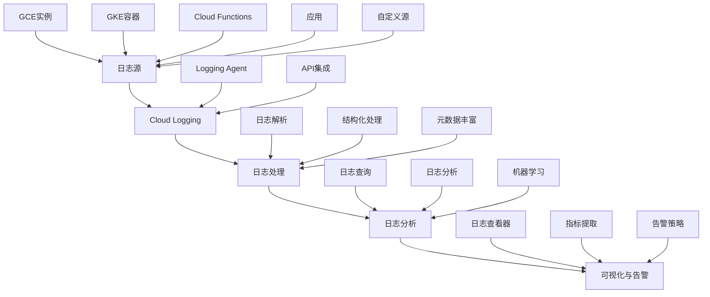

Google Cloud Monitoring（原Stackdriver Monitoring）是Google Cloud Platform提供的监控和可观察性服务，为GCP资源和在GCP上运行的应用程序提供全面的监控能力。在微服务架构中，Cloud Monitoring通过指标、日志和追踪功能，帮助我们收集、分析和可视化系统数据，构建完整的云原生监控体系。本章将深入探讨如何在微服务环境中有效使用Google Cloud Monitoring进行监控。

## Cloud Monitoring核心组件

### Metrics Collector

Google Cloud Monitoring的核心是指标收集和管理：

```yaml
# Cloud Monitoring指标特性
cloud_monitoring_metrics_features:
  data_sources:
    description: "数据源"
    sources:
      - GCP Services: Google Cloud服务自动收集的指标
      - Custom Metrics: 应用程序自定义指标
      - Agent-based: 基于代理的指标收集
      - OpenCensus/OpenTelemetry: 开源标准集成
      
  visualization:
    description: "可视化"
    capabilities:
      - 实时图表和仪表板
      - 指标告警
      - 数据探索器
      - API访问
      
  integration:
    description: "集成"
    capabilities:
      - 与GCP服务深度集成
      - REST API和客户端库支持
      - 第三方工具集成
      - 自动化操作
```

### Cloud Logging

Cloud Logging是Google Cloud的日志管理服务，用于存储、查询和分析日志数据：



### Cloud Trace

Cloud Trace提供分布式追踪功能，帮助分析请求在微服务间的流转：

```json
{
  "cloud_trace_features": {
    "request_tracing": {
      "description": "请求追踪",
      "capabilities": [
        "自动追踪HTTP请求",
        "自定义追踪跨度",
        "性能分析",
        "错误追踪"
      ]
    },
    "performance_analysis": {
      "description": "性能分析",
      "capabilities": [
        "延迟分析",
        "瓶颈识别",
        "调用链可视化",
        "统计报告"
      ]
    },
    "integration": {
      "description": "集成能力",
      "capabilities": [
        "与App Engine集成",
        "与GKE集成",
        "与Cloud Run集成",
        "开源框架支持"
      ]
    }
  }
}
```

## 微服务监控架构设计

### 基于Cloud Monitoring的监控架构

```yaml
# Cloud Monitoring微服务监控架构
gcp_monitoring_microservices_architecture:
  data_collection_layer:
    description: "数据收集层"
    components:
      - Cloud Monitoring Agent: 系统和应用指标收集
      - Cloud Logging Libraries: 应用日志收集
      - Cloud Trace Libraries: 分布式追踪收集
      - Custom Collectors: 自定义数据收集器
      
  data_processing_layer:
    description: "数据处理层"
    components:
      - Metrics Ingestion: 指标摄入
      - Log Processing: 日志处理
      - Trace Analysis: 追踪分析
      - Data Enrichment: 数据丰富化
      
  storage_layer:
    description: "存储层"
    components:
      - Time Series Database: 时间序列存储
      - Log Storage: 日志存储
      - Trace Storage: 追踪存储
      - BigQuery: 数据仓库存储
      
  analysis_layer:
    description: "分析层"
    components:
      - Query Engine: 查询引擎
      - Analytics Services: 分析服务
      - ML Services: 机器学习服务
      - Visualization: 可视化服务
      
  action_layer:
    description: "动作层"
    components:
      - Alerting Policies: 告警策略
      - Automation: 自动化服务
      - Notification: 通知服务
      - Integration: 集成服务
```

### Monitoring Agent配置

```yaml
# Cloud Monitoring Agent配置
agent_config:
  # 指标收集配置
  metrics:
    - type: agent.googleapis.com/agent/api_request_count
      enabled: true
      interval: 60s
      
    - type: agent.googleapis.com/cpu/utilization
      enabled: true
      interval: 60s
      
    - type: agent.googleapis.com/memory/bytes_used
      enabled: true
      interval: 60s
      
    - type: agent.googleapis.com/network/bytes
      enabled: true
      interval: 60s
      
    - type: agent.googleapis.com/disk/bytes_used
      enabled: true
      interval: 60s
  
  # 日志收集配置
  logging:
    receivers:
      - type: files
        include_paths:
          - /var/log/myapp/*.log
        exclude_paths:
          - /var/log/myapp/debug.log
          
      - type: systemd_journald
        units:
          - myapp.service
          
    processors:
      - type: parse_json
        field: message
        
      - type: add_fields
        fields:
          service: myapp
          version: 1.0.0
          
    exporters:
      - type: googlecloud
        retry_on_failure:
          enabled: true
```

## 自定义指标与日志集成

### 应用程序指标集成

```python
# Python应用集成Cloud Monitoring指标
from google.cloud import monitoring_v3
import time

class GCPMonitoringMetricsService:
    def __init__(self, project_id):
        self.project_id = project_id
        self.client = monitoring_v3.MetricServiceClient()
        self.project_name = f"projects/{project_id}"
        
    def create_custom_metric(self, metric_type, display_name, description, unit):
        """创建自定义指标"""
        descriptor = monitoring_v3.MetricDescriptor(
            type=metric_type,
            display_name=display_name,
            description=description,
            unit=unit,
            value_type=monitoring_v3.MetricDescriptor.ValueType.DOUBLE,
            metric_kind=monitoring_v3.MetricDescriptor.MetricKind.GAUGE,
        )
        
        try:
            descriptor = self.client.create_metric_descriptor(
                name=self.project_name,
                metric_descriptor=descriptor
            )
            print(f"Created metric descriptor: {descriptor.type}")
            return descriptor
        except Exception as e:
            print(f"Failed to create metric descriptor: {e}")
            return None
    
    def write_time_series(self, metric_type, resource_type, 
                         resource_labels, metric_labels, value):
        """写入时间序列数据"""
        series = monitoring_v3.TimeSeries()
        series.metric.type = metric_type
        series.metric.labels.update(metric_labels)
        series.resource.type = resource_type
        series.resource.labels.update(resource_labels)
        
        point = monitoring_v3.Point()
        point.interval.end_time.seconds = int(time.time())
        point.value.double_value = value
        series.points = [point]
        
        try:
            self.client.create_time_series(
                name=self.project_name,
                time_series=[series]
            )
            print(f"Wrote time series data for {metric_type}")
        except Exception as e:
            print(f"Failed to write time series: {e}")
    
    def record_business_metrics(self, service_name, operation, value):
        """记录业务指标"""
        metric_type = f"custom.googleapis.com/{service_name}/{operation}"
        resource_type = "generic_task"
        resource_labels = {
            "project_id": self.project_id,
            "location": "us-central1",
            "namespace": "microservices",
            "job": service_name,
            "task_id": "task-001"
        }
        metric_labels = {
            "service": service_name,
            "version": "1.0.0"
        }
        
        self.write_time_series(metric_type, resource_type, 
                             resource_labels, metric_labels, value)
    
    def record_performance_metrics(self, service_name, endpoint, 
                                 response_time, success):
        """记录性能指标"""
        # 记录响应时间
        self.record_business_metrics(
            service_name, 
            f"{endpoint}_response_time", 
            response_time
        )
        
        # 记录成功率
        self.record_business_metrics(
            service_name, 
            f"{endpoint}_success_rate", 
            1.0 if success else 0.0
        )

# 使用示例
metrics_service = GCPMonitoringMetricsService("my-project-id")

# 创建自定义指标
metrics_service.create_custom_metric(
    "custom.googleapis.com/user_service/order_count",
    "Order Count",
    "Number of orders processed",
    "1"
)

# 记录业务指标
metrics_service.record_business_metrics("user_service", "order_count", 1.0)
```

### 结构化日志集成

```python
# Python应用集成Cloud Logging
import logging
import json
from google.cloud import logging as cloud_logging

class GCPLogger:
    def __init__(self, project_id, log_name):
        self.client = cloud_logging.Client(project=project_id)
        self.logger = self.client.logger(log_name)
        
    def log_struct(self, severity, message, **kwargs):
        """记录结构化日志"""
        log_entry = {
            "message": message,
            "severity": severity,
            "timestamp": self._get_current_timestamp(),
            "service": "user-service",
            "version": "1.0.0",
            **kwargs
        }
        
        try:
            self.logger.log_struct(log_entry)
            print(f"Logged structured message: {message}")
        except Exception as e:
            print(f"Failed to log structured message: {e}")
    
    def info(self, message, **kwargs):
        self.log_struct("INFO", message, **kwargs)
    
    def error(self, message, **kwargs):
        self.log_struct("ERROR", message, **kwargs)
    
    def warning(self, message, **kwargs):
        self.log_struct("WARNING", message, **kwargs)
    
    def debug(self, message, **kwargs):
        self.log_struct("DEBUG", message, **kwargs)
    
    def _get_current_timestamp(self):
        """获取当前时间戳"""
        import datetime
        return datetime.datetime.utcnow().isoformat() + "Z"

# 使用示例
logger = GCPLogger("my-project-id", "user-service-logs")

# 记录业务日志
logger.info("User login successful", user_id="user123", ip_address="192.168.1.1")

# 记录错误日志
logger.error("Database connection failed", error_code=500, retry_count=3)
```

## 告警策略与自动化响应

### 智能告警配置

```yaml
# Cloud Monitoring告警策略配置
alert_policies:
  metric_alerts:
    high_cpu_utilization:
      display_name: "High CPU Utilization"
      documentation:
        content: "CPU utilization is above threshold"
        mime_type: "text/markdown"
      conditions:
        - display_name: "CPU utilization"
          condition_threshold:
            filter: "resource.type = \"gce_instance\" AND metric.type = \"compute.googleapis.com/instance/cpu/utilization\""
            comparison: "COMPARISON_GT"
            threshold_value: 0.8
            duration: "60s"
            aggregations:
              - alignment_period: "60s"
                per_series_aligner: "ALIGN_MEAN"
                cross_series_reducer: "REDUCE_MEAN"
                group_by_fields:
                  - "resource.label.instance_id"
      notification_channels:
        - "projects/my-project-id/notificationChannels/channel-123"
      enabled: true
      
    high_error_rate:
      display_name: "High Error Rate"
      documentation:
        content: "Application error rate is above threshold"
        mime_type: "text/markdown"
      conditions:
        - display_name: "Error rate"
          condition_threshold:
            filter: "resource.type = \"generic_task\" AND metric.type = \"custom.googleapis.com/user_service/error_rate\""
            comparison: "COMPARISON_GT"
            threshold_value: 0.05
            duration: "300s"
            aggregations:
              - alignment_period: "60s"
                per_series_aligner: "ALIGN_MEAN"
      notification_channels:
        - "projects/my-project-id/notificationChannels/channel-123"
      enabled: true
      
  log_alerts:
    critical_errors:
      display_name: "Critical Application Errors"
      documentation:
        content: "Critical application errors detected in logs"
        mime_type: "text/markdown"
      conditions:
        - display_name: "Critical error logs"
          condition_matched_log:
            filter: "severity >= ERROR AND resource.type = \"generic_task\""
            label_extractors:
              service: "EXTRACT(resource.labels.job)"
      notification_channels:
        - "projects/my-project-id/notificationChannels/channel-123"
      enabled: true
```

### 自动化响应机制

```python
# Cloud Monitoring告警自动化响应
from google.cloud import functions_v1
from google.cloud import compute_v1
import json

class GCPAutoResponder:
    def __init__(self, project_id):
        self.project_id = project_id
        self.compute_client = compute_v1.InstancesClient()
        
    def handle_alert_notification(self, event, context):
        """处理告警通知"""
        if 'data' in event:
            payload = json.loads(base64.b64decode(event['data']).decode('utf-8'))
        else:
            payload = event
            
        print(f"Received alert: {payload}")
        
        incident = payload.get('incident', {})
        policy_name = incident.get('policy_name', '')
        
        # 根据告警策略执行相应操作
        if 'High CPU' in policy_name:
            self.handle_high_cpu_alert(incident)
        elif 'High Error Rate' in policy_name:
            self.handle_high_error_rate_alert(incident)
        elif 'Critical Errors' in policy_name:
            self.handle_critical_errors_alert(incident)
    
    def handle_high_cpu_alert(self, incident):
        """处理高CPU告警"""
        print("Handling high CPU alert")
        
        # 自动扩容计算实例
        self.scale_up_instances()
        
        # 发送通知
        self.send_notification("High CPU alert triggered, scaled up instances")
    
    def handle_high_error_rate_alert(self, incident):
        """处理高错误率告警"""
        print("Handling high error rate alert")
        
        # 启动故障排查流程
        self.trigger_error_analysis(incident)
        
        # 发送通知
        self.send_notification("High error rate detected, triggered automated analysis")
    
    def handle_critical_errors_alert(self, incident):
        """处理严重错误告警"""
        print("Handling critical errors alert")
        
        # 启动恢复流程
        self.trigger_recovery_process(incident)
        
        # 发送通知
        self.send_notification("Critical errors detected, triggered automated recovery")
    
    def scale_up_instances(self):
        """扩容计算实例"""
        try:
            # 这里应该实现具体的扩容逻辑
            # 例如调整实例组大小或启动新实例
            print("Scaling up instances")
            # 实际实现会使用Compute Engine API
        except Exception as e:
            print(f"Failed to scale up instances: {e}")
    
    def trigger_error_analysis(self, incident):
        """触发错误分析"""
        try:
            # 触发Cloud Function进行错误分析
            print("Triggering error analysis")
            # 实际实现会调用Cloud Functions或其他服务
        except Exception as e:
            print(f"Failed to trigger error analysis: {e}")
    
    def trigger_recovery_process(self, incident):
        """触发恢复流程"""
        try:
            # 触发恢复流程
            print("Triggering recovery process")
            # 实际实现会调用相应的恢复机制
        except Exception as e:
            print(f"Failed to trigger recovery process: {e}")
    
    def send_notification(self, message):
        """发送通知"""
        try:
            # 发送通知到指定渠道
            print(f"Sending notification: {message}")
            # 实际实现会使用Notification Channels API
        except Exception as e:
            print(f"Failed to send notification: {e}")

# Cloud Function入口点
def handle_alert(event, context):
    responder = GCPAutoResponder("my-project-id")
    responder.handle_alert_notification(event, context)
```

## 日志分析与洞察

### 日志查询示例

```sql
-- 分析错误日志模式
resource.type="generic_task"
severity>=ERROR
timestamp>="2025-08-30T00:00:00Z"
| stats count() as errorCount by jsonPayload.service, jsonPayload.error_code, bin(timestamp, 1h)
| order by errorCount desc
| limit 20

-- 统计每小时请求量和错误率
resource.type="generic_task"
jsonPayload.message:"Request processed"
| stats 
    count() as requestCount,
    countif(jsonPayload.success == false) as errorCount
    by bin(timestamp, 1h)
| eval errorRate = errorCount * 100.0 / requestCount
| order by timestamp asc

-- 分析用户行为模式
resource.type="generic_task"
jsonPayload.action:("login" OR "logout")
| stats count() as actionCount by jsonPayload.action, bin(timestamp, 1d)
| order by timestamp asc

-- 查找性能瓶颈
resource.type="generic_task"
jsonPayload.duration > 1000
| stats avg(jsonPayload.duration) as avgDuration, count() as requestCount
  by jsonPayload.service, jsonPayload.endpoint
| order by avgDuration desc
| limit 50
```

### 高级日志分析

```python
# Cloud Logging高级分析
from google.cloud import logging
from google.cloud.logging import query
import pandas as pd
from datetime import datetime, timedelta

class GCPCloudLoggingAnalyzer:
    def __init__(self, project_id):
        self.project_id = project_id
        self.client = logging.Client(project=project_id)
        
    def analyze_error_patterns(self, hours=24):
        """分析错误模式"""
        end_time = datetime.utcnow()
        start_time = end_time - timedelta(hours=hours)
        
        # 构建查询
        filter_str = (
            f'resource.type="generic_task" '
            f'severity>=ERROR '
            f'timestamp>="{start_time.isoformat()}Z" '
            f'timestamp<="{end_time.isoformat()}Z"'
        )
        
        try:
            entries = self.client.list_entries(
                filter_=filter_str,
                order_by=logging.DESCENDING,
                page_size=1000
            )
            
            error_data = []
            for entry in entries:
                if hasattr(entry, 'payload') and isinstance(entry.payload, dict):
                    error_data.append({
                        'timestamp': entry.timestamp,
                        'service': entry.payload.get('service', 'unknown'),
                        'error_code': entry.payload.get('error_code', 'unknown'),
                        'message': entry.payload.get('message', '')
                    })
            
            # 转换为DataFrame进行分析
            df = pd.DataFrame(error_data)
            if not df.empty:
                error_patterns = df.groupby(['service', 'error_code']).size().sort_values(ascending=False)
                return error_patterns.head(20).to_dict()
            else:
                return {}
                
        except Exception as e:
            print(f"Failed to analyze error patterns: {e}")
            return {}
    
    def analyze_performance_trends(self, hours=24):
        """分析性能趋势"""
        end_time = datetime.utcnow()
        start_time = end_time - timedelta(hours=hours)
        
        # 构建查询
        filter_str = (
            f'resource.type="generic_task" '
            f'jsonPayload.duration:* '
            f'timestamp>="{start_time.isoformat()}Z" '
            f'timestamp<="{end_time.isoformat()}Z"'
        )
        
        try:
            entries = self.client.list_entries(
                filter_=filter_str,
                order_by=logging.DESCENDING,
                page_size=1000
            )
            
            performance_data = []
            for entry in entries:
                if hasattr(entry, 'payload') and isinstance(entry.payload, dict):
                    duration = entry.payload.get('duration', 0)
                    if isinstance(duration, (int, float)):
                        performance_data.append({
                            'timestamp': entry.timestamp,
                            'service': entry.payload.get('service', 'unknown'),
                            'duration': duration,
                            'endpoint': entry.payload.get('endpoint', 'unknown')
                        })
            
            # 转换为DataFrame进行分析
            df = pd.DataFrame(performance_data)
            if not df.empty:
                # 按小时统计性能指标
                df['hour'] = df['timestamp'].dt.floor('H')
                hourly_stats = df.groupby('hour').agg({
                    'duration': ['mean', 'median', lambda x: x.quantile(0.95)],
                    'service': 'count'
                }).round(2)
                
                return hourly_stats.to_dict()
            else:
                return {}
                
        except Exception as e:
            print(f"Failed to analyze performance trends: {e}")
            return {}

# 使用示例
analyzer = GCPCloudLoggingAnalyzer("my-project-id")
error_patterns = analyzer.analyze_error_patterns(hours=24)
print("Error patterns:", error_patterns)

performance_trends = analyzer.analyze_performance_trends(hours=24)
print("Performance trends:", performance_trends)
```

## 成本优化与管理

### Cloud Monitoring成本控制

```yaml
# Cloud Monitoring成本控制策略
cloud_monitoring_cost_optimization:
  metrics_optimization:
    description: "指标优化"
    strategies:
      - "减少不必要的自定义指标"
      - "合理设置指标保留期"
      - "使用聚合指标替代详细指标"
      - "定期清理未使用的指标"
      
  logs_optimization:
    description: "日志优化"
    strategies:
      - "设置合理的日志保留期"
      - "过滤掉低价值日志"
      - "压缩日志数据"
      - "使用日志采样"
      
  data_collection_optimization:
    description: "数据收集优化"
    strategies:
      - "调整采样率"
      - "限制收集的数据量"
      - "优化代理配置"
      - "使用智能采样"
      
  query_optimization:
    description: "查询优化"
    strategies:
      - "优化查询语句"
      - "限制查询时间范围"
      - "缓存常用查询结果"
      - "避免复杂聚合查询"
```

### 监控成本分析

```python
# Cloud Monitoring成本分析工具
from google.cloud import billing_v1
import pandas as pd
from datetime import datetime, timedelta

class GCPCostAnalyzer:
    def __init__(self, project_id):
        self.project_id = project_id
        self.billing_client = billing_v1.CloudBillingClient()
        
    def analyze_monitoring_costs(self, days=30):
        """分析监控相关成本"""
        end_date = datetime.utcnow()
        start_date = end_date - timedelta(days=days)
        
        try:
            # 构建成本查询
            # 注意：这需要Billing API的适当权限
            cost_data = []
            
            # 模拟成本数据（实际实现需要调用Billing API）
            monitoring_services = [
                'Cloud Monitoring',
                'Cloud Logging',
                'Cloud Trace'
            ]
            
            for service in monitoring_services:
                cost_data.append({
                    'service': service,
                    'cost': self._estimate_service_cost(service, days),
                    'trend': self._calculate_cost_trend(service, days)
                })
            
            return {
                'total_cost': sum(item['cost'] for item in cost_data),
                'service_breakdown': cost_data,
                'analysis_period': {
                    'start': start_date.isoformat(),
                    'end': end_date.isoformat()
                }
            }
            
        except Exception as e:
            print(f"Failed to analyze monitoring costs: {e}")
            return {}
    
    def _estimate_service_cost(self, service_name, days):
        """估算服务成本"""
        # 这里应该实现实际的成本计算逻辑
        # 基于使用量和GCP定价
        base_costs = {
            'Cloud Monitoring': 10.0,
            'Cloud Logging': 15.0,
            'Cloud Trace': 5.0
        }
        return base_costs.get(service_name, 0.0) * (days / 30.0)
    
    def _calculate_cost_trend(self, service_name, days):
        """计算成本趋势"""
        # 模拟趋势计算
        import random
        return random.uniform(-0.1, 0.2)  # -10% 到 +20% 的变化

# 使用示例
cost_analyzer = GCPCostAnalyzer("my-project-id")
cost_analysis = cost_analyzer.analyze_monitoring_costs(days=30)
print("Cost analysis:", cost_analysis)
```

## 最佳实践总结

### 1. 指标设计最佳实践

```yaml
# 指标设计最佳实践
metrics_design_best_practices:
  naming_conventions:
    guidelines:
      - "使用清晰、一致的命名规范"
      - "包含服务名称和指标类型"
      - "遵循GCP指标命名约定"
      - "使用有意义的分隔符"
      
  dimension_design:
    guidelines:
      - "合理使用标签进行分类"
      - "避免过多标签导致高基数问题"
      - "保持标签值的稳定性"
      - "使用预定义的资源标签"
      
  data_collection:
    guidelines:
      - "只收集必要的指标"
      - "合理设置收集频率"
      - "确保指标数据的准确性"
      - "实施指标数据验证"
```

### 2. 告警配置最佳实践

```yaml
# 告警配置最佳实践
alerting_best_practices:
  policy_design:
    guidelines:
      - "设置合理的阈值"
      - "避免告警风暴"
      - "实施告警分层"
      - "定期审查告警有效性"
      
  notification_strategy:
    guidelines:
      - "根据严重程度选择通知渠道"
      - "实施告警升级机制"
      - "避免通知疲劳"
      - "提供清晰的告警信息"
      
  automation:
    guidelines:
      - "对可自动处理的问题实施自动化"
      - "确保自动化操作的安全性"
      - "监控自动化执行效果"
      - "提供人工干预选项"
```

## 总结

Google Cloud Monitoring为微服务架构提供了全面的监控和可观察性解决方案。通过指标、日志和追踪功能的有效集成，我们可以构建高效的云原生监控体系。

关键要点包括：
1. **架构设计**：设计适应微服务特点的Cloud Monitoring监控架构
2. **指标集成**：有效集成自定义业务和技术指标
3. **自动化响应**：实施智能告警和自动化响应机制
4. **成本控制**：优化资源配置，控制监控成本

通过遵循最佳实践，合理使用Google Cloud Monitoring的各项功能，可以为微服务系统提供强大的可观察性支持，保障系统的稳定运行和持续优化。

至此，我们完成了第16章关于基于云的日志与监控的所有内容。在下一章中，我们将探讨日志与监控的智能化发展趋势。