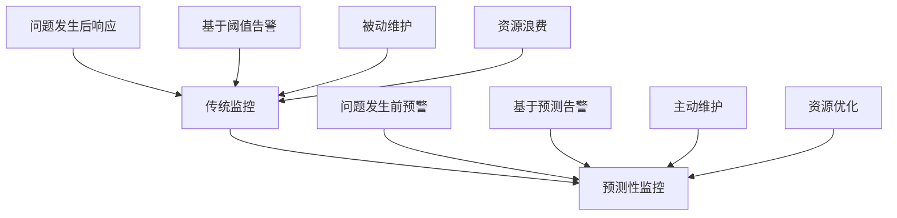

预测性分析是人工智能在日志与监控领域的重要应用之一，它通过分析历史数据和识别模式来预测未来的系统行为、性能趋势和潜在问题。这种前瞻性的方法使运维团队能够主动采取措施，预防问题发生，优化资源配置，提升系统稳定性和用户体验。本章将深入探讨如何在日志与监控中应用AI进行预测性分析。

## 预测性分析概述

### 预测性分析的价值

预测性分析在现代微服务架构中具有重要价值，能够帮助组织实现从被动响应到主动预防的转变：



### 预测性分析应用场景

```yaml
# 预测性分析应用场景
predictive_analytics_applications:
  performance_forecasting:
    description: "性能预测"
    use_cases:
      - 响应时间趋势预测
      - 吞吐量变化预测
      - 资源使用率预测
      - 用户行为模式预测
      
  capacity_planning:
    description: "容量规划"
    use_cases:
      - CPU和内存需求预测
      - 存储空间需求预测
      - 网络带宽需求预测
      - 数据库容量预测
      
  failure_prediction:
    description: "故障预测"
    use_cases:
      - 硬件故障预测
      - 系统性能下降预测
      - 服务中断风险预测
      - 安全威胁预测
      
  anomaly_forecasting:
    description: "异常预测"
    use_cases:
      - 异常行为模式预测
      - 安全攻击预测
      - 性能瓶颈预测
      - 资源耗尽预测
```

## 时间序列预测模型

### ARIMA模型实现

```python
# 基于ARIMA的时间序列预测
import pandas as pd
import numpy as np
from statsmodels.tsa.arima.model import ARIMA
from statsmodels.tsa.seasonal import seasonal_decompose
from sklearn.metrics import mean_absolute_error, mean_squared_error
import warnings
warnings.filterwarnings('ignore')

class ARIMAPredictor:
    def __init__(self, order=(1, 1, 1), seasonal_order=(0, 0, 0, 0)):
        self.order = order
        self.seasonal_order = seasonal_order
        self.model = None
        self.fitted_model = None
        
    def fit(self, time_series, exog=None):
        """训练ARIMA模型"""
        self.model = ARIMA(time_series, order=self.order, seasonal_order=self.seasonal_order, exog=exog)
        self.fitted_model = self.model.fit()
        return self
    
    def predict(self, steps=1, exog=None):
        """预测未来值"""
        if self.fitted_model is None:
            raise ValueError("Model not fitted yet")
        
        forecast = self.fitted_model.forecast(steps=steps, exog=exog)
        return forecast
    
    def predict_with_confidence(self, steps=1, alpha=0.05):
        """带置信区间的预测"""
        if self.fitted_model is None:
            raise ValueError("Model not fitted yet")
        
        forecast_result = self.fitted_model.get_forecast(steps=steps)
        forecast = forecast_result.predicted_mean
        conf_int = forecast_result.conf_int(alpha=alpha)
        
        return {
            'forecast': forecast,
            'lower_bound': conf_int.iloc[:, 0],
            'upper_bound': conf_int.iloc[:, 1]
        }
    
    def evaluate(self, actual_values, predicted_values):
        """评估模型性能"""
        mae = mean_absolute_error(actual_values, predicted_values)
        mse = mean_squared_error(actual_values, predicted_values)
        rmse = np.sqrt(mse)
        
        return {
            'mae': mae,
            'mse': mse,
            'rmse': rmse
        }

# 使用示例
# 生成模拟的时间序列数据（CPU使用率）
np.random.seed(42)
dates = pd.date_range('2025-01-01', periods=365, freq='D')
trend = 50 + 0.1 * np.arange(365)  # 轻微上升趋势
seasonal = 10 * np.sin(2 * np.pi * np.arange(365) / 30)  # 月度季节性
noise = np.random.normal(0, 2, 365)
cpu_usage = trend + seasonal + noise

# 创建时间序列
ts = pd.Series(cpu_usage, index=dates)

# 训练模型
predictor = ARIMAPredictor(order=(2, 1, 2))
predictor.fit(ts[:-30])  # 使用前335天数据训练

# 预测未来30天
forecast = predictor.predict(steps=30)
confidence_intervals = predictor.predict_with_confidence(steps=30)

print("Forecast for next 5 days:")
for i in range(5):
    print(f"Day {i+1}: {forecast[i]:.2f}")
```

### Prophet模型实现

```python
# 基于Prophet的时间序列预测
from prophet import Prophet
import pandas as pd
import numpy as np

class ProphetPredictor:
    def __init__(self, **prophet_params):
        self.params = prophet_params
        self.model = None
        
    def prepare_data(self, time_series):
        """准备Prophet所需的数据格式"""
        df = pd.DataFrame({
            'ds': time_series.index,
            'y': time_series.values
        })
        return df
    
    def fit(self, time_series, holidays=None):
        """训练Prophet模型"""
        # 准备数据
        df = self.prepare_data(time_series)
        
        # 创建模型
        self.model = Prophet(**self.params)
        
        # 添加节假日（如果有）
        if holidays is not None:
            self.model.add_country_holidays(country_name=holidays)
        
        # 训练模型
        self.model.fit(df)
        
        return self
    
    def predict(self, periods=30, freq='D'):
        """预测未来值"""
        if self.model is None:
            raise ValueError("Model not fitted yet")
        
        # 创建未来日期框架
        future = self.model.make_future_dataframe(periods=periods, freq=freq)
        
        # 进行预测
        forecast = self.model.predict(future)
        
        return forecast
    
    def get_components(self, forecast):
        """获取预测组件"""
        if self.model is None:
            raise ValueError("Model not fitted yet")
        
        components = {
            'trend': forecast['trend'],
            'yearly': forecast['yearly'],
            'weekly': forecast['weekly'] if 'weekly' in forecast.columns else None,
            'daily': forecast['daily'] if 'daily' in forecast.columns else None
        }
        
        return components
    
    def evaluate(self, actual_values, predicted_values):
        """评估模型性能"""
        mae = np.mean(np.abs(actual_values - predicted_values))
        mse = np.mean((actual_values - predicted_values) ** 2)
        rmse = np.sqrt(mse)
        
        return {
            'mae': mae,
            'mse': mse,
            'rmse': rmse
        }

# 使用示例
# 使用相同的数据
np.random.seed(42)
dates = pd.date_range('2025-01-01', periods=365, freq='D')
trend = 50 + 0.1 * np.arange(365)
seasonal = 10 * np.sin(2 * np.pi * np.arange(365) / 30)
noise = np.random.normal(0, 2, 365)
cpu_usage = trend + seasonal + noise

ts = pd.Series(cpu_usage, index=dates)

# 训练Prophet模型
prophet_predictor = ProphetPredictor(
    yearly_seasonality=True,
    weekly_seasonality=True,
    daily_seasonality=False,
    changepoint_prior_scale=0.05
)

prophet_predictor.fit(ts[:-30])

# 预测未来30天
forecast = prophet_predictor.predict(periods=30)

print("Prophet Forecast for next 5 days:")
for i in range(5):
    ds = forecast.iloc[-30+i]['ds']
    yhat = forecast.iloc[-30+i]['yhat']
    print(f"Date {ds}: {yhat:.2f}")
```

## 深度学习预测模型

### LSTM时间序列预测

```python
# 基于LSTM的时间序列预测
import numpy as np
import pandas as pd
from sklearn.preprocessing import MinMaxScaler
from tensorflow.keras.models import Sequential
from tensorflow.keras.layers import LSTM, Dense, Dropout
from tensorflow.keras.optimizers import Adam
import matplotlib.pyplot as plt

class LSTMPredictor:
    def __init__(self, look_back=10, lstm_units=50, dropout_rate=0.2):
        self.look_back = look_back
        self.lstm_units = lstm_units
        self.dropout_rate = dropout_rate
        self.scaler = MinMaxScaler(feature_range=(0, 1))
        self.model = None
        
    def create_dataset(self, data, look_back=1):
        """创建数据集"""
        X, Y = [], []
        for i in range(len(data) - look_back - 1):
            X.append(data[i:(i + look_back), 0])
            Y.append(data[i + look_back, 0])
        return np.array(X), np.array(Y)
    
    def build_model(self, input_shape):
        """构建LSTM模型"""
        model = Sequential([
            LSTM(self.lstm_units, return_sequences=True, input_shape=input_shape),
            Dropout(self.dropout_rate),
            LSTM(self.lstm_units, return_sequences=True),
            Dropout(self.dropout_rate),
            LSTM(self.lstm_units, return_sequences=False),
            Dropout(self.dropout_rate),
            Dense(25),
            Dense(1)
        ])
        
        model.compile(
            optimizer=Adam(learning_rate=0.001),
            loss='mean_squared_error'
        )
        
        return model
    
    def fit(self, time_series, epochs=50, batch_size=32, validation_split=0.1):
        """训练LSTM模型"""
        # 数据标准化
        scaled_data = self.scaler.fit_transform(time_series.values.reshape(-1, 1))
        
        # 创建训练数据集
        X, Y = self.create_dataset(scaled_data, self.look_back)
        
        # 重塑输入数据
        X = np.reshape(X, (X.shape[0], X.shape[1], 1))
        
        # 构建和训练模型
        self.model = self.build_model((self.look_back, 1))
        history = self.model.fit(
            X, Y,
            epochs=epochs,
            batch_size=batch_size,
            validation_split=validation_split,
            verbose=1
        )
        
        return self, history
    
    def predict(self, time_series, steps=1):
        """预测未来值"""
        if self.model is None:
            raise ValueError("Model not trained yet")
        
        # 数据标准化
        scaled_data = self.scaler.transform(time_series.values.reshape(-1, 1))
        
        # 准备预测数据
        last_sequence = scaled_data[-self.look_back:].reshape(1, self.look_back, 1)
        
        predictions = []
        current_sequence = last_sequence.copy()
        
        for _ in range(steps):
            # 预测下一个值
            next_pred = self.model.predict(current_sequence, verbose=0)
            predictions.append(next_pred[0, 0])
            
            # 更新序列（滑动窗口）
            current_sequence = np.roll(current_sequence, -1, axis=1)
            current_sequence[0, -1, 0] = next_pred[0, 0]
        
        # 反标准化预测结果
        predictions = np.array(predictions).reshape(-1, 1)
        predictions = self.scaler.inverse_transform(predictions)
        
        return predictions.flatten()
    
    def evaluate(self, actual_values, predicted_values):
        """评估模型性能"""
        mae = np.mean(np.abs(actual_values - predicted_values))
        mse = np.mean((actual_values - predicted_values) ** 2)
        rmse = np.sqrt(mse)
        
        return {
            'mae': mae,
            'mse': mse,
            'rmse': rmse
        }

# 使用示例
# 生成模拟的多维时间序列数据
np.random.seed(42)
dates = pd.date_range('2025-01-01', periods=1000, freq='H')

# 模拟多个指标
cpu_usage = 50 + 10 * np.sin(2 * np.pi * np.arange(1000) / 24) + np.random.normal(0, 2, 1000)
memory_usage = 60 + 8 * np.cos(2 * np.pi * np.arange(1000) / 12) + np.random.normal(0, 1.5, 1000)
network_traffic = 100 + 20 * np.sin(2 * np.pi * np.arange(1000) / 168) + np.random.normal(0, 5, 1000)

# 创建多指标时间序列DataFrame
ts_multi = pd.DataFrame({
    'cpu_usage': cpu_usage,
    'memory_usage': memory_usage,
    'network_traffic': network_traffic
}, index=dates)

# 使用CPU使用率进行预测
lstm_predictor = LSTMPredictor(look_back=24, lstm_units=64)

# 训练模型（使用前800小时数据）
trained_model, history = lstm_predictor.fit(ts_multi['cpu_usage'][:800], epochs=20)

# 预测未来24小时
recent_data = ts_multi['cpu_usage'][776:800]  # 最近24小时数据
predictions = lstm_predictor.predict(recent_data, steps=24)

print("LSTM Forecast for next 5 hours:")
for i in range(5):
    print(f"Hour {i+1}: {predictions[i]:.2f}")
```

### Transformer预测模型

```python
# 基于Transformer的时间序列预测
import torch
import torch.nn as nn
import torch.optim as optim
import numpy as np
import pandas as pd
from sklearn.preprocessing import StandardScaler

class TimeSeriesTransformer(nn.Module):
    def __init__(self, input_size, d_model=128, nhead=8, num_layers=4, dropout=0.1):
        super(TimeSeriesTransformer, self).__init__()
        self.d_model = d_model
        self.input_projection = nn.Linear(input_size, d_model)
        self.pos_encoding = nn.Parameter(torch.randn(1000, d_model))
        
        encoder_layer = nn.TransformerEncoderLayer(
            d_model=d_model,
            nhead=nhead,
            dropout=dropout,
            batch_first=True
        )
        self.transformer = nn.TransformerEncoder(encoder_layer, num_layers)
        self.output_projection = nn.Linear(d_model, input_size)
        
    def forward(self, x):
        # 输入投影
        x = self.input_projection(x)
        
        # 位置编码
        seq_len = x.size(1)
        x = x + self.pos_encoding[:seq_len, :].unsqueeze(0)
        
        # Transformer编码
        x = self.transformer(x)
        
        # 输出投影
        x = self.output_projection(x)
        
        return x

class TransformerPredictor:
    def __init__(self, input_size, seq_length=24, device='cpu'):
        self.input_size = input_size
        self.seq_length = seq_length
        self.device = device
        self.model = TimeSeriesTransformer(input_size).to(device)
        self.scaler = StandardScaler()
        self.criterion = nn.MSELoss()
        self.optimizer = optim.Adam(self.model.parameters(), lr=0.001)
        
    def create_sequences(self, data):
        """创建序列数据"""
        sequences = []
        targets = []
        for i in range(len(data) - self.seq_length):
            sequences.append(data[i:(i + self.seq_length)])
            targets.append(data[i + self.seq_length])
        return np.array(sequences), np.array(targets)
    
    def fit(self, time_series_data, epochs=50, batch_size=32):
        """训练Transformer模型"""
        # 数据标准化
        scaled_data = self.scaler.fit_transform(time_series_data)
        
        # 创建序列
        X, y = self.create_sequences(scaled_data)
        
        # 转换为PyTorch张量
        X_tensor = torch.FloatTensor(X).to(self.device)
        y_tensor = torch.FloatTensor(y).to(self.device)
        
        # 训练模型
        self.model.train()
        for epoch in range(epochs):
            total_loss = 0
            for i in range(0, len(X_tensor), batch_size):
                batch_X = X_tensor[i:i+batch_size]
                batch_y = y_tensor[i:i+batch_size]
                
                self.optimizer.zero_grad()
                outputs = self.model(batch_X)
                loss = self.criterion(outputs[:, -1, :], batch_y)
                loss.backward()
                self.optimizer.step()
                
                total_loss += loss.item()
            
            if (epoch + 1) % 10 == 0:
                avg_loss = total_loss / (len(X_tensor) // batch_size)
                print(f'Epoch [{epoch+1}/{epochs}], Loss: {avg_loss:.4f}')
        
        return self
    
    def predict(self, recent_data, steps=1):
        """预测未来值"""
        self.model.eval()
        
        # 数据标准化
        scaled_data = self.scaler.transform(recent_data)
        
        predictions = []
        current_sequence = torch.FloatTensor(scaled_data[-self.seq_length:]).unsqueeze(0).to(self.device)
        
        with torch.no_grad():
            for _ in range(steps):
                # 预测下一个值
                output = self.model(current_sequence)
                next_pred = output[:, -1, :].cpu().numpy()
                predictions.append(next_pred[0])
                
                # 更新序列（滑动窗口）
                new_input = torch.FloatTensor(next_pred).unsqueeze(0).to(self.device)
                current_sequence = torch.cat([current_sequence[:, 1:, :], new_input.unsqueeze(1)], dim=1)
        
        # 反标准化预测结果
        predictions = np.array(predictions)
        predictions = self.scaler.inverse_transform(predictions)
        
        return predictions

# 使用示例
# 使用多维时间序列数据
transformer_predictor = TransformerPredictor(
    input_size=3,  # CPU, Memory, Network三个指标
    seq_length=24,
    device='cpu'
)

# 准备训练数据
train_data = ts_multi[['cpu_usage', 'memory_usage', 'network_traffic']].values[:800]

# 训练模型
transformer_predictor.fit(train_data, epochs=30)

# 预测未来6小时
recent_data = ts_multi[['cpu_usage', 'memory_usage', 'network_traffic']].values[776:800]
predictions = transformer_predictor.predict(recent_data, steps=6)

print("Transformer Forecast for next 3 hours:")
for i in range(3):
    print(f"Hour {i+1}: CPU={predictions[i][0]:.2f}, Memory={predictions[i][1]:.2f}, Network={predictions[i][2]:.2f}")
```

## 容量规划预测

### 资源需求预测

```python
# 资源需求预测系统
import numpy as np
import pandas as pd
from sklearn.ensemble import RandomForestRegressor
from sklearn.preprocessing import StandardScaler
from datetime import datetime, timedelta

class CapacityPlanner:
    def __init__(self):
        self.models = {}
        self.scalers = {}
        
    def extract_capacity_features(self, metrics_data, business_data):
        """提取容量规划特征"""
        features = []
        
        for i in range(len(metrics_data)):
            # 系统指标特征
            system_features = {
                'cpu_avg': np.mean(metrics_data['cpu_usage'][max(0, i-24):i+1]) if i >= 0 else 0,
                'cpu_max': np.max(metrics_data['cpu_usage'][max(0, i-24):i+1]) if i >= 0 else 0,
                'memory_avg': np.mean(metrics_data['memory_usage'][max(0, i-24):i+1]) if i >= 0 else 0,
                'network_avg': np.mean(metrics_data['network_traffic'][max(0, i-24):i+1]) if i >= 0 else 0,
                'disk_io_avg': np.mean(metrics_data['disk_io'][max(0, i-24):i+1]) if 'disk_io' in metrics_data and i >= 0 else 0
            }
            
            # 业务指标特征
            business_features = {
                'user_count': business_data['user_count'][i] if i < len(business_data['user_count']) else 0,
                'transaction_count': business_data['transaction_count'][i] if i < len(business_data['transaction_count']) else 0,
                'active_sessions': business_data['active_sessions'][i] if i < len(business_data['active_sessions']) else 0
            }
            
            # 时间特征
            time_features = {
                'hour': i % 24,
                'day_of_week': (i // 24) % 7,
                'is_weekend': 1 if (i // 24) % 7 >= 5 else 0
            }
            
            # 组合所有特征
            all_features = {**system_features, **business_features, **time_features}
            features.append(all_features)
        
        return pd.DataFrame(features)
    
    def train_resource_models(self, features_df, target_resources):
        """训练资源预测模型"""
        # 标准化特征
        scaler = StandardScaler()
        scaled_features = scaler.fit_transform(features_df)
        self.scalers['resources'] = scaler
        
        # 为每种资源训练模型
        for resource_name, resource_values in target_resources.items():
            model = RandomForestRegressor(n_estimators=100, random_state=42)
            model.fit(scaled_features, resource_values)
            self.models[resource_name] = model
    
    def predict_capacity_requirements(self, features_df, horizon_days=7):
        """预测容量需求"""
        if not self.models:
            raise ValueError("Models not trained yet")
        
        # 标准化特征
        scaled_features = self.scalers['resources'].transform(features_df)
        
        # 预测每种资源的需求
        predictions = {}
        for resource_name, model in self.models.items():
            pred = model.predict(scaled_features)
            predictions[resource_name] = pred
        
        return predictions
    
    def generate_capacity_report(self, predictions, current_capacity):
        """生成容量规划报告"""
        report = {
            'timestamp': datetime.now().isoformat(),
            'predictions': {},
            'recommendations': {}
        }
        
        for resource_name, pred_values in predictions.items():
            # 计算未来需求
            future_avg = np.mean(pred_values[-7*24:])  # 未来7天平均需求
            future_peak = np.max(pred_values[-7*24:])  # 未来7天峰值需求
            
            # 当前容量
            current_cap = current_capacity.get(resource_name, 0)
            
            # 容量建议
            utilization_rate = future_peak / current_cap if current_cap > 0 else 0
            recommendation = "Sufficient" if utilization_rate < 0.8 else "Scale Up" if utilization_rate < 1.0 else "Immediate Action Required"
            
            report['predictions'][resource_name] = {
                'current_capacity': current_cap,
                'future_average_demand': float(future_avg),
                'future_peak_demand': float(future_peak),
                'utilization_rate': float(utilization_rate)
            }
            
            report['recommendations'][resource_name] = recommendation
        
        return report

# 使用示例
# 模拟历史数据
np.random.seed(42)
hours = 168  # 一周的数据

# 系统指标
metrics_data = {
    'cpu_usage': 50 + 15 * np.sin(2 * np.pi * np.arange(hours) / 24) + np.random.normal(0, 5, hours),
    'memory_usage': 60 + 10 * np.cos(2 * np.pi * np.arange(hours) / 12) + np.random.normal(0, 3, hours),
    'network_traffic': 100 + 30 * np.sin(2 * np.pi * np.arange(hours) / 168) + np.random.normal(0, 10, hours),
    'disk_io': 20 + 5 * np.sin(2 * np.pi * np.arange(hours) / 48) + np.random.normal(0, 2, hours)
}

# 业务指标
business_data = {
    'user_count': 1000 + 200 * np.sin(2 * np.pi * np.arange(hours) / 24) + np.random.normal(0, 50, hours),
    'transaction_count': 5000 + 1000 * np.sin(2 * np.pi * np.arange(hours) / 24) + np.random.normal(0, 200, hours),
    'active_sessions': 800 + 150 * np.cos(2 * np.pi * np.arange(hours) / 12) + np.random.normal(0, 30, hours)
}

# 当前容量
current_capacity = {
    'cpu_cores': 16,
    'memory_gb': 32,
    'network_mbps': 1000,
    'disk_gb': 1000
}

# 初始化容量规划器
planner = CapacityPlanner()

# 提取特征
features_df = planner.extract_capacity_features(metrics_data, business_data)

# 准备目标变量（未来资源需求）
target_resources = {
    'cpu_cores': metrics_data['cpu_usage'] / 100 * 16,  # 基于CPU使用率预测核心数需求
    'memory_gb': metrics_data['memory_usage'] / 100 * 32,  # 基于内存使用率预测内存需求
    'network_mbps': metrics_data['network_traffic'] / 200 * 1000  # 基于网络流量预测带宽需求
}

# 训练模型
planner.train_resource_models(features_df, target_resources)

# 生成未来特征（用于预测）
future_features = planner.extract_capacity_features(metrics_data, business_data)

# 预测未来容量需求
predictions = planner.predict_capacity_requirements(future_features, horizon_days=7)

# 生成容量规划报告
report = planner.generate_capacity_report(predictions, current_capacity)

print("Capacity Planning Report:")
print(f"Generated at: {report['timestamp']}")
for resource, pred in report['predictions'].items():
    print(f"\n{resource.upper()}:")
    print(f"  Current Capacity: {pred['current_capacity']}")
    print(f"  Future Average Demand: {pred['future_average_demand']:.2f}")
    print(f"  Future Peak Demand: {pred['future_peak_demand']:.2f}")
    print(f"  Utilization Rate: {pred['utilization_rate']:.2%}")
    print(f"  Recommendation: {report['recommendations'][resource]}")
```

## 异常预测系统

### 基于预测的异常检测

```python
# 基于预测的异常检测系统
import numpy as np
import pandas as pd
from scipy import stats
from datetime import datetime, timedelta

class PredictiveAnomalyDetector:
    def __init__(self, prediction_model, confidence_level=0.95):
        self.prediction_model = prediction_model
        self.confidence_level = confidence_level
        self.baseline_predictions = None
        self.prediction_errors = None
        
    def establish_baseline(self, historical_data, prediction_horizon=24):
        """建立预测基线"""
        baseline_predictions = []
        actual_values = []
        
        # 使用历史数据建立基线
        for i in range(prediction_horizon, len(historical_data)):
            # 使用前面的数据进行预测
            train_data = historical_data[max(0, i-168):i]  # 使用前一周数据
            recent_data = historical_data[max(0, i-prediction_horizon):i]
            
            # 进行预测
            prediction = self.prediction_model.predict(recent_data, steps=1)
            baseline_predictions.append(prediction[0])
            actual_values.append(historical_data[i])
        
        self.baseline_predictions = np.array(baseline_predictions)
        self.actual_values = np.array(actual_values)
        
        # 计算预测误差
        self.prediction_errors = np.abs(self.actual_values - self.baseline_predictions)
        
        return self
    
    def predict_with_confidence(self, recent_data, steps=1):
        """带置信区间的预测"""
        predictions = self.prediction_model.predict(recent_data, steps=steps)
        
        # 计算置信区间
        error_std = np.std(self.prediction_errors)
        confidence_interval = error_std * stats.norm.ppf((1 + self.confidence_level) / 2)
        
        lower_bounds = predictions - confidence_interval
        upper_bounds = predictions + confidence_interval
        
        return {
            'predictions': predictions,
            'lower_bounds': lower_bounds,
            'upper_bounds': upper_bounds,
            'confidence_interval': confidence_interval
        }
    
    def detect_anomalies(self, actual_values, predicted_values, lower_bounds, upper_bounds):
        """检测异常"""
        anomalies = []
        
        for i, (actual, predicted, lower, upper) in enumerate(zip(actual_values, predicted_values, lower_bounds, upper_bounds)):
            is_anomaly = actual < lower or actual > upper
            anomaly_score = max(abs(actual - lower), abs(actual - upper)) / ((upper - lower) / 2) if (upper - lower) > 0 else 0
            
            anomalies.append({
                'timestamp': datetime.now() + timedelta(hours=i),
                'actual_value': actual,
                'predicted_value': predicted,
                'lower_bound': lower,
                'upper_bound': upper,
                'is_anomaly': is_anomaly,
                'anomaly_score': anomaly_score
            })
        
        return anomalies
    
    def early_warning_system(self, recent_data, prediction_steps=6):
        """早期预警系统"""
        # 进行预测
        prediction_result = self.predict_with_confidence(recent_data, steps=prediction_steps)
        
        # 分析预测趋势
        predictions = prediction_result['predictions']
        trend = np.diff(predictions)
        
        # 检测异常趋势
        trend_anomalies = []
        for i, t in enumerate(trend):
            if abs(t) > np.mean(np.abs(trend)) + 2 * np.std(np.abs(trend)):
                trend_anomalies.append({
                    'step': i+1,
                    'trend_value': t,
                    'is_abnormal_trend': True
                })
        
        # 生成预警
        warnings = []
        if len(trend_anomalies) > 0:
            warnings.append({
                'type': 'trend_anomaly',
                'description': f'检测到异常趋势变化在 {len(trend_anomalies)} 个预测步骤中',
                'severity': 'medium',
                'details': trend_anomalies
            })
        
        # 检测预测值是否接近边界
        near_boundaries = []
        for i, (pred, lower, upper) in enumerate(zip(predictions, prediction_result['lower_bounds'], prediction_result['upper_bounds'])):
            if (pred - lower) / (upper - lower) < 0.1 or (upper - pred) / (upper - lower) < 0.1:
                near_boundaries.append({
                    'step': i+1,
                    'prediction': pred,
                    'distance_to_boundary': min(pred - lower, upper - pred)
                })
        
        if len(near_boundaries) > 0:
            warnings.append({
                'type': 'boundary_warning',
                'description': f'预测值接近置信边界在 {len(near_boundaries)} 个步骤中',
                'severity': 'low' if len(near_boundaries) < 3 else 'medium',
                'details': near_boundaries
            })
        
        return {
            'predictions': prediction_result,
            'warnings': warnings,
            'risk_level': self._calculate_risk_level(warnings)
        }
    
    def _calculate_risk_level(self, warnings):
        """计算风险等级"""
        if not warnings:
            return 'low'
        
        high_severity_warnings = [w for w in warnings if w['severity'] == 'high']
        medium_severity_warnings = [w for w in warnings if w['severity'] == 'medium']
        
        if len(high_severity_warnings) > 0:
            return 'high'
        elif len(medium_severity_warnings) > 1:
            return 'high'
        elif len(medium_severity_warnings) > 0:
            return 'medium'
        else:
            return 'low'

# 使用示例
# 创建预测模型（使用之前的LSTM预测器）
lstm_predictor = LSTMPredictor(look_back=24, lstm_units=64)

# 生成模拟历史数据
np.random.seed(42)
historical_cpu = 50 + 10 * np.sin(2 * np.pi * np.arange(1000) / 24) + np.random.normal(0, 2, 1000)

# 训练预测模型
trained_model, _ = lstm_predictor.fit(pd.Series(historical_cpu[:800]), epochs=10)

# 初始化异常检测器
anomaly_detector = PredictiveAnomalyDetector(lstm_predictor, confidence_level=0.95)

# 建立基线
anomaly_detector.establish_baseline(historical_cpu[:800])

# 进行早期预警
recent_data = pd.Series(historical_cpu[776:800])  # 最近24小时数据
early_warning_result = anomaly_detector.early_warning_system(recent_data, prediction_steps=12)

print("Early Warning System Results:")
print(f"Risk Level: {early_warning_result['risk_level']}")
print(f"Number of Warnings: {len(early_warning_result['warnings'])}")

for warning in early_warning_result['warnings']:
    print(f"\nWarning Type: {warning['type']}")
    print(f"Severity: {warning['severity']}")
    print(f"Description: {warning['description']}")
```

## 预测性维护系统

### 智能维护决策

```python
# 预测性维护决策系统
import numpy as np
import pandas as pd
from datetime import datetime, timedelta
import json

class PredictiveMaintenanceSystem:
    def __init__(self):
        self.maintenance_models = {}
        self.asset_health_data = {}
        self.maintenance_schedule = {}
        
    def register_asset(self, asset_id, asset_type, criticality='medium'):
        """注册资产"""
        self.asset_health_data[asset_id] = {
            'asset_type': asset_type,
            'criticality': criticality,
            'health_score': 100,
            'last_maintenance': None,
            'operating_hours': 0,
            'failure_history': [],
            'predicted_failure_time': None,
            'maintenance_due': False
        }
        
    def update_asset_metrics(self, asset_id, metrics):
        """更新资产指标"""
        if asset_id not in self.asset_health_data:
            raise ValueError(f"Asset {asset_id} not registered")
        
        asset_data = self.asset_health_data[asset_id]
        
        # 更新运行时间
        if 'operating_hours' in metrics:
            asset_data['operating_hours'] = metrics['operating_hours']
        
        # 更新健康分数
        health_score = self._calculate_health_score(asset_id, metrics)
        asset_data['health_score'] = health_score
        
        # 预测故障时间
        predicted_failure = self._predict_failure_time(asset_id, metrics)
        asset_data['predicted_failure_time'] = predicted_failure
        
        # 检查是否需要维护
        asset_data['maintenance_due'] = self._check_maintenance_due(asset_id, health_score, predicted_failure)
        
    def _calculate_health_score(self, asset_id, metrics):
        """计算健康分数"""
        # 基于多种指标计算健康分数
        weights = {
            'cpu_usage': 0.2,
            'memory_usage': 0.2,
            'disk_usage': 0.2,
            'error_rate': 0.2,
            'response_time': 0.2
        }
        
        score = 100
        if 'cpu_usage' in metrics:
            # CPU使用率越高，健康分数越低
            score -= (metrics['cpu_usage'] / 100) * weights['cpu_usage'] * 50
        
        if 'memory_usage' in metrics:
            # 内存使用率越高，健康分数越低
            score -= (metrics['memory_usage'] / 100) * weights['memory_usage'] * 50
        
        if 'disk_usage' in metrics:
            # 磁盘使用率越高，健康分数越低
            score -= (metrics['disk_usage'] / 100) * weights['disk_usage'] * 50
        
        if 'error_rate' in metrics:
            # 错误率越高，健康分数越低
            score -= metrics['error_rate'] * weights['error_rate'] * 100
        
        if 'response_time' in metrics:
            # 响应时间越长，健康分数越低
            score -= (metrics['response_time'] / 1000) * weights['response_time'] * 10
        
        return max(0, min(100, score))  # 限制在0-100之间
    
    def _predict_failure_time(self, asset_id, metrics):
        """预测故障时间"""
        asset_data = self.asset_health_data[asset_id]
        health_score = asset_data['health_score']
        
        # 简单的故障预测模型
        # 健康分数越低，预测故障时间越近
        if health_score > 80:
            return datetime.now() + timedelta(days=30)  # 30天后
        elif health_score > 60:
            return datetime.now() + timedelta(days=15)  # 15天后
        elif health_score > 40:
            return datetime.now() + timedelta(days=7)   # 7天后
        elif health_score > 20:
            return datetime.now() + timedelta(days=3)   # 3天后
        else:
            return datetime.now() + timedelta(days=1)   # 1天后
    
    def _check_maintenance_due(self, asset_id, health_score, predicted_failure):
        """检查是否需要维护"""
        asset_data = self.asset_health_data[asset_id]
        
        # 基于健康分数和预测故障时间判断
        if health_score < 30:
            return True
        elif predicted_failure and predicted_failure < datetime.now() + timedelta(days=5):
            return True
        elif asset_data['operating_hours'] > 1000 and asset_data['last_maintenance'] is None:
            return True
        else:
            return False
    
    def generate_maintenance_recommendations(self):
        """生成维护建议"""
        recommendations = []
        
        for asset_id, asset_data in self.asset_health_data.items():
            if asset_data['maintenance_due']:
                # 计算维护优先级
                priority = self._calculate_maintenance_priority(asset_id, asset_data)
                
                # 计算维护类型
                maintenance_type = self._determine_maintenance_type(asset_id, asset_data)
                
                recommendation = {
                    'asset_id': asset_id,
                    'asset_type': asset_data['asset_type'],
                    'priority': priority,
                    'maintenance_type': maintenance_type,
                    'health_score': asset_data['health_score'],
                    'predicted_failure_time': asset_data['predicted_failure_time'].isoformat() if asset_data['predicted_failure_time'] else None,
                    'reason': self._generate_maintenance_reason(asset_id, asset_data)
                }
                
                recommendations.append(recommendation)
        
        # 按优先级排序
        recommendations.sort(key=lambda x: x['priority'], reverse=True)
        
        return recommendations
    
    def _calculate_maintenance_priority(self, asset_id, asset_data):
        """计算维护优先级"""
        # 基于资产重要性、健康分数和预测故障时间
        criticality_score = {'low': 1, 'medium': 2, 'high': 3}[asset_data['criticality']]
        health_score = asset_data['health_score'] / 100
        
        # 预测故障时间越近，优先级越高
        if asset_data['predicted_failure_time']:
            days_to_failure = (asset_data['predicted_failure_time'] - datetime.now()).days
            failure_score = max(0, 1 - days_to_failure / 30)  # 30天内故障优先级递增
        else:
            failure_score = 0
        
        priority = criticality_score * 0.4 + (1 - health_score) * 0.4 + failure_score * 0.2
        return priority
    
    def _determine_maintenance_type(self, asset_id, asset_data):
        """确定维护类型"""
        health_score = asset_data['health_score']
        
        if health_score < 20:
            return 'emergency_repair'
        elif health_score < 50:
            return 'corrective_maintenance'
        elif asset_data['operating_hours'] > 500:
            return 'preventive_maintenance'
        else:
            return 'routine_check'
    
    def _generate_maintenance_reason(self, asset_id, asset_data):
        """生成维护原因"""
        reasons = []
        
        if asset_data['health_score'] < 30:
            reasons.append("健康分数过低")
        
        if asset_data['predicted_failure_time'] and asset_data['predicted_failure_time'] < datetime.now() + timedelta(days=5):
            reasons.append("预测故障时间临近")
        
        if asset_data['operating_hours'] > 1000 and asset_data['last_maintenance'] is None:
            reasons.append("长时间未维护")
        
        return "; ".join(reasons) if reasons else "定期维护"
    
    def schedule_maintenance(self, asset_id, scheduled_time, maintenance_type, technician):
        """安排维护"""
        if asset_id not in self.asset_health_data:
            raise ValueError(f"Asset {asset_id} not registered")
        
        self.maintenance_schedule[asset_id] = {
            'scheduled_time': scheduled_time,
            'maintenance_type': maintenance_type,
            'technician': technician,
            'status': 'scheduled'
        }
        
        # 更新资产数据
        self.asset_health_data[asset_id]['last_maintenance'] = scheduled_time
    
    def get_maintenance_dashboard(self):
        """获取维护仪表板数据"""
        dashboard = {
            'timestamp': datetime.now().isoformat(),
            'total_assets': len(self.asset_health_data),
            'assets_needing_maintenance': len([a for a in self.asset_health_data.values() if a['maintenance_due']]),
            'scheduled_maintenance': len([s for s in self.maintenance_schedule.values() if s['status'] == 'scheduled']),
            'asset_health_distribution': self._get_health_distribution(),
            'maintenance_recommendations': self.generate_maintenance_recommendations()
        }
        
        return dashboard
    
    def _get_health_distribution(self):
        """获取健康分布"""
        health_scores = [asset['health_score'] for asset in self.asset_health_data.values()]
        
        distribution = {
            'healthy': len([s for s in health_scores if s >= 80]),
            'warning': len([s for s in health_scores if 50 <= s < 80]),
            'critical': len([s for s in health_scores if s < 50])
        }
        
        return distribution

# 使用示例
# 初始化预测性维护系统
maintenance_system = PredictiveMaintenanceSystem()

# 注册资产
maintenance_system.register_asset('server-001', 'web_server', 'high')
maintenance_system.register_asset('server-002', 'database_server', 'high')
maintenance_system.register_asset('server-003', 'app_server', 'medium')
maintenance_system.register_asset('load-balancer-001', 'load_balancer', 'high')

# 更新资产指标
asset_metrics = {
    'server-001': {
        'cpu_usage': 85,
        'memory_usage': 75,
        'disk_usage': 60,
        'error_rate': 0.02,
        'response_time': 150,
        'operating_hours': 1200
    },
    'server-002': {
        'cpu_usage': 95,
        'memory_usage': 85,
        'disk_usage': 70,
        'error_rate': 0.05,
        'response_time': 300,
        'operating_hours': 1500
    },
    'server-003': {
        'cpu_usage': 60,
        'memory_usage': 55,
        'disk_usage': 45,
        'error_rate': 0.01,
        'response_time': 80,
        'operating_hours': 800
    },
    'load-balancer-001': {
        'cpu_usage': 40,
        'memory_usage': 35,
        'disk_usage': 25,
        'error_rate': 0.005,
        'response_time': 50,
        'operating_hours': 2000
    }
}

# 更新所有资产指标
for asset_id, metrics in asset_metrics.items():
    maintenance_system.update_asset_metrics(asset_id, metrics)

# 生成维护建议
recommendations = maintenance_system.generate_maintenance_recommendations()

print("Predictive Maintenance Recommendations:")
print(f"Total recommendations: {len(recommendations)}")

for rec in recommendations:
    print(f"\nAsset: {rec['asset_id']} ({rec['asset_type']})")
    print(f"Priority: {rec['priority']:.2f}")
    print(f"Maintenance Type: {rec['maintenance_type']}")
    print(f"Health Score: {rec['health_score']:.1f}")
    print(f"Predicted Failure: {rec['predicted_failure_time']}")
    print(f"Reason: {rec['reason']}")

# 获取维护仪表板
dashboard = maintenance_system.get_maintenance_dashboard()
print(f"\nMaintenance Dashboard:")
print(f"Total Assets: {dashboard['total_assets']}")
print(f"Assets Needing Maintenance: {dashboard['assets_needing_maintenance']}")
print(f"Scheduled Maintenance: {dashboard['scheduled_maintenance']}")
print(f"Health Distribution: {dashboard['asset_health_distribution']}")
```

## 最佳实践总结

### 1. 模型选择与评估

```yaml
# 预测模型选择与评估最佳实践
model_selection_best_practices:
  algorithm_selection:
    guidelines:
      - "根据数据特点选择合适的算法"
      - "考虑计算资源和实时性要求"
      - "平衡准确性和复杂性"
      - "支持模型的可解释性"
      
  feature_engineering:
    guidelines:
      - "选择有意义的特征"
      - "处理特征相关性"
      - "特征缩放和标准化"
      - "特征重要性评估"
      
  model_evaluation:
    guidelines:
      - "使用多种评估指标"
      - "实施交叉验证"
      - "监控模型性能漂移"
      - "定期重新训练模型"
```

### 2. 预测性分析实施

```yaml
# 预测性分析实施最佳实践
predictive_analytics_implementation:
  data_quality:
    guidelines:
      - "确保数据完整性和准确性"
      - "实施数据验证机制"
      - "处理缺失值和异常值"
      - "维护数据一致性"
      
  model_deployment:
    guidelines:
      - "渐进式部署"
      - "A/B测试验证"
      - "回滚机制"
      - "性能监控"
      
  business_integration:
    guidelines:
      - "与业务流程集成"
      - "建立反馈机制"
      - "持续优化策略"
      - "培训相关人员"
```

## 总结

AI在日志与监控中的预测性分析为现代微服务系统提供了强大的前瞻性可观察性能力。通过时间序列预测、容量规划、异常预测和预测性维护等应用，我们可以构建智能化的监控体系，实现从被动响应到主动预防的转变。

关键要点包括：
1. **多样化预测模型**：应用ARIMA、Prophet、LSTM、Transformer等不同算法
2. **业务场景覆盖**：涵盖性能预测、容量规划、故障预测等多个场景
3. **智能决策支持**：提供维护建议和预警机制
4. **持续优化机制**：通过评估和反馈不断提升预测准确性

通过遵循最佳实践，合理选择和应用预测性分析技术，可以为微服务系统构建先进的前瞻性监控体系，显著提升系统的稳定性和运维效率。

在下一节中，我们将探讨深度学习与日志数据的自动分析技术。