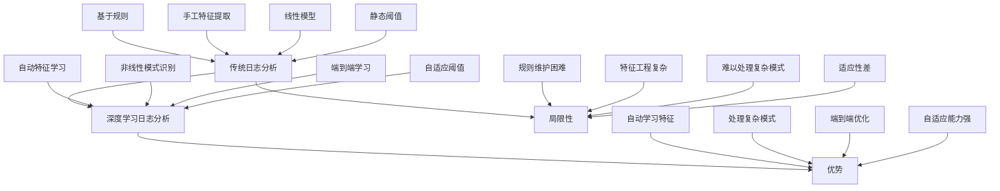

深度学习技术在日志数据分析领域展现出巨大的潜力，特别是在处理非结构化日志数据、自动模式识别和复杂异常检测方面。通过应用深度神经网络、自然语言处理和序列建模技术，我们可以构建智能的日志理解体系，实现日志数据的自动解析、分类、聚类和异常检测。本章将深入探讨如何应用深度学习技术进行日志数据的自动分析。

## 深度学习日志分析概述

### 深度学习在日志分析中的优势

深度学习技术为日志分析带来了独特的优势，能够处理传统方法难以解决的复杂问题：



### 深度学习应用场景

```yaml
# 深度学习日志分析应用场景
deep_learning_applications:
  log_parsing:
    description: "日志解析"
    techniques:
      - 循环神经网络(RNN)
      - 长短期记忆网络(LSTM)
      - 注意力机制
      - Transformer模型
    benefits:
      - 自动模板生成
      - 参数提取
      - 多语言支持
      - 实时解析
      
  log_classification:
    description: "日志分类"
    techniques:
      - 卷积神经网络(CNN)
      - 文本分类模型
      - 预训练语言模型
      - 集成学习
    benefits:
      - 自动分类
      - 多类别支持
      - 高准确率
      - 可解释性
      
  anomaly_detection:
    description: "异常检测"
    techniques:
      - 自编码器(Autoencoder)
      - 变分自编码器(VAE)
      - 生成对抗网络(GAN)
      - 强化学习
    benefits:
      - 无监督学习
      - 复杂模式识别
      - 实时检测
      - 自适应阈值
      
  root_cause_analysis:
    description: "根因分析"
    techniques:
      - 图神经网络(GNN)
      - 注意力机制
      - 序列到序列模型
      - 强化学习
    benefits:
      - 关联分析
      - 路径追踪
      - 自动推理
      - 可解释性
```

## 自然语言处理在日志分析中的应用

### 日志文本预处理

```python
# 日志文本预处理
import re
import nltk
from nltk.corpus import stopwords
from nltk.tokenize import word_tokenize
from nltk.stem import WordNetLemmatizer
import numpy as np

class LogTextPreprocessor:
    def __init__(self, language='english'):
        self.language = language
        self.stop_words = set(stopwords.words(language))
        self.lemmatizer = WordNetLemmatizer()
        
    def clean_log_text(self, log_text):
        """清理日志文本"""
        # 转换为小写
        text = log_text.lower()
        
        # 移除时间戳
        text = re.sub(r'\d{4}-\d{2}-\d{2}[T\s]\d{2}:\d{2}:\d{2}(?:\.\d{3})?(?:Z|[+-]\d{2}:\d{2})?', '', text)
        text = re.sub(r'\d{2}/\d{2}/\d{4}\s\d{2}:\d{2}:\d{2}', '', text)
        
        # 移除IP地址
        text = re.sub(r'\b\d{1,3}\.\d{1,3}\.\d{1,3}\.\d{1,3}\b', '', text)
        
        # 移除GUID/UUID
        text = re.sub(r'[0-9a-f]{8}-[0-9a-f]{4}-[0-9a-f]{4}-[0-9a-f]{4}-[0-9a-f]{12}', '', text)
        
        # 移除数字（保留有意义的数字）
        text = re.sub(r'\b\d+\b', '<NUM>', text)
        
        # 移除特殊字符，保留字母和空格
        text = re.sub(r'[^a-zA-Z\s]', ' ', text)
        
        # 移除多余空格
        text = re.sub(r'\s+', ' ', text).strip()
        
        return text
    
    def tokenize_and_lemmatize(self, text):
        """分词和词形还原"""
        # 分词
        tokens = word_tokenize(text)
        
        # 移除停用词和短词
        tokens = [token for token in tokens if token not in self.stop_words and len(token) > 2]
        
        # 词形还原
        tokens = [self.lemmatizer.lemmatize(token) for token in tokens]
        
        return tokens
    
    def preprocess_log_batch(self, log_lines):
        """批量预处理日志"""
        processed_logs = []
        for log_line in log_lines:
            cleaned_text = self.clean_log_text(log_line)
            tokens = self.tokenize_and_lemmatize(cleaned_text)
            processed_logs.append(tokens)
        return processed_logs

# 使用示例
preprocessor = LogTextPreprocessor()

# 测试日志数据
test_logs = [
    "2025-08-31T10:30:00 INFO User login successful for user123 from 192.168.1.1",
    "2025-08-31T10:31:00 ERROR Database connection failed for user456 - timeout after 30 seconds",
    "2025-08-31T10:32:00 WARNING High memory usage detected: 85% on server-001",
    "2025-08-31T10:33:00 CRITICAL System crash occurred in process payment-service",
    "2025-08-31T10:34:00 DEBUG Processing request ID: a1b2c3d4-e5f6-7890-g1h2-i3j4k5l6m7n8"
]

# 预处理日志
processed_logs = preprocessor.preprocess_log_batch(test_logs)

print("Processed Logs:")
for i, tokens in enumerate(processed_logs):
    print(f"Log {i+1}: {tokens}")
```

### 基于BERT的日志分类

```python
# 基于BERT的日志分类
from transformers import AutoTokenizer, AutoModelForSequenceClassification, Trainer, TrainingArguments
import torch
from torch.utils.data import Dataset
import numpy as np

class LogClassificationDataset(Dataset):
    def __init__(self, texts, labels, tokenizer, max_length=128):
        self.texts = texts
        self.labels = labels
        self.tokenizer = tokenizer
        self.max_length = max_length
        
    def __len__(self):
        return len(self.texts)
    
    def __getitem__(self, idx):
        text = str(self.texts[idx])
        label = self.labels[idx]
        
        encoding = self.tokenizer(
            text,
            truncation=True,
            padding='max_length',
            max_length=self.max_length,
            return_tensors='pt'
        )
        
        return {
            'input_ids': encoding['input_ids'].flatten(),
            'attention_mask': encoding['attention_mask'].flatten(),
            'labels': torch.tensor(label, dtype=torch.long)
        }

class BERTLogClassifier:
    def __init__(self, model_name='bert-base-uncased', num_labels=4):
        self.model_name = model_name
        self.num_labels = num_labels
        self.tokenizer = AutoTokenizer.from_pretrained(model_name)
        self.model = AutoModelForSequenceClassification.from_pretrained(
            model_name, 
            num_labels=num_labels
        )
        self.label_mapping = {
            0: 'INFO',
            1: 'WARNING',
            2: 'ERROR',
            3: 'CRITICAL'
        }
        
    def prepare_data(self, log_texts, log_labels):
        """准备训练数据"""
        # 转换标签为数字
        label_to_id = {v: k for k, v in self.label_mapping.items()}
        numeric_labels = [label_to_id.get(label, 0) for label in log_labels]
        
        dataset = LogClassificationDataset(
            log_texts, 
            numeric_labels, 
            self.tokenizer
        )
        
        return dataset
    
    def train(self, train_dataset, eval_dataset=None, epochs=3, batch_size=16):
        """训练模型"""
        training_args = TrainingArguments(
            output_dir='./results',
            num_train_epochs=epochs,
            per_device_train_batch_size=batch_size,
            per_device_eval_batch_size=batch_size,
            warmup_steps=500,
            weight_decay=0.01,
            logging_dir='./logs',
            evaluation_strategy="epoch" if eval_dataset else "no",
            save_strategy="epoch",
            load_best_model_at_end=True if eval_dataset else False,
        )
        
        trainer = Trainer(
            model=self.model,
            args=training_args,
            train_dataset=train_dataset,
            eval_dataset=eval_dataset,
        )
        
        trainer.train()
        return trainer
    
    def predict(self, log_texts):
        """预测日志类别"""
        self.model.eval()
        predictions = []
        
        for text in log_texts:
            inputs = self.tokenizer(
                text,
                return_tensors='pt',
                truncation=True,
                padding=True,
                max_length=128
            )
            
            with torch.no_grad():
                outputs = self.model(**inputs)
                predicted_class = torch.argmax(outputs.logits, dim=1).item()
                confidence = torch.softmax(outputs.logits, dim=1).max().item()
                
                predictions.append({
                    'predicted_label': self.label_mapping[predicted_class],
                    'confidence': confidence,
                    'class_id': predicted_class
                })
        
        return predictions

# 使用示例
# 模拟训练数据
train_texts = [
    "User login successful",
    "Database connection failed timeout",
    "High memory usage detected",
    "System crash occurred",
    "Processing request completed",
    "Authentication failed invalid credentials",
    "Disk space running low",
    "Service unavailable timeout",
    "User logout successful",
    "Cache cleared successfully"
]

train_labels = [
    "INFO", "ERROR", "WARNING", "CRITICAL", "INFO",
    "ERROR", "WARNING", "ERROR", "INFO", "INFO"
]

# 初始化分类器
classifier = BERTLogClassifier(num_labels=4)

# 准备数据
train_dataset = classifier.prepare_data(train_texts, train_labels)

# 训练模型（简化示例，实际使用时需要更多数据）
# trainer = classifier.train(train_dataset, epochs=1, batch_size=2)

# 预测示例
test_logs = [
    "User authentication successful",
    "Database connection timeout error",
    "Memory usage exceeded threshold",
    "Critical system failure"
]

# predictions = classifier.predict(test_logs)
# for log, pred in zip(test_logs, predictions):
#     print(f"Log: {log}")
#     print(f"Predicted: {pred['predicted_label']} (Confidence: {pred['confidence']:.2f})")
#     print("-" * 50)
```

## 序列建模与日志分析

### 基于LSTM的日志序列分析

```python
# 基于LSTM的日志序列分析
import torch
import torch.nn as nn
import torch.optim as optim
from torch.utils.data import Dataset, DataLoader
import numpy as np
from sklearn.preprocessing import LabelEncoder
from collections import Counter

class LogSequenceDataset(Dataset):
    def __init__(self, sequences, labels, sequence_length=50):
        self.sequences = sequences
        self.labels = labels
        self.sequence_length = sequence_length
        
    def __len__(self):
        return len(self.sequences)
    
    def __getitem__(self, idx):
        sequence = self.sequences[idx]
        label = self.labels[idx]
        
        # 填充或截断序列
        if len(sequence) > self.sequence_length:
            sequence = sequence[:self.sequence_length]
        else:
            sequence = sequence + [0] * (self.sequence_length - len(sequence))
        
        return {
            'sequence': torch.tensor(sequence, dtype=torch.long),
            'label': torch.tensor(label, dtype=torch.long)
        }

class LogLSTM(nn.Module):
    def __init__(self, vocab_size, embedding_dim=128, hidden_dim=256, num_layers=2, num_classes=2):
        super(LogLSTM, self).__init__()
        self.embedding = nn.Embedding(vocab_size, embedding_dim)
        self.lstm = nn.LSTM(
            embedding_dim, 
            hidden_dim, 
            num_layers, 
            batch_first=True, 
            dropout=0.2
        )
        self.dropout = nn.Dropout(0.5)
        self.fc = nn.Linear(hidden_dim, num_classes)
        
    def forward(self, x):
        # 嵌入层
        embedded = self.embedding(x)
        
        # LSTM层
        lstm_out, (hidden, cell) = self.lstm(embedded)
        
        # 使用最后一个时间步的输出
        last_output = lstm_out[:, -1, :]
        
        # 全连接层
        output = self.dropout(last_output)
        output = self.fc(output)
        
        return output

class SequenceLogAnalyzer:
    def __init__(self, vocab_size, device='cpu'):
        self.device = device
        self.vocab_size = vocab_size
        self.model = LogLSTM(vocab_size).to(device)
        self.criterion = nn.CrossEntropyLoss()
        self.optimizer = optim.Adam(self.model.parameters(), lr=0.001)
        self.label_encoder = LabelEncoder()
        
    def build_vocabulary(self, log_sequences):
        """构建词汇表"""
        all_tokens = []
        for sequence in log_sequences:
            all_tokens.extend(sequence)
        
        # 统计词频
        token_counts = Counter(all_tokens)
        
        # 构建词汇表（保留高频词）
        vocab = {token: idx + 1 for idx, (token, count) in enumerate(token_counts.most_common(self.vocab_size - 1))}
        vocab['<UNK>'] = 0  # 未知词
        
        return vocab
    
    def encode_sequences(self, log_sequences, vocab):
        """编码日志序列"""
        encoded_sequences = []
        for sequence in log_sequences:
            encoded = [vocab.get(token, 0) for token in sequence]
            encoded_sequences.append(encoded)
        return encoded_sequences
    
    def train(self, train_loader, epochs=10):
        """训练模型"""
        self.model.train()
        for epoch in range(epochs):
            total_loss = 0
            correct = 0
            total = 0
            
            for batch in train_loader:
                sequences = batch['sequence'].to(self.device)
                labels = batch['label'].to(self.device)
                
                self.optimizer.zero_grad()
                outputs = self.model(sequences)
                loss = self.criterion(outputs, labels)
                loss.backward()
                self.optimizer.step()
                
                total_loss += loss.item()
                _, predicted = torch.max(outputs.data, 1)
                total += labels.size(0)
                correct += (predicted == labels).sum().item()
            
            accuracy = 100 * correct / total
            avg_loss = total_loss / len(train_loader)
            print(f'Epoch [{epoch+1}/{epochs}], Loss: {avg_loss:.4f}, Accuracy: {accuracy:.2f}%')
    
    def predict(self, test_loader):
        """预测"""
        self.model.eval()
        predictions = []
        probabilities = []
        
        with torch.no_grad():
            for batch in test_loader:
                sequences = batch['sequence'].to(self.device)
                outputs = self.model(sequences)
                probs = torch.softmax(outputs, dim=1)
                _, predicted = torch.max(outputs, 1)
                
                predictions.extend(predicted.cpu().numpy())
                probabilities.extend(probs.cpu().numpy())
        
        return predictions, probabilities

# 使用示例
# 模拟日志序列数据
np.random.seed(42)

# 生成正常序列
normal_sequences = []
for _ in range(100):
    sequence = np.random.choice(['INFO', 'DEBUG', 'WARNING'], size=30, p=[0.7, 0.2, 0.1]).tolist()
    normal_sequences.append(sequence)

# 生成异常序列
anomaly_sequences = []
for _ in range(20):
    sequence = np.random.choice(['ERROR', 'CRITICAL', 'FATAL'], size=30, p=[0.6, 0.3, 0.1]).tolist()
    anomaly_sequences.append(sequence)

# 合并数据
all_sequences = normal_sequences + anomaly_sequences
all_labels = [0] * len(normal_sequences) + [1] * len(anomaly_sequences)

# 构建词汇表
analyzer = SequenceLogAnalyzer(vocab_size=100)
vocab = analyzer.build_vocabulary(all_sequences)

# 编码序列
encoded_sequences = analyzer.encode_sequences(all_sequences, vocab)

# 创建数据集
dataset = LogSequenceDataset(encoded_sequences, all_labels, sequence_length=30)
dataloader = DataLoader(dataset, batch_size=16, shuffle=True)

# 训练模型
# analyzer.train(dataloader, epochs=5)
```

### Transformer日志序列建模

```python
# 基于Transformer的日志序列建模
import torch
import torch.nn as nn
import torch.optim as optim
import math

class PositionalEncoding(nn.Module):
    def __init__(self, d_model, max_len=5000):
        super(PositionalEncoding, self).__init__()
        
        pe = torch.zeros(max_len, d_model)
        position = torch.arange(0, max_len, dtype=torch.float).unsqueeze(1)
        div_term = torch.exp(torch.arange(0, d_model, 2).float() * (-math.log(10000.0) / d_model))
        pe[:, 0::2] = torch.sin(position * div_term)
        pe[:, 1::2] = torch.cos(position * div_term)
        pe = pe.unsqueeze(0).transpose(0, 1)
        self.register_buffer('pe', pe)
        
    def forward(self, x):
        x = x + self.pe[:x.size(0), :]
        return x

class LogTransformer(nn.Module):
    def __init__(self, vocab_size, d_model=128, nhead=8, num_layers=4, num_classes=2, dropout=0.1):
        super(LogTransformer, self).__init__()
        self.d_model = d_model
        self.embedding = nn.Embedding(vocab_size, d_model)
        self.pos_encoder = PositionalEncoding(d_model)
        
        encoder_layers = nn.TransformerEncoderLayer(
            d_model=d_model,
            nhead=nhead,
            dropout=dropout,
            batch_first=True
        )
        self.transformer_encoder = nn.TransformerEncoder(encoder_layers, num_layers)
        self.fc = nn.Linear(d_model, num_classes)
        self.dropout = nn.Dropout(dropout)
        
    def forward(self, src):
        # 嵌入和位置编码
        src = self.embedding(src) * math.sqrt(self.d_model)
        src = self.pos_encoder(src.transpose(0, 1)).transpose(0, 1)
        
        # Transformer编码
        output = self.transformer_encoder(src)
        
        # 全局平均池化
        output = torch.mean(output, dim=1)
        
        # 分类层
        output = self.dropout(output)
        output = self.fc(output)
        
        return output

class TransformerLogAnalyzer:
    def __init__(self, vocab_size, device='cpu'):
        self.device = device
        self.vocab_size = vocab_size
        self.model = LogTransformer(vocab_size).to(device)
        self.criterion = nn.CrossEntropyLoss()
        self.optimizer = optim.Adam(self.model.parameters(), lr=0.001)
        
    def train(self, train_loader, epochs=10):
        """训练Transformer模型"""
        self.model.train()
        for epoch in range(epochs):
            total_loss = 0
            correct = 0
            total = 0
            
            for batch in train_loader:
                sequences = batch['sequence'].to(self.device)
                labels = batch['label'].to(self.device)
                
                self.optimizer.zero_grad()
                outputs = self.model(sequences)
                loss = self.criterion(outputs, labels)
                loss.backward()
                self.optimizer.step()
                
                total_loss += loss.item()
                _, predicted = torch.max(outputs.data, 1)
                total += labels.size(0)
                correct += (predicted == labels).sum().item()
            
            accuracy = 100 * correct / total
            avg_loss = total_loss / len(train_loader)
            print(f'Epoch [{epoch+1}/{epochs}], Loss: {avg_loss:.4f}, Accuracy: {accuracy:.2f}%')
    
    def predict_sequence_pattern(self, sequence, vocab):
        """预测序列模式"""
        self.model.eval()
        
        # 编码序列
        encoded = [vocab.get(token, 0) for token in sequence]
        if len(encoded) < 50:
            encoded = encoded + [0] * (50 - len(encoded))
        else:
            encoded = encoded[:50]
        
        sequence_tensor = torch.tensor([encoded], dtype=torch.long).to(self.device)
        
        with torch.no_grad():
            output = self.model(sequence_tensor)
            probabilities = torch.softmax(output, dim=1)
            predicted_class = torch.argmax(output, dim=1).item()
            confidence = probabilities[0][predicted_class].item()
        
        return {
            'predicted_class': predicted_class,
            'confidence': confidence,
            'probabilities': probabilities.cpu().numpy()[0]
        }

# 使用示例
# 初始化Transformer分析器
transformer_analyzer = TransformerLogAnalyzer(vocab_size=100)

# 训练模型（需要实际数据）
# transformer_analyzer.train(dataloader, epochs=5)
```

## 自编码器在日志异常检测中的应用

### 基于LSTM的自编码器

```python
# 基于LSTM的自编码器异常检测
import torch
import torch.nn as nn
import torch.optim as optim
import numpy as np

class LSTMAutoencoder(nn.Module):
    def __init__(self, input_size, hidden_size, num_layers=2):
        super(LSTMAutoencoder, self).__init__()
        self.input_size = input_size
        self.hidden_size = hidden_size
        self.num_layers = num_layers
        
        # 编码器
        self.encoder = nn.LSTM(
            input_size, 
            hidden_size, 
            num_layers, 
            batch_first=True,
            dropout=0.2
        )
        
        # 解码器
        self.decoder = nn.LSTM(
            hidden_size, 
            hidden_size, 
            num_layers, 
            batch_first=True,
            dropout=0.2
        )
        
        # 输出层
        self.output_layer = nn.Linear(hidden_size, input_size)
        
    def forward(self, x):
        # 编码
        encoded, (hidden, cell) = self.encoder(x)
        
        # 解码
        decoded, _ = self.decoder(encoded)
        
        # 输出
        output = self.output_layer(decoded)
        
        return output

class LogAnomalyDetector:
    def __init__(self, input_size, hidden_size=64, device='cpu'):
        self.device = device
        self.input_size = input_size
        self.model = LSTMAutoencoder(input_size, hidden_size).to(device)
        self.criterion = nn.MSELoss()
        self.optimizer = optim.Adam(self.model.parameters(), lr=0.001)
        self.threshold = None
        
    def train(self, train_data, epochs=50, batch_size=32):
        """训练自编码器"""
        self.model.train()
        train_tensor = torch.FloatTensor(train_data).to(self.device)
        
        for epoch in range(epochs):
            total_loss = 0
            num_batches = 0
            
            for i in range(0, len(train_tensor), batch_size):
                batch = train_tensor[i:i+batch_size]
                
                self.optimizer.zero_grad()
                reconstructed = self.model(batch)
                loss = self.criterion(reconstructed, batch)
                loss.backward()
                self.optimizer.step()
                
                total_loss += loss.item()
                num_batches += 1
            
            avg_loss = total_loss / num_batches
            if (epoch + 1) % 10 == 0:
                print(f'Epoch [{epoch+1}/{epochs}], Loss: {avg_loss:.6f}')
        
        # 计算异常阈值
        self.calculate_threshold(train_data)
        
    def calculate_threshold(self, normal_data, percentile=95):
        """计算异常阈值"""
        self.model.eval()
        normal_tensor = torch.FloatTensor(normal_data).to(self.device)
        
        with torch.no_grad():
            reconstructed = self.model(normal_tensor)
            mse = torch.mean((normal_tensor - reconstructed) ** 2, dim=(1, 2))
            self.threshold = torch.percentile(mse, percentile).item()
            
        print(f"Anomaly threshold set to: {self.threshold:.6f}")
        
    def detect_anomalies(self, test_data):
        """检测异常"""
        self.model.eval()
        test_tensor = torch.FloatTensor(test_data).to(self.device)
        
        with torch.no_grad():
            reconstructed = self.model(test_tensor)
            mse = torch.mean((test_tensor - reconstructed) ** 2, dim=(1, 2))
            anomalies = mse > self.threshold
            
            return {
                'is_anomaly': anomalies.cpu().numpy(),
                'reconstruction_error': mse.cpu().numpy(),
                'threshold': self.threshold
            }

# 使用示例
# 生成模拟的日志特征数据
np.random.seed(42)
normal_data = np.random.normal(0, 0.1, (1000, 50, 10))  # 1000个正常序列，每个序列50步，10个特征
anomaly_data = np.random.normal(0, 0.5, (100, 50, 10))   # 100个异常序列

# 训练异常检测器
detector = LogAnomalyDetector(input_size=10)
detector.train(normal_data, epochs=30)

# 检测异常
test_data = np.vstack([normal_data[:100], anomaly_data[:50]])  # 混合测试数据
results = detector.detect_anomalies(test_data)

print(f"Detected anomalies: {np.sum(results['is_anomaly'])}")
print(f"Anomaly rate: {np.mean(results['is_anomaly']):.2%}")
```

### 变分自编码器(VAE)日志分析

```python
# 基于VAE的日志分析
import torch
import torch.nn as nn
import torch.optim as optim
from torch.distributions import Normal

class LogVAE(nn.Module):
    def __init__(self, input_dim, hidden_dim=128, latent_dim=32):
        super(LogVAE, self).__init__()
        self.input_dim = input_dim
        self.hidden_dim = hidden_dim
        self.latent_dim = latent_dim
        
        # 编码器
        self.encoder = nn.Sequential(
            nn.Linear(input_dim, hidden_dim),
            nn.ReLU(),
            nn.Linear(hidden_dim, hidden_dim),
            nn.ReLU()
        )
        
        # 均值和方差编码
        self.fc_mu = nn.Linear(hidden_dim, latent_dim)
        self.fc_var = nn.Linear(hidden_dim, latent_dim)
        
        # 解码器
        self.decoder = nn.Sequential(
            nn.Linear(latent_dim, hidden_dim),
            nn.ReLU(),
            nn.Linear(hidden_dim, hidden_dim),
            nn.ReLU(),
            nn.Linear(hidden_dim, input_dim),
            nn.Sigmoid()  # 假设输入已归一化到[0,1]
        )
        
    def encode(self, x):
        h = self.encoder(x)
        mu = self.fc_mu(h)
        log_var = self.fc_var(h)
        return mu, log_var
    
    def reparameterize(self, mu, log_var):
        std = torch.exp(0.5 * log_var)
        eps = torch.randn_like(std)
        return mu + eps * std
    
    def decode(self, z):
        return self.decoder(z)
    
    def forward(self, x):
        mu, log_var = self.encode(x)
        z = self.reparameterize(mu, log_var)
        recon_x = self.decode(z)
        return recon_x, mu, log_var

class VAELogAnalyzer:
    def __init__(self, input_dim, device='cpu'):
        self.device = device
        self.input_dim = input_dim
        self.model = LogVAE(input_dim).to(device)
        self.optimizer = optim.Adam(self.model.parameters(), lr=0.001)
        
    def loss_function(self, recon_x, x, mu, log_var):
        """VAE损失函数"""
        # 重构损失
        recon_loss = nn.functional.binary_cross_entropy(recon_x, x, reduction='sum')
        
        # KL散度损失
        kl_loss = -0.5 * torch.sum(1 + log_var - mu.pow(2) - log_var.exp())
        
        return recon_loss + kl_loss
    
    def train(self, train_data, epochs=50, batch_size=32):
        """训练VAE模型"""
        self.model.train()
        train_tensor = torch.FloatTensor(train_data).to(self.device)
        
        for epoch in range(epochs):
            total_loss = 0
            num_batches = 0
            
            for i in range(0, len(train_tensor), batch_size):
                batch = train_tensor[i:i+batch_size]
                
                self.optimizer.zero_grad()
                recon_batch, mu, log_var = self.model(batch)
                loss = self.loss_function(recon_batch, batch, mu, log_var)
                loss.backward()
                self.optimizer.step()
                
                total_loss += loss.item()
                num_batches += 1
            
            avg_loss = total_loss / num_batches
            if (epoch + 1) % 10 == 0:
                print(f'Epoch [{epoch+1}/{epochs}], Loss: {avg_loss:.4f}')
    
    def detect_anomalies(self, test_data, threshold=3.0):
        """基于重构概率检测异常"""
        self.model.eval()
        test_tensor = torch.FloatTensor(test_data).to(self.device)
        
        with torch.no_grad():
            recon_data, mu, log_var = self.model(test_tensor)
            
            # 计算重构误差
            recon_error = torch.mean((test_tensor - recon_data) ** 2, dim=1)
            
            # 计算对数似然
            std = torch.exp(0.5 * log_var)
            dist = Normal(mu, std)
            log_prob = dist.log_prob(test_tensor).sum(dim=1)
            
            # 检测异常
            anomalies = recon_error > threshold
            
            return {
                'is_anomaly': anomalies.cpu().numpy(),
                'reconstruction_error': recon_error.cpu().numpy(),
                'log_probability': log_prob.cpu().numpy()
            }
    
    def generate_synthetic_logs(self, num_samples=100):
        """生成合成日志数据"""
        self.model.eval()
        with torch.no_grad():
            # 从标准正态分布采样
            z = torch.randn(num_samples, self.model.latent_dim).to(self.device)
            synthetic_data = self.model.decode(z)
            return synthetic_data.cpu().numpy()

# 使用示例
# 生成模拟日志数据
np.random.seed(42)
normal_logs = np.random.beta(2, 5, (1000, 50))  # 1000个正常日志样本
anomaly_logs = np.random.beta(5, 2, (100, 50))   # 100个异常日志样本

# 训练VAE分析器
vae_analyzer = VAELogAnalyzer(input_dim=50)
vae_analyzer.train(normal_logs, epochs=30)

# 检测异常
test_logs = np.vstack([normal_logs[:100], anomaly_logs[:50]])
results = vae_analyzer.detect_anomalies(test_logs, threshold=0.1)

print(f"VAE detected anomalies: {np.sum(results['is_anomaly'])}")
print(f"Anomaly rate: {np.mean(results['is_anomaly']):.2%}")

# 生成合成日志
synthetic_logs = vae_analyzer.generate_synthetic_logs(10)
print(f"Generated {len(synthetic_logs)} synthetic log samples")
```

## 智能日志理解系统

### 端到端日志分析管道

```yaml
# 端到端日志分析管道
end_to_end_log_analysis_pipeline:
  data_ingestion:
    description: "数据摄入"
    components:
      - Log Collectors: 日志收集器
      - Data Preprocessing: 数据预处理
      - Feature Engineering: 特征工程
      - Data Validation: 数据验证
      
  model_processing:
    description: "模型处理"
    components:
      - Text Processing: 文本处理
      - Sequence Modeling: 序列建模
      - Anomaly Detection: 异常检测
      - Classification: 分类模型
      
  analysis_engine:
    description: "分析引擎"
    components:
      - Pattern Recognition: 模式识别
      - Root Cause Analysis: 根因分析
      - Trend Analysis: 趋势分析
      - Predictive Analytics: 预测分析
      
  output_generation:
    description: "输出生成"
    components:
      - Alert Generation: 告警生成
      - Report Generation: 报告生成
      - Visualization: 可视化
      - API Integration: API集成
      
  feedback_loop:
    description: "反馈循环"
    components:
      - Model Retraining: 模型重训练
      - Performance Monitoring: 性能监控
      - Continuous Learning: 持续学习
      - Human Feedback: 人工反馈
```

### 智能日志分析框架

```python
# 智能日志分析框架
import torch
import numpy as np
from datetime import datetime
import json

class IntelligentLogAnalyzer:
    def __init__(self, config=None):
        self.config = config or {}
        self.models = {}
        self.preprocessor = LogTextPreprocessor()
        self.is_trained = False
        self.performance_metrics = {}
        
    def add_model(self, name, model):
        """添加模型"""
        self.models[name] = model
        
    def preprocess_logs(self, raw_logs):
        """预处理日志"""
        processed_logs = []
        for log in raw_logs:
            # 清理和标准化
            cleaned = self.preprocessor.clean_log_text(log)
            tokens = self.preprocessor.tokenize_and_lemmatize(cleaned)
            processed_logs.append({
                'original': log,
                'cleaned': cleaned,
                'tokens': tokens,
                'timestamp': datetime.now().isoformat()
            })
        return processed_logs
    
    def extract_features(self, processed_logs):
        """提取特征"""
        features = []
        for log in processed_logs:
            feature_dict = {
                'token_count': len(log['tokens']),
                'unique_tokens': len(set(log['tokens'])),
                'token_diversity': len(set(log['tokens'])) / len(log['tokens']) if log['tokens'] else 0,
                'has_error_keywords': any(keyword in log['cleaned'] for keyword in ['error', 'fail', 'critical']),
                'has_warning_keywords': any(keyword in log['cleaned'] for keyword in ['warning', 'warn', 'alert']),
                'log_length': len(log['original']),
                'uppercase_ratio': sum(c.isupper() for c in log['original']) / len(log['original']) if log['original'] else 0
            }
            features.append(feature_dict)
        return features
    
    def analyze_logs(self, raw_logs):
        """分析日志"""
        if not self.is_trained:
            raise ValueError("Models not trained yet")
        
        # 预处理
        processed_logs = self.preprocess_logs(raw_logs)
        
        # 提取特征
        features = self.extract_features(processed_logs)
        
        # 使用不同模型进行分析
        results = {
            'timestamp': datetime.now().isoformat(),
            'total_logs': len(raw_logs),
            'processed_logs': processed_logs,
            'features': features
        }
        
        # 分类分析
        if 'classifier' in self.models:
            classifications = self.models['classifier'].predict([log['cleaned'] for log in processed_logs])
            results['classifications'] = classifications
        
        # 异常检测
        if 'anomaly_detector' in self.models:
            feature_matrix = np.array([[f[key] for key in sorted(f.keys())] for f in features])
            anomalies = self.models['anomaly_detector'].detect_anomalies(feature_matrix)
            results['anomalies'] = anomalies
        
        # 序列分析
        if 'sequence_analyzer' in self.models:
            # 这里需要实现序列分析逻辑
            pass
        
        return results
    
    def train_models(self, training_data):
        """训练所有模型"""
        print("Training intelligent log analysis models...")
        
        # 训练分类器
        if 'classifier' in self.models:
            print("Training classifier...")
            # 实现分类器训练逻辑
        
        # 训练异常检测器
        if 'anomaly_detector' in self.models:
            print("Training anomaly detector...")
            # 实现异常检测器训练逻辑
        
        # 训练序列分析器
        if 'sequence_analyzer' in self.models:
            print("Training sequence analyzer...")
            # 实现序列分析器训练逻辑
        
        self.is_trained = True
        print("All models trained successfully!")
    
    def generate_report(self, analysis_results):
        """生成分析报告"""
        report = {
            'analysis_timestamp': analysis_results['timestamp'],
            'summary': {
                'total_logs_processed': analysis_results['total_logs'],
                'anomalies_detected': int(np.sum(analysis_results.get('anomalies', {}).get('is_anomaly', []))),
                'error_logs': len([c for c in analysis_results.get('classifications', []) if c.get('predicted_label') == 'ERROR']),
                'warning_logs': len([c for c in analysis_results.get('classifications', []) if c.get('predicted_label') == 'WARNING'])
            },
            'detailed_results': analysis_results
        }
        
        return report
    
    def save_model(self, filepath):
        """保存模型"""
        model_state = {
            'models': {},
            'config': self.config,
            'is_trained': self.is_trained,
            'performance_metrics': self.performance_metrics
        }
        
        # 保存各个模型的状态
        for name, model in self.models.items():
            if hasattr(model, 'state_dict'):
                model_state['models'][name] = model.state_dict()
        
        torch.save(model_state, filepath)
        print(f"Model saved to {filepath}")
    
    def load_model(self, filepath):
        """加载模型"""
        model_state = torch.load(filepath)
        
        self.config = model_state['config']
        self.is_trained = model_state['is_trained']
        self.performance_metrics = model_state['performance_metrics']
        
        # 加载各个模型的状态
        for name, state_dict in model_state['models'].items():
            if name in self.models and hasattr(self.models[name], 'load_state_dict'):
                self.models[name].load_state_dict(state_dict)
        
        print(f"Model loaded from {filepath}")

# 使用示例
# 初始化智能分析器
analyzer = IntelligentLogAnalyzer()

# 添加模型（简化示例）
# analyzer.add_model('classifier', bert_classifier)
# analyzer.add_model('anomaly_detector', log_anomaly_detector)

# 模拟日志数据
sample_logs = [
    "2025-08-31T10:30:00 INFO User login successful for user123",
    "2025-08-31T10:31:00 ERROR Database connection failed timeout",
    "2025-08-31T10:32:00 WARNING High memory usage detected 85%",
    "2025-08-31T10:33:00 CRITICAL System crash occurred process payment-service",
    "2025-08-31T10:34:00 INFO User logout successful for user123"
]

# 预处理日志
processed_logs = analyzer.preprocess_logs(sample_logs)

print("Intelligent Log Analysis Results:")
for i, log in enumerate(processed_logs):
    print(f"Log {i+1}:")
    print(f"  Original: {log['original']}")
    print(f"  Cleaned: {log['cleaned']}")
    print(f"  Tokens: {log['tokens']}")
    print()

# 提取特征
features = analyzer.extract_features(processed_logs)
print("Extracted Features:")
for i, feature in enumerate(features):
    print(f"Log {i+1} features: {feature}")
```

## 最佳实践总结

### 1. 模型架构设计

```yaml
# 深度学习模型架构设计最佳实践
model_architecture_best_practices:
  network_design:
    guidelines:
      - "根据数据特点选择合适的网络架构"
      - "平衡模型复杂度和性能"
      - "考虑计算资源限制"
      - "实现模型的可扩展性"
      
  training_strategy:
    guidelines:
      - "使用合适的损失函数"
      - "实施正则化技术"
      - "监控训练过程"
      - "防止过拟合"
      
  evaluation_metrics:
    guidelines:
      - "选择合适的评估指标"
      - "实施交叉验证"
      - "监控模型漂移"
      - "定期重新训练"
```

### 2. 数据处理最佳实践

```yaml
# 数据处理最佳实践
data_processing_best_practices:
  data_quality:
    guidelines:
      - "确保数据完整性和准确性"
      - "实施数据清洗和验证"
      - "处理缺失值和异常值"
      - "维护数据一致性"
      
  feature_engineering:
    guidelines:
      - "提取有意义的特征"
      - "处理特征相关性"
      - "特征缩放和标准化"
      - "特征选择和降维"
      
  data_augmentation:
    guidelines:
      - "增加训练数据多样性"
      - "保持数据分布特性"
      - "避免过拟合"
      - "提高模型泛化能力"
```

## 总结

深度学习与日志数据的自动分析为现代微服务系统的日志处理提供了强大的智能化能力。通过应用自然语言处理、序列建模、自编码器等深度学习技术，我们可以构建智能的日志理解体系，实现日志数据的自动解析、分类、聚类和异常检测。

关键要点包括：
1. **多样化模型架构**：应用LSTM、Transformer、自编码器等不同架构
2. **端到端处理**：构建完整的日志分析管道
3. **智能特征提取**：自动学习日志数据的特征表示
4. **异常检测能力**：实现复杂模式的异常识别

通过遵循最佳实践，合理选择和应用深度学习技术，可以为微服务系统构建先进的智能日志分析体系，显著提升系统的可观察性和运维效率。

在下一节中，我们将探讨智能告警与动态阈值的应用。