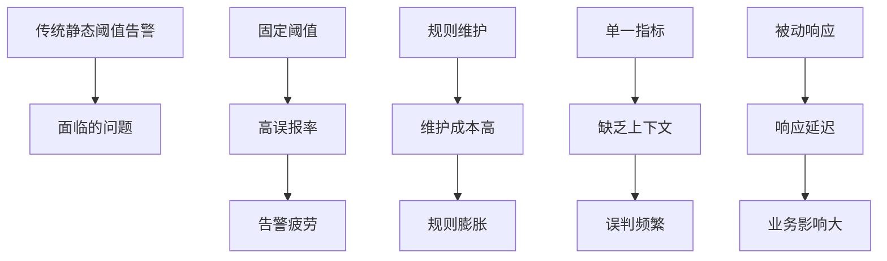

传统的基于静态阈值的告警系统在现代复杂的微服务架构中面临着越来越多的挑战，包括高误报率、难以适应业务变化、无法处理复杂模式等问题。智能告警与动态阈值技术通过应用机器学习、统计分析和自适应算法，能够自动调整告警阈值、识别复杂异常模式、减少误报漏报，构建更加智能和自适应的监控告警体系。本章将深入探讨如何实现智能告警与动态阈值系统。

## 智能告警系统概述

### 传统告警的局限性

传统基于静态阈值的告警系统存在明显的局限性，在现代微服务环境中难以满足需求：



### 智能告警的优势

```yaml
# 智能告警系统优势
intelligent_alerting_advantages:
  adaptive_thresholds:
    description: "自适应阈值"
    benefits:
      - 根据历史数据动态调整阈值
      - 适应业务模式变化
      - 减少误报和漏报
      - 提高告警准确性
      
  pattern_recognition:
    description: "模式识别"
    benefits:
      - 识别复杂异常模式
      - 发现未知问题类型
      - 关联多指标分析
      - 提前预警潜在风险
      
  noise_reduction:
    description: "噪音减少"
    benefits:
      - 智能告警去重
      - 告警抑制策略
      - 优先级排序
      - 根因聚合
      
  automated_response:
    description: "自动化响应"
    benefits:
      - 自动处理常见问题
      - 减少人工干预
      - 提高响应速度
      - 降低运维成本
```

## 动态阈值算法实现

### 基于统计的动态阈值

```python
# 基于统计的动态阈值算法
import numpy as np
import pandas as pd
from scipy import stats
from datetime import datetime, timedelta
import warnings
warnings.filterwarnings('ignore')

class StatisticalDynamicThreshold:
    def __init__(self, window_size=100, confidence_level=0.95, seasonal_adjustment=True):
        self.window_size = window_size
        self.confidence_level = confidence_level
        self.seasonal_adjustment = seasonal_adjustment
        self.history = []
        self.seasonal_patterns = {}
        
    def calculate_threshold(self, current_data, timestamp=None):
        """计算动态阈值"""
        # 添加当前数据到历史记录
        self.history.append(current_data)
        
        # 保持窗口大小
        if len(self.history) > self.window_size:
            self.history = self.history[-self.window_size:]
        
        if len(self.history) < 10:  # 数据不足时使用简单统计
            mean_val = np.mean(self.history)
            std_val = np.std(self.history)
            threshold = mean_val + 2 * std_val
            return {
                'threshold': threshold,
                'lower_bound': mean_val - 2 * std_val,
                'upper_bound': threshold,
                'confidence_interval': 2 * std_val,
                'method': 'simple_statistics'
            }
        
        # 计算基本统计阈值
        data_array = np.array(self.history)
        mean_val = np.mean(data_array)
        std_val = np.std(data_array)
        
        # 计算置信区间
        confidence_interval = std_val * stats.norm.ppf((1 + self.confidence_level) / 2)
        
        # 季节性调整
        if self.seasonal_adjustment and timestamp:
            seasonal_factor = self._get_seasonal_factor(timestamp)
            adjusted_mean = mean_val * seasonal_factor
            threshold = adjusted_mean + confidence_interval
        else:
            threshold = mean_val + confidence_interval
        
        return {
            'threshold': threshold,
            'lower_bound': mean_val - confidence_interval,
            'upper_bound': threshold,
            'confidence_interval': confidence_interval,
            'method': 'statistical_dynamic',
            'sample_size': len(self.history)
        }
    
    def _get_seasonal_factor(self, timestamp):
        """获取季节性因子"""
        if isinstance(timestamp, str):
            timestamp = datetime.fromisoformat(timestamp)
        
        # 提取时间特征
        hour = timestamp.hour
        day_of_week = timestamp.weekday()
        
        # 简单的季节性模式（实际应用中需要基于历史数据学习）
        # 工作日高峰时段因子
        if day_of_week < 5 and 9 <= hour <= 17:
            return 1.2  # 工作日高峰
        elif day_of_week >= 5:
            return 0.8   # 周末低峰
        else:
            return 1.0   # 平时
    
    def update_seasonal_patterns(self, data_points, timestamps):
        """更新季节性模式"""
        # 这里可以实现更复杂的季节性学习算法
        pass
    
    def detect_anomaly(self, value, timestamp=None):
        """检测异常"""
        threshold_info = self.calculate_threshold(value, timestamp)
        is_anomaly = value > threshold_info['upper_bound'] or value < threshold_info['lower_bound']
        
        return {
            'is_anomaly': is_anomaly,
            'value': value,
            'threshold_info': threshold_info,
            'anomaly_score': abs(value - threshold_info['threshold']) / threshold_info['confidence_interval'] if threshold_info['confidence_interval'] > 0 else 0
        }

# 使用示例
# 创建动态阈值检测器
dynamic_threshold = StatisticalDynamicThreshold(
    window_size=50, 
    confidence_level=0.95,
    seasonal_adjustment=True
)

# 模拟时间序列数据（包含趋势和季节性）
np.random.seed(42)
base_time = datetime(2025, 1, 1)
timestamps = [base_time + timedelta(hours=i) for i in range(200)]

# 生成带有趋势和季节性的数据
trend = 0.1 * np.arange(200)  # 轻微上升趋势
seasonal = 10 * np.sin(2 * np.pi * np.arange(200) / 24)  # 日周期
noise = np.random.normal(0, 2, 200)
values = 50 + trend + seasonal + noise

# 检测异常
anomalies = []
for i, (timestamp, value) in enumerate(zip(timestamps, values)):
    result = dynamic_threshold.detect_anomaly(value, timestamp)
    if result['is_anomaly']:
        anomalies.append({
            'timestamp': timestamp,
            'value': value,
            'threshold': result['threshold_info']['threshold'],
            'anomaly_score': result['anomaly_score']
        })

print(f"Detected {len(anomalies)} anomalies out of {len(values)} data points")
print("First 5 anomalies:")
for anomaly in anomalies[:5]:
    print(f"  {anomaly['timestamp']}: {anomaly['value']:.2f} (score: {anomaly['anomaly_score']:.2f})")
```

### 基于机器学习的动态阈值

```python
# 基于机器学习的动态阈值
from sklearn.ensemble import IsolationForest, RandomForestRegressor
from sklearn.preprocessing import StandardScaler
from sklearn.model_selection import train_test_split
import numpy as np

class MLDynamicThreshold:
    def __init__(self, model_type='isolation_forest', window_size=100):
        self.model_type = model_type
        self.window_size = window_size
        self.history = []
        self.feature_history = []
        self.model = None
        self.scaler = StandardScaler()
        self.is_trained = False
        
    def extract_features(self, data_window, timestamp=None):
        """提取特征"""
        if len(data_window) == 0:
            return np.array([0] * 10)
        
        features = []
        
        # 基本统计特征
        features.append(np.mean(data_window))
        features.append(np.std(data_window))
        features.append(np.min(data_window))
        features.append(np.max(data_window))
        features.append(np.median(data_window))
        
        # 分位数特征
        features.append(np.percentile(data_window, 25))
        features.append(np.percentile(data_window, 75))
        
        # 趋势特征
        if len(data_window) > 1:
            trend = np.polyfit(range(len(data_window)), data_window, 1)[0]
            features.append(trend)
        else:
            features.append(0)
        
        # 波动性特征
        if len(data_window) > 1:
            diff = np.diff(data_window)
            features.append(np.std(diff))
            features.append(np.mean(np.abs(diff)))
        else:
            features.extend([0, 0])
        
        # 时间特征（如果有时间戳）
        if timestamp:
            if isinstance(timestamp, str):
                timestamp = datetime.fromisoformat(timestamp)
            features.append(timestamp.hour)
            features.append(timestamp.weekday())
        else:
            features.extend([0, 0])
        
        return np.array(features)
    
    def train_model(self, historical_data, timestamps=None):
        """训练模型"""
        if len(historical_data) < self.window_size:
            raise ValueError("Insufficient historical data for training")
        
        # 准备训练数据
        X = []
        y = []
        
        for i in range(self.window_size, len(historical_data)):
            window = historical_data[i-self.window_size:i]
            feature = self.extract_features(window, timestamps[i] if timestamps else None)
            X.append(feature)
            y.append(historical_data[i])
        
        X = np.array(X)
        y = np.array(y)
        
        # 标准化特征
        X_scaled = self.scaler.fit_transform(X)
        
        # 训练模型
        if self.model_type == 'isolation_forest':
            self.model = IsolationForest(contamination=0.1, random_state=42)
            self.model.fit(X_scaled)
        elif self.model_type == 'random_forest':
            self.model = RandomForestRegressor(n_estimators=100, random_state=42)
            self.model.fit(X_scaled, y)
        
        self.is_trained = True
        return self
    
    def predict_threshold(self, recent_data, timestamp=None):
        """预测阈值"""
        if not self.is_trained:
            raise ValueError("Model not trained yet")
        
        # 提取特征
        feature = self.extract_features(recent_data, timestamp)
        feature_scaled = self.scaler.transform([feature])
        
        if self.model_type == 'isolation_forest':
            # 对于孤立森林，使用异常分数作为阈值参考
            anomaly_score = self.model.decision_function(feature_scaled)[0]
            # 将异常分数转换为阈值（需要根据历史数据调整）
            threshold = np.mean(recent_data) + 2 * np.std(recent_data) * (1 - anomaly_score)
            return {
                'threshold': threshold,
                'anomaly_score': anomaly_score,
                'method': 'isolation_forest'
            }
        elif self.model_type == 'random_forest':
            # 对于随机森林，预测下一个值并设置置信区间
            predicted_value = self.model.predict(feature_scaled)[0]
            # 计算预测误差来设置阈值范围
            confidence_interval = 2 * np.std([self.model.predict(self.scaler.transform([f]))[0] 
                                            for f in self.scaler.transform(
                                                [self.extract_features(self.history[i-self.window_size:i]) 
                                                 for i in range(self.window_size, len(self.history))][-10:])])
            
            return {
                'threshold': predicted_value,
                'lower_bound': predicted_value - confidence_interval,
                'upper_bound': predicted_value + confidence_interval,
                'confidence_interval': confidence_interval,
                'predicted_value': predicted_value,
                'method': 'random_forest'
            }
    
    def detect_anomaly(self, value, recent_data, timestamp=None):
        """检测异常"""
        if len(recent_data) < self.window_size:
            # 数据不足时使用统计方法
            return self._fallback_detection(value, recent_data)
        
        threshold_info = self.predict_threshold(recent_data, timestamp)
        
        if 'upper_bound' in threshold_info and 'lower_bound' in threshold_info:
            is_anomaly = value > threshold_info['upper_bound'] or value < threshold_info['lower_bound']
        else:
            is_anomaly = abs(value - threshold_info['threshold']) > 2 * np.std(recent_data)
        
        return {
            'is_anomaly': is_anomaly,
            'value': value,
            'threshold_info': threshold_info,
            'anomaly_score': abs(value - threshold_info.get('threshold', np.mean(recent_data))) / np.std(recent_data) if np.std(recent_data) > 0 else 0
        }
    
    def _fallback_detection(self, value, recent_data):
        """备用检测方法"""
        mean_val = np.mean(recent_data)
        std_val = np.std(recent_data)
        threshold = mean_val + 2 * std_val
        is_anomaly = abs(value - mean_val) > 2 * std_val
        
        return {
            'is_anomaly': is_anomaly,
            'value': value,
            'threshold_info': {
                'threshold': threshold,
                'method': 'fallback_statistical'
            },
            'anomaly_score': abs(value - mean_val) / std_val if std_val > 0 else 0
        }

# 使用示例
# 生成模拟历史数据
np.random.seed(42)
historical_data = 50 + 10 * np.sin(2 * np.pi * np.arange(1000) / 24) + np.random.normal(0, 2, 1000)
historical_timestamps = [datetime(2025, 1, 1) + timedelta(hours=i) for i in range(1000)]

# 初始化ML动态阈值检测器
ml_threshold = MLDynamicThreshold(model_type='isolation_forest', window_size=50)

# 训练模型
ml_threshold.train_model(historical_data[:800], historical_timestamps[:800])

# 检测新数据中的异常
recent_data = historical_data[750:800]
test_values = historical_data[800:850]
test_timestamps = historical_timestamps[800:850]

anomalies = []
for value, timestamp in zip(test_values, test_timestamps):
    result = ml_threshold.detect_anomaly(value, recent_data, timestamp)
    if result['is_anomaly']:
        anomalies.append({
            'timestamp': timestamp,
            'value': value,
            'threshold_info': result['threshold_info'],
            'anomaly_score': result['anomaly_score']
        })
    # 更新近期数据
    recent_data = np.append(recent_data[1:], value)

print(f"ML-based detected {len(anomalies)} anomalies out of {len(test_values)} data points")
print("First 3 anomalies:")
for anomaly in anomalies[:3]:
    print(f"  {anomaly['timestamp']}: {anomaly['value']:.2f} (score: {anomaly['anomaly_score']:.2f})")
```

## 智能告警处理系统

### 告警去重与聚合

```python
# 智能告警处理系统
import numpy as np
from datetime import datetime, timedelta
from collections import defaultdict
import hashlib

class IntelligentAlertProcessor:
    def __init__(self, deduplication_window=300, correlation_window=600):
        self.deduplication_window = deduplication_window  # 去重窗口（秒）
        self.correlation_window = correlation_window      # 关联窗口（秒）
        self.alert_history = []  # 告警历史
        self.alert_cache = {}    # 告警缓存（用于去重）
        self.correlation_groups = {}  # 关联组
        
    def process_alert(self, alert_data):
        """处理告警"""
        # 生成告警指纹
        alert_fingerprint = self._generate_fingerprint(alert_data)
        
        # 检查去重
        if self._is_duplicate(alert_fingerprint, alert_data['timestamp']):
            return {
                'status': 'duplicate',
                'message': 'Alert suppressed due to deduplication',
                'fingerprint': alert_fingerprint
            }
        
        # 检查关联
        correlated_group = self._find_correlated_alerts(alert_data)
        
        # 生成处理后的告警
        processed_alert = {
            'original_alert': alert_data,
            'fingerprint': alert_fingerprint,
            'processed_timestamp': datetime.now().isoformat(),
            'is_correlated': correlated_group is not None,
            'correlation_group': correlated_group,
            'priority_score': self._calculate_priority_score(alert_data),
            'suppression_info': self._get_suppression_info(alert_data)
        }
        
        # 添加到历史记录
        self.alert_history.append(processed_alert)
        
        # 更新缓存
        self.alert_cache[alert_fingerprint] = {
            'timestamp': alert_data['timestamp'],
            'alert_data': alert_data
        }
        
        return {
            'status': 'processed',
            'alert': processed_alert
        }
    
    def _generate_fingerprint(self, alert_data):
        """生成告警指纹"""
        # 基于关键字段生成指纹
        key_fields = [
            str(alert_data.get('metric_name', '')),
            str(alert_data.get('service_name', '')),
            str(alert_data.get('host', '')),
            str(alert_data.get('alert_type', ''))
        ]
        
        fingerprint_string = '|'.join(key_fields)
        return hashlib.md5(fingerprint_string.encode()).hexdigest()
    
    def _is_duplicate(self, fingerprint, timestamp):
        """检查是否为重复告警"""
        if fingerprint in self.alert_cache:
            cached_alert = self.alert_cache[fingerprint]
            time_diff = (datetime.fromisoformat(timestamp) - 
                        datetime.fromisoformat(cached_alert['timestamp'])).total_seconds()
            
            # 如果在去重窗口内，认为是重复告警
            if time_diff <= self.deduplication_window:
                return True
        
        return False
    
    def _find_correlated_alerts(self, alert_data):
        """查找关联告警"""
        current_time = datetime.fromisoformat(alert_data['timestamp'])
        correlated_alerts = []
        
        # 查找时间窗口内的相关告警
        for processed_alert in reversed(self.alert_history):
            alert_time = datetime.fromisoformat(processed_alert['original_alert']['timestamp'])
            time_diff = (current_time - alert_time).total_seconds()
            
            # 在关联窗口内
            if time_diff <= self.correlation_window:
                # 检查是否相关（基于服务、主机等）
                if self._are_alerts_related(alert_data, processed_alert['original_alert']):
                    correlated_alerts.append(processed_alert)
            else:
                break  # 历史记录按时间排序，超出窗口则停止
        
        if correlated_alerts:
            # 生成关联组ID
            group_id = hashlib.md5(
                f"{alert_data.get('service_name', '')}_{current_time.isoformat()}".encode()
            ).hexdigest()[:8]
            
            return {
                'group_id': group_id,
                'correlated_alerts': correlated_alerts,
                'correlation_reason': self._determine_correlation_reason(alert_data, correlated_alerts)
            }
        
        return None
    
    def _are_alerts_related(self, alert1, alert2):
        """判断两个告警是否相关"""
        # 基于服务名称、主机、告警类型等判断相关性
        related_factors = [
            alert1.get('service_name') == alert2.get('service_name'),
            alert1.get('host') == alert2.get('host'),
            alert1.get('alert_type') == alert2.get('alert_type')
        ]
        
        # 如果有2个或以上因素相同，认为相关
        return sum(related_factors) >= 2
    
    def _determine_correlation_reason(self, current_alert, correlated_alerts):
        """确定关联原因"""
        reasons = []
        
        for alert in correlated_alerts:
            original = alert['original_alert']
            
            if current_alert.get('service_name') == original.get('service_name'):
                reasons.append('same_service')
            if current_alert.get('host') == original.get('host'):
                reasons.append('same_host')
            if current_alert.get('alert_type') == original.get('alert_type'):
                reasons.append('same_alert_type')
        
        return list(set(reasons))  # 去重
    
    def _calculate_priority_score(self, alert_data):
        """计算告警优先级分数"""
        score = 0
        
        # 基于严重级别
        severity_scores = {
            'critical': 100,
            'high': 75,
            'medium': 50,
            'low': 25,
            'info': 10
        }
        score += severity_scores.get(alert_data.get('severity', 'medium').lower(), 50)
        
        # 基于业务影响
        business_impact = alert_data.get('business_impact', 1)  # 1-5等级
        score += business_impact * 10
        
        # 基于历史频率
        frequency_factor = self._calculate_frequency_factor(alert_data)
        score *= frequency_factor
        
        # 基于时间（夜间告警可能需要更高优先级）
        alert_time = datetime.fromisoformat(alert_data['timestamp'])
        if 22 <= alert_time.hour or alert_time.hour <= 6:
            score *= 1.2  # 夜间告警提升优先级
        
        return min(score, 1000)  # 限制最大分数
    
    def _calculate_frequency_factor(self, alert_data):
        """计算频率因子"""
        fingerprint = self._generate_fingerprint(alert_data)
        recent_count = 0
        current_time = datetime.fromisoformat(alert_data['timestamp'])
        
        # 统计最近1小时内相同类型告警的数量
        for processed_alert in reversed(self.alert_history):
            alert_time = datetime.fromisoformat(processed_alert['original_alert']['timestamp'])
            time_diff = (current_time - alert_time).total_seconds()
            
            if time_diff <= 3600:  # 1小时内
                if processed_alert['fingerprint'] == fingerprint:
                    recent_count += 1
            else:
                break
        
        # 频率越高，因子越小（避免告警风暴）
        if recent_count > 10:
            return 0.1
        elif recent_count > 5:
            return 0.5
        else:
            return 1.0
    
    def _get_suppression_info(self, alert_data):
        """获取抑制信息"""
        suppression_rules = []
        
        # 基于时间的抑制
        alert_time = datetime.fromisoformat(alert_data['timestamp'])
        if 2 <= alert_time.hour <= 4:
            suppression_rules.append('maintenance_window')
        
        # 基于业务状态的抑制
        if alert_data.get('business_status') == 'maintenance':
            suppression_rules.append('service_maintenance')
        
        return suppression_rules

# 使用示例
# 初始化智能告警处理器
alert_processor = IntelligentAlertProcessor(
    deduplication_window=300,  # 5分钟去重窗口
    correlation_window=600     # 10分钟关联窗口
)

# 模拟告警数据
sample_alerts = [
    {
        'timestamp': '2025-08-31T10:30:00',
        'metric_name': 'cpu_usage',
        'service_name': 'user-service',
        'host': 'server-001',
        'severity': 'high',
        'value': 95.5,
        'threshold': 80.0,
        'alert_type': 'threshold_exceeded'
    },
    {
        'timestamp': '2025-08-31T10:30:30',
        'metric_name': 'cpu_usage',
        'service_name': 'user-service',
        'host': 'server-001',
        'severity': 'high',
        'value': 96.2,
        'threshold': 80.0,
        'alert_type': 'threshold_exceeded'
    },
    {
        'timestamp': '2025-08-31T10:31:00',
        'metric_name': 'memory_usage',
        'service_name': 'user-service',
        'host': 'server-001',
        'severity': 'medium',
        'value': 85.0,
        'threshold': 80.0,
        'alert_type': 'threshold_exceeded'
    }
]

# 处理告警
print("Processing alerts:")
for i, alert in enumerate(sample_alerts):
    result = alert_processor.process_alert(alert)
    print(f"\nAlert {i+1}:")
    print(f"  Status: {result['status']}")
    if result['status'] == 'processed':
        processed_alert = result['alert']
        print(f"  Fingerprint: {processed_alert['fingerprint']}")
        print(f"  Priority Score: {processed_alert['priority_score']:.2f}")
        print(f"  Is Correlated: {processed_alert['is_correlated']}")
        if processed_alert['is_correlated']:
            print(f"  Correlation Group: {processed_alert['correlation_group']['group_id']}")
```

### 智能告警路由与通知

```python
# 智能告警路由与通知系统
import asyncio
import json
from datetime import datetime
from enum import Enum

class NotificationChannel(Enum):
    EMAIL = "email"
    SMS = "sms"
    SLACK = "slack"
    PAGERDUTY = "pagerduty"
    WEBHOOK = "webhook"

class AlertRoutingEngine:
    def __init__(self):
        self.routing_rules = []
        self.notification_channels = {}
        self.on_call_schedules = {}
        
    def add_routing_rule(self, rule):
        """添加路由规则"""
        self.routing_rules.append(rule)
    
    def register_notification_channel(self, channel_type, config):
        """注册通知渠道"""
        self.notification_channels[channel_type] = config
    
    def set_on_call_schedule(self, team, schedule):
        """设置值班安排"""
        self.on_call_schedules[team] = schedule
    
    def route_alert(self, alert_data):
        """路由告警"""
        # 应用路由规则
        matched_rules = []
        for rule in self.routing_rules:
            if self._matches_rule(alert_data, rule):
                matched_rules.append(rule)
        
        # 确定通知渠道和接收者
        notification_plan = self._determine_notification_plan(alert_data, matched_rules)
        
        return notification_plan
    
    def _matches_rule(self, alert_data, rule):
        """检查告警是否匹配规则"""
        # 检查服务匹配
        if 'service' in rule and rule['service'] != alert_data.get('service_name'):
            return False
        
        # 检查严重级别匹配
        if 'severity' in rule:
            alert_severity = alert_data.get('severity', '').lower()
            rule_severity = rule['severity'].lower()
            severity_order = ['info', 'low', 'medium', 'high', 'critical']
            
            if severity_order.index(alert_severity) < severity_order.index(rule_severity):
                return False
        
        # 检查标签匹配
        if 'tags' in rule:
            alert_tags = set(alert_data.get('tags', []))
            rule_tags = set(rule['tags'])
            if not rule_tags.issubset(alert_tags):
                return False
        
        # 检查时间窗口
        if 'time_window' in rule:
            alert_time = datetime.fromisoformat(alert_data['timestamp'])
            start_hour, end_hour = rule['time_window']
            if not (start_hour <= alert_time.hour <= end_hour):
                return False
        
        return True
    
    def _determine_notification_plan(self, alert_data, matched_rules):
        """确定通知计划"""
        channels = set()
        recipients = set()
        escalation_level = 1
        
        for rule in matched_rules:
            # 添加通知渠道
            if 'channels' in rule:
                channels.update(rule['channels'])
            
            # 添加接收者
            if 'recipients' in rule:
                recipients.update(rule['recipients'])
            
            # 确定升级级别
            if 'escalation_level' in rule:
                escalation_level = max(escalation_level, rule['escalation_level'])
        
        # 根据严重级别和升级级别确定最终通知计划
        final_plan = self._apply_escalation_policy(
            alert_data, channels, recipients, escalation_level
        )
        
        return final_plan
    
    def _apply_escalation_policy(self, alert_data, channels, recipients, escalation_level):
        """应用升级策略"""
        # 基于严重级别调整
        severity = alert_data.get('severity', 'medium').lower()
        severity_escalation = {
            'info': 0,
            'low': 0,
            'medium': 1,
            'high': 2,
            'critical': 3
        }
        
        final_escalation = escalation_level + severity_escalation.get(severity, 1)
        
        # 确定通知方式
        notification_methods = []
        
        if final_escalation >= 3:  # 严重告警
            notification_methods = [NotificationChannel.PAGERDUTY, NotificationChannel.SMS, NotificationChannel.EMAIL]
        elif final_escalation >= 2:  # 高优先级告警
            notification_methods = [NotificationChannel.SLACK, NotificationChannel.EMAIL]
        elif final_escalation >= 1:  # 中优先级告警
            notification_methods = [NotificationChannel.SLACK]
        else:  # 低优先级告警
            notification_methods = [NotificationChannel.EMAIL]
        
        # 过滤可用的通知渠道
        available_channels = [method for method in notification_methods 
                            if method.value in self.notification_channels]
        
        # 确定值班人员
        on_call_person = self._get_on_call_person(alert_data.get('team', 'default'))
        
        return {
            'channels': available_channels,
            'recipients': list(recipients) if recipients else [on_call_person],
            'escalation_level': final_escalation,
            'severity': severity,
            'send_time': datetime.now().isoformat()
        }
    
    def _get_on_call_person(self, team):
        """获取值班人员"""
        if team in self.on_call_schedules:
            schedule = self.on_call_schedules[team]
            current_time = datetime.now()
            # 简化的值班人员查找逻辑
            for shift in schedule:
                if shift['start_time'] <= current_time <= shift['end_time']:
                    return shift['person']
        
        return 'default-oncall@example.com'
    
    async def send_notifications(self, alert_data, notification_plan):
        """发送通知"""
        tasks = []
        
        for channel in notification_plan['channels']:
            task = self._send_to_channel(channel, alert_data, notification_plan)
            tasks.append(task)
        
        # 并发发送通知
        results = await asyncio.gather(*tasks, return_exceptions=True)
        
        return {
            'alert_id': alert_data.get('alert_id', 'unknown'),
            'notification_results': results
        }
    
    async def _send_to_channel(self, channel, alert_data, notification_plan):
        """发送到特定渠道"""
        try:
            if channel == NotificationChannel.EMAIL:
                return await self._send_email(alert_data, notification_plan)
            elif channel == NotificationChannel.SMS:
                return await self._send_sms(alert_data, notification_plan)
            elif channel == NotificationChannel.SLACK:
                return await self._send_slack(alert_data, notification_plan)
            elif channel == NotificationChannel.PAGERDUTY:
                return await self._send_pagerduty(alert_data, notification_plan)
            elif channel == NotificationChannel.WEBHOOK:
                return await self._send_webhook(alert_data, notification_plan)
            else:
                return {'status': 'error', 'message': f'Unknown channel: {channel}'}
        except Exception as e:
            return {'status': 'error', 'message': str(e)}
    
    async def _send_email(self, alert_data, notification_plan):
        """发送邮件"""
        # 模拟邮件发送
        await asyncio.sleep(0.1)  # 模拟网络延迟
        return {
            'channel': 'email',
            'status': 'sent',
            'recipients': notification_plan['recipients'],
            'message': f"Alert sent to {len(notification_plan['recipients'])} recipients"
        }
    
    async def _send_sms(self, alert_data, notification_plan):
        """发送短信"""
        # 模拟短信发送
        await asyncio.sleep(0.1)
        return {
            'channel': 'sms',
            'status': 'sent',
            'recipients': notification_plan['recipients'][:1],  # 短信通常只发送给一个人
            'message': 'SMS alert sent'
        }
    
    async def _send_slack(self, alert_data, notification_plan):
        """发送Slack通知"""
        # 模拟Slack发送
        await asyncio.sleep(0.1)
        return {
            'channel': 'slack',
            'status': 'sent',
            'channel_id': '#alerts',
            'message': 'Slack notification sent'
        }
    
    async def _send_pagerduty(self, alert_data, notification_plan):
        """发送PagerDuty通知"""
        # 模拟PagerDuty发送
        await asyncio.sleep(0.1)
        return {
            'channel': 'pagerduty',
            'status': 'sent',
            'incident_id': f"INC-{hash(alert_data['alert_id']) % 10000}",
            'message': 'PagerDuty incident created'
        }
    
    async def _send_webhook(self, alert_data, notification_plan):
        """发送Webhook"""
        # 模拟Webhook发送
        await asyncio.sleep(0.1)
        return {
            'channel': 'webhook',
            'status': 'sent',
            'endpoint': self.notification_channels.get('webhook', {}).get('url', 'unknown'),
            'message': 'Webhook notification sent'
        }

# 使用示例
# 初始化路由引擎
routing_engine = AlertRoutingEngine()

# 注册通知渠道
routing_engine.register_notification_channel('email', {
    'smtp_server': 'smtp.example.com',
    'port': 587
})

routing_engine.register_notification_channel('slack', {
    'webhook_url': 'https://hooks.slack.com/services/XXX'
})

routing_engine.register_notification_channel('pagerduty', {
    'api_key': 'your-pagerduty-api-key'
})

# 设置路由规则
routing_engine.add_routing_rule({
    'service': 'user-service',
    'severity': 'high',
    'channels': ['slack', 'email'],
    'escalation_level': 2
})

routing_engine.add_routing_rule({
    'service': 'payment-service',
    'severity': 'critical',
    'channels': ['pagerduty', 'sms', 'email'],
    'escalation_level': 3
})

routing_engine.add_routing_rule({
    'tags': ['database'],
    'severity': 'medium',
    'channels': ['slack'],
    'escalation_level': 1
})

# 设置值班安排
routing_engine.set_on_call_schedule('backend-team', [
    {
        'person': 'alice@example.com',
        'start_time': datetime(2025, 8, 31, 9, 0),
        'end_time': datetime(2025, 8, 31, 17, 0)
    },
    {
        'person': 'bob@example.com',
        'start_time': datetime(2025, 8, 31, 17, 0),
        'end_time': datetime(2025, 9, 1, 9, 0)
    }
])

# 模拟告警数据
alert_data = {
    'alert_id': 'alert-12345',
    'timestamp': '2025-08-31T10:30:00',
    'metric_name': 'database_connection_failures',
    'service_name': 'payment-service',
    'host': 'db-server-001',
    'severity': 'critical',
    'value': 15,
    'threshold': 5,
    'alert_type': 'threshold_exceeded',
    'tags': ['database', 'payment'],
    'team': 'backend-team'
}

# 路由告警
notification_plan = routing_engine.route_alert(alert_data)

print("Alert Routing Results:")
print(f"Channels: {[channel.value for channel in notification_plan['channels']]}")
print(f"Recipients: {notification_plan['recipients']}")
print(f"Escalation Level: {notification_plan['escalation_level']}")
print(f"Severity: {notification_plan['severity']}")

# 发送通知（异步）
async def send_alert_notifications():
    results = await routing_engine.send_notifications(alert_data, notification_plan)
    print("\nNotification Results:")
    for result in results['notification_results']:
        if isinstance(result, dict):
            print(f"  {result['channel']}: {result['status']}")
        else:
            print(f"  Error: {result}")

# 运行异步通知
# asyncio.run(send_alert_notifications())
```

## 自适应告警系统

### 告警策略学习与优化

```python
# 自适应告警系统
import numpy as np
from datetime import datetime, timedelta
import json

class AdaptiveAlertingSystem:
    def __init__(self, learning_window=86400):  # 24小时学习窗口
        self.learning_window = learning_window
        self.alert_feedback = []  # 告警反馈历史
        self.performance_metrics = {}  # 性能指标
        self.adaptation_rules = {}  # 自适应规则
        self.model_performance = {}  # 模型性能跟踪
        
    def record_alert_feedback(self, alert_id, feedback_data):
        """记录告警反馈"""
        feedback_record = {
            'alert_id': alert_id,
            'timestamp': datetime.now().isoformat(),
            'feedback': feedback_data,
            'feedback_type': feedback_data.get('type', 'unknown')
        }
        
        self.alert_feedback.append(feedback_record)
        
        # 清理过期反馈
        self._cleanup_old_feedback()
        
        # 触发自适应学习
        self._trigger_adaptation_learning()
    
    def _cleanup_old_feedback(self):
        """清理过期反馈"""
        current_time = datetime.now()
        cutoff_time = current_time - timedelta(seconds=self.learning_window)
        
        self.alert_feedback = [
            feedback for feedback in self.alert_feedback
            if datetime.fromisoformat(feedback['timestamp']) > cutoff_time
        ]
    
    def _trigger_adaptation_learning(self):
        """触发自适应学习"""
        # 计算性能指标
        self._calculate_performance_metrics()
        
        # 分析误报和漏报模式
        self._analyze_false_patterns()
        
        # 调整告警策略
        self._adjust_alerting_strategies()
    
    def _calculate_performance_metrics(self):
        """计算性能指标"""
        if not self.alert_feedback:
            return
        
        # 统计各类反馈
        feedback_counts = {}
        for feedback in self.alert_feedback:
            feedback_type = feedback['feedback']['type']
            feedback_counts[feedback_type] = feedback_counts.get(feedback_type, 0) + 1
        
        total_feedback = len(self.alert_feedback)
        self.performance_metrics = {
            'total_feedback': total_feedback,
            'feedback_distribution': {
                k: v/total_feedback for k, v in feedback_counts.items()
            },
            'precision': self._calculate_precision(),
            'recall': self._calculate_recall(),
            'f1_score': self._calculate_f1_score()
        }
    
    def _calculate_precision(self):
        """计算精确率"""
        true_positives = sum(1 for f in self.alert_feedback 
                           if f['feedback']['type'] == 'true_positive')
        false_positives = sum(1 for f in self.alert_feedback 
                            if f['feedback']['type'] == 'false_positive')
        
        if (true_positives + false_positives) == 0:
            return 1.0
        
        return true_positives / (true_positives + false_positives)
    
    def _calculate_recall(self):
        """计算召回率"""
        true_positives = sum(1 for f in self.alert_feedback 
                           if f['feedback']['type'] == 'true_positive')
        false_negatives = sum(1 for f in self.alert_feedback 
                            if f['feedback']['type'] == 'false_negative')
        
        if (true_positives + false_negatives) == 0:
            return 1.0
        
        return true_positives / (true_positives + false_negatives)
    
    def _calculate_f1_score(self):
        """计算F1分数"""
        precision = self._calculate_precision()
        recall = self._calculate_recall()
        
        if (precision + recall) == 0:
            return 0.0
        
        return 2 * (precision * recall) / (precision + recall)
    
    def _analyze_false_patterns(self):
        """分析误报模式"""
        false_positives = [f for f in self.alert_feedback 
                          if f['feedback']['type'] == 'false_positive']
        false_negatives = [f for f in self.alert_feedback 
                          if f['feedback']['type'] == 'false_negative']
        
        # 分析误报的时间模式
        fp_time_patterns = self._analyze_time_patterns(false_positives)
        
        # 分析漏报的时间模式
        fn_time_patterns = self._analyze_time_patterns(false_negatives)
        
        self.adaptation_rules['false_patterns'] = {
            'false_positive_patterns': fp_time_patterns,
            'false_negative_patterns': fn_time_patterns
        }
    
    def _analyze_time_patterns(self, feedback_list):
        """分析时间模式"""
        if not feedback_list:
            return {}
        
        hour_counts = {}
        for feedback in feedback_list:
            timestamp = datetime.fromisoformat(feedback['timestamp'])
            hour = timestamp.hour
            hour_counts[hour] = hour_counts.get(hour, 0) + 1
        
        return hour_counts
    
    def _adjust_alerting_strategies(self):
        """调整告警策略"""
        # 基于性能指标调整
        precision = self.performance_metrics.get('precision', 1.0)
        recall = self.performance_metrics.get('recall', 1.0)
        
        # 如果精确率低，增加阈值
        if precision < 0.8:
            self._adjust_thresholds('increase')
        
        # 如果召回率低，降低阈值
        if recall < 0.8:
            self._adjust_thresholds('decrease')
        
        # 基于误报模式调整
        fp_patterns = self.adaptation_rules.get('false_patterns', {}).get('false_positive_patterns', {})
        if fp_patterns:
            self._adjust_time_based_rules(fp_patterns)
    
    def _adjust_thresholds(self, direction):
        """调整阈值"""
        adjustment_factor = 1.1 if direction == 'increase' else 0.9
        
        if 'threshold_adjustments' not in self.adaptation_rules:
            self.adaptation_rules['threshold_adjustments'] = {}
        
        self.adaptation_rules['threshold_adjustments'][direction] = adjustment_factor
    
    def _adjust_time_based_rules(self, time_patterns):
        """调整基于时间的规则"""
        # 识别高频误报时段
        high_fp_hours = [hour for hour, count in time_patterns.items() if count > 2]
        
        if high_fp_hours:
            if 'time_suppression' not in self.adaptation_rules:
                self.adaptation_rules['time_suppression'] = []
            
            self.adaptation_rules['time_suppression'].extend(high_fp_hours)
    
    def get_adaptation_recommendations(self):
        """获取自适应建议"""
        recommendations = {
            'timestamp': datetime.now().isoformat(),
            'performance_metrics': self.performance_metrics,
            'adaptation_rules': self.adaptation_rules,
            'recommendations': []
        }
        
        # 生成具体建议
        precision = self.performance_metrics.get('precision', 1.0)
        recall = self.performance_metrics.get('recall', 1.0)
        
        if precision < 0.8:
            recommendations['recommendations'].append({
                'type': 'threshold_adjustment',
                'action': 'increase_thresholds',
                'reason': f'Low precision ({precision:.2f}), reduce false positives'
            })
        
        if recall < 0.8:
            recommendations['recommendations'].append({
                'type': 'threshold_adjustment',
                'action': 'decrease_thresholds',
                'reason': f'Low recall ({recall:.2f}), reduce false negatives'
            })
        
        fp_patterns = self.adaptation_rules.get('false_patterns', {}).get('false_positive_patterns', {})
        if fp_patterns:
            high_fp_hours = [hour for hour, count in fp_patterns.items() if count > 2]
            if high_fp_hours:
                recommendations['recommendations'].append({
                    'type': 'time_suppression',
                    'action': 'suppress_alerts',
                    'hours': high_fp_hours,
                    'reason': f'High false positive rate during hours: {high_fp_hours}'
                })
        
        return recommendations
    
    def apply_adaptations(self, alerting_system):
        """应用自适应调整到告警系统"""
        recommendations = self.get_adaptation_recommendations()
        
        for recommendation in recommendations['recommendations']:
            if recommendation['type'] == 'threshold_adjustment':
                self._apply_threshold_adjustment(alerting_system, recommendation)
            elif recommendation['type'] == 'time_suppression':
                self._apply_time_suppression(alerting_system, recommendation)
    
    def _apply_threshold_adjustment(self, alerting_system, recommendation):
        """应用阈值调整"""
        # 这里应该与具体的告警系统集成
        print(f"Applying threshold adjustment: {recommendation['action']}")
    
    def _apply_time_suppression(self, alerting_system, recommendation):
        """应用时间抑制"""
        # 这里应该与具体的告警系统集成
        print(f"Applying time suppression for hours: {recommendation['hours']}")

# 使用示例
# 初始化自适应告警系统
adaptive_system = AdaptiveAlertingSystem(learning_window=86400)  # 24小时窗口

# 模拟告警反馈数据
sample_feedback = [
    {
        'alert_id': 'alert-001',
        'type': 'true_positive',
        'notes': 'Actual service degradation detected'
    },
    {
        'alert_id': 'alert-002',
        'type': 'false_positive',
        'notes': 'Alert triggered during maintenance window'
    },
    {
        'alert_id': 'alert-003',
        'type': 'true_positive',
        'notes': 'Database connection issues detected'
    },
    {
        'alert_id': 'alert-004',
        'type': 'false_negative',
        'notes': 'Missed high latency issue'
    }
]

# 记录反馈
for i, feedback in enumerate(sample_feedback):
    feedback_data = {
        'alert_id': f'alert-{i+1:03d}',
        'timestamp': (datetime.now() - timedelta(minutes=i*30)).isoformat(),
        'feedback': feedback
    }
    adaptive_system.record_alert_feedback(f'alert-{i+1:03d}', feedback)

# 获取自适应建议
recommendations = adaptive_system.get_adaptation_recommendations()

print("Adaptive Alerting Recommendations:")
print(f"Performance Metrics:")
print(f"  Precision: {recommendations['performance_metrics'].get('precision', 0):.2f}")
print(f"  Recall: {recommendations['performance_metrics'].get('recall', 0):.2f}")
print(f"  F1 Score: {recommendations['performance_metrics'].get('f1_score', 0):.2f}")

print(f"\nRecommendations:")
for rec in recommendations['recommendations']:
    print(f"  - {rec['reason']}")
```

## 最佳实践总结

### 1. 告警策略设计

```yaml
# 智能告警策略设计最佳实践
alerting_strategy_best_practices:
  threshold_design:
    guidelines:
      - "使用动态阈值而非静态阈值"
      - "基于历史数据和业务模式调整"
      - "实施多层阈值检测"
      - "定期校准和优化"
      
  alert_routing:
    guidelines:
      - "基于严重级别和业务影响路由"
      - "实施告警去重和聚合"
      - "设置合理的升级机制"
      - "维护值班和通知渠道"
      
  feedback_loop:
    guidelines:
      - "收集和分析告警反馈"
      - "持续优化告警策略"
      - "监控告警系统性能"
      - "实施A/B测试验证"
```

### 2. 系统实施建议

```yaml
# 系统实施建议
system_implementation_recommendations:
  gradual_rollout:
    steps:
      - "从非关键服务开始试点"
      - "逐步扩展到核心服务"
      - "监控系统性能和准确性"
      - "根据反馈持续优化"
      
  monitoring_and_observability:
    practices:
      - "监控告警系统本身"
      - "跟踪告警处理延迟"
      - "分析告警有效性"
      - "定期审查告警规则"
      
  team_enablement:
    activities:
      - "培训团队成员"
      - "建立最佳实践文档"
      - "实施知识分享机制"
      - "建立反馈收集流程"
```

## 总结

智能告警与动态阈值技术为现代微服务监控系统提供了更加精准和自适应的告警能力。通过应用统计分析、机器学习和自适应算法，我们可以构建能够自动调整、减少误报、提高准确性的智能告警体系。

关键要点包括：
1. **动态阈值算法**：实现基于历史数据和业务模式的自适应阈值调整
2. **智能告警处理**：通过去重、聚合和关联分析减少告警噪音
3. **自适应优化**：基于反馈持续优化告警策略和参数
4. **智能路由机制**：根据严重级别和业务影响实施精准告警路由

通过遵循最佳实践，合理设计和实施智能告警系统，可以显著提升微服务系统的监控效果，减少运维负担，提高问题响应效率。

至此，我们完成了第17章关于日志与监控智能化发展的所有内容。在下一章中，我们将探讨无服务器架构中的日志与监控挑战和解决方案。