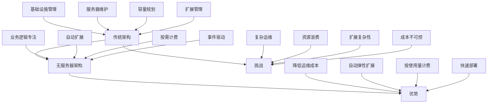
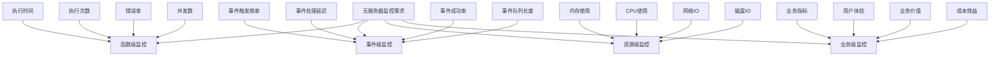

随着云计算的发展，无服务器架构（Serverless）正在成为现代应用开发的重要范式。在无服务器架构中，开发者只需关注业务逻辑，而无需管理底层基础设施。然而，这种架构也带来了独特的日志与监控挑战。本章将深入探讨无服务器架构中的日志与监控需求，以及如何构建有效的可观察性体系。

## 无服务器架构简介

### 什么是无服务器架构？

无服务器架构是一种云计算执行模型，其中云提供商动态管理机器资源的分配和供应，开发者只需关注业务逻辑的实现。尽管名称中包含"无服务器"，但实际上服务器仍然存在，只是开发者无需关心服务器的管理和维护。



### 无服务器架构的特点

```yaml
# 无服务器架构特点
serverless_characteristics:
  event_driven:
    description: "事件驱动"
    features:
      - 基于事件触发执行
      - 支持多种事件源
      - 异步处理能力
      - 实时响应机制
      
  auto_scaling:
    description: "自动扩缩容"
    features:
      - 根据负载自动扩展
      - 零负载时自动收缩
      - 无需手动干预
      - 快速响应变化
      
  pay_per_use:
    description: "按需计费"
    features:
      - 按执行时间计费
      - 按资源消耗计费
      - 零负载时无费用
      - 成本可预测
      
  stateless_execution:
    description: "无状态执行"
    features:
      - 函数实例无状态
      - 数据持久化外部化
      - 实例生命周期短暂
      - 并发处理支持
```

## 无服务器架构中的日志与监控挑战

### 传统监控方法的局限性

在无服务器架构中，传统的监控方法面临诸多挑战：

```yaml
# 传统监控方法局限性
traditional_monitoring_limitations:
  infrastructure_visibility:
    challenges:
      - 无法直接访问底层基础设施
      - 缺乏系统级监控指标
      - 难以进行性能调优
      - 无法监控物理资源使用
      
  execution_environment:
    challenges:
      - 函数执行环境短暂
      - 实例生命周期不可控
      - 难以进行持续监控
      - 缺乏环境一致性
      
  distributed_tracing:
    challenges:
      - 函数间调用关系复杂
      - 跨服务追踪困难
      - 上下文传递机制特殊
      - 调用链路不连续
      
  debugging_difficulties:
    challenges:
      - 难以进行本地调试
      - 缺乏实时调试能力
      - 错误重现困难
      - 问题定位复杂
```

### 无服务器特有的监控需求



## 无服务器日志与监控的核心组件

### 函数执行监控

```yaml
# 函数执行监控指标
function_execution_metrics:
  performance_metrics:
    description: "性能指标"
    metrics:
      - execution_duration: "函数执行时间"
      - invocation_count: "函数调用次数"
      - concurrent_executions: "并发执行数"
      - throttles: "节流次数"
      
  error_metrics:
    description: "错误指标"
    metrics:
      - error_rate: "错误率"
      - timeout_count: "超时次数"
      - fault_count: "故障次数"
      - retry_count: "重试次数"
      
  resource_metrics:
    description: "资源指标"
    metrics:
      - memory_usage: "内存使用量"
      - cpu_utilization: "CPU利用率"
      - network_io: "网络IO"
      - disk_io: "磁盘IO"
```

### 事件流监控

```python
# 事件流监控示例
class EventStreamMonitor:
    def __init__(self, provider):
        self.provider = provider
        self.metrics = {}
        
    def track_event_source(self, source_name):
        """跟踪事件源"""
        self.metrics[source_name] = {
            'trigger_count': 0,
            'processing_time': [],
            'success_rate': 0.0,
            'error_details': []
        }
        
    def record_event_trigger(self, source_name, processing_time, success=True, error=None):
        """记录事件触发"""
        if source_name not in self.metrics:
            self.track_event_source(source_name)
            
        source_metrics = self.metrics[source_name]
        source_metrics['trigger_count'] += 1
        source_metrics['processing_time'].append(processing_time)
        
        if success:
            source_metrics['success_rate'] = (
                source_metrics['success_rate'] * (source_metrics['trigger_count'] - 1) + 1
            ) / source_metrics['trigger_count']
        else:
            source_metrics['error_details'].append(error)
            
    def get_event_metrics(self, source_name):
        """获取事件指标"""
        if source_name not in self.metrics:
            return None
            
        source_metrics = self.metrics[source_name]
        processing_times = source_metrics['processing_time']
        
        return {
            'trigger_count': source_metrics['trigger_count'],
            'average_processing_time': sum(processing_times) / len(processing_times) if processing_times else 0,
            'success_rate': source_metrics['success_rate'],
            'error_count': len(source_metrics['error_details'])
        }
```

### 分布式追踪

```json
{
  "trace_structure": {
    "trace_id": "1-5759e988-bd862e3fe1be46a994272793",
    "segments": [
      {
        "id": "62242f90c94cbf1d",
        "name": "APIGateway",
        "start_time": 1461096053.37518,
        "end_time": 1461096053.4042,
        "http": {
          "request": {
            "method": "POST",
            "url": "https://api.example.com/users"
          },
          "response": {
            "status": 200
          }
        },
        "subsegments": [
          {
            "id": "52242f90c94cbf1e",
            "name": "UserServiceFunction",
            "start_time": 1461096053.38001,
            "end_time": 1461096053.40002,
            "aws": {
              "operation": "Invoke",
              "region": "us-west-2"
            },
            "annotations": {
              "user_id": "12345"
            }
          }
        ]
      }
    ]
  }
}
```

## 无服务器监控架构设计

### 云原生监控架构

```yaml
# 云原生无服务器监控架构
serverless_monitoring_architecture:
  data_collection:
    description: "数据收集层"
    components:
      - Cloud Provider Integration: 云服务商集成
      - Function Instrumentation: 函数插桩
      - Event Source Monitoring: 事件源监控
      - External Metrics Collection: 外部指标收集
      
  data_processing:
    description: "数据处理层"
    components:
      - Metrics Aggregation: 指标聚合
      - Log Processing: 日志处理
      - Trace Analysis: 追踪分析
      - Anomaly Detection: 异常检测
      
  data_storage:
    description: "数据存储层"
    components:
      - Time Series Database: 时序数据库
      - Log Storage: 日志存储
      - Trace Storage: 追踪存储
      - Metadata Storage: 元数据存储
      
  visualization:
    description: "可视化层"
    components:
      - Dashboards: 仪表板
      - Alerts: 告警
      - Reports: 报告
      - Analytics: 分析
      
  automation:
    description: "自动化层"
    components:
      - Auto Scaling: 自动扩缩容
      - Error Handling: 错误处理
      - Cost Optimization: 成本优化
      - Security Response: 安全响应
```

### 监控工具集成

```python
# 监控工具集成示例
class ServerlessMonitor:
    def __init__(self):
        self.metrics_client = self._initialize_metrics_client()
        self.logging_client = self._initialize_logging_client()
        self.tracing_client = self._initialize_tracing_client()
        
    def _initialize_metrics_client(self):
        """初始化指标客户端"""
        # 根据云服务商初始化相应的指标客户端
        # 例如：CloudWatch, Azure Monitor, Stackdriver等
        pass
        
    def _initialize_logging_client(self):
        """初始化日志客户端"""
        # 初始化日志收集和分析客户端
        pass
        
    def _initialize_tracing_client(self):
        """初始化追踪客户端"""
        # 初始化分布式追踪客户端
        pass
        
    def record_function_invocation(self, function_name, duration, memory_used, success=True):
        """记录函数调用"""
        metrics = {
            'function_name': function_name,
            'duration': duration,
            'memory_used': memory_used,
            'success': success
        }
        
        # 发送到指标系统
        self.metrics_client.put_metric_data(
            Namespace='Serverless/Functions',
            MetricData=[
                {
                    'MetricName': 'Duration',
                    'Dimensions': [{'Name': 'FunctionName', 'Value': function_name}],
                    'Value': duration,
                    'Unit': 'Milliseconds'
                },
                {
                    'MetricName': 'MemoryUsed',
                    'Dimensions': [{'Name': 'FunctionName', 'Value': function_name}],
                    'Value': memory_used,
                    'Unit': 'Bytes'
                }
            ]
        )
        
        # 记录日志
        log_entry = {
            'function_name': function_name,
            'duration': duration,
            'memory_used': memory_used,
            'success': success,
            'timestamp': self._get_current_timestamp()
        }
        self.logging_client.log(log_entry)
```

## 成本与性能优化

### 监控成本控制

```yaml
# 监控成本控制策略
monitoring_cost_control:
  metrics_optimization:
    strategies:
      - "选择关键指标进行监控"
      - "合理设置指标采样率"
      - "定期清理过期指标数据"
      - "使用聚合指标替代详细指标"
      
  log_optimization:
    strategies:
      - "设置合理的日志级别"
      - "实施日志采样策略"
      - "压缩和归档历史日志"
      - "过滤无价值日志信息"
      
  trace_optimization:
    strategies:
      - "选择关键路径进行追踪"
      - "设置采样率控制追踪数据量"
      - "优化追踪上下文传递"
      - "定期分析追踪数据价值"
```

### 性能优化建议

```yaml
# 无服务器性能优化建议
performance_optimization:
  function_optimization:
    recommendations:
      - "优化函数冷启动时间"
      - "合理配置内存和超时时间"
      - "减少函数包大小"
      - "使用预置并发"
      
  monitoring_optimization:
    recommendations:
      - "实施异步监控数据收集"
      - "使用批量处理减少API调用"
      - "缓存频繁访问的监控数据"
      - "优化监控查询性能"
      
  cost_optimization:
    recommendations:
      - "监控和优化函数执行时间"
      - "实施资源使用监控"
      - "设置成本告警"
      - "定期审查监控资源配置"
```

## 最佳实践总结

### 1. 监控策略设计

```yaml
# 监控策略设计最佳实践
monitoring_strategy_best_practices:
  comprehensive_coverage:
    guidelines:
      - "覆盖所有关键函数和服务"
      - "监控业务和系统指标"
      - "实施端到端追踪"
      - "建立多层告警机制"
      
  proactive_monitoring:
    guidelines:
      - "实施预测性监控"
      - "设置智能告警阈值"
      - "定期审查监控配置"
      - "持续优化监控策略"
```

### 2. 工具选择建议

```yaml
# 工具选择建议
tool_selection_guidelines:
  cloud_provider_tools:
    recommendations:
      - "优先使用云服务商原生工具"
      - "考虑工具集成和兼容性"
      - "评估工具成本效益"
      - "确保工具可扩展性"
      
  third_party_tools:
    recommendations:
      - "选择支持无服务器架构的工具"
      - "考虑工具的成熟度和社区支持"
      - "评估工具的学习成本"
      - "确保工具的安全性"
```

## 总结

无服务器架构为现代应用开发带来了便利，但也对日志与监控提出了新的挑战。通过理解无服务器架构的特点，设计合理的监控架构，选择适当的工具，并遵循最佳实践，我们可以构建有效的无服务器可观察性体系。

关键要点包括：
1. **理解架构特点**：深入了解无服务器架构的独特性
2. **设计监控体系**：构建适应无服务器特点的监控架构
3. **选择合适工具**：根据需求选择适当的监控工具
4. **优化成本性能**：平衡监控效果与成本投入

在接下来的章节中，我们将深入探讨具体的无服务器平台（如AWS Lambda、Google Cloud Functions）的日志与监控实践。