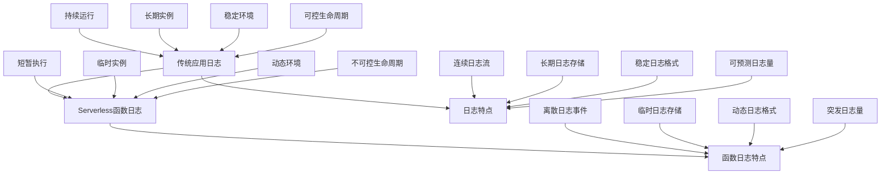

在无服务器架构中，函数即服务（Function as a Service, FaaS）是核心组件。每个函数都是一个独立的执行单元，具有短暂的生命周期和事件驱动的执行模式。这种特性使得传统的日志记录和监控方法不再适用，需要专门针对无服务器函数设计日志与监控策略。本章将深入探讨Serverless函数的日志记录与监控实践。

## Serverless函数日志记录基础

### 函数日志的特点

Serverless函数的日志记录与传统应用日志有显著差异：



### 日志记录最佳实践

```yaml
# Serverless函数日志记录最佳实践
serverless_logging_best_practices:
  structured_logging:
    description: "结构化日志"
    practices:
      - 使用JSON格式记录日志
      - 包含请求ID和追踪ID
      - 添加时间戳和严重级别
      - 包含业务上下文信息
      
  log_levels:
    description: "日志级别管理"
    practices:
      - 合理使用DEBUG、INFO、WARN、ERROR级别
      - 生产环境限制DEBUG级别日志
      - 错误日志包含详细上下文
      - 安全日志单独处理
      
  correlation:
    description: "日志关联"
    practices:
      - 为每个请求生成唯一ID
      - 跨函数传递请求ID
      - 关联相关日志事件
      - 实现端到端追踪
      
  security:
    description: "日志安全"
    practices:
      - 避免记录敏感信息
      - 实施日志数据脱敏
      - 控制日志访问权限
      - 加密传输和存储
```

## AWS Lambda日志记录实现

### CloudWatch Logs集成

```python
# AWS Lambda日志记录实现
import json
import logging
import boto3
from datetime import datetime

class LambdaLogger:
    def __init__(self, service_name):
        self.service_name = service_name
        self.logger = logging.getLogger()
        self.logger.setLevel(logging.INFO)
        
        # 创建格式化器
        formatter = logging.Formatter(
            '%(asctime)s - %(name)s - %(levelname)s - %(message)s'
        )
        
        # 添加处理程序（如果需要自定义）
        # 默认情况下，Lambda会自动将日志发送到CloudWatch
        
    def log_request_start(self, context, event):
        """记录请求开始"""
        request_info = {
            'requestId': context.aws_request_id,
            'functionName': context.function_name,
            'functionVersion': context.function_version,
            'invokedFunctionArn': context.invoked_function_arn,
            'event': self._sanitize_event(event)
        }
        
        self.logger.info(f"REQUEST_START: {json.dumps(request_info)}")
        
    def log_business_event(self, event_type, data, context):
        """记录业务事件"""
        business_event = {
            'requestId': context.aws_request_id,
            'eventType': event_type,
            'timestamp': datetime.utcnow().isoformat(),
            'data': data
        }
        
        self.logger.info(f"BUSINESS_EVENT: {json.dumps(business_event)}")
        
    def log_performance_metric(self, metric_name, value, context, unit='ms'):
        """记录性能指标"""
        metric = {
            'requestId': context.aws_request_id,
            'metricName': metric_name,
            'value': value,
            'unit': unit,
            'timestamp': datetime.utcnow().isoformat()
        }
        
        self.logger.info(f"PERFORMANCE_METRIC: {json.dumps(metric)}")
        
    def log_error(self, error_type, message, context, traceback=None):
        """记录错误"""
        error_info = {
            'requestId': context.aws_request_id,
            'errorType': error_type,
            'message': message,
            'timestamp': datetime.utcnow().isoformat()
        }
        
        if traceback:
            error_info['traceback'] = traceback
            
        self.logger.error(f"ERROR: {json.dumps(error_info)}")
        
    def log_request_end(self, context, duration, memory_used):
        """记录请求结束"""
        end_info = {
            'requestId': context.aws_request_id,
            'duration': duration,
            'memoryUsed': memory_used,
            'timestamp': datetime.utcnow().isoformat()
        }
        
        self.logger.info(f"REQUEST_END: {json.dumps(end_info)}")
        
    def _sanitize_event(self, event):
        """清理事件数据，移除敏感信息"""
        # 实现敏感信息过滤逻辑
        sanitized = event.copy()
        
        # 移除常见的敏感字段
        sensitive_fields = ['password', 'token', 'secret', 'key', 'authorization']
        for field in sensitive_fields:
            if field in sanitized:
                sanitized[field] = '***REDACTED***'
                
        return sanitized

# 使用示例
def lambda_handler(event, context):
    logger = LambdaLogger('UserService')
    
    try:
        # 记录请求开始
        logger.log_request_start(context, event)
        
        # 记录业务事件
        logger.log_business_event('UserLogin', {'userId': 'user123'}, context)
        
        # 模拟业务处理
        start_time = datetime.utcnow()
        # ... 业务逻辑 ...
        end_time = datetime.utcnow()
        duration = (end_time - start_time).total_seconds() * 1000
        
        # 记录性能指标
        logger.log_performance_metric('ProcessingTime', duration, context)
        
        # 记录请求结束
        logger.log_request_end(context, duration, context.memory_limit_in_mb)
        
        return {
            'statusCode': 200,
            'body': json.dumps('Success')
        }
    except Exception as e:
        logger.log_error('ProcessingError', str(e), context)
        raise
```

### 高级日志处理

```python
# 高级日志处理和分析
import boto3
import json
from datetime import datetime, timedelta

class LambdaLogAnalyzer:
    def __init__(self):
        self.logs_client = boto3.client('logs')
        self.cloudwatch_client = boto3.client('cloudwatch')
        
    def analyze_function_errors(self, function_name, hours=24):
        """分析函数错误模式"""
        log_group_name = f'/aws/lambda/{function_name}'
        end_time = datetime.utcnow()
        start_time = end_time - timedelta(hours=hours)
        
        # 查询错误日志
        query = f"""
        fields @timestamp, @message, @logStream
        | filter @message like /ERROR/
        | sort @timestamp desc
        | limit 100
        """
        
        try:
            response = self.logs_client.start_query(
                logGroupName=log_group_name,
                startTime=int(start_time.timestamp() * 1000),
                endTime=int(end_time.timestamp() * 1000),
                queryString=query
            )
            
            query_id = response['queryId']
            
            # 获取查询结果
            results = self._get_query_results(query_id)
            return self._analyze_error_patterns(results)
            
        except Exception as e:
            print(f"Error analyzing logs: {e}")
            return None
            
    def _get_query_results(self, query_id):
        """获取查询结果"""
        while True:
            response = self.logs_client.get_query_results(queryId=query_id)
            if response['status'] == 'Complete':
                return response['results']
            elif response['status'] in ['Failed', 'Cancelled']:
                raise Exception(f"Query failed: {response['status']}")
                
    def _analyze_error_patterns(self, log_results):
        """分析错误模式"""
        error_patterns = {}
        
        for result in log_results:
            # 解析日志内容
            message_field = next((field for field in result if field['field'] == '@message'), None)
            if message_field:
                message = message_field['value']
                # 提取错误类型和相关信息
                error_key = self._extract_error_key(message)
                if error_key in error_patterns:
                    error_patterns[error_key]['count'] += 1
                else:
                    error_patterns[error_key] = {
                        'count': 1,
                        'sample_message': message,
                        'first_occurrence': None,
                        'last_occurrence': None
                    }
                    
        return error_patterns
        
    def _extract_error_key(self, message):
        """从错误消息中提取关键信息"""
        # 实现错误消息解析逻辑
        if 'DatabaseError' in message:
            return 'DatabaseError'
        elif 'NetworkError' in message:
            return 'NetworkError'
        elif 'ValidationError' in message:
            return 'ValidationError'
        else:
            return 'UnknownError'
            
    def create_error_alarm(self, function_name, threshold=5):
        """为函数错误创建告警"""
        alarm_name = f'{function_name}-HighErrorRate'
        
        try:
            self.cloudwatch_client.put_metric_alarm(
                AlarmName=alarm_name,
                AlarmDescription=f'High error rate for function {function_name}',
                MetricName='Errors',
                Namespace='AWS/Lambda',
                Statistic='Sum',
                Period=300,  # 5分钟
                EvaluationPeriods=2,
                Threshold=threshold,
                ComparisonOperator='GreaterThanThreshold',
                AlarmActions=[
                    # 添加SNS主题ARN以接收告警通知
                ],
                Dimensions=[
                    {
                        'Name': 'FunctionName',
                        'Value': function_name
                    }
                ]
            )
            
            print(f"Created alarm: {alarm_name}")
            
        except Exception as e:
            print(f"Error creating alarm: {e}")
```

## Azure Functions日志记录

### Application Insights集成

```csharp
// Azure Functions日志记录实现 (C#)
using Microsoft.Azure.Functions.Worker;
using Microsoft.Extensions.Logging;
using System.Text.Json;

public class FunctionLogger
{
    private readonly ILogger _logger;
    private readonly string _functionName;
    
    public FunctionLogger(ILogger logger, string functionName)
    {
        _logger = logger;
        _functionName = functionName;
    }
    
    public void LogRequestStart(FunctionContext context)
    {
        var requestInfo = new
        {
            requestId = context.InvocationId,
            functionName = _functionName,
            timestamp = DateTime.UtcNow
        };
        
        _logger.LogInformation("REQUEST_START: {RequestInfo}", JsonSerializer.Serialize(requestInfo));
    }
    
    public void LogBusinessEvent(string eventType, object data, FunctionContext context)
    {
        var businessEvent = new
        {
            requestId = context.InvocationId,
            eventType = eventType,
            timestamp = DateTime.UtcNow,
            data = data
        };
        
        _logger.LogInformation("BUSINESS_EVENT: {BusinessEvent}", JsonSerializer.Serialize(businessEvent));
    }
    
    public void LogPerformanceMetric(string metricName, double value, FunctionContext context, string unit = "ms")
    {
        var metric = new
        {
            requestId = context.InvocationId,
            metricName = metricName,
            value = value,
            unit = unit,
            timestamp = DateTime.UtcNow
        };
        
        _logger.LogInformation("PERFORMANCE_METRIC: {Metric}", JsonSerializer.Serialize(metric));
    }
    
    public void LogError(string errorType, string message, FunctionContext context, string stackTrace = null)
    {
        var errorInfo = new
        {
            requestId = context.InvocationId,
            errorType = errorType,
            message = message,
            timestamp = DateTime.UtcNow,
            stackTrace = stackTrace
        };
        
        _logger.LogError("ERROR: {ErrorInfo}", JsonSerializer.Serialize(errorInfo));
    }
    
    public void LogRequestEnd(FunctionContext context, double duration, long memoryUsed)
    {
        var endInfo = new
        {
            requestId = context.InvocationId,
            duration = duration,
            memoryUsed = memoryUsed,
            timestamp = DateTime.UtcNow
        };
        
        _logger.LogInformation("REQUEST_END: {EndInfo}", JsonSerializer.Serialize(endInfo));
    }
}

// 使用示例
public class HttpFunction
{
    private readonly ILogger<HttpFunction> _logger;
    
    public HttpFunction(ILogger<HttpFunction> logger)
    {
        _logger = logger;
    }
    
    [Function("HttpFunction")]
    public async Task<HttpResponseData> Run(
        [HttpTrigger(AuthorizationLevel.Function, "get", "post")] HttpRequestData req,
        FunctionContext context)
    {
        var functionLogger = new FunctionLogger(_logger, "HttpFunction");
        
        try
        {
            functionLogger.LogRequestStart(context);
            
            // 记录业务事件
            functionLogger.LogBusinessEvent("HttpRequest", new { method = req.Method, url = req.Url }, context);
            
            // 模拟业务处理
            var startTime = DateTime.UtcNow;
            // ... 业务逻辑 ...
            var endTime = DateTime.UtcNow;
            var duration = (endTime - startTime).TotalMilliseconds;
            
            // 记录性能指标
            functionLogger.LogPerformanceMetric("ProcessingTime", duration, context);
            
            // 记录请求结束
            functionLogger.LogRequestEnd(context, duration, 0); // 内存使用需要通过其他方式获取
            
            var response = req.CreateResponse(System.Net.HttpStatusCode.OK);
            await response.WriteStringAsync("Success");
            return response;
        }
        catch (Exception ex)
        {
            functionLogger.LogError("ProcessingError", ex.Message, context, ex.StackTrace);
            throw;
        }
    }
}
```

### Python Azure Functions日志

```python
# Azure Functions Python日志记录
import logging
import json
import azure.functions as func
from datetime import datetime

class AzureFunctionLogger:
    def __init__(self, logger):
        self.logger = logger
        
    def log_request_start(self, context):
        """记录请求开始"""
        request_info = {
            'invocation_id': context.invocation_id,
            'function_name': context.function_name,
            'timestamp': datetime.utcnow().isoformat()
        }
        
        self.logger.info(f"REQUEST_START: {json.dumps(request_info)}")
        
    def log_business_event(self, event_type, data, context):
        """记录业务事件"""
        business_event = {
            'invocation_id': context.invocation_id,
            'event_type': event_type,
            'timestamp': datetime.utcnow().isoformat(),
            'data': data
        }
        
        self.logger.info(f"BUSINESS_EVENT: {json.dumps(business_event)}")
        
    def log_performance_metric(self, metric_name, value, context, unit='ms'):
        """记录性能指标"""
        metric = {
            'invocation_id': context.invocation_id,
            'metric_name': metric_name,
            'value': value,
            'unit': unit,
            'timestamp': datetime.utcnow().isoformat()
        }
        
        self.logger.info(f"PERFORMANCE_METRIC: {json.dumps(metric)}")
        
    def log_error(self, error_type, message, context, traceback=None):
        """记录错误"""
        error_info = {
            'invocation_id': context.invocation_id,
            'error_type': error_type,
            'message': message,
            'timestamp': datetime.utcnow().isoformat()
        }
        
        if traceback:
            error_info['traceback'] = traceback
            
        self.logger.error(f"ERROR: {json.dumps(error_info)}")
        
    def log_request_end(self, context, duration):
        """记录请求结束"""
        end_info = {
            'invocation_id': context.invocation_id,
            'duration': duration,
            'timestamp': datetime.utcnow().isoformat()
        }
        
        self.logger.info(f"REQUEST_END: {json.dumps(end_info)}")

# 使用示例
def main(req: func.HttpRequest, context: func.Context) -> func.HttpResponse:
    logger = logging.getLogger('azure.functions')
    function_logger = AzureFunctionLogger(logger)
    
    try:
        function_logger.log_request_start(context)
        
        # 记录业务事件
        function_logger.log_business_event('HttpRequest', {'method': req.method, 'url': str(req.url)}, context)
        
        # 模拟业务处理
        start_time = datetime.utcnow()
        # ... 业务逻辑 ...
        end_time = datetime.utcnow()
        duration = (end_time - start_time).total_seconds() * 1000
        
        # 记录性能指标
        function_logger.log_performance_metric('ProcessingTime', duration, context)
        
        # 记录请求结束
        function_logger.log_request_end(context, duration)
        
        return func.HttpResponse("Success", status_code=200)
        
    except Exception as e:
        function_logger.log_error('ProcessingError', str(e), context)
        return func.HttpResponse("Error", status_code=500)
```

## Google Cloud Functions日志记录

### Cloud Logging集成

```javascript
// Google Cloud Functions日志记录实现 (Node.js)
const { Logging } = require('@google-cloud/logging');

class GCFLogger {
    constructor(functionName) {
        this.functionName = functionName;
        this.logging = new Logging();
        this.log = this.logging.log(`projects/${process.env.GOOGLE_CLOUD_PROJECT}/logs/${functionName}`);
    }
    
    logRequestStart(context) {
        const requestInfo = {
            executionId: context.executionId,
            functionName: this.functionName,
            timestamp: new Date().toISOString()
        };
        
        this._writeLog('REQUEST_START', requestInfo, 'INFO');
    }
    
    logBusinessEvent(eventType, data, context) {
        const businessEvent = {
            executionId: context.executionId,
            eventType: eventType,
            timestamp: new Date().toISOString(),
            data: data
        };
        
        this._writeLog('BUSINESS_EVENT', businessEvent, 'INFO');
    }
    
    logPerformanceMetric(metricName, value, context, unit = 'ms') {
        const metric = {
            executionId: context.executionId,
            metricName: metricName,
            value: value,
            unit: unit,
            timestamp: new Date().toISOString()
        };
        
        this._writeLog('PERFORMANCE_METRIC', metric, 'INFO');
    }
    
    logError(errorType, message, context, stack = null) {
        const errorInfo = {
            executionId: context.executionId,
            errorType: errorType,
            message: message,
            timestamp: new Date().toISOString()
        };
        
        if (stack) {
            errorInfo.stack = stack;
        }
        
        this._writeLog('ERROR', errorInfo, 'ERROR');
    }
    
    logRequestEnd(context, duration) {
        const endInfo = {
            executionId: context.executionId,
            duration: duration,
            timestamp: new Date().toISOString()
        };
        
        this._writeLog('REQUEST_END', endInfo, 'INFO');
    }
    
    _writeLog(logType, data, severity) {
        const entry = this.log.entry(
            {
                severity: severity,
                labels: {
                    logType: logType,
                    functionName: this.functionName
                }
            },
            {
                logType: logType,
                data: data
            }
        );
        
        this.log.write(entry).catch(err => {
            console.error('Error writing log:', err);
        });
    }
}

// 使用示例
exports.helloWorld = async (req, res) => {
    const logger = new GCFLogger('helloWorld');
    const context = {
        executionId: req.get('Function-Execution-Id') || 'unknown'
    };
    
    try {
        logger.logRequestStart(context);
        
        // 记录业务事件
        logger.logBusinessEvent('HttpRequest', { method: req.method, url: req.url }, context);
        
        // 模拟业务处理
        const startTime = Date.now();
        // ... 业务逻辑 ...
        const endTime = Date.now();
        const duration = endTime - startTime;
        
        // 记录性能指标
        logger.logPerformanceMetric('ProcessingTime', duration, context);
        
        // 记录请求结束
        logger.logRequestEnd(context, duration);
        
        res.status(200).send('Success');
    } catch (error) {
        logger.logError('ProcessingError', error.message, context, error.stack);
        res.status(500).send('Error');
    }
};
```

### Python Google Cloud Functions日志

```python
# Google Cloud Functions Python日志记录
import json
import logging
from datetime import datetime
from google.cloud import logging as cloud_logging

class GCPFunctionLogger:
    def __init__(self, function_name):
        self.function_name = function_name
        self.logger = logging.getLogger(f'gcf.{function_name}')
        self.logger.setLevel(logging.INFO)
        
        # 配置Google Cloud Logging
        client = cloud_logging.Client()
        client.setup_logging()
        
    def log_request_start(self, context):
        """记录请求开始"""
        request_info = {
            'execution_id': getattr(context, 'execution_id', 'unknown'),
            'function_name': self.function_name,
            'timestamp': datetime.utcnow().isoformat()
        }
        
        self.logger.info(f"REQUEST_START: {json.dumps(request_info)}")
        
    def log_business_event(self, event_type, data, context):
        """记录业务事件"""
        business_event = {
            'execution_id': getattr(context, 'execution_id', 'unknown'),
            'event_type': event_type,
            'timestamp': datetime.utcnow().isoformat(),
            'data': data
        }
        
        self.logger.info(f"BUSINESS_EVENT: {json.dumps(business_event)}")
        
    def log_performance_metric(self, metric_name, value, context, unit='ms'):
        """记录性能指标"""
        metric = {
            'execution_id': getattr(context, 'execution_id', 'unknown'),
            'metric_name': metric_name,
            'value': value,
            'unit': unit,
            'timestamp': datetime.utcnow().isoformat()
        }
        
        self.logger.info(f"PERFORMANCE_METRIC: {json.dumps(metric)}")
        
    def log_error(self, error_type, message, context, traceback=None):
        """记录错误"""
        error_info = {
            'execution_id': getattr(context, 'execution_id', 'unknown'),
            'error_type': error_type,
            'message': message,
            'timestamp': datetime.utcnow().isoformat()
        }
        
        if traceback:
            error_info['traceback'] = traceback
            
        self.logger.error(f"ERROR: {json.dumps(error_info)}")
        
    def log_request_end(self, context, duration):
        """记录请求结束"""
        end_info = {
            'execution_id': getattr(context, 'execution_id', 'unknown'),
            'duration': duration,
            'timestamp': datetime.utcnow().isoformat()
        }
        
        self.logger.info(f"REQUEST_END: {json.dumps(end_info)}")

# 使用示例
def hello_world(request):
    import functions_framework
    
    logger = GCPFunctionLogger('hello_world')
    
    try:
        # 创建模拟的context对象
        class MockContext:
            def __init__(self):
                self.execution_id = request.headers.get('Function-Execution-Id', 'unknown')
        
        context = MockContext()
        logger.log_request_start(context)
        
        # 记录业务事件
        logger.log_business_event('HttpRequest', {'method': request.method, 'url': request.url}, context)
        
        # 模拟业务处理
        start_time = datetime.utcnow()
        # ... 业务逻辑 ...
        end_time = datetime.utcnow()
        duration = (end_time - start_time).total_seconds() * 1000
        
        # 记录性能指标
        logger.log_performance_metric('ProcessingTime', duration, context)
        
        # 记录请求结束
        logger.log_request_end(context, duration)
        
        return 'Success', 200
    except Exception as e:
        logger.log_error('ProcessingError', str(e), context)
        return 'Error', 500
```

## 函数监控指标

### 核心监控指标

```yaml
# Serverless函数核心监控指标
core_function_metrics:
  performance_metrics:
    description: "性能指标"
    metrics:
      - duration: "函数执行时间"
      - throttles: "函数节流次数"
      - concurrent_executions: "并发执行数"
      - iterator_age: "迭代器年龄（针对流触发函数）"
      
  error_metrics:
    description: "错误指标"
    metrics:
      - errors: "错误次数"
      - dead_letter_error: "死信队列错误"
      - timeout: "超时次数"
      - fault: "故障次数"
      
  resource_metrics:
    description: "资源指标"
    metrics:
      - memory_used: "内存使用量"
      - cpu_utilization: "CPU利用率"
      - network_in: "网络流入量"
      - network_out: "网络流出量"
      
  business_metrics:
    description: "业务指标"
    metrics:
      - invocation_count: "调用次数"
      - success_rate: "成功率"
      - business_value: "业务价值指标"
      - user_satisfaction: "用户满意度"
```

### 自定义指标实现

```python
# 自定义指标实现示例
import boto3
import time

class CustomMetricsReporter:
    def __init__(self, namespace='Custom/Serverless'):
        self.cloudwatch = boto3.client('cloudwatch')
        self.namespace = namespace
        
    def report_business_metric(self, metric_name, value, dimensions=None, unit='Count'):
        """报告业务指标"""
        dimensions = dimensions or []
        
        try:
            self.cloudwatch.put_metric_data(
                Namespace=self.namespace,
                MetricData=[
                    {
                        'MetricName': metric_name,
                        'Value': value,
                        'Unit': unit,
                        'Dimensions': dimensions,
                        'Timestamp': time.time()
                    }
                ]
            )
        except Exception as e:
            print(f"Error reporting metric: {e}")
            
    def report_user_activity(self, user_id, action, service_name):
        """报告用户活动"""
        dimensions = [
            {'Name': 'Service', 'Value': service_name},
            {'Name': 'Action', 'Value': action}
        ]
        
        self.report_business_metric(
            'UserActivity',
            1,
            dimensions
        )
        
    def report_business_value(self, value, service_name, currency='USD'):
        """报告业务价值"""
        dimensions = [
            {'Name': 'Service', 'Value': service_name},
            {'Name': 'Currency', 'Value': currency}
        ]
        
        self.report_business_metric(
            'BusinessValue',
            value,
            dimensions,
            'Count'
        )

# 使用示例
def lambda_handler(event, context):
    metrics_reporter = CustomMetricsReporter()
    
    # 报告用户活动
    metrics_reporter.report_user_activity(
        'user123', 
        'Login', 
        'UserService'
    )
    
    # 报告业务价值
    metrics_reporter.report_business_value(
        100.0,  # 假设每次登录价值100美元
        'UserService'
    )
    
    # ... 其他业务逻辑 ...
    
    return {
        'statusCode': 200,
        'body': 'Success'
    }
```

## 日志分析与洞察

### 日志模式分析

```python
# 日志模式分析工具
import re
from collections import defaultdict, Counter
from datetime import datetime, timedelta

class LogPatternAnalyzer:
    def __init__(self):
        self.patterns = defaultdict(list)
        self.error_counter = Counter()
        
    def analyze_log_patterns(self, log_lines):
        """分析日志模式"""
        for line in log_lines:
            # 提取时间戳
            timestamp_match = re.search(r'\d{4}-\d{2}-\d{2}T\d{2}:\d{2}:\d{2}', line)
            timestamp = timestamp_match.group(0) if timestamp_match else None
            
            # 提取日志级别
            level_match = re.search(r'(INFO|ERROR|WARN|DEBUG)', line)
            level = level_match.group(0) if level_match else 'UNKNOWN'
            
            # 提取函数名
            function_match = re.search(r'functionName=([^\s]+)', line)
            function_name = function_match.group(1) if function_match else 'UNKNOWN'
            
            # 提取请求ID
            request_match = re.search(r'requestId=([a-f0-9\-]+)', line)
            request_id = request_match.group(1) if request_match else 'UNKNOWN'
            
            # 分析错误模式
            if 'ERROR' in line:
                error_type = self._classify_error(line)
                self.error_counter[error_type] += 1
                
            # 存储模式信息
            pattern_key = f"{function_name}:{level}"
            self.patterns[pattern_key].append({
                'timestamp': timestamp,
                'request_id': request_id,
                'line': line
            })
            
        return self._generate_analysis_report()
        
    def _classify_error(self, error_line):
        """分类错误类型"""
        if 'timeout' in error_line.lower():
            return 'TimeoutError'
        elif 'memory' in error_line.lower():
            return 'MemoryError'
        elif 'database' in error_line.lower():
            return 'DatabaseError'
        elif 'network' in error_line.lower():
            return 'NetworkError'
        else:
            return 'UnknownError'
            
    def _generate_analysis_report(self):
        """生成分析报告"""
        report = {
            'total_patterns': len(self.patterns),
            'error_distribution': dict(self.error_counter),
            'high_frequency_patterns': [],
            'anomalous_patterns': []
        }
        
        # 识别高频模式
        for pattern, occurrences in self.patterns.items():
            if len(occurrences) > 100:  # 高频阈值
                report['high_frequency_patterns'].append({
                    'pattern': pattern,
                    'count': len(occurrences)
                })
                
        # 识别异常模式
        baseline = sum(len(occurrences) for occurrences in self.patterns.values()) / len(self.patterns)
        for pattern, occurrences in self.patterns.items():
            if len(occurrences) > baseline * 2:  # 异常阈值
                report['anomalous_patterns'].append({
                    'pattern': pattern,
                    'count': len(occurrences),
                    'baseline': baseline
                })
                
        return report

# 使用示例
analyzer = LogPatternAnalyzer()
# log_lines = read_log_lines_from_source()
# report = analyzer.analyze_log_patterns(log_lines)
# print(report)
```

## 最佳实践总结

### 1. 日志记录最佳实践

```yaml
# 日志记录最佳实践
logging_best_practices:
  structured_data:
    guidelines:
      - "使用JSON格式记录结构化日志"
      - "包含请求ID和追踪ID"
      - "添加时间戳和严重级别"
      - "包含业务上下文信息"
      
  sensitive_data:
    guidelines:
      - "避免记录密码和密钥"
      - "实施数据脱敏策略"
      - "使用日志过滤器"
      - "加密敏感日志数据"
      
  performance:
    guidelines:
      - "异步记录日志"
      - "批量处理日志数据"
      - "避免过度记录"
      - "优化日志格式"
```

### 2. 监控配置最佳实践

```yaml
# 监控配置最佳实践
monitoring_best_practices:
  metric_selection:
    guidelines:
      - "选择关键业务指标"
      - "平衡监控成本和价值"
      - "实施分层监控策略"
      - "定期审查指标有效性"
      
  alerting:
    guidelines:
      - "设置合理的告警阈值"
      - "避免告警疲劳"
      - "实施告警分层"
      - "提供清晰的告警信息"
      
  dashboard:
    guidelines:
      - "设计直观的仪表板"
      - "包含关键性能指标"
      - "提供历史趋势分析"
      - "支持自定义视图"
```

## 总结

Serverless函数的日志记录与监控是构建可靠无服务器应用的关键。通过实施结构化日志记录、选择合适的监控指标、配置有效的告警机制，并遵循最佳实践，我们可以构建高效的函数可观测性体系。

关键要点包括：
1. **结构化日志**：使用JSON格式记录包含丰富上下文的结构化日志
2. **性能监控**：监控函数执行时间、资源使用和业务指标
3. **错误分析**：实施错误模式识别和根因分析
4. **平台集成**：充分利用云服务商提供的日志和监控工具

通过合理设计和实施这些策略，我们可以确保Serverless函数的可靠性和可维护性，为用户提供稳定的服务。

在下一节中，我们将探讨无服务器应用中的追踪与性能分析。