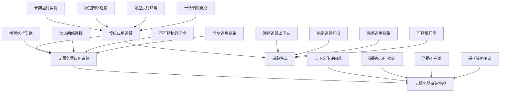

在无服务器架构中，应用通常由多个函数和服务组成，这些组件通过事件和API调用相互协作。由于函数的短暂性和分布式特性，传统的性能分析和追踪方法难以满足无服务器应用的需求。本章将深入探讨如何在无服务器应用中实施有效的追踪与性能分析。

## 分布式追踪基础

### 无服务器环境中的追踪挑战

无服务器架构为分布式追踪带来了独特的挑战：



### 追踪核心概念

```yaml
# 分布式追踪核心概念
distributed_tracing_concepts:
  trace:
    description: "追踪"
    definition: "一个完整的请求从开始到结束的执行路径"
    components:
      - 由多个span组成
      - 跨越多个服务和函数
      - 包含完整的调用链路
      
  span:
    description: "跨度"
    definition: "一个工作单元的执行表示"
    attributes:
      - trace_id: 追踪标识符
      - span_id: 跨度标识符
      - parent_span_id: 父跨度标识符
      - operation_name: 操作名称
      - start_time: 开始时间
      - end_time: 结束时间
      - tags: 标签信息
      - logs: 日志信息
      
  context_propagation:
    description: "上下文传递"
    definition: "在分布式系统中传递追踪上下文"
    mechanisms:
      - HTTP头传递
      - 消息属性传递
      - 数据库存储传递
      - 环境变量传递
```

## AWS Lambda追踪实现

### AWS X-Ray集成

```python
# AWS Lambda X-Ray追踪实现
import boto3
import json
from aws_xray_sdk.core import xray_recorder, patch_all
from aws_xray_sdk.core.models.subsegment import Subsegment
import traceback

# 自动补丁所有支持的库
patch_all()

class LambdaTracer:
    def __init__(self, service_name):
        self.service_name = service_name
        self.xray_recorder = xray_recorder
        
    def trace_function_execution(self, handler_func):
        """装饰器：追踪函数执行"""
        def wrapper(event, context):
            # 开始新的子段
            subsegment = xray_recorder.begin_subsegment(self.service_name)
            
            try:
                # 添加函数元数据
                subsegment.put_annotation('function_name', context.function_name)
                subsegment.put_annotation('request_id', context.aws_request_id)
                subsegment.put_annotation('memory_limit', context.memory_limit_in_mb)
                
                # 记录输入事件（注意敏感信息处理）
                sanitized_event = self._sanitize_event(event)
                subsegment.put_metadata('input_event', sanitized_event, self.service_name)
                
                # 执行函数逻辑
                result = handler_func(event, context)
                
                # 记录输出结果
                subsegment.put_metadata('output_result', result, self.service_name)
                
                return result
                
            except Exception as e:
                # 记录异常
                subsegment.add_exception(e, traceback.extract_stack())
                raise
                
            finally:
                # 结束子段
                xray_recorder.end_subsegment()
                
        return wrapper
        
    def trace_database_operation(self, operation_name, query=None):
        """追踪数据库操作"""
        def decorator(func):
            def wrapper(*args, **kwargs):
                subsegment = xray_recorder.begin_subsegment(operation_name)
                
                try:
                    # 添加数据库操作信息
                    subsegment.put_annotation('operation', operation_name)
                    if query:
                        subsegment.put_annotation('query', query[:1000])  # 限制长度
                    
                    # 执行数据库操作
                    start_time = self._get_current_time()
                    result = func(*args, **kwargs)
                    end_time = self._get_current_time()
                    
                    # 记录性能指标
                    duration = end_time - start_time
                    subsegment.put_annotation('duration_ms', duration)
                    
                    # 记录结果信息
                    if isinstance(result, list):
                        subsegment.put_annotation('result_count', len(result))
                    elif isinstance(result, dict):
                        subsegment.put_annotation('result_keys', list(result.keys()))
                        
                    return result
                    
                except Exception as e:
                    subsegment.add_exception(e, traceback.extract_stack())
                    raise
                    
                finally:
                    xray_recorder.end_subsegment()
                    
            return wrapper
        return decorator
        
    def trace_external_api_call(self, api_name, endpoint=None):
        """追踪外部API调用"""
        def decorator(func):
            def wrapper(*args, **kwargs):
                subsegment = xray_recorder.begin_subsegment(f"API-{api_name}")
                
                try:
                    # 添加API信息
                    subsegment.put_annotation('api_name', api_name)
                    if endpoint:
                        subsegment.put_annotation('endpoint', endpoint)
                    
                    # 执行API调用
                    start_time = self._get_current_time()
                    result = func(*args, **kwargs)
                    end_time = self._get_current_time()
                    
                    # 记录性能指标
                    duration = end_time - start_time
                    subsegment.put_annotation('duration_ms', duration)
                    subsegment.put_annotation('status_code', getattr(result, 'status_code', 'unknown'))
                    
                    return result
                    
                except Exception as e:
                    subsegment.add_exception(e, traceback.extract_stack())
                    raise
                    
                finally:
                    xray_recorder.end_subsegment()
                    
            return wrapper
        return decorator
        
    def _sanitize_event(self, event):
        """清理事件数据，移除敏感信息"""
        sanitized = event.copy() if isinstance(event, dict) else event
        
        if isinstance(sanitized, dict):
            sensitive_fields = ['password', 'token', 'secret', 'key', 'authorization', 'credit_card']
            for field in sensitive_fields:
                if field in sanitized:
                    sanitized[field] = '***REDACTED***'
                    
        return sanitized
        
    def _get_current_time(self):
        """获取当前时间（毫秒）"""
        import time
        return int(time.time() * 1000)

# 使用示例
tracer = LambdaTracer('UserService')

@tracer.trace_function_execution
def lambda_handler(event, context):
    try:
        # 业务逻辑处理
        user_id = event.get('user_id')
        
        # 追踪数据库操作
        user_data = get_user_data(user_id)
        
        # 追踪外部API调用
        external_data = call_external_api(user_id)
        
        # 合并数据
        result = {
            'user_data': user_data,
            'external_data': external_data
        }
        
        return {
            'statusCode': 200,
            'body': json.dumps(result)
        }
        
    except Exception as e:
        print(f"Error processing request: {e}")
        return {
            'statusCode': 500,
            'body': json.dumps({'error': str(e)})
        }

@tracer.trace_database_operation('get_user_data', 'SELECT * FROM users WHERE id = ?')
def get_user_data(user_id):
    # 模拟数据库查询
    import time
    time.sleep(0.1)  # 模拟查询延迟
    
    return {
        'id': user_id,
        'name': 'John Doe',
        'email': 'john@example.com'
    }

@tracer.trace_external_api_call('PaymentService', 'https://api.paymentservice.com/verify')
def call_external_api(user_id):
    # 模拟外部API调用
    import time
    time.sleep(0.2)  # 模拟网络延迟
    
    return {
        'payment_status': 'verified',
        'last_payment': '2025-08-30'
    }
```

### 高级追踪配置

```python
# AWS X-Ray高级配置
from aws_xray_sdk.core import xray_recorder
from aws_xray_sdk.core.models.dummy_entities import DummySegment
import os

class AdvancedLambdaTracer:
    def __init__(self):
        # 配置X-Ray recorder
        xray_recorder.configure(
            context_missing='LOG_ERROR',  # 在上下文缺失时记录错误而不是抛出异常
            sampling=True,  # 启用采样
            sampling_rules={
                "version": 1,
                "default": {
                    "fixed_target": 10,  # 前10个请求全部采样
                    "rate": 0.05  # 之后5%的请求采样
                }
            }
        )
        
    def create_custom_segment(self, name, trace_id=None):
        """创建自定义段"""
        if trace_id:
            segment = xray_recorder.begin_segment(name, traceid=trace_id)
        else:
            segment = xray_recorder.begin_segment(name)
            
        return segment
        
    def add_business_annotations(self, segment, business_data):
        """添加业务注解"""
        for key, value in business_data.items():
            if isinstance(value, (str, int, float, bool)):
                segment.put_annotation(key, value)
            else:
                segment.put_metadata(key, value, 'BusinessData')
                
    def trace_async_operation(self, operation_name):
        """追踪异步操作"""
        def decorator(func):
            async def wrapper(*args, **kwargs):
                subsegment = xray_recorder.begin_subsegment(operation_name)
                
                try:
                    result = await func(*args, **kwargs)
                    return result
                except Exception as e:
                    subsegment.add_exception(e, traceback.extract_stack())
                    raise
                finally:
                    xray_recorder.end_subsegment()
                    
            return wrapper
        return decorator
        
    def trace_message_processing(self, message_type):
        """追踪消息处理"""
        def decorator(func):
            def wrapper(event, context):
                # 从事件中提取追踪信息
                trace_header = event.get('headers', {}).get('X-Amzn-Trace-Id')
                
                # 如果存在追踪头，继续现有追踪
                if trace_header:
                    xray_recorder.populate_subsegment trace_header)
                
                # 创建子段
                subsegment = xray_recorder.begin_subsegment(f"Process-{message_type}")
                
                try:
                    # 添加消息元数据
                    subsegment.put_annotation('message_type', message_type)
                    subsegment.put_metadata('event_data', event, 'MessageProcessing')
                    
                    result = func(event, context)
                    
                    return result
                except Exception as e:
                    subsegment.add_exception(e, traceback.extract_stack())
                    raise
                finally:
                    xray_recorder.end_subsegment()
                    
            return wrapper
        return decorator

# 使用示例
advanced_tracer = AdvancedLambdaTracer()

@advanced_tracer.trace_message_processing('UserRegistration')
def process_user_registration(event, context):
    # 处理用户注册消息
    user_data = event.get('user_data', {})
    
    # 创建自定义段进行复杂处理
    segment = advanced_tracer.create_custom_segment('UserRegistrationProcessing')
    
    try:
        # 添加业务注解
        business_annotations = {
            'user_id': user_data.get('id'),
            'email_domain': user_data.get('email', '').split('@')[-1],
            'registration_source': event.get('source', 'unknown')
        }
        advanced_tracer.add_business_annotations(segment, business_annotations)
        
        # 模拟处理逻辑
        # ... 复杂业务逻辑 ...
        
        return {'status': 'success'}
        
    finally:
        xray_recorder.end_segment()
```

## Azure Functions追踪实现

### Application Insights集成

```csharp
// Azure Functions追踪实现 (C#)
using Microsoft.ApplicationInsights;
using Microsoft.ApplicationInsights.DataContracts;
using Microsoft.ApplicationInsights.Extensibility;
using Microsoft.Azure.Functions.Worker;
using Microsoft.Extensions.Logging;
using System.Diagnostics;

public class AzureFunctionTracer
{
    private readonly TelemetryClient _telemetryClient;
    private readonly ILogger _logger;
    
    public AzureFunctionTracer(ILogger logger)
    {
        _logger = logger;
        _telemetryClient = new TelemetryClient(TelemetryConfiguration.Active);
    }
    
    public IOperationHolder<RequestTelemetry> StartFunctionTrace(string functionName, FunctionContext context)
    {
        var requestTelemetry = new RequestTelemetry
        {
            Name = functionName,
            Id = context.InvocationId,
            Timestamp = DateTimeOffset.UtcNow
        };
        
        // 添加函数上下文信息
        requestTelemetry.Properties.Add("FunctionName", functionName);
        requestTelemetry.Properties.Add("InvocationId", context.InvocationId);
        
        return _telemetryClient.StartOperation(requestTelemetry);
    }
    
    public IOperationHolder<DependencyTelemetry> StartDependencyTrace(string dependencyName, string targetType, string target)
    {
        var dependencyTelemetry = new DependencyTelemetry
        {
            Name = dependencyName,
            Type = targetType,
            Target = target,
            Timestamp = DateTimeOffset.UtcNow
        };
        
        return _telemetryClient.StartOperation(dependencyTelemetry);
    }
    
    public void TrackDatabaseOperation(string operationName, string query, double durationMs, bool success = true)
    {
        var dependency = new DependencyTelemetry
        {
            Name = operationName,
            Type = "SQL",
            Target = "Database",
            Data = query,
            Duration = TimeSpan.FromMilliseconds(durationMs),
            Success = success
        };
        
        _telemetryClient.TrackDependency(dependency);
    }
    
    public void TrackException(Exception exception, IDictionary<string, string> properties = null)
    {
        var exceptionTelemetry = new ExceptionTelemetry(exception)
        {
            Timestamp = DateTimeOffset.UtcNow
        };
        
        if (properties != null)
        {
            foreach (var prop in properties)
            {
                exceptionTelemetry.Properties.Add(prop.Key, prop.Value);
            }
        }
        
        _telemetryClient.TrackException(exceptionTelemetry);
    }
    
    public void TrackCustomEvent(string eventName, IDictionary<string, string> properties = null, IDictionary<string, double> metrics = null)
    {
        var eventTelemetry = new EventTelemetry(eventName);
        
        if (properties != null)
        {
            foreach (var prop in properties)
            {
                eventTelemetry.Properties.Add(prop.Key, prop.Value);
            }
        }
        
        if (metrics != null)
        {
            foreach (var metric in metrics)
            {
                eventTelemetry.Metrics.Add(metric.Key, metric.Value);
            }
        }
        
        _telemetryClient.TrackEvent(eventTelemetry);
    }
    
    public void TrackMetric(string metricName, double value, IDictionary<string, string> properties = null)
    {
        var metricTelemetry = new MetricTelemetry(metricName, value);
        
        if (properties != null)
        {
            foreach (var prop in properties)
            {
                metricTelemetry.Properties.Add(prop.Key, prop.Value);
            }
        }
        
        _telemetryClient.TrackMetric(metricTelemetry);
    }
}

// 使用示例
public class TracedFunction
{
    private readonly ILogger<TracedFunction> _logger;
    
    public TracedFunction(ILogger<TracedFunction> logger)
    {
        _logger = logger;
    }
    
    [Function("TracedFunction")]
    public async Task<HttpResponseData> Run(
        [HttpTrigger(AuthorizationLevel.Function, "get", "post")] HttpRequestData req,
        FunctionContext context)
    {
        var tracer = new AzureFunctionTracer(_logger);
        
        // 开始函数追踪
        using (var operation = tracer.StartFunctionTrace("TracedFunction", context))
        {
            try
            {
                // 记录自定义事件
                tracer.TrackCustomEvent("FunctionStarted", 
                    new Dictionary<string, string> { {"method", req.Method} });
                
                // 模拟数据库操作追踪
                var stopwatch = Stopwatch.StartNew();
                await SimulateDatabaseOperation();
                stopwatch.Stop();
                
                tracer.TrackDatabaseOperation(
                    "GetUserData", 
                    "SELECT * FROM Users WHERE Id = @id", 
                    stopwatch.ElapsedMilliseconds);
                
                // 模拟外部API调用追踪
                stopwatch.Restart();
                await SimulateApiCall();
                stopwatch.Stop();
                
                tracer.TrackDependency("ExternalAPI", "HTTP", "https://api.external.com");
                
                // 记录成功指标
                tracer.TrackMetric("ProcessingTime", stopwatch.ElapsedMilliseconds);
                
                operation.Telemetry.Success = true;
                operation.Telemetry.ResponseCode = "200";
                
                var response = req.CreateResponse(System.Net.HttpStatusCode.OK);
                await response.WriteStringAsync("Success");
                return response;
            }
            catch (Exception ex)
            {
                // 记录异常
                tracer.TrackException(ex, new Dictionary<string, string> 
                { 
                    {"function", "TracedFunction"} 
                });
                
                operation.Telemetry.Success = false;
                operation.Telemetry.ResponseCode = "500";
                
                var response = req.CreateResponse(System.Net.HttpStatusCode.InternalServerError);
                await response.WriteStringAsync("Error");
                return response;
            }
        }
    }
    
    private async Task SimulateDatabaseOperation()
    {
        // 模拟数据库操作延迟
        await Task.Delay(100);
    }
    
    private async Task SimulateApiCall()
    {
        // 模拟API调用延迟
        await Task.Delay(200);
    }
}
```

### Python Azure Functions追踪

```python
# Azure Functions Python追踪实现
import logging
import azure.functions as func
from applicationinsights import TelemetryClient
from applicationinsights.channel import AsynchronousQueue, AsynchronousSender
import time
import traceback

class AzureFunctionPythonTracer:
    def __init__(self, instrumentation_key=None):
        # 初始化Application Insights客户端
        if instrumentation_key:
            self.telemetry_client = TelemetryClient(instrumentation_key)
        else:
            # 从环境变量获取
            self.telemetry_client = TelemetryClient()
            
    def start_request_tracking(self, name, context):
        """开始请求追踪"""
        operation_id = context.invocation_id if context else 'unknown'
        self.telemetry_client.context.operation.id = operation_id
        self.telemetry_client.context.operation.name = name
        
        # 开始请求追踪
        self.telemetry_client.track_request(
            name=name,
            url='',
            success=True,
            start_time=None,
            duration=None
        )
        
        return operation_id
        
    def track_dependency(self, dependency_name, dependency_type, target, duration, success=True, data=None):
        """追踪依赖调用"""
        self.telemetry_client.track_dependency(
            dependency_name=dependency_name,
            dependency_type=dependency_type,
            target=target,
            duration=duration,
            success=success,
            data=data
        )
        
    def track_exception(self, exception, properties=None):
        """追踪异常"""
        self.telemetry_client.track_exception(
            exception_object=exception,
            properties=properties
        )
        
    def track_event(self, event_name, properties=None, measurements=None):
        """追踪自定义事件"""
        self.telemetry_client.track_event(
            name=event_name,
            properties=properties,
            measurements=measurements
        )
        
    def track_metric(self, name, value, properties=None):
        """追踪指标"""
        self.telemetry_client.track_metric(
            name=name,
            value=value,
            properties=properties
        )

# 使用示例
def main(req: func.HttpRequest, context: func.Context) -> func.HttpResponse:
    # 从环境变量获取Instrumentation Key
    instrumentation_key = os.environ.get('APPINSIGHTS_INSTRUMENTATIONKEY')
    tracer = AzureFunctionPythonTracer(instrumentation_key)
    
    try:
        # 开始请求追踪
        operation_id = tracer.start_request_tracking('HttpFunction', context)
        
        # 记录函数开始事件
        tracer.track_event('FunctionStarted', {
            'method': req.method,
            'url': str(req.url)
        })
        
        # 模拟数据库操作
        start_time = time.time()
        # ... 数据库操作 ...
        end_time = time.time()
        duration = (end_time - start_time) * 1000  # 转换为毫秒
        
        tracer.track_dependency(
            dependency_name='GetUserData',
            dependency_type='SQL',
            target='Database',
            duration=duration,
            data='SELECT * FROM Users WHERE Id = ?'
        )
        
        # 模拟API调用
        start_time = time.time()
        # ... API调用 ...
        end_time = time.time()
        duration = (end_time - start_time) * 1000
        
        tracer.track_dependency(
            dependency_name='ExternalAPI',
            dependency_type='HTTP',
            target='https://api.external.com',
            duration=duration
        )
        
        # 记录处理时间指标
        tracer.track_metric('ProcessingTime', duration)
        
        return func.HttpResponse("Success", status_code=200)
        
    except Exception as e:
        # 记录异常
        tracer.track_exception(e, {
            'function': 'HttpFunction',
            'operation_id': str(operation_id) if 'operation_id' in locals() else 'unknown'
        })
        
        return func.HttpResponse("Error", status_code=500)
```

## Google Cloud Functions追踪实现

### Cloud Trace集成

```javascript
// Google Cloud Functions追踪实现 (Node.js)
const { TraceServiceClient } = require('@google-cloud/trace').v1;
const { SpanKind, SpanStatusCode } = require('@opentelemetry/api');
const { NodeTracerProvider } = require('@opentelemetry/sdk-trace-node');
const { registerInstrumentations } = require('@opentelemetry/instrumentation');
const { HttpInstrumentation } = require('@opentelemetry/instrumentation-http');

class GCFTracer {
    constructor() {
        // 初始化OpenTelemetry
        this.provider = new NodeTracerProvider();
        this.provider.register();
        
        // 注册自动仪器化
        registerInstrumentations({
            tracerProvider: this.provider,
            instrumentations: [
                new HttpInstrumentation()
            ]
        });
        
        // 初始化Cloud Trace客户端
        this.traceClient = new TraceServiceClient();
    }
    
    startSpan(name, options = {}) {
        """开始一个新的span"""
        const tracer = this.provider.getTracer('gcf-tracer');
        return tracer.startSpan(name, options);
    }
    
    traceFunctionExecution(functionName) {
        """装饰器：追踪函数执行"""
        return (target, propertyKey, descriptor) => {
            const originalMethod = descriptor.value;
            
            descriptor.value = async function(...args) {
                const tracer = this.provider.getTracer('gcf-tracer');
                const span = tracer.startSpan(`Function-${functionName}`, {
                    kind: SpanKind.SERVER
                });
                
                try {
                    // 添加函数上下文
                    span.setAttribute('function.name', functionName);
                    span.setAttribute('execution.id', process.env.FUNCTION_EXECUTION_ID || 'unknown');
                    
                    // 如果有HTTP请求参数，添加请求信息
                    if (args[0] && args[0].method) {
                        span.setAttribute('http.method', args[0].method);
                        span.setAttribute('http.url', args[0].url);
                    }
                    
                    const result = await originalMethod.apply(this, args);
                    
                    span.setStatus({ code: SpanStatusCode.OK });
                    return result;
                    
                } catch (error) {
                    span.setStatus({
                        code: SpanStatusCode.ERROR,
                        message: error.message
                    });
                    span.recordException(error);
                    throw error;
                } finally {
                    span.end();
                }
            };
            
            return descriptor;
        };
    }
    
    traceDatabaseOperation(operationName, query) {
        """追踪数据库操作"""
        return (target, propertyKey, descriptor) => {
            const originalMethod = descriptor.value;
            
            descriptor.value = async function(...args) {
                const tracer = this.provider.getTracer('gcf-tracer');
                const span = tracer.startSpan(`DB-${operationName}`, {
                    kind: SpanKind.CLIENT
                });
                
                try {
                    span.setAttribute('db.system', 'postgresql'); // 或其他数据库
                    span.setAttribute('db.operation', operationName);
                    span.setAttribute('db.statement', query.substring(0, 1000)); // 限制长度
                    
                    const startTime = Date.now();
                    const result = await originalMethod.apply(this, args);
                    const duration = Date.now() - startTime;
                    
                    span.setAttribute('db.duration', duration);
                    
                    if (Array.isArray(result)) {
                        span.setAttribute('db.result_count', result.length);
                    }
                    
                    span.setStatus({ code: SpanStatusCode.OK });
                    return result;
                    
                } catch (error) {
                    span.setStatus({
                        code: SpanStatusCode.ERROR,
                        message: error.message
                    });
                    span.recordException(error);
                    throw error;
                } finally {
                    span.end();
                }
            };
            
            return descriptor;
        };
    }
    
    traceExternalCall(apiName, endpoint) {
        """追踪外部API调用"""
        return (target, propertyKey, descriptor) => {
            const originalMethod = descriptor.value;
            
            descriptor.value = async function(...args) {
                const tracer = this.provider.getTracer('gcf-tracer');
                const span = tracer.startSpan(`API-${apiName}`, {
                    kind: SpanKind.CLIENT
                });
                
                try {
                    span.setAttribute('http.method', 'GET'); // 根据实际情况调整
                    span.setAttribute('http.url', endpoint);
                    span.setAttribute('peer.service', apiName);
                    
                    const startTime = Date.now();
                    const result = await originalMethod.apply(this, args);
                    const duration = Date.now() - startTime;
                    
                    span.setAttribute('http.duration', duration);
                    span.setAttribute('http.status_code', result.status || 'unknown');
                    
                    span.setStatus({ code: SpanStatusCode.OK });
                    return result;
                    
                } catch (error) {
                    span.setStatus({
                        code: SpanStatusCode.ERROR,
                        message: error.message
                    });
                    span.recordException(error);
                    throw error;
                } finally {
                    span.end();
                }
            };
            
            return descriptor;
        };
    }
}

// 使用示例
const tracer = new GCFTracer();

class UserService {
    @tracer.traceFunctionExecution('getUserData')
    async getUserData(userId) {
        // 追踪数据库操作
        const userData = await this.fetchUserData(userId);
        const externalData = await this.callExternalAPI(userId);
        
        return {
            user: userData,
            external: externalData
        };
    }
    
    @tracer.traceDatabaseOperation('fetchUserData', 'SELECT * FROM users WHERE id = $1')
    async fetchUserData(userId) {
        // 模拟数据库查询
        await new Promise(resolve => setTimeout(resolve, 100));
        return { id: userId, name: 'John Doe' };
    }
    
    @tracer.traceExternalCall('PaymentService', 'https://api.paymentservice.com/verify')
    async callExternalAPI(userId) {
        // 模拟外部API调用
        await new Promise(resolve => setTimeout(resolve, 200));
        return { status: 'verified' };
    }
}

exports.getUser = async (req, res) => {
    try {
        const userService = new UserService();
        const result = await userService.getUserData(req.query.userId || '123');
        res.status(200).json(result);
    } catch (error) {
        console.error('Error:', error);
        res.status(500).json({ error: error.message });
    }
};
```

### Python Google Cloud Functions追踪

```python
# Google Cloud Functions Python追踪实现
import os
import time
from opentelemetry import trace
from opentelemetry.sdk.trace import TracerProvider
from opentelemetry.sdk.trace.export import BatchSpanProcessor
from opentelemetry.exporter.cloud_trace import CloudTraceSpanExporter
from opentelemetry.instrumentation.requests import RequestsInstrumentor
from opentelemetry.trace import SpanKind, Status, StatusCode
import functions_framework

# 初始化OpenTelemetry
provider = TracerProvider()
cloud_trace_exporter = CloudTraceSpanExporter()
provider.add_span_processor(BatchSpanProcessor(cloud_trace_exporter))
trace.set_tracer_provider(provider)

# 仪器化HTTP请求
RequestsInstrumentor().instrument()

tracer = trace.get_tracer(__name__)

class GCPFunctionTracer:
    def __init__(self, service_name):
        self.service_name = service_name
        self.tracer = tracer
        
    def trace_function_execution(self, func):
        """装饰器：追踪函数执行"""
        def wrapper(*args, **kwargs):
            with self.tracer.start_as_current_span(f"Function-{self.service_name}") as span:
                span.set_attribute('function.name', self.service_name)
                span.set_attribute('execution.id', os.environ.get('FUNCTION_EXECUTION_ID', 'unknown'))
                
                # 如果是HTTP函数，添加请求信息
                if args and hasattr(args[0], 'method'):
                    span.set_attribute('http.method', args[0].method)
                    span.set_attribute('http.url', str(args[0].url))
                
                try:
                    result = func(*args, **kwargs)
                    span.set_status(Status(StatusCode.OK))
                    return result
                except Exception as e:
                    span.set_status(Status(StatusCode.ERROR, str(e)))
                    span.record_exception(e)
                    raise
                    
        return wrapper
        
    def trace_database_operation(self, operation_name, query):
        """追踪数据库操作"""
        def decorator(func):
            def wrapper(*args, **kwargs):
                with self.tracer.start_as_current_span(f"DB-{operation_name}", kind=SpanKind.CLIENT) as span:
                    span.set_attribute('db.system', 'postgresql')  # 或其他数据库
                    span.set_attribute('db.operation', operation_name)
                    span.set_attribute('db.statement', query[:1000])  # 限制长度
                    
                    start_time = time.time()
                    try:
                        result = func(*args, **kwargs)
                        duration = (time.time() - start_time) * 1000  # 转换为毫秒
                        
                        span.set_attribute('db.duration', duration)
                        
                        if isinstance(result, list):
                            span.set_attribute('db.result_count', len(result))
                            
                        span.set_status(Status(StatusCode.OK))
                        return result
                    except Exception as e:
                        span.set_status(Status(StatusCode.ERROR, str(e)))
                        span.record_exception(e)
                        raise
                        
            return wrapper
        return decorator
        
    def trace_external_call(self, api_name, endpoint):
        """追踪外部API调用"""
        def decorator(func):
            def wrapper(*args, **kwargs):
                with self.tracer.start_as_current_span(f"API-{api_name}", kind=SpanKind.CLIENT) as span:
                    span.set_attribute('http.method', 'GET')  # 根据实际情况调整
                    span.set_attribute('http.url', endpoint)
                    span.set_attribute('peer.service', api_name)
                    
                    start_time = time.time()
                    try:
                        result = func(*args, **kwargs)
                        duration = (time.time() - start_time) * 1000
                        
                        span.set_attribute('http.duration', duration)
                        if hasattr(result, 'status_code'):
                            span.set_attribute('http.status_code', result.status_code)
                            
                        span.set_status(Status(StatusCode.OK))
                        return result
                    except Exception as e:
                        span.set_status(Status(StatusCode.ERROR, str(e)))
                        span.record_exception(e)
                        raise
                        
            return wrapper
        return decorator

# 使用示例
function_tracer = GCPFunctionTracer('UserService')

@function_tracer.trace_function_execution
@functions_framework.http
def get_user(request):
    try:
        # 追踪数据库操作
        user_data = fetch_user_data(request.args.get('user_id', '123'))
        
        # 追踪外部API调用
        external_data = call_external_api(request.args.get('user_id', '123'))
        
        result = {
            'user': user_data,
            'external': external_data
        }
        
        return result, 200
    except Exception as e:
        return {'error': str(e)}, 500

@function_tracer.trace_database_operation('fetch_user_data', 'SELECT * FROM users WHERE id = %s')
def fetch_user_data(user_id):
    # 模拟数据库查询
    time.sleep(0.1)  # 模拟查询延迟
    return {'id': user_id, 'name': 'John Doe', 'email': 'john@example.com'}

@function_tracer.trace_external_call('PaymentService', 'https://api.paymentservice.com/verify')
def call_external_api(user_id):
    # 模拟外部API调用
    time.sleep(0.2)  # 模拟网络延迟
    return {'status': 'verified', 'last_payment': '2025-08-30'}
```

## 性能分析与优化

### 性能指标收集

```yaml
# 无服务器性能分析指标
serverless_performance_metrics:
  execution_metrics:
    description: "执行性能指标"
    metrics:
      - cold_start_time: "冷启动时间"
      - warm_start_time: "热启动时间"
      - average_execution_time: "平均执行时间"
      - execution_time_distribution: "执行时间分布"
      
  resource_metrics:
    description: "资源使用指标"
    metrics:
      - memory_utilization: "内存使用率"
      - cpu_utilization: "CPU使用率"
      - network_io: "网络IO"
      - disk_io: "磁盘IO"
      
  cost_metrics:
    description: "成本相关指标"
    metrics:
      - execution_cost: "执行成本"
      - resource_cost: "资源成本"
      - optimization_savings: "优化节省"
      - cost_per_request: "每请求成本"
```

### 性能分析工具

```python
# 性能分析工具
import time
import psutil
import functools
from collections import defaultdict

class PerformanceAnalyzer:
    def __init__(self):
        self.metrics = defaultdict(list)
        self.start_times = {}
        
    def measure_execution_time(self, func_name):
        """装饰器：测量函数执行时间"""
        def decorator(func):
            @functools.wraps(func)
            def wrapper(*args, **kwargs):
                start_time = time.perf_counter()
                start_memory = psutil.Process().memory_info().rss
                
                try:
                    result = func(*args, **kwargs)
                    return result
                finally:
                    end_time = time.perf_counter()
                    end_memory = psutil.Process().memory_info().rss
                    
                    execution_time = (end_time - start_time) * 1000  # 转换为毫秒
                    memory_used = (end_memory - start_memory) / 1024 / 1024  # 转换为MB
                    
                    self.metrics[f"{func_name}_execution_time"].append(execution_time)
                    self.metrics[f"{func_name}_memory_usage"].append(memory_used)
                    
                    print(f"{func_name} - Execution Time: {execution_time:.2f}ms, Memory: {memory_used:.2f}MB")
                    
            return wrapper
        return decorator
        
    def get_performance_report(self):
        """生成性能报告"""
        report = {}
        
        for metric_name, values in self.metrics.items():
            if values:
                report[metric_name] = {
                    'count': len(values),
                    'average': sum(values) / len(values),
                    'min': min(values),
                    'max': max(values),
                    'median': sorted(values)[len(values) // 2]
                }
                
        return report
        
    def identify_performance_bottlenecks(self):
        """识别性能瓶颈"""
        bottlenecks = []
        report = self.get_performance_report()
        
        for metric_name, stats in report.items():
            # 识别执行时间过长的函数
            if 'execution_time' in metric_name and stats['average'] > 1000:  # 超过1秒
                bottlenecks.append({
                    'type': 'slow_function',
                    'metric': metric_name,
                    'average_time': stats['average'],
                    'recommendation': 'Consider optimizing this function or breaking it into smaller parts'
                })
                
            # 识别内存使用过高的函数
            if 'memory_usage' in metric_name and stats['average'] > 512:  # 超过512MB
                bottlenecks.append({
                    'type': 'high_memory',
                    'metric': metric_name,
                    'average_memory': stats['average'],
                    'recommendation': 'Consider optimizing memory usage or increasing function memory allocation'
                })
                
        return bottlenecks

# 使用示例
analyzer = PerformanceAnalyzer()

@analyzer.measure_execution_time('process_user_data')
def process_user_data(user_id):
    # 模拟用户数据处理
    time.sleep(0.1)  # 模拟处理时间
    return {'user_id': user_id, 'processed': True}

@analyzer.measure_execution_time('send_notification')
def send_notification(user_id, message):
    # 模拟发送通知
    time.sleep(0.05)  # 模拟网络延迟
    return {'sent': True}

# 测试函数
for i in range(10):
    process_user_data(f'user_{i}')
    send_notification(f'user_{i}', 'Hello')

# 生成性能报告
report = analyzer.get_performance_report()
print("Performance Report:")
for metric, stats in report.items():
    print(f"  {metric}: {stats}")

# 识别性能瓶颈
bottlenecks = analyzer.identify_performance_bottlenecks()
print("\nPerformance Bottlenecks:")
for bottleneck in bottlenecks:
    print(f"  {bottleneck}")
```

## 最佳实践总结

### 1. 追踪实现最佳实践

```yaml
# 追踪实现最佳实践
tracing_best_practices:
  context_propagation:
    guidelines:
      - "确保追踪上下文在所有服务调用中正确传递"
      - "使用标准化的追踪头格式"
      - "处理异步调用的上下文传递"
      - "避免追踪信息丢失"
      
  sampling_strategy:
    guidelines:
      - "实施合理的采样策略以控制成本"
      - "保证错误请求的完整追踪"
      - "根据业务重要性调整采样率"
      - "定期审查采样策略效果"
      
  data_sanitization:
    guidelines:
      - "避免在追踪数据中记录敏感信息"
      - "实施数据脱敏策略"
      - "控制追踪数据的详细程度"
      - "遵守数据隐私法规"
```

### 2. 性能优化最佳实践

```yaml
# 性能优化最佳实践
performance_optimization_best_practices:
  cold_start_optimization:
    guidelines:
      - "减少函数包大小"
      - "优化依赖项"
      - "使用预置并发"
      - "选择合适的运行时"
      
  resource_allocation:
    guidelines:
      - "根据实际需求配置内存"
      - "监控资源使用情况"
      - "避免资源浪费"
      - "平衡性能和成本"
      
  code_optimization:
    guidelines:
      - "减少函数初始化时间"
      - "优化算法复杂度"
      - "缓存频繁访问的数据"
      - "避免阻塞操作"
```

## 总结

无服务器应用中的追踪与性能分析是构建可靠、高效系统的关键。通过实施分布式追踪、收集性能指标、识别瓶颈并遵循最佳实践，我们可以构建端到端的可观察性体系。

关键要点包括：
1. **分布式追踪**：实现跨函数和服务的请求追踪
2. **性能监控**：收集和分析关键性能指标
3. **平台集成**：充分利用云服务商提供的追踪工具
4. **优化策略**：基于分析结果持续优化性能

通过合理设计和实施这些策略，我们可以确保无服务器应用的高性能和高可靠性，为用户提供优质的体验。

在下一节中，我们将探讨具体的云平台（AWS Lambda、Google Cloud Functions）的日志与监控实践。