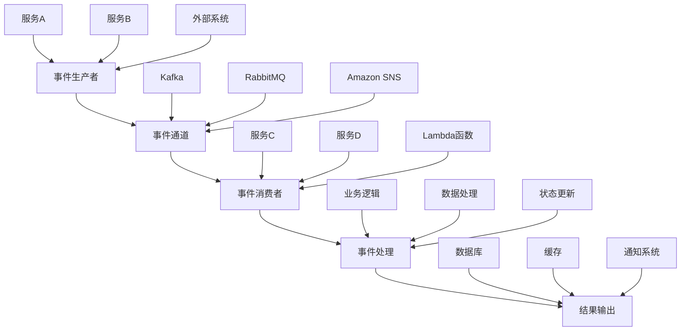
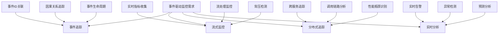

事件驱动架构（Event-Driven Architecture, EDA）正在成为现代微服务系统的重要设计模式。与传统的请求-响应模式不同，事件驱动架构通过异步事件传递实现服务间的解耦和协作。这种架构模式为系统带来了更高的可扩展性、弹性和响应能力，但同时也对日志与监控提出了新的挑战。本章将深入探讨微服务架构与事件驱动架构的日志与监控实践。

## 事件驱动架构基础

### 事件驱动架构核心概念

事件驱动架构基于事件的产生、传递和处理：



### 事件驱动架构优势

```yaml
# 事件驱动架构优势
event_driven_advantages:
  decoupling:
    description: "服务解耦"
    benefits:
      - 服务间松耦合
      - 独立开发和部署
      - 减少服务依赖
      - 提高系统灵活性
      
  scalability:
    description: "可扩展性"
    benefits:
      - 水平扩展能力
      - 负载均衡优化
      - 资源利用率提升
      - 成本效益改善
      
  resilience:
    description: "弹性"
    benefits:
      - 故障隔离
      - 自我修复能力
      - 容错机制
      - 系统稳定性提升
      
  responsiveness:
    description: "响应能力"
    benefits:
      - 实时数据处理
      - 低延迟响应
      - 事件驱动操作
      - 用户体验改善
```

## 事件驱动架构的监控挑战

### 传统监控方法的局限性

在事件驱动架构中，传统的监控方法面临诸多挑战：

```yaml
# 传统监控方法局限性
traditional_monitoring_limitations:
  synchronous_assumptions:
    challenges:
      - 假设同步请求-响应模式
      - 难以追踪异步事件流
      - 缺乏端到端可见性
      - 无法关联分布式事件
      
  state_tracking:
    challenges:
      - 难以跟踪系统状态变化
      - 缺乏事件因果关系
      - 复杂的状态一致性
      - 难以重现问题场景
      
  performance_monitoring:
    challenges:
      - 难以测量异步处理性能
      - 缺乏实时性能指标
      - 复杂的延迟分析
      - 难以识别性能瓶颈
      
  error_handling:
    challenges:
      - 异步错误传播复杂
      - 难以追踪错误根源
      - 缺乏统一错误处理
      - 复杂的重试机制
```

### 事件驱动监控需求



## 事件追踪实现

### 事件ID与追踪上下文

```python
# 事件驱动架构事件追踪实现
import uuid
import json
from datetime import datetime
from typing import Dict, Any, List, Optional
import asyncio
import logging

class EventContext:
    """事件上下文"""
    def __init__(self, event_id: str = None, correlation_id: str = None, 
                 causation_id: str = None, parent_event_id: str = None):
        self.event_id = event_id or str(uuid.uuid4())
        self.correlation_id = correlation_id or self.event_id
        self.causation_id = causation_id
        self.parent_event_id = parent_event_id
        self.timestamp = datetime.utcnow().isoformat()
        self.metadata = {}
        
    def add_metadata(self, key: str, value: Any):
        """添加元数据"""
        self.metadata[key] = value
        
    def to_dict(self) -> Dict[str, Any]:
        """转换为字典"""
        return {
            'event_id': self.event_id,
            'correlation_id': self.correlation_id,
            'causation_id': self.causation_id,
            'parent_event_id': self.parent_event_id,
            'timestamp': self.timestamp,
            'metadata': self.metadata
        }

class EventTracker:
    """事件追踪器"""
    def __init__(self, service_name: str):
        self.service_name = service_name
        self.logger = logging.getLogger(f'event-tracker.{service_name}')
        self.event_store = {}  # 简化的事件存储
        self.event_relationships = {}  # 事件关系存储
        
    def create_event(self, event_type: str, payload: Dict[str, Any], 
                    context: EventContext = None) -> EventContext:
        """创建事件"""
        if context is None:
            context = EventContext()
            
        event_data = {
            'event_type': event_type,
            'service_name': self.service_name,
            'payload': payload,
            'context': context.to_dict(),
            'status': 'created',
            'created_at': datetime.utcnow().isoformat()
        }
        
        self.event_store[context.event_id] = event_data
        self._log_event(event_data, 'EVENT_CREATED')
        
        return context
        
    def track_event_processing(self, context: EventContext, processing_info: Dict[str, Any]):
        """追踪事件处理"""
        if context.event_id not in self.event_store:
            raise ValueError(f"Event ID {context.event_id} not found")
            
        event_data = self.event_store[context.event_id]
        event_data['processing_info'] = processing_info
        event_data['status'] = 'processing'
        event_data['processing_started_at'] = datetime.utcnow().isoformat()
        
        self._log_event(event_data, 'EVENT_PROCESSING')
        
    def track_event_completion(self, context: EventContext, result: Dict[str, Any] = None):
        """追踪事件完成"""
        if context.event_id not in self.event_store:
            raise ValueError(f"Event ID {context.event_id} not found")
            
        event_data = self.event_store[context.event_id]
        event_data['result'] = result
        event_data['status'] = 'completed'
        event_data['completed_at'] = datetime.utcnow().isoformat()
        
        # 计算处理时间
        if 'processing_started_at' in event_data:
            start_time = datetime.fromisoformat(event_data['processing_started_at'])
            end_time = datetime.fromisoformat(event_data['completed_at'])
            duration = (end_time - start_time).total_seconds() * 1000
            event_data['processing_duration_ms'] = duration
            
        self._log_event(event_data, 'EVENT_COMPLETED')
        
    def track_event_error(self, context: EventContext, error: Exception):
        """追踪事件错误"""
        if context.event_id not in self.event_store:
            raise ValueError(f"Event ID {context.event_id} not found")
            
        event_data = self.event_store[context.event_id]
        event_data['status'] = 'error'
        event_data['error'] = {
            'type': type(error).__name__,
            'message': str(error),
            'timestamp': datetime.utcnow().isoformat()
        }
        
        self._log_event(event_data, 'EVENT_ERROR')
        
    def create_child_event(self, parent_context: EventContext, event_type: str, 
                          payload: Dict[str, Any]) -> EventContext:
        """创建子事件"""
        child_context = EventContext(
            correlation_id=parent_context.correlation_id,
            causation_id=parent_context.event_id,
            parent_event_id=parent_context.event_id
        )
        
        # 建立事件关系
        if parent_context.event_id not in self.event_relationships:
            self.event_relationships[parent_context.event_id] = []
        self.event_relationships[parent_context.event_id].append(child_context.event_id)
        
        # 创建子事件
        self.create_event(event_type, payload, child_context)
        
        return child_context
        
    def get_event_trace(self, event_id: str) -> Dict[str, Any]:
        """获取事件追踪信息"""
        return self.event_store.get(event_id, {})
        
    def get_correlation_trace(self, correlation_id: str) -> List[Dict[str, Any]]:
        """获取相关性追踪"""
        correlated_events = [
            event for event in self.event_store.values()
            if event.get('context', {}).get('correlation_id') == correlation_id
        ]
        return sorted(correlated_events, key=lambda x: x.get('context', {}).get('timestamp', ''))
        
    def get_causation_chain(self, event_id: str) -> List[Dict[str, Any]]:
        """获取因果链"""
        chain = []
        current_id = event_id
        
        while current_id:
            event = self.event_store.get(current_id)
            if event:
                chain.append(event)
                current_id = event.get('context', {}).get('causation_id')
            else:
                break
                
        return list(reversed(chain))
        
    def _log_event(self, event_data: Dict[str, Any], log_type: str):
        """记录事件日志"""
        log_entry = {
            'timestamp': datetime.utcnow().isoformat(),
            'service': self.service_name,
            'log_type': log_type,
            'event_data': event_data
        }
        
        self.logger.info(json.dumps(log_entry))

# 事件驱动服务示例
class EventDrivenService:
    """事件驱动服务基类"""
    def __init__(self, service_name: str):
        self.service_name = service_name
        self.event_tracker = EventTracker(service_name)
        self.logger = logging.getLogger(f'service.{service_name}')
        
    async def handle_event(self, event_type: str, payload: Dict[str, Any], 
                          context: EventContext = None) -> Dict[str, Any]:
        """处理事件"""
        try:
            # 创建或使用现有事件上下文
            if context is None:
                context = self.event_tracker.create_event(event_type, payload)
            else:
                self.event_tracker.track_event_processing(context, {
                    'handler': self.service_name,
                    'started_at': datetime.utcnow().isoformat()
                })
                
            self.logger.info(f"Processing event {event_type} with ID {context.event_id}")
            
            # 执行业务逻辑
            result = await self._process_event(event_type, payload, context)
            
            # 记录事件完成
            self.event_tracker.track_event_completion(context, result)
            
            return result
            
        except Exception as e:
            self.logger.error(f"Error processing event {event_type}: {e}")
            if context:
                self.event_tracker.track_event_error(context, e)
            raise
            
    async def _process_event(self, event_type: str, payload: Dict[str, Any], 
                           context: EventContext) -> Dict[str, Any]:
        """处理具体事件逻辑（子类实现）"""
        raise NotImplementedError("Subclasses must implement _process_event")
        
    def emit_event(self, event_type: str, payload: Dict[str, Any], 
                   parent_context: EventContext = None) -> EventContext:
        """发出事件"""
        if parent_context:
            context = self.event_tracker.create_child_event(parent_context, event_type, payload)
        else:
            context = self.event_tracker.create_event(event_type, payload)
            
        self.logger.info(f"Emitted event {event_type} with ID {context.event_id}")
        return context

# 具体服务实现示例
class OrderService(EventDrivenService):
    """订单服务"""
    def __init__(self):
        super().__init__('OrderService')
        
    async def _process_event(self, event_type: str, payload: Dict[str, Any], 
                           context: EventContext) -> Dict[str, Any]:
        if event_type == 'order_created':
            return await self._handle_order_created(payload, context)
        elif event_type == 'payment_processed':
            return await self._handle_payment_processed(payload, context)
        else:
            raise ValueError(f"Unknown event type: {event_type}")
            
    async def _handle_order_created(self, payload: Dict[str, Any], 
                                  context: EventContext) -> Dict[str, Any]:
        """处理订单创建事件"""
        order_id = payload.get('order_id')
        customer_id = payload.get('customer_id')
        
        self.logger.info(f"Processing order creation for order {order_id}")
        
        # 模拟业务处理
        await asyncio.sleep(0.1)
        
        # 发出支付处理事件
        payment_context = self.emit_event('payment_requested', {
            'order_id': order_id,
            'customer_id': customer_id,
            'amount': payload.get('amount', 0)
        }, context)
        
        return {
            'order_id': order_id,
            'status': 'payment_requested',
            'payment_event_id': payment_context.event_id
        }
        
    async def _handle_payment_processed(self, payload: Dict[str, Any], 
                                      context: EventContext) -> Dict[str, Any]:
        """处理支付处理完成事件"""
        order_id = payload.get('order_id')
        
        self.logger.info(f"Processing payment completion for order {order_id}")
        
        # 模拟业务处理
        await asyncio.sleep(0.05)
        
        return {
            'order_id': order_id,
            'status': 'completed',
            'completed_at': datetime.utcnow().isoformat()
        }

class PaymentService(EventDrivenService):
    """支付服务"""
    def __init__(self):
        super().__init__('PaymentService')
        
    async def _process_event(self, event_type: str, payload: Dict[str, Any], 
                           context: EventContext) -> Dict[str, Any]:
        if event_type == 'payment_requested':
            return await self._handle_payment_request(payload, context)
        else:
            raise ValueError(f"Unknown event type: {event_type}")
            
    async def _handle_payment_request(self, payload: Dict[str, Any], 
                                    context: EventContext) -> Dict[str, Any]:
        """处理支付请求事件"""
        order_id = payload.get('order_id')
        amount = payload.get('amount', 0)
        
        self.logger.info(f"Processing payment for order {order_id}, amount {amount}")
        
        # 模拟支付处理
        await asyncio.sleep(0.2)
        
        # 模拟支付成功
        payment_result = {
            'order_id': order_id,
            'amount': amount,
            'payment_id': f"pay_{uuid.uuid4().hex[:8]}",
            'status': 'success',
            'processed_at': datetime.utcnow().isoformat()
        }
        
        # 发出支付完成事件
        self.emit_event('payment_processed', payment_result, context)
        
        return payment_result

# 使用示例
async def demonstrate_event_driven_monitoring():
    """演示事件驱动监控"""
    # 初始化服务
    order_service = OrderService()
    payment_service = PaymentService()
    
    # 创建初始订单事件
    initial_context = EventContext()
    
    # 处理订单创建事件
    order_result = await order_service.handle_event('order_created', {
        'order_id': 'order_123',
        'customer_id': 'customer_456',
        'amount': 99.99
    }, initial_context)
    
    print("Order created:", order_result)
    
    # 处理支付请求事件
    payment_event_id = order_result.get('payment_event_id')
    if payment_event_id:
        payment_event = order_service.event_tracker.get_event_trace(payment_event_id)
        if payment_event:
            payment_context = EventContext(
                event_id=payment_event_id,
                correlation_id=payment_event['context']['correlation_id']
            )
            
            payment_result = await payment_service.handle_event(
                'payment_requested',
                payment_event['payload'],
                payment_context
            )
            
            print("Payment processed:", payment_result)
    
    # 获取相关性追踪
    correlation_id = initial_context.correlation_id
    correlation_trace = order_service.event_tracker.get_correlation_trace(correlation_id)
    print(f"\nCorrelation trace for {correlation_id}:")
    for event in correlation_trace:
        print(f"  - {event['event_type']} ({event['status']}) at {event['context']['timestamp']}")
    
    # 获取因果链
    causation_chain = order_service.event_tracker.get_causation_chain(payment_event_id)
    print(f"\nCausation chain ending at {payment_event_id}:")
    for event in causation_chain:
        print(f"  - {event['event_type']} ({event['context']['event_id']})")

# 运行示例
# asyncio.run(demonstrate_event_driven_monitoring())
```

## 流式监控实现

### 实时指标收集

```python
# 流式监控实现
import time
import threading
from collections import defaultdict, deque
from datetime import datetime, timedelta
from typing import Dict, Any, List
import json

class StreamMonitor:
    """流式监控器"""
    def __init__(self, service_name: str):
        self.service_name = service_name
        self.metrics = defaultdict(lambda: deque(maxlen=1000))  # 限制存储1000个数据点
        self.alerts = []
        self.monitoring_thread = None
        self.running = False
        
    def record_metric(self, metric_name: str, value: float, tags: Dict[str, str] = None):
        """记录指标"""
        timestamp = datetime.utcnow()
        metric_data = {
            'timestamp': timestamp.isoformat(),
            'value': value,
            'tags': tags or {}
        }
        
        self.metrics[metric_name].append(metric_data)
        
        # 检查是否需要触发告警
        self._check_alerts(metric_name, value, tags)
        
    def get_metric_stats(self, metric_name: str, window_minutes: int = 5) -> Dict[str, Any]:
        """获取指标统计信息"""
        cutoff_time = datetime.utcnow() - timedelta(minutes=window_minutes)
        
        recent_values = [
            data['value'] for data in self.metrics[metric_name]
            if datetime.fromisoformat(data['timestamp']) > cutoff_time
        ]
        
        if not recent_values:
            return {}
            
        return {
            'count': len(recent_values),
            'average': sum(recent_values) / len(recent_values),
            'min': min(recent_values),
            'max': max(recent_values),
            'median': sorted(recent_values)[len(recent_values) // 2],
            'window_minutes': window_minutes
        }
        
    def get_throughput_stats(self, event_type: str, window_minutes: int = 1) -> Dict[str, Any]:
        """获取吞吐量统计"""
        return self.get_metric_stats(f"throughput.{event_type}", window_minutes)
        
    def get_latency_stats(self, operation: str, window_minutes: int = 5) -> Dict[str, Any]:
        """获取延迟统计"""
        return self.get_metric_stats(f"latency.{operation}", window_minutes)
        
    def start_monitoring(self, check_interval: float = 1.0):
        """开始监控"""
        if self.running:
            return
            
        self.running = True
        self.monitoring_thread = threading.Thread(target=self._monitoring_loop, 
                                                args=(check_interval,))
        self.monitoring_thread.daemon = True
        self.monitoring_thread.start()
        
    def stop_monitoring(self):
        """停止监控"""
        self.running = False
        if self.monitoring_thread:
            self.monitoring_thread.join()
            
    def _monitoring_loop(self, check_interval: float):
        """监控循环"""
        while self.running:
            try:
                self._check_system_health()
                self._check_backpressure()
                time.sleep(check_interval)
            except Exception as e:
                print(f"Monitoring error: {e}")
                
    def _check_system_health(self):
        """检查系统健康"""
        # 检查内存使用
        import psutil
        memory_percent = psutil.virtual_memory().percent
        self.record_metric('system.memory_usage', memory_percent)
        
        # 检查CPU使用
        cpu_percent = psutil.cpu_percent(interval=0.1)
        self.record_metric('system.cpu_usage', cpu_percent)
        
    def _check_backpressure(self):
        """检查背压"""
        # 检查队列长度（模拟）
        for metric_name in self.metrics:
            if metric_name.startswith('queue_length.'):
                queue_length = len(self.metrics[metric_name])
                self.record_metric('system.queue_backpressure', 
                                 1.0 if queue_length > 100 else 0.0,
                                 {'queue': metric_name})
                
    def _check_alerts(self, metric_name: str, value: float, tags: Dict[str, str] = None):
        """检查告警条件"""
        # 简化的告警逻辑
        alert_conditions = {
            'system.memory_usage': {'threshold': 80.0, 'operator': 'gt'},
            'system.cpu_usage': {'threshold': 90.0, 'operator': 'gt'},
            'system.queue_backpressure': {'threshold': 0.5, 'operator': 'gt'}
        }
        
        if metric_name in alert_conditions:
            condition = alert_conditions[metric_name]
            threshold = condition['threshold']
            operator = condition['operator']
            
            should_alert = False
            if operator == 'gt' and value > threshold:
                should_alert = True
            elif operator == 'lt' and value < threshold:
                should_alert = True
            elif operator == 'eq' and value == threshold:
                should_alert = True
                
            if should_alert:
                self._trigger_alert(metric_name, value, threshold, tags)
                
    def _trigger_alert(self, metric_name: str, value: float, threshold: float, 
                      tags: Dict[str, str] = None):
        """触发告警"""
        alert = {
            'timestamp': datetime.utcnow().isoformat(),
            'metric_name': metric_name,
            'value': value,
            'threshold': threshold,
            'tags': tags or {},
            'severity': 'high' if value > threshold * 1.5 else 'medium'
        }
        
        self.alerts.append(alert)
        print(f"ALERT: {metric_name} = {value} (threshold: {threshold})")

# 事件处理监控装饰器
def monitor_event_processing(service_monitor: StreamMonitor):
    """监控事件处理的装饰器"""
    def decorator(func):
        async def wrapper(self, event_type: str, payload: Dict[str, Any], 
                         context: EventContext = None):
            start_time = time.time()
            
            try:
                # 记录吞吐量
                service_monitor.record_metric(
                    f"throughput.{event_type}", 
                    1.0,
                    {'service': self.service_name}
                )
                
                # 执行原函数
                result = await func(self, event_type, payload, context)
                
                # 记录成功处理
                service_monitor.record_metric(
                    f"success.{event_type}",
                    1.0,
                    {'service': self.service_name}
                )
                
                return result
                
            except Exception as e:
                # 记录错误
                service_monitor.record_metric(
                    f"error.{event_type}",
                    1.0,
                    {'service': self.service_name, 'error_type': type(e).__name__}
                )
                raise
                
            finally:
                # 记录处理延迟
                duration = (time.time() - start_time) * 1000  # 转换为毫秒
                service_monitor.record_metric(
                    f"latency.{event_type}",
                    duration,
                    {'service': self.service_name}
                )
                
        return wrapper
    return decorator

# 增强的事件驱动服务
class MonitoredEventDrivenService(EventDrivenService):
    """带监控的事件驱动服务"""
    def __init__(self, service_name: str):
        super().__init__(service_name)
        self.stream_monitor = StreamMonitor(service_name)
        self.stream_monitor.start_monitoring()
        
    @monitor_event_processing
    async def handle_event(self, event_type: str, payload: Dict[str, Any], 
                          context: EventContext = None) -> Dict[str, Any]:
        return await super().handle_event(event_type, payload, context)
        
    def get_service_metrics(self, window_minutes: int = 5) -> Dict[str, Any]:
        """获取服务指标"""
        metrics_summary = {}
        
        for metric_name in self.stream_monitor.metrics:
            if metric_name.startswith(f"throughput.") or metric_name.startswith(f"latency."):
                stats = self.stream_monitor.get_metric_stats(metric_name, window_minutes)
                if stats:
                    metrics_summary[metric_name] = stats
                    
        return metrics_summary

# 使用示例
async def demonstrate_stream_monitoring():
    """演示流式监控"""
    # 初始化带监控的服务
    order_service = MonitoredEventDrivenService('OrderService')
    payment_service = MonitoredEventDrivenService('PaymentService')
    
    # 处理多个事件以生成监控数据
    for i in range(10):
        context = EventContext()
        
        await order_service.handle_event('order_created', {
            'order_id': f'order_{i}',
            'customer_id': f'customer_{i % 3}',
            'amount': 50.0 + i * 10
        }, context)
        
        # 添加一些延迟以模拟真实场景
        await asyncio.sleep(0.1)
        
    # 获取服务指标
    order_metrics = order_service.get_service_metrics()
    print("Order service metrics:")
    print(json.dumps(order_metrics, indent=2))
    
    payment_metrics = payment_service.get_service_metrics()
    print("\nPayment service metrics:")
    print(json.dumps(payment_metrics, indent=2))
    
    # 查看告警
    if order_service.stream_monitor.alerts:
        print("\nAlerts:")
        for alert in order_service.stream_monitor.alerts:
            print(f"  {alert}")

# 运行示例
# asyncio.run(demonstrate_stream_monitoring())
```

## 分布式追踪实现

### 跨服务追踪

```python
# 分布式追踪实现
import requests
import uuid
from datetime import datetime
from typing import Dict, Any, List, Optional
import json

class DistributedTracer:
    """分布式追踪器"""
    def __init__(self, service_name: str, trace_collector_url: str = None):
        self.service_name = service_name
        self.trace_collector_url = trace_collector_url
        self.current_trace = None
        self.current_span = None
        
    def start_trace(self, trace_id: str = None, span_id: str = None) -> Dict[str, str]:
        """开始追踪"""
        if trace_id is None:
            trace_id = str(uuid.uuid4())
        if span_id is None:
            span_id = str(uuid.uuid4())
            
        self.current_trace = {
            'trace_id': trace_id,
            'spans': []
        }
        
        self.current_span = self._create_span(
            span_id=span_id,
            operation_name=f"{self.service_name}.entry",
            start_time=datetime.utcnow().isoformat()
        )
        
        self.current_trace['spans'].append(self.current_span)
        
        return {
            'trace_id': trace_id,
            'span_id': span_id
        }
        
    def start_child_span(self, operation_name: str, parent_span_id: str = None) -> str:
        """开始子跨度"""
        if self.current_trace is None:
            raise ValueError("No active trace")
            
        span_id = str(uuid.uuid4())
        parent_id = parent_span_id or (self.current_span['span_id'] if self.current_span else None)
        
        child_span = self._create_span(
            span_id=span_id,
            operation_name=operation_name,
            start_time=datetime.utcnow().isoformat(),
            parent_id=parent_id
        )
        
        self.current_trace['spans'].append(child_span)
        self.current_span = child_span
        
        return span_id
        
    def end_span(self, span_id: str = None, tags: Dict[str, Any] = None):
        """结束跨度"""
        if self.current_trace is None:
            return
            
        span_to_end = None
        if span_id:
            span_to_end = next((span for span in self.current_trace['spans'] 
                              if span['span_id'] == span_id), None)
        else:
            span_to_end = self.current_span
            
        if span_to_end:
            span_to_end['end_time'] = datetime.utcnow().isoformat()
            
            if tags:
                span_to_end.setdefault('tags', {}).update(tags)
                
            # 计算持续时间
            if 'start_time' in span_to_end and 'end_time' in span_to_end:
                start = datetime.fromisoformat(span_to_end['start_time'])
                end = datetime.fromisoformat(span_to_end['end_time'])
                duration = (end - start).total_seconds() * 1000  # 转换为毫秒
                span_to_end['duration_ms'] = duration
                
        # 更新当前跨度为父跨度
        if span_to_end and span_to_end.get('parent_id'):
            self.current_span = next((span for span in self.current_trace['spans'] 
                                    if span['span_id'] == span_to_end['parent_id']), None)
        else:
            self.current_span = None
            
    def add_span_tag(self, key: str, value: Any, span_id: str = None):
        """添加跨度标签"""
        if self.current_trace is None:
            return
            
        span_to_tag = None
        if span_id:
            span_to_tag = next((span for span in self.current_trace['spans'] 
                              if span['span_id'] == span_id), None)
        else:
            span_to_tag = self.current_span
            
        if span_to_tag:
            span_to_tag.setdefault('tags', {})[key] = value
            
    def add_span_log(self, message: str, fields: Dict[str, Any] = None, span_id: str = None):
        """添加跨度日志"""
        if self.current_trace is None:
            return
            
        span_to_log = None
        if span_id:
            span_to_log = next((span for span in self.current_trace['spans'] 
                              if span['span_id'] == span_id), None)
        else:
            span_to_log = self.current_span
            
        if span_to_log:
            log_entry = {
                'timestamp': datetime.utcnow().isoformat(),
                'message': message
            }
            if fields:
                log_entry['fields'] = fields
                
            span_to_log.setdefault('logs', []).append(log_entry)
            
    def get_trace(self) -> Dict[str, Any]:
        """获取当前追踪"""
        return self.current_trace.copy() if self.current_trace else None
        
    def export_trace(self):
        """导出追踪数据"""
        if self.current_trace and self.trace_collector_url:
            try:
                response = requests.post(
                    self.trace_collector_url,
                    json=self.current_trace,
                    headers={'Content-Type': 'application/json'}
                )
                response.raise_for_status()
                print(f"Trace exported successfully: {response.status_code}")
            except Exception as e:
                print(f"Error exporting trace: {e}")
                
    def _create_span(self, span_id: str, operation_name: str, start_time: str, 
                    parent_id: str = None) -> Dict[str, Any]:
        """创建跨度"""
        span = {
            'span_id': span_id,
            'operation_name': operation_name,
            'start_time': start_time,
            'service_name': self.service_name
        }
        
        if parent_id:
            span['parent_id'] = parent_id
            
        return span

# 分布式追踪装饰器
def trace_method(tracer: DistributedTracer, operation_name: str = None):
    """追踪方法执行的装饰器"""
    def decorator(func):
        async def wrapper(self, *args, **kwargs):
            # 生成操作名称
            op_name = operation_name or f"{self.__class__.__name__}.{func.__name__}"
            
            # 开始子跨度
            span_id = tracer.start_child_span(op_name)
            
            try:
                # 执行原方法
                result = await func(self, *args, **kwargs)
                
                # 添加成功标签
                tracer.add_span_tag('status', 'success', span_id)
                
                return result
                
            except Exception as e:
                # 添加错误标签和日志
                tracer.add_span_tag('status', 'error', span_id)
                tracer.add_span_tag('error.type', type(e).__name__, span_id)
                tracer.add_span_log(f"Error in {op_name}: {str(e)}", 
                                  {'error': str(e)}, span_id)
                raise
                
            finally:
                # 结束跨度
                tracer.end_span(span_id)
                
        return wrapper
    return decorator

# 带分布式追踪的服务
class TracedEventDrivenService(MonitoredEventDrivenService):
    """带分布式追踪的事件驱动服务"""
    def __init__(self, service_name: str, trace_collector_url: str = None):
        super().__init__(service_name)
        self.tracer = DistributedTracer(service_name, trace_collector_url)
        
    @trace_method(None, "handle_event")  # 这里需要特殊处理
    async def handle_event(self, event_type: str, payload: Dict[str, Any], 
                          context: EventContext = None) -> Dict[str, Any]:
        # 为装饰器设置正确的追踪器
        trace_method_decorator = trace_method(self.tracer)
        traced_func = trace_method_decorator(super().handle_event)
        return await traced_func(self, event_type, payload, context)
        
    def start_trace_context(self, trace_headers: Dict[str, str] = None) -> Dict[str, str]:
        """开始追踪上下文"""
        if trace_headers:
            # 从HTTP头中提取追踪信息
            trace_id = trace_headers.get('X-B3-TraceId') or trace_headers.get('traceparent')
            span_id = trace_headers.get('X-B3-SpanId')
        else:
            trace_id = None
            span_id = None
            
        trace_context = self.tracer.start_trace(trace_id, span_id)
        
        # 添加服务标签
        self.tracer.add_span_tag('service.version', '1.0.0')
        self.tracer.add_span_tag('deployment.environment', 'production')
        
        return trace_context
        
    def get_trace_headers(self) -> Dict[str, str]:
        """获取追踪HTTP头"""
        if self.tracer.current_trace and self.tracer.current_span:
            return {
                'X-B3-TraceId': self.tracer.current_trace['trace_id'],
                'X-B3-SpanId': self.tracer.current_span['span_id'],
                'X-B3-Sampled': '1'
            }
        return {}

# 事件总线模拟
class EventBus:
    """事件总线"""
    def __init__(self):
        self.subscribers = defaultdict(list)
        
    def subscribe(self, event_type: str, handler):
        """订阅事件"""
        self.subscribers[event_type].append(handler)
        
    async def publish(self, event_type: str, payload: Dict[str, Any], 
                     trace_headers: Dict[str, str] = None):
        """发布事件"""
        handlers = self.subscribers.get(event_type, [])
        for handler in handlers:
            await handler(event_type, payload, trace_headers)

# 使用示例
async def demonstrate_distributed_tracing():
    """演示分布式追踪"""
    # 初始化服务和事件总线
    order_service = TracedEventDrivenService('OrderService', 'http://localhost:9411/api/v2/spans')
    payment_service = TracedEventDrivenService('PaymentService', 'http://localhost:9411/api/v2/spans')
    event_bus = EventBus()
    
    # 订阅事件
    async def handle_payment_request(event_type: str, payload: Dict[str, Any], 
                                   trace_headers: Dict[str, str] = None):
        # 在支付服务中开始新的追踪上下文
        payment_service.start_trace_context(trace_headers)
        await payment_service.handle_event(event_type, payload)
        
    event_bus.subscribe('payment_requested', handle_payment_request)
    
    # 开始追踪
    trace_context = order_service.start_trace_context()
    print(f"Started trace: {trace_context}")
    
    # 处理订单事件
    context = EventContext()
    result = await order_service.handle_event('order_created', {
        'order_id': 'order_123',
        'customer_id': 'customer_456',
        'amount': 99.99
    }, context)
    
    print("Order processing result:", result)
    
    # 获取追踪数据
    trace_data = order_service.tracer.get_trace()
    print("Trace data:", json.dumps(trace_data, indent=2))
    
    # 导出追踪数据
    order_service.tracer.export_trace()

# 运行示例
# asyncio.run(demonstrate_distributed_tracing())
```

## 实时分析与告警

### 流式分析实现

```python
# 实时分析与告警实现
import asyncio
import json
from datetime import datetime, timedelta
from typing import Dict, Any, List, Callable
from collections import defaultdict, deque
import statistics

class RealTimeAnalyzer:
    """实时分析器"""
    def __init__(self, service_name: str):
        self.service_name = service_name
        self.metrics_buffer = defaultdict(deque)
        self.alert_rules = []
        self.anomaly_detectors = {}
        self.callbacks = defaultdict(list)
        
    def add_metric(self, metric_name: str, value: float, timestamp: datetime = None):
        """添加指标数据"""
        if timestamp is None:
            timestamp = datetime.utcnow()
            
        self.metrics_buffer[metric_name].append({
            'timestamp': timestamp,
            'value': value
        })
        
        # 保持缓冲区大小
        if len(self.metrics_buffer[metric_name]) > 1000:
            self.metrics_buffer[metric_name].popleft()
            
        # 触发实时分析
        self._trigger_analysis(metric_name, value, timestamp)
        
    def add_alert_rule(self, rule_name: str, metric_name: str, 
                      condition: Callable[[float], bool], 
                      severity: str = 'medium',
                      description: str = ''):
        """添加告警规则"""
        rule = {
            'name': rule_name,
            'metric_name': metric_name,
            'condition': condition,
            'severity': severity,
            'description': description,
            'enabled': True
        }
        self.alert_rules.append(rule)
        
    def add_anomaly_detector(self, detector_name: str, metric_name: str,
                           detector_func: Callable[[List[float]], bool],
                           description: str = ''):
        """添加异常检测器"""
        self.anomaly_detectors[detector_name] = {
            'metric_name': metric_name,
            'detector': detector_func,
            'description': description
        }
        
    def register_callback(self, event_type: str, callback: Callable):
        """注册回调函数"""
        self.callbacks[event_type].append(callback)
        
    def get_metric_history(self, metric_name: str, 
                          window_minutes: int = 5) -> List[Dict[str, Any]]:
        """获取指标历史数据"""
        cutoff_time = datetime.utcnow() - timedelta(minutes=window_minutes)
        return [
            data for data in self.metrics_buffer[metric_name]
            if data['timestamp'] > cutoff_time
        ]
        
    def get_metric_statistics(self, metric_name: str, 
                            window_minutes: int = 5) -> Dict[str, float]:
        """获取指标统计信息"""
        history = self.get_metric_history(metric_name, window_minutes)
        if not history:
            return {}
            
        values = [data['value'] for data in history]
        return {
            'count': len(values),
            'average': statistics.mean(values),
            'median': statistics.median(values),
            'min': min(values),
            'max': max(values),
            'std_dev': statistics.stdev(values) if len(values) > 1 else 0
        }
        
    def _trigger_analysis(self, metric_name: str, value: float, timestamp: datetime):
        """触发实时分析"""
        # 检查告警规则
        self._check_alert_rules(metric_name, value, timestamp)
        
        # 检查异常检测
        self._check_anomalies(metric_name, value, timestamp)
        
    def _check_alert_rules(self, metric_name: str, value: float, timestamp: datetime):
        """检查告警规则"""
        for rule in self.alert_rules:
            if not rule['enabled'] or rule['metric_name'] != metric_name:
                continue
                
            if rule['condition'](value):
                alert = {
                    'timestamp': timestamp.isoformat(),
                    'rule_name': rule['name'],
                    'metric_name': metric_name,
                    'value': value,
                    'severity': rule['severity'],
                    'description': rule['description']
                }
                
                # 触发告警回调
                for callback in self.callbacks['alert']:
                    try:
                        callback(alert)
                    except Exception as e:
                        print(f"Error in alert callback: {e}")
                        
    def _check_anomalies(self, metric_name: str, value: float, timestamp: datetime):
        """检查异常"""
        for detector_name, detector_config in self.anomaly_detectors.items():
            if detector_config['metric_name'] != metric_name:
                continue
                
            # 获取历史数据
            history = self.get_metric_history(metric_name, 10)  # 10分钟窗口
            if len(history) < 5:  # 需要至少5个数据点
                continue
                
            values = [data['value'] for data in history]
            
            # 使用检测器检查异常
            if detector_config['detector'](values):
                anomaly = {
                    'timestamp': timestamp.isoformat(),
                    'detector_name': detector_name,
                    'metric_name': metric_name,
                    'value': value,
                    'history_values': values[-10:],  # 最近10个值
                    'description': detector_config['description']
                }
                
                # 触发异常回调
                for callback in self.callbacks['anomaly']:
                    try:
                        callback(anomaly)
                    except Exception as e:
                        print(f"Error in anomaly callback: {e}")

# 异常检测算法
class AnomalyDetectors:
    """异常检测算法集合"""
    
    @staticmethod
    def statistical_anomaly_detector(threshold_std: float = 2.0):
        """基于统计的异常检测器"""
        def detector(values: List[float]) -> bool:
            if len(values) < 3:
                return False
                
            mean = statistics.mean(values[:-1])  # 不包括当前值
            std = statistics.stdev(values[:-1]) if len(values[:-1]) > 1 else 0
            
            current_value = values[-1]
            return abs(current_value - mean) > threshold_std * std
            
        return detector
        
    @staticmethod
    def threshold_anomaly_detector(min_threshold: float = None, 
                                 max_threshold: float = None):
        """基于阈值的异常检测器"""
        def detector(values: List[float]) -> bool:
            if not values:
                return False
                
            current_value = values[-1]
            
            if min_threshold is not None and current_value < min_threshold:
                return True
            if max_threshold is not None and current_value > max_threshold:
                return True
                
            return False
            
        return detector
        
    @staticmethod
    def trend_anomaly_detector(window_size: int = 5, trend_threshold: float = 0.1):
        """基于趋势的异常检测器"""
        def detector(values: List[float]) -> bool:
            if len(values) < window_size + 1:
                return False
                
            # 计算最近几个点的趋势
            recent_values = values[-(window_size + 1):]
            x = list(range(len(recent_values)))
            
            # 简单线性回归
            n = len(recent_values)
            sum_x = sum(x)
            sum_y = sum(recent_values)
            sum_xy = sum(x[i] * recent_values[i] for i in range(n))
            sum_xx = sum(x[i] * x[i] for i in range(n))
            
            if n * sum_xx - sum_x * sum_x == 0:
                return False
                
            slope = (n * sum_xy - sum_x * sum_y) / (n * sum_xx - sum_x * sum_x)
            
            # 检查趋势是否异常
            return abs(slope) > trend_threshold
            
        return detector

# 带实时分析的服务
class AnalyzedEventDrivenService(TracedEventDrivenService):
    """带实时分析的事件驱动服务"""
    def __init__(self, service_name: str, trace_collector_url: str = None):
        super().__init__(service_name, trace_collector_url)
        self.analyzer = RealTimeAnalyzer(service_name)
        self._setup_analyzers()
        
    def _setup_analyzers(self):
        """设置分析器"""
        # 添加告警规则
        self.analyzer.add_alert_rule(
            'high_error_rate',
            'error_rate',
            lambda x: x > 0.05,  # 错误率超过5%
            'high',
            'High error rate detected'
        )
        
        self.analyzer.add_alert_rule(
            'high_latency',
            'avg_latency',
            lambda x: x > 1000,  # 延迟超过1秒
            'medium',
            'High average latency detected'
        )
        
        # 添加异常检测器
        self.analyzer.add_anomaly_detector(
            'statistical_anomaly',
            'response_time',
            AnomalyDetectors.statistical_anomaly_detector(2.0),
            'Statistical anomaly in response time'
        )
        
        self.analyzer.add_anomaly_detector(
            'threshold_anomaly',
            'memory_usage',
            AnomalyDetectors.threshold_anomaly_detector(max_threshold=85.0),
            'Memory usage threshold exceeded'
        )
        
        # 注册回调函数
        self.analyzer.register_callback('alert', self._handle_alert)
        self.analyzer.register_callback('anomaly', self._handle_anomaly)
        
    def _handle_alert(self, alert: Dict[str, Any]):
        """处理告警"""
        print(f"ALERT [{alert['severity']}]: {alert['rule_name']} - {alert['description']}")
        print(f"  Metric: {alert['metric_name']} = {alert['value']}")
        
        # 记录到日志系统
        self.logger.warning(f"Alert triggered: {json.dumps(alert)}")
        
    def _handle_anomaly(self, anomaly: Dict[str, Any]):
        """处理异常"""
        print(f"ANOMALY: {anomaly['detector_name']} - {anomaly['description']}")
        print(f"  Metric: {anomaly['metric_name']} = {anomaly['value']}")
        
        # 记录到日志系统
        self.logger.warning(f"Anomaly detected: {json.dumps(anomaly)}")
        
    def record_metric(self, metric_name: str, value: float):
        """记录指标到分析器"""
        self.analyzer.add_metric(metric_name, value)

# 使用示例
async def demonstrate_real_time_analysis():
    """演示实时分析"""
    # 初始化带分析的服务
    service = AnalyzedEventDrivenService('AnalysisService')
    
    # 模拟生成指标数据
    import random
    
    for i in range(50):
        # 模拟正常的响应时间
        response_time = random.normalvariate(100, 20)  # 平均100ms，标准差20ms
        service.record_metric('response_time', response_time)
        
        # 模拟内存使用
        memory_usage = random.normalvariate(50, 10)  # 平均50%，标准差10%
        service.record_metric('memory_usage', memory_usage)
        
        # 偶尔模拟异常数据
        if i == 25:
            # 模拟高响应时间异常
            service.record_metric('response_time', 500)  # 明显高于正常值
        elif i == 30:
            # 模拟高内存使用异常
            service.record_metric('memory_usage', 90)  # 接近阈值
            
        # 模拟错误率
        error_rate = 0.01 if random.random() > 0.95 else 0.0  # 5%错误率
        service.record_metric('error_rate', error_rate)
        
        # 模拟延迟
        latency = random.normalvariate(200, 50)  # 平均200ms
        service.record_metric('avg_latency', latency)
        
        await asyncio.sleep(0.1)  # 模拟时间间隔
        
    # 获取统计信息
    response_stats = service.analyzer.get_metric_statistics('response_time')
    print("Response time statistics:", response_stats)
    
    memory_stats = service.analyzer.get_metric_statistics('memory_usage')
    print("Memory usage statistics:", memory_stats)

# 运行示例
# asyncio.run(demonstrate_real_time_analysis())
```

## 最佳实践总结

### 1. 事件追踪最佳实践

```yaml
# 事件追踪最佳实践
event_tracking_best_practices:
  event_id_management:
    guidelines:
      - "为每个事件生成唯一ID"
      - "维护相关性ID以追踪业务流程"
      - "记录因果关系ID以追踪事件链"
      - "确保ID在分布式系统中唯一"
      
  context_propagation:
    guidelines:
      - "在服务调用间传递追踪上下文"
      - "维护事件元数据的一致性"
      - "支持跨服务的上下文关联"
      - "实现上下文的序列化和反序列化"
      
  lifecycle_tracking:
    guidelines:
      - "记录事件的完整生命周期"
      - "跟踪事件处理的各个阶段"
      - "记录处理时间和资源消耗"
      - "维护事件状态的完整历史"
```

### 2. 流式监控最佳实践

```yaml
# 流式监控最佳实践
streaming_monitoring_best_practices:
  real_time_metrics:
    guidelines:
      - "选择关键业务指标进行实时监控"
      - "实施高效的指标收集机制"
      - "提供多维度的指标分析"
      - "支持自定义指标的动态添加"
      
  backpressure_handling:
    guidelines:
      - "监控系统背压情况"
      - "实施流量控制机制"
      - "提供队列长度监控"
      - "支持自动扩展和负载均衡"
      
  alerting_strategy:
    guidelines:
      - "设置合理的告警阈值"
      - "避免告警疲劳"
      - "提供多级别的告警严重性"
      - "支持告警的自动抑制和升级"
```

## 总结

微服务架构与事件驱动架构的日志与监控需要全新的方法和工具。通过实现事件追踪、流式监控、分布式追踪和实时分析，我们可以构建强大的可观察性体系，确保系统的可靠性、性能和可维护性。

关键要点包括：
1. **事件追踪**：实现完整的事件生命周期追踪和因果关系分析
2. **流式监控**：提供实时的指标收集和分析能力
3. **分布式追踪**：支持跨服务的调用链路追踪
4. **实时分析**：实现智能的异常检测和告警机制

通过遵循最佳实践和使用适当的工具，我们可以构建适应事件驱动架构特点的监控体系，为现代微服务系统提供强有力的可观察性支撑。

在下一节中，我们将探讨微服务中的零信任架构与日志安全。