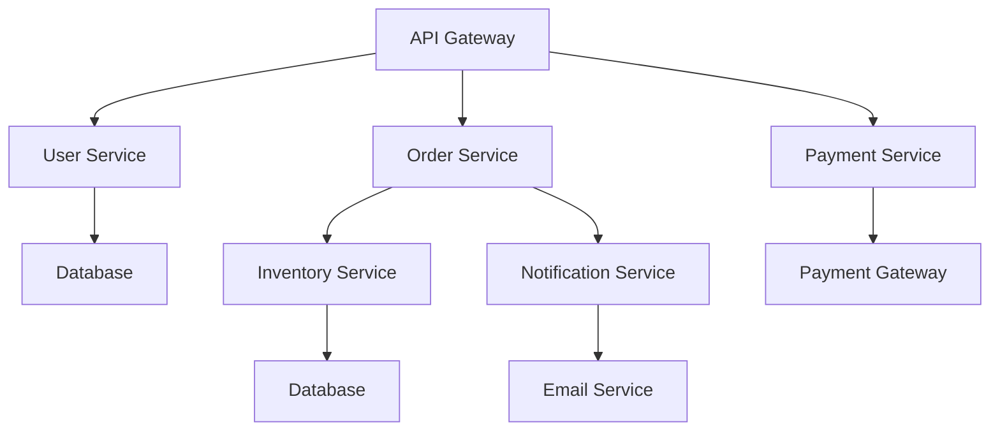
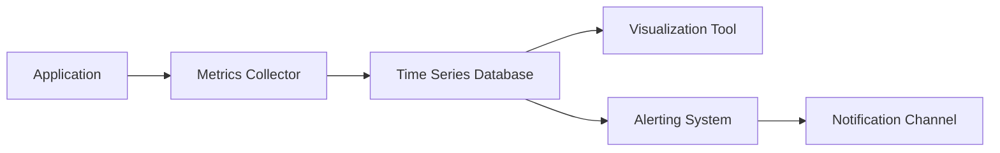

在现代微服务架构中，监控不仅是系统运维的基础，更是确保业务连续性和用户体验的关键手段。本文将深入探讨监控的基本概念、在微服务中的重要性，以及如何通过有效的监控策略提升系统的可靠性和性能。

## 什么是监控

### 监控的定义

监控是指持续观察、收集、分析和报告系统运行状态的过程，目的是确保系统按预期运行，及时发现和解决问题。在微服务架构中，监控涵盖了从基础设施到应用程序，从性能指标到业务指标的全方位观测。

### 监控的核心要素

#### 1. 数据收集
持续收集系统运行时产生的各种数据，包括：
- 系统指标（CPU、内存、磁盘、网络）
- 应用程序指标（响应时间、吞吐量、错误率）
- 业务指标（订单量、用户活跃度、转化率）
- 日志数据（错误日志、访问日志、审计日志）

#### 2. 数据处理
对收集到的原始数据进行处理和分析：
- 数据清洗和格式化
- 指标计算和聚合
- 异常检测和模式识别
- 趋势分析和预测

#### 3. 数据可视化
将处理后的数据以直观的方式展示：
- 仪表板和图表
- 实时监控面板
- 历史数据分析报告
- 自定义视图和告警

#### 4. 告警和响应
基于监控数据触发相应的操作：
- 异常告警通知
- 自动化响应机制
- 故障处理流程
- 性能优化建议

## 微服务监控的重要性

### 复杂性管理

微服务架构将单一应用程序拆分为多个独立的服务，这种架构带来了显著的复杂性：

#### 服务间依赖关系



在上述架构中，一个用户请求可能涉及多个服务的协同工作，任何一个服务的故障都可能影响整个业务流程。

#### 分布式故障传播

微服务架构中的故障传播具有级联效应：
- **雪崩效应**：一个服务的故障可能引发连锁反应
- **超时传播**：网络延迟或服务无响应会逐级传递
- **资源耗尽**：故障服务占用大量资源影响其他服务

### 可观察性需求

可观察性是理解和推理系统内部状态的能力，包含三个核心支柱：

#### 日志（Logs）
记录系统运行过程中发生的事件，提供详细的上下文信息。

#### 挘标（Metrics）
数值化的系统状态表示，便于聚合分析和趋势观察。

#### 追踪（Traces）
记录请求在分布式系统中的完整处理流程，提供端到端的可见性。

### 业务连续性保障

有效的监控系统能够：

#### 快速故障检测
```java
@Component
public class ServiceHealthMonitor {
    
    private final MeterRegistry meterRegistry;
    private final Gauge serviceHealthGauge;
    
    public ServiceHealthMonitor(MeterRegistry meterRegistry) {
        this.meterRegistry = meterRegistry;
        this.serviceHealthGauge = Gauge.builder("service.health.status")
            .description("Overall health status of the service")
            .register(meterRegistry);
    }
    
    @Scheduled(fixedRate = 30000) // 每30秒检查一次
    public void checkServiceHealth() {
        boolean isHealthy = performHealthChecks();
        
        if (!isHealthy) {
            // 触发告警
            alertService.sendAlert(new HealthAlert()
                .setServiceName("user-service")
                .setSeverity(AlertSeverity.CRITICAL)
                .setMessage("Service health check failed"));
        }
        
        // 更新健康状态指标
        serviceHealthGauge.set(isHealthy ? 1.0 : 0.0);
    }
    
    private boolean performHealthChecks() {
        // 检查数据库连接
        if (!databaseHealthCheck()) {
            return false;
        }
        
        // 检查外部服务依赖
        if (!externalServiceHealthCheck()) {
            return false;
        }
        
        // 检查磁盘空间
        if (!diskSpaceHealthCheck()) {
            return false;
        }
        
        return true;
    }
}
```

#### 性能优化指导
```java
@RestController
public class OrderController {
    
    private final MeterRegistry meterRegistry;
    private final Timer orderProcessingTimer;
    private final Counter orderSuccessCounter;
    private final Counter orderFailureCounter;
    
    public OrderController(MeterRegistry meterRegistry) {
        this.meterRegistry = meterRegistry;
        this.orderProcessingTimer = Timer.builder("order.processing.time")
            .description("Time taken to process orders")
            .register(meterRegistry);
        this.orderSuccessCounter = Counter.builder("order.success")
            .description("Number of successful orders")
            .register(meterRegistry);
        this.orderFailureCounter = Counter.builder("order.failure")
            .description("Number of failed orders")
            .register(meterRegistry);
    }
    
    @PostMapping("/orders")
    public ResponseEntity<Order> createOrder(@RequestBody OrderRequest request) {
        Timer.Sample sample = Timer.start(meterRegistry);
        
        try {
            Order order = orderService.createOrder(request);
            orderSuccessCounter.increment();
            sample.stop(orderProcessingTimer);
            return ResponseEntity.ok(order);
        } catch (Exception e) {
            orderFailureCounter.increment();
            sample.stop(orderProcessingTimer);
            return ResponseEntity.status(HttpStatus.INTERNAL_SERVER_ERROR).build();
        }
    }
}
```

#### 容量规划支持
```java
@Component
public class CapacityPlanningService {
    
    private final MeterRegistry meterRegistry;
    
    public CapacityPlanningService(MeterRegistry meterRegistry) {
        this.meterRegistry = meterRegistry;
    }
    
    @EventListener
    public void handleResourceUsageEvent(ResourceUsageEvent event) {
        // 记录资源使用情况
        Gauge.builder("cpu.utilization")
            .description("CPU utilization percentage")
            .register(meterRegistry, event, ResourceUsageEvent::getCpuUsage);
            
        Gauge.builder("memory.utilization")
            .description("Memory utilization percentage")
            .register(meterRegistry, event, ResourceUsageEvent::getMemoryUsage);
            
        Gauge.builder("disk.utilization")
            .description("Disk utilization percentage")
            .register(meterRegistry, event, ResourceUsageEvent::getDiskUsage);
    }
    
    public CapacityReport generateCapacityReport() {
        // 基于历史数据生成容量规划报告
        return capacityAnalyzer.analyzeResourceUsageTrends();
    }
}
```

## 微服务监控的主要目标

### 性能监控

#### 响应时间监控
```java
@RestController
public class PerformanceMonitoringController {
    
    private final MeterRegistry meterRegistry;
    private final Timer apiResponseTimer;
    
    public PerformanceMonitoringController(MeterRegistry meterRegistry) {
        this.meterRegistry = meterRegistry;
        this.apiResponseTimer = Timer.builder("api.response.time")
            .description("API response time")
            .tags("endpoint", "/api/users")
            .register(meterRegistry);
    }
    
    @GetMapping("/api/users/{id}")
    public User getUser(@PathVariable String id) {
        Timer.Sample sample = Timer.start(meterRegistry);
        
        try {
            User user = userService.findById(id);
            sample.stop(apiResponseTimer);
            return user;
        } catch (Exception e) {
            sample.stop(apiResponseTimer);
            throw e;
        }
    }
}
```

#### 吞吐量监控
```java
@Component
public class ThroughputMonitor {
    
    private final MeterRegistry meterRegistry;
    private final Counter requestCounter;
    
    public ThroughputMonitor(MeterRegistry meterRegistry) {
        this.meterRegistry = meterRegistry;
        this.requestCounter = Counter.builder("http.requests.total")
            .description("Total HTTP requests")
            .tags("method", "GET", "endpoint", "/api/users")
            .register(meterRegistry);
    }
    
    @EventListener
    public void handleHttpRequest(HttpRequestEvent event) {
        requestCounter.increment();
    }
}
```

### 健康状态监控

#### 存活检查（Liveness Probe）
```java
@RestController
public class HealthController {
    
    @GetMapping("/health/live")
    public ResponseEntity<HealthStatus> livenessProbe() {
        // 检查应用是否正在运行
        if (isApplicationRunning()) {
            return ResponseEntity.ok(new HealthStatus("UP"));
        } else {
            return ResponseEntity.status(HttpStatus.SERVICE_UNAVAILABLE)
                .body(new HealthStatus("DOWN"));
        }
    }
    
    private boolean isApplicationRunning() {
        // 简单的存活检查，只确认应用进程是否在运行
        return true;
    }
}
```

#### 就绪检查（Readiness Probe）
```java
@RestController
public class ReadinessController {
    
    @Autowired
    private DatabaseService databaseService;
    
    @Autowired
    private ExternalService externalService;
    
    @GetMapping("/health/ready")
    public ResponseEntity<HealthStatus> readinessProbe() {
        // 检查应用是否准备好接收流量
        if (isApplicationReady()) {
            return ResponseEntity.ok(new HealthStatus("READY"));
        } else {
            return ResponseEntity.status(HttpStatus.SERVICE_UNAVAILABLE)
                .body(new HealthStatus("NOT_READY"));
        }
    }
    
    private boolean isApplicationReady() {
        // 检查数据库连接
        if (!databaseService.isHealthy()) {
            return false;
        }
        
        // 检查外部服务依赖
        if (!externalService.isHealthy()) {
            return false;
        }
        
        // 检查其他必要组件
        return areAllComponentsReady();
    }
}
```

### 资源使用监控

#### 系统资源监控
```java
@Component
public class SystemResourceMonitor {
    
    private final MeterRegistry meterRegistry;
    
    public SystemResourceMonitor(MeterRegistry meterRegistry) {
        this.meterRegistry = meterRegistry;
        
        // 注册系统资源指标
        Gauge.builder("system.cpu.usage")
            .description("CPU usage percentage")
            .register(meterRegistry, this, SystemResourceMonitor::getCpuUsage);
            
        Gauge.builder("system.memory.used")
            .description("Used memory in bytes")
            .register(meterRegistry, this, SystemResourceMonitor::getUsedMemory);
            
        Gauge.builder("system.disk.used")
            .description("Used disk space in bytes")
            .register(meterRegistry, this, SystemResourceMonitor::getUsedDiskSpace);
    }
    
    public double getCpuUsage() {
        // 获取CPU使用率
        OperatingSystemMXBean osBean = ManagementFactory.getPlatformMXBean(OperatingSystemMXBean.class);
        return osBean.getSystemCpuLoad() * 100;
    }
    
    public long getUsedMemory() {
        // 获取已使用内存
        MemoryMXBean memoryBean = ManagementFactory.getMemoryMXBean();
        return memoryBean.getHeapMemoryUsage().getUsed();
    }
    
    public long getUsedDiskSpace() {
        // 获取已使用磁盘空间
        File root = new File("/");
        return root.getTotalSpace() - root.getFreeSpace();
    }
}
```

## 度量指标的分类

### 基础设施指标

#### 计算资源指标
```java
public class InfrastructureMetrics {
    
    // CPU相关指标
    private double cpuUsage;           // CPU使用率
    private double cpuLoadAverage;     // CPU负载平均值
    private int cpuCores;              // CPU核心数
    
    // 内存相关指标
    private long memoryTotal;          // 总内存
    private long memoryUsed;           // 已使用内存
    private long memoryFree;           // 空闲内存
    private double memoryUsageRatio;   // 内存使用率
    
    // 磁盘相关指标
    private long diskTotal;            // 总磁盘空间
    private long diskUsed;             // 已使用磁盘空间
    private long diskFree;             // 空闲磁盘空间
    private double diskUsageRatio;     // 磁盘使用率
    
    // 网络相关指标
    private long networkBytesIn;       // 网络流入字节数
    private long networkBytesOut;      // 网络流出字节数
    private long networkPacketsIn;     // 网络流入数据包数
    private long networkPacketsOut;    // 网络流出数据包数
}
```

### 应用程序指标

#### 性能指标
```java
public class ApplicationMetrics {
    
    // 响应时间指标
    private double responseTimeAvg;    // 平均响应时间
    private double responseTimeP50;    // 50%分位响应时间
    private double responseTimeP95;    // 95%分位响应时间
    private double responseTimeP99;    // 99%分位响应时间
    private double responseTimeMax;    // 最大响应时间
    
    // 吞吐量指标
    private long requestsPerSecond;    // 每秒请求数
    private long transactionsPerSecond; // 每秒事务数
    
    // 错误率指标
    private double errorRate;          // 错误率
    private long totalRequests;        // 总请求数
    private long failedRequests;       // 失败请求数
    
    // 并发指标
    private int activeConnections;     // 活跃连接数
    private int threadPoolSize;        // 线程池大小
    private int queueSize;             // 队列大小
}
```

### 业务指标

#### 关键业务指标
```java
public class BusinessMetrics {
    
    // 用户相关指标
    private long activeUsers;          // 活跃用户数
    private long newUsers;             // 新增用户数
    private long userSessions;         // 用户会话数
    
    // 订单相关指标
    private long totalOrders;          // 总订单数
    private long successfulOrders;     // 成功订单数
    private long failedOrders;         // 失败订单数
    private double orderValueAvg;      // 平均订单价值
    
    // 支付相关指标
    private long totalPayments;        // 总支付数
    private long successfulPayments;   // 成功支付数
    private long failedPayments;       // 失败支付数
    private double paymentSuccessRate; // 支付成功率
    
    // 转化率指标
    private double conversionRate;     // 转化率
    private long pageViews;            // 页面浏览量
    private long uniqueVisitors;       // 独立访客数
}
```

## 微服务中的健康检查与监控结合

### 健康检查端点设计

#### 综合健康检查
```java
@RestController
public class ComprehensiveHealthController {
    
    @Autowired
    private List<HealthIndicator> healthIndicators;
    
    @GetMapping("/health")
    public ResponseEntity<HealthReport> healthCheck() {
        HealthReport report = new HealthReport();
        report.setTimestamp(Instant.now());
        report.setStatus(HealthStatus.UP);
        
        Map<String, HealthDetail> details = new HashMap<>();
        
        for (HealthIndicator indicator : healthIndicators) {
            try {
                HealthDetail detail = indicator.checkHealth();
                details.put(indicator.getName(), detail);
                
                // 如果有任何组件不健康，整体状态为DOWN
                if (detail.getStatus() == HealthStatus.DOWN) {
                    report.setStatus(HealthStatus.DOWN);
                }
            } catch (Exception e) {
                details.put(indicator.getName(), 
                    new HealthDetail(HealthStatus.DOWN, e.getMessage()));
                report.setStatus(HealthStatus.DOWN);
            }
        }
        
        report.setDetails(details);
        
        HttpStatus status = report.getStatus() == HealthStatus.UP ? 
            HttpStatus.OK : HttpStatus.SERVICE_UNAVAILABLE;
            
        return ResponseEntity.status(status).body(report);
    }
}
```

#### 自定义健康检查指示器
```java
@Component
public class DatabaseHealthIndicator implements HealthIndicator {
    
    @Autowired
    private DataSource dataSource;
    
    @Override
    public HealthDetail checkHealth() {
        try {
            Connection connection = dataSource.getConnection();
            boolean isValid = connection.isValid(5); // 5秒超时
            connection.close();
            
            if (isValid) {
                return new HealthDetail(HealthStatus.UP, "Database connection is healthy");
            } else {
                return new HealthDetail(HealthStatus.DOWN, "Database connection is invalid");
            }
        } catch (SQLException e) {
            return new HealthDetail(HealthStatus.DOWN, 
                "Database connection failed: " + e.getMessage());
        }
    }
    
    @Override
    public String getName() {
        return "database";
    }
}
```

### 监控与告警集成

#### 基于健康检查的告警
```java
@Component
public class HealthCheckAlertingService {
    
    private final AlertService alertService;
    private final Map<String, Instant> lastAlertTimes = new ConcurrentHashMap<>();
    
    @Scheduled(fixedRate = 60000) // 每分钟检查一次
    public void checkHealthAndAlert() {
        ResponseEntity<HealthReport> response = healthClient.getHealth();
        
        if (response.getStatusCode() == HttpStatus.SERVICE_UNAVAILABLE) {
            HealthReport report = response.getBody();
            
            // 检查是否需要发送告警（避免告警风暴）
            if (shouldSendAlert("service-health")) {
                Alert alert = new Alert()
                    .setType("SERVICE_HEALTH")
                    .setSeverity(AlertSeverity.CRITICAL)
                    .setTitle("Service Health Check Failed")
                    .setMessage("Service is not healthy: " + report.getDetails())
                    .setTimestamp(Instant.now());
                
                alertService.sendAlert(alert);
                lastAlertTimes.put("service-health", Instant.now());
            }
        }
    }
    
    private boolean shouldSendAlert(String alertType) {
        Instant lastAlertTime = lastAlertTimes.get(alertType);
        if (lastAlertTime == null) {
            return true;
        }
        
        // 至少间隔5分钟才发送下一次告警
        return Instant.now().isAfter(lastAlertTime.plus(Duration.ofMinutes(5)));
    }
}
```

## 监控工具生态系统

### 主流监控工具

#### Prometheus
```yaml
# prometheus.yml
global:
  scrape_interval: 15s
  
scrape_configs:
  - job_name: 'user-service'
    static_configs:
      - targets: ['user-service:8080']
    metrics_path: '/actuator/prometheus'
    
  - job_name: 'order-service'
    static_configs:
      - targets: ['order-service:8080']
    metrics_path: '/actuator/prometheus'
```

#### Grafana
```json
{
  "dashboard": {
    "title": "Microservices Monitoring Dashboard",
    "panels": [
      {
        "title": "Service Response Time",
        "type": "graph",
        "targets": [
          {
            "expr": "rate(http_request_duration_seconds_sum[5m]) / rate(http_request_duration_seconds_count[5m])",
            "legendFormat": "{{service}}"
          }
        ]
      },
      {
        "title": "Error Rate",
        "type": "graph",
        "targets": [
          {
            "expr": "rate(http_requests_total{status=~\"5..\"}[5m])",
            "legendFormat": "{{service}}"
          }
        ]
      }
    ]
  }
}
```

### 监控数据流


## 最佳实践

### 1. 监控策略设计

#### 分层监控策略
```java
@Component
public class TieredMonitoringStrategy {
    
    // 第一层：基础设施监控
    public void monitorInfrastructure() {
        // 监控CPU、内存、磁盘、网络等
    }
    
    // 第二层：平台监控
    public void monitorPlatform() {
        // 监控容器、Kubernetes、服务网格等
    }
    
    // 第三层：应用监控
    public void monitorApplication() {
        // 监控应用性能、错误率、业务指标等
    }
    
    // 第四层：业务监控
    public void monitorBusiness() {
        // 监控关键业务指标、用户体验等
    }
}
```

### 2. 告警策略优化

#### 智能告警策略
```java
@Component
public class IntelligentAlertingStrategy {
    
    private final Map<String, AlertHistory> alertHistories = new ConcurrentHashMap<>();
    
    public boolean shouldTriggerAlert(String alertKey, double currentValue, double threshold) {
        AlertHistory history = alertHistories.computeIfAbsent(alertKey, 
            k -> new AlertHistory());
        
        // 检查是否持续超出阈值
        if (currentValue > threshold) {
            history.addViolation(Instant.now());
            
            // 只有在连续3次检查都超出阈值时才触发告警
            if (history.getRecentViolations(3).size() >= 3) {
                return true;
            }
        } else {
            history.clearViolations();
        }
        
        return false;
    }
}
```

### 3. 监控数据治理

#### 数据保留策略
```java
@Component
public class MetricsRetentionPolicy {
    
    @Scheduled(cron = "0 0 2 * * ?") // 每天凌晨2点执行
    public void enforceRetention() {
        // 高频指标保留7天
        metricsService.deleteMetricsOlderThan("high_frequency", Duration.ofDays(7));
        
        // 中频指标保留30天
        metricsService.deleteMetricsOlderThan("medium_frequency", Duration.ofDays(30));
        
        // 低频指标保留90天
        metricsService.deleteMetricsOlderThan("low_frequency", Duration.ofDays(90));
        
        // 业务指标永久保留
        // business metrics are retained permanently
    }
}
```

## 总结

监控在微服务架构中扮演着至关重要的角色。通过建立完善的监控体系，我们不仅能够及时发现和解决问题，还能为性能优化、容量规划和业务决策提供数据支持。有效的监控策略应该涵盖基础设施、平台、应用和业务四个层面，并结合合适的工具和技术实现全方位的系统观测。

在下一章中，我们将深入探讨微服务监控的关键指标，包括服务性能指标、系统资源指标、健康检查指标以及用户体验指标等，帮助您更好地理解和应用监控数据。