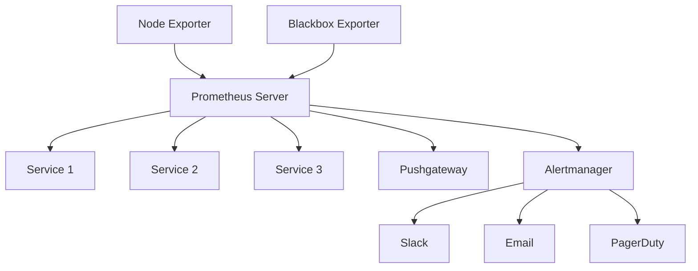
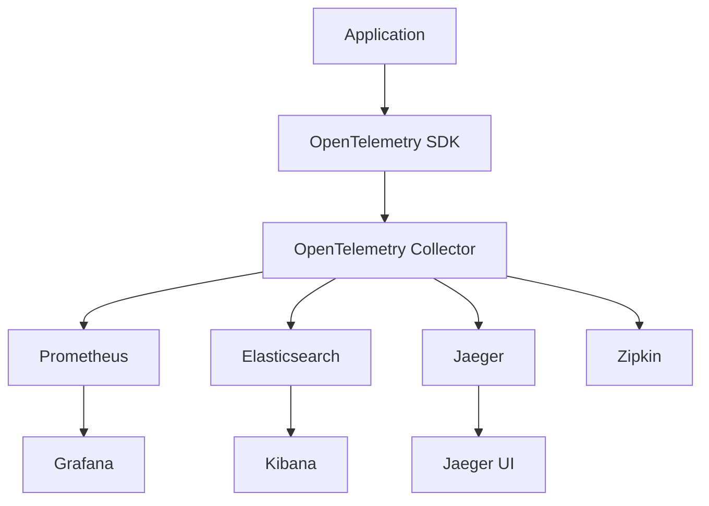

在前几章中，我们探讨了监控的基础概念、关键指标以及健康检查的实现。本文将深入研究微服务监控的工具与技术栈，包括Prometheus、Grafana、OpenTelemetry等主流工具的使用方法和最佳实践，帮助您构建现代化的观测平台。

## 监控工具生态系统概览

现代微服务监控工具生态系统通常包含以下核心组件：

### 数据收集层
- **指标收集**：Prometheus、Telegraf、StatsD
- **日志收集**：Fluentd、Logstash、Filebeat
- **追踪收集**：Jaeger、Zipkin、OpenTelemetry Collector

### 数据存储层
- **时间序列数据库**：Prometheus、InfluxDB、TimescaleDB
- **日志存储**：Elasticsearch、Loki、Splunk
- **追踪存储**：Jaeger、Zipkin、Elasticsearch

### 数据可视化层
- **指标可视化**：Grafana、Kibana、Prometheus UI
- **日志可视化**：Kibana、Grafana Loki、Splunk
- **追踪可视化**：Jaeger UI、Zipkin UI、Grafana Tempo

### 告警管理层
- **告警规则**：Prometheus Alertmanager、Grafana Alerting
- **告警通知**：PagerDuty、Slack、Email、Webhook

## Prometheus监控系统

### Prometheus架构

Prometheus是一个开源的系统监控和告警工具包，采用拉取模式收集指标：



### Prometheus配置

```yaml
# prometheus.yml
global:
  scrape_interval: 15s
  evaluation_interval: 15s
  
rule_files:
  - "alert_rules.yml"
  
alerting:
  alertmanagers:
    - static_configs:
        - targets:
            - alertmanager:9093

scrape_configs:
  # 自监控
  - job_name: 'prometheus'
    static_configs:
      - targets: ['localhost:9090']
  
  # 微服务监控
  - job_name: 'user-service'
    static_configs:
      - targets: ['user-service:8080']
    metrics_path: '/actuator/prometheus'
    relabel_configs:
      - source_labels: [__address__]
        target_label: instance
      - source_labels: [__meta_kubernetes_pod_name]
        target_label: pod
  
  # Kubernetes服务发现
  - job_name: 'kubernetes-pods'
    kubernetes_sd_configs:
      - role: pod
    relabel_configs:
      - source_labels: [__meta_kubernetes_pod_annotation_prometheus_io_scrape]
        action: keep
        regex: true
      - source_labels: [__meta_kubernetes_pod_annotation_prometheus_io_path]
        action: replace
        target_label: __metrics_path__
        regex: (.+)
      - source_labels: [__address__, __meta_kubernetes_pod_annotation_prometheus_io_port]
        action: replace
        regex: ([^:]+)(?::\d+)?;(\d+)
        replacement: $1:$2
        target_label: __address__
```

### Prometheus指标定义

```java
@RestController
public class PrometheusMetricsController {
    
    private final MeterRegistry meterRegistry;
    
    // 计数器指标
    private final Counter httpRequestsTotal;
    
    // 计量器指标
    private final Gauge activeUsers;
    
    // 直方图指标
    private final Timer httpRequestDuration;
    
    // 摘要指标
    private final DistributionSummary httpResponseSize;
    
    public PrometheusMetricsController(MeterRegistry meterRegistry) {
        this.meterRegistry = meterRegistry;
        
        this.httpRequestsTotal = Counter.builder("http_requests_total")
            .description("Total HTTP requests")
            .tags("service", "user-service")
            .register(meterRegistry);
            
        this.activeUsers = Gauge.builder("active_users")
            .description("Number of active users")
            .tags("service", "user-service")
            .register(meterRegistry, this, PrometheusMetricsController::getActiveUserCount);
            
        this.httpRequestDuration = Timer.builder("http_request_duration_seconds")
            .description("HTTP request duration")
            .tags("service", "user-service")
            .publishPercentiles(0.5, 0.95, 0.99)
            .register(meterRegistry);
            
        this.httpResponseSize = DistributionSummary.builder("http_response_size_bytes")
            .description("HTTP response size")
            .tags("service", "user-service")
            .register(meterRegistry);
    }
    
    @GetMapping("/api/users/{id}")
    public User getUser(@PathVariable String id) {
        Timer.Sample sample = Timer.start(meterRegistry);
        
        try {
            User user = userService.findById(id);
            httpRequestsTotal.increment();
            
            // 记录响应大小
            String jsonResponse = objectMapper.writeValueAsString(user);
            httpResponseSize.record(jsonResponse.getBytes().length);
            
            sample.stop(httpRequestDuration);
            return user;
        } catch (Exception e) {
            httpRequestsTotal.increment(Tags.of("status", "error"));
            sample.stop(httpRequestDuration);
            throw e;
        }
    }
    
    private double getActiveUserCount() {
        return userService.getActiveUserCount();
    }
}
```

### Prometheus查询语言(PromQL)

```promql
# 基本查询
http_requests_total

# 带标签过滤
http_requests_total{service="user-service", status="200"}

# 聚合查询
sum(http_requests_total) by (service)

# 速率计算
rate(http_requests_total[5m])

# 分位数计算
histogram_quantile(0.95, rate(http_request_duration_seconds_bucket[5m]))

# 预警查询
rate(http_requests_total{status="500"}[5m]) / rate(http_requests_total[5m]) > 0.01
```

### Prometheus告警规则

```yaml
# alert_rules.yml
groups:
  - name: service_alerts
    rules:
      # 高错误率告警
      - alert: HighErrorRate
        expr: rate(http_requests_total{status="500"}[5m]) / rate(http_requests_total[5m]) > 0.01
        for: 2m
        labels:
          severity: warning
        annotations:
          summary: "High error rate detected"
          description: "Error rate is above 1% for service {{ $labels.service }}"
          
      # 高延迟告警
      - alert: HighLatency
        expr: histogram_quantile(0.95, rate(http_request_duration_seconds_bucket[5m])) > 2
        for: 1m
        labels:
          severity: critical
        annotations:
          summary: "High latency detected"
          description: "95th percentile latency is above 2 seconds for service {{ $labels.service }}"
          
      # 低可用性告警
      - alert: LowAvailability
        expr: up == 0
        for: 1m
        labels:
          severity: critical
        annotations:
          summary: "Service is down"
          description: "Service {{ $labels.job }} is not responding"
```

## Grafana可视化平台

### Grafana仪表板配置

```json
{
  "dashboard": {
    "id": null,
    "title": "Microservices Monitoring Dashboard",
    "tags": ["microservices", "monitoring"],
    "timezone": "browser",
    "schemaVersion": 16,
    "version": 0,
    "panels": [
      {
        "id": 1,
        "type": "graph",
        "title": "Request Rate",
        "gridPos": {
          "x": 0,
          "y": 0,
          "w": 12,
          "h": 6
        },
        "targets": [
          {
            "expr": "rate(http_requests_total[5m])",
            "legendFormat": "{{service}} - {{status}}",
            "refId": "A"
          }
        ],
        "xaxis": {
          "mode": "time"
        },
        "yaxes": [
          {
            "format": "reqps",
            "label": "Requests per second"
          },
          {
            "format": "short"
          }
        ]
      },
      {
        "id": 2,
        "type": "graph",
        "title": "Response Time",
        "gridPos": {
          "x": 12,
          "y": 0,
          "w": 12,
          "h": 6
        },
        "targets": [
          {
            "expr": "histogram_quantile(0.95, rate(http_request_duration_seconds_bucket[5m]))",
            "legendFormat": "{{service}} - 95th percentile",
            "refId": "A"
          },
          {
            "expr": "histogram_quantile(0.50, rate(http_request_duration_seconds_bucket[5m]))",
            "legendFormat": "{{service}} - 50th percentile",
            "refId": "B"
          }
        ],
        "xaxis": {
          "mode": "time"
        },
        "yaxes": [
          {
            "format": "s",
            "label": "Response time"
          },
          {
            "format": "short"
          }
        ]
      },
      {
        "id": 3,
        "type": "singlestat",
        "title": "Error Rate",
        "gridPos": {
          "x": 0,
          "y": 6,
          "w": 6,
          "h": 3
        },
        "targets": [
          {
            "expr": "rate(http_requests_total{status=~\"5..\"}[5m]) / rate(http_requests_total[5m]) * 100",
            "refId": "A"
          }
        ],
        "format": "percent",
        "thresholds": "1,5",
        "colorBackground": true,
        "colors": ["#299c46", "rgba(237, 129, 40, 0.89)", "#d44a3a"]
      },
      {
        "id": 4,
        "type": "graph",
        "title": "System Resources",
        "gridPos": {
          "x": 6,
          "y": 6,
          "w": 18,
          "h": 6
        },
        "targets": [
          {
            "expr": "rate(node_cpu_seconds_total{mode=\"idle\"}[5m]) * 100",
            "legendFormat": "{{instance}} - CPU Idle",
            "refId": "A"
          },
          {
            "expr": "(node_memory_MemTotal_bytes - node_memory_MemAvailable_bytes) / node_memory_MemTotal_bytes * 100",
            "legendFormat": "{{instance}} - Memory Usage",
            "refId": "B"
          }
        ],
        "xaxis": {
          "mode": "time"
        },
        "yaxes": [
          {
            "format": "percent",
            "label": "Percentage"
          },
          {
            "format": "short"
          }
        ]
      }
    ]
  }
}
```

### Grafana告警配置

```yaml
# grafana_alerts.yml
apiVersion: 1
groups:
  - name: microservices-alerts
    rules:
      - alert: HighErrorRate
        expr: |
          rate(http_requests_total{status="500"}[5m]) / 
          rate(http_requests_total[5m]) > 0.01
        for: 2m
        labels:
          severity: warning
        annotations:
          summary: High error rate detected
          description: Error rate is above 1% for service {{ $labels.service }}
          
      - alert: ServiceDown
        expr: up == 0
        for: 1m
        labels:
          severity: critical
        annotations:
          summary: Service is down
          description: Service {{ $labels.job }} is not responding
```

## OpenTelemetry标准

### OpenTelemetry架构

OpenTelemetry是一个可观测性框架，提供统一的API、SDK和工具：



### OpenTelemetry集成

```java
@Configuration
public class OpenTelemetryConfig {
    
    @Bean
    public OpenTelemetry openTelemetry() {
        Resource resource = Resource.getDefault()
            .merge(Resource.create(Attributes.of(
                ResourceAttributes.SERVICE_NAME, "user-service",
                ResourceAttributes.SERVICE_VERSION, "1.2.3"
            )));
        
        SdkMeterProvider meterProvider = SdkMeterProvider.builder()
            .setResource(resource)
            .registerMetricReader(
                PeriodicMetricReader.builder(
                    OtlpGrpcMetricExporter.builder()
                        .setEndpoint("http://otel-collector:4317")
                        .build())
                .build())
            .build();
        
        SdkTracerProvider tracerProvider = SdkTracerProvider.builder()
            .setResource(resource)
            .addSpanProcessor(
                BatchSpanProcessor.builder(
                    OtlpGrpcSpanExporter.builder()
                        .setEndpoint("http://otel-collector:4317")
                        .build())
                .build())
            .build();
        
        return OpenTelemetrySdk.builder()
            .setMeterProvider(meterProvider)
            .setTracerProvider(tracerProvider)
            .build();
    }
}

@RestController
public class OpenTelemetryController {
    
    private final Tracer tracer;
    private final Meter meter;
    
    public OpenTelemetryController(OpenTelemetry openTelemetry) {
        this.tracer = openTelemetry.getTracer("user-service");
        this.meter = openTelemetry.getMeter("user-service");
        
        // 创建指标
        LongCounter requestCounter = meter.counterBuilder("http_requests")
            .setDescription("Number of HTTP requests")
            .setUnit("requests")
            .build();
            
        Histogram responseTimeHistogram = meter.histogramBuilder("http_response_time")
            .setDescription("HTTP response time")
            .setUnit("ms")
            .build();
    }
    
    @GetMapping("/api/users/{id}")
    public User getUser(@PathVariable String id) {
        Span span = tracer.spanBuilder("get-user")
            .setAttribute("user.id", id)
            .startSpan();
            
        try (Scope scope = span.makeCurrent()) {
            long startTime = System.currentTimeMillis();
            
            User user = userService.findById(id);
            
            long duration = System.currentTimeMillis() - startTime;
            responseTimeHistogram.record(duration);
            requestCounter.add(1);
            
            span.setAttribute("user.name", user.getName());
            span.setStatus(StatusCode.OK);
            
            return user;
        } catch (Exception e) {
            span.recordException(e);
            span.setStatus(StatusCode.ERROR, e.getMessage());
            requestCounter.add(1, Attributes.of(stringKey("status"), "error"));
            throw e;
        } finally {
            span.end();
        }
    }
}
```

### OpenTelemetry Collector配置

```yaml
# otel-collector-config.yaml
receivers:
  otlp:
    protocols:
      grpc:
        endpoint: 0.0.0.0:4317
      http:
        endpoint: 0.0.0.0:4318

processors:
  batch:
    timeout: 1s
    send_batch_size: 1000
  memory_limiter:
    limit_mib: 1000
    spike_limit_mib: 200
  attributes:
    actions:
      - key: service.name
        action: upsert
        value: "unknown-service"

exporters:
  prometheus:
    endpoint: "0.0.0.0:8889"
    namespace: "otel"
  elasticsearch:
    endpoints: ["http://elasticsearch:9200"]
    logs_index: "otel-logs"
  jaeger:
    endpoint: jaeger-collector:14250
    tls:
      insecure: true

extensions:
  health_check: {}
  pprof: {}
  zpages: {}

service:
  extensions: [health_check, pprof, zpages]
  pipelines:
    metrics:
      receivers: [otlp]
      processors: [memory_limiter, batch, attributes]
      exporters: [prometheus]
    logs:
      receivers: [otlp]
      processors: [memory_limiter, batch, attributes]
      exporters: [elasticsearch]
    traces:
      receivers: [otlp]
      processors: [memory_limiter, batch, attributes]
      exporters: [jaeger]
```

## 集成日志与监控工具

### Loki + Prometheus集成

```yaml
# loki-config.yaml
auth_enabled: false

server:
  http_listen_port: 3100

ingester:
  lifecycler:
    address: 127.0.0.1
    ring:
      kvstore:
        store: inmemory
      replication_factor: 1
    final_sleep: 0s
  chunk_idle_period: 5m
  chunk_retain_period: 30s

schema_config:
  configs:
    - from: 2020-05-15
      store: boltdb
      object_store: filesystem
      schema: v11
      index:
        prefix: index_
        period: 168h

storage_config:
  boltdb:
    directory: /tmp/loki/index
  filesystem:
    directory: /tmp/loki/chunks

limits_config:
  enforce_metric_name: false
  reject_old_samples: true
  reject_old_samples_max_age: 168h
```

### Grafana Loki数据源配置

```json
{
  "name": "Loki",
  "type": "loki",
  "url": "http://loki:3100",
  "access": "proxy",
  "basicAuth": false,
  "isDefault": false,
  "jsonData": {
    "maxLines": 1000
  }
}
```

### 日志查询示例

```logql
# 基本日志查询
{service="user-service", level="ERROR"}

# 带时间范围的查询
{service="order-service"} |= "timeout" | timestamp >= 1609459200000

# 聚合查询
sum(count_over_time({service="user-service"}[5m])) by (level)

# 日志指标查询
rate({service="payment-service", level="ERROR"}[5m])
```

## 服务网格监控集成

### Istio集成

```yaml
# istio-telemetry.yaml
apiVersion: telemetry.istio.io/v1alpha1
kind: Telemetry
metadata:
  name: mesh-default
  namespace: istio-system
spec:
  metrics:
    - providers:
        - name: prometheus
      overrides:
        - match:
            metric: REQUEST_COUNT
          tagOverrides:
            request_operation:
              value: "string(request.operation)"
            grpc_status_code:
              value: "string(request.grpc_status_code)"
```

### Envoy代理监控

```yaml
# envoy-stats.yaml
static_resources:
  listeners:
    - name: listener_0
      address:
        socket_address:
          address: 0.0.0.0
          port_value: 15001
      filter_chains:
        - filters:
            - name: envoy.filters.network.http_connection_manager
              typed_config:
                "@type": type.googleapis.com/envoy.extensions.filters.network.http_connection_manager.v3.HttpConnectionManager
                stat_prefix: ingress_http
                route_config:
                  name: local_route
                http_filters:
                  - name: envoy.filters.http.router
                    typed_config:
                      "@type": type.googleapis.com/envoy.extensions.filters.http.router.v3.Router
                generate_request_id: true
                tracing:
                  provider:
                    name: envoy.tracers.zipkin
                    typed_config:
                      "@type": type.googleapis.com/envoy.config.trace.v3.ZipkinConfig
                      collector_cluster: zipkin
                      collector_endpoint: "/api/v2/spans"
                      shared_span_context: false
```

## 基于采样的监控

### 自适应采样

```java
@Component
public class AdaptiveSamplingStrategy {
    
    private final MeterRegistry meterRegistry;
    private final Map<String, SamplingRate> samplingRates = new ConcurrentHashMap<>();
    
    public AdaptiveSamplingStrategy(MeterRegistry meterRegistry) {
        this.meterRegistry = meterRegistry;
    }
    
    public boolean shouldSample(String serviceName, String operation) {
        SamplingRate rate = samplingRates.computeIfAbsent(
            serviceName + ":" + operation, 
            k -> new SamplingRate(1.0) // 默认100%采样
        );
        
        // 根据服务负载动态调整采样率
        double currentLoad = getCurrentServiceLoad(serviceName);
        if (currentLoad > 0.8) {
            rate.setRate(Math.max(0.1, rate.getRate() * 0.5)); // 高负载时降低采样率
        } else if (currentLoad < 0.3) {
            rate.setRate(Math.min(1.0, rate.getRate() * 1.2)); // 低负载时提高采样率
        }
        
        return Math.random() < rate.getRate();
    }
    
    private double getCurrentServiceLoad(String serviceName) {
        Gauge cpuGauge = meterRegistry.find("system.cpu.usage")
            .tag("service", serviceName).gauge();
        return cpuGauge != null ? cpuGauge.value() : 0.0;
    }
}
```

### 高效数据存储

```java
@Component
public class EfficientDataStorage {
    
    private final MeterRegistry meterRegistry;
    
    public void configureDataRetention() {
        // 高频指标保留7天
        configureRetention("high_frequency_metrics", Duration.ofDays(7));
        
        // 中频指标保留30天
        configureRetention("medium_frequency_metrics", Duration.ofDays(30));
        
        // 低频指标保留90天
        configureRetention("low_frequency_metrics", Duration.ofDays(90));
        
        // 聚合指标永久保留
        configureRetention("aggregated_metrics", Duration.ofDays(365 * 10));
    }
    
    public void optimizeStorage() {
        // 启用数据压缩
        enableCompression();
        
        // 实现冷热数据分离
        setupHotColdStorage();
        
        // 定期清理过期数据
        scheduleDataCleanup();
    }
}
```

## 监控工具部署架构

### 容器化部署

```dockerfile
# prometheus/Dockerfile
FROM prom/prometheus:v2.40.0
COPY prometheus.yml /etc/prometheus/prometheus.yml
COPY alert_rules.yml /etc/prometheus/alert_rules.yml
EXPOSE 9090
CMD ["--config.file=/etc/prometheus/prometheus.yml", "--storage.tsdb.path=/prometheus"]
```

```dockerfile
# grafana/Dockerfile
FROM grafana/grafana:9.3.0
COPY grafana.ini /etc/grafana/grafana.ini
COPY dashboards /etc/grafana/provisioning/dashboards
COPY datasources /etc/grafana/provisioning/datasources
EXPOSE 3000
```

### Kubernetes部署

```yaml
# prometheus-deployment.yaml
apiVersion: apps/v1
kind: Deployment
metadata:
  name: prometheus
spec:
  replicas: 1
  selector:
    matchLabels:
      app: prometheus
  template:
    metadata:
      labels:
        app: prometheus
    spec:
      containers:
      - name: prometheus
        image: prom/prometheus:v2.40.0
        args:
          - '--config.file=/etc/prometheus/prometheus.yml'
          - '--storage.tsdb.path=/prometheus'
          - '--web.console.libraries=/etc/prometheus/console_libraries'
          - '--web.console.templates=/etc/prometheus/consoles'
        ports:
        - containerPort: 9090
        volumeMounts:
        - name: config-volume
          mountPath: /etc/prometheus
        - name: storage-volume
          mountPath: /prometheus
      volumes:
      - name: config-volume
        configMap:
          name: prometheus-config
      - name: storage-volume
        persistentVolumeClaim:
          claimName: prometheus-pvc
```

```yaml
# grafana-deployment.yaml
apiVersion: apps/v1
kind: Deployment
metadata:
  name: grafana
spec:
  replicas: 1
  selector:
    matchLabels:
      app: grafana
  template:
    metadata:
      labels:
        app: grafana
    spec:
      containers:
      - name: grafana
        image: grafana/grafana:9.3.0
        ports:
        - containerPort: 3000
        env:
        - name: GF_SECURITY_ADMIN_PASSWORD
          value: "admin123"
        volumeMounts:
        - name: grafana-storage
          mountPath: /var/lib/grafana
      volumes:
      - name: grafana-storage
        persistentVolumeClaim:
          claimName: grafana-pvc
```

## 最佳实践

### 1. 监控工具选型

```java
public class MonitoringToolSelection {
    
    // 根据需求选择合适的工具组合
    
    // 简单场景：Prometheus + Grafana
    public static final String SIMPLE_STACK = "Prometheus + Grafana";
    
    // 复杂场景：OpenTelemetry + Prometheus + Grafana + Loki + Tempo
    public static final String COMPLEX_STACK = "OpenTelemetry + Prometheus + Grafana + Loki + Tempo";
    
    // 企业场景：商业解决方案 + 开源工具
    public static final String ENTERPRISE_STACK = "Datadog/NewRelic + Prometheus + Grafana";
    
    public String selectMonitoringStack(DeploymentScenario scenario) {
        switch (scenario) {
            case STARTUP:
                return SIMPLE_STACK;
            case ENTERPRISE:
                return ENTERPRISE_STACK;
            case MICROSERVICES:
                return COMPLEX_STACK;
            default:
                return SIMPLE_STACK;
        }
    }
}
```

### 2. 监控数据治理

```java
@Component
public class MonitoringDataGovernance {
    
    @Scheduled(cron = "0 0 2 * * ?") // 每天凌晨2点执行
    public void enforceDataGovernance() {
        // 实施数据保留策略
        enforceRetentionPolicies();
        
        // 清理过期数据
        cleanupExpiredData();
        
        // 优化存储性能
        optimizeStoragePerformance();
        
        // 验证数据完整性
        validateDataIntegrity();
    }
    
    private void enforceRetentionPolicies() {
        // 不同类型指标的不同保留策略
        Map<String, Duration> retentionPolicies = Map.of(
            "high_frequency", Duration.ofDays(7),
            "medium_frequency", Duration.ofDays(30),
            "low_frequency", Duration.ofDays(90),
            "business_critical", Duration.ofDays(365)
        );
        
        for (Map.Entry<String, Duration> entry : retentionPolicies.entrySet()) {
            applyRetentionPolicy(entry.getKey(), entry.getValue());
        }
    }
}
```

### 3. 监控安全配置

```java
@Configuration
public class MonitoringSecurityConfig {
    
    @Bean
    public SecurityFilterChain monitoringSecurityFilterChain(HttpSecurity http) throws Exception {
        http
            .securityMatcher("/metrics/**", "/actuator/**")
            .authorizeHttpRequests(authorize -> authorize
                .requestMatchers("/metrics/**").hasRole("MONITORING")
                .requestMatchers("/actuator/health").permitAll()
                .requestMatchers("/actuator/**").hasRole("ADMIN")
            )
            .httpBasic(Customizer.withDefaults())
            .csrf(csrf -> csrf.ignoringRequestMatchers("/metrics/**"));
        
        return http.build();
    }
    
    @Bean
    public PrometheusMeterRegistry securedPrometheusMeterRegistry() {
        PrometheusMeterRegistry registry = new PrometheusMeterRegistry(PrometheusConfig.DEFAULT);
        
        // 添加安全中间件
        registry.config().meterFilter(new MeterFilter() {
            @Override
            public Meter.Id map(Meter.Id id) {
                // 过滤敏感指标
                if (id.getName().contains("password") || id.getName().contains("secret")) {
                    return null;
                }
                return id;
            }
        });
        
        return registry;
    }
}
```

## 总结

微服务监控工具与技术栈的选择和配置对系统的可观测性至关重要。通过合理选择和集成Prometheus、Grafana、OpenTelemetry等工具，我们可以构建一个功能强大、性能优良的监控平台。

关键要点包括：
1. 理解不同工具的特点和适用场景
2. 设计合理的架构和部署方案
3. 实施有效的数据治理和安全策略
4. 根据实际需求选择合适的工具组合

在下一章中，我们将探讨分布式追踪与性能分析，包括追踪概念、Jaeger和Zipkin的使用方法，以及如何通过追踪数据进行性能瓶颈分析。