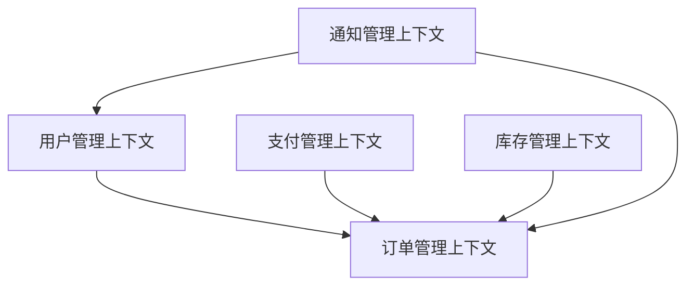

# 附录D：微服务架构模板与设计文档

在微服务架构的设计和实施过程中，标准化的文档模板和设计流程对于确保项目成功至关重要。本附录将为您提供一套完整的微服务架构设计文档模板，帮助您规范设计流程，提高团队协作效率，确保架构设计的一致性和可维护性。

## 微服务架构设计文档模板

### 1. 服务概述文档模板

#### 1.1 基本信息

| 项目 | 内容 |
|------|------|
| 服务名称 |  |
| 服务版本 |  |
| 负责团队 |  |
| 技术栈 |  |
| 创建日期 |  |
| 最后更新 |  |

#### 1.2 服务目标

**业务目标**：
- [ ] 描述该服务要实现的核心业务功能
- [ ] 明确服务在整体业务架构中的定位
- [ ] 说明服务存在的业务价值

**技术目标**：
- [ ] 描述服务的技术实现目标
- [ ] 明确服务的性能、可扩展性等非功能性需求
- [ ] 说明服务的技术选型理由

#### 1.3 服务边界

**服务职责**：
- [ ] 明确服务的核心职责范围
- [ ] 列出服务主要处理的业务领域
- [ ] 说明服务不负责的内容

**数据边界**：
- [ ] 描述服务管理的数据范围
- [ ] 明确数据的所有权归属
- [ ] 说明与其他服务的数据交互方式

#### 1.4 依赖关系

**上游依赖**：
- [ ] 列出该服务依赖的其他服务
- [ ] 说明依赖的服务提供的核心功能
- [ ] 描述依赖的通信方式和协议

**下游依赖**：
- [ ] 列出依赖该服务的其他服务
- [ ] 说明为下游服务提供的核心功能
- [ ] 描述服务间的接口规范

### 2. 领域模型设计文档模板

#### 2.1 领域划分

**限界上下文**：


**上下文映射**：
- [ ] 描述各限界上下文间的关系类型（合作关系、客户-供应商关系等）
- [ ] 说明上下文间的交互方式
- [ ] 明确数据一致性要求

#### 2.2 核心实体

**用户实体**：
```java
public class User {
    private Long id;
    private String username;
    private String email;
    private String phoneNumber;
    private UserProfile profile;
    private List<UserRole> roles;
    private LocalDateTime createdAt;
    private LocalDateTime updatedAt;
    
    // 构造函数、getter、setter方法
}
```

**实体属性说明**：
| 属性名 | 类型 | 必填 | 说明 |
|--------|------|------|------|
| id | Long | 是 | 用户唯一标识 |
| username | String | 是 | 用户名 |
| email | String | 是 | 邮箱地址 |
| phoneNumber | String | 否 | 手机号码 |
| profile | UserProfile | 否 | 用户详细信息 |
| roles | List<UserRole> | 是 | 用户角色列表 |
| createdAt | LocalDateTime | 是 | 创建时间 |
| updatedAt | LocalDateTime | 是 | 更新时间 |

#### 2.3 值对象

**地址值对象**：
```java
public class Address {
    private String country;
    private String province;
    private String city;
    private String district;
    private String street;
    private String postalCode;
    
    // 构造函数、getter、setter方法
    // 重写equals和hashCode方法
}
```

#### 2.4 聚合根

**订单聚合根**：
```java
public class Order {
    private Long id;
    private String orderNumber;
    private Long userId;
    private List<OrderItem> items;
    private BigDecimal totalAmount;
    private OrderStatus status;
    private Address shippingAddress;
    private LocalDateTime createdAt;
    private LocalDateTime updatedAt;
    
    // 业务方法
    public void addItem(OrderItem item) {
        this.items.add(item);
        recalculateTotal();
    }
    
    public void removeItem(OrderItem item) {
        this.items.remove(item);
        recalculateTotal();
    }
    
    private void recalculateTotal() {
        this.totalAmount = items.stream()
            .map(item -> item.getPrice().multiply(BigDecimal.valueOf(item.getQuantity())))
            .reduce(BigDecimal.ZERO, BigDecimal::add);
    }
    
    // 状态变更方法
    public void confirm() {
        if (this.status == OrderStatus.PENDING) {
            this.status = OrderStatus.CONFIRMED;
        }
    }
}
```

### 3. API设计文档模板

#### 3.1 RESTful API规范

**API设计原则**：
1. 使用名词而非动词表示资源
2. 使用复数形式表示资源集合
3. 合理使用HTTP方法
4. 统一的响应格式
5. 适当的错误处理

**HTTP方法映射**：
| 方法 | 用途 | 幂等性 | 安全性 |
|------|------|--------|--------|
| GET | 获取资源 | 是 | 是 |
| POST | 创建资源 | 否 | 否 |
| PUT | 更新资源 | 是 | 否 |
| PATCH | 部分更新 | 否 | 否 |
| DELETE | 删除资源 | 是 | 否 |

#### 3.2 用户管理API

**获取用户信息**：
```http
GET /api/v1/users/{userId}
```

**请求参数**：
| 参数名 | 类型 | 必填 | 说明 |
|--------|------|------|------|
| userId | Long | 是 | 用户ID |

**响应示例**：
```json
{
  "code": 200,
  "message": "success",
  "data": {
    "id": 1001,
    "username": "john_doe",
    "email": "john.doe@example.com",
    "profile": {
      "firstName": "John",
      "lastName": "Doe",
      "birthDate": "1990-01-01",
      "gender": "MALE"
    },
    "roles": ["USER", "CUSTOMER"],
    "createdAt": "2025-01-01T10:00:00Z",
    "updatedAt": "2025-01-01T10:00:00Z"
  }
}
```

**创建用户**：
```http
POST /api/v1/users
```

**请求体**：
```json
{
  "username": "jane_smith",
  "email": "jane.smith@example.com",
  "password": "secure_password",
  "profile": {
    "firstName": "Jane",
    "lastName": "Smith",
    "birthDate": "1992-05-15",
    "gender": "FEMALE"
  }
}
```

**响应示例**：
```json
{
  "code": 201,
  "message": "User created successfully",
  "data": {
    "id": 1002,
    "username": "jane_smith",
    "email": "jane.smith@example.com",
    "profile": {
      "firstName": "Jane",
      "lastName": "Smith",
      "birthDate": "1992-05-15",
      "gender": "FEMALE"
    },
    "roles": ["USER"],
    "createdAt": "2025-08-31T15:30:00Z"
  }
}
```

### 4. 数据库设计文档模板

#### 4.1 数据库选型

**选型考虑因素**：
- 数据一致性要求
- 读写性能需求
- 扩展性要求
- 团队技术栈熟悉度
- 成本考虑

**推荐方案**：
- 主数据库：PostgreSQL（关系型，支持复杂查询）
- 缓存数据库：Redis（高性能读取）
- 搜索引擎：Elasticsearch（全文搜索）
- 消息队列：Apache Kafka（异步处理）

#### 4.2 核心表结构

**用户表（users）**：
```sql
CREATE TABLE users (
    id BIGSERIAL PRIMARY KEY,
    username VARCHAR(50) NOT NULL UNIQUE,
    email VARCHAR(100) NOT NULL UNIQUE,
    password_hash VARCHAR(255) NOT NULL,
    phone_number VARCHAR(20),
    status VARCHAR(20) NOT NULL DEFAULT 'ACTIVE',
    created_at TIMESTAMP NOT NULL DEFAULT CURRENT_TIMESTAMP,
    updated_at TIMESTAMP NOT NULL DEFAULT CURRENT_TIMESTAMP,
    
    CONSTRAINT chk_user_status CHECK (status IN ('ACTIVE', 'INACTIVE', 'SUSPENDED'))
);

CREATE INDEX idx_users_username ON users(username);
CREATE INDEX idx_users_email ON users(email);
CREATE INDEX idx_users_status ON users(status);
```

**订单表（orders）**：
```sql
CREATE TABLE orders (
    id BIGSERIAL PRIMARY KEY,
    order_number VARCHAR(50) NOT NULL UNIQUE,
    user_id BIGINT NOT NULL,
    total_amount DECIMAL(10,2) NOT NULL,
    status VARCHAR(20) NOT NULL DEFAULT 'PENDING',
    shipping_address JSONB,
    payment_id BIGINT,
    created_at TIMESTAMP NOT NULL DEFAULT CURRENT_TIMESTAMP,
    updated_at TIMESTAMP NOT NULL DEFAULT CURRENT_TIMESTAMP,
    
    CONSTRAINT fk_orders_user FOREIGN KEY (user_id) REFERENCES users(id),
    CONSTRAINT chk_order_status CHECK (status IN ('PENDING', 'CONFIRMED', 'PAID', 'SHIPPED', 'DELIVERED', 'CANCELLED'))
);

CREATE INDEX idx_orders_user_id ON orders(user_id);
CREATE INDEX idx_orders_order_number ON orders(order_number);
CREATE INDEX idx_orders_status ON orders(status);
CREATE INDEX idx_orders_created_at ON orders(created_at);
```

### 5. 部署架构文档模板

#### 5.1 容器化配置

**Dockerfile**：
```dockerfile
# 多阶段构建
# 构建阶段
FROM maven:3.8.4-openjdk-11 AS builder
WORKDIR /app
COPY pom.xml .
COPY src ./src
RUN mvn clean package -DskipTests

# 运行阶段
FROM openjdk:11-jre-slim
WORKDIR /app

# 创建非root用户
RUN addgroup --system appgroup && \
    adduser --system --group appgroup appuser

# 复制应用文件
COPY --from=builder /app/target/*.jar app.jar
COPY --from=builder /app/src/main/resources/application.yml ./config/

# 设置权限
RUN chown -R appuser:appgroup /app
USER appuser

# 健康检查
HEALTHCHECK --interval=30s --timeout=3s --start-period=60s --retries=3 \
    CMD curl -f http://localhost:8080/actuator/health || exit 1

EXPOSE 8080
ENTRYPOINT ["java", "-jar", "app.jar"]
```

**Kubernetes部署配置**：
```yaml
apiVersion: apps/v1
kind: Deployment
metadata:
  name: user-service
  labels:
    app: user-service
spec:
  replicas: 3
  selector:
    matchLabels:
      app: user-service
  template:
    metadata:
      labels:
        app: user-service
    spec:
      containers:
      - name: user-service
        image: user-service:latest
        ports:
        - containerPort: 8080
        env:
        - name: SPRING_PROFILES_ACTIVE
          value: "production"
        - name: DATABASE_URL
          valueFrom:
            secretKeyRef:
              name: user-service-secrets
              key: database-url
        resources:
          requests:
            memory: "512Mi"
            cpu: "250m"
          limits:
            memory: "1Gi"
            cpu: "500m"
        livenessProbe:
          httpGet:
            path: /actuator/health/liveness
            port: 8080
          initialDelaySeconds: 60
          periodSeconds: 30
        readinessProbe:
          httpGet:
            path: /actuator/health/readiness
            port: 8080
          initialDelaySeconds: 30
          periodSeconds: 10
---
apiVersion: v1
kind: Service
metadata:
  name: user-service
spec:
  selector:
    app: user-service
  ports:
  - protocol: TCP
    port: 80
    targetPort: 8080
  type: ClusterIP
```

#### 5.2 配置管理

**ConfigMap配置**：
```yaml
apiVersion: v1
kind: ConfigMap
metadata:
  name: user-service-config
data:
  application.yml: |
    server:
      port: 8080
    
    spring:
      datasource:
        hikari:
          maximum-pool-size: 20
          minimum-idle: 5
          
    logging:
      level:
        com.example.userservice: INFO
        
    management:
      endpoints:
        web:
          exposure:
            include: health,info,metrics
```

**Secret配置**：
```yaml
apiVersion: v1
kind: Secret
metadata:
  name: user-service-secrets
type: Opaque
data:
  database-password: base64_encoded_password
  jwt-secret: base64_encoded_jwt_secret
```

### 6. 监控告警文档模板

#### 6.1 监控指标定义

**应用层指标**：
- 请求处理时间（p95, p99）
- 请求成功率（>99.5%）
- 并发请求数
- 错误率（<0.1%）

**系统层指标**：
- CPU使用率（<80%）
- 内存使用率（<85%）
- 磁盘使用率（<90%）
- 网络IO

**业务层指标**：
- 用户注册量
- 订单创建量
- 支付成功率
- 用户活跃度

#### 6.2 告警规则配置

**Prometheus告警规则**：
```yaml
groups:
- name: user-service-alerts
  rules:
  - alert: HighErrorRate
    expr: sum(rate(http_requests_total{job="user-service", status=~"5.."}[5m])) 
         / sum(rate(http_requests_total{job="user-service"}[5m])) > 0.01
    for: 5m
    labels:
      severity: critical
    annotations:
      summary: "User service high error rate"
      description: "Error rate is above 1% for more than 5 minutes"

  - alert: HighLatency
    expr: histogram_quantile(0.95, sum(rate(http_request_duration_seconds_bucket{job="user-service"}[5m])) by (le)) > 2
    for: 5m
    labels:
      severity: warning
    annotations:
      summary: "User service high latency"
      description: "95th percentile latency is above 2 seconds"

  - alert: HighMemoryUsage
    expr: (container_memory_usage_bytes{container="user-service"} / container_spec_memory_limit_bytes{container="user-service"}) > 0.85
    for: 5m
    labels:
      severity: warning
    annotations:
      summary: "User service high memory usage"
      description: "Memory usage is above 85%"
```

### 7. 安全设计文档模板

#### 7.1 认证授权方案

**OAuth2 + JWT实现**：
```java
@Configuration
@EnableWebSecurity
@EnableGlobalMethodSecurity(prePostEnabled = true)
public class SecurityConfig extends WebSecurityConfigurerAdapter {
    
    @Autowired
    private JwtTokenProvider tokenProvider;
    
    @Override
    protected void configure(HttpSecurity http) throws Exception {
        http.csrf().disable()
            .sessionManagement().sessionCreationPolicy(SessionCreationPolicy.STATELESS)
            .and()
            .authorizeRequests()
            .antMatchers("/api/public/**").permitAll()
            .antMatchers("/api/auth/**").permitAll()
            .anyRequest().authenticated()
            .and()
            .apply(new JwtConfigurer(tokenProvider));
    }
}
```

#### 7.2 数据安全措施

**敏感数据加密**：
```java
@Entity
@Table(name = "users")
public class User {
    @Id
    @GeneratedValue(strategy = GenerationType.IDENTITY)
    private Long id;
    
    @Column(nullable = false, unique = true)
    private String username;
    
    @Column(nullable = false, unique = true)
    private String email;
    
    @Convert(converter = EncryptedStringConverter.class)
    @Column(name = "phone_number")
    private String phoneNumber;
    
    // getters and setters
}

@Converter
public class EncryptedStringConverter implements AttributeConverter<String, String> {
    
    @Override
    public String convertToDatabaseColumn(String attribute) {
        return EncryptionUtil.encrypt(attribute);
    }
    
    @Override
    public String convertToEntityAttribute(String dbData) {
        return EncryptionUtil.decrypt(dbData);
    }
}
```

### 8. 测试策略文档模板

#### 8.1 测试分层策略

**单元测试**：
```java
@ExtendWith(MockitoExtension.class)
class UserServiceTest {
    
    @Mock
    private UserRepository userRepository;
    
    @InjectMocks
    private UserService userService;
    
    @Test
    void shouldCreateUserSuccessfully() {
        // Given
        UserRequest request = new UserRequest("john", "john@example.com");
        User user = new User(1L, "john", "john@example.com");
        
        when(userRepository.save(any(User.class))).thenReturn(user);
        
        // When
        User result = userService.createUser(request);
        
        // Then
        assertThat(result.getUsername()).isEqualTo("john");
        assertThat(result.getEmail()).isEqualTo("john@example.com");
        verify(userRepository).save(any(User.class));
    }
}
```

**集成测试**：
```java
@SpringBootTest
@Testcontainers
class UserIntegrationTest {
    
    @Container
    static PostgreSQLContainer<?> postgres = new PostgreSQLContainer<>("postgres:13")
            .withDatabaseName("testdb")
            .withUsername("test")
            .withPassword("test");
    
    @DynamicPropertySource
    static void configureProperties(DynamicPropertyRegistry registry) {
        registry.add("spring.datasource.url", postgres::getJdbcUrl);
        registry.add("spring.datasource.username", postgres::getUsername);
        registry.add("spring.datasource.password", postgres::getPassword);
    }
    
    @Autowired
    private TestRestTemplate restTemplate;
    
    @Test
    void shouldCreateUserViaAPI() {
        // Given
        UserRequest request = new UserRequest("jane", "jane@example.com");
        
        // When
        ResponseEntity<UserResponse> response = restTemplate.postForEntity(
                "/api/users", request, UserResponse.class);
        
        // Then
        assertThat(response.getStatusCode()).isEqualTo(HttpStatus.CREATED);
        assertThat(response.getBody().getUsername()).isEqualTo("jane");
    }
}
```

#### 8.2 性能测试方案

**JMeter测试计划**：
```xml
<TestPlan>
  <ThreadGroup>
    <stringProp name="ThreadGroup.num_threads">100</stringProp>
    <stringProp name="ThreadGroup.ramp_time">30</stringProp>
    <stringProp name="ThreadGroup.duration">300</stringProp>
    
    <HTTPSamplerProxy>
      <stringProp name="HTTPSampler.domain">user-service.example.com</stringProp>
      <stringProp name="HTTPSampler.port">80</stringProp>
      <stringProp name="HTTPSampler.path">/api/v1/users/1</stringProp>
      <stringProp name="HTTPSampler.method">GET</stringProp>
    </HTTPSamplerProxy>
  </ThreadGroup>
</TestPlan>
```

## 架构决策记录模板

### ADR-001: 服务拆分策略

**状态**: 已接受

**背景**: 随着业务发展，单体应用变得臃肿，需要进行服务拆分。

**决策**: 采用按业务领域拆分的策略，将用户、订单、支付等功能拆分为独立服务。

**后果**:
- 优点：提高开发效率，降低服务间耦合
- 缺点：增加分布式系统复杂性，需要处理数据一致性问题

**相关链接**:
- [服务拆分指南](./service-decomposition-guide.md)
- [数据一致性方案](./data-consistency-strategy.md)

## 总结

通过使用这套标准化的微服务架构设计文档模板，您可以：

1. **规范设计流程**：确保每个服务都经过完整的架构设计过程
2. **提高团队协作**：统一的文档格式便于团队成员理解和协作
3. **降低沟通成本**：标准化的模板减少了沟通中的歧义
4. **保障质量**：全面的检查项确保不遗漏重要设计考虑
5. **便于维护**：结构化的文档便于后续维护和演进

建议您根据具体项目需求对模板进行适当调整，但核心的结构和要素应保持一致。通过持续使用和完善这些模板，您的团队将能够更高效地设计和实施微服务架构。